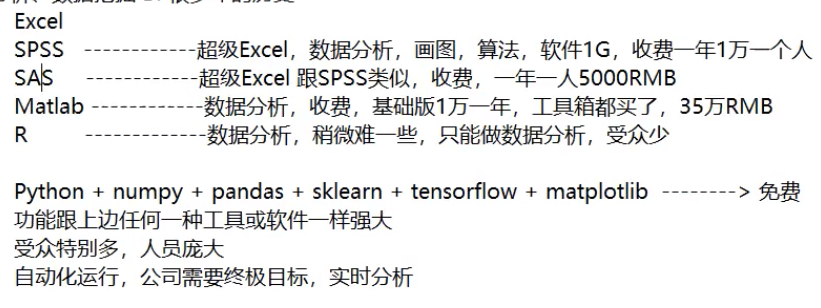
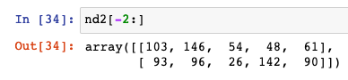

[TOC]

# 1. 开发环境搭建

## 1.1 anaconda下载安装

清华镜像下载地址：

https://mirrors.tuna.tsinghua.edu.cn/anaconda/archive/


# 2. 大数据竞赛平台

## 2.1 阿里天池大数据竞赛平台

https://tianchi.aliyun.com/competition/gameList/activeList

## 2.2 kaggle

https://www.kaggle.com/

# 3. 概念介绍

**数据分析、数据挖掘  通常称为BI,有很多年的历史了**




**机器学习算法工程师、人工智能 通常称为AI**

算法工程师，薪资很高，条件严格


# 4. Jupyter 

## 4.1 jupyter介绍

jupyter,数据分析开发工具，在浏览器中编写代码

使用如下命令启动jupyter:

```bash
jupyter notebook
```

命令行需要一直运行，命令行中写代码，映射到浏览器，写代码灵活

## 4.2 jupyter的使用

启动jupyter的位置在哪里，浏览器的目录就在哪里

## 4.3 jupyter的使用规则


代码文件的后缀名为.ipynb ipython notebook

jupyter 继承ipython

Jupyter中有运行单元，写代码的规则和python完全一样

状态栏Run,单击运行，

快捷键 

Ctrl + Enter运行  选中本单元

Alt + Enter运行  插入新的一行

Shift + Enter运行 选中下一个单元

### 4.3.1 插入新的代码单元

a在选中代码前面插入新的代码单元，a是above的缩写

b在选中代码后面插入新的代码单元，b是below的缩写

### 4.3.2 删除代码单元

双击D

### 4.3.3 代码提示

tab键

### 4.3.4 代码方法API

Shift + Tab

### 4.3.5 单行代码执行耗时


### 4.3.6 多行代码执行耗时


### 4.3.7 代码平均运行时间


### 4.3.8 列出常用魔法指令


魔法指令使jupyter更加灵活

### 4.3.9 markdown

输入m可以将code模式转换成markdown模式

​	

# 5. numpy

numpy:numeric python

Numpy包的核心是ndarray对象，n为数组

## 5.1基本使用


## 5.2 随机创建函数切片操作级联&reshape

前提条件 import numpy

```python
import numpy as np
```

### 5.2.1 创建一个5行5列元素全是1的二维数组


### 5.2.2 创建一个元素全都为0的三维数组


### 5.2.3 创建一个全部是某一个任意值的数组


### 5.2.4 对角线为1其他全是0


### 5.2.5 等差数列


区间左闭右开

### 5.2.6 生成数组


### 5.2.7 随机数生成


上面的是指定个数，也可以如下图所示指定数组的维度


### 5.2.8 标准正态分布


正态分布的平均值是0，方差是1

### 5.2.9 正态分布


指定小数点保留的位数


计算平均值


计算方差


计算标准差


### 5.2.10 生成[0.0,1.0)的随机数


###  5.2.11 查看ndarray的属性

+ 大小

  

+ Shape(形状)

  

+ 维数

  

+ 数据类型

  

## 5.3 ndarray的基本操作

### 	5.3.1 索引


ndarray索引和列表完全一致，多维索引和一维二维索引规律完全相同，多维索引复杂一些

### 5.3.2 切片


获取最后两行的数据



翻转


间隔取数据


### 5.3.3 图片数据

图片数据是ndarray

彩色图片三维:高度、宽度、像素(表示不同的颜色)


上图中三列分别表示 行、列、像素

### 5.3.4 变形


### 5.3.5 级联


### 5.3.6 切分


### 5.3.7 聚合操作

1. 求和

   

2. 最大值、最小值

3. 其他聚合操作

   

## 5.4 统计学

平均值、中位数、方差(自己求)、标准差、协方差(两个属性求解)、关联(相关性系数，一个男生的猥琐程度和他受女生欢迎程度之间的关系，范围是[-1,1])


## 5.5 广播机制


## 5.6 中文文档

https://www.numpy.org.cn/


# 6. Opencv

Opencv:Open  Computer Vision 开源计算机视觉

opencv是c++写的

Python调用cv2模块中的方法就可以了

cv2读取图片路径中不能包含中文，不然数据读取不出来

使用cv2显示图片


