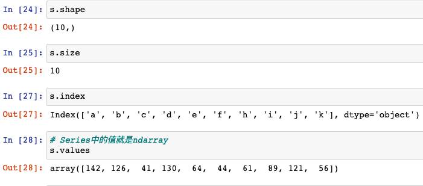

[TOC]

# 1. 开发环境搭建

## 1.1 anaconda下载安装

清华镜像下载地址：

https://mirrors.tuna.tsinghua.edu.cn/anaconda/archive/


# 2. 大数据竞赛平台

## 2.1 阿里天池大数据竞赛平台

https://tianchi.aliyun.com/competition/gameList/activeList

## 2.2 kaggle

https://www.kaggle.com/

# 3. 概念介绍

**数据分析、数据挖掘  通常称为BI,有很多年的历史了**


**机器学习算法工程师、人工智能 通常称为AI**

算法工程师，薪资很高，条件严格


# 4. Jupyter 

## 4.1 jupyter介绍

jupyter,数据分析开发工具，在浏览器中编写代码

使用如下命令启动jupyter:

```bash
jupyter notebook
```

命令行需要一直运行，命令行中写代码，映射到浏览器，写代码灵活

## 4.2 jupyter的使用

启动jupyter的位置在哪里，浏览器的目录就在哪里

## 4.3 jupyter的使用规则


代码文件的后缀名为.ipynb ipython notebook

jupyter 继承ipython

Jupyter中有运行单元，写代码的规则和python完全一样

状态栏Run,单击运行，

快捷键 

Ctrl + Enter运行  选中本单元

Alt + Enter运行  插入新的一行

Shift + Enter运行 选中下一个单元

### 4.3.1 插入新的代码单元

a在选中代码前面插入新的代码单元，a是above的缩写

b在选中代码后面插入新的代码单元，b是below的缩写

### 4.3.2 删除代码单元

双击D

### 4.3.3 代码提示

tab键

### 4.3.4 代码方法API

Shift + Tab

### 4.3.5 单行代码执行耗时


### 4.3.6 多行代码执行耗时


### 4.3.7 代码平均运行时间


### 4.3.8 列出常用魔法指令


魔法指令使jupyter更加灵活

### 4.3.9 markdown

输入m可以将code模式转换成markdown模式

​	

# 5. numpy

numpy:numeric python

Numpy包的核心是ndarray对象，n为数组

## 5.1基本使用


## 5.2 随机创建函数切片操作级联&reshape

前提条件 import numpy

```python
import numpy as np
```

### 5.2.1 创建一个5行5列元素全是1的二维数组


### 5.2.2 创建一个元素全都为0的三维数组


### 5.2.3 创建一个全部是某一个任意值的数组


### 5.2.4 对角线为1其他全是0


### 5.2.5 等差数列


区间左闭右开

### 5.2.6 生成数组


### 5.2.7 随机数生成


上面的是指定个数，也可以如下图所示指定数组的维度


### 5.2.8 标准正态分布


正态分布的平均值是0，方差是1

### 5.2.9 正态分布


指定小数点保留的位数


计算平均值


计算方差


计算标准差


### 5.2.10 生成[0.0,1.0)的随机数


###  5.2.11 查看ndarray的属性

+ 大小

  

+ Shape(形状)

  

+ 维数

  

+ 数据类型

  

## 5.3 ndarray的基本操作

### 	5.3.1 索引


ndarray索引和列表完全一致，多维索引和一维二维索引规律完全相同，多维索引复杂一些

### 5.3.2 切片


获取最后两行的数据


翻转


间隔取数据


### 5.3.3 图片数据

图片数据是ndarray

彩色图片三维:高度、宽度、像素(表示不同的颜色)


上图中三列分别表示 行、列、像素

### 5.3.4 变形


### 5.3.5 级联


### 5.3.6 切分


### 5.3.7 聚合操作

1. 求和

   

2. 最大值、最小值

3. 其他聚合操作

   

## 5.4 统计学

平均值、中位数、方差(自己求)、标准差、协方差(两个属性求解)、关联(相关性系数，一个男生的猥琐程度和他受女生欢迎程度之间的关系，范围是[-1,1])


## 5.5 广播机制


## 5.6 中文文档

https://www.numpy.org.cn/


# 6. Opencv

Opencv:Open  Computer Vision 开源计算机视觉

opencv是c++写的

Python调用cv2模块中的方法就可以了

cv2读取图片路径中不能包含中文，不然数据读取不出来

使用cv2显示图片


# 7.ffmpeg

## 7.1 截取有声视频命令

```bash
ffmpeg -ss 00:00:00 -i video1.mp4 -acodec copy -vcodec copy -t 00:04:04 video2.mp4
```

## 7.2 从视频中提取无声视频

```bash
ffmpeg -i video1.mp4 -vcodec copy -an video2.mp4
```

# 8.pandas

## 8.1 基本概念介绍

pandas:Python Data Analysis Library

pandas是基于numpy的一种工具，该工具是为了解决数据分析任务而创建的

pandas纳入了大量库和一些标准的数据模型，提供了高效的操作大型数据集所需要的工具

pandas提供了大量能使我们快速便捷地处理数据的函数和方法

pandas是使python称为数据分析强大语言的原因，最重要的就是DataFrame(数据表格，相当于excel,二维:行和列)，Series(一维)

## 8.2 Series

Series是一种类似于一维数组的对象，由以下两个部分组成：

+ values:一组数据(ndarray类型)
+ index:相关的数据索引标签

### 8.2.1 Series的创建

有两种方式

1. 由列表或numpy数组创建

   默认索引为0到N-1的整数型索引

   

   

2. 由字典创建


### 8.2.2 Series的索引和切片

可以使用中括号取单个索引(此时返回的是元素类型)或者中括号里一个列表取多个索引(此时返回的仍然是一个Series类型)。

索引分为显式索引和隐式索引

1. 显式索引

   + 使用index中的元素作为索引值
   + 使用`.loc[]`(推荐)

   注意此时是闭区间

2. 隐式索引

   + 使用整数作为索引值
   + 使用`.iloc[]`(推荐)

   注意此时是半开区间

### 8.2.3 Series的基本概念

+ 可以把Series看成一个定长的有序字典

+ 可以通过shape,size,index,values等得到series的属性



+ 可以通过head(),tail()快速查看Series对象的样式


+ 当索引没有对应的值时，可能出现缺失数据显示NaN(Not a Number)的情况


+ 可以使用pd.isnull(),pd.notnull()或自带isnull(),notnull()函数检测缺失数据


+ Series对象本身及其实例都有一个name属性

  

+ Series是对Numpy的升级，numpy中有的，Series都有

### 8.2.4 Series的运算

1. 适用于numpy的数组运算也适用于Series

   

   

   

   

2. Series之间的运算

   + 在运算中自动对齐不同索引的数据
   + 如果索引不对应，则补NaN
   + 注意：要想保留所有的index,则需要使用`.add()`函数

   Series对象之间的运算，索引要对应

   
   


## 8.3 DataFrame(非常重要)

### 8.3.1 创建

最常用的方法是传递一个字典来创建。DataFrame以字典的键作为每一【列】 的名称，以字典的值(一个数组)作为每一列，此外，DataFrame会自动加上每一行的索引(和Series一样)

同Series一样，若传入的列与字典的键不匹配，则相应的值为NaN


DataFrame属性：values、columns、index、shape


### 8.3.2 索引

1. 对列进行索引

   + 通过类似字典的方式
   + 通过属性的方式

   可以将DataFrame的列获取为一个Series。返回的Series拥有原DataFrame相同的索引，且name属性也已经设置好了，就是相应的列名

2. 对行进行索引

   + 使用.ix[]来进行行索引
   + 使用.loc[]加index来进行行索引
   + 使用.iloc[]加整数来进行行索引

   注意：直接使用中括号时：

   + 索引表示的是列索引
   + 切片表示的是行切片

   直接使用[]不能对列进行切片，可以对行进行切片

### 8.3.3 DataFrame的运算

1. DataFrame之间的运算

   同Series一样：

   + 在运算中自动对齐不同索引的数据
   + 如果索引不对应，则补NaN


### 8.3.4 常用方法

+ min
+ max
+ std
+ corr
+ var
+ cov


## 8.4 处理缺失数据

有两种缺失数据：

+ None

+ np.nan(NaN)

  np.nan是浮点类型，能参与到计算中，但计算的结果总是NaN,但可以使用np.nan*()函数来计算nan,此时视nan为0

处理空数据的方法：

+ 如果空数据不多，可以直接删除

+ 填充

  无论什么样的填充方式，"假数据"应该尽量让数据合理，可以采用的填充如下：

  中位数、平均值、众数、前置填充、后置填充、局部平均值、算法填充、拉格朗日中值


## 8.5 多层索引

DataFrame和Series创建多层索引的方式一样

多层所以可以是行，也可以是列

## 8.6 stack和unstack

stack:列变成行

unstack:行变列

多层Series通过unstack转变成DataFrame

## 8.7 数据分组聚合操作

pandas数据集成：

​	数据可能分散在不同文件中，合并都一起

​	numpy级联操作，axis注意

​	pandas级联操作和numpy类似

​	一般级联：行方向进行级联，不同表，可以级联必然是属性相同，大部分情况都是使用的这种级联方式


# 9.关于axis的总结

Numpy中只要掌握axis计算方向

Pandas计算时，也需要注意axis概念

Pandas只有两个轴:index,columns

axis=0 --> index

axis=1 --> columns


# 10. scipy

Sience python:高端科学计算库


# 11. KNN

K近邻算法

K:k个数

N:Nearest

N:neighbor

数学根据远近进行分类

距离：欧几里得距离

Python 大数据与人工智能该看P71

   


