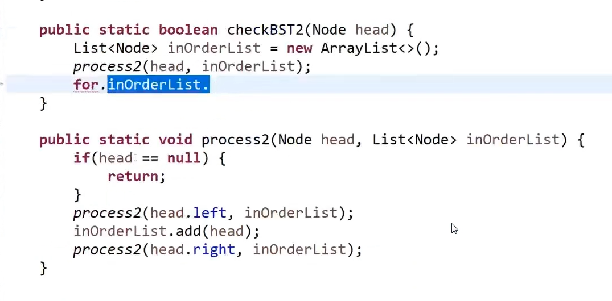
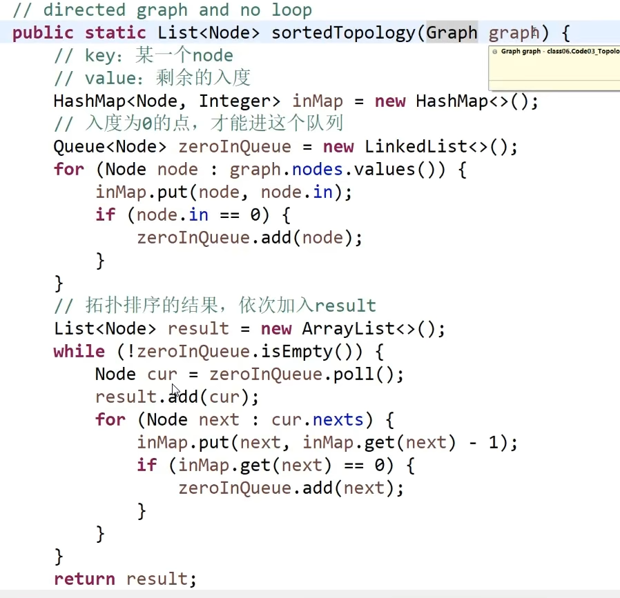
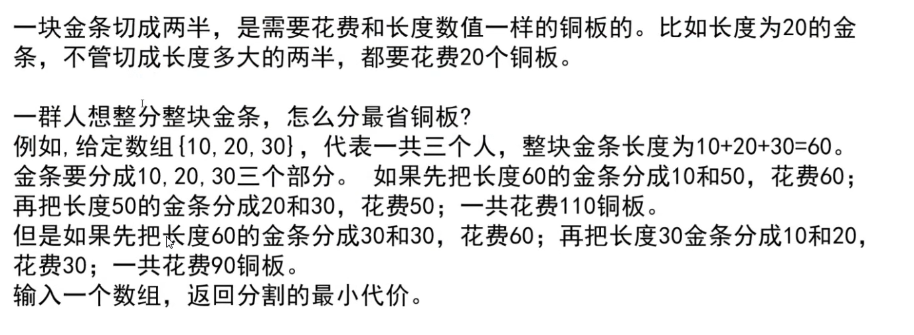

# 算法相关技术总结
## 1. hash算法
### 1.1 murmurhash
https://github.com/spaolacci/murmur3


# 2. 排序算法

## 2.1 选择排序

### 2.1.1 算法原理

遍历一遍待排序元素，找出最小元素与第一个位置的元素进行交换

遍历第2~N个元素，找出这些元素中的最小元素与第二个位置的元素进行交换

...


### 2.1.2 算法实现


其中交换一个数组中两个位置的值也可以按照如下方法实现


### 2.1.3 复杂度分析

时间复杂度是O(N^2)

空间复杂度O(1)

## 2.2 冒泡排序

### 2.2.1 算法原理

相邻两个元素比较大小，如果逆序，则交换


### 2.2.2 算法实现


### 2.2.3 复杂度分析

时间复杂度O(N^2)


## 2.3 插入排序

### 2.3.1 算法原理


### 2.3.2 算法实现


### 2.3.3 复杂度分析

时间复杂度O(N^2),额外空间复杂度O(1)


## 2.4 归并排序

### 2.4.1 算法原理

整体就是一个简单递归，左边排好序，右边排好序，让其整体有序

让其整体有序的过程用了外排序方法

利用master公式来求解时间复杂度


### 2.4.2 算法实现


### 2.4.3 复杂度分析

时间复杂度O(N*logN)

空间复杂度O(N)


## 2.5 快速排序

### 2.5.1 算法原理


### 2.5.2 算法实现


### 2.5.3 复杂度分析

时间复杂度：O(N*logN)

空间复杂度：O(logN)


## 2.6 排序算法汇总


# 3. 异或相关

## 3.1 异或的性质

+ 0^N=N

  0和任意数N异或，结果都是任意数N

+ N^N=0

  自己和自己异或，结果是0

+ 满足交换律和结合律

  a^b=b^b(交换律)

  a^b^c=a^(b^c)(结合律)

## 3.2 异或的应用

### 3.2.1 不使用第三个变量，交换两个数

```java
a=a^b;
b=a^b;
a=a^b
```

可以像上面这样交换两个数的前提是变量a和变量b在内存中是两块独立的空间


### 3.2.2 找出出现指定次数的数

在一组数中，只有一种数出现了奇数次，其余的都出现了偶数次，怎么找出出现奇数次的数

**解答：**

准备一个初始变量int eor=0

让eor挨个与数组中的所有数进行异或操作，结果赋值给eor,最终eor的值就是出现奇数次的数


在一个数组中，已知有两种数出现了奇数次，其他所有的数都出现了偶数次，怎么找出这两种数

要求时间复杂度是O(N)

**解答：**

准备一个初始变量int eor=0

让eor挨个与数组中的所有数进行异或操作，结果赋值给eor，然后再准备一个变量eor2,假设eor的第8位二进制为1，那么让eor2与数组中第8位是1的数进行异或运算，并将结果赋值给eor2,那么最终eor2的值就是a或者b，假设是a,然后b就可以通过eor和eor2进行异或就可以得到


# 4.二分法

## 4.1 在一个有序数组中，找某个数首是否存在


## 4.2 在一个有序数组中，找大于等于某个数最左侧的位置


## 4.3 局部最小值问题

题目:在一个无序数组中，任何相邻的两个数不相等

局部最小的定义:

对于0位置来说，如果0位置的数小于1位置的数，那么0位置的数就是局部最小

对于N-1位置来说，如果N-1位置的数小于N-2位置的数，那么N-1位置的数就是局部最小

对于中间位置i来说，如果i位置的数既小于i-1位置的数，又小于i+1位置的数，那么i位置的数就是局部最小


# 5. 对数器


# 6. master公式


# 7. 荷兰国旗问题


# 8.堆


## 8.1 堆排序题目


# 9.哈希表


# 10. 有序表


注意6、7条是放入有序表的东西  是有序表而不是哈希表


# 11. 单链表和双链表


# 12. 二叉树的遍历

## 12.1 先序遍历

先序遍历就是二叉树的深度遍历

### 12.1.1 非递归实现


## 12.2 中序遍历


### 12.2.1 非递归实现


## 12.3 后序遍历

### 12.3.1 非递归实现


## 12.4 宽度遍历


求一个树的最大宽度


# 13. 搜索二叉树

搜索二叉树：左子树上的数都比根节点元素小，右子树上的数都比根节点元素大

判断一棵树是否是搜索二叉树


另外一种实现方式



非递归方式


# 14. 完全二叉树

完全二叉树的学术定义：

如何判断一个树是完全二叉树

对树进行宽度遍历(先序遍历)

1. 任意一个节点，有右子树没有左子树直接返回false
2. 在不违反1条件下，如果遇到了第一个左右子树不全的数，后续节点必须都是叶节点，否则返回false


# 15. 平衡二叉树

对于任何一个子树，左树的高度和右树的高度差值不超过1

如何判断一个树是平衡二叉树


# 16.满二叉树

判断一个树是否是满二叉树

‘

# 17. 最低公共祖先节点

给定两个二叉树的节点node1和node2,找到它们的最低公共祖先节点


# 18. 求后继节点


# 19. 折纸问题


#  20. 图

##  20.1 图的存储方式

+ 邻接表
+ 邻接矩阵


深度优先遍历


## 20.2 拓扑排序算法

适用范围：要求有向图，且有入度为0的节点，且没有环



## 20.3 kruskal算法

适用范围：要求无向图


## 20.4 prim算法

适用范围：要求无向图


## 20.5 Dijkstra算法

适用范围：没有权值为负数的边


# 21. 贪心算法




利用小根堆


# 22. 补充

## 22.1 打印一个字符串的全部子序列，包括空字符串


另外一个更优秀的实现


# 23. 布隆过滤器


# 24. 一致性哈希原理


# 25.并查集


# 26.KMP

解决str2是否是str1的子串问题


# 27. Manacher算法

解决字符串str中，最长回文子串的长度类问题


使用双端队列


# 28. 单调栈


# 29. 树形DP套路


#  30. Morris遍历


先序遍历


中序遍历


# 31.大数据题目解题技巧


# 32. 位运算


下面的方法考虑的ab可能溢出的问题


加法：


减法：


乘法：


除法


# 33. 动态规划

机器人走步


硬币问题


硬币找零问题


# 34. 有序表


红黑树、AVL树、Size-balanced树、跳表都可以实现有序表


红黑树的特点：

+  头节点和叶节点必须是黑色
+ 红节点不相邻
+ 对于任何一棵子树，从某一个头部cur出发，到其叶节点的每一条路径的黑节点数量相同


# 35. 刷题技巧

## 35.1 xxx


思路分析：

数轴上每个点作为绳子最右侧端点的情况下，能够覆盖几个点，每个点都这么求，最多覆盖点的情况一定在其中

还有更优秀的解法


普通解法


用Hash表


定义一个int 类型的count变量，遇到 `(` count++，遇到`)` count--,在这个过程中count达到的最大值就是其深度


另外一个题目：

给定一个由`(` 和 `)`组成的字符串，请找到最长的有效括号子串


这道题目跟leetcode上洗衣机的那道题目类似


把n的所有质数因子找出来累加然后减去质数因子的个数就是结果


斐波那契数列问题


