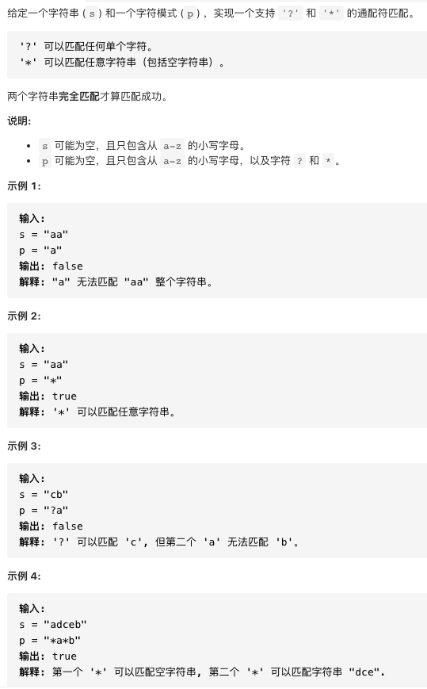

[TOC]

# 1. 题目30 串联所有单词的子串

## 1.1 题目描述


## 1.2 解答


```java
//这个方法是滑动串口的解法，最优
    public static List<Integer> solution(String s, String[] words) {
        List<Integer> res = new ArrayList<>();
        Map<String, Integer> wordsMap = new HashMap<>();
        if (s.length() == 0 || words.length == 0) return res;
        for (String word : words) {
            // 主串s中没有这个单词，直接返回空
            if (!s.contains(word)) return res;
            // map中保存每个单词，和它出现的次数
            wordsMap.put(word, wordsMap.getOrDefault(word, 0) + 1);
        }
        // 每个单词的长度， 总长度
        int oneLen = words[0].length(), wordsLen = oneLen * words.length;
        // 主串s长度小于单词总和，返回空
        if (wordsLen > s.length()) return res;
        // 只讨论从0，1，...， oneLen-1 开始的子串情况，
        // 每次进行匹配的窗口大小为 wordsLen，每次后移一个单词长度，由左右窗口维持当前窗口位置
        for (int i = 0; i < oneLen; ++i) {
            // 左右窗口
            int left = i, right = i, count = 0;
            // 统计每个符合要求的word
            Map<String, Integer> subMap = new HashMap<>();
            // 右窗口不能超出主串长度
            while (right + oneLen <= s.length()) {
                // 得到一个单词
                String word = s.substring(right, right + oneLen);
                // 有窗口右移
                right += oneLen;
                // words[]中没有这个单词，那么当前窗口肯定匹配失败，直接右移到这个单词后面
                if (!wordsMap.containsKey(word)) {
                    left = right;
                    // 窗口内单词统计map清空，重新统计
                    subMap.clear();
                    // 符合要求的单词数清0
                    count = 0;
                } else {
                    // 统计当前子串中这个单词出现的次数
                    subMap.put(word, subMap.getOrDefault(word, 0) + 1);
                    ++count;
                    // 如果这个单词出现的次数大于words[]中它对应的次数，又由于每次匹配和words长度相等的子串
                    // 如 ["foo","bar","foo","the"]  "| foobarfoobar| foothe"
                    // 第二个bar虽然是words[]中的单词，但是次数超了，那么右移一个单词长度后 "|barfoobarfoo|the"
                    // bar还是不符合，所以直接从这个不符合的bar之后开始匹配，也就是将这个不符合的bar和它之前的单词(串)全移出去
                    while (subMap.getOrDefault(word, 0) > wordsMap.getOrDefault(word, 0)) {
                        // 从当前窗口字符统计map中删除从左窗口开始到数量超限的所有单词(次数减一)
                        String w = s.substring(left, left + oneLen);
                        subMap.put(w, subMap.getOrDefault(w, 0) - 1);
                        // 符合的单词数减一
                        --count;
                        // 左窗口位置右移
                        left += oneLen;
                    }
                    // 当前窗口字符串满足要求
                    if (count == words.length) res.add(left);
                }
            }
        }
        return res;
    }
```


# 2. 题目44 通配符匹配

## 2.1 题目描述




## 2.2 解答

这个题目与“题目10 正则表达式匹配”相似，题目10 是使用动态规划的思想解决的，解决方案和总结在动态规划篇

```java
public static boolean isMatch(String s, String p) {
        //目标串的长度
        int m = s.length();
        //模式串的长度
        int n = p.length();
        //dp[i][j]表示s(0,i)和p(0,j)是匹配的
        boolean[][] dp = new boolean[m + 1][n + 1];
        //长度为0的目标串和长度为0的模式串是匹配的
        dp[0][0] = true;
        //如果模式串从第0个开始一直是*，则把相应的dp数组的位置设置为true，否则跳出循环
        for (int i = 1; i <= n; ++i) {
            if (p.charAt(i - 1) == '*') {
                dp[0][i] = true;
            } else {
                break;
            }
        }
        for (int i = 1; i <= m; ++i) {
            for (int j = 1; j <= n; ++j) {
                if (p.charAt(j - 1) == '*') {
                    //分用*和不用*两种情况
                    dp[i][j] = dp[i][j - 1] || dp[i - 1][j];
                } else if (p.charAt(j - 1) == '?' || s.charAt(i - 1) == p.charAt(j - 1)) {
                    dp[i][j] = dp[i - 1][j - 1];
                }
            }
        }
        return dp[m][n];
    }
```

# 3. 题目65 有效数字

## 3.1 题目描述


## 3.2 解答

本题可以采用《编译原理》里面的确定的有限状态机（DFA）解决。构造一个DFA并实现，构造方法可以先写正则表达式，然后转为 DFA，也可以直接写，我就是直接写的，虽然大概率不会是最简结构（具体请参考《编译器原理》图灵出版社），不过不影响解题。DFA 作为确定的有限状态机，比 NFA 更加实用，因为对于每一个状态接收的下一个字符，DFA 能确定唯一一条转换路径，所以使用简单的表驱动的一些方法就可以实现，并且只需要读一遍输入流，比起 NFA 需要回读在速度上会有所提升。

构建出来的状态机如封面图片所示（红色为 终止状态，蓝色为 中间状态）。根据《编译原理》的解释，DFA 从状态 0 接受串 s 作为输入。当s耗尽的时候如果当前状态处于中间状态，则拒绝；如果到达终止状态，则接受。

然后，根据 DFA 列出如下的状态跳转表，之后我们就可以采用 表驱动法 进行编程实现了。需要注意的是，这里面多了一个状态 8，是用于处理串后面的若干个多余空格的。所以，所有的终止态都要跟上一个状态 8。其中，有一些状态标识为-1，是表示遇到了一些意外的字符，可以直接停止后续的计算。状态跳转表如下：


状态图


```java
public class T65 {
    public int make(char c) {
        switch (c) {
            case ' ':
                return 0;
            case '+':
            case '-':
                return 1;
            case '.':
                return 3;
            case 'e':
                return 4;
            default:
                if (c >= 48 && c <= 57) return 2;
        }
        return -1;
    }

    public boolean isNumber(String s) {
        s = s.toLowerCase();

        int state = 0;
        int finals = 0b101101000;
        int[][] transfer = new int[][]{{0, 1, 6, 2, -1},
                {-1, -1, 6, 2, -1},
                {-1, -1, 3, -1, -1},
                {8, -1, 3, -1, 4},
                {-1, 7, 5, -1, -1},
                {8, -1, 5, -1, -1},
                {8, -1, 6, 3, 4},
                {-1, -1, 5, -1, -1},
                {8, -1, -1, -1, -1}};
        char[] ss = s.toCharArray();
        for (int i = 0; i < ss.length; ++i) {
            int id = make(ss[i]);
            if (id < 0) return false;
            state = transfer[state][id];
            if (state < 0) return false;
        }
        return (finals & (1 << state)) > 0;
    }

    public static void main(String[] args) {
        T65 t = new T65();
        boolean res = t.isNumber("1e9");
        System.out.println(res);
    }
}
```

另外一种方案：

使用责任链模式

利用责任链的设计模式，会使得写出的算法扩展性以及维护性更高。这里用到的思想就是，每个类只判断一种类型。比如判断是否是正数的类，判断是否是小数的类，判断是否是科学计数法的类，这样每个类只关心自己的部分，出了问题很好排查，而且互不影响。

```java
public class T65_2 {
    //每个类都实现这个接口
    interface NumberValidate {
        boolean validate(String s);
    }

    //定义一个抽象类，用来检查一些基础的操作，是否为空，去掉首尾空格，去掉 +/-
   //doValidate 交给子类自己去实现
    abstract static class NumberValidateTemplate implements NumberValidate {

        public boolean validate(String s) {
            if (s == null || s.equals("")) {
                return false;
            }
            s = checkAndProcessHeader(s);
            if (s.length() == 0) {
                return false;
            }
            return doValidate(s);
        }


        private String checkAndProcessHeader(String value) {
            value = value.trim();
            if (value.startsWith("+") || value.startsWith("-")) {
                value = value.substring(1);
            }
            return value;
        }

        protected abstract boolean doValidate(String s);
    }

    //实现 doValidate 判断是否是整数
    static class IntegerValidate extends NumberValidateTemplate {
        protected boolean doValidate(String integer) {
            for (int i = 0; i < integer.length(); i++) {
                if (!Character.isDigit(integer.charAt(i))) {
                    return false;
                }
            }
            return true;
        }
    }

    //实现 doValidate 判断是否是科学计数法
    static class SienceFormatValidate extends NumberValidateTemplate {
        protected boolean doValidate(String s) {
            s = s.toLowerCase();
            int pos = s.indexOf("e");
            if (pos == -1) {
                return false;
            }
            if (s.length() == 1) {
                return false;
            }
            String first = s.substring(0, pos);
            String second = s.substring(pos + 1);
            return validatePartBeforeE(first) && validatePartAfterE(second);
        }

        private boolean validatePartBeforeE(String first) {
            if (first.equals("")) {
                return false;
            }
            if (checkHeadAndEndForSpace(first)) {
                return false;
            }
            NumberValidate integerValidate = new IntegerValidate();
            NumberValidate floatValidate = new FloatValidate();
            return integerValidate.validate(first) || floatValidate.validate(first);
        }

        private boolean checkHeadAndEndForSpace(String part) {
            return part.startsWith(" ") || part.endsWith(" ");
        }

        private boolean validatePartAfterE(String second) {
            if (second.equals("")) {
                return false;
            }

            if (checkHeadAndEndForSpace(second)) {
                return false;
            }

            NumberValidate integerValidate = new IntegerValidate();
            return integerValidate.validate(second);
        }
    }

    //实现 doValidate 判断是否是小数
    static class FloatValidate extends NumberValidateTemplate {
        protected boolean doValidate(String floatVal) {
            int pos = floatVal.indexOf(".");
            if (pos == -1) {
                return false;
            }

            if (floatVal.length() == 1) {
                return false;
            }

            String first = floatVal.substring(0, pos);
            String second = floatVal.substring(pos + 1);
            return checkFirstPart(first) && checkFirstPart(second);
        }

        private boolean checkFirstPart(String first) {
            return first.equals("") || checkPart(first);
        }

        private boolean checkPart(String part) {
            if (!Character.isDigit(part.charAt(0)) ||
                    !Character.isDigit(part.charAt(part.length() - 1))) {
                return false;
            }

            NumberValidate nv = new IntegerValidate();
            return nv.validate(part);
        }
    }

    //定义一个执行者，我们把之前实现的各个类加到一个数组里，然后依次调用
    static class NumberValidator implements NumberValidate {
        private ArrayList<NumberValidate> validators = new ArrayList<>();

        public NumberValidator() {
            addValidators();
        }

        private void addValidators() {
            NumberValidate nv = new IntegerValidate();
            validators.add(nv);

            nv = new FloatValidate();
            validators.add(nv);

            nv = new SienceFormatValidate();
            validators.add(nv);
        }

        @Override
        public boolean validate(String s) {
            for (NumberValidate nv : validators) {
                if (nv.validate(s)) {
                    return true;
                }
            }
            return false;
        }
    }

    public boolean isNumber(String s) {
        NumberValidate nv = new NumberValidator();
        return nv.validate(s);
    }

    public static void main(String[] args) {
        T65_2 t = new T65_2();
        System.out.println(t.isNumber("0089"));
    }
}
```


