[TOC]

# 1. 多线程

## 1.2 题目1114 按序打印

### 1.1.1 题目描述

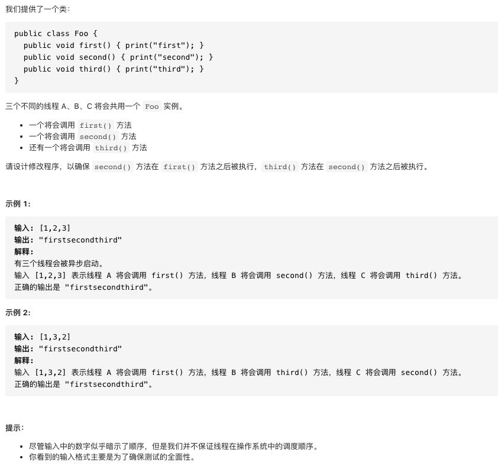

原始题目模板：

```java
class Foo {

    public Foo() {
        
    }

    public void first(Runnable printFirst) throws InterruptedException {
        
        // printFirst.run() outputs "first". Do not change or remove this line.
        printFirst.run();
    }

    public void second(Runnable printSecond) throws InterruptedException {
        
        // printSecond.run() outputs "second". Do not change or remove this line.
        printSecond.run();
    }

    public void third(Runnable printThird) throws InterruptedException {
        
        // printThird.run() outputs "third". Do not change or remove this line.
        printThird.run();
    }
}
```

### 1.1.2 解答

共有4种解法：

> 方法1：使用Semaphore
> 方法2：volatile+计数变量
> 方法3：使用AtomicInteger
> 方法4：synchronized+wait+notifyAll

解法1：使用wait结合notifyAll

```java
class Foo {

    private boolean firstFinished;
    private boolean secondFinished;
    private Object lock = new Object();

    public Foo() {

    }

    public void first(Runnable printFirst) throws InterruptedException {

        synchronized (lock) {
            // printFirst.run() outputs "first". Do not change or remove this line.
            printFirst.run();
            firstFinished = true;
            lock.notifyAll();
        }
    }

    public void second(Runnable printSecond) throws InterruptedException {

        synchronized (lock) {
            while (!firstFinished) {
                lock.wait();
            }

            // printSecond.run() outputs "second". Do not change or remove this line.
            printSecond.run();
            secondFinished = true;
            lock.notifyAll();
        }
    }

    public void third(Runnable printThird) throws InterruptedException {

        synchronized (lock) {
            while (!secondFinished) {
                lock.wait();
            }

            // printThird.run() outputs "third". Do not change or remove this line.
            printThird.run();
        }
    }
}
```

解法2：使用volatile结合一个计数变量

```java
class Foo {

    public Foo() {
        
    }
    volatile int count=1;
    public void first(Runnable printFirst) throws InterruptedException {
        printFirst.run();
        count++;
    }

    public void second(Runnable printSecond) throws InterruptedException {
        while (count!=2);
        printSecond.run();
        count++;
    }

    public void third(Runnable printThird) throws InterruptedException {
        while (count!=3);
        printThird.run();
    }
}
```

解法3：使用Semaphore实现

```java
class Foo {

    private Semaphore two = new Semaphore(0);
    private Semaphore three = new Semaphore(0);

    public Foo() {

    }

    public void first(Runnable printFirst) throws InterruptedException {

        // printFirst.run() outputs "first". Do not change or remove this line.
        printFirst.run();
        two.release();
    }

    public void second(Runnable printSecond) throws InterruptedException {
        two.acquire();
        // printSecond.run() outputs "second". Do not change or remove this line.
        printSecond.run();
        three.release();
    }

    public void third(Runnable printThird) throws InterruptedException {
        three.acquire();
        // printThird.run() outputs "third". Do not change or remove this line.
        printThird.run();
    }
}
```

解法4：使用`AtomicInteger`来实现

```java
class Foo {

    private AtomicInteger firstJobDone = new AtomicInteger(0);
    private AtomicInteger secondJobDone = new AtomicInteger(0);

    public Foo() {
    }

    public void first(Runnable printFirst) throws InterruptedException {
        // printFirst.run() outputs "first".
        printFirst.run();
        // mark the first job as done, by increasing its count.
        firstJobDone.incrementAndGet();
    }

    public void second(Runnable printSecond) throws InterruptedException {
        while (firstJobDone.get() != 1) {
            // waiting for the first job to be done.
        }
        // printSecond.run() outputs "second".
        printSecond.run();
        // mark the second as done, by increasing its count.
        secondJobDone.incrementAndGet();
    }

    public void third(Runnable printThird) throws InterruptedException {
        while (secondJobDone.get() != 1) {
            // waiting for the second job to be done.
        }
        // printThird.run() outputs "third".
        printThird.run();
    }
}
```


## 1.2 题目1115 交替打印FooBar

### 1.2.1 题目描述


### 1.2.2 解答

解法1：使用Semaphore

```java
class FooBar {
    private int n;
    private Semaphore foo = new Semaphore(1);
    private Semaphore bar = new Semaphore(0);

    public FooBar(int n) {
        this.n = n;
    }

    public void foo(Runnable printFoo) throws InterruptedException {

        for (int i = 0; i < n; i++) {
            foo.acquire();

            // printFoo.run() outputs "foo". Do not change or remove this line.
            printFoo.run();
            bar.release();
        }
    }

    public void bar(Runnable printBar) throws InterruptedException {

        for (int i = 0; i < n; i++) {
            bar.acquire();
            // printBar.run() outputs "bar". Do not change or remove this line.
            printBar.run();
            foo.release();
        }
    }
}
```

解法2：使用synchronized+wait+notifyAll

```java
class FooBar {
    private int n;

    public FooBar(int n) {
        this.n = n;
    }

    private Object lock = new Object();
    private boolean fooDone = false;
    private boolean barDone = true;

    public void foo(Runnable printFoo) throws InterruptedException {

        synchronized (lock) {
            for (int i = 0; i < n; i++) {
                while (!barDone) {
                    lock.wait();
                }
                // printFoo.run() outputs "foo". Do not change or remove this line.
                printFoo.run();
                barDone = false;
                fooDone = true;
                lock.notifyAll();
            }
        }
    }

    public void bar(Runnable printBar) throws InterruptedException {

        synchronized (lock) {
            for (int i = 0; i < n; i++) {
                while (!fooDone) {
                    lock.wait();
                }
                // printBar.run() outputs "bar". Do not change or remove this line.
                printBar.run();
                fooDone = false;
                barDone = true;
                lock.notifyAll();
            }
        }
    }
}
```

解法3：使用阻塞队列

```java
public class FooBar {
    private int n;
    private BlockingQueue<Integer> bar = new LinkedBlockingQueue<>(1);
    private BlockingQueue<Integer> foo = new LinkedBlockingQueue<>(1);

    public FooBar(int n) {
        this.n = n;
    }

    public void foo(Runnable printFoo) throws InterruptedException {
        for (int i = 0; i < n; i++) {
            foo.put(i);
            printFoo.run();
            bar.put(i);
        }
    }

    public void bar(Runnable printBar) throws InterruptedException {
        for (int i = 0; i < n; i++) {
            bar.take();
            printBar.run();
            foo.take();
        }
    }
}
```

解法4：使用`CyclicBarrier`

```java
class FooBar {
    private int n;

    public FooBar(int n) {
        this.n = n;
    }

    CyclicBarrier cb = new CyclicBarrier(2);
    volatile boolean fin = true;

    public void foo(Runnable printFoo) throws InterruptedException {
        for (int i = 0; i < n; i++) {
            while (!fin) ;
            printFoo.run();
            fin = false;
            try {
                cb.await();
            } catch (BrokenBarrierException ignored) {
            }
        }
    }

    public void bar(Runnable printBar) throws InterruptedException {
        for (int i = 0; i < n; i++) {
            try {
                cb.await();
            } catch (BrokenBarrierException ignored) {
            }
            printBar.run();
            fin = true;
        }
    }
}
```


关于`CyclicBarrier`的使用的Demo

```java
public class CyclicBarrierDemo {

    static class TaskThread extends Thread {

        CyclicBarrier barrier;

        public TaskThread(CyclicBarrier barrier) {
            this.barrier = barrier;
        }

        @Override
        public void run() {
            try {
                Thread.sleep(1000);
                System.out.println(getName() + " 到达栅栏 A");
                barrier.await();
                System.out.println(getName() + " 冲破栅栏 A");

                Thread.sleep(2000);
                System.out.println(getName() + " 到达栅栏 B");
                barrier.await();
                System.out.println(getName() + " 冲破栅栏 B");
            } catch (Exception e) {
                e.printStackTrace();
            }
        }
    }

    public static void main(String[] args) {
        int threadNum = 5;
        CyclicBarrier barrier = new CyclicBarrier(threadNum, new Runnable() {

            @Override
            public void run() {
                System.out.println(Thread.currentThread().getName() + " 完成最后任务");
            }
        });

        for (int i = 0; i < threadNum; i++) {
            new TaskThread(barrier).start();
        }
    }

}
```

解法5：自旋+让出CPU

```java
class FooBar {
    private int n;

    public FooBar(int n) {
        this.n = n;
    }

     volatile boolean permitFoo = true;

    public void foo(Runnable printFoo) throws InterruptedException {
        for (int i = 0; i < n; ) {
            if (permitFoo) {
                printFoo.run();
                i++;
                permitFoo = false;
            } else {
                Thread.yield();
            }
        }
    }

    public void bar(Runnable printBar) throws InterruptedException {
        for (int i = 0; i < n; ) {
            if (!permitFoo) {
                printBar.run();
                i++;
                permitFoo = true;
            } else {
                Thread.yield();
            }
        }
    }
}
```

解法6：可重入锁+Condition

```java
class FooBar {
    private int n;

    public FooBar(int n) {
        this.n = n;
    }

    Lock lock = new ReentrantLock(true);
    private final Condition foo = lock.newCondition();
    volatile boolean flag = true;

    public void foo(Runnable printFoo) throws InterruptedException {
        for (int i = 0; i < n; i++) {
            lock.lock();
            try {
                while (!flag) {
                    foo.await();
                }
                printFoo.run();
                flag = false;
                foo.signal();
            } finally {
                lock.unlock();
            }
        }
    }

    public void bar(Runnable printBar) throws InterruptedException {
        for (int i = 0; i < n; i++) {
            lock.lock();
            try {
                while (flag) {
                    foo.await();
                }
                printBar.run();
                flag = true;
                foo.signal();
            } finally {
                lock.unlock();
            }
        }
    }
}
```

## 1.3 题目1116 打印零与奇偶数

### 1.3.1 题目描述

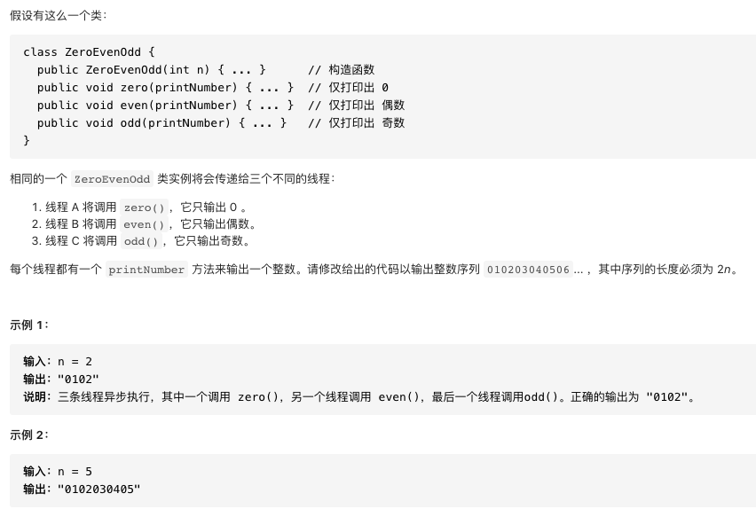

### 1.3.2 解答

方法1：Semaphore

```java
class ZeroEvenOdd {
    private int n;

    public ZeroEvenOdd(int n) {
        this.n = n;
    }

    private Semaphore zero = new Semaphore(1);
    private Semaphore even = new Semaphore(0);
    private Semaphore odd = new Semaphore(0);

    // printNumber.accept(x) outputs "x", where x is an integer.
    public void zero(IntConsumer printNumber) throws InterruptedException {

        for (int i = 0; i < n; i++) {
            zero.acquire();
            printNumber.accept(0);
            if ((i & 1) == 0) {
                odd.release();
            } else {
                even.release();
            }
        }
    }

    public void even(IntConsumer printNumber) throws InterruptedException {
        for (int i = 2; i <= n; i += 2) {
            even.acquire();
            printNumber.accept(i);
            zero.release();
        }
    }

    public void odd(IntConsumer printNumber) throws InterruptedException {
        for (int i = 1; i <= n; i += 2) {
            odd.acquire();
            printNumber.accept(i);
            zero.release();
        }
    }
}
```

解法2：锁

```java
class ZeroEvenOdd {
    private int n;

    public ZeroEvenOdd(int n) {
        this.n = n;
    }

    Lock lock = new ReentrantLock();
    Condition z = lock.newCondition();
    Condition num = lock.newCondition();
    volatile boolean zTurn = true;
    volatile int zIndex = 0;

    public void zero(IntConsumer printNumber) throws InterruptedException {
        for(;zIndex<n;) {
            lock.lock();
            try {
                while(!zTurn) {
                    z.await();
                }
                printNumber.accept(0);
                zTurn = false;
                num.signalAll();
                zIndex++;
            }finally {
                lock.unlock();
            }
        }
    }

    public void even(IntConsumer printNumber) throws InterruptedException {
        for(int i=2; i<=n; i+=2) {
            lock.lock();
            try {
                while(zTurn || (zIndex&1)==1) {
                    num.await();
                }
                printNumber.accept(i);
                zTurn = true;
                z.signal();
            }finally {
                lock.unlock();
            }
        }
    }

    public void odd(IntConsumer printNumber) throws InterruptedException {
        for(int i=1; i<=n; i+=2) {
            lock.lock();
            try {
                while(zTurn || (zIndex&1)==0) {
                    num.await();
                }
                printNumber.accept(i);
                zTurn = true;
                z.signal();
            }finally {
                lock.unlock();
            }
        }
    }
}

解法3：LockSupport

LockSupport的用法及原理 https://www.jianshu.com/p/f1f2cd289205

```java
class ZeroEvenOdd {
    private int n;
    private final AtomicInteger atomicInteger = new AtomicInteger(0);
    private volatile int index = 0;
    private final Map<String, Thread> map = new ConcurrentHashMap<>();

    public ZeroEvenOdd(int n) {
        this.n = n;
    }

    // printNumber.accept(x) outputs "x", where x is an integer.
    public void zero(IntConsumer printNumber) throws InterruptedException {
        map.put("zero", Thread.currentThread());
        for (int i = 0; i < n; i++) {
            while (index != 0) {
                LockSupport.park();
            }
            printNumber.accept(0);
            atomicInteger.getAndIncrement();
            if (i % 2 == 0) {
                index = 2;
            } else {
                index = 1;
            }
            map.forEach((key, value) -> LockSupport.unpark(value));
        }
    }

    public void even(IntConsumer printNumber) throws InterruptedException {
        map.put("even", Thread.currentThread());
        for (int i = 0; i < n / 2; i++) {
            while (index != 1) {
                LockSupport.park();
            }
            printNumber.accept(atomicInteger.get());
            index = 0;
            LockSupport.unpark(map.get("zero"));
        }
    }

    public void odd(IntConsumer printNumber) throws InterruptedException {
        map.put("odd", Thread.currentThread());
        for (int i = 0; i < (n + 1) / 2; i++) {
            while (index != 2) {
                LockSupport.park();
            }
            printNumber.accept(atomicInteger.get());
            index = 0;
            LockSupport.unpark(map.get("zero"));
        }
    }
}
```

## 1.4 题目1117 H2O生成

### 1.4.1 题目描述

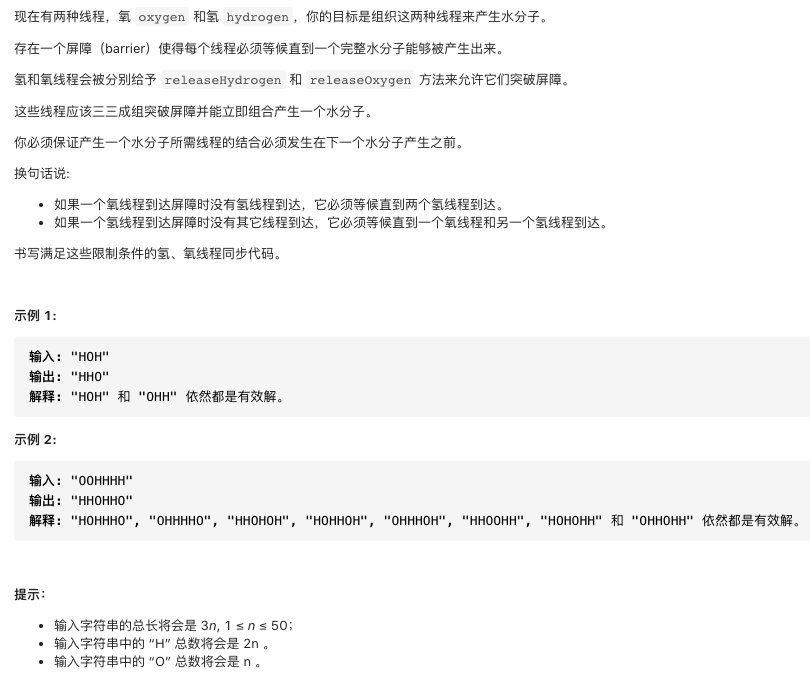

### 1.4.2 解答

解法1：信号量

```java
class H2O {

    public H2O() {

    }

    private Semaphore H = new Semaphore(2);
    private Semaphore O = new Semaphore(0);
    private volatile int counter = 0;

    public void hydrogen(Runnable releaseHydrogen) throws InterruptedException {
        H.acquire();
        // releaseHydrogen.run() outputs "H". Do not change or remove this line.
        releaseHydrogen.run();
        counter++;
        if (counter == 2) {
            O.release();
            counter = 0;
        }
    }

    public void oxygen(Runnable releaseOxygen) throws InterruptedException {
        O.acquire();
        // releaseOxygen.run() outputs "O". Do not change or remove this line.
        releaseOxygen.run();
        H.release();
        H.release();
    }
}
```


## 1.5 题目1188 设计有限阻塞队列

### 1.5.1 题目描述

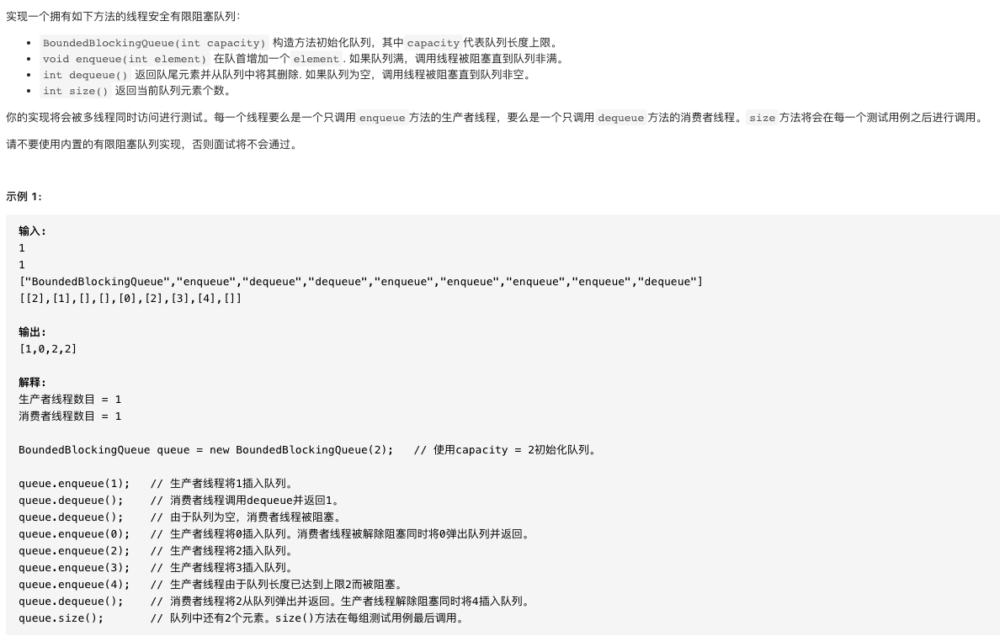

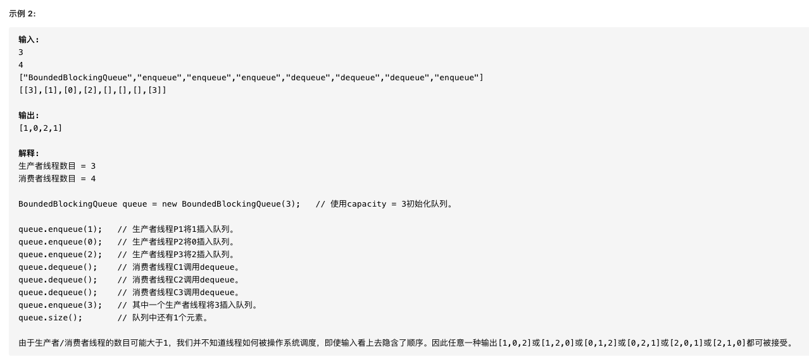

### 1.5.2 解答

解法1：

```java
class BoundedBlockingQueue {
    //原子类保证原子性，也可以使用volatile
    //普通的int被读取，会被读入内存的缓存中，完成加减乘除后再放回内存中，而每一个线程都有自己的寄存器，这样子会导致可能读取不到最新的数据
    //volatile则可以直接在主内存读写，当一个线程更新了值，其他线程能够及时获知。
    AtomicInteger size = new AtomicInteger(0);
    private volatile int capacity;
    //自己实现阻塞队列，需要一个容器，内部实现了一个node，如果改造为不只是int的，使用T泛型
    private LinkedList<Integer> container;

    //可重入锁
    private static ReentrantLock lock = new ReentrantLock();
    Condition producer = lock.newCondition();//用来通知生产（入队）线程等待await还是可以执行signal
    Condition consumer = lock.newCondition();//用来通知消费（出队）线程等待await还是可以执行signal

    public BoundedBlockingQueue(int capacity) {
        this.capacity = capacity;
        container = new LinkedList<>();
    }

    /**
     * 入队
     *
     * @param element
     * @throws InterruptedException
     */
    public void enqueue(int element) throws InterruptedException {
        //每一个线程都会获得锁，但是如果条件不满足则会阻塞
        lock.lock();
        try {
            //阻塞的话必须用循环，让这个线程再次获得cpu片段的时候能够够执行
            while (size.get() >= capacity) {
                //入队线程阻塞，把锁释放？
                producer.await();
            }
            container.addFirst(element);
            size.incrementAndGet();

            //通知出队线程
            consumer.signal();
        } finally {
            lock.unlock();
        }
    }

    public int dequeue() throws InterruptedException {
        lock.lock();
        try {
            while (size.get() == 0) {
                consumer.await();
            }
            int lastValue = container.getLast();
            container.removeLast();
            size.decrementAndGet();

            //通知入队线程
            producer.signal();
            return lastValue;
        } finally {
            lock.unlock();
        }
    }

    public int size() {
        lock.lock();
        try {
            return size.get();
        } finally {
            lock.unlock();
        }
    }
}
```


## 1.6 题目1195 交替打印字符串

### 1.6.1 题目描述

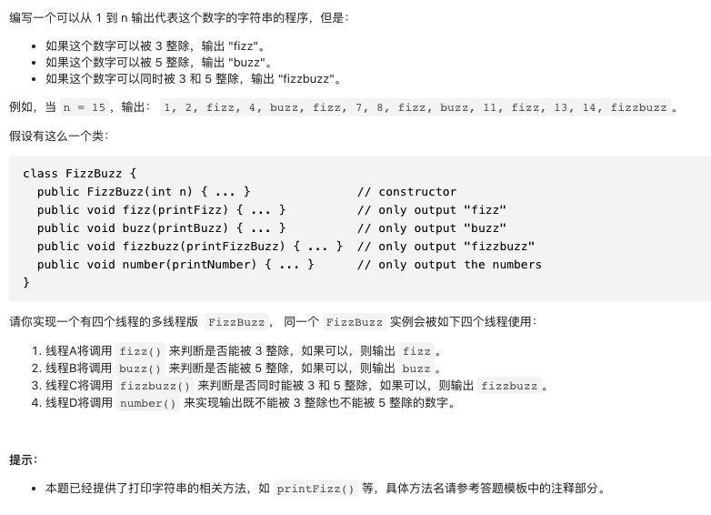

### 1.6.2 解答

解法1：Semaphore

```java
class FizzBuzz {
    private int n;

    public FizzBuzz(int n) {
        this.n = n;
    }

    private Semaphore fizzbuzz = new Semaphore(1);
    private Semaphore fizz = new Semaphore(0);
    private Semaphore buzz = new Semaphore(0);
    private Semaphore number = new Semaphore(0);

    // printFizz.run() outputs "fizz".
    public void fizz(Runnable printFizz) throws InterruptedException {
        for (int i = 1; i <= n; i++) {
            fizz.acquire();
            if (i % 3 == 0 && i % 5 != 0) {
                printFizz.run();
            }
            buzz.release();
        }

    }

    // printBuzz.run() outputs "buzz".
    public void buzz(Runnable printBuzz) throws InterruptedException {
        for (int i = 1; i <= n; i++) {
            buzz.acquire();
            if (i % 3 != 0 && i % 5 == 0) {
                printBuzz.run();
            }
            number.release();
        }

    }

    // printFizzBuzz.run() outputs "fizzbuzz".
    public void fizzbuzz(Runnable printFizzBuzz) throws InterruptedException {
        for (int i = 1; i <= n; i++) {
            fizzbuzz.acquire();
            if (i % 3 == 0 && i % 5 == 0) {
                printFizzBuzz.run();
            }
            fizz.release();
        }

    }

    // printNumber.accept(x) outputs "x", where x is an integer.
    public void number(IntConsumer printNumber) throws InterruptedException {
        for (int i = 1; i <= n; i++) {
            number.acquire();
            if (i % 3 != 0 && i % 5 != 0) {
                printNumber.accept(i);
            }
            fizzbuzz.release();
        }

    }
}
```

解法2:ReetrantLock

```java
class FizzBuzz {
    private int n;

    public FizzBuzz(int n) {
        this.n = n;
    }

    private static Lock lock = new ReentrantLock(true);
    private Condition fizz = lock.newCondition();
    private Condition buzz = lock.newCondition();
    private Condition fizzbuzz = lock.newCondition();
    private Condition number = lock.newCondition();
    private AtomicInteger counter = new AtomicInteger(1);

    // printFizz.run() outputs "fizz".
    public void fizz(Runnable printFizz) throws InterruptedException {

        lock.lock();
        try {
            for (int i = 1; i <= n; i++) {
                while ((counter.get() % 4) != 2) {
                    fizz.await();
                }
                if ((i % 3) == 0 && (i % 5) != 0) {
                    printFizz.run();
                }
                counter.incrementAndGet();
                buzz.signal();

            }
        } finally {
            lock.unlock();
        }
    }

    // printBuzz.run() outputs "buzz".
    public void buzz(Runnable printBuzz) throws InterruptedException {
        lock.lock();
        try {
            for (int i = 1; i <= n; i++) {
                while ((counter.get() % 4) != 3) {
                    buzz.await();
                }
                if ((i % 3) != 0 && (i % 5) == 0) {
                    printBuzz.run();

                }
                counter.incrementAndGet();
                number.signal();

            }
        } finally {
            lock.unlock();
        }

    }

    // printFizzBuzz.run() outputs "fizzbuzz".
    public void fizzbuzz(Runnable printFizzBuzz) throws InterruptedException {
        lock.lock();
        try {
            for (int i = 1; i <= n; i++) {
                while ((counter.get() % 4) != 1) {
                    fizzbuzz.await();
                }
                if ((i % 3 == 0) && (i % 5) == 0) {
                    printFizzBuzz.run();
                }
                counter.incrementAndGet();
                fizz.signal();

            }
        } finally {
            lock.unlock();
        }

    }

    // printNumber.accept(x) outputs "x", where x is an integer.
    public void number(IntConsumer printNumber) throws InterruptedException {
        lock.lock();
        try {
            for (int i = 1; i <= n; i++) {
                while ((counter.get() % 4) != 0) {
                    number.await();
                }
                if ((i % 3) != 0 && (i % 5) != 0) {
                    printNumber.accept(i);
                }
                counter.incrementAndGet();
                fizzbuzz.signal();

            }

        } finally {
            lock.unlock();
        }

    }
}

解法3：Synchronized+wait+notifyAll

```java
class FizzBuzz {
    private int n;
    private final Object lock = new Object();
    private AtomicInteger counter = new AtomicInteger(1);

    public FizzBuzz(int n) {
        this.n = n;
    }

    // printFizz.run() outputs "fizz".
    public void fizz(Runnable printFizz) throws InterruptedException {
        synchronized (lock) {
            for (int i = 1; i <= n; i++) {
                while (counter.get() % 4 != 2) {
                    lock.wait();
                }
                if ((i % 3 == 0) && (i % 5 != 0)) {
                    printFizz.run();
                }
                counter.incrementAndGet();
                lock.notifyAll();
            }
        }

    }

    // printBuzz.run() outputs "buzz".
    public void buzz(Runnable printBuzz) throws InterruptedException {
        synchronized (lock) {
            for (int i = 1; i <= n; i++) {
                while (counter.get() % 4 != 3) {
                    lock.wait();
                }
                if ((i % 3 != 0) && (i % 5 == 0)) {
                    printBuzz.run();
                }
                counter.incrementAndGet();
                lock.notifyAll();
            }
        }
    }

    // printFizzBuzz.run() outputs "fizzbuzz".
    public void fizzbuzz(Runnable printFizzBuzz) throws InterruptedException {
        synchronized (lock) {
            for (int i = 1; i <= n; i++) {
                while (counter.get() % 4 != 1) {
                    lock.wait();
                }
                if ((i % 3 == 0) && (i % 5 == 0)) {
                    printFizzBuzz.run();
                }
                counter.incrementAndGet();
                lock.notifyAll();
            }
        }
    }

    // printNumber.accept(x) outputs "x", where x is an integer.
    public void number(IntConsumer printNumber) throws InterruptedException {
        synchronized (lock) {
            for (int i = 1; i <= n; i++) {
                while (counter.get() % 4 != 0) {
                    lock.wait();
                }
                if ((i % 3 != 0) && (i % 5 != 0)) {
                    printNumber.accept(i);
                }
                counter.incrementAndGet();
                lock.notifyAll();
            }
        }
    }
}
```


## 1.7 题目 1226 哲学家进餐

### 1.7.1 题目描述

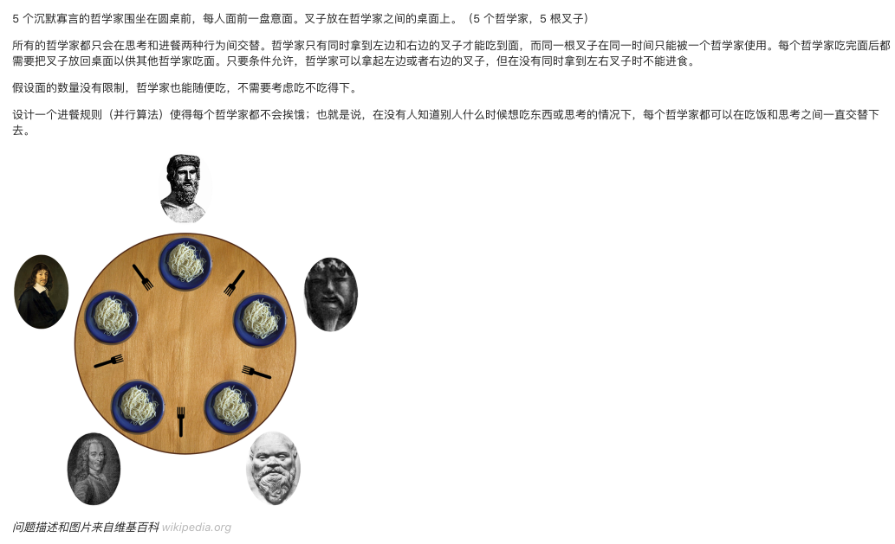

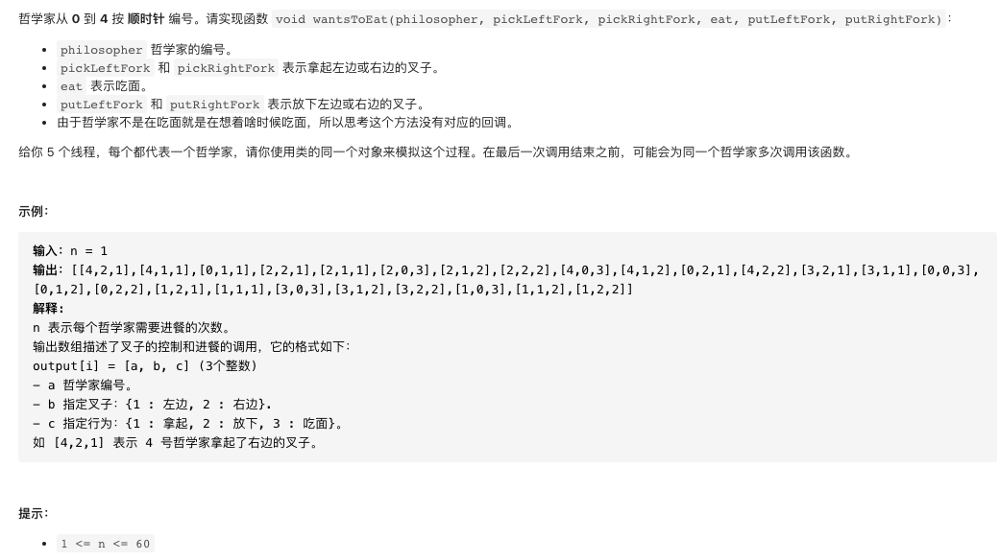


### 1.7.2 解答


```java
class DiningPhilosophers {
    //1个Fork视为1个ReentrantLock，5个叉子即5个ReentrantLock，将其都放入数组中
    private final ReentrantLock[] lockList = {new ReentrantLock(),
            new ReentrantLock(),
            new ReentrantLock(),
            new ReentrantLock(),
            new ReentrantLock()};

    //限制 最多只有4个哲学家去持有叉子
    private Semaphore eatLimit = new Semaphore(4);

    public DiningPhilosophers() {

    }

    // call the run() method of any runnable to execute its code
    public void wantsToEat(int philosopher,
                           Runnable pickLeftFork,
                           Runnable pickRightFork,
                           Runnable eat,
                           Runnable putLeftFork,
                           Runnable putRightFork) throws InterruptedException {

        int leftFork = (philosopher + 1) % 5;    //左边的叉子 的编号
        int rightFork = philosopher;    //右边的叉子 的编号

        eatLimit.acquire();    //限制的人数 -1

        lockList[leftFork].lock();    //拿起左边的叉子
        lockList[rightFork].lock();    //拿起右边的叉子

        pickLeftFork.run();    //拿起左边的叉子 的具体执行
        pickRightFork.run();    //拿起右边的叉子 的具体执行

        eat.run();    //吃意大利面 的具体执行

        putLeftFork.run();    //放下左边的叉子 的具体执行
        putRightFork.run();    //放下右边的叉子 的具体执行

        lockList[leftFork].unlock();    //放下左边的叉子
        lockList[rightFork].unlock();    //放下右边的叉子

        eatLimit.release();//限制的人数 +1
    }
}
```


## 1.8 [需要复习]题目1242 多线程网页爬虫

### 1.8.1 题目描述


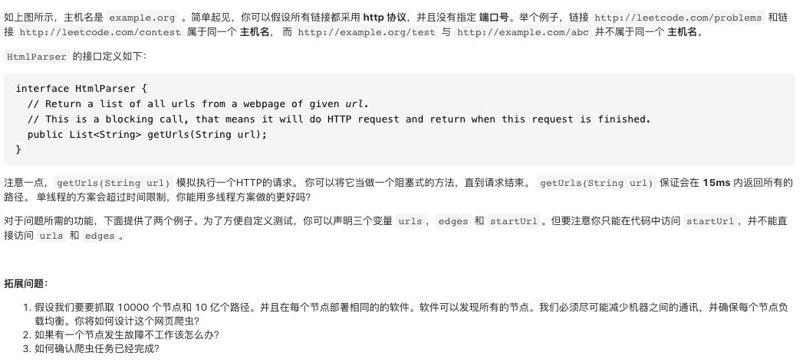

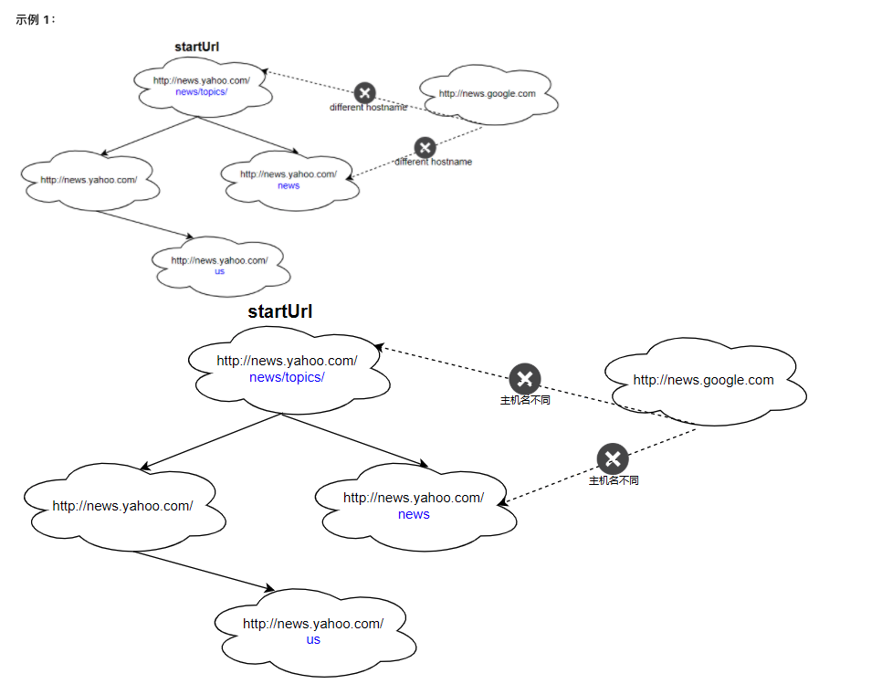


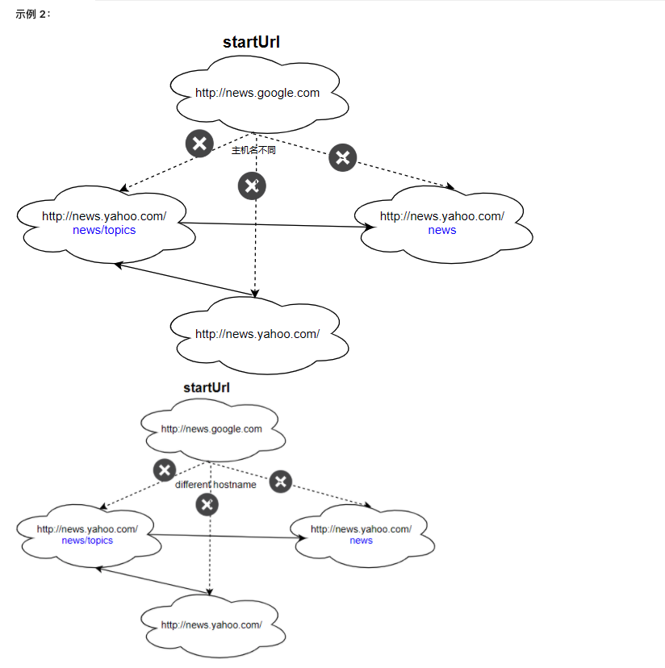

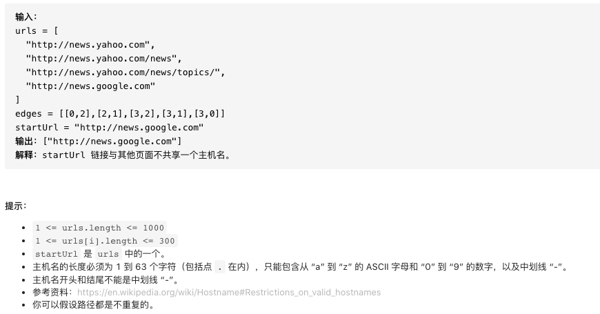

### 1.8.2 解答

```java
/**
 * // This is the HtmlParser's API interface.
 * // You should not implement it, or speculate about its implementation
 * interface HtmlParser {
 *     public List<String> getUrls(String url) {}
 * }
 */
class Solution {
    // 已知URL集合，存储当前可见的所有URL。
    private ConcurrentHashMap<String, Boolean> totalUrls = new ConcurrentHashMap<>();

    // 结果URL链表及对应锁。
    private ReentrantLock resultLock = new ReentrantLock();
    private LinkedList<String> resultUrls = new LinkedList<>();

    // 待抓取URL链表及对应锁。
    private ReentrantLock crawlLock = new ReentrantLock();
    private LinkedList<String> urlsToCrawl = new LinkedList<>();

    // 当前正在执行的工作线程个数。
    private AtomicInteger choreCount = new AtomicInteger(0);

    public List<String> crawl(String startUrl, HtmlParser htmlParser) {
        String hostName = extractHostName(startUrl);

        this.totalUrls.put(startUrl, true);

        addUrlToResult(startUrl);
        addUrlToCrawl(startUrl);

        while (true) {
            String urlToCrawl = fetchUrlToCrawl();
            if (urlToCrawl != null) {
                incrChore();
                Chore chore = new Chore(this, hostName, htmlParser, urlToCrawl);
                (new Thread(chore)).start();
            } else {
                if (this.choreCount.get() == 0) {
                    break;
                }
                LockSupport.parkNanos(1L);
            }
        }

        return fetchResultUrls();
    }

    private String extractHostName(String url) {
        // HTTP protocol only.
        String processedUrl = url.substring(7);

        int index = processedUrl.indexOf("/");
        if (index == -1) {
            return processedUrl;
        } else {
            return processedUrl.substring(0, index);
        }
    }

    private class Chore implements Runnable {
        private Solution solution;
        private String hostName;
        private HtmlParser htmlParser;
        private String urlToCrawl;

        public Chore(Solution solution, String hostName, HtmlParser htmlParser, String urlToCrawl) {
            this.solution = solution;
            this.hostName = hostName;
            this.htmlParser = htmlParser;
            this.urlToCrawl = urlToCrawl;
        }

        @Override
        public void run() {
            try {
                filterUrls(this.htmlParser.getUrls(urlToCrawl));
            } finally {
                this.solution.decrChore();
            }
        }

        private void filterUrls(List<String> crawledUrls) {
            if (crawledUrls == null || crawledUrls.isEmpty()) {
                return;
            }

            for (String url : crawledUrls) {
                // 如果该URL在已知的URL集合中已存在，那么不需要再重复抓取。
                if (this.solution.totalUrls.containsKey(url)) {
                    continue;
                }

                this.solution.totalUrls.put(url, true);

                String crawlHostName = this.solution.extractHostName(url);
                if (!crawlHostName.equals(this.hostName)) {
                    // 如果抓取的URL对应的HostName同Start URL对应的HostName不同，那么直接丢弃该URL。
                    continue;
                }

                // 将该URL添加至结果链表。
                this.solution.addUrlToResult(url);
                // 将该URL添加至待抓取链表，以便进行下一跳抓取。
                this.solution.addUrlToCrawl(url);
            }
        }
    }

    private void addUrlToResult(String url) {
        this.resultLock.lock();
        try {
            this.resultUrls.add(url);
        } finally {
            this.resultLock.unlock();
        }
    }

    private List<String> fetchResultUrls() {
        this.resultLock.lock();
        try {
            return this.resultUrls;
        } finally {
            this.resultLock.unlock();
        }
    }

    private void addUrlToCrawl(String url) {
        this.crawlLock.lock();
        try {
            this.urlsToCrawl.add(url);
        } finally {
            this.crawlLock.unlock();
        }
    }

    private String fetchUrlToCrawl() {
        this.crawlLock.lock();
        try {
            return this.urlsToCrawl.poll();
        } finally {
            this.crawlLock.unlock();
        }
    }

    private void incrChore() {
        this.choreCount.incrementAndGet();
    }

    private void decrChore() {
        this.choreCount.decrementAndGet();
    }
}
```


## 1.9 题目


### 1.9.1 题目描述

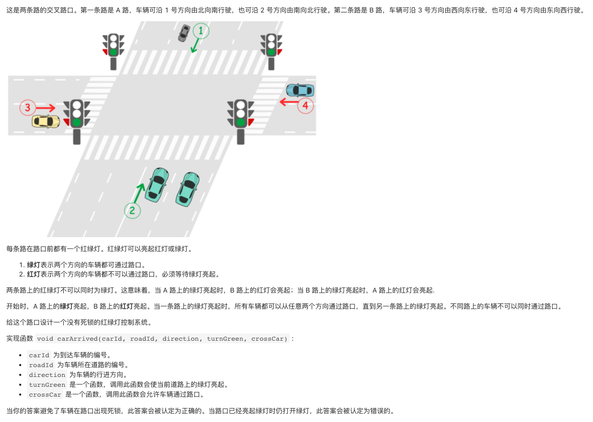

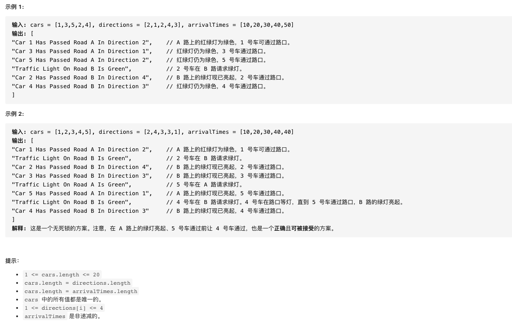

### 1.9.2 解答

```java
class TrafficLight {

    public TrafficLight() {

    }

    boolean road1IsGreen = true;

    public synchronized void carArrived(
            int carId,           // ID of the car
            int roadId,          // ID of the road the car travels on. Can be 1 (road A) or 2 (road B)
            int direction,       // Direction of the car
            Runnable turnGreen,  // Use turnGreen.run() to turn light to green on current road
            Runnable crossCar    // Use crossCar.run() to make car cross the intersection 
    ) {
        if ((roadId == 1) != road1IsGreen) {
            turnGreen.run();
            road1IsGreen = !road1IsGreen;
        }
        crossCar.run();
    }
}
```

解法2：

```java
class TrafficLight {

    Semaphore signal = new Semaphore(1, true);
    private boolean road1IsGreen = true;

    public TrafficLight() {

    }

    public  void carArrived(
            int carId,           // ID of the car
            int roadId,          // ID of the road the car travels on. Can be 1 (road A) or 2 (road B)
            int direction,       // Direction of the car
            Runnable turnGreen,  // Use turnGreen.run() to turn light to green on current road
            Runnable crossCar    // Use crossCar.run() to make car cross the intersection
    ) {

        signal.acquireUninterruptibly();

        if((roadId == 1 && !road1IsGreen) || roadId ==2 && road1IsGreen){
            turnGreen.run();
            road1IsGreen = !road1IsGreen;
        }
        crossCar.run();
        signal.release();
    }
}
```

解法2 的稍微改进的写法

```java
class TrafficLight {

    public TrafficLight() {

    }

    private boolean road1IsGreen = true;
    private Semaphore singal = new Semaphore(1);

    public void carArrived(
            int carId,           // ID of the car
            int roadId,          // ID of the road the car travels on. Can be 1 (road A) or 2 (road B)
            int direction,       // Direction of the car
            Runnable turnGreen,  // Use turnGreen.run() to turn light to green on current road
            Runnable crossCar    // Use crossCar.run() to make car cross the intersection 
    ) {
        try {
            singal.acquire();
        } catch (InterruptedException e) {
            e.printStackTrace();
        }
        if ((roadId == 1) != road1IsGreen) {
            turnGreen.run();
            road1IsGreen = !road1IsGreen;
        }
        crossCar.run();
        singal.release();

    }
}
```


## 1.99 多线程总结


### 1.99.1 多线程保证顺序执行的方法

1. Semaphore
2. Synchronized+wait+notifyAll
3. AtomicInteger(volatile+计数变量)
4. BlockingQueue
5. CyclicBarrier
6. 可重入锁+Condition
7. 自旋+让出CPU


# 2. 动态规划

## 2.1 题目10 正则表达式匹配

### 2.1.1 题目描述

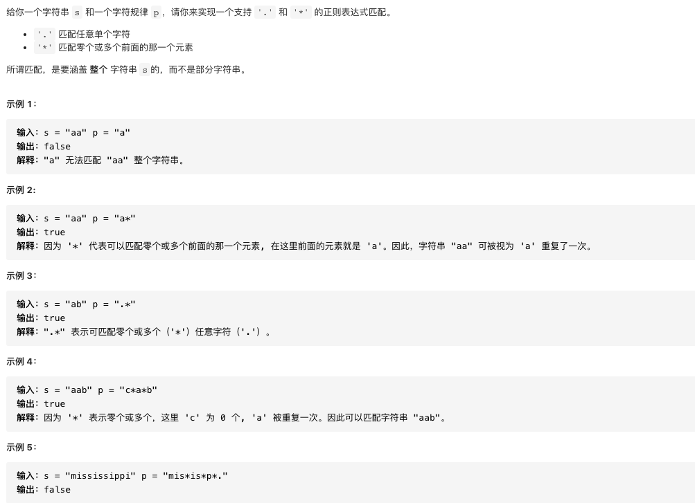

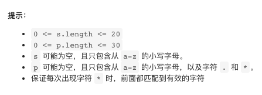

### 2.1.2 解答

**思路：**

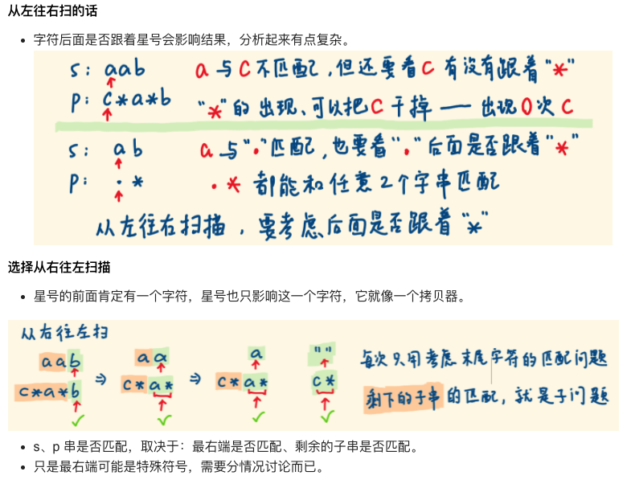

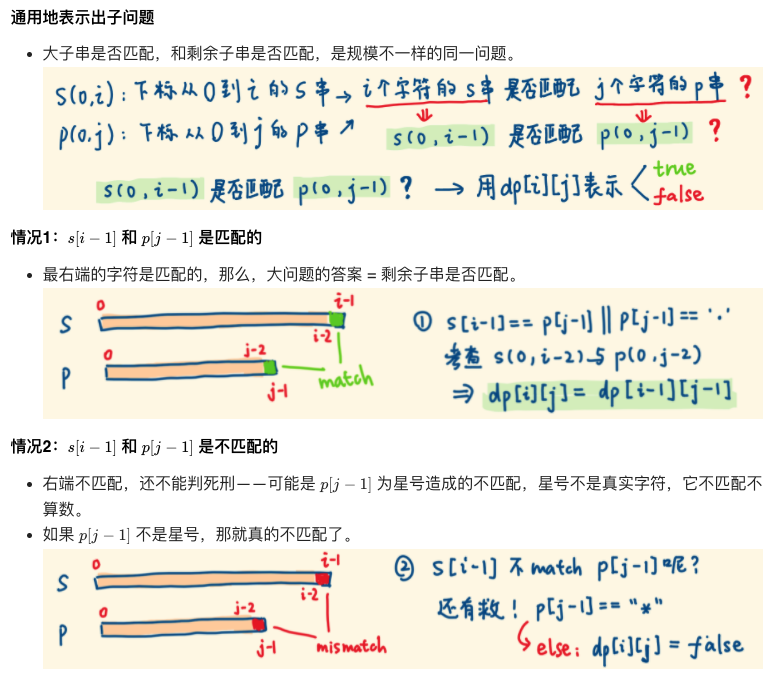

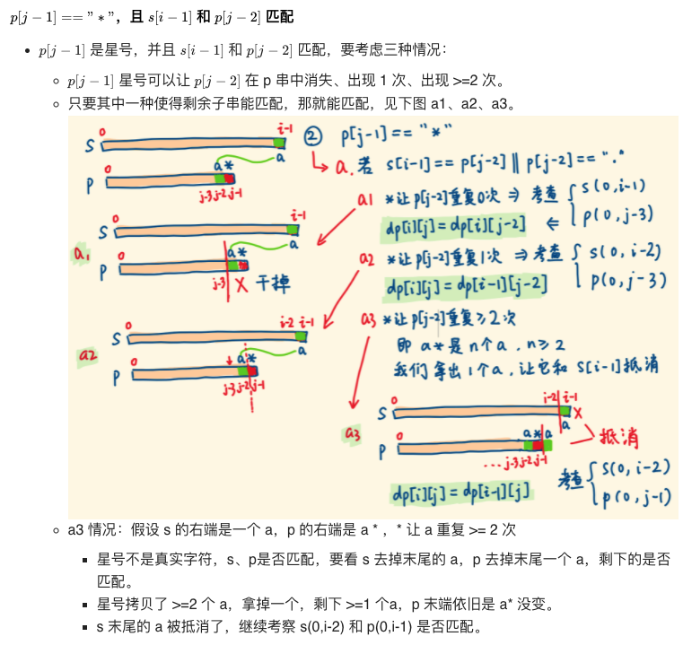

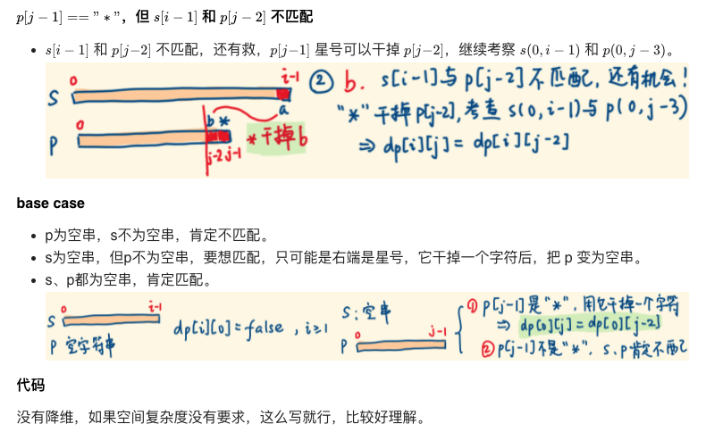

```java
class Solution {
    public boolean isMatch(String s, String p) {
        if (s == null || p == null) {
            return false;
        }
        char[] sArr = s.toCharArray();
        char[] pArr = p.toCharArray();
        int sLen = sArr.length;
        int pLen = pArr.length;
        boolean[][] dp = new boolean[sLen + 1][pLen + 1];
        for (boolean[] a : dp) {
            for (boolean e : a) {
                e = false;
            }
        }

//        base case
        dp[0][0] = true;
        for (int j = 1; j < pLen + 1; j++) {
            if (pArr[j - 1] == '*') {
                dp[0][j] = dp[0][j - 2];
            }
        }
//        迭代
        for (int i = 1; i < sLen + 1; i++) {
            for (int j = 1; j < pLen + 1; j++) {
                //情况1：s[i-1] 和 p[j−1] 是匹配的
                if (sArr[i - 1] == pArr[j - 1] || pArr[j - 1] == '.') {
                    dp[i][j] = dp[i - 1][j - 1];
                } else if (pArr[j - 1] == '*') {//情况2：s[i-1] 和 p[j−1] 是不匹配的
                    //p[j−1]=="∗"，且 s[i-1] 和 p[j−2] 匹配
                    if (sArr[i - 1] == pArr[j - 2] || pArr[j - 2] == '.') {
                        if (dp[i][j - 2]) {//*让p[j-2]重复0次，此时需要比较s(0,i-1)和p(0,j-3)
                            dp[i][j] = dp[i][j - 2];
                        } else if (dp[i - 1][j - 2]) {//*让p[j-2]重复1次,此时需要比较s(0,i-2)和p(0,j-3)
                            dp[i][j] = dp[i - 1][j - 2];
                        } else {//*让p[j-2]重复≥2次,拿出一个a,让它和s[i-1]抵消，此时需要比较s(0,i-2)和p(0,j-1)
                            dp[i][j] = dp[i - 1][j];
                        }

                    } else {//p[j−1]=="∗"，但 s[i-1] 和 p[j−2] 不匹配,让*干掉p[j-2],继续考察p[j-3]
                        dp[i][j] = dp[i][j - 2];
                    }

                }
            }

        }
        return dp[sLen][pLen];
    }
}
```

使用go解法

```go
func isMatch(s string, p string) bool {
	sLen, pLen := len(s), len(p)
	dp := make([][]bool, sLen+1)
	for i := 0; i < len(dp); i++ {
		dp[i] = make([]bool, pLen+1)
	}
	//base case
	dp[0][0] = true
	for j := 1; j < pLen+1; j++ {
		if p[j-1] == '*' {
			dp[0][j] = dp[0][j-2]
		}
	}
	for i := 1; i < sLen+1; i++ {
		for j := 1; j < pLen+1; j++ {
			//情况1:s[i-1]和p[j-1]匹配
			if s[i-1] == p[j-1] || p[j-1] == '.' {
				dp[i][j] = dp[i-1][j-1]
			} else if p[j-1] == '*' { //情况2:s[i-1]和p[j-1]不匹配,但是p[j-1]是*
				//s[i-1]和p[j-2]匹配
				if s[i-1] == p[j-2] || p[j-2] == '.' {
					//情况2.1:*让p[j-2]出现0次，此时需要比较s(0,i-1)和p(0,j-3)
					if dp[i][j-2] {
						dp[i][j] = dp[i][j-2]
					} else if dp[i-1][j-1] { //情况2.2:*让p[j-2]出现1次,此时需要比较s(0,i-2)和p(0,j-2)
						dp[i][j] = dp[i-1][j-1]
					} else {
						//情况2.3:*让p[j-2]出现≥2次,拿出一个抵消s[i-1],此时需要比较s(0,i-2)和p(0,j-1)
						dp[i][j] = dp[i-1][j]
					}

				} else {
					//s[i-1]和p[j-2]不匹配,让*把p[j-2]干掉，继续考察s[i-1]和p[j-3]是否匹配
					dp[i][j] = dp[i][j-2]

				}
			}
		}
	}
	return dp[sLen][pLen]
}
```

## 2.2 题目32 最长有效括号

### 2.2.1 题目描述

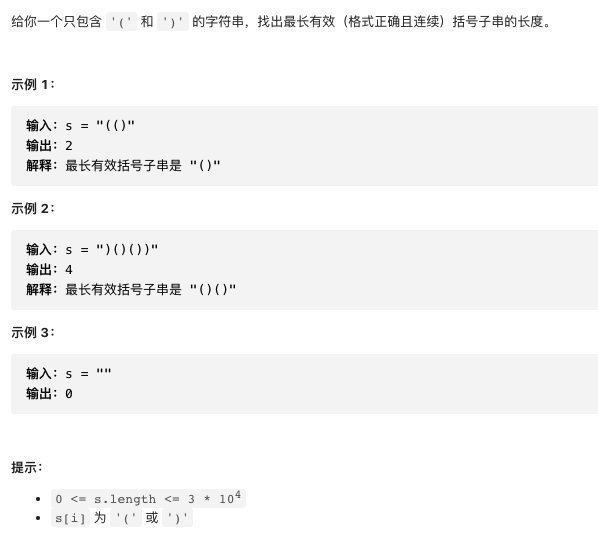

### 2.2.2 解答

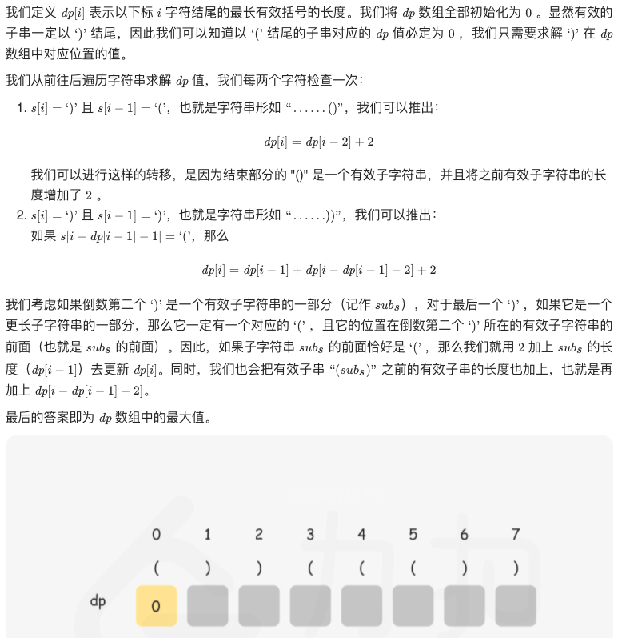


```java
public class Solution {
    public int longestValidParentheses(String s) {
        int maxans = 0;
        int[] dp = new int[s.length()];
        for (int i = 1; i < s.length(); i++) {
            if (s.charAt(i) == ')') {
                if (s.charAt(i - 1) == '(') {
                    dp[i] = (i >= 2 ? dp[i - 2] : 0) + 2;
                } else if (i - dp[i - 1] > 0 && s.charAt(i - dp[i - 1] - 1) == '(') {
                    dp[i] = dp[i - 1] + ((i - dp[i - 1]) >= 2 ? dp[i - dp[i - 1] - 2] : 0) + 2;
                }
                maxans = Math.max(maxans, dp[i]);
            }
        }
        return maxans;
    }
}
```

go的写法

```go
func longestValidParentheses(s string) int {
	maxans := 0
	dp := make([]int, len(s))
	for i := 1; i < len(s); i++ {
		if s[i] == ')' {
			if s[i-1] == '(' {
				if i >= 2 {
					dp[i] = dp[i-2] + 2
				} else {
					dp[i] = 2
				}

			} else if i-dp[i-1] > 0 && s[i-dp[i-1]-1] == '(' {
				if i-dp[i-1] >= 2 {
					dp[i] = dp[i-1] + dp[i-dp[i-1]-2] + 2
				} else {
					dp[i] = dp[i-1] + 2
				}
			}
		}
		if dp[i] > maxans {
			maxans = dp[i]
		}
	}

	return maxans

}
```


思路2：


# 3. 字符串


# 4. 链表


