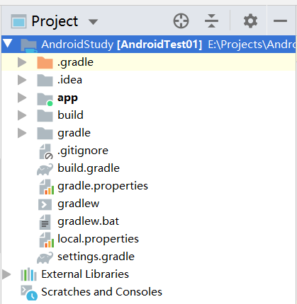
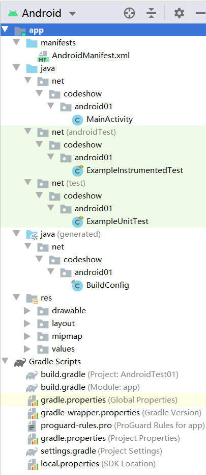

# 1.剖析Android应用程序

## 2.Android应用程序文件组成

## 2.1 两种模式

在使用Android Studio开发Android应用程序时，通常会使用如下两种模式的目录结构

1. Project(工程)模式
   

+ .gradle:表示Gradle编译系统，其版本由Wrapper指定
+ .idea:Android Studio IDE所需要的文件
+ app:当前工程的具体实现代码
+ build:编译当前程序代码后，保存生成的文件
+ gradle:Wrapper的jar和配置文件所在的位置
+ build.gradle:实现gradle编译功能的相关配置文件，其作用相当于Makefile
+ gradle.properties:和gradle相关的全局属性设置
+ gradlew:编译脚本，可以在命令行执行打包，是一个Gradle Wrapper可执行文件
+ gradlew.bat:Windows系统下的Gradle Wrapper可执行文件
+ local.properties:本地属性设置(设置Key、设置和Android SDK的位置等)，这个文件是不推荐上传到VCS中去的
+ settings.gradle:和设置相关的gradle脚本
+ External Libraries:当前项目一来的Lib，在编译时会自动下载

2. Android结构模式

   

   + app/manifests:AndroidManifest.xml配置文件目录
   + app/java:源码目录
   + app/res:资源文件目录
   + Gradle Scripts:和gradle编译相关的脚本文件

