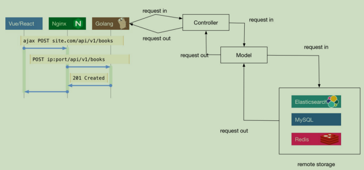
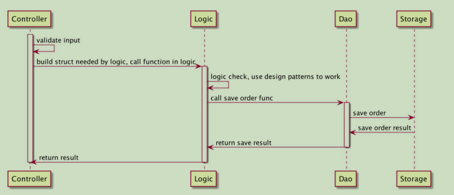
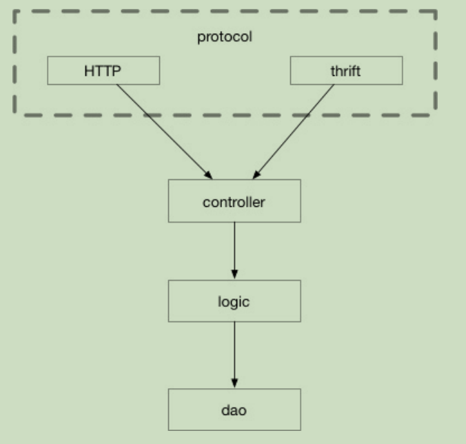

# 架构相关技术总结
## 1. 前后端分离交互
  
## 2. 后端分层后请求处理流程

### 2.1 结构划分
整体分为两层:model 和 controller  
其中controller主要负责路由的转发，前端入参的校验以及构造model层需要的参数结构体
model层分为两层，分别是logic和dao,其中logic主要负责业务逻辑的处理,注意logic层收到的参数都已经经过上层校验，所以本层不做任何参数校验相关的工作。dao层主要负责数据持久化相关工作，包括数据库表结构的定义以及数据库的增删改查。  

## 3. 多协议请求交互

