[TOC]

# 1. 单例模式

单例模式的代码实现方式有8种，其中有3种是可以保证线程安全的，分别是饿汉式、double check、枚举类，其中枚举类是可以避免反序列化问题的，其他的写法都无法避免反序列化问题，所以枚举类是最完美的一种实现方案

# 2. 策略模式

Java中的comparator用到了策略模式

策略模式封装的是做一件事情的时候的不同的执行方式

## 2.1 使用场景

# 3. 工厂模式

## 3.1 简单工厂

## 3.2 工厂方法

从产品维度进行扩展

## 3.3  抽象工厂

从产品一族进行扩展

# 4. 调停者Mediator

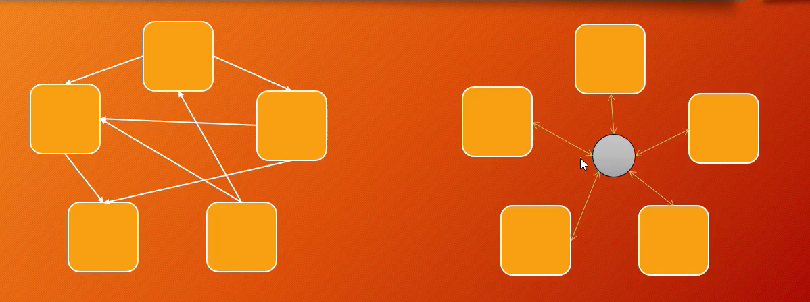

应用场景：消息中间件

# 5. 门面模式

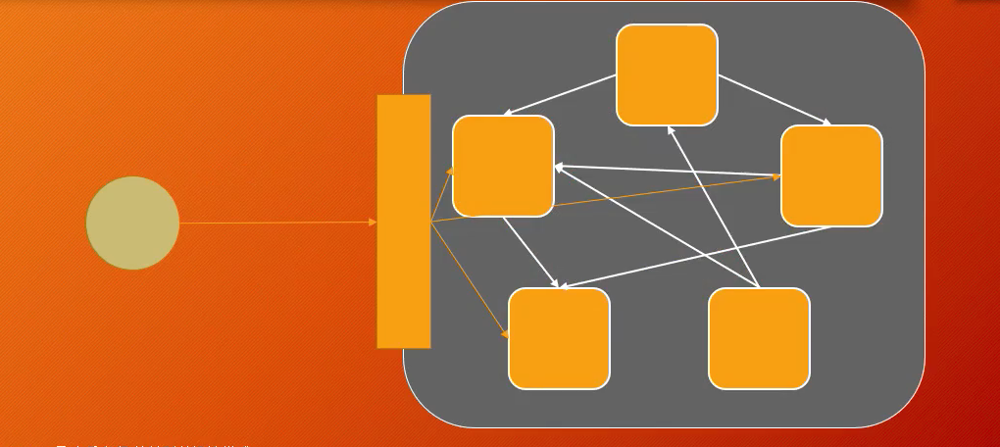

 注意：门面模式和调停者模式只是看问题的角度不同

# 6. 装饰器

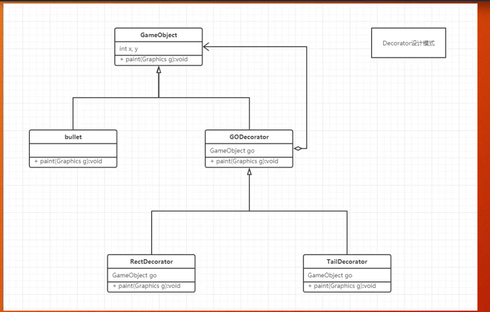

# 7. 观察者模式Observer

事件处理模型

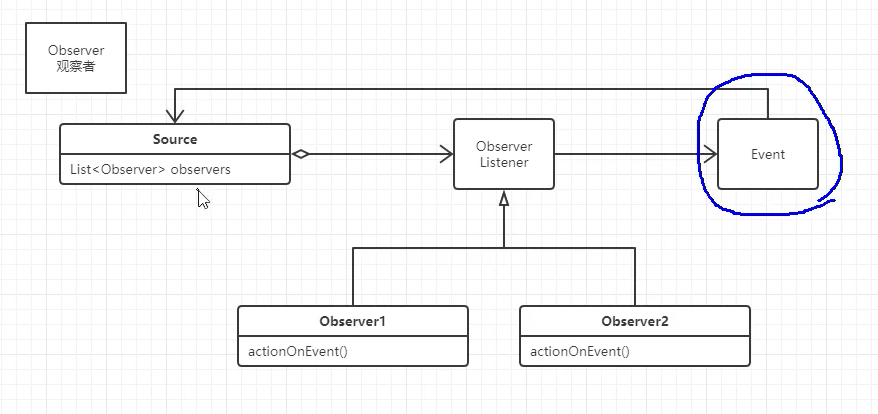

# 8. 组合Composite

树状结构专用模式

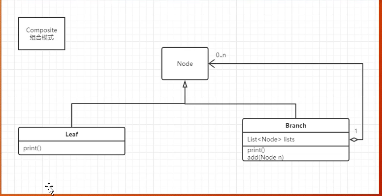

# 9. 享元Flyweight模式

重复利用对象

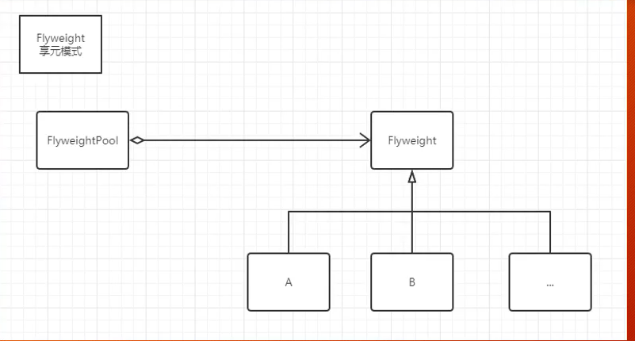

java中的String 就是用的该模式  字符串常量池

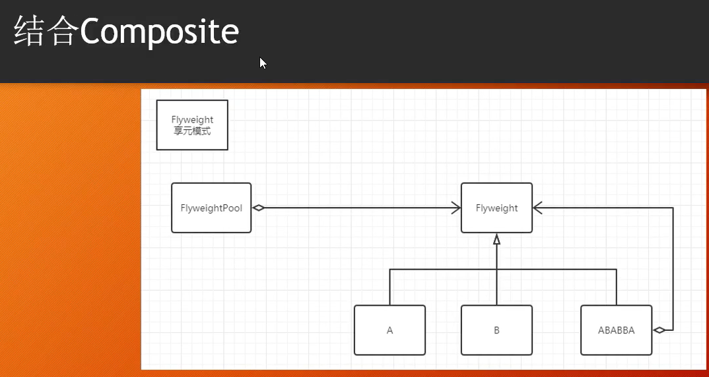

# 10. 代理模式

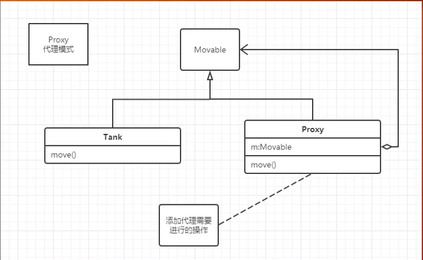

## 10.1 静态代理

## 10.2  动态代理

## 10.3 Spring AOP

# 11. 迭代器Iterator模式

容器与容器遍历

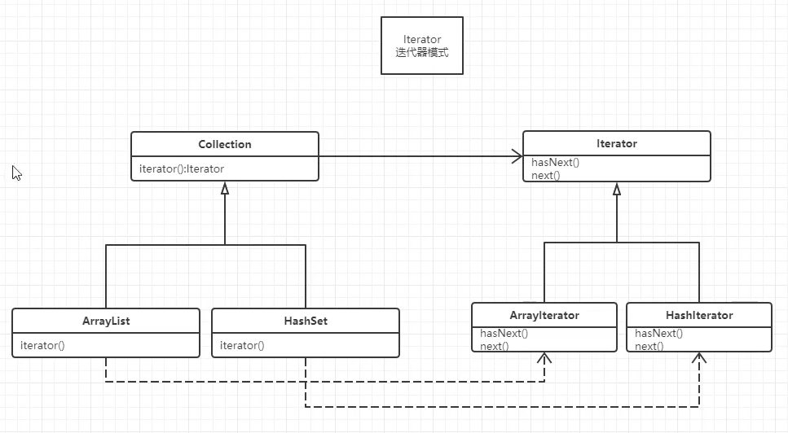

# 12. 访问者Visitor

在结构不变的情况下动态改变对于内部元素的动作

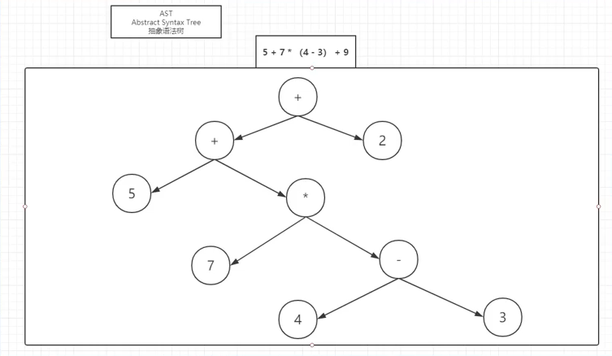

编译器的例子

# 13. 责任链模式

springmvc的拦截器

# 14. Builder

构建复杂对象

**该看39**

java.lang.StringBuilder 中的建造者模式

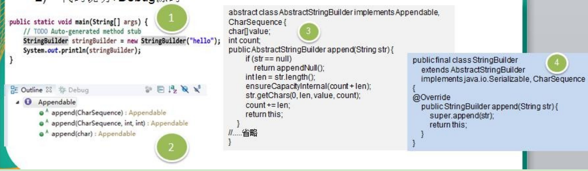

- Appendable 接口定义了多个 append 方法(抽象方法), 即 Appendable 为抽象建造者, 定义了抽象方法

- AbstractStringBuilder  实现了  Appendable  接口方法，这里的  AbstractStringBuilder	已经是建造者，只是不能实例化

- StringBuilder 即充当了指挥者角色，同时充当了具体的建造者，建造方法的实现是由 AbstractStringBuilder 完成 , 而 StringBuilder	继承了 AbstractStringBuilder

# 15. 适配器模式

## 15.1 基本介绍

1) 适配器模式(Adapter Pattern)将某个类的接口转换成客户端期望的另一个接口表示，主的目的是兼容性，让原本因接口不匹配不能一起工作的两个类可以协同工作。其别名为包装器(Wrapper)

2) 适配器模式属于结构型模式

3) 主要分为三类：类适配器模式、对象适配器模式、接口适配器模式

## 15.2 工作原理

1) 适配器模式：将一个类的接口转换成另一种接口.让原本接口不兼容的类可以兼容

2) 从用户的角度看不到被适配者，是解耦的

3) 用户调用适配器转化出来的目标接口方法，适配器再调用被适配者的相关接口方法

4) 用户收到反馈结果，感觉只是和目标接口交互，如图

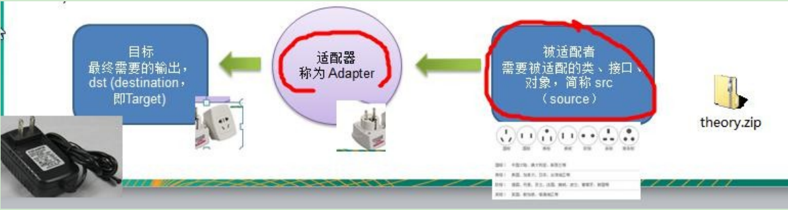

