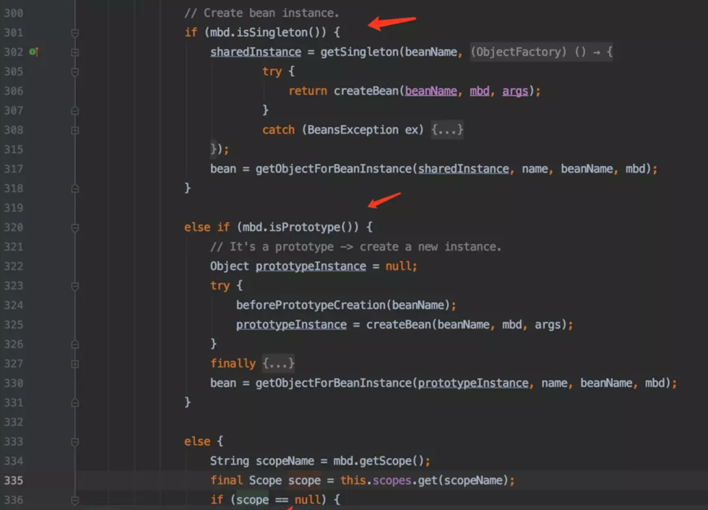

[TOC]

# 1. 克隆会破坏单例对象吗？

可能会。

由克隆我们可以想到原型模式，原型模式就是通过clone方法实现对象的创建的，clone方式是Object方法，每个对象都有，那我使用一个单例模式类的对象，调用clone方法，再创建一个新的对象了，那岂不是上面说的单例模式失效了。当然答案是否定，某一个对象直接调用clone方法，会抛出异常，即并不能成功克隆一个对象。调用该方法时，必须实现一个Cloneable 接口。这也就是原型模式的实现方式。还有即如果该类实现了cloneable接口，尽管构造函数是私有的，他也可以创建一个对象。即clone方法是不会调用构造函数的，他是直接从内存中copy内存区域的。所以单例模式的类是不可以实现cloneable接口的。

# 2. 可能对单例模式造成破坏的几种方式

## 2.1 克隆

由克隆我们可以想到原型模式，原型模式就是通过clone方法实现对象的创建的，clone方式是Object方法，每个对象都有，那我使用一个单例模式类的对象，调用clone方法，再创建一个新的对象了，那岂不是上面说的单例模式失效了。当然答案是否定，某一个对象直接调用clone方法，会抛出异常，即并不能成功克隆一个对象。调用该方法时，必须实现一个Cloneable 接口。这也就是原型模式的实现方式。还有即如果该类实现了cloneable接口，尽管构造函数是私有的，他也可以创建一个对象。即clone方法是不会调用构造函数的，他是直接从内存中copy内存区域的。所以单例模式的类是不可以实现cloneable接口的。

## 2.2 序列化

一是可以实现数据的持久化；二是可以对象数据的远程传输。 
如果过该类implements Serializable，那么就会在反序列化的过程中再创一个对象。这个问题的解决办法就是在反序列化时，指定反序化的对象实例。添加如下方法

```java
 private static final long serialVersionUID = -3979059770681747301L;
 
    private volatile static Singleton singleton;
 
    private Object readResolve() {
        return singleton;
    }
```

## 2.3 反射

反射是可以获取类的构造函数，再加一行 setAccessible(true);就可以调用私有的构造函数，创建对象了。那么防止反射破坏Java单例模式的方法就是：当第二次调用构造函数时抛出异常。代码如下：

```java
private volatile static Singleton1 singleton;
 
    private  static boolean  flag = true;
    private Singleton1 (){
        if(flag){
        flag = false;   
        }else{
            throw new RuntimeException("单例模式险些被破坏，第二个对象未创建成功");
        }
 
    }
```

# 3. 原型模式在Spring中的应用

spring 提供了5种scope分别是singleton, prototype, request, session,global session。
如果一个bean被声明为单例的时候，在处理多次请求的时候在spring 容器里只实例化出一个bean，后续的请求都公用这个对象，这个对象会保存在一个map里面。当有请求来的时候会先从缓存(map)里查看有没有，有的话直接使用这个对象，没有的话才实例化一个新的对象，所以这是个单例的。但是对于原型(prototype)bean来说当每次请求来的时候直接实例化新的bean，没有缓存以及从缓存查的过程。
源码如下：




# 4. 简单工厂模式在Logback源码中的应用

在LoggerFactory中有多个getLogger()

```java
  public static Logger getLogger(String name) {
    ILoggerFactory iLoggerFactory = getILoggerFactory();
    return iLoggerFactory.getLogger(name);
  }
 
  public static Logger getLogger(Class clazz) {
    return getLogger(clazz.getName());
  }
```

# 5. 简单工厂模式在JDK源码中的应用

## 5.1 Calendar类

```java
public static Calendar getInstance() {
    Calendar cal = createCalendar(TimeZone.getDefaultRef(), Locale.getDefault(Locale.Category.FORMAT));
    cal.sharedZone = true;
    return cal;
}
```


# 6. 工厂方法、简单工厂、抽象工厂的区别？

工厂方法模式，就是把一个静态方法当作创建对象的工厂

**工厂模式就两个核心要点：**

1. 有没有具体的工厂实例
2. 生产的产品是具体的还是抽象的

**简单工厂 和抽象工厂的区别：**

简单工厂生产具体产品，新增一种产品，就需要新增一个工厂；抽象工厂生产抽象产品，新增一种产品，不需要新增工厂。


# 7. 抽象工厂模式在Spring源码中的应用

在 Spring 中，BeanFactory 是用于管理 Bean 的一个工厂，所有工厂都是 BeanFactory 的子类。这样我们可以通过 IOC 容器来管理访问 Bean，根据不同的策略调用 getBean() 方法，从而获得具体对象。

其中，BeanFactory 接口的源码如下：

```java
public interface BeanFactory {
    String FACTORY_BEAN_PREFIX = "&";
    Object getBean(String name) throws BeansException;
    <T> T getBean(String name, @Nullable Class<T> requiredType) throws BeansException;
    Object getBean(String name, Object... args) throws BeansException;
    <T> T getBean(Class<T> requiredType) throws BeansException;
    <T> T getBean(Class<T> requiredType, Object... args) throws BeansException;
    boolean containsBean(String name);
    boolean isSingleton(String name) throws NoSuchBeanDefinitionException;
    boolean isPrototype(String name) throws NoSuchBeanDefinitionException;
    boolean isTypeMatch(String name, ResolvableType typeToMatch) throws NoSuchBeanDefinitionException;
    boolean isTypeMatch(String name, @Nullable Class<?> typeToMatch) throws NoSuchBeanDefinitionException;
    @Nullable
    Class<?> getType(String name) throws NoSuchBeanDefinitionException;
    String[] getAliases(String name);
}
```

# 8.建造者模式实现链式赋值

## 8.1 原来的实现

```java
@Data
public class Student {
 
    private String name;
    private int age;
    private int gender;
}
```

测试类

```java
public class Test {
 
    public static void main(String[] args) {
        Student student = new Student();
        student.setName("小明");
        student.setAge(10);
        student.setGender(1);
        // Student(name=小明, age=10, gender=1)
        System.out.println(student);
    }
}
```

## 8.2 后来的实现

```java
@Data
@Builder
public class Student {
 
    private String name;
    private int age;
    private int gender;
}
```

测试类

```java
public class Test {
 
    public static void main(String[] args) {
        Student student = Student.builder().name("小明")
                .age(10).gender(1).build();
        // Student(name=小明, age=10, gender=1)
        System.out.println(student);
    }
}
```

## 8.3 如何写建造者模式

直接看最后编译生成的class文件反编译后的内容

```java
public class Student {
    private String name;
    private int age;
    private int gender;
 
    Student(String name, int age, int gender) {
        this.name = name;
        this.age = age;
        this.gender = gender;
    }
 
    public static Student.StudentBuilder builder() {
        return new Student.StudentBuilder();
    }
 
    // 省略get和set方法
 
    public String toString() {
        return "Student(name=" + this.getName() + ", age=" + this.getAge() + ", gender=" + this.getGender() + ")";
    }
 
    public static class StudentBuilder {
        private String name;
        private int age;
        private int gender;
 
        StudentBuilder() {
        }
 
        public Student.StudentBuilder name(String name) {
            this.name = name;
            return this;
        }
 
        public Student.StudentBuilder age(int age) {
            this.age = age;
            return this;
        }
 
        public Student.StudentBuilder gender(int gender) {
            this.gender = gender;
            return this;
        }
 
        public Student build() {
            return new Student(this.name, this.age, this.gender);
        }
 
    }
}
```


# 9. 建造者模式在Java代码中的应用

建造者模式是将一个复杂对象分解成多个相对简单的部分，然后根据不同需要分别创建它们，最后构建成该复杂对象。

JDK 中 java.lang.StringBuilder 和 java.lang.StringBuffer 两个对字符串操作的类使用了建造者模式。类中的 append、delete、replace、insert、deleteCharAt、appendCodePoint 方法，通过传入字符或字符串相关的参数，return this 构造对象。

```java
public StringBuilder append(String str) {
    super.append(str);
    return this;
}
 
public StringBuilder appendCodePoint(int codePoint) {
    super.appendCodePoint(codePoint);
    return this;
}
```

```java
public StringBuilder delete(int start, int end) {
    super.delete(start, end);
    return this;
}
 
public StringBuilder deleteCharAt(int index) {
    super.deleteCharAt(index);
    return this;
}
 
public StringBuilder replace(int start, int end, String str) {
    super.replace(start, end, str);
    return this;
}
 
public StringBuilder insert(int index, char[] str, int offset, int len)
{
    super.insert(index, str, offset, len);
    return this;
}
```

# 10. 使用适配器模式实现第三方登录自由适配


# 11. 桥接模式应用之JDBC驱动


# 12. 装饰器模式在Java源码中的应用

装饰器模式中的装饰器类是对原始类功能的增强，Java IO 类库是装饰器模式的非常经典的应用，下面以 Collections 类来说明。

Collections 类是集合容器的工具类，有很多静态方法用来创建各种集合容器。

```java
 
public class Collections {
  private Collections() {}
    
  public static <T> Collection<T> unmodifiableCollection(Collection<? extends T> c) {
    return new UnmodifiableCollection<>(c);
  }
 
  static class UnmodifiableCollection<E> implements Collection<E>,   Serializable {
    private static final long serialVersionUID = 1820017752578914078L;
    final Collection<? extends E> c;
 
    UnmodifiableCollection(Collection<? extends E> c) {
      if (c==null)
        throw new NullPointerException();
      this.c = c;
    }
 
    public int size()                   {return c.size();}
    public boolean isEmpty()            {return c.isEmpty();}
    public boolean contains(Object o)   {return c.contains(o);}
    public Object[] toArray()           {return c.toArray();}
    public <T> T[] toArray(T[] a)       {return c.toArray(a);}
    public String toString()            {return c.toString();}
 
    public Iterator<E> iterator() {
      return new Iterator<E>() {
        private final Iterator<? extends E> i = c.iterator();
 
        public boolean hasNext() {return i.hasNext();}
        public E next()          {return i.next();}
        public void remove() {
          throw new UnsupportedOperationException();
        }
        @Override
        public void forEachRemaining(Consumer<? super E> action) {
          // Use backing collection version
          i.forEachRemaining(action);
        }
      };
    }
 
    public boolean add(E e) {
      throw new UnsupportedOperationException();
    }
    public boolean remove(Object o) {
       hrow new UnsupportedOperationException();
    }
    public boolean containsAll(Collection<?> coll) {
      return c.containsAll(coll);
    }
    public boolean addAll(Collection<? extends E> coll) {
      throw new UnsupportedOperationException();
    }
    public boolean removeAll(Collection<?> coll) {
      throw new UnsupportedOperationException();
    }
    public boolean retainAll(Collection<?> coll) {
      throw new UnsupportedOperationException();
    }
    public void clear() {
      throw new UnsupportedOperationException();
    }
 
    // Override default methods in Collection
    @Override
    public void forEach(Consumer<? super E> action) {
      c.forEach(action);
    }
    @Override
    public boolean removeIf(Predicate<? super E> filter) {
      throw new UnsupportedOperationException();
    }
    @SuppressWarnings("unchecked")
    @Override
    public Spliterator<E> spliterator() {
      return (Spliterator<E>)c.spliterator();
    }
    @SuppressWarnings("unchecked")
    @Override
    public Stream<E> stream() {
      return (Stream<E>)c.stream();
    }
    @SuppressWarnings("unchecked")
    @Override
    public Stream<E> parallelStream() {
      return (Stream<E>)c.parallelStream();
    }
  }
}
```

尽管 UnmodifiableCollection 类可以算是对 Collection 类的一种功能增强，但这点还不具备足够的说服力来断定 UnmodifiableCollection 就是 Collection 类的装饰器类。

最关键的一点是，UnmodifiableCollection 的构造函数接收一个 Collection 类对象，然后对其所有的函数进行了包裹（Wrap）：重新实现（比如 add() 函数）或者简单封装（比如 stream() 函数）。

而简单的接口实现或者继承，并不会如此来实现 UnmodifiableCollection 类。所以，从代码实现的角度来说，UnmodifiableCollection 类是典型的装饰器类。


