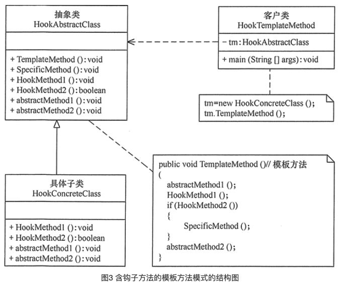
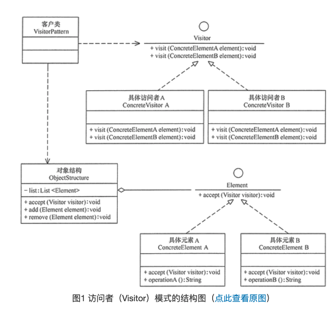

[TOC]

# 1.门面/外观(Facade)模式

## 1.1 现实生活例子


## 1.2 外观模式的定义与特点

外观（Facade）模式又叫作门面模式，是一种通过为多个复杂的子系统提供一个一致的接口，而使这些子系统更加容易被访问的模式。该模式对外有一个统一接口，外部应用程序不用关心内部子系统的具体细节，这样会大大降低应用程序的复杂度，提高了程序的可维护性。

在日常编码工作中，我们都在有意无意的大量使用外观模式。只要是高层模块需要调度多个子系统（2个以上的类对象），我们都会自觉地创建一个新的类封装这些子系统，提供精简的接口，让高层模块可以更加容易地间接调用这些子系统的功能。尤其是现阶段各种第三方SDK、开源类库，很大概率都会使用外观模式。

外观（Facade）模式是“迪米特法则”的典型应用，它有以下主要优点。

1. 降低了子系统与客户端之间的耦合度，使得子系统的变化不会影响调用它的客户类。
2. 对客户屏蔽了子系统组件，减少了客户处理的对象数目，并使得子系统使用起来更加容易。
3. 降低了大型软件系统中的编译依赖性，简化了系统在不同平台之间的移植过程，因为编译一个子系统不会影响其他的子系统，也不会影响外观对象。


外观（Facade）模式的主要缺点如下。

1. 不能很好地限制客户使用子系统类，很容易带来未知风险。
2. 增加新的子系统可能需要修改外观类或客户端的源代码，违背了“开闭原则”。

## 1.3 外观模式的结构与实现

外观（Facade）模式的结构比较简单，主要是定义了一个高层接口。它包含了对各个子系统的引用，客户端可以通过它访问各个子系统的功能。现在来分析其基本结构和实现方法。

### 1. 模式的结构

外观（Facade）模式包含以下主要角色。

1. 外观（Facade）角色：为多个子系统对外提供一个共同的接口。
2. 子系统（Sub System）角色：实现系统的部分功能，客户可以通过外观角色访问它。
3. 客户（Client）角色：通过一个外观角色访问各个子系统的功能。

其结构图入下图所示


### 2. 模式的实现

```java
package facade;

public class FacadePattern {
    public static void main(String[] args) {
        Facade f = new Facade();
        f.method();
    }
}

//外观角色
class Facade {
    private SubSystem01 obj1 = new SubSystem01();
    private SubSystem02 obj2 = new SubSystem02();
    private SubSystem03 obj3 = new SubSystem03();

    public void method() {
        obj1.method1();
        obj2.method2();
        obj3.method3();
    }
}

//子系统角色
class SubSystem01 {
    public void method1() {
        System.out.println("子系统01的method1()被调用！");
    }
}

//子系统角色
class SubSystem02 {
    public void method2() {
        System.out.println("子系统02的method2()被调用！");
    }
}

//子系统角色
class SubSystem03 {
    public void method3() {
        System.out.println("子系统03的method3()被调用！");
    }
}
```

程序运行结果如下：

```bash
子系统01的method1()被调用！
子系统02的method2()被调用！
子系统03的method3()被调用！
```

## 1.4 门面模式的应用实例

**用“外观模式”设计一个婺源特产的选购界面。**

分析：本实例的外观角色 WySpecialty 是 JPanel 的子类，它拥有 8 个子系统角色 Specialty1~Specialty8，它们是图标类（ImageIcon）的子类对象，用来保存该婺源特产的图标（[点此下载要显示的婺源特产的图片](http://c.biancheng.net/uploads/soft/181113/3-1Q115152634.zip)）。

外观类（WySpecialty）用 JTree 组件来管理婺源特产的名称，并定义一个事件处理方法 valueClianged(TreeSelectionEvent e)，当用户从树中选择特产时，该特产的图标对象保存在标签（JLabd）对象中。

客户窗体对象用分割面板来实现，左边放外观角色的目录树，右边放显示所选特产图像的标签

其结构图如下图所示


```java
package facade;

import java.awt.*;
import javax.swing.*;
import javax.swing.event.*;
import javax.swing.tree.DefaultMutableTreeNode;

public class WySpecialtyFacade {
    public static void main(String[] args) {
        JFrame f = new JFrame("外观模式: 婺源特产选择测试");
        Container cp = f.getContentPane();
        WySpecialty wys = new WySpecialty();
        JScrollPane treeView = new JScrollPane(wys.tree);
        JScrollPane scrollpane = new JScrollPane(wys.label);
        JSplitPane splitpane = new JSplitPane(JSplitPane.HORIZONTAL_SPLIT, true, treeView, scrollpane); //分割面版
        splitpane.setDividerLocation(230);     //设置splitpane的分隔线位置
        splitpane.setOneTouchExpandable(true); //设置splitpane可以展开或收起                      
        cp.add(splitpane);
        f.setSize(650, 350);
        f.setVisible(true);
        f.setDefaultCloseOperation(JFrame.EXIT_ON_CLOSE);
    }
}

class WySpecialty extends JPanel implements TreeSelectionListener {
    private static final long serialVersionUID = 1L;
    final JTree tree;
    JLabel label;
    private Specialty1 s1 = new Specialty1();
    private Specialty2 s2 = new Specialty2();
    private Specialty3 s3 = new Specialty3();
    private Specialty4 s4 = new Specialty4();
    private Specialty5 s5 = new Specialty5();
    private Specialty6 s6 = new Specialty6();
    private Specialty7 s7 = new Specialty7();
    private Specialty8 s8 = new Specialty8();

    WySpecialty() {
        DefaultMutableTreeNode top = new DefaultMutableTreeNode("婺源特产");
        DefaultMutableTreeNode node1 = null, node2 = null, tempNode = null;
        node1 = new DefaultMutableTreeNode("婺源四大特产（红、绿、黑、白）");
        tempNode = new DefaultMutableTreeNode("婺源荷包红鲤鱼");
        node1.add(tempNode);
        tempNode = new DefaultMutableTreeNode("婺源绿茶");
        node1.add(tempNode);
        tempNode = new DefaultMutableTreeNode("婺源龙尾砚");
        node1.add(tempNode);
        tempNode = new DefaultMutableTreeNode("婺源江湾雪梨");
        node1.add(tempNode);
        top.add(node1);
        node2 = new DefaultMutableTreeNode("婺源其它土特产");
        tempNode = new DefaultMutableTreeNode("婺源酒糟鱼");
        node2.add(tempNode);
        tempNode = new DefaultMutableTreeNode("婺源糟米子糕");
        node2.add(tempNode);
        tempNode = new DefaultMutableTreeNode("婺源清明果");
        node2.add(tempNode);
        tempNode = new DefaultMutableTreeNode("婺源油煎灯");
        node2.add(tempNode);
        top.add(node2);
        tree = new JTree(top);
        tree.addTreeSelectionListener(this);
        label = new JLabel();
    }

    public void valueChanged(TreeSelectionEvent e) {
        if (e.getSource() == tree) {
            DefaultMutableTreeNode node = (DefaultMutableTreeNode) tree.getLastSelectedPathComponent();
            if (node == null) return;
            if (node.isLeaf()) {
                Object object = node.getUserObject();
                String sele = object.toString();
                label.setText(sele);
                label.setHorizontalTextPosition(JLabel.CENTER);
                label.setVerticalTextPosition(JLabel.BOTTOM);
                sele = sele.substring(2, 4);
                if (sele.equalsIgnoreCase("荷包")) label.setIcon(s1);
                else if (sele.equalsIgnoreCase("绿茶")) label.setIcon(s2);
                else if (sele.equalsIgnoreCase("龙尾")) label.setIcon(s3);
                else if (sele.equalsIgnoreCase("江湾")) label.setIcon(s4);
                else if (sele.equalsIgnoreCase("酒糟")) label.setIcon(s5);
                else if (sele.equalsIgnoreCase("糟米")) label.setIcon(s6);
                else if (sele.equalsIgnoreCase("清明")) label.setIcon(s7);
                else if (sele.equalsIgnoreCase("油煎")) label.setIcon(s8);
                label.setHorizontalAlignment(JLabel.CENTER);
            }
        }
    }
}

class Specialty1 extends ImageIcon {
    private static final long serialVersionUID = 1L;

    Specialty1() {
        super("src/facade/WyImage/Specialty11.jpg");
    }
}

class Specialty2 extends ImageIcon {
    private static final long serialVersionUID = 1L;

    Specialty2() {
        super("src/facade/WyImage/Specialty12.jpg");
    }
}

class Specialty3 extends ImageIcon {
    private static final long serialVersionUID = 1L;

    Specialty3() {
        super("src/facade/WyImage/Specialty13.jpg");
    }
}

class Specialty4 extends ImageIcon {
    private static final long serialVersionUID = 1L;

    Specialty4() {
        super("src/facade/WyImage/Specialty14.jpg");
    }
}

class Specialty5 extends ImageIcon {
    private static final long serialVersionUID = 1L;

    Specialty5() {
        super("src/facade/WyImage/Specialty21.jpg");
    }
}

class Specialty6 extends ImageIcon {
    private static final long serialVersionUID = 1L;

    Specialty6() {
        super("src/facade/WyImage/Specialty22.jpg");
    }
}

class Specialty7 extends ImageIcon {
    private static final long serialVersionUID = 1L;

    Specialty7() {
        super("src/facade/WyImage/Specialty23.jpg");
    }
}

class Specialty8 extends ImageIcon {
    private static final long serialVersionUID = 1L;

    Specialty8() {
        super("src/facade/WyImage/Specialty24.jpg");
    }
}
```

程序运行结果如图所示


## 1.5 门面模式的应用场景

通常在以下情况下可以考虑使用外观模式。

1. 对分层结构系统构建时，使用外观模式定义子系统中每层的入口点可以简化子系统之间的依赖关系。
2. 当一个复杂系统的子系统很多时，外观模式可以为系统设计一个简单的接口供外界访问。
3. 当客户端与多个子系统之间存在很大的联系时，引入外观模式可将它们分离，从而提高子系统的独立性和可移植性。

## 1.6 门面模式的扩展

在外观模式中，当增加或移除子系统时需要修改外观类，这违背了“开闭原则”。如果引入抽象外观类，则在一定程度上解决了该问题，其结构图如图所示


# 2. 策略模式

## 2.1 现实生活中的例子

在现实生活中常常遇到实现某种目标存在多种策略可供选择的情况，例如，出行旅游可以乘坐飞机、乘坐火车、骑自行车或自己开私家车等，超市促销可以釆用打折、送商品、送积分等方法。

在软件开发中也常常遇到类似的情况，当实现某一个功能存在多种算法或者策略，我们可以根据环境或者条件的不同选择不同的算法或者策略来完成该功能，如数据排序策略有冒泡排序、选择排序、插入排序、二叉树排序等。

如果使用多重条件转移语句实现（即硬编码），不但使条件语句变得很复杂，而且增加、删除或更换算法要修改原代码，不易维护，违背开闭原则。如果采用策略模式就能很好解决该问题。

## 2.2 策略模式的定义与特点

策略（Strategy）模式的定义：该模式定义了一系列算法，并将每个算法封装起来，使它们可以相互替换，且算法的变化不会影响使用算法的客户。策略模式属于对象行为模式，它通过对算法进行封装，把使用算法的责任和算法的实现分割开来，并委派给不同的对象对这些算法进行管理。

策略模式的主要优点如下。

1. 多重条件语句不易维护，而使用策略模式可以避免使用多重条件语句，如 if...else 语句、switch...case 语句。
2. 策略模式提供了一系列的可供重用的算法族，恰当使用继承可以把算法族的公共代码转移到父类里面，从而避免重复的代码。
3. 策略模式可以提供相同行为的不同实现，客户可以根据不同时间或空间要求选择不同的。
4. 策略模式提供了对开闭原则的完美支持，可以在不修改原代码的情况下，灵活增加新算法。
5. 策略模式把算法的使用放到环境类中，而算法的实现移到具体策略类中，实现了二者的分离。


其主要缺点如下。

1. 客户端必须理解所有策略算法的区别，以便适时选择恰当的算法类。
2. 策略模式造成很多的策略类，增加维护难度。

## 2.3 策略模式的结构与实现

策略模式是准备一组算法，并将这组算法封装到一系列的策略类里面，作为一个抽象策略类的子类。策略模式的重心不是如何实现算法，而是如何组织这些算法，从而让程序结构更加灵活，具有更好的维护性和扩展性，现在我们来分析其基本结构和实现方法。

### 1. 模式的结构

策略模式的主要角色如下。

1. 抽象策略（Strategy）类：定义了一个公共接口，各种不同的算法以不同的方式实现这个接口，环境角色使用这个接口调用不同的算法，一般使用接口或抽象类实现。
2. 具体策略（Concrete Strategy）类：实现了抽象策略定义的接口，提供具体的算法实现。
3. 环境（Context）类：持有一个策略类的引用，最终给客户端调用。


其结构图如图所示


### 2.模式的代码实现

```java
public class StrategyPattern {
    public static void main(String[] args) {
        Context c = new Context();
        Strategy s = new ConcreteStrategyA();
        c.setStrategy(s);
        c.strategyMethod();
        System.out.println("-----------------");
        s = new ConcreteStrategyB();
        c.setStrategy(s);
        c.strategyMethod();
    }
}

//抽象策略类
interface Strategy {
    public void strategyMethod();    //策略方法
}

//具体策略类A
class ConcreteStrategyA implements Strategy {
    public void strategyMethod() {
        System.out.println("具体策略A的策略方法被访问！");
    }
}

//具体策略类B
class ConcreteStrategyB implements Strategy {
    public void strategyMethod() {
        System.out.println("具体策略B的策略方法被访问！");
    }
}

//环境类
class Context {
    private Strategy strategy;

    public Strategy getStrategy() {
        return strategy;
    }

    public void setStrategy(Strategy strategy) {
        this.strategy = strategy;
    }

    public void strategyMethod() {
        strategy.strategyMethod();
    }
}
```

程序运行结果

```bash
具体策略A的策略方法被访问！
-----------------
具体策略B的策略方法被访问！
```

## 2.4 策略模式的应用实例

### 2.4.1【例1】策略模式在“大闸蟹”做菜中的应用

分析：关于大闸蟹的做法有很多种，我们以清蒸大闸蟹和红烧大闸蟹两种方法为例，介绍策略模式的应用。

首先，定义一个大闸蟹加工的抽象策略类（CrabCooking），里面包含了一个做菜的抽象方法 CookingMethod()；然后，定义清蒸大闸蟹（SteamedCrabs）和红烧大闸蟹（BraisedCrabs）的具体策略类，它们实现了抽象策略类中的抽象方法；由于本程序要显示做好的结果图（[点此下载要显示的结果图](http://c.biancheng.net/uploads/soft/181113/3-1Q116104147.zip)），所以将具体策略类定义成 JLabel 的子类；最后，定义一个厨房（Kitchen）环境类，它具有设置和选择做菜策略的方法；客户类通过厨房类获取做菜策略，并把做菜结果图在窗体中显示出来，下图所示是其结构图


```java
import java.awt.*;
import java.awt.event.*;
import javax.swing.*;

public class CrabCookingStrategy implements ItemListener {
    private JFrame f;
    private JRadioButton qz, hs;
    private JPanel CenterJP, SouthJP;
    private Kitchen cf;    //厨房
    private CrabCooking qzx, hsx;    //大闸蟹加工者  

    CrabCookingStrategy() {
        f = new JFrame("策略模式在大闸蟹做菜中的应用");
        f.setBounds(100, 100, 500, 400);
        f.setVisible(true);
        f.setResizable(false);
        f.setDefaultCloseOperation(JFrame.EXIT_ON_CLOSE);
        SouthJP = new JPanel();
        CenterJP = new JPanel();
        f.add("South", SouthJP);
        f.add("Center", CenterJP);
        qz = new JRadioButton("清蒸大闸蟹");
        hs = new JRadioButton("红烧大闸蟹");
        qz.addItemListener(this);
        hs.addItemListener(this);
        ButtonGroup group = new ButtonGroup();
        group.add(qz);
        group.add(hs);
        SouthJP.add(qz);
        SouthJP.add(hs);
        //---------------------------------
        cf = new Kitchen();    //厨房
        qzx = new SteamedCrabs();    //清蒸大闸蟹类
        hsx = new BraisedCrabs();    //红烧大闸蟹类
    }

    public void itemStateChanged(ItemEvent e) {
        JRadioButton jc = (JRadioButton) e.getSource();
        if (jc == qz) {
            cf.setStrategy(qzx);
            cf.CookingMethod(); //清蒸
        } else if (jc == hs) {
            cf.setStrategy(hsx);
            cf.CookingMethod(); //红烧
        }
        CenterJP.removeAll();
        CenterJP.repaint();
        CenterJP.add((Component) cf.getStrategy());
        f.setVisible(true);
    }

    public static void main(String[] args) {
        new CrabCookingStrategy();
    }
}

//抽象策略类：大闸蟹加工类
interface CrabCooking {
    public void CookingMethod();    //做菜方法
}

//具体策略类：清蒸大闸蟹
class SteamedCrabs extends JLabel implements CrabCooking {
    private static final long serialVersionUID = 1L;

    public void CookingMethod() {
        this.setIcon(new ImageIcon("src/strategy/SteamedCrabs.jpg"));
        this.setHorizontalAlignment(CENTER);
    }
}

//具体策略类：红烧大闸蟹
class BraisedCrabs extends JLabel implements CrabCooking {
    private static final long serialVersionUID = 1L;

    public void CookingMethod() {
        this.setIcon(new ImageIcon("src/strategy/BraisedCrabs.jpg"));
        this.setHorizontalAlignment(CENTER);
    }
}

//环境类：厨房
class Kitchen {
    private CrabCooking strategy;    //抽象策略

    public void setStrategy(CrabCooking strategy) {
        this.strategy = strategy;
    }

    public CrabCooking getStrategy() {
        return strategy;
    }

    public void CookingMethod() {
        strategy.CookingMethod();    //做菜  
    }
}
```

程序运行结果如下图所示


### 2.4.2 【例2】用策略模式实现从韶关去婺源旅游的出行方式

分析：从韶关去婺源旅游有以下几种出行方式：坐火车、坐汽车和自驾车，所以该实例用策略模式比较适合，下图所示是其结构图。


## 2.5 策略模式的应用场景

策略模式在很多地方用到，如 [Java](http://c.biancheng.net/java/) SE 中的容器布局管理就是一个典型的实例，Java SE 中的每个容器都存在多种布局供用户选择。在程序设计中，通常在以下几种情况中使用策略模式较多。

1. 一个系统需要动态地在几种算法中选择一种时，可将每个算法封装到策略类中。
2. 一个类定义了多种行为，并且这些行为在这个类的操作中以多个条件语句的形式出现，可将每个条件分支移入它们各自的策略类中以代替这些条件语句。
3. 系统中各算法彼此完全独立，且要求对客户隐藏具体算法的实现细节时。
4. 系统要求使用算法的客户不应该知道其操作的数据时，可使用策略模式来隐藏与算法相关的[数据结构](http://c.biancheng.net/data_structure/)。
5. 多个类只区别在表现行为不同，可以使用策略模式，在运行时动态选择具体要执行的行为。

## 2.6 策略模式的扩展

在一个使用策略模式的系统中，当存在的策略很多时，客户端管理所有策略算法将变得很复杂，如果在环境类中使用策略工厂模式来管理这些策略类将大大减少客户端的工作复杂度，其结构图如下图所示。


# 3. 享元模式

## 3.1 现实生活中的例子

在面向对象程序设计过程中，有时会面临要创建大量相同或相似对象实例的问题。创建那么多的对象将会耗费很多的系统资源，它是系统性能提高的一个瓶颈。

例如，围棋和五子棋中的黑白棋子，图像中的坐标点或颜色，局域网中的路由器、交换机和集线器，教室里的桌子和凳子等。这些对象有很多相似的地方，如果能把它们相同的部分提取出来共享，则能节省大量的系统资源，这就是享元模式的产生背景。

## 3.2 享元模式的定义与特点

享元（Flyweight）模式的定义：运用共享技术来有效地支持大量细粒度对象的复用。它通过共享已经存在的对象来大幅度减少需要创建的对象数量、避免大量相似类的开销，从而提高系统资源的利用率。

享元模式的主要优点是：相同对象只要保存一份，这降低了系统中对象的数量，从而降低了系统中细粒度对象给内存带来的压力。

其主要缺点是：

1. 为了使对象可以共享，需要将一些不能共享的状态外部化，这将增加程序的复杂性。
2. 读取享元模式的外部状态会使得运行时间稍微变长。

## 3.3 享元模式的结构与实现

享元模式的定义提出了两个要求，细粒度和共享对象。因为要求细粒度，所以不可避免地会使对象数量多且性质相近，此时我们就将这些对象的信息分为两个部分：内部状态和外部状态。

- 内部状态指对象共享出来的信息，存储在享元信息内部，并且不回随环境的改变而改变；
- 外部状态指对象得以依赖的一个标记，随环境的改变而改变，不可共享。


比如，连接池中的连接对象，保存在连接对象中的用户名、密码、连接URL等信息，在创建对象的时候就设置好了，不会随环境的改变而改变，这些为内部状态。而当每个连接要被回收利用时，我们需要将它标记为可用状态，这些为外部状态。

享元模式的本质是缓存共享对象，降低内存消耗。

### 1. 模式的结构

享元模式的主要角色有如下。

1. 抽象享元角色（Flyweight）：是所有的具体享元类的基类，为具体享元规范需要实现的公共接口，非享元的外部状态以参数的形式通过方法传入。
2. 具体享元（Concrete Flyweight）角色：实现抽象享元角色中所规定的接口。
3. 非享元（Unsharable Flyweight)角色：是不可以共享的外部状态，它以参数的形式注入具体享元的相关方法中。
4. 享元工厂（Flyweight Factory）角色：负责创建和管理享元角色。当客户对象请求一个享元对象时，享元工厂检査系统中是否存在符合要求的享元对象，如果存在则提供给客户；如果不存在的话，则创建一个新的享元对象。


图 1 是享元模式的结构图，其中：

- UnsharedConcreteFlyweight 是非享元角色，里面包含了非共享的外部状态信息 info；
- Flyweight 是抽象享元角色，里面包含了享元方法 operation(UnsharedConcreteFlyweight state)，非享元的外部状态以参数的形式通过该方法传入；
- ConcreteFlyweight 是具体享元角色，包含了关键字 key，它实现了抽象享元接口；
- FlyweightFactory 是享元工厂角色，它是关键字 key 来管理具体享元；
- 客户角色通过享元工厂获取具体享元，并访问具体享元的相关方法。


### 2. 模式的实现

```java
public class FlyweightPattern {
    public static void main(String[] args) {
        FlyweightFactory factory = new FlyweightFactory();
        Flyweight f01 = factory.getFlyweight("a");
        Flyweight f02 = factory.getFlyweight("a");
        Flyweight f03 = factory.getFlyweight("a");
        Flyweight f11 = factory.getFlyweight("b");
        Flyweight f12 = factory.getFlyweight("b");
        f01.operation(new UnsharedConcreteFlyweight("第1次调用a。"));
        f02.operation(new UnsharedConcreteFlyweight("第2次调用a。"));
        f03.operation(new UnsharedConcreteFlyweight("第3次调用a。"));
        f11.operation(new UnsharedConcreteFlyweight("第1次调用b。"));
        f12.operation(new UnsharedConcreteFlyweight("第2次调用b。"));
    }
}

//非享元角色
class UnsharedConcreteFlyweight {
    private String info;

    UnsharedConcreteFlyweight(String info) {
        this.info = info;
    }

    public String getInfo() {
        return info;
    }

    public void setInfo(String info) {
        this.info = info;
    }
}

//抽象享元角色
interface Flyweight {
    public void operation(UnsharedConcreteFlyweight state);
}

//具体享元角色
class ConcreteFlyweight implements Flyweight {
    private String key;

    ConcreteFlyweight(String key) {
        this.key = key;
        System.out.println("具体享元" + key + "被创建！");
    }

    public void operation(UnsharedConcreteFlyweight outState) {
        System.out.print("具体享元" + key + "被调用，");
        System.out.println("非享元信息是:" + outState.getInfo());
    }
}

//享元工厂角色
class FlyweightFactory {
    private HashMap<String, Flyweight> flyweights = new HashMap<String, Flyweight>();

    public Flyweight getFlyweight(String key) {
        Flyweight flyweight = (Flyweight) flyweights.get(key);
        if (flyweight != null) {
            System.out.println("具体享元" + key + "已经存在，被成功获取！");
        } else {
            flyweight = new ConcreteFlyweight(key);
            flyweights.put(key, flyweight);
        }
        return flyweight;
    }
}
```

程序运行结果如下：

```bash
具体享元a被创建！
具体享元a已经存在，被成功获取！
具体享元a已经存在，被成功获取！
具体享元b被创建！
具体享元b已经存在，被成功获取！
具体享元a被调用，非享元信息是:第1次调用a。
具体享元a被调用，非享元信息是:第2次调用a。
具体享元a被调用，非享元信息是:第3次调用a。
具体享元b被调用，非享元信息是:第1次调用b。
具体享元b被调用，非享元信息是:第2次调用b。
```

## 3.4 享元模式的应用实例

### 3.4.1 享元模式在五子棋游戏中的应用

分析：五子棋同围棋一样，包含多个“黑”或“白”颜色的棋子，所以用享元模式比较好。

本实例中:

- 棋子（ChessPieces）类是抽象享元角色，它包含了一个落子的 DownPieces(Graphics g,Point pt) 方法；
- 白子（WhitePieces）和黑子（BlackPieces）类是具体享元角色，它实现了落子方法；
- Point 是非享元角色，它指定了落子的位置；
- WeiqiFactory 是享元工厂角色，它通过 ArrayList 来管理棋子，并且提供了获取白子或者黑子的 getChessPieces(String type) 方法；
- 客户类（Chessboard）利用 Graphics 组件在框架窗体中绘制一个棋盘，并实现 mouseClicked(MouseEvent e) 事件处理方法，该方法根据用户的选择从享元工厂中获取白子或者黑子并落在棋盘上。


图 2 所示是其结构图。


```java
import javax.swing.*;
import java.awt.*;
import java.awt.event.MouseAdapter;
import java.awt.event.MouseEvent;
import java.util.ArrayList;

public class WzqGame {
    public static void main(String[] args) {
        new Chessboard();
    }
}

//棋盘
class Chessboard extends MouseAdapter {
    WeiqiFactory wf;
    JFrame f;
    Graphics g;
    JRadioButton wz;
    JRadioButton bz;
    private final int x = 50;
    private final int y = 50;
    private final int w = 40;    //小方格宽度和高度
    private final int rw = 400;    //棋盘宽度和高度

    Chessboard() {
        wf = new WeiqiFactory();
        f = new JFrame("享元模式在五子棋游戏中的应用");
        f.setBounds(100, 100, 500, 550);
        f.setVisible(true);
        f.setResizable(false);
        f.setDefaultCloseOperation(JFrame.EXIT_ON_CLOSE);
        JPanel SouthJP = new JPanel();
        f.add("South", SouthJP);
        wz = new JRadioButton("白子");
        bz = new JRadioButton("黑子", true);
        ButtonGroup group = new ButtonGroup();
        group.add(wz);
        group.add(bz);
        SouthJP.add(wz);
        SouthJP.add(bz);
        JPanel CenterJP = new JPanel();
        CenterJP.setLayout(null);
        CenterJP.setSize(500, 500);
        CenterJP.addMouseListener(this);
        f.add("Center", CenterJP);
        try {
            Thread.sleep(500);
        } catch (InterruptedException e) {
            e.printStackTrace();
        }
        g = CenterJP.getGraphics();
        g.setColor(Color.BLUE);
        g.drawRect(x, y, rw, rw);
        for (int i = 1; i < 10; i++) {
            //绘制第i条竖直线
            g.drawLine(x + (i * w), y, x + (i * w), y + rw);
            //绘制第i条水平线
            g.drawLine(x, y + (i * w), x + rw, y + (i * w));
        }
    }

    public void mouseClicked(MouseEvent e) {
        Point pt = new Point(e.getX() - 15, e.getY() - 15);
        if (wz.isSelected()) {
            ChessPieces c1 = wf.getChessPieces("w");
            c1.DownPieces(g, pt);
        } else if (bz.isSelected()) {
            ChessPieces c2 = wf.getChessPieces("b");
            c2.DownPieces(g, pt);
        }
    }
}

//抽象享元角色：棋子
interface ChessPieces {
    public void DownPieces(Graphics g, Point pt);    //下子
}

//具体享元角色：白子
class WhitePieces implements ChessPieces {
    public void DownPieces(Graphics g, Point pt) {
        g.setColor(Color.WHITE);
        g.fillOval(pt.x, pt.y, 30, 30);
    }
}

//具体享元角色：黑子
class BlackPieces implements ChessPieces {
    public void DownPieces(Graphics g, Point pt) {
        g.setColor(Color.BLACK);
        g.fillOval(pt.x, pt.y, 30, 30);
    }
}

//享元工厂角色
class WeiqiFactory {
    private ArrayList<ChessPieces> qz;

    public WeiqiFactory() {
        qz = new ArrayList<ChessPieces>();
        ChessPieces w = new WhitePieces();
        qz.add(w);
        ChessPieces b = new BlackPieces();
        qz.add(b);
    }

    public ChessPieces getChessPieces(String type) {
        if (type.equalsIgnoreCase("w")) {
            return (ChessPieces) qz.get(0);
        } else if (type.equalsIgnoreCase("b")) {
            return (ChessPieces) qz.get(1);
        } else {
            return null;
        }
    }
}
```

程序运行结果如图 3 所示。


## 3.5 享元模式的应用场景

当系统中多处需要同一组信息时，可以把这些信息封装到一个对象中，然后对该对象进行缓存，这样，一个对象就可以提供给多出需要使用的地方，避免大量同一对象的多次创建，降低大量内存空间的消耗。

享元模式其实是[工厂方法模式](http://c.biancheng.net/view/1348.html)的一个改进机制，享元模式同样要求创建一个或一组对象，并且就是通过工厂方法模式生成对象的，只不过享元模式为工厂方法模式增加了缓存这一功能。

前面分析了享元模式的结构与特点，下面分析它适用的应用场景。享元模式是通过减少内存中对象的数量来节省内存空间的，所以以下几种情形适合采用享元模式。

1. 系统中存在大量相同或相似的对象，这些对象耗费大量的内存资源。
2. 大部分的对象可以按照内部状态进行分组，且可将不同部分外部化，这样每一个组只需保存一个内部状态。
3. 由于享元模式需要额外维护一个保存享元的[数据结构](http://c.biancheng.net/data_structure/)，所以应当在有足够多的享元实例时才值得使用享元模式。

## 3.6 享元模式的扩展

在前面介绍的享元模式中，其结构图通常包含可以共享的部分和不可以共享的部分。在实际使用过程中，有时候会稍加改变，即存在两种特殊的享元模式：单纯享元模式和复合享元模式，下面分别对它们进行简单介绍。

(1) 单纯享元模式，这种享元模式中的所有的具体享元类都是可以共享的，不存在非共享的具体享元类，其结构图如图 4 所示。


(2) 复合享元模式，这种享元模式中的有些享元对象是由一些单纯享元对象组合而成的，它们就是复合享元对象。虽然复合享元对象本身不能共享，但它们可以分解成单纯享元对象再被共享，其结构图如图 5 所示。


# 4. 建造者模式

## 4.1 现实生活中的例子

在软件开发过程中有时需要创建一个复杂的对象，这个复杂对象通常由多个子部件按一定的步骤组合而成。例如，计算机是由 CPU、主板、内存、硬盘、显卡、机箱、显示器、键盘、鼠标等部件组装而成的，采购员不可能自己去组装计算机，而是将计算机的配置要求告诉计算机销售公司，计算机销售公司安排技术人员去组装计算机，然后再交给要买计算机的采购员。

生活中这样的例子很多，如游戏中的不同角色，其性别、个性、能力、脸型、体型、服装、发型等特性都有所差异；还有汽车中的方向盘、发动机、车架、轮胎等部件也多种多样；每封电子邮件的发件人、收件人、主题、内容、附件等内容也各不相同。

以上所有这些产品都是由多个部件构成的，各个部件可以灵活选择，但其创建步骤都大同小异。这类产品的创建无法用前面介绍的工厂模式描述，只有建造者模式可以很好地描述该类产品的创建。


## 4.2 模式的定义与特点

建造者（Builder）模式的定义：指将一个复杂对象的构造与它的表示分离，使同样的构建过程可以创建不同的表示，这样的[设计模式](http://c.biancheng.net/design_pattern/)被称为建造者模式。它是将一个复杂的对象分解为多个简单的对象，然后一步一步构建而成。它将变与不变相分离，即产品的组成部分是不变的，但每一部分是可以灵活选择的。

该模式的主要优点如下：

1. 封装性好，构建和表示分离。
2. 扩展性好，各个具体的建造者相互独立，有利于系统的解耦。
3. 客户端不必知道产品内部组成的细节，建造者可以对创建过程逐步细化，而不对其它模块产生任何影响，便于控制细节风险。


其缺点如下：

1. 产品的组成部分必须相同，这限制了其使用范围。
2. 如果产品的内部变化复杂，如果产品内部发生变化，则建造者也要同步修改，后期维护成本较大。


建造者（Builder）模式和工厂模式的关注点不同：建造者模式注重零部件的组装过程，而[工厂方法模式](http://c.biancheng.net/view/1348.html)更注重零部件的创建过程，但两者可以结合使用。

## 4.3 模式的结构与实现

建造者（Builder）模式由产品、抽象建造者、具体建造者、指挥者等 4 个要素构成，现在我们来分析其基本结构和实现方法。

### 1. 模式的结构

建造者（Builder）模式的主要角色如下。

1. 产品角色（Product）：它是包含多个组成部件的复杂对象，由具体建造者来创建其各个零部件。
2. 抽象建造者（Builder）：它是一个包含创建产品各个子部件的抽象方法的接口，通常还包含一个返回复杂产品的方法 getResult()。
3. 具体建造者(Concrete Builder）：实现 Builder 接口，完成复杂产品的各个部件的具体创建方法。
4. 指挥者（Director）：它调用建造者对象中的部件构造与装配方法完成复杂对象的创建，在指挥者中不涉及具体产品的信息。


其结构图如图 1 所示。


### 2. 模式的代码实现

(1) 产品角色：包含多个组成部件的复杂对象。

```java
class Product {
    private String partA;
    private String partB;
    private String partC;

    public void setPartA(String partA) {
        this.partA = partA;
    }

    public void setPartB(String partB) {
        this.partB = partB;
    }

    public void setPartC(String partC) {
        this.partC = partC;
    }

    public void show() {
        //显示产品的特性
    }
}
```

(2) 抽象建造者：包含创建产品各个子部件的抽象方法。

```java
abstract class Builder {
    //创建产品对象
    protected Product product = new Product();

    public abstract void buildPartA();

    public abstract void buildPartB();

    public abstract void buildPartC();

    //返回产品对象
    public Product getResult() {
        return product;
    }
}
```

(3) 具体建造者：实现了抽象建造者接口。

```java
public class ConcreteBuilder extends Builder {
    public void buildPartA() {
        product.setPartA("建造 PartA");
    }

    public void buildPartB() {
        product.setPartB("建造 PartB");
    }

    public void buildPartC() {
        product.setPartC("建造 PartC");
    }
}
```

(4) 指挥者：调用建造者中的方法完成复杂对象的创建。

```java
class Director {
    private Builder builder;

    public Director(Builder builder) {
        this.builder = builder;
    }

    //产品构建与组装方法
    public Product construct() {
        builder.buildPartA();
        builder.buildPartB();
        builder.buildPartC();
        return builder.getResult();
    }
}
```

(5) 客户类。

```java
public class Client {
    public static void main(String[] args) {
        Builder builder = new ConcreteBuilder();
        Director director = new Director(builder);
        Product product = director.construct();
        product.show();
    }
}
```

## 4.4 模式的应用实例

**用建造者（Builder）模式描述客厅装修**

分析：客厅装修是一个复杂的过程，它包含墙体的装修、电视机的选择、沙发的购买与布局等。客户把装修要求告诉项目经理，项目经理指挥装修工人一步步装修，最后完成整个客厅的装修与布局，所以本实例用建造者模式实现比较适合。

这里客厅是产品，包括墙、电视和沙发等组成部分。具体装修工人是具体建造者，他们负责装修与墙、电视和沙发的布局。项目经理是指挥者，他负责指挥装修工人进行装修。

另外，客厅类中提供了 show() 方法，可以将装修效果图显示出来（点此下载装修效果图的图片）。客户端程序通过对象生成器类 ReadXML 读取 XML 配置文件中的装修方案数据（点此下载 XML 文件），调用项目经理进行装修。其类图如图 2 所示。


```java
package Builder;

import java.awt.*;
import javax.swing.*;

public class ParlourDecorator {
    public static void main(String[] args) {
        try {
            Decorator d;
            d = (Decorator) ReadXML.getObject();
            ProjectManager m = new ProjectManager(d);
            Parlour p = m.decorate();
            p.show();
        } catch (Exception e) {
            System.out.println(e.getMessage());
        }
    }
}

//产品：客厅
class Parlour {
    private String wall;    //墙
    private String TV;    //电视
    private String sofa;    //沙发 

    public void setWall(String wall) {
        this.wall = wall;
    }

    public void setTV(String TV) {
        this.TV = TV;
    }

    public void setSofa(String sofa) {
        this.sofa = sofa;
    }

    public void show() {
        JFrame jf = new JFrame("建造者模式测试");
        Container contentPane = jf.getContentPane();
        JPanel p = new JPanel();
        JScrollPane sp = new JScrollPane(p);
        String parlour = wall + TV + sofa;
        JLabel l = new JLabel(new ImageIcon("src/" + parlour + ".jpg"));
        p.setLayout(new GridLayout(1, 1));
        p.setBorder(BorderFactory.createTitledBorder("客厅"));
        p.add(l);
        contentPane.add(sp, BorderLayout.CENTER);
        jf.pack();
        jf.setVisible(true);
        jf.setDefaultCloseOperation(JFrame.EXIT_ON_CLOSE);
    }
}

//抽象建造者：装修工人
abstract class Decorator {
    //创建产品对象
    protected Parlour product = new Parlour();

    public abstract void buildWall();

    public abstract void buildTV();

    public abstract void buildSofa();

    //返回产品对象
    public Parlour getResult() {
        return product;
    }
}

//具体建造者：具体装修工人1
class ConcreteDecorator1 extends Decorator {
    public void buildWall() {
        product.setWall("w1");
    }

    public void buildTV() {
        product.setTV("TV1");
    }

    public void buildSofa() {
        product.setSofa("sf1");
    }
}

//具体建造者：具体装修工人2
class ConcreteDecorator2 extends Decorator {
    public void buildWall() {
        product.setWall("w2");
    }

    public void buildTV() {
        product.setTV("TV2");
    }

    public void buildSofa() {
        product.setSofa("sf2");
    }
}

//指挥者：项目经理
class ProjectManager {
    private Decorator builder;

    public ProjectManager(Decorator builder) {
        this.builder = builder;
    }

    //产品构建与组装方法
    public Parlour decorate() {
        builder.buildWall();
        builder.buildTV();
        builder.buildSofa();
        return builder.getResult();
    }
}

package Builder;

import org.w3c.dom.Document;
import org.w3c.dom.Node;
import org.w3c.dom.NodeList;

import javax.xml.parsers.DocumentBuilder;
import javax.xml.parsers.DocumentBuilderFactory;
import java.io.File;

class ReadXML {
    public static Object getObject() {
        try {
            DocumentBuilderFactory dFactory = DocumentBuilderFactory.newInstance();
            DocumentBuilder builder = dFactory.newDocumentBuilder();
            Document doc;
            doc = builder.parse(new File("src/Builder/config.xml"));
            NodeList nl = doc.getElementsByTagName("className");
            Node classNode = nl.item(0).getFirstChild();
            String cName = "Builder." + classNode.getNodeValue();
            System.out.println("新类名：" + cName);
            Class<?> c = Class.forName(cName);
            Object obj = c.newInstance();
            return obj;
        } catch (Exception e) {
            e.printStackTrace();
            return null;
        }
    }
}
```

程序运行结果如图 3 所示


## 4.5 模式的应用场景

建造者模式唯一区别于工厂模式的是针对复杂对象的创建。也就是说，如果创建简单对象，通常都是使用工厂模式进行创建，而如果创建复杂对象，就可以考虑使用建造者模式。

当需要创建的产品具备复杂创建过程时，可以抽取出共性创建过程，然后交由具体实现类自定义创建流程，使得同样的创建行为可以生产出不同的产品，分离了创建与表示，使创建产品的灵活性大大增加。

建造者模式主要适用于以下应用场景：

- 相同的方法，不同的执行顺序，产生不同的结果。
- 多个部件或零件，都可以装配到一个对象中，但是产生的结果又不相同。
- 产品类非常复杂，或者产品类中不同的调用顺序产生不同的作用。
- 初始化一个对象特别复杂，参数多，而且很多参数都具有默认值。

## 4.6 建造者模式和工厂模式的区别

- 建造者模式更加注重方法的调用顺序，工厂模式注重创建对象。
- 创建对象的力度不同，建造者模式创建复杂的对象，由各种复杂的部件组成，工厂模式创建出来的对象都一样
- 关注重点不一样，工厂模式只需要把对象创建出来就可以了，而建造者模式不仅要创建出对象，还要知道对象由哪些部件组成。
- 建造者模式根据建造过程中的顺序不一样，最终对象部件组成也不一样。

## 4.7 模式的扩展

建造者（Builder）模式在应用过程中可以根据需要改变，如果创建的产品种类只有一种，只需要一个具体建造者，这时可以省略掉抽象建造者，甚至可以省略掉指挥者角色。


# 5. 代理模式

## 5.1 现实生活中的例子

在有些情况下，一个客户不能或者不想直接访问另一个对象，这时需要找一个中介帮忙完成某项任务，这个中介就是代理对象。例如，购买火车票不一定要去火车站买，可以通过 12306 网站或者去火车票代售点买。又如找女朋友、找保姆、找工作等都可以通过找中介完成。

在软件设计中，使用代理模式的例子也很多，例如，要访问的远程对象比较大（如视频或大图像等），其下载要花很多时间。还有因为安全原因需要屏蔽客户端直接访问真实对象，如某单位的内部数据库等。

## 5.2 代理模式的定义及特点

代理模式的定义：由于某些原因需要给某对象提供一个代理以控制对该对象的访问。这时，访问对象不适合或者不能直接引用目标对象，代理对象作为访问对象和目标对象之间的中介。

代理模式的主要优点有：

- 代理模式在客户端与目标对象之间起到一个中介作用和保护目标对象的作用；
- 代理对象可以扩展目标对象的功能；
- 代理模式能将客户端与目标对象分离，在一定程度上降低了系统的耦合度，增加了程序的可扩展性


其主要缺点是：

- 代理模式会造成系统设计中类的数量增加
- 在客户端和目标对象之间增加一个代理对象，会造成请求处理速度变慢；
- 增加了系统的复杂度；

> 那么如何解决以上提到的缺点呢？答案是可以使用动态代理方式

## 5.3 代理模式的结构与实现

代理模式的结构比较简单，主要是通过定义一个继承抽象主题的代理来包含真实主题，从而实现对真实主题的访问，下面来分析其基本结构和实现方法。

### 1. 模式的结构

代理模式的主要角色如下。

1. 抽象主题（Subject）类：通过接口或抽象类声明真实主题和代理对象实现的业务方法。
2. 真实主题（Real Subject）类：实现了抽象主题中的具体业务，是代理对象所代表的真实对象，是最终要引用的对象。
3. 代理（Proxy）类：提供了与真实主题相同的接口，其内部含有对真实主题的引用，它可以访问、控制或扩展真实主题的功能。


其结构图如图 1 所示。


在代码中，一般代理会被理解为代码增强，实际上就是在原代码逻辑前后增加一些代码逻辑，而使调用者无感知。

根据代理的创建时期，代理模式分为静态代理和动态代理。

- 静态：由程序员创建代理类或特定工具自动生成源代码再对其编译，在程序运行前代理类的 .class 文件就已经存在了。
- 动态：在程序运行时，运用反射机制动态创建而成

### 2. 模式的实现

```java
package proxy;

public class ProxyTest {
    public static void main(String[] args) {
        Proxy proxy = new Proxy();
        proxy.Request();
    }
}

//抽象主题
interface Subject {
    void Request();
}

//真实主题
class RealSubject implements Subject {
    public void Request() {
        System.out.println("访问真实主题方法...");
    }
}

//代理
class Proxy implements Subject {
    private RealSubject realSubject;

    public void Request() {
        if (realSubject == null) {
            realSubject = new RealSubject();
        }
        preRequest();
        realSubject.Request();
        postRequest();
    }

    public void preRequest() {
        System.out.println("访问真实主题之前的预处理。");
    }

    public void postRequest() {
        System.out.println("访问真实主题之后的后续处理。");
    }
}
```

程序运行的结果如下：

```bash
访问真实主题之前的预处理。
访问真实主题方法...
访问真实主题之后的后续处理。
```

## 5.4 代理模式的应用实例

**韶关“天街e角”公司是一家婺源特产公司的代理公司，用代理模式实现。**

分析：本实例中的“婺源特产公司”经营许多婺源特产，它是真实主题，提供了显示特产的 display() 方法，可以用窗体程序实现（[点此下载该实例所要显示的图片](http://c.biancheng.net/uploads/soft/181113/3-1Q115111318.zip)）。而韶关“天街e角”公司是婺源特产公司特产的代理，通过调用婺源特产公司的 display() 方法显示代理产品，当然它可以增加一些额外的处理，如包裝或加价等。客户可通过“天街e角”代理公司间接访问“婺源特产公司”的产品，图 2 所示是公司的结构图。


```java
package proxy;

import java.awt.*;
import javax.swing.*;

public class WySpecialtyProxy {
    public static void main(String[] args) {
        SgProxy proxy = new SgProxy();
        proxy.display();
    }
}

//抽象主题：特产
interface Specialty {
    void display();
}

//真实主题：婺源特产
class WySpecialty extends JFrame implements Specialty {
    private static final long serialVersionUID = 1L;

    public WySpecialty() {
        super("韶关代理婺源特产测试");
        this.setLayout(new GridLayout(1, 1));
        JLabel l1 = new JLabel(new ImageIcon("src/proxy/WuyuanSpecialty.jpg"));
        this.add(l1);
        this.pack();
        this.setDefaultCloseOperation(JFrame.EXIT_ON_CLOSE);
    }

    public void display() {
        this.setVisible(true);
    }
}

//代理：韶关代理
class SgProxy implements Specialty {
    private WySpecialty realSubject = new WySpecialty();

    public void display() {
        preRequest();
        realSubject.display();
        postRequest();
    }

    public void preRequest() {
        System.out.println("韶关代理婺源特产开始。");
    }

    public void postRequest() {
        System.out.println("韶关代理婺源特产结束。");
    }
}
```

程序运行结果如图 3 所示。


## 5.5 代理模式的应用场景

当无法或不想直接引用某个对象或访问某个对象存在困难时，可以通过代理对象来间接访问。使用代理模式主要有两个目的：一是保护目标对象，二是增强目标对象。

前面分析了代理模式的结构与特点，现在来分析以下的应用场景。

- 远程代理，这种方式通常是为了隐藏目标对象存在于不同地址空间的事实，方便客户端访问。例如，用户申请某些网盘空间时，会在用户的文件系统中建立一个虚拟的硬盘，用户访问虚拟硬盘时实际访问的是网盘空间。
- 虚拟代理，这种方式通常用于要创建的目标对象开销很大时。例如，下载一幅很大的图像需要很长时间，因某种计算比较复杂而短时间无法完成，这时可以先用小比例的虚拟代理替换真实的对象，消除用户对服务器慢的感觉。
- 安全代理，这种方式通常用于控制不同种类客户对真实对象的访问权限。
- 智能指引，主要用于调用目标对象时，代理附加一些额外的处理功能。例如，增加计算真实对象的引用次数的功能，这样当该对象没有被引用时，就可以自动释放它。
- 延迟加载，指为了提高系统的性能，延迟对目标的加载。例如，[Hibernate](http://c.biancheng.net/hibernate/) 中就存在属性的延迟加载和关联表的延时加载。

## 5.6 代理模式的扩展

在前面介绍的代理模式中，代理类中包含了对真实主题的引用，这种方式存在两个缺点。

1. 真实主题与代理主题一一对应，增加真实主题也要增加代理。
2. 设计代理以前真实主题必须事先存在，不太灵活。采用动态代理模式可以解决以上问题，如 [Spring](http://c.biancheng.net/spring/)AOP，其结构图如图 4 所示。


# 6. 适配器模式

## 6.1 现实生活中的例子

在现实生活中，经常出现两个对象因接口不兼容而不能在一起工作的实例，这时需要第三者进行适配。例如，讲中文的人同讲英文的人对话时需要一个翻译，用直流电的笔记本电脑接交流电源时需要一个电源适配器，用计算机访问照相机的 SD 内存卡时需要一个读卡器等。

在软件设计中也可能出现：需要开发的具有某种业务功能的组件在现有的组件库中已经存在，但它们与当前系统的接口规范不兼容，如果重新开发这些组件成本又很高，这时用适配器模式能很好地解决这些问题。

## 6.2 模式的定义与特点

适配器模式（Adapter）的定义如下：将一个类的接口转换成客户希望的另外一个接口，使得原本由于接口不兼容而不能一起工作的那些类能一起工作。适配器模式分为类结构型模式和对象结构型模式两种，前者类之间的耦合度比后者高，且要求程序员了解现有组件库中的相关组件的内部结构，所以应用相对较少些。

该模式的主要优点如下。

- 客户端通过适配器可以透明地调用目标接口。
- 复用了现存的类，程序员不需要修改原有代码而重用现有的适配者类。
- 将目标类和适配者类解耦，解决了目标类和适配者类接口不一致的问题。
- 在很多业务场景中符合开闭原则。


其缺点是：

- 适配器编写过程需要结合业务场景全面考虑，可能会增加系统的复杂性。
- 增加代码阅读难度，降低代码可读性，过多使用适配器会使系统代码变得凌乱。

## 6.3 模式的结构与实现

类适配器模式可采用多重继承方式实现，如 [C++](http://c.biancheng.net/cplus/) 可定义一个适配器类来同时继承当前系统的业务接口和现有组件库中已经存在的组件接口；[Java](http://c.biancheng.net/java/) 不支持多继承，但可以定义一个适配器类来实现当前系统的业务接口，同时又继承现有组件库中已经存在的组件。

对象适配器模式可釆用将现有组件库中已经实现的组件引入适配器类中，该类同时实现当前系统的业务接口。现在来介绍它们的基本结构。

### 1. 模式的结构

适配器模式（Adapter）包含以下主要角色。

1. 目标（Target）接口：当前系统业务所期待的接口，它可以是抽象类或接口。
2. 适配者（Adaptee）类：它是被访问和适配的现存组件库中的组件接口。
3. 适配器（Adapter）类：它是一个转换器，通过继承或引用适配者的对象，把适配者接口转换成目标接口，让客户按目标接口的格式访问适配者。


类适配器模式的结构图如图 1 所示。


对象适配器模式的结构图如图 2 所示。


### 2. 模式的实现

(1) 类适配器模式的代码如下。

```java
package adapter;
//目标接口
interface Target
{
    public void request();
}
//适配者接口
class Adaptee
{
    public void specificRequest()
    {       
        System.out.println("适配者中的业务代码被调用！");
    }
}
//类适配器类
class ClassAdapter extends Adaptee implements Target
{
    public void request()
    {
        specificRequest();
    }
}
//客户端代码
public class ClassAdapterTest
{
    public static void main(String[] args)
    {
        System.out.println("类适配器模式测试：");
        Target target = new ClassAdapter();
        target.request();
    }
}
```

程序的运行结果如下：

```bash
类适配器模式测试：
适配者中的业务代码被调用！
```

(2)对象适配器模式的代码如下。

```java
package adapter;
//对象适配器类
class ObjectAdapter implements Target
{
    private Adaptee adaptee;
    public ObjectAdapter(Adaptee adaptee)
    {
        this.adaptee=adaptee;
    }
    public void request()
    {
        adaptee.specificRequest();
    }
}
//客户端代码
public class ObjectAdapterTest
{
    public static void main(String[] args)
    {
        System.out.println("对象适配器模式测试：");
        Adaptee adaptee = new Adaptee();
        Target target = new ObjectAdapter(adaptee);
        target.request();
    }
}
```

说明：对象适配器模式中的“目标接口”和“适配者类”的代码同类适配器模式一样，只要修改适配器类和客户端的代码即可。

程序的运行结果如下：

```bash
对象适配器模式测试：
适配者中的业务代码被调用！
```

## 6.4 模式的应用实例

**用适配器模式（Adapter）模拟新能源汽车的发动机**

分析：新能源汽车的发动机有电能发动机（Electric Motor）和光能发动机（Optical Motor）等，各种发动机的驱动方法不同，例如，电能发动机的驱动方法 electricDrive() 是用电能驱动，而光能发动机的驱动方法 opticalDrive() 是用光能驱动，它们是适配器模式中被访问的适配者。

客户端希望用统一的发动机驱动方法 drive() 访问这两种发动机，所以必须定义一个统一的目标接口 Motor，然后再定义电能适配器（Electric Adapter）和光能适配器（Optical Adapter）去适配这两种发动机。

我们把客户端想访问的新能源发动机的适配器的名称放在 XML 配置文件中（[点此下载 XML 文件](http://c.biancheng.net/uploads/soft/181113/3-1Q115110A5.zip)），客户端可以通过对象生成器类 ReadXML 去读取。这样，客户端就可以通过 Motor 接口随便使用任意一种新能源发动机去驱动汽车，图 3 所示是其结构图。


```java
package adapter;
//目标：发动机
interface Motor
{
    public void drive();
}
//适配者1：电能发动机
class ElectricMotor
{
    public void electricDrive()
    {
        System.out.println("电能发动机驱动汽车！");
    }
}
//适配者2：光能发动机
class OpticalMotor
{
    public void opticalDrive()
    {
        System.out.println("光能发动机驱动汽车！");
    }
}
//电能适配器
class ElectricAdapter implements Motor
{
    private ElectricMotor emotor;
    public ElectricAdapter()
    {
        emotor=new ElectricMotor();
    }
    public void drive()
    {
        emotor.electricDrive();
    }
}
//光能适配器
class OpticalAdapter implements Motor
{
    private OpticalMotor omotor;
    public OpticalAdapter()
    {
        omotor=new OpticalMotor();
    }
    public void drive()
    {
        omotor.opticalDrive();
    }
}
//客户端代码
public class MotorAdapterTest
{
    public static void main(String[] args)
    {
        System.out.println("适配器模式测试：");
        Motor motor=(Motor)ReadXML.getObject();
        motor.drive();
    }
}
```

```java
package adapter;
import javax.xml.parsers.*;
import org.w3c.dom.*;
import java.io.*;
class ReadXML
{
    public static Object getObject()
    {
        try
        {
            DocumentBuilderFactory dFactory=DocumentBuilderFactory.newInstance();
            DocumentBuilder builder=dFactory.newDocumentBuilder();
            Document doc;                           
            doc=builder.parse(new File("src/adapter/config.xml"));
            NodeList nl=doc.getElementsByTagName("className");
            Node classNode=nl.item(0).getFirstChild();
            String cName="adapter."+classNode.getNodeValue();
            Class<?> c=Class.forName(cName);
              Object obj=c.newInstance();
            return obj;
         }  
         catch(Exception e)
         {
                   e.printStackTrace();
                   return null;
         }
    }
}
```

程序的运行结果如下：

```bash
适配器模式测试：
电能发动机驱动汽车！
```

注意：如果将配置文件中的 ElectricAdapter 改为 OpticalAdapter，则运行结果如下：

```bash
适配器模式测试：
光能发动机驱动汽车！
```

## 6.5 模式的应用场景

- 以前开发的系统存在满足新系统功能需求的类，但其接口同新系统的接口不一致。
- 使用第三方提供的组件，但组件接口定义和自己要求的接口定义不同。

## 6.6 模式的扩展

适配器模式（Adapter）可扩展为双向适配器模式，双向适配器类既可以把适配者接口转换成目标接口，也可以把目标接口转换成适配者接口，其结构图如图 4 所示。


```java
package adapter;
//目标接口
interface TwoWayTarget
{
    public void request();
}
//适配者接口
interface TwoWayAdaptee
{
    public void specificRequest();
}
//目标实现
class TargetRealize implements TwoWayTarget
{
    public void request()
    {       
        System.out.println("目标代码被调用！");
    }
}
//适配者实现
class AdapteeRealize implements TwoWayAdaptee
{
    public void specificRequest()
    {       
        System.out.println("适配者代码被调用！");
    }
}
//双向适配器
class TwoWayAdapter  implements TwoWayTarget,TwoWayAdaptee
{
    private TwoWayTarget target;
    private TwoWayAdaptee adaptee;
    public TwoWayAdapter(TwoWayTarget target)
    {
        this.target=target;
    }
    public TwoWayAdapter(TwoWayAdaptee adaptee)
    {
        this.adaptee=adaptee;
    }
    public void request()
    {
        adaptee.specificRequest();
    }
    public void specificRequest()
    {       
        target.request();
    }
}
//客户端代码
public class TwoWayAdapterTest
{
    public static void main(String[] args)
    {
        System.out.println("目标通过双向适配器访问适配者：");
        TwoWayAdaptee adaptee=new AdapteeRealize();
        TwoWayTarget target=new TwoWayAdapter(adaptee);
        target.request();
        System.out.println("-------------------");
        System.out.println("适配者通过双向适配器访问目标：");
        target=new TargetRealize();
        adaptee=new TwoWayAdapter(target);
        adaptee.specificRequest();
    }
}
```

程序的运行结果如下：

```bash
目标通过双向适配器访问适配者：
适配者代码被调用！
-------------------
适配者通过双向适配器访问目标：
目标代码被调用！
```

# 7. 桥接模式

## 7.1 现实生活中的例子

在现实生活中，某些类具有两个或多个维度的变化，如图形既可按形状分，又可按颜色分。如何设计类似于 Photoshop 这样的软件，能画不同形状和不同颜色的图形呢？如果用继承方式，m 种形状和 n 种颜色的图形就有 m×n 种，不但对应的子类很多，而且扩展困难。

当然，这样的例子还有很多，如不同颜色和字体的文字、不同品牌和功率的汽车、不同性别和职业的男女、支持不同平台和不同文件格式的媒体播放器等。如果用桥接模式就能很好地解决这些问题。

## 7.2 桥接模式的定义与特点

桥接（Bridge）模式的定义如下：将抽象与实现分离，使它们可以独立变化。它是用组合关系代替继承关系来实现，从而降低了抽象和实现这两个可变维度的耦合度。

通过上面的讲解，我们能很好的感觉到桥接模式遵循了里氏替换原则和依赖倒置原则，最终实现了开闭原则，对修改关闭，对扩展开放。这里将桥接模式的优缺点总结如下。

桥接（Bridge）模式的优点是：

- 抽象与实现分离，扩展能力强
- 符合开闭原则
- 符合合成复用原则
- 其实现细节对客户透明


缺点是：由于聚合关系建立在抽象层，要求开发者针对抽象化进行设计与编程，能正确地识别出系统中两个独立变化的维度，这增加了系统的理解与设计难度。

## 7.3 桥接模式的结构与实现

可以将抽象化部分与实现化部分分开，取消二者的继承关系，改用组合关系。

### 1. 模式的结构

桥接（Bridge）模式包含以下主要角色。

1. 抽象化（Abstraction）角色：定义抽象类，并包含一个对实现化对象的引用。
2. 扩展抽象化（Refined Abstraction）角色：是抽象化角色的子类，实现父类中的业务方法，并通过组合关系调用实现化角色中的业务方法。
3. 实现化（Implementor）角色：定义实现化角色的接口，供扩展抽象化角色调用。
4. 具体实现化（Concrete Implementor）角色：给出实现化角色接口的具体实现。


其结构图如图 1 所示。


### 2. 模式的实现

```java
package bridge;

public class BridgeTest {
    public static void main(String[] args) {
        Implementor imple = new ConcreteImplementorA();
        Abstraction abs = new RefinedAbstraction(imple);
        abs.Operation();
    }
}

//实现化角色
interface Implementor {
    public void OperationImpl();
}

//具体实现化角色
class ConcreteImplementorA implements Implementor {
    public void OperationImpl() {
        System.out.println("具体实现化(Concrete Implementor)角色被访问");
    }
}

//抽象化角色
abstract class Abstraction {
    protected Implementor imple;

    protected Abstraction(Implementor imple) {
        this.imple = imple;
    }

    public abstract void Operation();
}

//扩展抽象化角色
class RefinedAbstraction extends Abstraction {
    protected RefinedAbstraction(Implementor imple) {
        super(imple);
    }

    public void Operation() {
        System.out.println("扩展抽象化(Refined Abstraction)角色被访问");
        imple.OperationImpl();
    }
}
```

程序的运行结果如下：

```bash
扩展抽象化(Refined Abstraction)角色被访问
具体实现化(Concrete Implementor)角色被访问
```

## 7.4 桥接模式的应用实例

**用桥接（Bridge）模式模拟女士皮包的选购**

分析：女士皮包有很多种，可以按用途分、按皮质分、按品牌分、按颜色分、按大小分等，存在多个维度的变化，所以采用桥接模式来实现女士皮包的选购比较合适。

本实例按用途分可选钱包（Wallet）和挎包（HandBag），按颜色分可选黄色（Yellow）和红色（Red）。可以按两个维度定义为颜色类和包类。（[点此下载本实例所要显示的包的图片](http://c.biancheng.net/uploads/soft/181113/3-1Q115125U5.zip)）。

颜色类（Color）是一个维度，定义为实现化角色，它有两个具体实现化角色：黄色和红色，通过 getColor() 方法可以选择颜色；包类（Bag）是另一个维度，定义为抽象化角色，它有两个扩展抽象化角色：挎包和钱包，它包含了颜色类对象，通过 getName() 方法可以选择相关颜色的挎包和钱包。

客户类通过 ReadXML 类从 XML 配置文件中获取包信息（[点此下载 XML 配置文件](http://c.biancheng.net/uploads/soft/181113/3-1Q115130045.zip)），并把选到的产品通过窗体显示出现，图 2 所示是其结构图。


```java
package bridge;

import org.w3c.dom.NodeList;

import javax.swing.*;
import javax.xml.parsers.DocumentBuilder;
import javax.xml.parsers.DocumentBuilderFactory;
import java.awt.*;

public class BagManage {
    public static void main(String[] args) {
        Color color;
        Bag bag;
        color = (Color) ReadXML.getObject("color");
        bag = (Bag) ReadXML.getObject("bag");
        bag.setColor(color);
        String name = bag.getName();
        show(name);
    }

    public static void show(String name) {
        JFrame jf = new JFrame("桥接模式测试");
        Container contentPane = jf.getContentPane();
        JPanel p = new JPanel();
        JLabel l = new JLabel(new ImageIcon("src/bridge/" + name + ".jpg"));
        p.setLayout(new GridLayout(1, 1));
        p.setBorder(BorderFactory.createTitledBorder("女士皮包"));
        p.add(l);
        contentPane.add(p, BorderLayout.CENTER);
        jf.pack();
        jf.setVisible(true);
        jf.setDefaultCloseOperation(JFrame.EXIT_ON_CLOSE);
    }
}

//实现化角色：颜色
interface Color {
    String getColor();
}

//具体实现化角色：黄色
class Yellow implements Color {
    public String getColor() {
        return "yellow";
    }
}

//具体实现化角色：红色
class Red implements Color {
    public String getColor() {
        return "red";
    }
}

//抽象化角色：包
abstract class Bag {
    protected Color color;

    public void setColor(Color color) {
        this.color = color;
    }

    public abstract String getName();
}

//扩展抽象化角色：挎包
class HandBag extends Bag {
    public String getName() {
        return color.getColor() + "HandBag";
    }
}

//扩展抽象化角色：钱包
class Wallet extends Bag {
    public String getName() {
        return color.getColor() + "Wallet";
    }
}
package bridge;
        import javax.xml.parsers.*;
        import org.w3c.dom.*;
        import java.io.*;

class ReadXML {
    public static Object getObject(String args) {
        try {
            DocumentBuilderFactory dFactory = DocumentBuilderFactory.newInstance();
            DocumentBuilder builder = dFactory.newDocumentBuilder();
            Document doc;
            doc = builder.parse(new File("src/bridge/config.xml"));
            NodeList nl = doc.getElementsByTagName("className");
            Node classNode = null;
            if (args.equals("color")) {
                classNode = nl.item(0).getFirstChild();
            } else if (args.equals("bag")) {
                classNode = nl.item(1).getFirstChild();
            }
            String cName = "bridge." + classNode.getNodeValue();
            Class<?> c = Class.forName(cName);
            Object obj = c.newInstance();
            return obj;
        } catch (Exception e) {
            e.printStackTrace();
            return null;
        }
    }
}
```

程序的运行结果如图 3 所示。


如果将 XML 配置文件按如下修改：

```xml
<?xml version="1.0" encoding="UTF-8"?>
<config>
    <className>Red</className>
    <className>Wallet</className>
</config>
```

则程序的运行结果如图 4 所示。


## 7.5 桥接模式的应用场景

当一个类内部具备两种或多种变化维度时，使用桥接模式可以解耦这些变化的维度，使高层代码架构稳定。

桥接模式通常适用于以下场景。

1. 当一个类存在两个独立变化的维度，且这两个维度都需要进行扩展时。
2. 当一个系统不希望使用继承或因为多层次继承导致系统类的个数急剧增加时。
3. 当一个系统需要在构件的抽象化角色和具体化角色之间增加更多的灵活性时。


桥接模式的一个常见使用场景就是替换继承。我们知道，继承拥有很多优点，比如，抽象、封装、多态等，父类封装共性，子类实现特性。继承可以很好的实现代码复用（封装）的功能，但这也是继承的一大缺点。

因为父类拥有的方法，子类也会继承得到，无论子类需不需要，这说明继承具备强侵入性（父类代码侵入子类），同时会导致子类臃肿。因此，在[设计模式](http://c.biancheng.net/design_pattern/)中，有一个原则为优先使用组合/聚合，而不是继承。


很多时候，我们分不清该使用继承还是组合/聚合或其他方式等，其实可以从现实语义进行思考。因为软件最终还是提供给现实生活中的人使用的，是服务于人类社会的，软件是具备现实场景的。当我们从纯代码角度无法看清问题时，现实角度可能会提供更加开阔的思路。

## 7.6 桥接模式的扩展

在软件开发中，有时桥接（Bridge）模式可与[适配器模式](http://c.biancheng.net/view/1361.html)联合使用。当桥接（Bridge）模式的实现化角色的接口与现有类的接口不一致时，可以在二者中间定义一个适配器将二者连接起来，其具体结构图如图 5 所示。


# 8. 装饰器模式

## 8.1 现实生活中的例子

上班族大多都有睡懒觉的习惯，每天早上上班时间都很紧张，于是很多人为了多睡一会，就会用方便的方式解决早餐问题。有些人早餐可能会吃煎饼，煎饼中可以加鸡蛋，也可以加香肠，但是不管怎么“加码”，都还是一个煎饼。在现实生活中，常常需要对现有产品增加新的功能或美化其外观，如房子装修、相片加相框等，都是装饰器模式。

在软件开发过程中，有时想用一些现存的组件。这些组件可能只是完成了一些核心功能。但在不改变其结构的情况下，可以动态地扩展其功能。所有这些都可以釆用装饰器模式来实现。

## 8.2 装饰器模式的定义与特点

装饰器（Decorator）模式的定义：指在不改变现有对象结构的情况下，动态地给该对象增加一些职责（即增加其额外功能）的模式，它属于对象结构型模式。

装饰器模式的主要优点有：

- 装饰器是继承的有力补充，比继承灵活，在不改变原有对象的情况下，动态的给一个对象扩展功能，即插即用
- 通过使用不用装饰类及这些装饰类的排列组合，可以实现不同效果
- 装饰器模式完全遵守开闭原则


其主要缺点是：装饰器模式会增加许多子类，过度使用会增加程序得复杂性。

## 8.3 装饰器模式的结构与实现

通常情况下，扩展一个类的功能会使用继承方式来实现。但继承具有静态特征，耦合度高，并且随着扩展功能的增多，子类会很膨胀。如果使用组合关系来创建一个包装对象（即装饰对象）来包裹真实对象，并在保持真实对象的类结构不变的前提下，为其提供额外的功能，这就是装饰器模式的目标。下面来分析其基本结构和实现方法。

### 1. 模式的结构

装饰器模式主要包含以下角色。

1. 抽象构件（Component）角色：定义一个抽象接口以规范准备接收附加责任的对象。
2. 具体构件（ConcreteComponent）角色：实现抽象构件，通过装饰角色为其添加一些职责。
3. 抽象装饰（Decorator）角色：继承抽象构件，并包含具体构件的实例，可以通过其子类扩展具体构件的功能。
4. 具体装饰（ConcreteDecorator）角色：实现抽象装饰的相关方法，并给具体构件对象添加附加的责任。


装饰器模式的结构图如图 1 所示。


### 2. 模式的实现

```java
package decorator;

public class DecoratorPattern {
    public static void main(String[] args) {
        Component p = new ConcreteComponent();
        p.operation();
        System.out.println("---------------------------------");
        Component d = new ConcreteDecorator(p);
        d.operation();
    }
}

//抽象构件角色
interface Component {
    public void operation();
}

//具体构件角色
class ConcreteComponent implements Component {
    public ConcreteComponent() {
        System.out.println("创建具体构件角色");
    }

    public void operation() {
        System.out.println("调用具体构件角色的方法operation()");
    }
}

//抽象装饰角色
class Decorator implements Component {
    private Component component;

    public Decorator(Component component) {
        this.component = component;
    }

    public void operation() {
        component.operation();
    }
}

//具体装饰角色
class ConcreteDecorator extends Decorator {
    public ConcreteDecorator(Component component) {
        super(component);
    }

    public void operation() {
        super.operation();
        addedFunction();
    }

    public void addedFunction() {
        System.out.println("为具体构件角色增加额外的功能addedFunction()");
    }
}
```

程序运行结果如下：

```bash
创建具体构件角色
调用具体构件角色的方法operation()
---------------------------------
调用具体构件角色的方法operation()
为具体构件角色增加额外的功能addedFunction()
```

## 8.4 装饰器模式的应用实例

**用装饰器模式实现游戏角色“莫莉卡·安斯兰”的变身**

分析：在《恶魔战士》中，游戏角色“莫莉卡·安斯兰”的原身是一个可爱少女，但当她变身时，会变成头顶及背部延伸出蝙蝠状飞翼的女妖，当然她还可以变为穿着漂亮外衣的少女。这些都可用装饰器模式来实现，在本实例中的“莫莉卡”原身有 setImage(String t) 方法决定其显示方式，而其 变身“蝙蝠状女妖”和“着装少女”可以用 setChanger() 方法来改变其外观，原身与变身后的效果用 display() 方法来显示（[点此下载其原身和变身后的图片](http://c.biancheng.net/uploads/soft/181113/3-1Q115142F6.zip)），图 2 所示是其结构图。


```java
package decorator;

import java.awt.*;
import javax.swing.*;

public class MorriganAensland {
    public static void main(String[] args) {
        Morrigan m0 = new original();
        m0.display();
        Morrigan m1 = new Succubus(m0);
        m1.display();
        Morrigan m2 = new Girl(m0);
        m2.display();
    }
}

//抽象构件角色：莫莉卡
interface Morrigan {
    public void display();
}

//具体构件角色：原身
class original extends JFrame implements Morrigan {
    private static final long serialVersionUID = 1L;
    private String t = "Morrigan0.jpg";

    public original() {
        super("《恶魔战士》中的莫莉卡·安斯兰");
    }

    public void setImage(String t) {
        this.t = t;
    }

    public void display() {
        this.setLayout(new FlowLayout());
        JLabel l1 = new JLabel(new ImageIcon("src/decorator/" + t));
        this.add(l1);
        this.pack();
        this.setDefaultCloseOperation(JFrame.EXIT_ON_CLOSE);
        this.setVisible(true);
    }
}

//抽象装饰角色：变形
class Changer implements Morrigan {
    Morrigan m;

    public Changer(Morrigan m) {
        this.m = m;
    }

    public void display() {
        m.display();
    }
}

//具体装饰角色：女妖
class Succubus extends Changer {
    public Succubus(Morrigan m) {
        super(m);
    }

    public void display() {
        setChanger();
        super.display();
    }

    public void setChanger() {
        ((original) super.m).setImage("Morrigan1.jpg");
    }
}

//具体装饰角色：少女
class Girl extends Changer {
    public Girl(Morrigan m) {
        super(m);
    }

    public void display() {
        setChanger();
        super.display();
    }

    public void setChanger() {
        ((original) super.m).setImage("Morrigan2.jpg");
    }
}
```

程序运行结果如图 3 所示。


## 8.5. 装饰器模式的应用场景

前面讲解了关于装饰器模式的结构与特点，下面介绍其适用的应用场景，装饰器模式通常在以下几种情况使用。

- 当需要给一个现有类添加附加职责，而又不能采用生成子类的方法进行扩充时。例如，该类被隐藏或者该类是终极类或者采用继承方式会产生大量的子类。
- 当需要通过对现有的一组基本功能进行排列组合而产生非常多的功能时，采用继承关系很难实现，而采用装饰器模式却很好实现。
- 当对象的功能要求可以动态地添加，也可以再动态地撤销时。


装饰器模式在 [Java](http://c.biancheng.net/java/) 语言中的最著名的应用莫过于 Java I/O 标准库的设计了。例如，InputStream 的子类 FilterInputStream，OutputStream 的子类 FilterOutputStream，Reader 的子类 BufferedReader 以及 FilterReader，还有 Writer 的子类 BufferedWriter、FilterWriter 以及 PrintWriter 等，它们都是抽象装饰类。

下面代码是为 FileReader 增加缓冲区而采用的装饰类 BufferedReader 的例子：

```java
BufferedReader in = new BufferedReader(new FileReader("filename.txt"));
String s = in.readLine();
```

## 8.6. 装饰器模式的扩展

装饰器模式所包含的 4 个角色不是任何时候都要存在的，在有些应用环境下模式是可以简化的，如以下两种情况。

(1) 如果只有一个具体构件而没有抽象构件时，可以让抽象装饰继承具体构件，其结构图如图 4 所示。


(2) 如果只有一个具体装饰时，可以将抽象装饰和具体装饰合并，其结构图如图 5 所示。


# 9. 组合模式

## 9.1 现实生活中的例子

在现实生活中，存在很多“部分-整体”的关系，例如，大学中的部门与学院、总公司中的部门与分公司、学习用品中的书与书包、生活用品中的衣服与衣柜、以及厨房中的锅碗瓢盆等。在软件开发中也是这样，例如，文件系统中的文件与文件夹、窗体程序中的简单控件与容器控件等。对这些简单对象与复合对象的处理，如果用组合模式来实现会很方便。

## 9.2 组合模式的定义与特点

组合（Composite Pattern）模式的定义：有时又叫作整体-部分（Part-Whole）模式，它是一种将对象组合成树状的层次结构的模式，用来表示“整体-部分”的关系，使用户对单个对象和组合对象具有一致的访问性，属于结构型[设计模式](http://c.biancheng.net/design_pattern/)。

组合模式一般用来描述整体与部分的关系，它将对象组织到树形结构中，顶层的节点被称为根节点，根节点下面可以包含树枝节点和叶子节点，树枝节点下面又可以包含树枝节点和叶子节点，树形结构图如下。


由上图可以看出，其实根节点和树枝节点本质上属于同一种数据类型，可以作为容器使用；而叶子节点与树枝节点在语义上不属于用一种类型。但是在组合模式中，会把树枝节点和叶子节点看作属于同一种数据类型（用统一接口定义），让它们具备一致行为。

这样，在组合模式中，整个树形结构中的对象都属于同一种类型，带来的好处就是用户不需要辨别是树枝节点还是叶子节点，可以直接进行操作，给用户的使用带来极大的便利。

组合模式的主要优点有：

1. 组合模式使得客户端代码可以一致地处理单个对象和组合对象，无须关心自己处理的是单个对象，还是组合对象，这简化了客户端代码；
2. 更容易在组合体内加入新的对象，客户端不会因为加入了新的对象而更改源代码，满足“开闭原则”；


其主要缺点是：

1. 设计较复杂，客户端需要花更多时间理清类之间的层次关系；
2. 不容易限制容器中的构件；
3. 不容易用继承的方法来增加构件的新功能；

## 9.3 组合模式的结构与实现

组合模式的结构不是很复杂，下面对它的结构和实现进行分析。

### 1. 模式的结构

组合模式包含以下主要角色。

1. 抽象构件（Component）角色：它的主要作用是为树叶构件和树枝构件声明公共接口，并实现它们的默认行为。在透明式的组合模式中抽象构件还声明访问和管理子类的接口；在安全式的组合模式中不声明访问和管理子类的接口，管理工作由树枝构件完成。（总的抽象类或接口，定义一些通用的方法，比如新增、删除）
2. 树叶构件（Leaf）角色：是组合中的叶节点对象，它没有子节点，用于继承或实现抽象构件。
3. 树枝构件（Composite）角色 / 中间构件：是组合中的分支节点对象，它有子节点，用于继承和实现抽象构件。它的主要作用是存储和管理子部件，通常包含 Add()、Remove()、GetChild() 等方法。


组合模式分为透明式的组合模式和安全式的组合模式。

#### (1) 透明方式

在该方式中，由于抽象构件声明了所有子类中的全部方法，所以客户端无须区别树叶对象和树枝对象，对客户端来说是透明的。但其缺点是：树叶构件本来没有 Add()、Remove() 及 GetChild() 方法，却要实现它们（空实现或抛异常），这样会带来一些安全性问题。其结构图如图 1 所示。


#### (2) 安全方式

在该方式中，将管理子构件的方法移到树枝构件中，抽象构件和树叶构件没有对子对象的管理方法，这样就避免了上一种方式的安全性问题，但由于叶子和分支有不同的接口，客户端在调用时要知道树叶对象和树枝对象的存在，所以失去了透明性。其结构图如图 2 所示。


### 2. 模式的实现

假如要访问集合 c0={leaf1,{leaf2,leaf3}} 中的元素，其对应的树状图如图 3 所示。


#### 透明组合模式

下面为透明式的组合模式的实现代码。

```java
public class CompositePattern {
    public static void main(String[] args) {
        Component c0 = new Composite();
        Component c1 = new Composite();
        Component leaf1 = new Leaf("1");
        Component leaf2 = new Leaf("2");
        Component leaf3 = new Leaf("3");
        c0.add(leaf1);
        c0.add(c1);
        c1.add(leaf2);
        c1.add(leaf3);
        c0.operation();
    }
}

//抽象构件
interface Component {
    public void add(Component c);

    public void remove(Component c);

    public Component getChild(int i);

    public void operation();
}

//树叶构件
class Leaf implements Component {
    private String name;

    public Leaf(String name) {
        this.name = name;
    }

    public void add(Component c) {
    }

    public void remove(Component c) {
    }

    public Component getChild(int i) {
        return null;
    }

    public void operation() {
        System.out.println("树叶" + name + "：被访问！");
    }
}

//树枝构件
class Composite implements Component {
    private ArrayList<Component> children = new ArrayList<Component>();

    public void add(Component c) {
        children.add(c);
    }

    public void remove(Component c) {
        children.remove(c);
    }

    public Component getChild(int i) {
        return children.get(i);
    }

    public void operation() {
        for (Object obj : children) {
            ((Component) obj).operation();
        }
    }
}
```

程序运行结果如下：

```bash
树叶1：被访问！
树叶2：被访问！
树叶3：被访问！
```

#### 安全组合模式

安全式的组合模式与透明式组合模式的实现代码类似，只要对其做简单修改就可以了，代码如下。

首先修改 Component 代码，只保留层次的公共行为。

```java
interface Component {
    public void operation();
}
```

然后修改客户端代码，将树枝构件类型更改为 Composite 类型，以便获取管理子类操作的方法。

```java
public class CompositePattern {
    public static void main(String[] args) {
        Composite c0 = new Composite();
        Composite c1 = new Composite();
        Component leaf1 = new Leaf("1");
        Component leaf2 = new Leaf("2");
        Component leaf3 = new Leaf("3");
        c0.add(leaf1);
        c0.add(c1);
        c1.add(leaf2);
        c1.add(leaf3);
        c0.operation();
    }
}
```

## 9.4 组合模式的应用实例

**用组合模式实现当用户在商店购物后，显示其所选商品信息，并计算所选商品总价的功能**

说明：假如李先生到韶关“天街e角”生活用品店购物，用 1 个红色小袋子装了 2 包婺源特产（单价 7.9 元）、1 张婺源地图（单价 9.9 元）；用 1 个白色小袋子装了 2 包韶关香藉（单价 68 元）和 3 包韶关红茶（单价 180 元）；用 1 个中袋子装了前面的红色小袋子和 1 个景德镇瓷器（单价 380 元）；用 1 个大袋子装了前面的中袋子、白色小袋子和 1 双李宁牌运动鞋（单价 198 元）。

最后“大袋子”中的内容有：{1 双李宁牌运动鞋（单价 198 元）、白色小袋子{2 包韶关香菇（单价 68 元）、3 包韶关红茶（单价 180 元）}、中袋子{1 个景德镇瓷器（单价 380 元）、红色小袋子{2 包婺源特产（单价 7.9 元）、1 张婺源地图（单价 9.9 元）}}}，现在要求编程显示李先生放在大袋子中的所有商品信息并计算要支付的总价。

本实例可按安全组合模式设计，其结构图如图 4 所示。


```java
package composite;

import java.util.ArrayList;

public class ShoppingTest {
    public static void main(String[] args) {
        float s = 0;
        Bags BigBag, mediumBag, smallRedBag, smallWhiteBag;
        Goods sp;
        BigBag = new Bags("大袋子");
        mediumBag = new Bags("中袋子");
        smallRedBag = new Bags("红色小袋子");
        smallWhiteBag = new Bags("白色小袋子");
        sp = new Goods("婺源特产", 2, 7.9f);
        smallRedBag.add(sp);
        sp = new Goods("婺源地图", 1, 9.9f);
        smallRedBag.add(sp);
        sp = new Goods("韶关香菇", 2, 68);
        smallWhiteBag.add(sp);
        sp = new Goods("韶关红茶", 3, 180);
        smallWhiteBag.add(sp);
        sp = new Goods("景德镇瓷器", 1, 380);
        mediumBag.add(sp);
        mediumBag.add(smallRedBag);
        sp = new Goods("李宁牌运动鞋", 1, 198);
        BigBag.add(sp);
        BigBag.add(smallWhiteBag);
        BigBag.add(mediumBag);
        System.out.println("您选购的商品有：");
        BigBag.show();
        s = BigBag.calculation();
        System.out.println("要支付的总价是：" + s + "元");
    }
}

//抽象构件：物品
interface Articles {
    public float calculation(); //计算

    public void show();
}

//树叶构件：商品
class Goods implements Articles {
    private String name;     //名字
    private int quantity;    //数量
    private float unitPrice; //单价

    public Goods(String name, int quantity, float unitPrice) {
        this.name = name;
        this.quantity = quantity;
        this.unitPrice = unitPrice;
    }

    public float calculation() {
        return quantity * unitPrice;
    }

    public void show() {
        System.out.println(name + "(数量：" + quantity + "，单价：" + unitPrice + "元)");
    }
}

//树枝构件：袋子
class Bags implements Articles {
    private String name;     //名字  
    private ArrayList<Articles> bags = new ArrayList<Articles>();

    public Bags(String name) {
        this.name = name;
    }

    public void add(Articles c) {
        bags.add(c);
    }

    public void remove(Articles c) {
        bags.remove(c);
    }

    public Articles getChild(int i) {
        return bags.get(i);
    }

    public float calculation() {
        float s = 0;
        for (Object obj : bags) {
            s += ((Articles) obj).calculation();
        }
        return s;
    }

    public void show() {
        for (Object obj : bags) {
            ((Articles) obj).show();
        }
    }
}
```

程序运行结果如下：

```bash
您选购的商品有：
李宁牌运动鞋(数量：1，单价：198.0元)
韶关香菇(数量：2，单价：68.0元)
韶关红茶(数量：3，单价：180.0元)
景德镇瓷器(数量：1，单价：380.0元)
婺源特产(数量：2，单价：7.9元)
婺源地图(数量：1，单价：9.9元)
要支付的总价是：1279.7元
```

## 9.5 组合模式的应用场景

1. 在需要表示一个对象整体与部分的层次结构的场合。
2. 要求对用户隐藏组合对象与单个对象的不同，用户可以用统一的接口使用组合结构中的所有对象的场合。

## 9.6 组合模式的扩展

如果对前面介绍的组合模式中的树叶节点和树枝节点进行抽象，也就是说树叶节点和树枝节点还有子节点，这时组合模式就扩展成复杂的组合模式了，如 [Java](http://c.biancheng.net/java/) AWT/[Swing](http://c.biancheng.net/swing/) 中的简单组件 JTextComponent 有子类 JTextField、JTextArea，容器组件 Container 也有子类 Window、Panel。复杂的组合模式的结构图如图 5 所示。


# 10. 模板方法模式

## 10.1 现实生活中的例子

在面向对象程序设计过程中，程序员常常会遇到这种情况：设计一个系统时知道了算法所需的关键步骤，而且确定了这些步骤的执行顺序，但某些步骤的具体实现还未知，或者说某些步骤的实现与具体的环境相关。

例如，去银行办理业务一般要经过以下4个流程：取号、排队、办理具体业务、对银行工作人员进行评分等，其中取号、排队和对银行工作人员进行评分的业务对每个客户是一样的，可以在父类中实现，但是办理具体业务却因人而异，它可能是存款、取款或者转账等，可以延迟到子类中实现。

这样的例子在生活中还有很多，例如，一个人每天会起床、吃饭、做事、睡觉等，其中“做事”的内容每天可能不同。我们把这些规定了流程或格式的实例定义成模板，允许使用者根据自己的需求去更新它，例如，简历模板、论文模板、Word 中模板文件等。

以下介绍的模板方法模式将解决以上类似的问题。

## 10.2 模式的定义与特点

模板方法（Template Method）模式的定义如下：定义一个操作中的算法骨架，而将算法的一些步骤延迟到子类中，使得子类可以不改变该算法结构的情况下重定义该算法的某些特定步骤。它是一种类行为型模式。

该模式的主要优点如下。

1. 它封装了不变部分，扩展可变部分。它把认为是不变部分的算法封装到父类中实现，而把可变部分算法由子类继承实现，便于子类继续扩展。
2. 它在父类中提取了公共的部分代码，便于代码复用。
3. 部分方法是由子类实现的，因此子类可以通过扩展方式增加相应的功能，符合开闭原则。


该模式的主要缺点如下。

1. 对每个不同的实现都需要定义一个子类，这会导致类的个数增加，系统更加庞大，设计也更加抽象，间接地增加了系统实现的复杂度。
2. 父类中的抽象方法由子类实现，子类执行的结果会影响父类的结果，这导致一种反向的控制结构，它提高了代码阅读的难度。
3. 由于继承关系自身的缺点，如果父类添加新的抽象方法，则所有子类都要改一遍。

## 10.3 模式的结构与实现

模板方法模式需要注意抽象类与具体子类之间的协作。它用到了虚函数的多态性技术以及“不用调用我，让我来调用你”的反向控制技术。现在来介绍它们的基本结构。

### 1. 模式的结构

模板方法模式包含以下主要角色。

#### 1）抽象类/抽象模板（Abstract Class）

抽象模板类，负责给出一个算法的轮廓和骨架。它由一个模板方法和若干个基本方法构成。这些方法的定义如下。

① 模板方法：定义了算法的骨架，按某种顺序调用其包含的基本方法。

② 基本方法：是整个算法中的一个步骤，包含以下几种类型。

- 抽象方法：在抽象类中声明，由具体子类实现。
- 具体方法：在抽象类中已经实现，在具体子类中可以继承或重写它。
- 钩子方法：在抽象类中已经实现，包括用于判断的逻辑方法和需要子类重写的空方法两种。

#### 2）具体子类/具体实现（Concrete Class）

具体实现类，实现抽象类中所定义的抽象方法和钩子方法，它们是一个顶级逻辑的一个组成步骤。

模板方法模式的结构图如图 1 所示。


### 2. 模式的实现

```java
public class TemplateMethodPattern {
    public static void main(String[] args) {
        AbstractClass tm = new ConcreteClass();
        tm.TemplateMethod();
    }
}

//抽象类
abstract class AbstractClass {
    //模板方法
    public void TemplateMethod() {
        SpecificMethod();
        abstractMethod1();
        abstractMethod2();
    }

    //具体方法
    public void SpecificMethod() {
        System.out.println("抽象类中的具体方法被调用...");
    }

    //抽象方法1
    public abstract void abstractMethod1();

    //抽象方法2
    public abstract void abstractMethod2();
}

//具体子类
class ConcreteClass extends AbstractClass {
    public void abstractMethod1() {
        System.out.println("抽象方法1的实现被调用...");
    }

    public void abstractMethod2() {
        System.out.println("抽象方法2的实现被调用...");
    }
}
```

程序的运行结果如下：

```bash
抽象类中的具体方法被调用...
抽象方法1的实现被调用...
抽象方法2的实现被调用...
```

## 10.4 模式的应用实例

**用模板方法模式实现出国留学手续设计程序。**

分析：出国留学手续一般经过以下流程：索取学校资料，提出入学申请，办理因私出国护照、出境卡和公证，申请签证，体检、订机票、准备行装，抵达目标学校等，其中有些业务对各个学校是一样的，但有些业务因学校不同而不同，所以比较适合用模板方法模式来实现。

在本实例中，我们先定义一个出国留学的抽象类 StudyAbroad，里面包含了一个模板方法 TemplateMethod()，该方法中包含了办理出国留学手续流程中的各个基本方法，其中有些方法的处理由于各国都一样，所以在抽象类中就可以实现，但有些方法的处理各国是不同的，必须在其具体子类（如美国留学类 StudyInAmerica）中实现。如果再增加一个国家，只要增加一个子类就可以了，图 2 所示是其结构图。


```java
public class StudyAbroadProcess {
    public static void main(String[] args) {
        StudyAbroad tm = new StudyInAmerica();
        tm.TemplateMethod();
    }
}

//抽象类: 出国留学
abstract class StudyAbroad {
    public void TemplateMethod() //模板方法
    {
        LookingForSchool(); //索取学校资料
        ApplyForEnrol();    //入学申请
        ApplyForPassport(); //办理因私出国护照、出境卡和公证
        ApplyForVisa();     //申请签证
        ReadyGoAbroad();    //体检、订机票、准备行装
        Arriving();         //抵达
    }

    public void ApplyForPassport() {
        System.out.println("三.办理因私出国护照、出境卡和公证：");
        System.out.println("  1）持录取通知书、本人户口簿或身份证向户口所在地公安机关申请办理因私出国护照和出境卡。");
        System.out.println("  2）办理出生公证书，学历、学位和成绩公证，经历证书，亲属关系公证，经济担保公证。");
    }

    public void ApplyForVisa() {
        System.out.println("四.申请签证：");
        System.out.println("  1）准备申请国外境签证所需的各种资料，包括个人学历、成绩单、工作经历的证明；个人及家庭收入、资金和财产证明；家庭成员的关系证明等；");
        System.out.println("  2）向拟留学国家驻华使(领)馆申请入境签证。申请时需按要求填写有关表格，递交必需的证明材料，缴纳签证。有的国家(比如美国、英国、加拿大等)在申请签证时会要求申请人前往使(领)馆进行面试。");
    }

    public void ReadyGoAbroad() {
        System.out.println("五.体检、订机票、准备行装：");
        System.out.println("  1）进行身体检查、免疫检查和接种传染病疫苗；");
        System.out.println("  2）确定机票时间、航班和转机地点。");
    }

    public abstract void LookingForSchool();//索取学校资料

    public abstract void ApplyForEnrol();   //入学申请

    public abstract void Arriving();        //抵达
}

//具体子类: 美国留学
class StudyInAmerica extends StudyAbroad {
    @Override
    public void LookingForSchool() {
        System.out.println("一.索取学校以下资料：");
        System.out.println("  1）对留学意向国家的政治、经济、文化背景和教育体制、学术水平进行较为全面的了解；");
        System.out.println("  2）全面了解和掌握国外学校的情况，包括历史、学费、学制、专业、师资配备、教学设施、学术地位、学生人数等；");
        System.out.println("  3）了解该学校的住宿、交通、医疗保险情况如何；");
        System.out.println("  4）该学校在中国是否有授权代理招生的留学中介公司？");
        System.out.println("  5）掌握留学签证情况；");
        System.out.println("  6）该国政府是否允许留学生合法打工？");
        System.out.println("  8）毕业之后可否移民？");
        System.out.println("  9）文凭是否受到我国认可？");
    }

    @Override
    public void ApplyForEnrol() {
        System.out.println("二.入学申请：");
        System.out.println("  1）填写报名表；");
        System.out.println("  2）将报名表、个人学历证明、最近的学习成绩单、推荐信、个人简历、托福或雅思语言考试成绩单等资料寄往所申请的学校；");
        System.out.println("  3）为了给签证办理留有充裕的时间，建议越早申请越好，一般提前1年就比较从容。");
    }

    @Override
    public void Arriving() {
        System.out.println("六.抵达目标学校：");
        System.out.println("  1）安排住宿；");
        System.out.println("  2）了解校园及周边环境。");
    }
}
```

程序的运行结果如下：

```bash
一.索取学校以下资料：
  1）对留学意向国家的政治、经济、文化背景和教育体制、学术水平进行较为全面的了解；
  2）全面了解和掌握国外学校的情况，包括历史、学费、学制、专业、师资配备、教学设施、学术地位、学生人数等；
  3）了解该学校的住宿、交通、医疗保险情况如何；
  4）该学校在中国是否有授权代理招生的留学中介公司？
  5）掌握留学签证情况；
  6）该国政府是否允许留学生合法打工？
  8）毕业之后可否移民？
  9）文凭是否受到我国认可？
二.入学申请：
  1）填写报名表；
  2）将报名表、个人学历证明、最近的学习成绩单、推荐信、个人简历、托福或雅思语言考试成绩单等资料寄往所申请的学校；
  3）为了给签证办理留有充裕的时间，建议越早申请越好，一般提前1年就比较从容。
三.办理因私出国护照、出境卡和公证：
  1）持录取通知书、本人户口簿或身份证向户口所在地公安机关申请办理因私出国护照和出境卡。
  2）办理出生公证书，学历、学位和成绩公证，经历证书，亲属关系公证，经济担保公证。
四.申请签证：
  1）准备申请国外境签证所需的各种资料，包括个人学历、成绩单、工作经历的证明；个人及家庭收入、资金和财产证明；家庭成员的关系证明等；
  2）向拟留学国家驻华使(领)馆申请入境签证。申请时需按要求填写有关表格，递交必需的证明材料，缴纳签证。有的国家(比如美国、英国、加拿大等)在申请签证时会要求申请人前往使(领)馆进行面试。
五.体检、订机票、准备行装：
  1）进行身体检查、免疫检查和接种传染病疫苗；
  2）确定机票时间、航班和转机地点。
六.抵达目标学校：
  1）安排住宿；
  2）了解校园及周边环境。
```

## 10.5 模式的应用场景

1. 算法的整体步骤很固定，但其中个别部分易变时，这时候可以使用模板方法模式，将容易变的部分抽象出来，供子类实现。
2. 当多个子类存在公共的行为时，可以将其提取出来并集中到一个公共父类中以避免代码重复。首先，要识别现有代码中的不同之处，并且将不同之处分离为新的操作。最后，用一个调用这些新的操作的模板方法来替换这些不同的代码。
3. 当需要控制子类的扩展时，模板方法只在特定点调用钩子操作，这样就只允许在这些点进行扩展。

## 10.6 模式的扩展

在模板方法模式中，基本方法包含：抽象方法、具体方法和钩子方法，正确使用“钩子方法”可以使得子类控制父类的行为。如下面例子中，可以通过在具体子类中重写钩子方法 HookMethod1() 和 HookMethod2() 来改变抽象父类中的运行结果，其结构图如图 3 所示。



```java
public class HookTemplateMethod {
    public static void main(String[] args) {
        HookAbstractClass tm = new HookConcreteClass();
        tm.TemplateMethod();
    }
}

//含钩子方法的抽象类
abstract class HookAbstractClass {
    //模板方法
    public void TemplateMethod() {
        abstractMethod1();
        HookMethod1();
        if (HookMethod2()) {
            SpecificMethod();
        }
        abstractMethod2();
    }

    //具体方法
    public void SpecificMethod() {
        System.out.println("抽象类中的具体方法被调用...");
    }

    //钩子方法1
    public void HookMethod1() {
    }

    //钩子方法2
    public boolean HookMethod2() {
        return true;
    }

    //抽象方法1
    public abstract void abstractMethod1();

    //抽象方法2
    public abstract void abstractMethod2();
}

//含钩子方法的具体子类
class HookConcreteClass extends HookAbstractClass {
    public void abstractMethod1() {
        System.out.println("抽象方法1的实现被调用...");
    }

    public void abstractMethod2() {
        System.out.println("抽象方法2的实现被调用...");
    }

    public void HookMethod1() {
        System.out.println("钩子方法1被重写...");
    }

    public boolean HookMethod2() {
        return false;
    }
}
```

程序的运行结果如下：

```bash
抽象方法1的实现被调用...
钩子方法1被重写...
抽象方法2的实现被调用...
```

如果钩子方法 HookMethod1() 和钩子方法 HookMethod2() 的代码改变，则程序的运行结果也会改变。


# 11.命令模式

## 11.1 现实生活中的例子

在软件开发系统中，“方法的请求者”与“方法的实现者”之间经常存在紧密的耦合关系，这不利于软件功能的扩展与维护。例如，想对方法进行“撤销、重做、记录”等处理都很不方便，因此“如何将方法的请求者与实现者解耦？”变得很重要，命令模式就能很好地解决这个问题。

在现实生活中，命令模式的例子也很多。比如看电视时，我们只需要轻轻一按遥控器就能完成频道的切换，这就是命令模式，将换台请求和换台处理完全解耦了。电视机遥控器（命令发送者）通过按钮（具体命令）来遥控电视机（命令接收者）。

再比如，我们去餐厅吃饭，菜单不是等到客人来了之后才定制的，而是已经预先配置好的。这样，客人来了就只需要点菜，而不是任由客人临时定制。餐厅提供的菜单就相当于把请求和处理进行了解耦，这就是命令模式的体现。

## 11.2 模式的定义与特点

命令（Command）模式的定义如下：将一个请求封装为一个对象，使发出请求的责任和执行请求的责任分割开。这样两者之间通过命令对象进行沟通，这样方便将命令对象进行储存、传递、调用、增加与管理。

命令模式的主要优点如下。

1. 通过引入中间件（抽象接口）降低系统的耦合度。
2. 扩展性良好，增加或删除命令非常方便。采用命令模式增加与删除命令不会影响其他类，且满足“开闭原则”。
3. 可以实现宏命令。命令模式可以与[组合模式](http://c.biancheng.net/view/1373.html)结合，将多个命令装配成一个组合命令，即宏命令。
4. 方便实现 Undo 和 Redo 操作。命令模式可以与后面介绍的[备忘录模式](http://c.biancheng.net/view/1400.html)结合，实现命令的撤销与恢复。
5. 可以在现有命令的基础上，增加额外功能。比如日志记录，结合装饰器模式会更加灵活。


其缺点是：

1. 可能产生大量具体的命令类。因为每一个具体操作都需要设计一个具体命令类，这会增加系统的复杂性。
2. 命令模式的结果其实就是接收方的执行结果，但是为了以命令的形式进行架构、解耦请求与实现，引入了额外类型结构（引入了请求方与抽象命令接口），增加了理解上的困难。不过这也是[设计模式](http://c.biancheng.net/design_pattern/)的通病，抽象必然会额外增加类的数量，代码抽离肯定比代码聚合更加难理解。

## 11.3 命令模式的结构与实现

可以将系统中的相关操作抽象成命令，使调用者与实现者相关分离，其结构如下。

### 1. 模式的结构

命令模式包含以下主要角色。

1. 抽象命令类（Command）角色：声明执行命令的接口，拥有执行命令的抽象方法 execute()。
2. 具体命令类（Concrete Command）角色：是抽象命令类的具体实现类，它拥有接收者对象，并通过调用接收者的功能来完成命令要执行的操作。
3. 实现者/接收者（Receiver）角色：执行命令功能的相关操作，是具体命令对象业务的真正实现者。
4. 调用者/请求者（Invoker）角色：是请求的发送者，它通常拥有很多的命令对象，并通过访问命令对象来执行相关请求，它不直接访问接收者。


其结构图如图 1 所示。


### 2. 模式的实现

命令模式的代码如下：

```java
package command;

public class CommandPattern {
    public static void main(String[] args) {
        Command cmd = new ConcreteCommand();
        Invoker ir = new Invoker(cmd);
        System.out.println("客户访问调用者的call()方法...");
        ir.call();
    }
}

//调用者
class Invoker {
    private Command command;

    public Invoker(Command command) {
        this.command = command;
    }

    public void setCommand(Command command) {
        this.command = command;
    }

    public void call() {
        System.out.println("调用者执行命令command...");
        command.execute();
    }
}

//抽象命令
interface Command {
    public abstract void execute();
}

//具体命令
class ConcreteCommand implements Command {
    private Receiver receiver;

    ConcreteCommand() {
        receiver = new Receiver();
    }

    public void execute() {
        receiver.action();
    }
}

//接收者
class Receiver {
    public void action() {
        System.out.println("接收者的action()方法被调用...");
    }
}
```

程序的运行结果如下：

```bash
客户访问调用者的call()方法...
调用者执行命令command...
接收者的action()方法被调用...
```

## 11.4 命令模式的应用实例

**用命令模式实现客户去餐馆吃早餐的实例。**

分析：客户去餐馆可选择的早餐有肠粉、河粉和馄饨等，客户可向服务员选择以上早餐中的若干种，服务员将客户的请求交给相关的厨师去做。这里的点早餐相当于“命令”，服务员相当于“调用者”，厨师相当于“接收者”，所以用命令模式实现比较合适。

- 首先，定义一个早餐类（Breakfast），它是抽象命令类，有抽象方法 cooking()，说明要做什么；
- 再定义其子类肠粉类（ChangFen）、馄饨类（HunTun）和河粉类（HeFen），它们是具体命令类，实现早餐类的 cooking() 方法，但它们不会具体做，而是交给具体的厨师去做；
- 具体厨师类有肠粉厨师（ChangFenChef）、馄饨厨师（HunTunChef）和河粉厨师（HeFenChef），他们是命令的接收者。


由于本实例要显示厨师做菜的效果图（[点此下载要显示的效果图](http://c.biancheng.net/uploads/soft/181113/3-1Q116125200.zip)），所以把每个厨师类定义为 JFrame 的子类；最后，定义服务员类（Waiter），它接收客户的做菜请求，并发出做菜的命令。客户类是通过服务员类来点菜的，图 2 所示是其结构图。


```java
package command;

import javax.swing.*;

public class CookingCommand {
    public static void main(String[] args) {
        Breakfast food1 = new ChangFen();
        Breakfast food2 = new HunTun();
        Breakfast food3 = new HeFen();
        Waiter fwy = new Waiter();
        fwy.setChangFen(food1);//设置肠粉菜单
        fwy.setHunTun(food2);  //设置河粉菜单
        fwy.setHeFen(food3);   //设置馄饨菜单
        fwy.chooseChangFen();  //选择肠粉
        fwy.chooseHeFen();     //选择河粉
        fwy.chooseHunTun();    //选择馄饨
    }
}

//调用者：服务员
class Waiter {
    private Breakfast changFen, hunTun, heFen;

    public void setChangFen(Breakfast f) {
        changFen = f;
    }

    public void setHunTun(Breakfast f) {
        hunTun = f;
    }

    public void setHeFen(Breakfast f) {
        heFen = f;
    }

    public void chooseChangFen() {
        changFen.cooking();
    }

    public void chooseHunTun() {
        hunTun.cooking();
    }

    public void chooseHeFen() {
        heFen.cooking();
    }
}

//抽象命令：早餐
interface Breakfast {
    public abstract void cooking();
}

//具体命令：肠粉
class ChangFen implements Breakfast {
    private ChangFenChef receiver;

    ChangFen() {
        receiver = new ChangFenChef();
    }

    public void cooking() {
        receiver.cooking();
    }
}

//具体命令：馄饨
class HunTun implements Breakfast {
    private HunTunChef receiver;

    HunTun() {
        receiver = new HunTunChef();
    }

    public void cooking() {
        receiver.cooking();
    }
}

//具体命令：河粉
class HeFen implements Breakfast {
    private HeFenChef receiver;

    HeFen() {
        receiver = new HeFenChef();
    }

    public void cooking() {
        receiver.cooking();
    }
}

//接收者：肠粉厨师
class ChangFenChef extends JFrame {
    private static final long serialVersionUID = 1L;
    JLabel l = new JLabel();

    ChangFenChef() {
        super("煮肠粉");
        l.setIcon(new ImageIcon("src/command/ChangFen.jpg"));
        this.add(l);
        this.setLocation(30, 30);
        this.pack();
        this.setResizable(false);
        this.setDefaultCloseOperation(JFrame.EXIT_ON_CLOSE);
    }

    public void cooking() {
        this.setVisible(true);
    }
}

//接收者：馄饨厨师
class HunTunChef extends JFrame {
    private static final long serialVersionUID = 1L;
    JLabel l = new JLabel();

    HunTunChef() {
        super("煮馄饨");
        l.setIcon(new ImageIcon("src/command/HunTun.jpg"));
        this.add(l);
        this.setLocation(350, 50);
        this.pack();
        this.setResizable(false);
        this.setDefaultCloseOperation(JFrame.EXIT_ON_CLOSE);
    }

    public void cooking() {
        this.setVisible(true);
    }
}

//接收者：河粉厨师
class HeFenChef extends JFrame {
    private static final long serialVersionUID = 1L;
    JLabel l = new JLabel();

    HeFenChef() {
        super("煮河粉");
        l.setIcon(new ImageIcon("src/command/HeFen.jpg"));
        this.add(l);
        this.setLocation(200, 280);
        this.pack();
        this.setResizable(false);
        this.setDefaultCloseOperation(JFrame.EXIT_ON_CLOSE);
    }

    public void cooking() {
        this.setVisible(true);
    }
}
```

程序的运行结果如图 2 所示。


## 11.5 命令模式的应用场景

当系统的某项操作具备命令语义，且命令实现不稳定（变化）时，可以通过命令模式解耦请求与实现。使用抽象命令接口使请求方的代码架构稳定，封装接收方具体命令的实现细节。接收方与抽象命令呈现弱耦合（内部方法无需一致），具备良好的扩展性。

命令模式通常适用于以下场景。

1. 请求调用者需要与请求接收者解耦时，命令模式可以使调用者和接收者不直接交互。
2. 系统随机请求命令或经常增加、删除命令时，命令模式可以方便地实现这些功能。
3. 当系统需要执行一组操作时，命令模式可以定义宏命令来实现该功能。
4. 当系统需要支持命令的撤销（Undo）操作和恢复（Redo）操作时，可以将命令对象存储起来，采用备忘录模式来实现。

## 11.6 命令模式的扩展

在软件开发中，有时将命令模式与前面学的组合模式联合使用，这就构成了宏命令模式，也叫组合命令模式。宏命令包含了一组命令，它充当了具体命令与调用者的双重角色，执行它时将递归调用它所包含的所有命令，其具体结构图如图 3 所示。


```java
package command;

import java.util.ArrayList;

public class CompositeCommandPattern {
    public static void main(String[] args) {
        AbstractCommand cmd1 = new ConcreteCommand1();
        AbstractCommand cmd2 = new ConcreteCommand2();
        CompositeInvoker ir = new CompositeInvoker();
        ir.add(cmd1);
        ir.add(cmd2);
        System.out.println("客户访问调用者的execute()方法...");
        ir.execute();
    }
}

//抽象命令
interface AbstractCommand {
    public abstract void execute();
}

//树叶构件: 具体命令1
class ConcreteCommand1 implements AbstractCommand {
    private CompositeReceiver receiver;

    ConcreteCommand1() {
        receiver = new CompositeReceiver();
    }

    public void execute() {
        receiver.action1();
    }
}

//树叶构件: 具体命令2
class ConcreteCommand2 implements AbstractCommand {
    private CompositeReceiver receiver;

    ConcreteCommand2() {
        receiver = new CompositeReceiver();
    }

    public void execute() {
        receiver.action2();
    }
}

//树枝构件: 调用者
class CompositeInvoker implements AbstractCommand {
    private ArrayList<AbstractCommand> children = new ArrayList<AbstractCommand>();

    public void add(AbstractCommand c) {
        children.add(c);
    }

    public void remove(AbstractCommand c) {
        children.remove(c);
    }

    public AbstractCommand getChild(int i) {
        return children.get(i);
    }

    public void execute() {
        for (Object obj : children) {
            ((AbstractCommand) obj).execute();
        }
    }
}

//接收者
class CompositeReceiver {
    public void action1() {
        System.out.println("接收者的action1()方法被调用...");
    }

    public void action2() {
        System.out.println("接收者的action2()方法被调用...");
    }
}
```

程序的运行结果如下：

```bash
客户访问调用者的execute()方法...
接收者的action1()方法被调用...
接收者的action2()方法被调用...
```

当然，命令模式还可以同备忘录（Memento）模式组合使用，这样就变成了可撤销的命令模式

# 12. 责任链模式

## 12.1 现实生活中的例子

在现实生活中，一个事件需要经过多个对象处理是很常见的场景。例如，采购审批流程、请假流程等。公司员工请假，可批假的领导有部门负责人、副总经理、总经理等，但每个领导能批准的天数不同，员工必须根据需要请假的天数去找不同的领导签名，也就是说员工必须记住每个领导的姓名、电话和地址等信息，这无疑增加了难度。

在计算机软硬件中也有相关例子，如总线网中数据报传送，每台计算机根据目标地址是否同自己的地址相同来决定是否接收；还有异常处理中，处理程序根据异常的类型决定自己是否处理该异常；还有 [Struts2](http://c.biancheng.net/struts2/) 的拦截器、[JSP](http://c.biancheng.net/jsp/) 和 [Servlet](http://c.biancheng.net/servlet/) 的 Filter 等，所有这些，都可以考虑使用责任链模式来实现。

## 12.2 模式的定义与特点

责任链（Chain of Responsibility）模式的定义：为了避免请求发送者与多个请求处理者耦合在一起，于是将所有请求的处理者通过前一对象记住其下一个对象的引用而连成一条链；当有请求发生时，可将请求沿着这条链传递，直到有对象处理它为止。

注意：责任链模式也叫职责链模式。

在责任链模式中，客户只需要将请求发送到责任链上即可，无须关心请求的处理细节和请求的传递过程，请求会自动进行传递。所以责任链将请求的发送者和请求的处理者解耦了。

责任链模式是一种对象行为型模式，其主要优点如下。

1. 降低了对象之间的耦合度。该模式使得一个对象无须知道到底是哪一个对象处理其请求以及链的结构，发送者和接收者也无须拥有对方的明确信息。
2. 增强了系统的可扩展性。可以根据需要增加新的请求处理类，满足开闭原则。
3. 增强了给对象指派职责的灵活性。当工作流程发生变化，可以动态地改变链内的成员或者调动它们的次序，也可动态地新增或者删除责任。
4. 责任链简化了对象之间的连接。每个对象只需保持一个指向其后继者的引用，不需保持其他所有处理者的引用，这避免了使用众多的 if 或者 if···else 语句。
5. 责任分担。每个类只需要处理自己该处理的工作，不该处理的传递给下一个对象完成，明确各类的责任范围，符合类的单一职责原则。


其主要缺点如下。

1. 不能保证每个请求一定被处理。由于一个请求没有明确的接收者，所以不能保证它一定会被处理，该请求可能一直传到链的末端都得不到处理。
2. 对比较长的职责链，请求的处理可能涉及多个处理对象，系统性能将受到一定影响。
3. 职责链建立的合理性要靠客户端来保证，增加了客户端的复杂性，可能会由于职责链的错误设置而导致系统出错，如可能会造成循环调用。

## 12.3 模式的结构与实现

通常情况下，可以通过数据链表来实现职责链模式的[数据结构](http://c.biancheng.net/data_structure/)。

### 1. 模式的结构

职责链模式主要包含以下角色。

1. 抽象处理者（Handler）角色：定义一个处理请求的接口，包含抽象处理方法和一个后继连接。
2. 具体处理者（Concrete Handler）角色：实现抽象处理者的处理方法，判断能否处理本次请求，如果可以处理请求则处理，否则将该请求转给它的后继者。
3. 客户类（Client）角色：创建处理链，并向链头的具体处理者对象提交请求，它不关心处理细节和请求的传递过程。


责任链模式的本质是解耦请求与处理，让请求在处理链中能进行传递与被处理；理解责任链模式应当理解其模式，而不是其具体实现。责任链模式的独到之处是将其节点处理者组合成了链式结构，并允许节点自身决定是否进行请求处理或转发，相当于让请求流动起来。

其结构图如图 1 所示。客户端可按图 2 所示设置责任链。


### 2. 模式的实现

```java
package chainOfResponsibility;

public class ChainOfResponsibilityPattern {
    public static void main(String[] args) {
        //组装责任链
        Handler handler1 = new ConcreteHandler1();
        Handler handler2 = new ConcreteHandler2();
        handler1.setNext(handler2);
        //提交请求
        handler1.handleRequest("two");
    }
}

//抽象处理者角色
abstract class Handler {
    private Handler next;

    public void setNext(Handler next) {
        this.next = next;
    }

    public Handler getNext() {
        return next;
    }

    //处理请求的方法
    public abstract void handleRequest(String request);
}

//具体处理者角色1
class ConcreteHandler1 extends Handler {
    public void handleRequest(String request) {
        if (request.equals("one")) {
            System.out.println("具体处理者1负责处理该请求！");
        } else {
            if (getNext() != null) {
                getNext().handleRequest(request);
            } else {
                System.out.println("没有人处理该请求！");
            }
        }
    }
}

//具体处理者角色2
class ConcreteHandler2 extends Handler {
    public void handleRequest(String request) {
        if (request.equals("two")) {
            System.out.println("具体处理者2负责处理该请求！");
        } else {
            if (getNext() != null) {
                getNext().handleRequest(request);
            } else {
                System.out.println("没有人处理该请求！");
            }
        }
    }
}
```

程序运行结果如下：

```bash
具体处理者2负责处理该请求！
```

在上面代码中，我们把消息硬编码为 String 类型，而在真实业务中，消息是具备多样性的，可以是 int、String 或者自定义类型。因此，在上面代码的基础上，可以对消息类型进行抽象 Request，增强了消息的兼容性。


## 12.4 模式的应用实例

**用责任链模式设计一个请假条审批模块**

分析：假如规定学生请假小于或等于 2 天，班主任可以批准；小于或等于 7 天，系主任可以批准；小于或等于 10 天，院长可以批准；其他情况不予批准；这个实例适合使用职责链模式实现。

首先，定义一个领导类（Leader），它是抽象处理者，包含了一个指向下一位领导的指针 next 和一个处理假条的抽象处理方法 handleRequest(int LeaveDays)；然后，定义班主任类（ClassAdviser）、系主任类（DepartmentHead）和院长类（Dean），它们是抽象处理者的子类，是具体处理者，必须根据自己的权力去实现父类的 handleRequest(int LeaveDays) 方法，如果无权处理就将假条交给下一位具体处理者，直到最后；客户类负责创建处理链，并将假条交给链头的具体处理者（班主任）。图 3 所示是其结构图。


```java
package chainOfResponsibility;

public class LeaveApprovalTest {
    public static void main(String[] args) {
        //组装责任链
        Leader teacher1 = new ClassAdviser();
        Leader teacher2 = new DepartmentHead();
        Leader teacher3 = new Dean();
        //Leader teacher4=new DeanOfStudies();
        teacher1.setNext(teacher2);
        teacher2.setNext(teacher3);
        //teacher3.setNext(teacher4);
        //提交请求
        teacher1.handleRequest(8);
    }
}

//抽象处理者：领导类
abstract class Leader {
    private Leader next;

    public void setNext(Leader next) {
        this.next = next;
    }

    public Leader getNext() {
        return next;
    }

    //处理请求的方法
    public abstract void handleRequest(int LeaveDays);
}

//具体处理者1：班主任类
class ClassAdviser extends Leader {
    public void handleRequest(int LeaveDays) {
        if (LeaveDays <= 2) {
            System.out.println("班主任批准您请假" + LeaveDays + "天。");
        } else {
            if (getNext() != null) {
                getNext().handleRequest(LeaveDays);
            } else {
                System.out.println("请假天数太多，没有人批准该假条！");
            }
        }
    }
}

//具体处理者2：系主任类
class DepartmentHead extends Leader {
    public void handleRequest(int LeaveDays) {
        if (LeaveDays <= 7) {
            System.out.println("系主任批准您请假" + LeaveDays + "天。");
        } else {
            if (getNext() != null) {
                getNext().handleRequest(LeaveDays);
            } else {
                System.out.println("请假天数太多，没有人批准该假条！");
            }
        }
    }
}

//具体处理者3：院长类
class Dean extends Leader {
    public void handleRequest(int LeaveDays) {
        if (LeaveDays <= 10) {
            System.out.println("院长批准您请假" + LeaveDays + "天。");
        } else {
            if (getNext() != null) {
                getNext().handleRequest(LeaveDays);
            } else {
                System.out.println("请假天数太多，没有人批准该假条！");
            }
        }
    }
}

//具体处理者4：教务处长类
class DeanOfStudies extends Leader {
    public void handleRequest(int LeaveDays) {
        if (LeaveDays <= 20) {
            System.out.println("教务处长批准您请假" + LeaveDays + "天。");
        } else {
            if (getNext() != null) {
                getNext().handleRequest(LeaveDays);
            } else {
                System.out.println("请假天数太多，没有人批准该假条！");
            }
        }
    }
}
```

程序运行结果如下：

```bash
院长批准您请假8天。
```

假如增加一个教务处长类，可以批准学生请假 20 天，也非常简单，代码如下：

```java
//具体处理者4:教务处长类
class DeanOfStudies extends Leader {
    public void handleRequest(int LeaveDays) {
        if (LeaveDays <= 20) {
            System.out.println("教务处长批准您请假" + LeaveDays + "天。");
        } else {
            if (getNext() != null) {
                getNext().handleRequest(LeaveDays);
            } else {
                System.out.println("请假天数太多，没有人批准该假条！");
            }
        }
    }
}
```

## 12.5 模式的应用场景

1. 多个对象可以处理一个请求，但具体由哪个对象处理该请求在运行时自动确定。
2. 可动态指定一组对象处理请求，或添加新的处理者。
3. 需要在不明确指定请求处理者的情况下，向多个处理者中的一个提交请求。

## 12.6 模式的扩展

1. 纯的职责链模式：一个请求必须被某一个处理者对象所接收，且一个具体处理者对某个请求的处理只能采用以下两种行为之一：自己处理（承担责任）；把责任推给下家处理。
2. 不纯的职责链模式：允许出现某一个具体处理者对象在承担了请求的一部分责任后又将剩余的责任传给下家的情况，且一个请求可以最终不被任何接收端对象所接收。

# 13. 状态模式

## 13.1 现实生活中的例子

在软件开发过程中，应用程序中的部分对象可能会根据不同的情况做出不同的行为，我们把这种对象称为有状态的对象，而把影响对象行为的一个或多个动态变化的属性称为状态。当有状态的对象与外部事件产生互动时，其内部状态就会发生改变，从而使其行为也发生改变。如人都有高兴和伤心的时候，不同的情绪有不同的行为，当然外界也会影响其情绪变化。

对这种有状态的对象编程，传统的解决方案是：将这些所有可能发生的情况全都考虑到，然后使用 if-else 或 switch-case 语句来做状态判断，再进行不同情况的处理。但是显然这种做法对复杂的状态判断存在天然弊端，条件判断语句会过于臃肿，可读性差，且不具备扩展性，维护难度也大。且增加新的状态时要添加新的 if-else 语句，这违背了“开闭原则”，不利于程序的扩展。

以上问题如果采用“状态模式”就能很好地得到解决。状态模式的解决思想是：当控制一个对象状态转换的条件表达式过于复杂时，把相关“判断逻辑”提取出来，用各个不同的类进行表示，系统处于哪种情况，直接使用相应的状态类对象进行处理，这样能把原来复杂的逻辑判断简单化，消除了 if-else、switch-case 等冗余语句，代码更有层次性，并且具备良好的扩展力。

## 13.2 状态模式的定义与特点

状态（State）模式的定义：对有状态的对象，把复杂的“判断逻辑”提取到不同的状态对象中，允许状态对象在其内部状态发生改变时改变其行为。

状态模式是一种对象行为型模式，其主要优点如下。

1. 结构清晰，状态模式将与特定状态相关的行为局部化到一个状态中，并且将不同状态的行为分割开来，满足“单一职责原则”。
2. 将状态转换显示化，减少对象间的相互依赖。将不同的状态引入独立的对象中会使得状态转换变得更加明确，且减少对象间的相互依赖。
3. 状态类职责明确，有利于程序的扩展。通过定义新的子类很容易地增加新的状态和转换。


状态模式的主要缺点如下。

1. 状态模式的使用必然会增加系统的类与对象的个数。
2. 状态模式的结构与实现都较为复杂，如果使用不当会导致程序结构和代码的混乱。
3. 状态模式对开闭原则的支持并不太好，对于可以切换状态的状态模式，增加新的状态类需要修改那些负责状态转换的源码，否则无法切换到新增状态，而且修改某个状态类的行为也需要修改对应类的源码。

## 13.3 状态模式的结构与实现

状态模式把受环境改变的对象行为包装在不同的状态对象里，其意图是让一个对象在其内部状态改变的时候，其行为也随之改变。现在我们来分析其基本结构和实现方法。

### 1. 模式的结构

状态模式包含以下主要角色。

1. 环境类（Context）角色：也称为上下文，它定义了客户端需要的接口，内部维护一个当前状态，并负责具体状态的切换。
2. 抽象状态（State）角色：定义一个接口，用以封装环境对象中的特定状态所对应的行为，可以有一个或多个行为。
3. 具体状态（Concrete State）角色：实现抽象状态所对应的行为，并且在需要的情况下进行状态切换。


其结构图如图 1 所示。


### 2. 模式的实现

```java
public class StatePatternClient {
    public static void main(String[] args) {
        Context context = new Context();    //创建环境      
        context.Handle();    //处理请求
        context.Handle();
        context.Handle();
        context.Handle();
    }
}

//环境类
class Context {
    private State state;

    //定义环境类的初始状态
    public Context() {
        this.state = new ConcreteStateA();
    }

    //设置新状态
    public void setState(State state) {
        this.state = state;
    }

    //读取状态
    public State getState() {
        return (state);
    }

    //对请求做处理
    public void Handle() {
        state.Handle(this);
    }
}

//抽象状态类
abstract class State {
    public abstract void Handle(Context context);
}

//具体状态A类
class ConcreteStateA extends State {
    public void Handle(Context context) {
        System.out.println("当前状态是 A.");
        context.setState(new ConcreteStateB());
    }
}

//具体状态B类
class ConcreteStateB extends State {
    public void Handle(Context context) {
        System.out.println("当前状态是 B.");
        context.setState(new ConcreteStateA());
    }
}
```

程序运行结果如下：

```bash
当前状态是 A.
当前状态是 B.
当前状态是 A.
当前状态是 B.
```

## 13.4 状态模式的应用实例

**用“状态模式”设计一个学生成绩的状态转换程序。**

分析：本实例包含了“不及格”“中等”和“优秀” 3 种状态，当学生的分数小于 60 分时为“不及格”状态，当分数大于等于 60 分且小于 90 分时为“中等”状态，当分数大于等于 90 分时为“优秀”状态，我们用状态模式来实现这个程序。

首先，定义一个抽象状态类（AbstractState），其中包含了环境属性、状态名属性和当前分数属性，以及加减分方法 addScore(intx) 和检查当前状态的抽象方法 checkState()。

然后，定义“不及格”状态类 LowState、“中等”状态类 MiddleState 和“优秀”状态类 HighState，它们是具体状态类，实现 checkState() 方法，负责检査自己的状态，并根据情况转换。

最后，定义环境类（ScoreContext），其中包含了当前状态对象和加减分的方法 add(int score)，客户类通过该方法来改变成绩状态。图 2 所示是其结构图。


```java
public class ScoreStateTest {
    public static void main(String[] args) {
        ScoreContext account = new ScoreContext();
        System.out.println("学生成绩状态测试：");
        account.add(30);
        account.add(40);
        account.add(25);
        account.add(-15);
        account.add(-25);
    }
}

//环境类
class ScoreContext {
    private AbstractState state;

    ScoreContext() {
        state = new LowState(this);
    }

    public void setState(AbstractState state) {
        this.state = state;
    }

    public AbstractState getState() {
        return state;
    }

    public void add(int score) {
        state.addScore(score);
    }
}

//抽象状态类
abstract class AbstractState {
    protected ScoreContext hj;  //环境
    protected String stateName; //状态名
    protected int score; //分数

    public abstract void checkState(); //检查当前状态

    public void addScore(int x) {
        score += x;
        System.out.print("加上：" + x + "分，\t当前分数：" + score);
        checkState();
        System.out.println("分，\t当前状态：" + hj.getState().stateName);
    }
}

//具体状态类：不及格
class LowState extends AbstractState {
    public LowState(ScoreContext h) {
        hj = h;
        stateName = "不及格";
        score = 0;
    }

    public LowState(AbstractState state) {
        hj = state.hj;
        stateName = "不及格";
        score = state.score;
    }

    public void checkState() {
        if (score >= 90) {
            hj.setState(new HighState(this));
        } else if (score >= 60) {
            hj.setState(new MiddleState(this));
        }
    }
}

//具体状态类：中等
class MiddleState extends AbstractState {
    public MiddleState(AbstractState state) {
        hj = state.hj;
        stateName = "中等";
        score = state.score;
    }

    public void checkState() {
        if (score < 60) {
            hj.setState(new LowState(this));
        } else if (score >= 90) {
            hj.setState(new HighState(this));
        }
    }
}

//具体状态类：优秀
class HighState extends AbstractState {
    public HighState(AbstractState state) {
        hj = state.hj;
        stateName = "优秀";
        score = state.score;
    }

    public void checkState() {
        if (score < 60) {
            hj.setState(new LowState(this));
        } else if (score < 90) {
            hj.setState(new MiddleState(this));
        }
    }
}
```

程序运行结果如下：

```bash
当前状态是： 状态1
当前状态是： 状态2
当前状态是： 状态1
当前状态是： 状态2
```

## 13.5 扩展

### 13.5.1 状态模式与责任链模式的区别

状态模式和责任链模式都能消除 if-else 分支过多的问题。但在某些情况下，状态模式中的状态可以理解为责任，那么在这种情况下，两种模式都可以使用。

从定义来看，状态模式强调的是一个对象内在状态的改变，而责任链模式强调的是外部节点对象间的改变。

从代码实现上来看，两者最大的区别就是状态模式的各个状态对象知道自己要进入的下一个状态对象，而责任链模式并不清楚其下一个节点处理对象，因为链式组装由客户端负责。

### 13.5.2 状态模式与策略模式的区别

状态模式和策略模式的 UML 类图架构几乎完全一样，但两者的应用场景是不一样的。策略模式的多种算法行为择其一都能满足，彼此之间是独立的，用户可自行更换策略算法，而状态模式的各个状态间存在相互关系，彼此之间在一定条件下存在自动切换状态的效果，并且用户无法指定状态，只能设置初始状态。


# 14. 观察者模式

## 14.1 现实生活中的例子

在现实世界中，许多对象并不是独立存在的，其中一个对象的行为发生改变可能会导致一个或者多个其他对象的行为也发生改变。例如，某种商品的物价上涨时会导致部分商家高兴，而消费者伤心；还有，当我们开车到交叉路口时，遇到红灯会停，遇到绿灯会行。这样的例子还有很多，例如，股票价格与股民、微信公众号与微信用户、气象局的天气预报与听众、小偷与警察等。

在软件世界也是这样，例如，Excel 中的数据与折线图、饼状图、柱状图之间的关系；MVC 模式中的模型与视图的关系；事件模型中的事件源与事件处理者。所有这些，如果用观察者模式来实现就非常方便。

## 14.2 模式的定义与特点

观察者（Observer）模式的定义：指多个对象间存在一对多的依赖关系，当一个对象的状态发生改变时，所有依赖于它的对象都得到通知并被自动更新。这种模式有时又称作发布-订阅模式、模型-视图模式，它是对象行为型模式。

观察者模式是一种对象行为型模式，其主要优点如下。

1. 降低了目标与观察者之间的耦合关系，两者之间是抽象耦合关系。符合依赖倒置原则。
2. 目标与观察者之间建立了一套触发机制。


它的主要缺点如下。

1. 目标与观察者之间的依赖关系并没有完全解除，而且有可能出现循环引用。
2. 当观察者对象很多时，通知的发布会花费很多时间，影响程序的效率。

## 14.3 模式的结构与实现

实现观察者模式时要注意具体目标对象和具体观察者对象之间不能直接调用，否则将使两者之间紧密耦合起来，这违反了面向对象的设计原则。

### 1. 模式的结构

观察者模式的主要角色如下。

1. 抽象主题（Subject）角色：也叫抽象目标类，它提供了一个用于保存观察者对象的聚集类和增加、删除观察者对象的方法，以及通知所有观察者的抽象方法。
2. 具体主题（Concrete Subject）角色：也叫具体目标类，它实现抽象目标中的通知方法，当具体主题的内部状态发生改变时，通知所有注册过的观察者对象。
3. 抽象观察者（Observer）角色：它是一个抽象类或接口，它包含了一个更新自己的抽象方法，当接到具体主题的更改通知时被调用。
4. 具体观察者（Concrete Observer）角色：实现抽象观察者中定义的抽象方法，以便在得到目标的更改通知时更新自身的状态。


观察者模式的结构图如图 1 所示。


### 2. 模式的实现

观察者模式的实现代码如下：

```java
package net.biancheng.c.observer;

import java.util.*;

public class ObserverPattern {
    public static void main(String[] args) {
        Subject subject = new ConcreteSubject();
        Observer obs1 = new ConcreteObserver1();
        Observer obs2 = new ConcreteObserver2();
        subject.add(obs1);
        subject.add(obs2);
        subject.notifyObserver();
    }
}

//抽象目标
abstract class Subject {
    protected List<Observer> observers = new ArrayList<Observer>();

    //增加观察者方法
    public void add(Observer observer) {
        observers.add(observer);
    }

    //删除观察者方法
    public void remove(Observer observer) {
        observers.remove(observer);
    }

    public abstract void notifyObserver(); //通知观察者方法
}

//具体目标
class ConcreteSubject extends Subject {
    public void notifyObserver() {
        System.out.println("具体目标发生改变...");
        System.out.println("--------------");

        for (Object obs : observers) {
            ((Observer) obs).response();
        }

    }
}

//抽象观察者
interface Observer {
    void response(); //反应
}

//具体观察者1
class ConcreteObserver1 implements Observer {
    public void response() {
        System.out.println("具体观察者1作出反应！");
    }
}

//具体观察者1
class ConcreteObserver2 implements Observer {
    public void response() {
        System.out.println("具体观察者2作出反应！");
    }
}
```

程序运行结果如下：

```bash
具体目标发生改变...
--------------
具体观察者1作出反应！
具体观察者2作出反应！
```

## 14.4 模式的应用实例

【例1】利用观察者模式设计一个程序，分析“人民币汇率”的升值或贬值对进口公司进口产品成本或出口公司的出口产品收入以及公司利润率的影响。

分析：当“人民币汇率”升值时，进口公司的进口产品成本降低且利润率提升，出口公司的出口产品收入降低且利润率降低；当“人民币汇率”贬值时，进口公司的进口产品成本提升且利润率降低，出口公司的出口产品收入提升且利润率提升。

这里的汇率（Rate）类是抽象目标类，它包含了保存观察者（Company）的 List 和增加/删除观察者的方法，以及有关汇率改变的抽象方法 change(int number)；而人民币汇率（RMBrate）类是具体目标， 它实现了父类的 change(int number) 方法，即当人民币汇率发生改变时通过相关公司；公司（Company）类是抽象观察者，它定义了一个有关汇率反应的抽象方法 response(int number)；进口公司（ImportCompany）类和出口公司（ExportCompany）类是具体观察者类，它们实现了父类的 response(int number) 方法，即当它们接收到汇率发生改变的通知时作为相应的反应。图 2 所示是其结构图。


```java
package net.biancheng.c.observer;

import java.util.*;

public class RMBrateTest {
    public static void main(String[] args) {
        Rate rate = new RMBrate();
        Company watcher1 = new ImportCompany();
        Company watcher2 = new ExportCompany();
        rate.add(watcher1);
        rate.add(watcher2);
        rate.change(10);
        rate.change(-9);
    }
}

//抽象目标：汇率
abstract class Rate {
    protected List<Company> companys = new ArrayList<Company>();

    //增加观察者方法
    public void add(Company company) {
        companys.add(company);
    }

    //删除观察者方法
    public void remove(Company company) {
        companys.remove(company);
    }

    public abstract void change(int number);
}

//具体目标：人民币汇率
class RMBrate extends Rate {
    public void change(int number) {
        for (Company obs : companys) {
            ((Company) obs).response(number);
        }
    }
}

//抽象观察者：公司
interface Company {
    void response(int number);
}

//具体观察者1：进口公司
class ImportCompany implements Company {
    public void response(int number) {
        if (number > 0) {
            System.out.println("人民币汇率升值" + number + "个基点，降低了进口产品成本，提升了进口公司利润率。");
        } else if (number < 0) {
            System.out.println("人民币汇率贬值" + (-number) + "个基点，提升了进口产品成本，降低了进口公司利润率。");
        }
    }
}

//具体观察者2：出口公司
class ExportCompany implements Company {
    public void response(int number) {
        if (number > 0) {
            System.out.println("人民币汇率升值" + number + "个基点，降低了出口产品收入，降低了出口公司的销售利润率。");
        } else if (number < 0) {
            System.out.println("人民币汇率贬值" + (-number) + "个基点，提升了出口产品收入，提升了出口公司的销售利润率。");
        }
    }
}
```

程序运行结果如下：

```java
人民币汇率升值10个基点，降低了进口产品成本，提升了进口公司利润率。
人民币汇率升值10个基点，降低了出口产品收入，降低了出口公司的销售利润率。
人民币汇率贬值9个基点，提升了进口产品成本，降低了进口公司利润率。
人民币汇率贬值9个基点，提升了出口产品收入，提升了出口公司的销售利润率。
```

观察者模式在软件幵发中用得最多的是窗体程序设计中的事件处理，窗体中的所有组件都是“事件源”，也就是目标对象，而事件处理程序类的对象是具体观察者对象。下面以一个学校铃声的事件处理程序为例，介绍 Windows 中的“事件处理模型”的工作原理。

【例2】利用观察者模式设计一个学校铃声的事件处理程序。

分析：在本实例中，学校的“铃”是事件源和目标，“老师”和“学生”是事件监听器和具体观察者，“铃声”是事件类。学生和老师来到学校的教学区，都会注意学校的铃，这叫事件绑定；当上课时间或下课时间到，会触发铃发声，这时会生成“铃声”事件；学生和老师听到铃声会开始上课或下课，这叫事件处理。这个实例非常适合用观察者模式实现，图 3 给出了学校铃声的事件模型。


现在用“观察者模式”来实现该事件处理模型。

首先，定义一个铃声事件（RingEvent）类，它记录了铃声的类型（上课铃声/下课铃声）。

再定义一个学校的铃（BellEventSource）类，它是事件源，是观察者目标类，该类里面包含了监听器容器 listener，可以绑定监听者（学生或老师），并且有产生铃声事件和通知所有监听者的方法。

然后，定义铃声事件监听者（BellEventListener）类，它是抽象观察者，它包含了铃声事件处理方法 heardBell(RingEvent e)。

最后，定义老师类（TeachEventListener）和学生类（StuEventListener），它们是事件监听器，是具体观察者，听到铃声会去上课或下课。图 4 给出了学校铃声事件处理程序的结构。


```java
package net.biancheng.c.observer;

import java.util.*;

public class BellEventTest {
    public static void main(String[] args) {
        BellEventSource bell = new BellEventSource();    //铃（事件源）
        bell.addPersonListener(new TeachEventListener()); //注册监听器（老师）
        bell.addPersonListener(new StuEventListener());    //注册监听器（学生）
        bell.ring(true);   //打上课铃声
        System.out.println("------------");
        bell.ring(false);  //打下课铃声
    }
}

//铃声事件类：用于封装事件源及一些与事件相关的参数
class RingEvent extends EventObject {
    private static final long serialVersionUID = 1L;
    private boolean sound;    //true表示上课铃声,false表示下课铃声

    public RingEvent(Object source, boolean sound) {
        super(source);
        this.sound = sound;
    }

    public void setSound(boolean sound) {
        this.sound = sound;
    }

    public boolean getSound() {
        return this.sound;
    }
}

//目标类：事件源，铃
class BellEventSource {
    private List<BellEventListener> listener; //监听器容器

    public BellEventSource() {
        listener = new ArrayList<BellEventListener>();
    }

    //给事件源绑定监听器
    public void addPersonListener(BellEventListener ren) {
        listener.add(ren);
    }

    //事件触发器：敲钟，当铃声sound的值发生变化时，触发事件。
    public void ring(boolean sound) {
        String type = sound ? "上课铃" : "下课铃";
        System.out.println(type + "响！");
        RingEvent event = new RingEvent(this, sound);
        notifies(event);    //通知注册在该事件源上的所有监听器
    }

    //当事件发生时,通知绑定在该事件源上的所有监听器做出反应（调用事件处理方法）
    protected void notifies(RingEvent e) {
        BellEventListener ren = null;
        Iterator<BellEventListener> iterator = listener.iterator();
        while (iterator.hasNext()) {
            ren = iterator.next();
            ren.heardBell(e);
        }
    }
}

//抽象观察者类：铃声事件监听器
interface BellEventListener extends EventListener {
    //事件处理方法，听到铃声
    public void heardBell(RingEvent e);
}

//具体观察者类：老师事件监听器
class TeachEventListener implements BellEventListener {
    public void heardBell(RingEvent e) {
        if (e.getSound()) {
            System.out.println("老师上课了...");
        } else {
            System.out.println("老师下课了...");
        }
    }
}

//具体观察者类：学生事件监听器
class StuEventListener implements BellEventListener {
    public void heardBell(RingEvent e) {
        if (e.getSound()) {
            System.out.println("同学们，上课了...");
        } else {
            System.out.println("同学们，下课了...");
        }
    }
}
```

程序运行结果如下：

```bash
上课铃响！
老师上课了...
同学们，上课了...
------------
下课铃响！
老师下课了...
同学们，下课了...
```

## 14.5 模式的应用场景

在软件系统中，当系统一方行为依赖另一方行为的变动时，可使用观察者模式松耦合联动双方，使得一方的变动可以通知到感兴趣的另一方对象，从而让另一方对象对此做出响应。

通过前面的分析与应用实例可知观察者模式适合以下几种情形。

1. 对象间存在一对多关系，一个对象的状态发生改变会影响其他对象。
2. 当一个抽象模型有两个方面，其中一个方面依赖于另一方面时，可将这二者封装在独立的对象中以使它们可以各自独立地改变和复用。
3. 实现类似广播机制的功能，不需要知道具体收听者，只需分发广播，系统中感兴趣的对象会自动接收该广播。
4. 多层级嵌套使用，形成一种链式触发机制，使得事件具备跨域（跨越两种观察者类型）通知。

## 14.5 模式的扩展

在 [Java](http://c.biancheng.net/java/) 中，通过 java.util.Observable 类和 java.util.Observer 接口定义了观察者模式，只要实现它们的子类就可以编写观察者模式实例。

#### 1. Observable类

Observable 类是抽象目标类，它有一个 Vector 向量，用于保存所有要通知的观察者对象，下面来介绍它最重要的 3 个方法。

1. void addObserver(Observer o) 方法：用于将新的观察者对象添加到向量中。
2. void notifyObservers(Object arg) 方法：调用向量中的所有观察者对象的 update() 方法，通知它们数据发生改变。通常越晚加入向量的观察者越先得到通知。
3. void setChange() 方法：用来设置一个 boolean 类型的内部标志位，注明目标对象发生了变化。当它为真时，notifyObservers() 才会通知观察者。

#### 2. Observer 接口

Observer 接口是抽象观察者，它监视目标对象的变化，当目标对象发生变化时，观察者得到通知，并调用 void update(Observable o,Object arg) 方法，进行相应的工作。

【例3】利用 Observable 类和 Observer 接口实现原油期货的观察者模式实例。

分析：当原油价格上涨时，空方伤心，多方局兴；当油价下跌时，空方局兴，多方伤心。本实例中的抽象目标（Observable）类在 Java 中已经定义，可以直接定义其子类，即原油期货（OilFutures）类，它是具体目标类，该类中定义一个 SetPriCe(float price) 方法，当原油数据发生变化时调用其父类的 notifyObservers(Object arg) 方法来通知所有观察者；另外，本实例中的抽象观察者接口（Observer）在 Java 中已经定义，只要定义其子类，即具体观察者类（包括多方类 Bull 和空方类 Bear），并实现 update(Observable o,Object arg) 方法即可。图 5 所示是其结构图。


```java
package net.biancheng.c.observer;

import java.util.Observer;
import java.util.Observable;

public class CrudeOilFutures {
    public static void main(String[] args) {
        OilFutures oil = new OilFutures();
        Observer bull = new Bull(); //多方
        Observer bear = new Bear(); //空方
        oil.addObserver(bull);
        oil.addObserver(bear);
        oil.setPrice(10);
        oil.setPrice(-8);
    }
}

//具体目标类：原油期货
class OilFutures extends Observable {
    private float price;

    public float getPrice() {
        return this.price;
    }

    public void setPrice(float price) {
        super.setChanged();  //设置内部标志位，注明数据发生变化
        super.notifyObservers(price);    //通知观察者价格改变了
        this.price = price;
    }
}

//具体观察者类：多方
class Bull implements Observer {
    public void update(Observable o, Object arg) {
        Float price = ((Float) arg).floatValue();
        if (price > 0) {
            System.out.println("油价上涨" + price + "元，多方高兴了！");
        } else {
            System.out.println("油价下跌" + (-price) + "元，多方伤心了！");
        }
    }
}

//具体观察者类：空方
class Bear implements Observer {
    public void update(Observable o, Object arg) {
        Float price = ((Float) arg).floatValue();
        if (price > 0) {
            System.out.println("油价上涨" + price + "元，空方伤心了！");
        } else {
            System.out.println("油价下跌" + (-price) + "元，空方高兴了！");
        }
    }
}
```

程序运行结果如下：

```bash
油价上涨10.0元，空方伤心了！
油价上涨10.0元，多方高兴了！
油价下跌8.0元，空方高兴了！
油价下跌8.0元，多方伤心了！
```

# 15. 中介者模式

## 15.1 现实生活中的例子

在现实生活中，常常会出现好多对象之间存在复杂的交互关系，这种交互关系常常是“网状结构”，它要求每个对象都必须知道它需要交互的对象。例如，每个人必须记住他（她）所有朋友的电话；而且，朋友中如果有人的电话修改了，他（她）必须让其他所有的朋友一起修改，这叫作“牵一发而动全身”，非常复杂。

如果把这种“网状结构”改为“星形结构”的话，将大大降低它们之间的“耦合性”，这时只要找一个“中介者”就可以了。如前面所说的“每个人必须记住所有朋友电话”的问题，只要在网上建立一个每个朋友都可以访问的“通信录”就解决了。这样的例子还有很多，例如，你刚刚参加工作想租房，可以找“房屋中介”；或者，自己刚刚到一个陌生城市找工作，可以找“人才交流中心”帮忙。

在软件的开发过程中，这样的例子也很多，例如，在 MVC 框架中，控制器（C）就是模型（M）和视图（V）的中介者；还有大家常用的 QQ 聊天程序的“中介者”是 QQ 服务器。所有这些，都可以采用“中介者模式”来实现，它将大大降低对象之间的耦合性，提高系统的灵活性。

## 15.2 模式的定义与特点

中介者（Mediator）模式的定义：定义一个中介对象来封装一系列对象之间的交互，使原有对象之间的耦合松散，且可以独立地改变它们之间的交互。中介者模式又叫调停模式，它是迪米特法则的典型应用。

中介者模式是一种对象行为型模式，其主要优点如下。

1. 类之间各司其职，符合迪米特法则。
2. 降低了对象之间的耦合性，使得对象易于独立地被复用。
3. 将对象间的一对多关联转变为一对一的关联，提高系统的灵活性，使得系统易于维护和扩展。


其主要缺点是：中介者模式将原本多个对象直接的相互依赖变成了中介者和多个同事类的依赖关系。当同事类越多时，中介者就会越臃肿，变得复杂且难以维护。

## 15.3 模式的结构与实现

中介者模式实现的关键是找出“中介者”，下面对它的结构和实现进行分析。

### 1. 模式的结构

中介者模式包含以下主要角色。

1. 抽象中介者（Mediator）角色：它是中介者的接口，提供了同事对象注册与转发同事对象信息的抽象方法。
2. 具体中介者（Concrete Mediator）角色：实现中介者接口，定义一个 List 来管理同事对象，协调各个同事角色之间的交互关系，因此它依赖于同事角色。
3. 抽象同事类（Colleague）角色：定义同事类的接口，保存中介者对象，提供同事对象交互的抽象方法，实现所有相互影响的同事类的公共功能。
4. 具体同事类（Concrete Colleague）角色：是抽象同事类的实现者，当需要与其他同事对象交互时，由中介者对象负责后续的交互。


中介者模式的结构图如图 1 所示。


### 2. 模式的实现

中介者模式的实现代码如下：

```java
package net.biancheng.c.mediator;

import java.util.*;

public class MediatorPattern {
    public static void main(String[] args) {
        Mediator md = new ConcreteMediator();
        Colleague c1, c2;
        c1 = new ConcreteColleague1();
        c2 = new ConcreteColleague2();
        md.register(c1);
        md.register(c2);
        c1.send();
        System.out.println("-------------");
        c2.send();
    }
}

//抽象中介者
abstract class Mediator {
    public abstract void register(Colleague colleague);

    public abstract void relay(Colleague cl); //转发
}

//具体中介者
class ConcreteMediator extends Mediator {
    private List<Colleague> colleagues = new ArrayList<Colleague>();

    public void register(Colleague colleague) {
        if (!colleagues.contains(colleague)) {
            colleagues.add(colleague);
            colleague.setMedium(this);
        }
    }

    public void relay(Colleague cl) {
        for (Colleague ob : colleagues) {
            if (!ob.equals(cl)) {
                ((Colleague) ob).receive();
            }
        }
    }
}

//抽象同事类
abstract class Colleague {
    protected Mediator mediator;

    public void setMedium(Mediator mediator) {
        this.mediator = mediator;
    }

    public abstract void receive();

    public abstract void send();
}

//具体同事类
class ConcreteColleague1 extends Colleague {
    public void receive() {
        System.out.println("具体同事类1收到请求。");
    }

    public void send() {
        System.out.println("具体同事类1发出请求。");
        mediator.relay(this); //请中介者转发
    }
}

//具体同事类
class ConcreteColleague2 extends Colleague {
    public void receive() {
        System.out.println("具体同事类2收到请求。");
    }

    public void send() {
        System.out.println("具体同事类2发出请求。");
        mediator.relay(this); //请中介者转发
    }
}
```

程序的运行结果如下：

```bash
具体同事类1发出请求。
具体同事类2收到请求。
-------------
具体同事类2发出请求。
具体同事类1收到请求。
```

## 15.4 模式应用实例

【例1】用中介者模式编写一个“韶关房地产交流平台”程序。

说明：韶关房地产交流平台是“房地产中介公司”提供给“卖方客户”与“买方客户”进行信息交流的平台，比较适合用中介者模式来实现。

首先，定义一个中介公司（Medium）接口，它是抽象中介者，它包含了客户注册方法 register(Customer member) 和信息转发方法 relay(String from,String ad)；再定义一个韶关房地产中介（EstateMedium）公司，它是具体中介者类，它包含了保存客户信息的 List 对象，并实现了中介公司中的抽象方法。

然后，定义一个客户（Customer）类，它是抽象同事类，其中包含了中介者的对象，和发送信息的 send(String ad) 方法与接收信息的 receive(String from，String ad) 方法的接口，由于本程序是窗体程序，所以本类继承 JPmme 类，并实现动作事件的处理方法 actionPerformed(ActionEvent e)。

最后，定义卖方（Seller）类和买方（Buyer）类，它们是具体同事类，是客户（Customer）类的子类，它们实现了父类中的抽象方法，通过中介者类进行信息交流，其结构图如图 2 所示。


```java
package net.biancheng.c.mediator;

import javax.swing.*;
import java.awt.*;
import java.awt.event.ActionEvent;
import java.awt.event.ActionListener;
import java.util.ArrayList;
import java.util.List;

public class DatingPlatform {
    public static void main(String[] args) {
        Medium md = new EstateMedium();    //房产中介
        Customer member1, member2;
        member1 = new Seller("张三(卖方)");
        member2 = new Buyer("李四(买方)");
        md.register(member1); //客户注册
        md.register(member2);
    }
}

//抽象中介者：中介公司
interface Medium {
    void register(Customer member); //客户注册

    void relay(String from, String ad); //转发
}

//具体中介者：房地产中介
class EstateMedium implements Medium {
    private List<Customer> members = new ArrayList<Customer>();

    public void register(Customer member) {
        if (!members.contains(member)) {
            members.add(member);
            member.setMedium(this);
        }
    }

    public void relay(String from, String ad) {
        for (Customer ob : members) {
            String name = ob.getName();
            if (!name.equals(from)) {
                ((Customer) ob).receive(from, ad);
            }
        }
    }
}

//抽象同事类：客户
abstract class Customer extends JFrame implements ActionListener {
    private static final long serialVersionUID = -7219939540794786080L;
    protected Medium medium;
    protected String name;
    JTextField SentText;
    JTextArea ReceiveArea;

    public Customer(String name) {
        super(name);
        this.name = name;
    }

    void ClientWindow(int x, int y) {
        Container cp;
        JScrollPane sp;
        JPanel p1, p2;
        cp = this.getContentPane();
        SentText = new JTextField(18);
        ReceiveArea = new JTextArea(10, 18);
        ReceiveArea.setEditable(false);
        p1 = new JPanel();
        p1.setBorder(BorderFactory.createTitledBorder("接收内容："));
        p1.add(ReceiveArea);
        sp = new JScrollPane(p1);
        cp.add(sp, BorderLayout.NORTH);
        p2 = new JPanel();
        p2.setBorder(BorderFactory.createTitledBorder("发送内容："));
        p2.add(SentText);
        cp.add(p2, BorderLayout.SOUTH);
        SentText.addActionListener(this);
        this.setLocation(x, y);
        this.setSize(250, 330);
        this.setResizable(false); //窗口大小不可调整
        this.setDefaultCloseOperation(JFrame.EXIT_ON_CLOSE);
        this.setVisible(true);
    }

    public void actionPerformed(ActionEvent e) {
        String tempInfo = SentText.getText().trim();
        SentText.setText("");
        this.send(tempInfo);
    }

    public String getName() {
        return name;
    }

    public void setMedium(Medium medium) {
        this.medium = medium;
    }

    public abstract void send(String ad);

    public abstract void receive(String from, String ad);
}

//具体同事类：卖方
class Seller extends Customer {
    private static final long serialVersionUID = -1443076716629516027L;

    public Seller(String name) {
        super(name);
        ClientWindow(50, 100);
    }

    public void send(String ad) {
        ReceiveArea.append("我(卖方)说: " + ad + "\n");
        //使滚动条滚动到最底端
        ReceiveArea.setCaretPosition(ReceiveArea.getText().length());
        medium.relay(name, ad);
    }

    public void receive(String from, String ad) {
        ReceiveArea.append(from + "说: " + ad + "\n");
        //使滚动条滚动到最底端
        ReceiveArea.setCaretPosition(ReceiveArea.getText().length());
    }
}

//具体同事类：买方
class Buyer extends Customer {
    private static final long serialVersionUID = -474879276076308825L;

    public Buyer(String name) {
        super(name);
        ClientWindow(350, 100);
    }

    public void send(String ad) {
        ReceiveArea.append("我(买方)说: " + ad + "\n");
        //使滚动条滚动到最底端
        ReceiveArea.setCaretPosition(ReceiveArea.getText().length());
        medium.relay(name, ad);
    }

    public void receive(String from, String ad) {
        ReceiveArea.append(from + "说: " + ad + "\n");
        //使滚动条滚动到最底端
        ReceiveArea.setCaretPosition(ReceiveArea.getText().length());
    }
}
```

程序的运行结果如图 3 所示。


## 15.5 模式的应用场景

- 当对象之间存在复杂的网状结构关系而导致依赖关系混乱且难以复用时。
- 当想创建一个运行于多个类之间的对象，又不想生成新的子类时。

## 15.6 模式的扩展

在实际开发中，通常采用以下两种方法来简化中介者模式，使开发变得更简单。

1. 不定义中介者接口，把具体中介者对象实现成为单例。
2. 同事对象不持有中介者，而是在需要的时候直接获取中介者对象并调用。


图 4 所示是简化中介者模式的结构图。


```java
package net.biancheng.c.mediator;

import java.util.*;

public class SimpleMediatorPattern {
    public static void main(String[] args) {
        SimpleColleague c1, c2;
        c1 = new SimpleConcreteColleague1();
        c2 = new SimpleConcreteColleague2();
        c1.send();
        System.out.println("-----------------");
        c2.send();
    }
}

//简单单例中介者
class SimpleMediator {
    private static SimpleMediator smd = new SimpleMediator();
    private List<SimpleColleague> colleagues = new ArrayList<SimpleColleague>();

    private SimpleMediator() {
    }

    public static SimpleMediator getMedium() {
        return (smd);
    }

    public void register(SimpleColleague colleague) {
        if (!colleagues.contains(colleague)) {
            colleagues.add(colleague);
        }
    }

    public void relay(SimpleColleague scl) {
        for (SimpleColleague ob : colleagues) {
            if (!ob.equals(scl)) {
                ((SimpleColleague) ob).receive();
            }
        }
    }
}

//抽象同事类
interface SimpleColleague {
    void receive();

    void send();
}

//具体同事类
class SimpleConcreteColleague1 implements SimpleColleague {
    SimpleConcreteColleague1() {
        SimpleMediator smd = SimpleMediator.getMedium();
        smd.register(this);
    }

    public void receive() {
        System.out.println("具体同事类1：收到请求。");
    }

    public void send() {
        SimpleMediator smd = SimpleMediator.getMedium();
        System.out.println("具体同事类1：发出请求...");
        smd.relay(this); //请中介者转发
    }
}

//具体同事类
class SimpleConcreteColleague2 implements SimpleColleague {
    SimpleConcreteColleague2() {
        SimpleMediator smd = SimpleMediator.getMedium();
        smd.register(this);
    }

    public void receive() {
        System.out.println("具体同事类2：收到请求。");
    }

    public void send() {
        SimpleMediator smd = SimpleMediator.getMedium();
        System.out.println("具体同事类2：发出请求...");
        smd.relay(this); //请中介者转发
    }
}
```

程序运行结果如下：

```bash
具体同事类1：发出请求...
具体同事类2：收到请求。
-----------------
具体同事类2：发出请求...
具体同事类1：收到请求。
```

# 16. 迭代器模式

## 16.1 现实生活中的例子

在现实生活以及程序设计中，经常要访问一个聚合对象中的各个元素，如“[数据结构](http://c.biancheng.net/data_structure/)”中的链表遍历，通常的做法是将链表的创建和遍历都放在同一个类中，但这种方式不利于程序的扩展，如果要更换遍历方法就必须修改程序源代码，这违背了 “开闭原则”。

既然将遍历方法封装在聚合类中不可取，那么聚合类中不提供遍历方法，将遍历方法由用户自己实现是否可行呢？答案是同样不可取，因为这种方式会存在两个缺点：

1. 暴露了聚合类的内部表示，使其数据不安全；
2. 增加了客户的负担。


“迭代器模式”能较好地克服以上缺点，它在客户访问类与聚合类之间插入一个迭代器，这分离了聚合对象与其遍历行为，对客户也隐藏了其内部细节，且满足“单一职责原则”和“开闭原则”，如 [Java](http://c.biancheng.net/java/) 中的 Collection、List、Set、Map 等都包含了迭代器。

迭代器模式在生活中应用的比较广泛，比如：物流系统中的传送带，不管传送的是什么物品，都会被打包成一个个箱子，并且有一个统一的二维码。这样我们不需要关心箱子里是什么，在分发时只需要一个个检查发送的目的地即可。再比如，我们平时乘坐交通工具，都是统一刷卡或者刷脸进站，而不需要关心是男性还是女性、是残疾人还是正常人等信息。

## 16.2 模式的定义与特点

迭代器（Iterator）模式的定义：提供一个对象来顺序访问聚合对象中的一系列数据，而不暴露聚合对象的内部表示。迭代器模式是一种对象行为型模式，其主要优点如下。

1. 访问一个聚合对象的内容而无须暴露它的内部表示。
2. 遍历任务交由迭代器完成，这简化了聚合类。
3. 它支持以不同方式遍历一个聚合，甚至可以自定义迭代器的子类以支持新的遍历。
4. 增加新的聚合类和迭代器类都很方便，无须修改原有代码。
5. 封装性良好，为遍历不同的聚合结构提供一个统一的接口。


其主要缺点是：增加了类的个数，这在一定程度上增加了系统的复杂性。

在日常开发中，我们几乎不会自己写迭代器。除非需要定制一个自己实现的数据结构对应的迭代器，否则，开源框架提供的 API 完全够用。

## 16.3 模式的结构与实现

迭代器模式是通过将聚合对象的遍历行为分离出来，抽象成迭代器类来实现的，其目的是在不暴露聚合对象的内部结构的情况下，让外部代码透明地访问聚合的内部数据。现在我们来分析其基本结构与实现方法。

### 1. 模式的结构

迭代器模式主要包含以下角色。

1. 抽象聚合（Aggregate）角色：定义存储、添加、删除聚合对象以及创建迭代器对象的接口。
2. 具体聚合（ConcreteAggregate）角色：实现抽象聚合类，返回一个具体迭代器的实例。
3. 抽象迭代器（Iterator）角色：定义访问和遍历聚合元素的接口，通常包含 hasNext()、first()、next() 等方法。
4. 具体迭代器（Concretelterator）角色：实现抽象迭代器接口中所定义的方法，完成对聚合对象的遍历，记录遍历的当前位置。


其结构图如图 1 所示。


### 2. 模式的实现

迭代器模式的实现代码如下：

```java
package net.biancheng.c.iterator;

import java.util.*;

public class IteratorPattern {
    public static void main(String[] args) {
        Aggregate ag = new ConcreteAggregate();
        ag.add("中山大学");
        ag.add("华南理工");
        ag.add("韶关学院");
        System.out.print("聚合的内容有：");
        Iterator it = ag.getIterator();
        while (it.hasNext()) {
            Object ob = it.next();
            System.out.print(ob.toString() + "\t");
        }
        Object ob = it.first();
        System.out.println("\nFirst：" + ob.toString());
    }
}

//抽象聚合
interface Aggregate {
    public void add(Object obj);

    public void remove(Object obj);

    public Iterator getIterator();
}

//具体聚合
class ConcreteAggregate implements Aggregate {
    private List<Object> list = new ArrayList<Object>();

    public void add(Object obj) {
        list.add(obj);
    }

    public void remove(Object obj) {
        list.remove(obj);
    }

    public Iterator getIterator() {
        return (new ConcreteIterator(list));
    }
}

//抽象迭代器
interface Iterator {
    Object first();

    Object next();

    boolean hasNext();
}

//具体迭代器
class ConcreteIterator implements Iterator {
    private List<Object> list = null;
    private int index = -1;

    public ConcreteIterator(List<Object> list) {
        this.list = list;
    }

    public boolean hasNext() {
        if (index < list.size() - 1) {
            return true;
        } else {
            return false;
        }
    }

    public Object first() {
        index = 0;
        Object obj = list.get(index);
        ;
        return obj;
    }

    public Object next() {
        Object obj = null;
        if (this.hasNext()) {
            obj = list.get(++index);
        }
        return obj;
    }
}
```

程序运行结果如下：

```bash
聚合的内容有：中山大学    华南理工    韶关学院   
First：中山大学
```

## 16.4 模式的应用实例

【例1】用迭代器模式编写一个浏览婺源旅游风景图的程序。

分析：婺源的名胜古迹较多，要设计一个查看相关景点图片（[点此下载本实例所要显示的景点图片](http://c.biancheng.net/uploads/soft/181113/3-1Q1161Q640.zip)）和简介的程序，用“迭代器模式”设计比较合适。

首先，设计一个婺源景点（WyViewSpot）类来保存每张图片的名称与简介；再设计一个景点集（ViewSpotSet）接口，它是抽象聚合类，提供了增加和删除婺源景点的方法，以及获取迭代器的方法。

然后，定义一个婺源景点集（WyViewSpotSet）类，它是具体聚合类，用 ArrayList 来保存所有景点信息，并实现父类中的抽象方法；再定义婺源景点的抽象迭代器（ViewSpotltemtor）接口，其中包含了查看景点信息的相关方法。

最后，定义婺源景点的具体迭代器（WyViewSpotlterator）类，它实现了父类的抽象方法；客户端程序设计成窗口程序，它初始化婺源景点集（ViewSpotSet）中的数据，并实现 ActionListener 接口，它通过婺源景点迭代器（ViewSpotlterator）来査看婺源景点（WyViewSpot）的信息。图 2 所示是其结构图。


```java
package net.biancheng.c.iterator;

import javax.swing.*;
import java.awt.*;
import java.awt.event.ActionEvent;
import java.awt.event.ActionListener;
import java.util.ArrayList;

public class PictureIterator {
    public static void main(String[] args) {
        new PictureFrame();
    }
}

//相框类
class PictureFrame extends JFrame implements ActionListener {
    private static final long serialVersionUID = 1L;
    ViewSpotSet ag; //婺源景点集接口
    ViewSpotIterator it; //婺源景点迭代器接口
    WyViewSpot ob;    //婺源景点类

    PictureFrame() {
        super("中国最美乡村“婺源”的部分风景图");
        this.setResizable(false);
        ag = new WyViewSpotSet();
        ag.add(new WyViewSpot("江湾", "江湾景区是婺源的一个国家5A级旅游景区，景区内有萧江宗祠、永思街、滕家老屋、婺源人家、乡贤园、百工坊等一大批古建筑，精美绝伦，做工精细。"));
        ag.add(new WyViewSpot("李坑", "李坑村是一个以李姓聚居为主的古村落，是国家4A级旅游景区，其建筑风格独特，是著名的徽派建筑，给人一种安静、祥和的感觉。"));
        ag.add(new WyViewSpot("思溪延村", "思溪延村位于婺源县思口镇境内，始建于南宋庆元五年（1199年），当时建村者俞氏以（鱼）思清溪水而名。"));
        ag.add(new WyViewSpot("晓起村", "晓起有“中国茶文化第一村”与“国家级生态示范村”之美誉，村屋多为清代建筑，风格各具特色，村中小巷均铺青石，曲曲折折，回环如棋局。"));
        ag.add(new WyViewSpot("菊径村", "菊径村形状为山环水绕型，小河成大半圆型，绕村庄将近一周，四周为高山环绕，符合中国的八卦“后山前水”设计，当地人称“脸盆村”。"));
        ag.add(new WyViewSpot("篁岭", "篁岭是著名的“晒秋”文化起源地，也是一座距今近六百历史的徽州古村；篁岭属典型山居村落，民居围绕水口呈扇形梯状错落排布。"));
        ag.add(new WyViewSpot("彩虹桥", "彩虹桥是婺源颇有特色的带顶的桥——廊桥，其不仅造型优美，而且它可在雨天里供行人歇脚，其名取自唐诗“两水夹明镜，双桥落彩虹”。"));
        ag.add(new WyViewSpot("卧龙谷", "卧龙谷是国家4A级旅游区，这里飞泉瀑流泄银吐玉、彩池幽潭碧绿清新、山峰岩石挺拔奇巧，活脱脱一幅天然泼墨山水画。"));
        it = ag.getIterator(); //获取婺源景点迭代器
        ob = it.first();
        this.showPicture(ob.getName(), ob.getIntroduce());
    }

    //显示图片
    void showPicture(String Name, String Introduce) {
        Container cp = this.getContentPane();
        JPanel picturePanel = new JPanel();
        JPanel controlPanel = new JPanel();
        String FileName = "src/iterator/Picture/" + Name + ".jpg";
        JLabel lb = new JLabel(Name, new ImageIcon(FileName), JLabel.CENTER);
        JTextArea ta = new JTextArea(Introduce);
        lb.setHorizontalTextPosition(JLabel.CENTER);
        lb.setVerticalTextPosition(JLabel.TOP);
        lb.setFont(new Font("宋体", Font.BOLD, 20));
        ta.setLineWrap(true);
        ta.setEditable(false);
        //ta.setBackground(Color.orange);
        picturePanel.setLayout(new BorderLayout(5, 5));
        picturePanel.add("Center", lb);
        picturePanel.add("South", ta);
        JButton first, last, next, previous;
        first = new JButton("第一张");
        next = new JButton("下一张");
        previous = new JButton("上一张");
        last = new JButton("最末张");
        first.addActionListener(this);
        next.addActionListener(this);
        previous.addActionListener(this);
        last.addActionListener(this);
        controlPanel.add(first);
        controlPanel.add(next);
        controlPanel.add(previous);
        controlPanel.add(last);
        cp.add("Center", picturePanel);
        cp.add("South", controlPanel);
        this.setSize(630, 550);
        this.setVisible(true);
        this.setDefaultCloseOperation(JFrame.EXIT_ON_CLOSE);
    }

    @Override
    public void actionPerformed(ActionEvent arg0) {
        String command = arg0.getActionCommand();
        if (command.equals("第一张")) {
            ob = it.first();
            this.showPicture(ob.getName(), ob.getIntroduce());
        } else if (command.equals("下一张")) {
            ob = it.next();
            this.showPicture(ob.getName(), ob.getIntroduce());
        } else if (command.equals("上一张")) {
            ob = it.previous();
            this.showPicture(ob.getName(), ob.getIntroduce());
        } else if (command.equals("最末张")) {
            ob = it.last();
            this.showPicture(ob.getName(), ob.getIntroduce());
        }
    }
}

//婺源景点类
class WyViewSpot {
    private String Name;
    private String Introduce;

    WyViewSpot(String Name, String Introduce) {
        this.Name = Name;
        this.Introduce = Introduce;
    }

    public String getName() {
        return Name;
    }

    public String getIntroduce() {
        return Introduce;
    }
}

//抽象聚合：婺源景点集接口
interface ViewSpotSet {
    void add(WyViewSpot obj);

    void remove(WyViewSpot obj);

    ViewSpotIterator getIterator();
}

//具体聚合：婺源景点集
class WyViewSpotSet implements ViewSpotSet {
    private ArrayList<WyViewSpot> list = new ArrayList<WyViewSpot>();

    public void add(WyViewSpot obj) {
        list.add(obj);
    }

    public void remove(WyViewSpot obj) {
        list.remove(obj);
    }

    public ViewSpotIterator getIterator() {
        return (new WyViewSpotIterator(list));
    }
}

//抽象迭代器：婺源景点迭代器接口
interface ViewSpotIterator {
    boolean hasNext();

    WyViewSpot first();

    WyViewSpot next();

    WyViewSpot previous();

    WyViewSpot last();
}

//具体迭代器：婺源景点迭代器
class WyViewSpotIterator implements ViewSpotIterator {
    private ArrayList<WyViewSpot> list = null;
    private int index = -1;
    WyViewSpot obj = null;

    public WyViewSpotIterator(ArrayList<WyViewSpot> list) {
        this.list = list;
    }

    public boolean hasNext() {
        if (index < list.size() - 1) {
            return true;
        } else {
            return false;
        }
    }

    public WyViewSpot first() {
        index = 0;
        obj = list.get(index);
        return obj;
    }

    public WyViewSpot next() {
        if (this.hasNext()) {
            obj = list.get(++index);
        }
        return obj;
    }

    public WyViewSpot previous() {
        if (index > 0) {
            obj = list.get(--index);
        }
        return obj;
    }

    public WyViewSpot last() {
        index = list.size() - 1;
        obj = list.get(index);
        return obj;
    }
}
```

程序运行结果如图 3 所示


## 16.5 模式的应用场景

前面介绍了关于迭代器模式的结构与特点，下面介绍其应用场景，迭代器模式通常在以下几种情况使用。

1. 当需要为聚合对象提供多种遍历方式时。
2. 当需要为遍历不同的聚合结构提供一个统一的接口时。
3. 当访问一个聚合对象的内容而无须暴露其内部细节的表示时。


由于聚合与迭代器的关系非常密切，所以大多数语言在实现聚合类时都提供了迭代器类，因此大数情况下使用语言中已有的聚合类的迭代器就已经够了。

## 16.6 模式的扩展

迭代器模式常常与[组合模式](http://c.biancheng.net/view/1373.html)结合起来使用，在对组合模式中的容器构件进行访问时，经常将迭代器潜藏在组合模式的容器构成类中。当然，也可以构造一个外部迭代器来对容器构件进行访问，其结构图如图 4 所示。


# 17. 访问者模式

## 17.1 现实生活中的例子

在现实生活中，有些集合对象存在多种不同的元素，且每种元素也存在多种不同的访问者和处理方式。例如，公园中存在多个景点，也存在多个游客，不同的游客对同一个景点的评价可能不同；医院医生开的处方单中包含多种药元素，査看它的划价员和药房工作人员对它的处理方式也不同，划价员根据处方单上面的药品名和数量进行划价，药房工作人员根据处方单的内容进行抓药。

这样的例子还有很多，例如，电影或电视剧中的人物角色，不同的观众对他们的评价也不同；还有顾客在商场购物时放在“购物车”中的商品，顾客主要关心所选商品的性价比，而收银员关心的是商品的价格和数量。

这些被处理的数据元素相对稳定而访问方式多种多样的[数据结构](http://c.biancheng.net/data_structure/)，如果用“访问者模式”来处理比较方便。访问者模式能把处理方法从数据结构中分离出来，并可以根据需要增加新的处理方法，且不用修改原来的程序代码与数据结构，这提高了程序的扩展性和灵活性。

## 17.2 模式的定义与特点

访问者（Visitor）模式的定义：将作用于某种数据结构中的各元素的操作分离出来封装成独立的类，使其在不改变数据结构的前提下可以添加作用于这些元素的新的操作，为数据结构中的每个元素提供多种访问方式。它将对数据的操作与数据结构进行分离，是行为类模式中最复杂的一种模式。

访问者（Visitor）模式是一种对象行为型模式，其主要优点如下。

1. 扩展性好。能够在不修改对象结构中的元素的情况下，为对象结构中的元素添加新的功能。
2. 复用性好。可以通过访问者来定义整个对象结构通用的功能，从而提高系统的复用程度。
3. 灵活性好。访问者模式将数据结构与作用于结构上的操作解耦，使得操作集合可相对自由地演化而不影响系统的数据结构。
4. 符合单一职责原则。访问者模式把相关的行为封装在一起，构成一个访问者，使每一个访问者的功能都比较单一。


访问者（Visitor）模式的主要缺点如下。

1. 增加新的元素类很困难。在访问者模式中，每增加一个新的元素类，都要在每一个具体访问者类中增加相应的具体操作，这违背了“开闭原则”。
2. 破坏封装。访问者模式中具体元素对访问者公布细节，这破坏了对象的封装性。
3. 违反了依赖倒置原则。访问者模式依赖了具体类，而没有依赖抽象类。

## 17.3 模式的结构与实现

访问者（Visitor）模式实现的关键是如何将作用于元素的操作分离出来封装成独立的类，其基本结构与实现方法如下。

### 1. 模式的结构

访问者模式包含以下主要角色。

1. 抽象访问者（Visitor）角色：定义一个访问具体元素的接口，为每个具体元素类对应一个访问操作 visit() ，该操作中的参数类型标识了被访问的具体元素。
2. 具体访问者（ConcreteVisitor）角色：实现抽象访问者角色中声明的各个访问操作，确定访问者访问一个元素时该做什么。
3. 抽象元素（Element）角色：声明一个包含接受操作 accept() 的接口，被接受的访问者对象作为 accept() 方法的参数。
4. 具体元素（ConcreteElement）角色：实现抽象元素角色提供的 accept() 操作，其方法体通常都是 visitor.visit(this) ，另外具体元素中可能还包含本身业务逻辑的相关操作。
5. 对象结构（Object Structure）角色：是一个包含元素角色的容器，提供让访问者对象遍历容器中的所有元素的方法，通常由 List、Set、Map 等聚合类实现。


其结构图如图 1 所示。



### 2. 模式的实现

访问者模式的实现代码如下：

```java
package net.biancheng.c.visitor;

import java.util.*;

public class VisitorPattern {
    public static void main(String[] args) {
        ObjectStructure os = new ObjectStructure();
        os.add(new ConcreteElementA());
        os.add(new ConcreteElementB());
        Visitor visitor = new ConcreteVisitorA();
        os.accept(visitor);
        System.out.println("------------------------");
        visitor = new ConcreteVisitorB();
        os.accept(visitor);
    }
}

//抽象访问者
interface Visitor {
    void visit(ConcreteElementA element);

    void visit(ConcreteElementB element);
}

//具体访问者A类
class ConcreteVisitorA implements Visitor {
    public void visit(ConcreteElementA element) {
        System.out.println("具体访问者A访问-->" + element.operationA());
    }

    public void visit(ConcreteElementB element) {
        System.out.println("具体访问者A访问-->" + element.operationB());
    }
}

//具体访问者B类
class ConcreteVisitorB implements Visitor {
    public void visit(ConcreteElementA element) {
        System.out.println("具体访问者B访问-->" + element.operationA());
    }

    public void visit(ConcreteElementB element) {
        System.out.println("具体访问者B访问-->" + element.operationB());
    }
}

//抽象元素类
interface Element {
    void accept(Visitor visitor);
}

//具体元素A类
class ConcreteElementA implements Element {
    public void accept(Visitor visitor) {
        visitor.visit(this);
    }

    public String operationA() {
        return "具体元素A的操作。";
    }
}

//具体元素B类
class ConcreteElementB implements Element {
    public void accept(Visitor visitor) {
        visitor.visit(this);
    }

    public String operationB() {
        return "具体元素B的操作。";
    }
}

//对象结构角色
class ObjectStructure {
    private List<Element> list = new ArrayList<Element>();

    public void accept(Visitor visitor) {
        Iterator<Element> i = list.iterator();
        while (i.hasNext()) {
            ((Element) i.next()).accept(visitor);
        }
    }

    public void add(Element element) {
        list.add(element);
    }

    public void remove(Element element) {
        list.remove(element);
    }
}
```

程序的运行结果如下：

```bash
具体访问者A访问-->具体元素A的操作。
具体访问者A访问-->具体元素B的操作。
------------------------
具体访问者B访问-->具体元素A的操作。
具体访问者B访问-->具体元素B的操作。
```

## 17.4 模式的应用实例

【例1】利用“访问者（Visitor）模式”模拟艺术公司与造币公司的功能。

分析：艺术公司利用“铜”可以设计出铜像，利用“纸”可以画出图画；造币公司利用“铜”可以印出铜币，利用“纸”可以印出纸币（[点此下载运行该程序后所要显示的图片](http://c.biancheng.net/uploads/soft/181113/3-1Q119103045.zip)）。对“铜”和“纸”这两种元素，两个公司的处理方法不同，所以该实例用访问者模式来实现比较适合。

首先，定义一个公司（Company）接口，它是抽象访问者，提供了两个根据纸（Paper）或铜（Cuprum）这两种元素创建作品的方法；再定义艺术公司（ArtCompany）类和造币公司（Mint）类，它们是具体访问者，实现了父接口的方法。

然后，定义一个材料（Material）接口，它是抽象元素，提供了 accept（Company visitor）方法来接受访问者（Company）对象访问；再定义纸（Paper）类和铜（Cuprum）类，它们是具体元素类，实现了父接口中的方法。

最后，定义一个材料集（SetMaterial）类，它是对象结构角色，拥有保存所有元素的容器 List，并提供让访问者对象遍历容器中的所有元素的 accept（Company visitor）方法；客户类设计成窗体程序，它提供材料集（SetMaterial）对象供访问者（Company）对象访问，实现了 ItemListener 接口，处理用户的事件请求。图 2 所示是其结构图。


```java
package net.biancheng.c.visitor;

import javax.swing.*;
import java.awt.event.ItemEvent;
import java.awt.event.ItemListener;
import java.util.ArrayList;
import java.util.Iterator;
import java.util.List;

public class VisitorProducer {
    public static void main(String[] args) {
        new MaterialWin();
    }
}

//窗体类
class MaterialWin extends JFrame implements ItemListener {
    private static final long serialVersionUID = 1L;
    JPanel CenterJP;
    SetMaterial os;    //材料集对象
    Company visitor1, visitor2;    //访问者对象
    String[] select;

    MaterialWin() {
        super("利用访问者模式设计艺术公司和造币公司");
        JRadioButton Art;
        JRadioButton mint;
        os = new SetMaterial();
        os.add(new Cuprum());
        os.add(new Paper());
        visitor1 = new ArtCompany();//艺术公司
        visitor2 = new Mint(); //造币公司
        this.setBounds(10, 10, 750, 350);
        this.setResizable(false);
        CenterJP = new JPanel();
        this.add("Center", CenterJP);
        JPanel SouthJP = new JPanel();
        JLabel yl = new JLabel("原材料有：铜和纸，请选择生产公司：");
        Art = new JRadioButton("艺术公司", true);
        mint = new JRadioButton("造币公司");
        Art.addItemListener(this);
        mint.addItemListener(this);
        ButtonGroup group = new ButtonGroup();
        group.add(Art);
        group.add(mint);
        SouthJP.add(yl);
        SouthJP.add(Art);
        SouthJP.add(mint);
        this.add("South", SouthJP);
        select = (os.accept(visitor1)).split(" ");    //获取产品名
        showPicture(select[0], select[1]);    //显示产品
    }

    //显示图片
    void showPicture(String Cuprum, String paper) {
        CenterJP.removeAll();    //清除面板内容
        CenterJP.repaint();    //刷新屏幕
        String FileName1 = "src/visitor/Picture/" + Cuprum + ".jpg";
        String FileName2 = "src/visitor/Picture/" + paper + ".jpg";
        JLabel lb = new JLabel(new ImageIcon(FileName1), JLabel.CENTER);
        JLabel rb = new JLabel(new ImageIcon(FileName2), JLabel.CENTER);
        CenterJP.add(lb);
        CenterJP.add(rb);
        this.setVisible(true);
        this.setDefaultCloseOperation(JFrame.EXIT_ON_CLOSE);
    }

    @Override
    public void itemStateChanged(ItemEvent arg0) {
        JRadioButton jc = (JRadioButton) arg0.getSource();
        if (jc.isSelected()) {
            if (jc.getText() == "造币公司") {
                select = (os.accept(visitor2)).split(" ");
            } else {
                select = (os.accept(visitor1)).split(" ");
            }
            showPicture(select[0], select[1]);    //显示选择的产品
        }
    }
}

//抽象访问者:公司
interface Company {
    String create(Paper element);

    String create(Cuprum element);
}

//具体访问者：艺术公司
class ArtCompany implements Company {
    public String create(Paper element) {
        return "讲学图";
    }

    public String create(Cuprum element) {
        return "朱熹铜像";
    }
}

//具体访问者：造币公司
class Mint implements Company {
    public String create(Paper element) {
        return "纸币";
    }

    public String create(Cuprum element) {
        return "铜币";
    }
}

//抽象元素：材料
interface Material {
    String accept(Company visitor);
}

//具体元素：纸
class Paper implements Material {
    public String accept(Company visitor) {
        return (visitor.create(this));
    }
}

//具体元素：铜
class Cuprum implements Material {
    public String accept(Company visitor) {
        return (visitor.create(this));
    }
}

//对象结构角色:材料集
class SetMaterial {
    private List<Material> list = new ArrayList<Material>();

    public String accept(Company visitor) {
        Iterator<Material> i = list.iterator();
        String tmp = "";
        while (i.hasNext()) {
            tmp += ((Material) i.next()).accept(visitor) + " ";
        }
        return tmp; //返回某公司的作品集
    }

    public void add(Material element) {
        list.add(element);
    }

    public void remove(Material element) {
        list.remove(element);
    }
}
```

程序运行结果如图 3 所示。


## 17.5 模式的应用场景

当系统中存在类型数量稳定（固定）的一类数据结构时，可以使用访问者模式方便地实现对该类型所有数据结构的不同操作，而又不会对数据产生任何副作用（脏数据）。

简而言之，就是当对集合中的不同类型数据（类型数量稳定）进行多种操作时，使用访问者模式。

通常在以下情况可以考虑使用访问者（Visitor）模式。

1. 对象结构相对稳定，但其操作算法经常变化的程序。
2. 对象结构中的对象需要提供多种不同且不相关的操作，而且要避免让这些操作的变化影响对象的结构。
3. 对象结构包含很多类型的对象，希望对这些对象实施一些依赖于其具体类型的操作。

## 17.6 模式的扩展

访问者（Visitor）模式是使用频率较高的一种[设计模式](http://c.biancheng.net/design_pattern/)，它常常同以下两种设计模式联用。

(1)与“[迭代器模式](http://c.biancheng.net/view/1395.html)”联用。因为访问者模式中的“对象结构”是一个包含元素角色的容器，当访问者遍历容器中的所有元素时，常常要用迭代器。如【例1】中的对象结构是用 List 实现的，它通过 List 对象的 Iterator() 方法获取迭代器。如果对象结构中的聚合类没有提供迭代器，也可以用迭代器模式自定义一个。

(2)访问者（Visitor）模式同“[组合模式](http://c.biancheng.net/view/1373.html)”联用。因为访问者（Visitor）模式中的“元素对象”可能是叶子对象或者是容器对象，如果元素对象包含容器对象，就必须用到[组合模式](http://c.biancheng.net/view/1373.html)，其结构图如图 4 所示。


# 18. 备忘录模式

## 18.1 现实生活中的例子

每个人都有犯错误的时候，都希望有种“后悔药”能弥补自己的过失，让自己重新开始，但现实是残酷的。在计算机应用中，客户同样会常常犯错误，能否提供“后悔药”给他们呢？当然是可以的，而且是有必要的。这个功能由“备忘录模式”来实现。

其实很多应用软件都提供了这项功能，如 Word、记事本、Photoshop、Eclipse 等软件在编辑时按 Ctrl+Z 组合键时能撤销当前操作，使文档恢复到之前的状态；还有在 IE 中的后退键、数据库事务管理中的回滚操作、玩游戏时的中间结果存档功能、数据库与操作系统的备份操作、棋类游戏中的悔棋功能等都属于这类。

备忘录模式能记录一个对象的内部状态，当用户后悔时能撤销当前操作，使数据恢复到它原先的状态。

## 18.2 模式的定义与特点

备忘录（Memento）模式的定义：在不破坏封装性的前提下，捕获一个对象的内部状态，并在该对象之外保存这个状态，以便以后当需要时能将该对象恢复到原先保存的状态。该模式又叫快照模式。

备忘录模式是一种对象行为型模式，其主要优点如下。

- 提供了一种可以恢复状态的机制。当用户需要时能够比较方便地将数据恢复到某个历史的状态。
- 实现了内部状态的封装。除了创建它的发起人之外，其他对象都不能够访问这些状态信息。
- 简化了发起人类。发起人不需要管理和保存其内部状态的各个备份，所有状态信息都保存在备忘录中，并由管理者进行管理，这符合单一职责原则。


其主要缺点是：资源消耗大。如果要保存的内部状态信息过多或者特别频繁，将会占用比较大的内存资源。


## 18.3 模式的结构与实现

备忘录模式的核心是设计备忘录类以及用于管理备忘录的管理者类，现在我们来学习其结构与实现。

### 1. 模式的结构

备忘录模式的主要角色如下。

1. 发起人（Originator）角色：记录当前时刻的内部状态信息，提供创建备忘录和恢复备忘录数据的功能，实现其他业务功能，它可以访问备忘录里的所有信息。
2. 备忘录（Memento）角色：负责存储发起人的内部状态，在需要的时候提供这些内部状态给发起人。
3. 管理者（Caretaker）角色：对备忘录进行管理，提供保存与获取备忘录的功能，但其不能对备忘录的内容进行访问与修改。


备忘录模式的结构图如图 1 所示。


### 2. 模式的实现

备忘录模式的实现代码如下：

```java
package net.biancheng.c.memento;

public class MementoPattern {
    public static void main(String[] args) {
        Originator or = new Originator();
        Caretaker cr = new Caretaker();
        or.setState("S0");
        System.out.println("初始状态:" + or.getState());
        cr.setMemento(or.createMemento()); //保存状态
        or.setState("S1");
        System.out.println("新的状态:" + or.getState());
        or.restoreMemento(cr.getMemento()); //恢复状态
        System.out.println("恢复状态:" + or.getState());
    }
}

//备忘录
class Memento {
    private String state;

    public Memento(String state) {
        this.state = state;
    }

    public void setState(String state) {
        this.state = state;
    }

    public String getState() {
        return state;
    }
}

//发起人
class Originator {
    private String state;

    public void setState(String state) {
        this.state = state;
    }

    public String getState() {
        return state;
    }

    public Memento createMemento() {
        return new Memento(state);
    }

    public void restoreMemento(Memento m) {
        this.setState(m.getState());
    }
}

//管理者
class Caretaker {
    private Memento memento;

    public void setMemento(Memento m) {
        memento = m;
    }

    public Memento getMemento() {
        return memento;
    }
}
```

程序运行的结果如下：

```bash
初始状态:S0
新的状态:S1
恢复状态:S0
```

## 18.4 模式的应用实例

【例1】利用备忘录模式设计相亲游戏。

分析：假如有西施、王昭君、貂蝉、杨玉环四大美女同你相亲，你可以选择其中一位作为你的爱人；当然，如果你对前面的选择不满意，还可以重新选择，但希望你不要太花心；这个游戏提供后悔功能，用“备忘录模式”设计比较合适（[点此下载所要显示的四大美女的图片](http://c.biancheng.net/uploads/soft/181113/3-1Q119131144.zip)）。

首先，先设计一个美女（Girl）类，它是备忘录角色，提供了获取和存储美女信息的功能；然后，设计一个相亲者（You）类，它是发起人角色，它记录当前时刻的内部状态信息（临时妻子的姓名），并提供创建备忘录和恢复备忘录数据的功能；最后，定义一个美女栈（GirlStack）类，它是管理者角色，负责对备忘录进行管理，用于保存相亲者（You）前面选过的美女信息，不过最多只能保存 4 个，提供后悔功能。

客户类设计成窗体程序，它包含美女栈（GirlStack）对象和相亲者（You）对象，它实现了 ActionListener 接口的事件处理方法 actionPerformed(ActionEvent e)，并将 4 大美女图像和相亲者（You）选择的美女图像在窗体中显示出来。图 2 所示是其结构图。


```java
package net.biancheng.c.memento;

import javax.swing.*;
import java.awt.*;
import java.awt.event.ActionEvent;
import java.awt.event.ActionListener;

public class DatingGame {
    public static void main(String[] args) {
        new DatingGameWin();
    }
}

//客户窗体类
class DatingGameWin extends JFrame implements ActionListener {
    private static final long serialVersionUID = 1L;
    JPanel CenterJP, EastJP;
    JRadioButton girl1, girl2, girl3, girl4;
    JButton button1, button2;
    String FileName;
    JLabel g;
    You you;
    GirlStack girls;

    DatingGameWin() {
        super("利用备忘录模式设计相亲游戏");
        you = new You();
        girls = new GirlStack();
        this.setBounds(0, 0, 900, 380);
        this.setResizable(false);
        FileName = "src/memento/Photo/四大美女.jpg";
        g = new JLabel(new ImageIcon(FileName), JLabel.CENTER);
        CenterJP = new JPanel();
        CenterJP.setLayout(new GridLayout(1, 4));
        CenterJP.setBorder(BorderFactory.createTitledBorder("四大美女如下："));
        CenterJP.add(g);
        this.add("Center", CenterJP);
        EastJP = new JPanel();
        EastJP.setLayout(new GridLayout(1, 1));
        EastJP.setBorder(BorderFactory.createTitledBorder("您选择的爱人是："));
        this.add("East", EastJP);
        JPanel SouthJP = new JPanel();
        JLabel info = new JLabel("四大美女有“沉鱼落雁之容、闭月羞花之貌”，您选择谁？");
        girl1 = new JRadioButton("西施", true);
        girl2 = new JRadioButton("貂蝉");
        girl3 = new JRadioButton("王昭君");
        girl4 = new JRadioButton("杨玉环");
        button1 = new JButton("确定");
        button2 = new JButton("返回");
        ButtonGroup group = new ButtonGroup();
        group.add(girl1);
        group.add(girl2);
        group.add(girl3);
        group.add(girl4);
        SouthJP.add(info);
        SouthJP.add(girl1);
        SouthJP.add(girl2);
        SouthJP.add(girl3);
        SouthJP.add(girl4);
        SouthJP.add(button1);
        SouthJP.add(button2);
        button1.addActionListener(this);
        button2.addActionListener(this);
        this.add("South", SouthJP);
        showPicture("空白");
        you.setWife("空白");
        girls.push(you.createMemento());    //保存状态
    }

    //显示图片
    void showPicture(String name) {
        EastJP.removeAll(); //清除面板内容
        EastJP.repaint(); //刷新屏幕
        you.setWife(name);
        FileName = "src/memento/Photo/" + name + ".jpg";
        g = new JLabel(new ImageIcon(FileName), JLabel.CENTER);
        EastJP.add(g);
        this.setVisible(true);
        this.setDefaultCloseOperation(JFrame.EXIT_ON_CLOSE);
    }

    @Override
    public void actionPerformed(ActionEvent e) {
        boolean ok = false;
        if (e.getSource() == button1) {
            ok = girls.push(you.createMemento());    //保存状态
            if (ok && girl1.isSelected()) {
                showPicture("西施");
            } else if (ok && girl2.isSelected()) {
                showPicture("貂蝉");
            } else if (ok && girl3.isSelected()) {
                showPicture("王昭君");
            } else if (ok && girl4.isSelected()) {
                showPicture("杨玉环");
            }
        } else if (e.getSource() == button2) {
            you.restoreMemento(girls.pop()); //恢复状态
            showPicture(you.getWife());
        }
    }
}

//备忘录：美女
class Girl {
    private String name;

    public Girl(String name) {
        this.name = name;
    }

    public void setName(String name) {
        this.name = name;
    }

    public String getName() {
        return name;
    }
}

//发起人：您
class You {
    private String wifeName;    //妻子

    public void setWife(String name) {
        wifeName = name;
    }

    public String getWife() {
        return wifeName;
    }

    public Girl createMemento() {
        return new Girl(wifeName);
    }

    public void restoreMemento(Girl p) {
        setWife(p.getName());
    }
}

//管理者：美女栈
class GirlStack {
    private Girl girl[];
    private int top;

    GirlStack() {
        girl = new Girl[5];
        top = -1;
    }

    public boolean push(Girl p) {
        if (top >= 4) {
            System.out.println("你太花心了，变来变去的！");
            return false;
        } else {
            girl[++top] = p;
            return true;
        }
    }

    public Girl pop() {
        if (top <= 0) {
            System.out.println("美女栈空了！");
            return girl[0];
        } else return girl[top--];
    }
}
```

程序运行结果如图 3 所示。


## 18.5 模式的应用场景

1. 需要保存与恢复数据的场景，如玩游戏时的中间结果的存档功能。
2. 需要提供一个可回滚操作的场景，如 Word、记事本、Photoshop，Eclipse 等软件在编辑时按 Ctrl+Z 组合键，还有数据库中事务操作。

## 18.6 模式的扩展

在前面介绍的备忘录模式中，有单状态备份的例子，也有多状态备份的例子。下面介绍备忘录模式如何同[原型模式](http://c.biancheng.net/view/1343.html)混合使用。在备忘录模式中，通过定义“备忘录”来备份“发起人”的信息，而原型模式的 clone() 方法具有自备份功能，所以，如果让发起人实现 Cloneable 接口就有备份自己的功能，这时可以删除备忘录类，其结构图如图 4 所示。


```java
package net.biancheng.c.memento;

public class PrototypeMemento {
    public static void main(String[] args) {
        OriginatorPrototype or = new OriginatorPrototype();
        PrototypeCaretaker cr = new PrototypeCaretaker();
        or.setState("S0");
        System.out.println("初始状态:" + or.getState());
        cr.setMemento(or.createMemento()); //保存状态
        or.setState("S1");
        System.out.println("新的状态:" + or.getState());
        or.restoreMemento(cr.getMemento()); //恢复状态
        System.out.println("恢复状态:" + or.getState());
    }
}

//发起人原型
class OriginatorPrototype implements Cloneable {
    private String state;

    public void setState(String state) {
        this.state = state;
    }

    public String getState() {
        return state;
    }

    public OriginatorPrototype createMemento() {
        return this.clone();
    }

    public void restoreMemento(OriginatorPrototype opt) {
        this.setState(opt.getState());
    }

    public OriginatorPrototype clone() {
        try {
            return (OriginatorPrototype) super.clone();
        } catch (CloneNotSupportedException e) {
            e.printStackTrace();
        }
        return null;
    }
}

//原型管理者
class PrototypeCaretaker {
    private OriginatorPrototype opt;

    public void setMemento(OriginatorPrototype opt) {
        this.opt = opt;
    }

    public OriginatorPrototype getMemento() {
        return opt;
    }
}
```

程序的运行结果如下：

```bash
初始状态:S0
新的状态:S1
恢复状态:S0
```

## 18.7 扩展

由于 JDK、[Spring](http://c.biancheng.net/spring/)、[Mybatis](http://c.biancheng.net/mybatis/) 中很少有备忘录模式，所以该[设计模式](http://c.biancheng.net/design_pattern/)不做典型应用源码分析。

Spring Webflow 中 DefaultMessageContext 类实现了 StateManageableMessageContext 接口，查看其源码可以发现其主要逻辑就相当于给 Message 备份。感兴趣的小伙伴可以去阅读学习其源码。

# 19. 解释器模式

## 19.1 现实生活中的例子

在软件开发中，会遇到有些问题多次重复出现，而且有一定的相似性和规律性。如果将它们归纳成一种简单的语言，那么这些问题实例将是该语言的一些句子，这样就可以用“编译原理”中的解释器模式来实现了。

虽然使用解释器模式的实例不是很多，但对于满足以上特点，且对运行效率要求不是很高的应用实例，如果用解释器模式来实现，其效果是非常好的，本文将介绍其工作原理与使用方法。

## 19.2 模式的定义与特点

解释器（Interpreter）模式的定义：给分析对象定义一个语言，并定义该语言的文法表示，再设计一个解析器来解释语言中的句子。也就是说，用编译语言的方式来分析应用中的实例。这种模式实现了文法表达式处理的接口，该接口解释一个特定的上下文。

这里提到的文法和句子的概念同编译原理中的描述相同，“文法”指语言的语法规则，而“句子”是语言集中的元素。例如，汉语中的句子有很多，“我是中国人”是其中的一个句子，可以用一棵语法树来直观地描述语言中的句子。

解释器模式是一种类行为型模式，其主要优点如下。

1. 扩展性好。由于在解释器模式中使用类来表示语言的文法规则，因此可以通过继承等机制来改变或扩展文法。
2. 容易实现。在语法树中的每个表达式节点类都是相似的，所以实现其文法较为容易。


解释器模式的主要缺点如下。

1. 执行效率较低。解释器模式中通常使用大量的循环和递归调用，当要解释的句子较复杂时，其运行速度很慢，且代码的调试过程也比较麻烦。
2. 会引起类膨胀。解释器模式中的每条规则至少需要定义一个类，当包含的文法规则很多时，类的个数将急剧增加，导致系统难以管理与维护。
3. 可应用的场景比较少。在软件开发中，需要定义语言文法的应用实例非常少，所以这种模式很少被使用到。

## 19.3 模式的结构与实现

解释器模式常用于对简单语言的编译或分析实例中，为了掌握好它的结构与实现，必须先了解编译原理中的“文法、句子、语法树”等相关概念。

### 1) 文法

文法是用于描述语言的语法结构的形式规则。没有规矩不成方圆，例如，有些人认为完美爱情的准则是“相互吸引、感情专一、任何一方都没有恋爱经历”，虽然最后一条准则较苛刻，但任何事情都要有规则，语言也一样，不管它是机器语言还是自然语言，都有它自己的文法规则。例如，中文中的“句子”的文法如下。

```bash
〈句子〉::=〈主语〉〈谓语〉〈宾语〉
〈主语〉::=〈代词〉|〈名词〉
〈谓语〉::=〈动词〉
〈宾语〉::=〈代词〉|〈名词〉
〈代词〉你|我|他
〈名词〉7大学生I筱霞I英语
〈动词〉::=是|学习
```

> 注：这里的符号“::=”表示“定义为”的意思，用“〈”和“〉”括住的是非终结符，没有括住的是终结符。

### 2) 句子

句子是语言的基本单位，是语言集中的一个元素，它由终结符构成，能由“文法”推导出。例如，上述文法可以推出“我是大学生”，所以它是句子。

### 3) 语法树

语法树是句子结构的一种树型表示，它代表了句子的推导结果，它有利于理解句子语法结构的层次。图 1 所示是“我是大学生”的语法树。


有了以上基础知识，现在来介绍解释器模式的结构就简单了。解释器模式的结构与[组合模式](http://c.biancheng.net/view/1373.html)相似，不过其包含的组成元素比组合模式多，而且组合模式是对象结构型模式，而解释器模式是类行为型模式。

### 1. 模式的结构

解释器模式包含以下主要角色。

1. 抽象表达式（Abstract Expression）角色：定义解释器的接口，约定解释器的解释操作，主要包含解释方法 interpret()。
2. 终结符表达式（Terminal Expression）角色：是抽象表达式的子类，用来实现文法中与终结符相关的操作，文法中的每一个终结符都有一个具体终结表达式与之相对应。
3. 非终结符表达式（Nonterminal Expression）角色：也是抽象表达式的子类，用来实现文法中与非终结符相关的操作，文法中的每条规则都对应于一个非终结符表达式。
4. 环境（Context）角色：通常包含各个解释器需要的数据或是公共的功能，一般用来传递被所有解释器共享的数据，后面的解释器可以从这里获取这些值。
5. 客户端（Client）：主要任务是将需要分析的句子或表达式转换成使用解释器对象描述的抽象语法树，然后调用解释器的解释方法，当然也可以通过环境角色间接访问解释器的解释方法。


解释器模式的结构图如图 2 所示。


### 2. 模式的实现

解释器模式实现的关键是定义文法规则、设计终结符类与非终结符类、画出结构图，必要时构建语法树，其代码结构如下：

```java
package net.biancheng.c.interpreter;

//抽象表达式类
interface AbstractExpression {
    public void interpret(String info);    //解释方法
}

//终结符表达式类
class TerminalExpression implements AbstractExpression {
    public void interpret(String info) {
        //对终结符表达式的处理
    }
}

//非终结符表达式类
class NonterminalExpression implements AbstractExpression {
    private AbstractExpression exp1;
    private AbstractExpression exp2;

    public void interpret(String info) {
        //非对终结符表达式的处理
    }
}

//环境类
class Context {
    private AbstractExpression exp;

    public Context() {
        //数据初始化
    }

    public void operation(String info) {
        //调用相关表达式类的解释方法
    }
}
```

## 19.4 模式的应用实例

【例1】用解释器模式设计一个“韶粵通”公交车卡的读卡器程序。

说明：假如“韶粵通”公交车读卡器可以判断乘客的身份，如果是“韶关”或者“广州”的“老人” “妇女”“儿童”就可以免费乘车，其他人员乘车一次扣 2 元。

分析：本实例用“解释器模式”设计比较适合，首先设计其文法规则如下。

```bash
<expression> ::= <city>的<person>
<city> ::= 韶关|广州
<person> ::= 老人|妇女|儿童
```

然后，根据文法规则按以下步骤设计公交车卡的读卡器程序的类图。

- 定义一个抽象表达式（Expression）接口，它包含了解释方法 interpret(String info)。
- 定义一个终结符表达式（Terminal Expression）类，它用集合（Set）类来保存满足条件的城市或人，并实现抽象表达式接口中的解释方法 interpret(Stringinfo)，用来判断被分析的字符串是否是集合中的终结符。
- 定义一个非终结符表达式（AndExpressicm）类，它也是抽象表达式的子类，它包含满足条件的城市的终结符表达式对象和满足条件的人员的终结符表达式对象，并实现 interpret(String info) 方法，用来判断被分析的字符串是否是满足条件的城市中的满足条件的人员。
- 最后，定义一个环境（Context）类，它包含解释器需要的数据，完成对终结符表达式的初始化，并定义一个方法 freeRide(String info) 调用表达式对象的解释方法来对被分析的字符串进行解释。其结构图如图 3 所示。


```java
package net.biancheng.c.interpreter;

import java.util.*;

/*文法规则
  <expression> ::= <city>的<person>
  <city> ::= 韶关|广州
  <person> ::= 老人|妇女|儿童
*/
public class InterpreterPatternDemo {
    public static void main(String[] args) {
        Context bus = new Context();
        bus.freeRide("韶关的老人");
        bus.freeRide("韶关的年轻人");
        bus.freeRide("广州的妇女");
        bus.freeRide("广州的儿童");
        bus.freeRide("山东的儿童");
    }
}

//抽象表达式类
interface Expression {
    public boolean interpret(String info);
}

//终结符表达式类
class TerminalExpression implements Expression {
    private Set<String> set = new HashSet<String>();

    public TerminalExpression(String[] data) {
        for (int i = 0; i < data.length; i++) set.add(data[i]);
    }

    public boolean interpret(String info) {
        if (set.contains(info)) {
            return true;
        }
        return false;
    }
}

//非终结符表达式类
class AndExpression implements Expression {
    private Expression city = null;
    private Expression person = null;

    public AndExpression(Expression city, Expression person) {
        this.city = city;
        this.person = person;
    }

    public boolean interpret(String info) {
        String s[] = info.split("的");
        return city.interpret(s[0]) && person.interpret(s[1]);
    }
}

//环境类
class Context {
    private String[] citys = {"韶关", "广州"};
    private String[] persons = {"老人", "妇女", "儿童"};
    private Expression cityPerson;

    public Context() {
        Expression city = new TerminalExpression(citys);
        Expression person = new TerminalExpression(persons);
        cityPerson = new AndExpression(city, person);
    }

    public void freeRide(String info) {
        boolean ok = cityPerson.interpret(info);
        if (ok) System.out.println("您是" + info + "，您本次乘车免费！");
        else System.out.println(info + "，您不是免费人员，本次乘车扣费2元！");
    }
}
```

程序运行结果如下：

```bash
您是韶关的老人，您本次乘车免费！
韶关的年轻人，您不是免费人员，本次乘车扣费2元！
您是广州的妇女，您本次乘车免费！
您是广州的儿童，您本次乘车免费！
山东的儿童，您不是免费人员，本次乘车扣费2元！
```

## 19.5 模式的应用场景

前面介绍了解释器模式的结构与特点，下面分析它的应用场景。

1. 当语言的文法较为简单，且执行效率不是关键问题时。
2. 当问题重复出现，且可以用一种简单的语言来进行表达时。
3. 当一个语言需要解释执行，并且语言中的句子可以表示为一个抽象语法树的时候，如 XML 文档解释。


注意：解释器模式在实际的软件开发中使用比较少，因为它会引起效率、性能以及维护等问题。如果碰到对表达式的解释，在 [Java](http://c.biancheng.net/java/) 中可以用 Expression4J 或 Jep 等来设计。

## 19.6 模式的扩展

在项目开发中，如果要对数据表达式进行分析与计算，无须再用解释器模式进行设计了，Java 提供了以下强大的数学公式解析器：Expression4J、MESP(Math Expression String Parser) 和 Jep 等，它们可以解释一些复杂的文法，功能强大，使用简单。

现在以 Jep 为例来介绍该工具包的使用方法。Jep 是 Java expression parser 的简称，即 Java 表达式分析器，它是一个用来转换和计算数学表达式的 Java 库。通过这个程序库，用户可以以字符串的形式输入一个任意的公式，然后快速地计算出其结果。而且 Jep 支持用户自定义变量、常量和函数，它包括许多常用的数学函数和常量。

使用前先下载 Jep 压缩包，解压后，将 jep-x.x.x.jar 文件移到选择的目录中，在 Eclipse 的“Java 构建路径”对话框的“库”选项卡中选择“添加外部 JAR(X)...”，将该 Jep 包添加项目中后即可使用其中的类库。

下面以计算存款利息为例来介绍。存款利息的计算公式是：本金x利率x时间=利息，其相关代码如下：

```java
package net.biancheng.c.interpreter;

import com.singularsys.jep.*;

public class JepDemo {
    public static void main(String[] args) throws JepException {
        Jep jep = new Jep();
        //定义要计算的数据表达式
        String 存款利息 = "本金*利率*时间";
        //给相关变量赋值
        jep.addVariable("本金", 10000);
        jep.addVariable("利率", 0.038);
        jep.addVariable("时间", 2);
        jep.parse(存款利息);    //解析表达式
        Object accrual = jep.evaluate();    //计算
        System.out.println("存款利息：" + accrual);
    }
}
```

程序运行结果如下：

```bash
存款利息：760.0
```

# 20. 单例模式

## 20.1 现实生活中的例子

在有些系统中，为了节省内存资源、保证数据内容的一致性，对某些类要求只能创建一个实例，这就是所谓的单例模式。

## 20.2 单例模式的定义与特点

单例（Singleton）模式的定义：指一个类只有一个实例，且该类能自行创建这个实例的一种模式。例如，Windows 中只能打开一个任务管理器，这样可以避免因打开多个任务管理器窗口而造成内存资源的浪费，或出现各个窗口显示内容的不一致等错误。

在计算机系统中，还有 Windows 的回收站、操作系统中的文件系统、多线程中的线程池、显卡的驱动程序对象、打印机的后台处理服务、应用程序的日志对象、数据库的连接池、网站的计数器、Web 应用的配置对象、应用程序中的对话框、系统中的缓存等常常被设计成单例。

单例模式在现实生活中的应用也非常广泛，例如公司 CEO、部门经理等都属于单例模型。J2EE 标准中的 [Servlet](http://c.biancheng.net/servlet/)Context 和 ServletContextConfig、[Spring](http://c.biancheng.net/spring/) 框架应用中的 ApplicationContext、数据库中的连接池等也都是单例模式。

单例模式有 3 个特点：

1. 单例类只有一个实例对象；
2. 该单例对象必须由单例类自行创建；
3. 单例类对外提供一个访问该单例的全局访问点。

## 20.3 单例模式的优点和缺点

单例模式的优点：

- 单例模式可以保证内存里只有一个实例，减少了内存的开销。
- 可以避免对资源的多重占用。
- 单例模式设置全局访问点，可以优化和共享资源的访问。


单例模式的缺点：

- 单例模式一般没有接口，扩展困难。如果要扩展，则除了修改原来的代码，没有第二种途径，违背开闭原则。
- 在并发测试中，单例模式不利于代码调试。在调试过程中，如果单例中的代码没有执行完，也不能模拟生成一个新的对象。
- 单例模式的功能代码通常写在一个类中，如果功能设计不合理，则很容易违背单一职责原则。

## 20.4 单例模式的应用场景

对于 [Java](http://c.biancheng.net/java/) 来说，单例模式可以保证在一个 JVM 中只存在单一实例。单例模式的应用场景主要有以下几个方面。

- 需要频繁创建的一些类，使用单例可以降低系统的内存压力，减少 GC。
- 某类只要求生成一个对象的时候，如一个班中的班长、每个人的身份证号等。
- 某些类创建实例时占用资源较多，或实例化耗时较长，且经常使用。
- 某类需要频繁实例化，而创建的对象又频繁被销毁的时候，如多线程的线程池、网络连接池等。
- 频繁访问数据库或文件的对象。
- 对于一些控制硬件级别的操作，或者从系统上来讲应当是单一控制逻辑的操作，如果有多个实例，则系统会完全乱套。
- 当对象需要被共享的场合。由于单例模式只允许创建一个对象，共享该对象可以节省内存，并加快对象访问速度。如 Web 中的配置对象、数据库的连接池等。

## 20.5 单例模式的结构与实现

单例模式是[设计模式](http://c.biancheng.net/design_pattern/)中最简单的模式之一。通常，普通类的构造函数是公有的，外部类可以通过“new 构造函数()”来生成多个实例。但是，如果将类的构造函数设为私有的，外部类就无法调用该构造函数，也就无法生成多个实例。这时该类自身必须定义一个静态私有实例，并向外提供一个静态的公有函数用于创建或获取该静态私有实例。

下面来分析其基本结构和实现方法。

### 1. 单例模式的结构

单例模式的主要角色如下。

- 单例类：包含一个实例且能自行创建这个实例的类。
- 访问类：使用单例的类。

其结构如图 1 所示。


### 2. 单例模式的实现

8种实现方式


# 21. 简单工厂模式

## 21.1 现实生活中的例子

现实生活中，原始社会自给自足（没有工厂），农耕社会小作坊（简单工厂，民间酒坊），工业革命流水线（工厂方法，自产自销），现代产业链代工厂（抽象工厂，富士康）。我们的项目代码同样是由简到繁一步一步迭代而来的，但对于调用者来说，却越来越简单。

在日常开发中，凡是需要生成复杂对象的地方，都可以尝试考虑使用工厂模式来代替。

> 注意：上述复杂对象指的是类的构造函数参数过多等对类的构造有影响的情况，因为类的构造过于复杂，如果直接在其他业务类内使用，则两者的耦合过重，后续业务更改，就需要在任何引用该类的源代码内进行更改，光是查找所有依赖就很消耗时间了，更别说要一个一个修改了。

## 21.2 模式定义

工厂模式的定义：定义一个创建产品对象的工厂接口，将产品对象的实际创建工作推迟到具体子工厂类当中。这满足创建型模式中所要求的“创建与使用相分离”的特点。

按实际业务场景划分，工厂模式有 3 种不同的实现方式，分别是简单工厂模式、工厂方法模式和抽象工厂模式。

我们把被创建的对象称为“产品”，把创建产品的对象称为“工厂”。如果要创建的产品不多，只要一个工厂类就可以完成，这种模式叫“简单工厂模式”。

在简单工厂模式中创建实例的方法通常为静态（static）方法，因此简单工厂模式（Simple Factory Pattern）又叫作静态工厂方法模式（Static Factory Method Pattern）。

简单来说，简单工厂模式有一个具体的工厂类，可以生成多个不同的产品，属于创建型设计模式。简单工厂模式不在 GoF 23 种设计模式之列。

简单工厂模式每增加一个产品就要增加一个具体产品类和一个对应的具体工厂类，这增加了系统的复杂度，违背了“开闭原则”。

> “工厂方法模式”是对简单工厂模式的进一步抽象化，其好处是可以使系统在不修改原来代码的情况下引进新的产品，即满足开闭原则。

## 21.3 优点和缺点

### 优点：

1. 工厂类包含必要的逻辑判断，可以决定在什么时候创建哪一个产品的实例。客户端可以免除直接创建产品对象的职责，很方便的创建出相应的产品。工厂和产品的职责区分明确。
2. 客户端无需知道所创建具体产品的类名，只需知道参数即可。
3. 也可以引入配置文件，在不修改客户端代码的情况下更换和添加新的具体产品类。

### 缺点：

1. 简单工厂模式的工厂类单一，负责所有产品的创建，职责过重，一旦异常，整个系统将受影响。且工厂类代码会非常臃肿，违背高聚合原则。
2. 使用简单工厂模式会增加系统中类的个数（引入新的工厂类），增加系统的复杂度和理解难度
3. 系统扩展困难，一旦增加新产品不得不修改工厂逻辑，在产品类型较多时，可能造成逻辑过于复杂
4. 简单工厂模式使用了 static 工厂方法，造成工厂角色无法形成基于继承的等级结构。

### 应用场景

对于产品种类相对较少的情况，考虑使用简单工厂模式。使用简单工厂模式的客户端只需要传入工厂类的参数，不需要关心如何创建对象的逻辑，可以很方便地创建所需产品。

## 21.4 模式的结构与实现

简单工厂模式的主要角色如下：

- 简单工厂（SimpleFactory）：是简单工厂模式的核心，负责实现创建所有实例的内部逻辑。工厂类的创建产品类的方法可以被外界直接调用，创建所需的产品对象。
- 抽象产品（Product）：是简单工厂创建的所有对象的父类，负责描述所有实例共有的公共接口。
- 具体产品（ConcreteProduct）：是简单工厂模式的创建目标。


其结构图如下图所示。


```java
public class Client {
    public static void main(String[] args) {
    }

    //抽象产品
    public interface Product {
        void show();
    }

    //具体产品：ProductA
    static class ConcreteProduct1 implements Product {
        public void show() {
            System.out.println("具体产品1显示...");
        }
    }

    //具体产品：ProductB
    static class ConcreteProduct2 implements Product {
        public void show() {
            System.out.println("具体产品2显示...");
        }
    }

    final class Const {
        static final int PRODUCT_A = 0;
        static final int PRODUCT_B = 1;
        static final int PRODUCT_C = 2;
    }

    static class SimpleFactory {
        public static Product makeProduct(int kind) {
            switch (kind) {
                case Const.PRODUCT_A:
                    return new ConcreteProduct1();
                case Const.PRODUCT_B:
                    return new ConcreteProduct2();
            }
            return null;
        }
    }
}
```

# 22. 工厂方法模式

简单工厂模式违背了开闭原则，而“工厂方法模式”是对简单工厂模式的进一步抽象化，其好处是可以使系统在不修改原来代码的情况下引进新的产品，即满足开闭原则。

## 22.1 现实生活中的例子

在现实生活中社会分工越来越细，越来越专业化。各种产品有专门的工厂生产，彻底告别了自给自足的小农经济时代，这大大缩短了产品的生产周期，提高了生产效率。同样，在软件开发中能否做到软件对象的生产和使用相分离呢？能否在满足“开闭原则”的前提下，客户随意增删或改变对软件相关对象的使用呢？

## 22.2 优点

- 用户只需要知道具体工厂的名称就可得到所要的产品，无须知道产品的具体创建过程。
- 灵活性增强，对于新产品的创建，只需多写一个相应的工厂类。
- 典型的解耦框架。高层模块只需要知道产品的抽象类，无须关心其他实现类，满足迪米特法则、依赖倒置原则和里氏替换原则。

## 22.3 缺点

- 类的个数容易过多，增加复杂度
- 增加了系统的抽象性和理解难度
- 抽象产品只能生产一种产品，此弊端可使用[抽象工厂模式](http://c.biancheng.net/view/1351.html)解决。

## 22.4 应用场景

- 客户只知道创建产品的工厂名，而不知道具体的产品名。如 TCL 电视工厂、海信电视工厂等。
- 创建对象的任务由多个具体子工厂中的某一个完成，而抽象工厂只提供创建产品的接口。
- 客户不关心创建产品的细节，只关心产品的品牌

## 22.5 模式的结构与实现

工厂方法模式由抽象工厂、具体工厂、抽象产品和具体产品等4个要素构成。本节来分析其基本结构和实现方法。

### 1. 模式的结构

工厂方法模式的主要角色如下。

1. 抽象工厂（Abstract Factory）：提供了创建产品的接口，调用者通过它访问具体工厂的工厂方法 newProduct() 来创建产品。
2. 具体工厂（ConcreteFactory）：主要是实现抽象工厂中的抽象方法，完成具体产品的创建。
3. 抽象产品（Product）：定义了产品的规范，描述了产品的主要特性和功能。
4. 具体产品（ConcreteProduct）：实现了抽象产品角色所定义的接口，由具体工厂来创建，它同具体工厂之间一一对应。

其结构图如图 1 所示。


### 2. 模式的实现

根据图 1 写出该模式的代码如下：

```java
package FactoryMethod;

public class AbstractFactoryTest {
    public static void main(String[] args) {
        try {
            Product a;
            AbstractFactory af;
            af = (AbstractFactory) ReadXML1.getObject();
            a = af.newProduct();
            a.show();
        } catch (Exception e) {
            System.out.println(e.getMessage());
        }
    }
}

//抽象产品：提供了产品的接口
interface Product {
    public void show();
}

//具体产品1：实现抽象产品中的抽象方法
class ConcreteProduct1 implements Product {
    public void show() {
        System.out.println("具体产品1显示...");
    }
}

//具体产品2：实现抽象产品中的抽象方法
class ConcreteProduct2 implements Product {
    public void show() {
        System.out.println("具体产品2显示...");
    }
}

//抽象工厂：提供了厂品的生成方法
interface AbstractFactory {
    public Product newProduct();
}

//具体工厂1：实现了厂品的生成方法
class ConcreteFactory1 implements AbstractFactory {
    public Product newProduct() {
        System.out.println("具体工厂1生成-->具体产品1...");
        return new ConcreteProduct1();
    }
}

//具体工厂2：实现了厂品的生成方法
class ConcreteFactory2 implements AbstractFactory {
    public Product newProduct() {
        System.out.println("具体工厂2生成-->具体产品2...");
        return new ConcreteProduct2();
    }
}
```

```java
package FactoryMethod;
import javax.xml.parsers.*;
import org.w3c.dom.*;
import java.io.*;

class ReadXML1 {
    //该方法用于从XML配置文件中提取具体类类名，并返回一个实例对象
    public static Object getObject() {
        try {
            //创建文档对象
            DocumentBuilderFactory dFactory = DocumentBuilderFactory.newInstance();
            DocumentBuilder builder = dFactory.newDocumentBuilder();
            Document doc;
            doc = builder.parse(new File("src/FactoryMethod/config1.xml"));
            //获取包含类名的文本节点
            NodeList nl = doc.getElementsByTagName("className");
            Node classNode = nl.item(0).getFirstChild();
            String cName = "FactoryMethod." + classNode.getNodeValue();
            //System.out.println("新类名："+cName);
            //通过类名生成实例对象并将其返回
            Class<?> c = Class.forName(cName);
            Object obj = c.newInstance();
            return obj;
        } catch (Exception e) {
            e.printStackTrace();
            return null;
        }
    }
}
```

注意：该程序中用到了 XML 文件，如果想要获取该文件，请点击“[下载](http://c.biancheng.net/uploads/soft/181113/3-1Q114140222.zip)”，就可以对其进行下载。

程序运行结果如下：

```bash
具体工厂1生成-->具体产品1...
具体产品1显示...
```

如果将 XML 配置文件中的 ConcreteFactory1 改为 ConcreteFactory2，则程序运行结果如下：

```bash
具体工厂2生成-->具体产品2...
具体产品2显示...
```

## 22.6 模式的应用实例

【例1】用工厂方法模式设计畜牧场。

分析：有很多种类的畜牧场，如养马场用于养马，养牛场用于养牛，所以该实例用工厂方法模式比较适合。

对养马场和养牛场等具体工厂类，只要定义一个生成动物的方法 newAnimal() 即可。由于要显示马类和牛类等具体产品类的图像，所以它们的构造函数中用到了 JPanel、JLabd 和 ImageIcon 等组件，并定义一个 show() 方法来显示它们。

客户端程序通过对象生成器类 ReadXML2 读取 XML 配置文件中的数据来决定养马还是养牛。其结构图如图 2 所示。


注意：该程序中用到了 XML 文件，并且要显示马类和牛类等具体产品类的图像，如果想要获取 HTML 文件和图片，请点击“[下载](http://c.biancheng.net/uploads/soft/181113/3-1Q114140526.zip)”，就可以对其进行下载。

程序代码如下：

```java
package FactoryMethod;

import java.awt.*;
import javax.swing.*;

public class AnimalFarmTest {
    public static void main(String[] args) {
        try {
            Animal a;
            AnimalFarm af;
            af = (AnimalFarm) ReadXML2.getObject();
            a = af.newAnimal();
            a.show();
        } catch (Exception e) {
            System.out.println(e.getMessage());
        }
    }
}

//抽象产品：动物类
interface Animal {
    public void show();
}

//具体产品：马类
class Horse implements Animal {
    JScrollPane sp;
    JFrame jf = new JFrame("工厂方法模式测试");

    public Horse() {
        Container contentPane = jf.getContentPane();
        JPanel p1 = new JPanel();
        p1.setLayout(new GridLayout(1, 1));
        p1.setBorder(BorderFactory.createTitledBorder("动物：马"));
        sp = new JScrollPane(p1);
        contentPane.add(sp, BorderLayout.CENTER);
        JLabel l1 = new JLabel(new ImageIcon("src/A_Horse.jpg"));
        p1.add(l1);
        jf.pack();
        jf.setVisible(false);
        jf.setDefaultCloseOperation(JFrame.EXIT_ON_CLOSE);    //用户点击窗口关闭
    }

    public void show() {
        jf.setVisible(true);
    }
}

//具体产品：牛类
class Cattle implements Animal {
    JScrollPane sp;
    JFrame jf = new JFrame("工厂方法模式测试");

    public Cattle() {
        Container contentPane = jf.getContentPane();
        JPanel p1 = new JPanel();
        p1.setLayout(new GridLayout(1, 1));
        p1.setBorder(BorderFactory.createTitledBorder("动物：牛"));
        sp = new JScrollPane(p1);
        contentPane.add(sp, BorderLayout.CENTER);
        JLabel l1 = new JLabel(new ImageIcon("src/A_Cattle.jpg"));
        p1.add(l1);
        jf.pack();
        jf.setVisible(false);
        jf.setDefaultCloseOperation(JFrame.EXIT_ON_CLOSE);    //用户点击窗口关闭
    }

    public void show() {
        jf.setVisible(true);
    }
}

//抽象工厂：畜牧场
interface AnimalFarm {
    public Animal newAnimal();
}

//具体工厂：养马场
class HorseFarm implements AnimalFarm {
    public Animal newAnimal() {
        System.out.println("新马出生！");
        return new Horse();
    }
}

//具体工厂：养牛场
class CattleFarm implements AnimalFarm {
    public Animal newAnimal() {
        System.out.println("新牛出生！");
        return new Cattle();
    }
}
```

```java
package FactoryMethod;
import javax.xml.parsers.*;
import org.w3c.dom.*;
import java.io.*;

class ReadXML2 {
    public static Object getObject() {
        try {
            DocumentBuilderFactory dFactory = DocumentBuilderFactory.newInstance();
            DocumentBuilder builder = dFactory.newDocumentBuilder();
            Document doc;
            doc = builder.parse(new File("src/FactoryMethod/config2.xml"));
            NodeList nl = doc.getElementsByTagName("className");
            Node classNode = nl.item(0).getFirstChild();
            String cName = "FactoryMethod." + classNode.getNodeValue();
            System.out.println("新类名：" + cName);
            Class<?> c = Class.forName(cName);
            Object obj = c.newInstance();
            return obj;
        } catch (Exception e) {
            e.printStackTrace();
            return null;
        }
    }
}
```

程序的运行结果如图 3 所示。


注意：当需要生成的产品不多且不会增加，一个具体工厂类就可以完成任务时，可删除抽象工厂类。这时工厂方法模式将退化到简单工厂模式。

# 23. 抽象工厂模式

## 23.1 现实生活中的例子

前面介绍的[工厂方法模式](http://c.biancheng.net/view/1348.html)中考虑的是一类产品的生产，如畜牧场只养动物、电视机厂只生产电视机、计算机软件学院只培养计算机软件专业的学生等。

同种类称为同等级，也就是说：[工厂方法模式](http://c.biancheng.net/view/1348.html)只考虑生产同等级的产品，但是在现实生活中许多工厂是综合型的工厂，能生产多等级（种类） 的产品，如农场里既养动物又种植物，电器厂既生产电视机又生产洗衣机或空调，大学既有软件专业又有生物专业等。

本节要介绍的抽象工厂模式将考虑多等级产品的生产，将同一个具体工厂所生产的位于不同等级的一组产品称为一个产品族，图 1 所示的是海尔工厂和 TCL 工厂所生产的电视机与空调对应的关系图。


## 23.2 模式的定义与特点

抽象工厂（AbstractFactory）模式的定义：是一种为访问类提供一个创建一组相关或相互依赖对象的接口，且访问类无须指定所要产品的具体类就能得到同族的不同等级的产品的模式结构。

抽象工厂模式是工厂方法模式的升级版本，工厂方法模式只生产一个等级的产品，而抽象工厂模式可生产多个等级的产品。

使用抽象工厂模式一般要满足以下条件。

- 系统中有多个产品族，每个具体工厂创建同一族但属于不同等级结构的产品。
- 系统一次只可能消费其中某一族产品，即同族的产品一起使用。


抽象工厂模式除了具有工厂方法模式的优点外，其他主要优点如下。

- 可以在类的内部对产品族中相关联的多等级产品共同管理，而不必专门引入多个新的类来进行管理。
- 当需要产品族时，抽象工厂可以保证客户端始终只使用同一个产品的产品组。
- 抽象工厂增强了程序的可扩展性，当增加一个新的产品族时，不需要修改原代码，满足开闭原则。


其缺点是：当产品族中需要增加一个新的产品时，所有的工厂类都需要进行修改。增加了系统的抽象性和理解难度

## 23.3 模式的结构与实现

抽象工厂模式同工厂方法模式一样，也是由抽象工厂、具体工厂、抽象产品和具体产品等 4 个要素构成，但抽象工厂中方法个数不同，抽象产品的个数也不同。现在我们来分析其基本结构和实现方法。

### 1. 模式的结构

抽象工厂模式的主要角色如下。

1. 抽象工厂（Abstract Factory）：提供了创建产品的接口，它包含多个创建产品的方法 newProduct()，可以创建多个不同等级的产品。
2. 具体工厂（Concrete Factory）：主要是实现抽象工厂中的多个抽象方法，完成具体产品的创建。
3. 抽象产品（Product）：定义了产品的规范，描述了产品的主要特性和功能，抽象工厂模式有多个抽象产品。
4. 具体产品（ConcreteProduct）：实现了抽象产品角色所定义的接口，由具体工厂来创建，它同具体工厂之间是多对一的关系。


抽象工厂模式的结构图如图 2 所示。


### 2. 模式的实现

从图 2 可以看出抽象工厂模式的结构同工厂方法模式的结构相似，不同的是其产品的种类不止一个，所以创建产品的方法也不止一个。下面给出抽象工厂和具体工厂的代码。

(1) 抽象工厂：提供了产品的生成方法。

```java
interface AbstractFactory {
    public Product1 newProduct1();
    public Product2 newProduct2();
}
```

(2) 具体工厂：实现了产品的生成方法。

```java
class ConcreteFactory1 implements AbstractFactory {
    public Product1 newProduct1() {
        System.out.println("具体工厂 1 生成-->具体产品 11...");
        return new ConcreteProduct11();
    }
    public Product2 newProduct2() {
        System.out.println("具体工厂 1 生成-->具体产品 21...");
        return new ConcreteProduct21();
    }
}
```

## 23.4 模式的应用实例

【例1】用抽象工厂模式设计农场类。

分析：农场中除了像畜牧场一样可以养动物，还可以培养植物，如养马、养牛、种菜、种水果等，所以本实例比前面介绍的畜牧场类复杂，必须用抽象工厂模式来实现。

本例用抽象工厂模式来设计两个农场，一个是韶关农场用于养牛和种菜，一个是上饶农场用于养马和种水果，可以在以上两个农场中定义一个生成动物的方法 newAnimal() 和一个培养植物的方法 newPlant()。

对马类、牛类、蔬菜类和水果类等具体产品类，由于要显示它们的图像（[点此下载图片](http://c.biancheng.net/uploads/soft/181113/3-1Q114160J0.zip)），所以它们的构造函数中用到了 JPanel、JLabel 和 ImageIcon 等组件，并定义一个 show() 方法来显示它们。

客户端程序通过对象生成器类 ReadXML 读取 XML 配置文件中的数据来决定养什么动物和培养什么植物（[点此下载 XML 文件](http://c.biancheng.net/uploads/soft/181113/3-1Q114160S7.zip)）。其结构图如图 3 所示。


```java
package AbstractFactory;

import java.awt.*;
import javax.swing.*;

public class FarmTest {
    public static void main(String[] args) {
        try {
            Farm f;
            Animal a;
            Plant p;
            f = (Farm) ReadXML.getObject();
            a = f.newAnimal();
            p = f.newPlant();
            a.show();
            p.show();
        } catch (Exception e) {
            System.out.println(e.getMessage());
        }
    }
}

//抽象产品：动物类
interface Animal {
    public void show();
}

//具体产品：马类
class Horse implements Animal {
    JScrollPane sp;
    JFrame jf = new JFrame("抽象工厂模式测试");

    public Horse() {
        Container contentPane = jf.getContentPane();
        JPanel p1 = new JPanel();
        p1.setLayout(new GridLayout(1, 1));
        p1.setBorder(BorderFactory.createTitledBorder("动物：马"));
        sp = new JScrollPane(p1);
        contentPane.add(sp, BorderLayout.CENTER);
        JLabel l1 = new JLabel(new ImageIcon("src/A_Horse.jpg"));
        p1.add(l1);
        jf.pack();
        jf.setVisible(false);
        jf.setDefaultCloseOperation(JFrame.EXIT_ON_CLOSE);//用户点击窗口关闭
    }

    public void show() {
        jf.setVisible(true);
    }
}

//具体产品：牛类
class Cattle implements Animal {
    JScrollPane sp;
    JFrame jf = new JFrame("抽象工厂模式测试");

    public Cattle() {
        Container contentPane = jf.getContentPane();
        JPanel p1 = new JPanel();
        p1.setLayout(new GridLayout(1, 1));
        p1.setBorder(BorderFactory.createTitledBorder("动物：牛"));
        sp = new JScrollPane(p1);
        contentPane.add(sp, BorderLayout.CENTER);
        JLabel l1 = new JLabel(new ImageIcon("src/A_Cattle.jpg"));
        p1.add(l1);
        jf.pack();
        jf.setVisible(false);
        jf.setDefaultCloseOperation(JFrame.EXIT_ON_CLOSE);//用户点击窗口关闭
    }

    public void show() {
        jf.setVisible(true);
    }
}

//抽象产品：植物类
interface Plant {
    public void show();
}

//具体产品：水果类
class Fruitage implements Plant {
    JScrollPane sp;
    JFrame jf = new JFrame("抽象工厂模式测试");

    public Fruitage() {
        Container contentPane = jf.getContentPane();
        JPanel p1 = new JPanel();
        p1.setLayout(new GridLayout(1, 1));
        p1.setBorder(BorderFactory.createTitledBorder("植物：水果"));
        sp = new JScrollPane(p1);
        contentPane.add(sp, BorderLayout.CENTER);
        JLabel l1 = new JLabel(new ImageIcon("src/P_Fruitage.jpg"));
        p1.add(l1);
        jf.pack();
        jf.setVisible(false);
        jf.setDefaultCloseOperation(JFrame.EXIT_ON_CLOSE);//用户点击窗口关闭
    }

    public void show() {
        jf.setVisible(true);
    }
}

//具体产品：蔬菜类
class Vegetables implements Plant {
    JScrollPane sp;
    JFrame jf = new JFrame("抽象工厂模式测试");

    public Vegetables() {
        Container contentPane = jf.getContentPane();
        JPanel p1 = new JPanel();
        p1.setLayout(new GridLayout(1, 1));
        p1.setBorder(BorderFactory.createTitledBorder("植物：蔬菜"));
        sp = new JScrollPane(p1);
        contentPane.add(sp, BorderLayout.CENTER);
        JLabel l1 = new JLabel(new ImageIcon("src/P_Vegetables.jpg"));
        p1.add(l1);
        jf.pack();
        jf.setVisible(false);
        jf.setDefaultCloseOperation(JFrame.EXIT_ON_CLOSE);//用户点击窗口关闭
    }

    public void show() {
        jf.setVisible(true);
    }
}

//抽象工厂：农场类
interface Farm {
    public Animal newAnimal();

    public Plant newPlant();
}

//具体工厂：韶关农场类
class SGfarm implements Farm {
    public Animal newAnimal() {
        System.out.println("新牛出生！");
        return new Cattle();
    }

    public Plant newPlant() {
        System.out.println("蔬菜长成！");
        return new Vegetables();
    }
}

//具体工厂：上饶农场类
class SRfarm implements Farm {
    public Animal newAnimal() {
        System.out.println("新马出生！");
        return new Horse();
    }

    public Plant newPlant() {
        System.out.println("水果长成！");
        return new Fruitage();
    }
}
```

```java
package AbstractFactory;
import javax.xml.parsers.*;
import org.w3c.dom.*;
import java.io.*;

class ReadXML {
    public static Object getObject() {
        try {
            DocumentBuilderFactory dFactory = DocumentBuilderFactory.newInstance();
            DocumentBuilder builder = dFactory.newDocumentBuilder();
            Document doc;
            doc = builder.parse(new File("src/AbstractFactory/config.xml"));
            NodeList nl = doc.getElementsByTagName("className");
            Node classNode = nl.item(0).getFirstChild();
            String cName = "AbstractFactory." + classNode.getNodeValue();
            System.out.println("新类名：" + cName);
            Class<?> c = Class.forName(cName);
            Object obj = c.newInstance();
            return obj;
        } catch (Exception e) {
            e.printStackTrace();
            return null;
        }
    }
}
```


## 23.5 模式的应用场景

抽象工厂模式最早的应用是用于创建属于不同操作系统的视窗构件。如 [Java](http://c.biancheng.net/java/) 的 AWT 中的 Button 和 Text 等构件在 Windows 和 UNIX 中的本地实现是不同的。

抽象工厂模式通常适用于以下场景：

1. 当需要创建的对象是一系列相互关联或相互依赖的产品族时，如电器工厂中的电视机、洗衣机、空调等。
2. 系统中有多个产品族，但每次只使用其中的某一族产品。如有人只喜欢穿某一个品牌的衣服和鞋。
3. 系统中提供了产品的类库，且所有产品的接口相同，客户端不依赖产品实例的创建细节和内部结构。

## 23.6 模式的扩展

抽象工厂模式的扩展有一定的“开闭原则”倾斜性：

1. 当增加一个新的产品族时只需增加一个新的具体工厂，不需要修改原代码，满足开闭原则。
2. 当产品族中需要增加一个新种类的产品时，则所有的工厂类都需要进行修改，不满足开闭原则。


另一方面，当系统中只存在一个等级结构的产品时，抽象工厂模式将退化到工厂方法模式。

# 24. 总结

## 24.1 一句话归纳设计模式

| 分类                                          | 设计模式                                                     | 简述                                                       | 一句话归纳                     | 目的         | 生活案例       |
| --------------------------------------------- | ------------------------------------------------------------ | ---------------------------------------------------------- | ------------------------------ | ------------ | -------------- |
| 创建型设计模式 （简单来说就是用来创建对象的） | 工厂模式（Factory Pattern）                                  | 不同条件下创建不同实例                                     | 产品标准化，生产更高效         | 封装创建细节 | 实体工厂       |
| 单例模式（Singleton Pattern）                 | 保证一个类仅有一个实例，<br />并且提供一个全局访问点         | 世上只有一个我                                             | 保证独一无二                   | CEO          |                |
| 原型模式（Prototype Pattern）                 | 通过拷贝原型创建新的对象                                     | 拔一根猴毛，吹出千万个                                     | 高效创建对象                   | 克隆         |                |
| 建造者模式（Builder Pattern）                 | 用来创建复杂的复合对象                                       | 高配中配和低配，想选哪配就哪配                             | 开放个性配置步骤               | 选配         |                |
| 结构型设计模式 （关注类和对象的组合）         | 代理模式（Proxy Pattern）                                    | 为其他对象提供一种代理以控制对这个对象的访问               | 没有资源没时间，得找别人来帮忙 | 增强职责     | 媒婆           |
| 外观模式（Facade Pattern）                    | 对外提供一个统一的接口用来访问子系统                         | 打开一扇门，通向全世界                                     | 统一访问入口                   | 前台         |                |
| 装饰器模式（Decorator Pattern）               | 为对象添加新功能                                             | 他大舅他二舅都是他舅                                       | 灵活扩展、同宗同源             | 煎饼         |                |
| 享元模式（Flyweight Pattern）                 | 使用对象池来减少重复对象的创建                               | 优化资源配置，减少重复浪费                                 | 共享资源池                     | 全国社保联网 |                |
| 组合模式（Composite Pattern）                 | 将整体与局部（树形结构）进行递归组合，让客户端能够以一种的方式对其进行处理 | 人在一起叫团伙，心在一起叫团队                             | 统一整体和个体                 | 组织架构树   |                |
| 适配器模式（Adapter Pattern）                 | 将原来不兼容的两个类融合在一起                               | 万能充电器                                                 | 兼容转换                       | 电源适配     |                |
| 桥接模式（Bridge Pattern）                    | 将两个能够独立变化的部分分离开来                             | 约定优于配置                                               | 不允许用继承                   | 桥           |                |
| 行为型设计模式 （关注对象之间的通信）         | 模板模式（Template Pattern）                                 | 定义一套流程模板，根据需要实现模板中的操作                 | 流程全部标准化，需要微调请覆盖 | 逻辑复用     | 把大象装进冰箱 |
| 策略模式（Strategy Pattern）                  | 封装不同的算法，算法之间能互相替换                           | 条条大道通罗马，具体哪条你来定                             | 把选择权交给用户               | 选择支付方式 |                |
| 责任链模式（Chain of Responsibility Pattern） | 拦截的类都实现统一接口，每个接收者都包含对下一个接收者的引用。将这些对象连接成一条链，并且沿着这条链传递请求，直到有对象处理它为止。 | 各人自扫门前雪，莫管他们瓦上霜                             | 解耦处理逻辑                   | 踢皮球       |                |
| 迭代器模式（Iterator Pattern）                | 提供一种方法顺序访问一个聚合对象中的各个元素                 | 流水线上坐一天，每个包裹扫一遍                             | 统一对集合的访问方式           | 逐个检票进站 |                |
| 命令模式（Command Pattern）                   | 将请求封装成命令，并记录下来，能够撤销与重做                 | 运筹帷幄之中，决胜千里之外                                 | 解耦请求和处理                 | 遥控器       |                |
| 状态模式（State Pattern）                     | 根据不同的状态做出不同的行为                                 | 状态驱动行为，行为决定状态                                 | 绑定状态和行为                 | 订单状态跟踪 |                |
| 备忘录模式（Memento Pattern）                 | 保存对象的状态，在需要时进行恢复                             | 失足不成千古恨，想重来时就重来                             | 备份、后悔机制                 | 草稿箱       |                |
| 中介者模式（Mediator Pattern）                | 将对象之间的通信关联关系封装到一个中介类中单独处理，从而使其耦合松散 | 联系方式我给你，怎么搞定我不管                             | 统一管理网状资源               | 朋友圈       |                |
| 解释器模式（Interpreter Pattern）             | 给定一个语言，定义它的语法表示，并定义一个解释器，这个解释器使用该标识来解释语言中的句子 | 我想说”方言“，一切解释权都归我                             | 实现特定语法解析               | 摩斯密码     |                |
| 观察者模式（Observer Pattern）                | 状态发生改变时通知观察者，一对多的关系                       | 到点就通知我                                               | 解耦观察者与被观察者           | 闹钟         |                |
| 访问者模式（Visitor Pattern）                 | 稳定数据结构，定义新的操作行为                               | 横看成岭侧成峰，远近高低各不同                             | 解耦数据结构和数据操作         | KPI考核      |                |
|                                               | 委派模式（Delegate Pattern）                                 | 允许对象组合实现与继承相同的代码重用，负责任务的调用和分配 | 这个需求很简单，怎么实现我不管 | 只对结果负责 | 授权委托书     |

