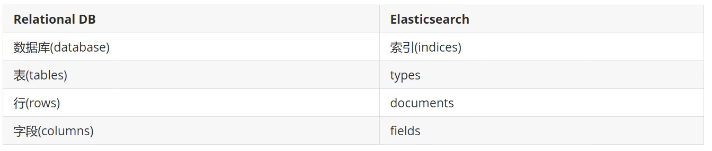
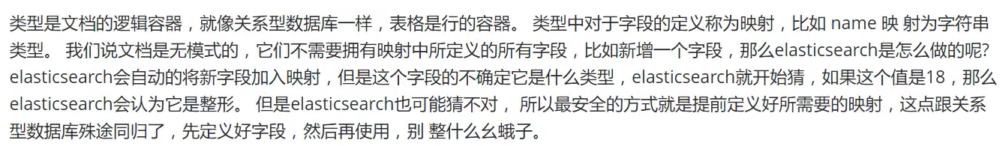
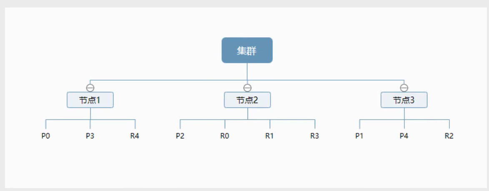

[TOC]

# 1. 基本概念

## 1.1 Lucene 和 Elasticsearch的关系

Elasticsearch是基于Lucene做了一些封装和增强

## 1.2 Elasticsearch 概述

Elasticsearch 简称ES,是一个开源的高扩展的分布式全文检索引擎，可以近乎实时的存储、检索数据，本身扩展性很好

## 1.3 官网

https://www.elastic.co

# 2. 核心概念

## 2.1 关系型数据库和ES对比

注意ES中的types字段在7版本中已经过时，在8版本可能会被废弃

在ES中一切都是json

ES(集群)中可以包含多个索引(数据库)，每个索引中可以包含多个类型(表)，每个类型下又包含多个文档(行)，每个文档中又包含多个字段(列)

## 2.2 物理设计

ES在后台把每个索引划分成多个分片，每个分片可以在集群中的不同服务器间迁移

## 2.3 逻辑设计

一个索引类型中，包含多个文档，比如说文档1，文档2。当我们索引一篇文档时，可以通过这样的一个顺序找到它:

索引-> 类型 -> 文档id

通过这个组合我们就能索引到某个具体的文档。注意id不必是整数，实际上它是个字符串

### 2.3.1 文档

文档就是我们的一条条数据

ES是面向文档的，意味着索引和搜索数据的最小单位是文档，在ES中文档有几个重要属性:

+ 自我包含，一片文档同时包含字段和对应的值，也就是同时包含key:value
+ 可以是层次类型的，一个文档中包含子文档，复杂的逻辑实体就是这么来的
+ 灵活的结构，文档不依赖于预先定义的模式，我们知道关系型数据库中，要提前定义字段才能使用，在ES中，对于字段是非常灵活的，有时候我们可以忽略该字段，或者动态的添加一个新的字段

尽管可以随意地新增或者忽略某个字段，但是每个字段的类型非常重要，比如一个年龄字段类型，可以是字符串也可以是整数。因为ES会保存字段和类型之间的映射以及其他设置。这种映射具体到每个映射的每种类型，这也是为什么在ES中，类型有时候也称为映射类型

### 2.3.2 类型

### 2.3.3 索引

索引是映射类型的容器，ES中的索引是一个非常大的集合。索引存储了映射类型的字段和其他设置，然后它们被存储到了各个分片上了。

### 2.3.4 物理设计：节点和分片如何工作

一个集群至少有一个节点，而一个节点就是一个ES进程，节点可以有多个默认索引，如果创建索引，那么索引将会有5个分片(primary shard,又称主分片)构成，每一个主分片会有一个副本(replica shard)

上图是一个有3个节点的集群，可以看到主分片和对应的复制分片都不会在同一个节点内，这样即使某个节点挂掉了，数据也不至于丢失。实际上，一个分片是一个Lucene索引，一个包含倒排索引的文件目录，倒排索引的结构使得ES在不扫描全部文档的情况下就能找到文档包含的特定的关键字。

### 2.3.5 倒排索引

ES使用的是一种称为倒排索引的结构，采用Lucene倒排索引作为底层，这种结构有利于快速的全文搜索，一个索引由文档中所有不重复的列表构成，对于每一个词，都有一个包含它的文档列表

# 3.IK分词器插件

## 3.1 什么是IK分词器

## 3.2 安装

