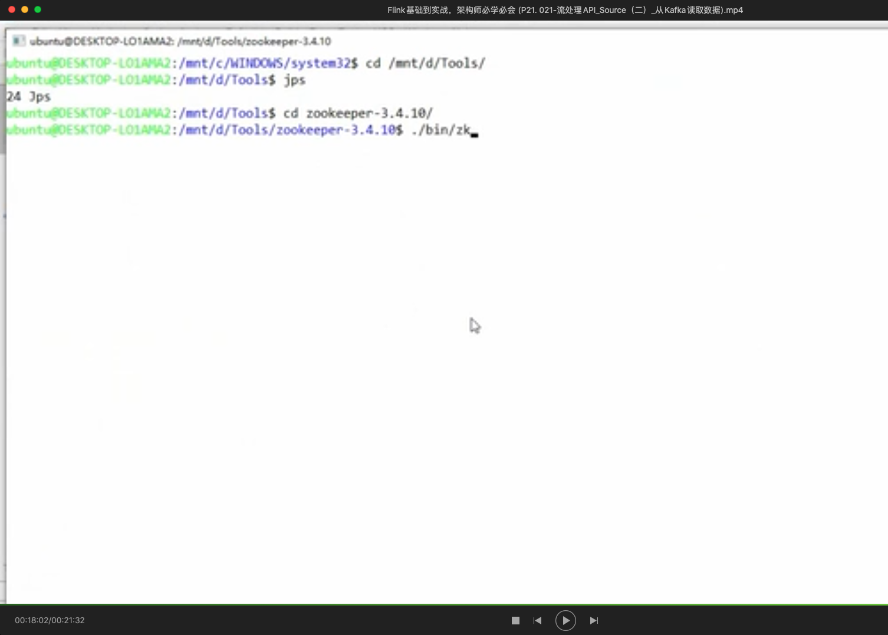

```xml
<dependencies>
        <dependency>
            <groupId>org.apache.flink</groupId>
            <artifactId>flink-java</artifactId>
            <version>1.10.1</version>
        </dependency>
        <dependency>
            <groupId>org.apache.flink</groupId>
            <artifactId>flink-streaming-java_2.12</artifactId>
            <version>1.10.1</version>
        </dependency>
    </dependencies>
    <build>
        <plugins>
            <!--该插件用于将scala代码编译成class文件-->
            <plugin>
                <groupId>net.alchim31.maven</groupId>
                <artifactId>scala-maven-plugin</artifactId>
                <version>4.4.0</version>
                <executions>
                    <execution>
                        <!--声明绑定到maven的compile阶段-->
                        <goals>
                            <goal>compile</goal>

                        </goals>

                    </execution>

                </executions>
            </plugin>
            <plugin>
                <groupId>org.apache.maven.plugins</groupId>
                <artifactId>maven-assembly-plugin</artifactId>
                <version>3.3.0</version>
                <configuration>
                    <descriptorRefs>
                        <descriptorRef>jar-with-dependencies</descriptorRef>
                    </descriptorRefs>

                </configuration>
                <executions>
                    <execution>
                        <id>make-assembly</id>
                        <phase>package</phase>
                        <goals>
                            <goal>single</goal>
                        </goals>
                    </execution>
                </executions>


            </plugin>

        </plugins>


    </build>
```



```bash

The Cluster ID K-F-q1wUTAC3Ieop2neoaw doesn't match stored clusterId Some(R9ik1PHrSzyrOUHcSFNnXA) in meta.properties. The broker is trying to join the wrong cluster. Configured zookeeper.connect may be wrong.

The Cluster ID K-F-q1wUTAC3Ieop2neoaw doesn't match stored clusterId Some(R9ik1PHrSzyrOUHcSFNnXA) in meta.properties. The broker is trying to join the wrong cluster. Configured zookeeper.connect may be wrong.
```

该看P30

