[TOC]

# 1.流处理简介

## 1.1 Flink 是什么

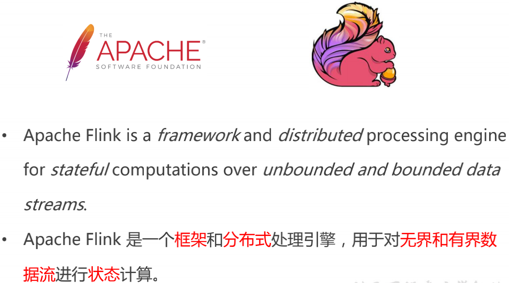

### 1.1.1 Flink 的全球热度

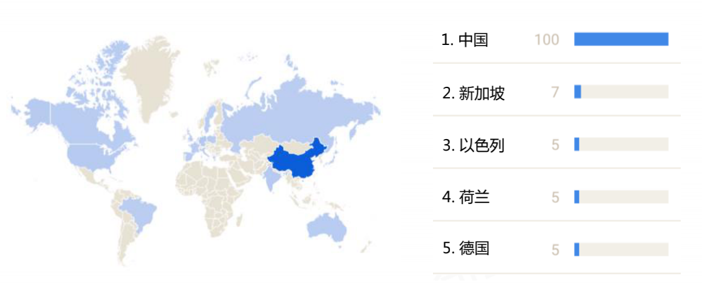

### 1.1.2 Flink 目前在国内企业的应用


## 1.2 为什么要用 Flink

1. 流数据更真实地反映了我们的生活方式
2. 传统的数据架构是基于有限数据集的
3. 我们的目标
   + 低延迟
   + 高吞吐
   + 结果的准确性和良好的容错性

### 1.2.1 哪些行业需要处理流数据

1. 电商和市场营销

   数据报表、广告投放、业务流程需要

2. 物联网（IOT） 

   传感器实时数据采集和显示、实时报警，交通运输业

3. 电信业

   基站流量调配

4. 银行和金融业

   实时结算和通知推送，实时检测异常行

## 1.3 流处理的发展和演变

### 1.3.1 传统数据处理架构

1. 事务处理

   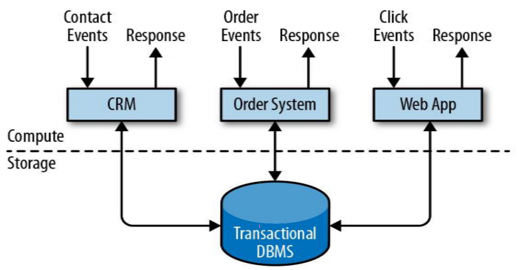

2. 分析处理

   将数据从业务数据库复制到数仓，再进行分析和查询

   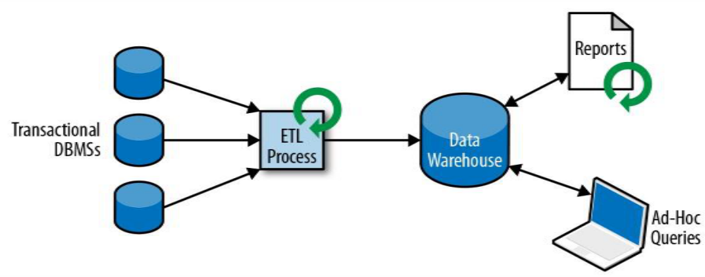

### 1.3.2 有状态的流式处理

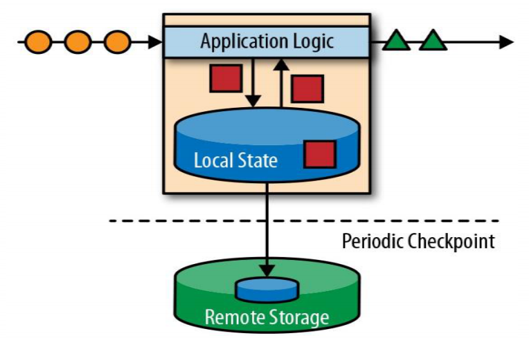


### 1.3.3 流处理的演变

1. lambda 架构

   用两套系统，同时保证低延迟和结果准确

   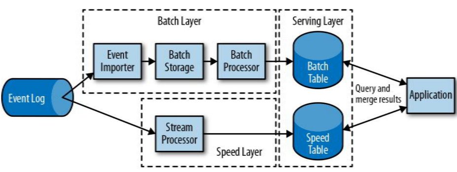

   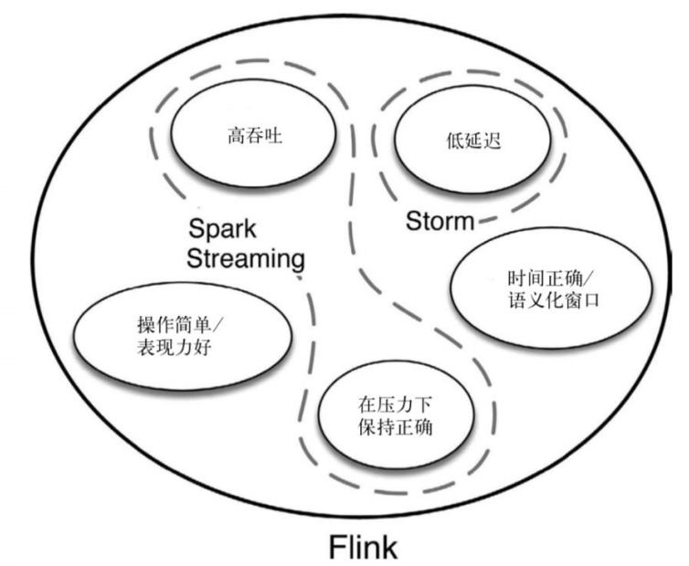=

## 1.4 Flink 的主要特点

### 1.4.1 事件驱动（Event-driven）

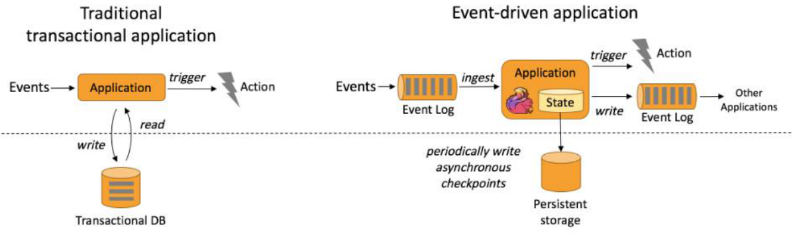

### 1.4.2 基于流的世界观

在 Flink 的世界观中，一切都是由流组成的，离线数据是有界的流；实时数据是一个没有界限的流：这就是所谓的有界流和无界流

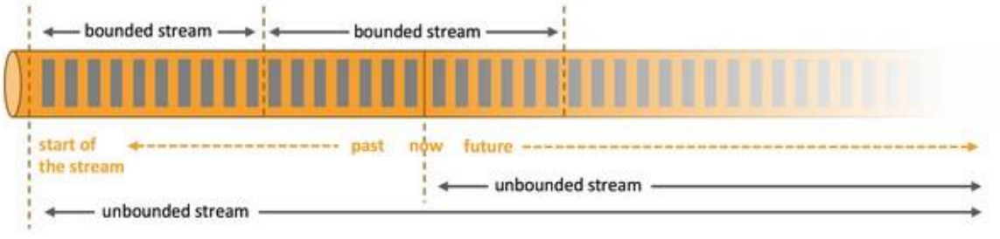

### 1.4.3 分层API

+  越顶层越抽象，表达含义越简明，使用越方便

+ 越底层越具体，表达能力越丰富，使用越灵活

  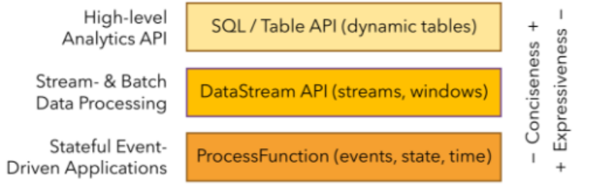

### 1.4.4 其它特点

+ 支持事件时间（event-time）和处理时间（processing-time）语义
+ 精确一次（exactly-once）的状态一致性保证
+ 低延迟，每秒处理数百万个事件，毫秒级延迟
+ 与众多常用存储系统的连接
+ 高可用，动态扩展，实现7*24小时全天候运行

## 1.5 Flink vs Spark Streaming

### 1.5.1 流（stream）和微批（micro-batching）

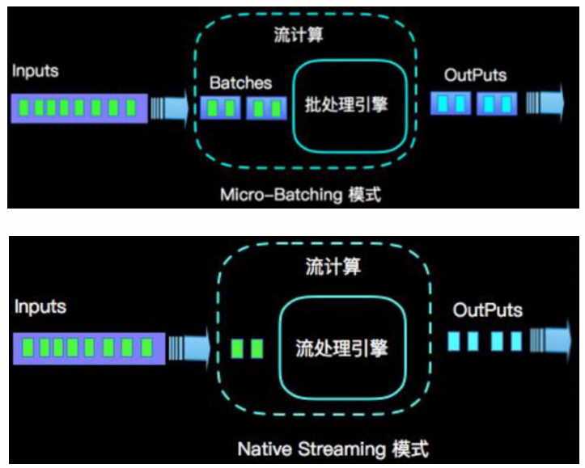

### 1.5.2 数据模型

+ spark 采用 RDD 模型，spark streaming 的 DStream 实际上也就是一组 组小批数据 RDD 的集合
+ flink 基本数据模型是数据流，以及事件（Event）序列

### 1.5.3 运行时架构

+ spark 是批计算，将 DAG 划分为不同的 stage，一个完成后才可以计算下一个
+ flink 是标准的流执行模式，一个事件在一个节点处理完后可以直接发往下一个节点进行处理


# 2. 快速上手

## 2.1 搭建 maven 工程

pom 文件

```xml
<?xml version="1.0" encoding="UTF-8"?>
<project xmlns="http://maven.apache.org/POM/4.0.0"
         xmlns:xsi="http://www.w3.org/2001/XMLSchema-instance"
         xsi:schemaLocation="http://maven.apache.org/POM/4.0.0 http://maven.apache.org/xsd/maven-4.0.0.xsd">
    <modelVersion>4.0.0</modelVersion>

    <groupId>org.example</groupId>
    <artifactId>FlinkStudy</artifactId>
    <version>1.0-SNAPSHOT</version>

    <dependencies>
        <dependency>
            <groupId>org.apache.flink</groupId>
            <artifactId>flink-java</artifactId>
            <version>1.10.1</version>
        </dependency>
        <dependency>
            <groupId>org.apache.flink</groupId>
            <artifactId>flink-streaming-java_2.12</artifactId>
            <version>1.10.1</version>
        </dependency>
    </dependencies>
</project>
```

## 2.2 批处理 wordcount

```java
package net.codeshow.wc;

import org.apache.flink.api.common.functions.FlatMapFunction;
import org.apache.flink.api.java.DataSet;
import org.apache.flink.api.java.ExecutionEnvironment;
import org.apache.flink.api.java.operators.AggregateOperator;
import org.apache.flink.api.java.operators.DataSource;
import org.apache.flink.api.java.tuple.Tuple2;
import org.apache.flink.util.Collector;

/**
 * @Description
 * @Author eric
 * @Version V1.0.0
 * @Date 2021/1/19
 */

// 批处理 word count
public class WordCount {
    public static void main(String[] args) throws Exception {
//        创建执行环境
        ExecutionEnvironment env = ExecutionEnvironment.getExecutionEnvironment();
//        从文件中读取数据
        String inputPath = "/Users/cuiguangsong/my_files/workspace/java/FlinkStudy/src/main/resources/hello.txt";
        DataSet<String> inputDataSet = env.readTextFile(inputPath);
//        对数据集进行处理，按空格分词展开，转换成(word,1)二元组进行统计
        DataSet<Tuple2<String, Integer>> resultSet = inputDataSet.flatMap(new MyFlatMapper())
//                按照第一个位置的word分组
                .groupBy(0)
//                将第二个位置上的数据求和
                .sum(1);
        resultSet.print();


    }

    //    自定义类，实现FlatMapFunction接口
    public static class MyFlatMapper implements FlatMapFunction<String, Tuple2<String, Integer>> {

        public void flatMap(String value, Collector<Tuple2<String, Integer>> out) throws Exception {
//        按照空格分词
            String[] words = value.split(" ");
//            遍历所有word，包装成二元组输出
            for (String word : words) {
                out.collect(new Tuple2<>(word, 1));

            }

        }
    }
}

```

## 2.3 流处理 wordcount

```java
package net.codeshow.wc;

import org.apache.flink.api.java.tuple.Tuple2;
import org.apache.flink.api.java.utils.ParameterTool;
import org.apache.flink.streaming.api.datastream.DataStream;
import org.apache.flink.streaming.api.datastream.DataStreamSource;
import org.apache.flink.streaming.api.datastream.SingleOutputStreamOperator;
import org.apache.flink.streaming.api.environment.StreamExecutionEnvironment;

/**
 * @Description
 * @Author eric
 * @Version V1.0.0
 * @Date 2021/1/19
 */
public class StreamWordCount {
    public static void main(String[] args) throws Exception {
//        创建流处理执行环境
        StreamExecutionEnvironment env = StreamExecutionEnvironment.getExecutionEnvironment();
        env.setParallelism(1);
//        String inputPath = "/Users/cuiguangsong/my_files/workspace/java/FlinkStudy/src/main/resources/hello.txt";
//        DataStream<String> inputDataStream = env.readTextFile(inputPath);
//        用parameterTool工具从程序启动参数中提取配置项
        ParameterTool parameterTool = ParameterTool.fromArgs(args);
        String host = parameterTool.get("host");
        int port = parameterTool.getInt("port");

//        从socket文本流读取数据
        DataStream<String> inputDataStream = env.socketTextStream(host, port);
//        基于数据流进行转换计算
        DataStream<Tuple2<String, Integer>> resultStream = inputDataStream.flatMap(new WordCount.MyFlatMapper())
                .keyBy(0)
                .sum(1);
        resultStream.print();
//        执行任务
        env.execute();

    }
}

```

测试——在 linux 系统中用 netcat 命令进行发送测试。

```bash
nc -lk 7777
```

# 3. Flink 部署

## 3.1 Standalone 模式

### 3.1.1 **安装**

解压缩 flink-1.10.1-bin-scala_2.12.tgz，进入 conf 目录中

1. *修改* *flink/conf/flink-conf.yaml* *文件*

   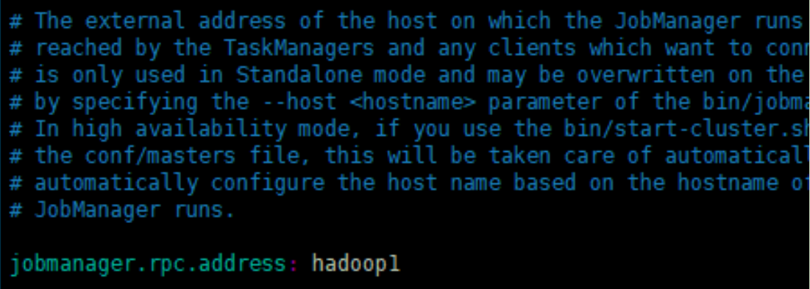

2. *修改* */conf/slaves* *文件*

   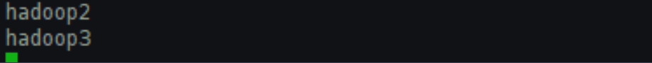

3. 分发给另外两台机器

   

4. *启动*

   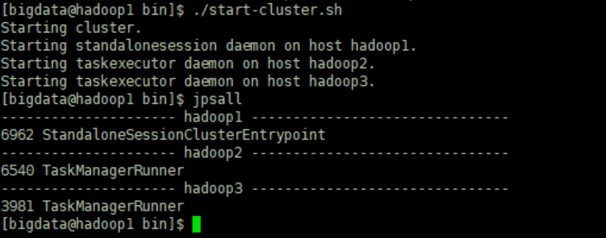

   访问 http://localhost:8081 可以对 flink 集群和任务进行监控管理。

   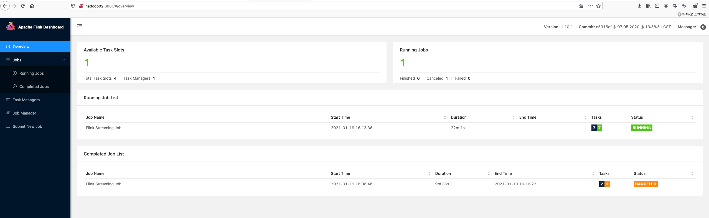


### 3.1.2 **提交任务**

1. *准备数据文件（如果需要）*

   

2. *把含数据文件的文件夹，分发到* *taskmanage* *机器中*

   

   如 果 从 文 件 中 读 取 数 据 ， 由 于 是 从 本 地 磁 盘 读 取 ， 实 际 任 务 会 被 分 发 到taskmanage 的机器中，所以要把目标文件分发

3. *执行程序*

   ```bash
   ./flink run -c com.atguigu.wc.StreamWordCount –p 2 FlinkTutorial-1.0-SNAPSHOT-jar-with-dependencies.jar --host lcoalhost –port 7777
   ```

   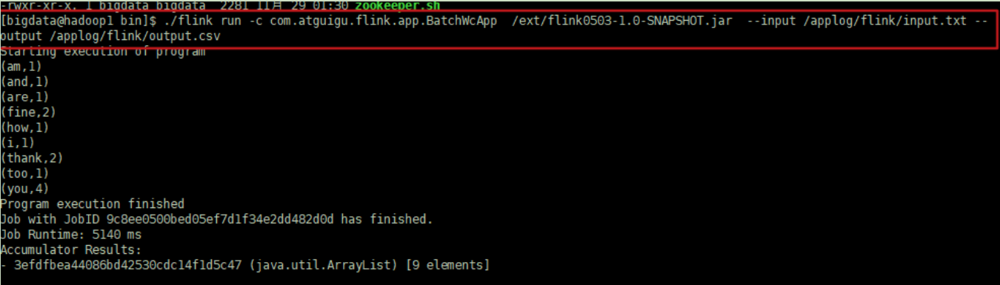

4. *查看计算结果*

   注意：如果输出到控制台，应该在 taskmanager 下查看；如果计算结果输出到文件，同样会保存到 taskmanage 的机器下，不会在 jobmanage 下

   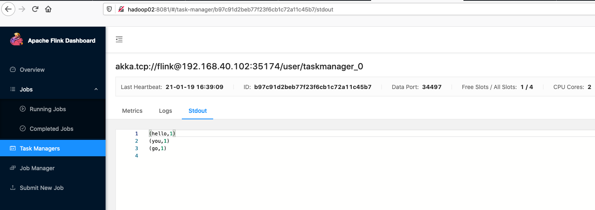

5. *在* *webui* *控制台查看计算过程*

   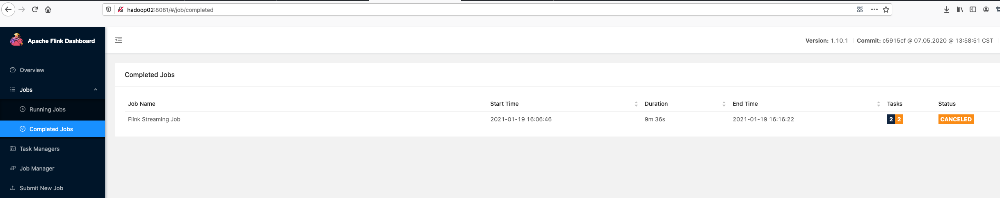

## 3.2 Yarn 模式

以 Yarn 模式部署 Flink 任务时，要求 Flink 是有 Hadoop 支持的版本，Hadoop环境需要保证版本在 2.2 以上，并且集群中安装有 HDFS 服务

### 3.2.1  **Flink on Yarn**

Flink 提供了两种在 yarn 上运行的模式，分别为 Session-Cluster 和 Per-Job-Cluster模式。

1. **Session-cluster** **模式**

   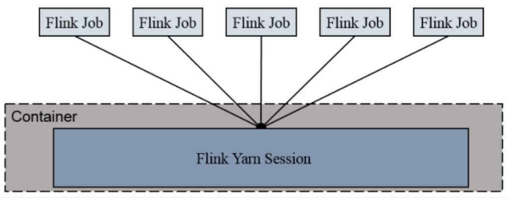

   Session-Cluster 模式需要先启动集群，然后再提交作业，接着会向 yarn 申请一块空间后，资源永远保持不变。如果资源满了，下一个作业就无法提交，只能等到yarn 中的其中一个作业执行完成后，释放了资源，下个作业才会正常提交。所有作业共享 Dispatcher 和 ResourceManager；共享资源；适合规模小执行时间短的作业

   在 yarn 中初始化一个 flink 集群，开辟指定的资源，以后提交任务都向这里提交。这个 flink 集群会常驻在 yarn 集群中，除非手工停止

2. **Per-Job-Cluster** **模式**

   

   一个 Job 会对应一个集群，每提交一个作业会根据自身的情况，都会单独向 yarn申请资源，直到作业执行完成，一个作业的失败与否并不会影响下一个作业的正常提交和运行。独享 Dispatcher 和 ResourceManager，按需接受资源申请；适合规模大长时间运行的作业

   每次提交都会创建一个新的 flink 集群，任务之间互相独立，互不影响，方便管理。任务执行完成之后创建的集群也会消失

### 3.2.2 **Session Cluster**

1. *启动* *hadoop* *集群（略）*

2. *启动* *yarn-session*

   ```bash
   ./yarn-session.sh -n 2 -s 2 -jm 1024 -tm 1024 -nm test -d
   ```

   其中：

   -n(--container)：TaskManager 的数量。

   -s(--slots)： 每个 TaskManager 的 slot 数量，默认一个 slot 一个 core，默认每个

   taskmanager 的 slot 的个数为 1，有时可以多一些 taskmanager，做冗余。

   -jm：JobManager 的内存（单位 MB)。 

   -tm：每个 taskmanager 的内存（单位 MB)。 

   -nm：yarn 的 appName(现在 yarn 的 ui 上的名字)。 

   -d：后台执行

   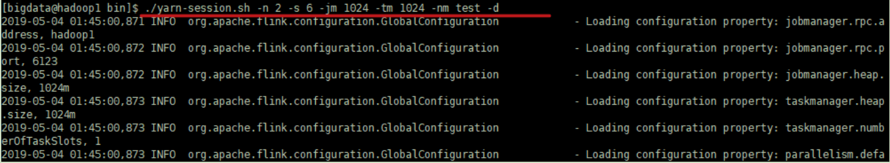

3. *执行任务*

   ```bash
   ./flink run -c com.atguigu.wc.StreamWordCount FlinkTutorial-1.0-SNAPSHOT-jar-with-dependencies.jar --host lcoalhost –port 7777
   ```

4. *去* *yarn* *控制台查看任务状态*

   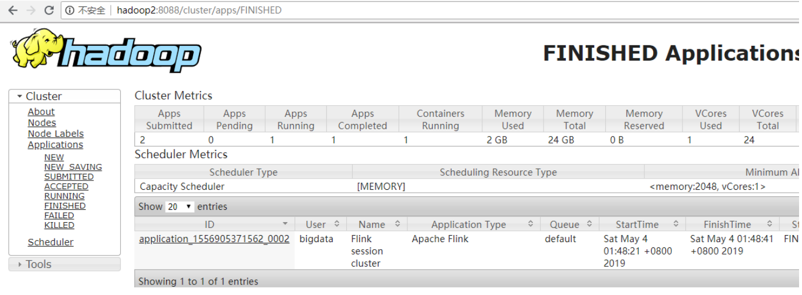

5. *取消* *yarn-session*

   ```bash
   yarn application --kill application_1577588252906_0001
   ```

### 3.2.2  **Per Job Cluster**

1. *启动* *hadoop* *集群（略）*

2. **不启动** **yarn-session***，直接执行* *job*

   ```bash
   ./flink run –m yarn-cluster -c com.atguigu.wc.StreamWordCount FlinkTutorial-1.0-SNAPSHOT-jar-with-dependencies.jar --host lcoalhost –port 7777
   ```

## 3.3 Kubernetes 部署

容器化部署时目前业界很流行的一项技术，基于 Docker 镜像运行能够让用户更加 方 便地 对应 用进 行管 理 和运 维。 容器 管理 工 具中 最为 流行 的就 是 Kubernetes（k8s），而 Flink 也在最近的版本中支持了 k8s 部署模式

1）搭建 *Kubernetes* *集群（略）*

2）配置各组件的 *yaml* *文件*

在 k8s 上构建 Flink Session Cluster，需要将 Flink 集群的组件对应的 docker 镜像分别在 k8s 上启动，包括 JobManager、TaskManager、JobManagerService 三个镜像服务。每个镜像服务都可以从中央镜像仓库中获取

3）启动 *Flink Session Cluster*

```bash
// 启动 jobmanager-service 服务
kubectl create -f jobmanager-service.yaml
// 启动 jobmanager-deployment 服务
kubectl create -f jobmanager-deployment.yaml
// 启动 taskmanager-deployment 服务
kubectl create -f taskmanager-deployment.yaml
```

4）访问 *Flink UI* 页面

集群启动后，就可以通过 JobManagerServicers 中配置的 WebUI 端口，用浏览器输入以下 url 来访问 Flink UI 页面了：

http://*{JobManagerHost:Port}*/api/v1/namespaces/default/services/flink-jobmanager:ui/proxy

# 4. Flink 运行架构

## 4.1 Flink 运行时的组件

Flink 运行时架构主要包括四个不同的组件，它们会在运行流处理应用程序时协同工作：

作业管理器（JobManager）、资源管理器（ResourceManager）、任务管理器（TaskManager），以及分发器（Dispatcher）。因为 Flink 是用 Java 和 Scala 实现的，所以所有组件都会运行在Java 虚拟机上。每个组件的职责如下

1. 作业管理器（JobManager）

   控制一个应用程序执行的主进程，也就是说，每个应用程序都会被一个不同的JobManager 所控制执行。JobManager 会先接收到要执行的应用程序，这个应用程序会包括：作业图（JobGraph）、逻辑数据流图（logical dataflow graph）和打包了所有的类、库和其它资源的 JAR 包。JobManager 会把 JobGraph 转换成一个物理层面的数据流图，这个图被叫做“执行图”（ExecutionGraph），包含了所有可以并发执行的任务。JobManager 会向资源管理器（ResourceManager）请求执行任务必要的资源，也就是任务管理器（TaskManager）上的插槽（slot）。一旦它获取到了足够的资源，就会将执行图分发到真正运行它们的TaskManager 上。而在运行过程中，JobManager 会负责所有需要中央协调的操作，比如说检查点（checkpoints）的协调

2. 资源管理器（ResourceManager）

   主要负责管理任务管理器（TaskManager）的插槽（slot），TaskManger 插槽是 Flink 中定义的处理资源单元。Flink 为不同的环境和资源管理工具提供了不同资源管理器，比如YARN、Mesos、K8s，以及 standalone 部署。当 JobManager 申请插槽资源时，ResourceManager会将有空闲插槽的 TaskManager 分配给 JobManager。如果 ResourceManager 没有足够的插槽来满足 JobManager 的请求，它还可以向资源提供平台发起会话，以提供启动 TaskManager进程的容器。另外，ResourceManager 还负责终止空闲的TaskManager，释放计算资源

3. 任务管理器（TaskManager）

   Flink 中的工作进程。通常在 Flink 中会有多个 TaskManager 运行，每一个 TaskManager都包含了一定数量的插槽（slots）。插槽的数量限制了 TaskManager 能够执行的任务数量。启动之后，TaskManager 会向资源管理器注册它的插槽；收到资源管理器的指令后，TaskManager 就会将一个或者多个插槽提供给 JobManager 调用。JobManager 就可以向插槽分配任务（tasks）来执行了。在执行过程中，一个 TaskManager 可以跟其它运行同一应用程序的 TaskManager 交换数据

4. 分发器（Dispatcher）

   可以跨作业运行，它为应用提交提供了 REST 接口。当一个应用被提交执行时，分发器就会启动并将应用移交给一个 JobManager。由于是 REST 接口，所以 Dispatcher 可以作为集群的一个 HTTP 接入点，这样就能够不受防火墙阻挡。Dispatcher 也会启动一个 Web UI，用来方便地展示和监控作业执行的信息。Dispatcher 在架构中可能并不是必需的，这取决于应用提交运行的方式

## 4.2 任务提交流程

我们来看看当一个应用提交执行时，Flink 的各个组件是如何交互协作的：

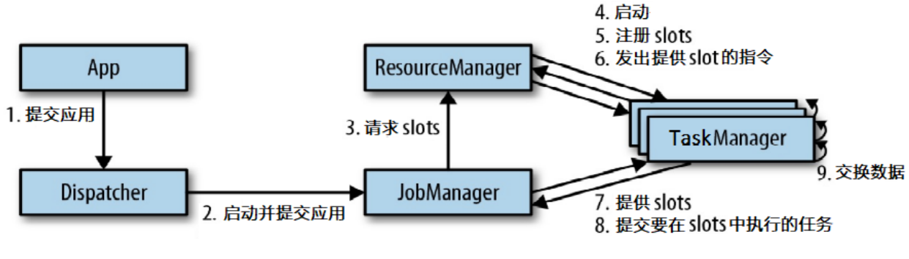

上图是从一个较为高层级的视角，来看应用中各组件的交互协作。如果部署的集群环境不同（例如 YARN，Mesos，Kubernetes，standalone 等），其中一些步骤可以被省略，或是有些组件会运行在同一个 JVM 进程中

具体地，如果我们将 Flink 集群部署到 YARN 上，那么就会有如下的提交流程：

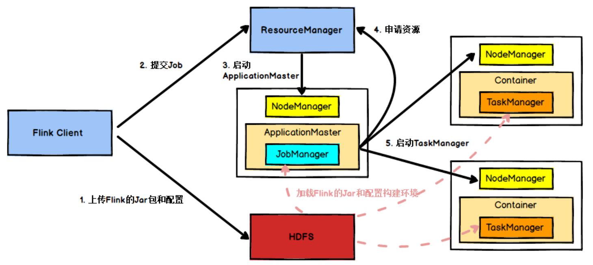

Flink 任务提交后，Client 向 HDFS 上传 Flink 的 Jar 包和配置，之后向 Yarn ResourceManager 提交任务，ResourceManager 分配 Container 资源并通知对应的NodeManager 启动 ApplicationMaster，ApplicationMaster 启动后加载 Flink 的 Jar 包和配置构建环境，然后启动 JobManager，之后 ApplicationMaster 向 ResourceManager申请资源启动 TaskManager ， ResourceManager 分 配 Container 资 源 后 ， 由ApplicationMaster 通 知 资 源 所 在 节 点 的 NodeManager 启 动 TaskManager ，NodeManager 加载 Flink 的 Jar 包和配置构建环境并启动 TaskManager，TaskManager启动后向 JobManager 发送心跳包，并等待 JobManager 向其分配任务。


## 4.3 任务调度原理

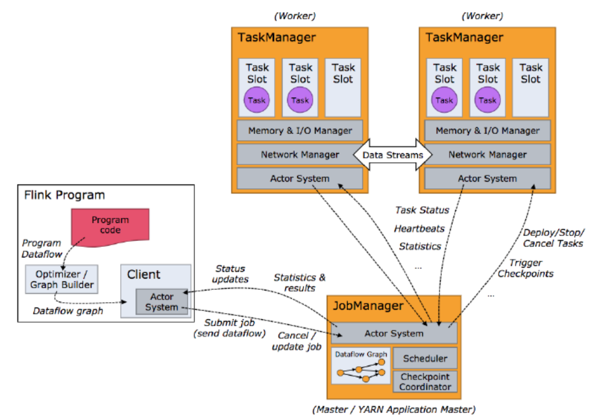

客户端不是运行时和程序执行 的一部分，但它用于准备并发送dataflow(JobGraph)给 Master(JobManager)，然后，客户端断开连接或者维持连接以等待接收计算结果

当 Flink 集 群 启 动 后 ， 首 先 会 启 动 一 个 JobManger 和一个或多个的TaskManager。由 Client 提交任务给 JobManager，JobManager 再调度任务到各个TaskManager 去执行，然后 TaskManager 将心跳和统计信息汇报给 JobManager。TaskManager 之间以流的形式进行数据的传输。上述三者均为独立的 JVM 进程。

**Client** 为提交 Job 的客户端，可以是运行在任何机器上（与 JobManager 环境连通即可）。提交 Job 后，Client 可以结束进程（Streaming 的任务），也可以不结束并等待结果返回

**JobManager** 主 要 负 责 调 度 Job 并 协 调 Task 做 checkpoint， 职 责 上 很 像Storm 的 Nimbus。从 Client 处接收到 Job 和 JAR 包等资源后，会生成优化后的执行计划，并以 Task 的单元调度到各个 TaskManager 去执行

**TaskManager** 在启动的时候就设置好了槽位数（Slot），每个 slot 能启动一个Task，Task 为线程。从 JobManager 处接收需要部署的 Task，部署启动后，与自己的上游建立 Netty 连接，接收数据并处理


### 4.3.1 **TaskManger** **与** **Slots**

Flink 中每一个 worker(TaskManager)都是一个 **JVM** **进程**，它可能会在独立的线程上执行一个或多个 subtask。为了控制一个 worker 能接收多少个 task，worker 通 过 task slot 来进行控制（一个 worker 至少有一个 task slot）

每个 task slot 表示 TaskManager 拥有资源的**一个固定大小的子集**。假如一个TaskManager 有三个 slot，那么它会将其管理的内存分成三份给各个 slot。资源 slot化意味着一个 subtask 将不需要跟来自其他 job 的 subtask 竞争被管理的内存，取而代之的是它将拥有一定数量的内存储备。需要注意的是，这里不会涉及到 CPU 的隔离，slot 目前仅仅用来隔离 task 的受管理的内存

通过调整 task slot 的数量，允许用户定义 subtask 之间如何互相隔离。如果一个TaskManager 一个 slot，那将意味着每个 task group 运行在独立的 JVM 中（该 JVM可能是通过一个特定的容器启动的），而一个 TaskManager 多个 slot 意味着更多的subtask 可以共享同一个 JVM。而在同一个 JVM 进程中的 task 将共享 TCP 连接（基于多路复用）和心跳消息。它们也可能共享数据集和数据结构，因此这减少了每个task 的负载

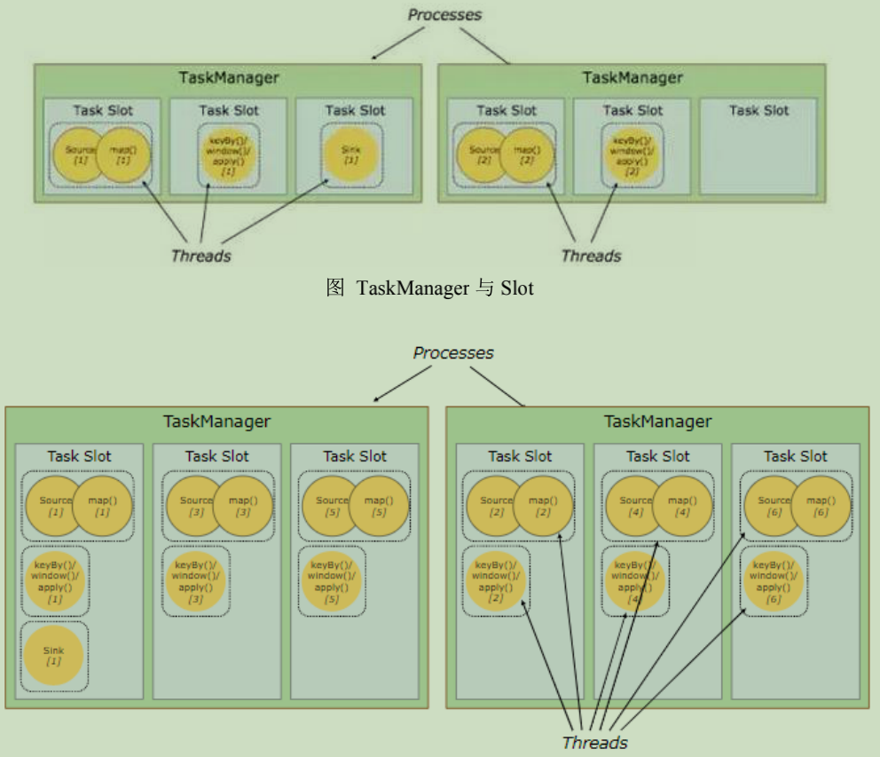

默认情况下，Flink 允许子任务共享 slot，即使它们是不同任务的子任务（前提是它们来自同一个 job）。 这样的结果是，一个 slot 可以保存作业的整个管道

**Task Slot** **是静态的概念，是指** **TaskManager** **具有的并发执行能力**，可以通过参数 taskmanager.numberOfTaskSlots 进行配置；而**并行度** **parallelism** 是动态概念，即TaskManager运行程序时实际使用的并发能力，可以通过参数 parallelism.default进行配置

也就是说，假设一共有 3 个 TaskManager，每一个 TaskManager 中的分配 3 个TaskSlot，也就是每个 TaskManager 可以接收 3 个 task，一共 9 个 TaskSlot，如果我们设置 parallelism.default=1，即运行程序默认的并行度为 1，9 个 TaskSlot 只用了 1个，有 8 个空闲，因此，设置合适的并行度才能提高效率

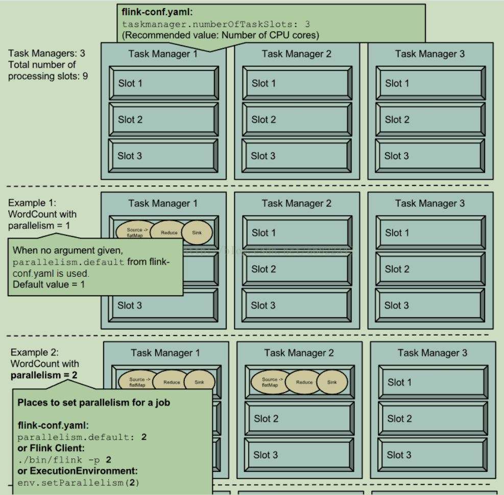

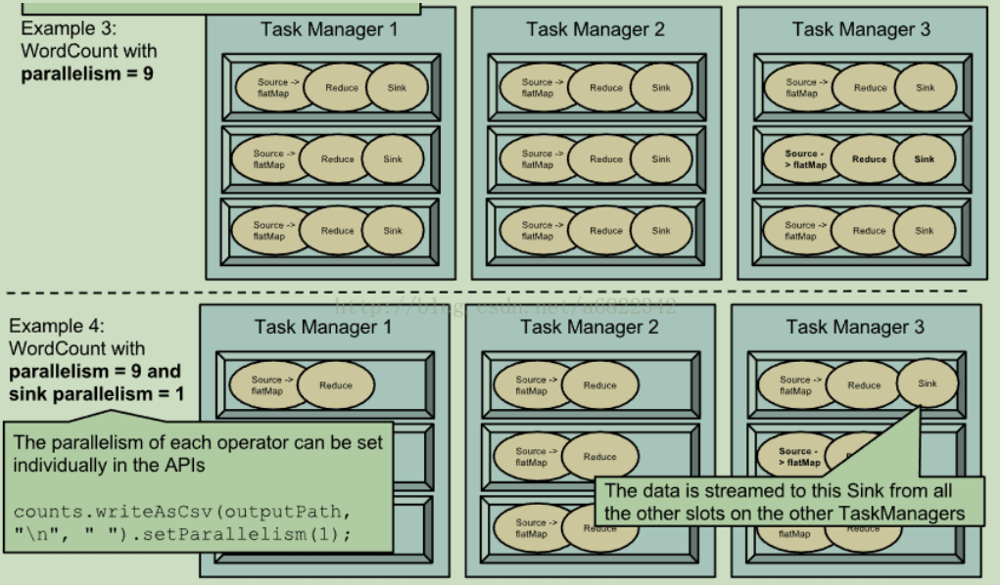


### 4.3 2 程序与数据流（DataFlow）

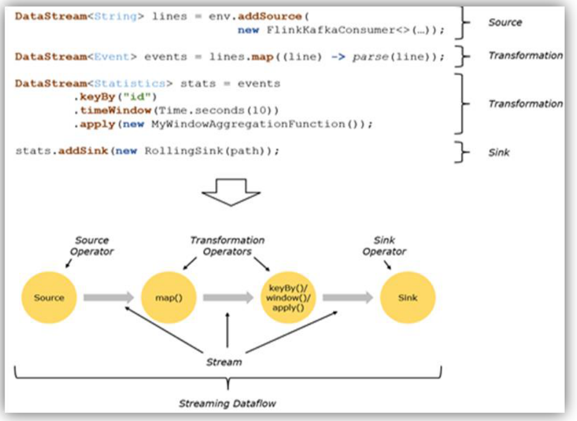

所有的 Flink 程序都是由三部分组成的： **Source** 、**Transformation** 和 **Sink**。

Source 负责读取数据源，Transformation 利用各种算子进行处理加工，Sink 负责输出。

在运行时，Flink 上运行的程序会被映射成“逻辑数据流”（dataflows），它包含了这三部分。**每一个** **dataflow** **以一个或多个** **sources** **开始以一个或多个** **sinks** **结**束。dataflow 类似于任意的有向无环图（DAG）。在大部分情况下，程序中的转换运算（transformations）跟 dataflow 中的算子（operator）是一一对应的关系，但有时候，一个transformation 可能对应多个 operator。

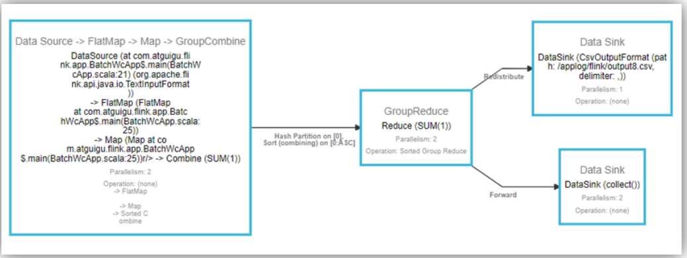

### 4.3.3 执行图（ExecutionGraph）

​	由 Flink 程序直接映射成的数据流图是 StreamGraph，也被称为逻辑流图，因为它们表示的是计算逻辑的高级视图。为了执行一个流处理程序，Flink 需要将逻辑流图转换为物理数据流图（也叫执行图），详细说明程序的执行方式。

Flink 中的执行图可以分成四层：StreamGraph -> JobGraph -> ExecutionGraph -> 物理执行图

**StreamGraph**：是根据用户通过 Stream API 编写的代码生成的最初的图。用来表示程序的拓扑结构

**JobGraph**：StreamGraph 经过优化后生成了 JobGraph，提交给 JobManager 的数据结构。主要的优化为，将多个符合条件的节点 chain 在一起作为一个节点，这样可以减少数据在节点之间流动所需要的序列化/反序列化/传输消耗。

**ExecutionGraph** ： JobManager 根 据 JobGraph 生 成 ExecutionGraph 。ExecutionGraph 是 JobGraph 的并行化版本，是调度层最核心的数据结构。

**物理执行图**：JobManager 根据 ExecutionGraph 对 Job 进行调度后，在各个TaskManager 上部署 Task 后形成的“图”，并不是一个具体的数据结构。

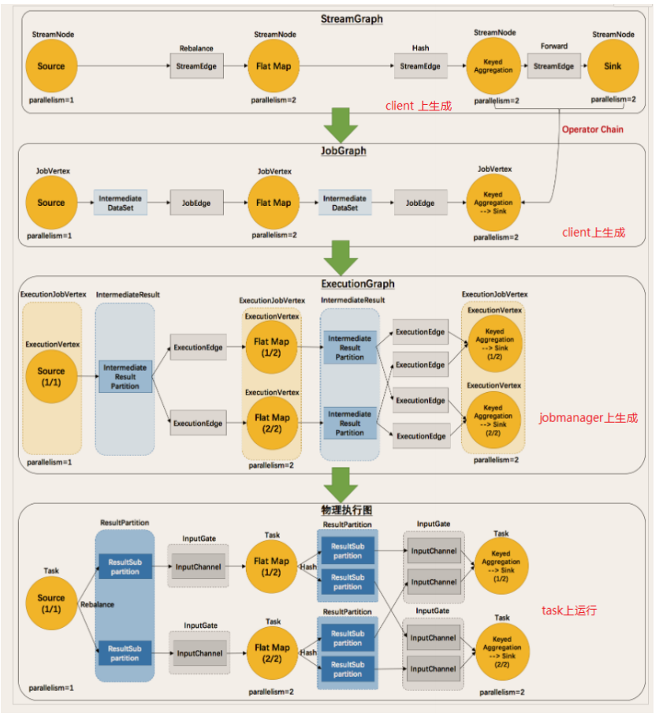

### 4.3.4 并行度（Parallelism）

Flink 程序的执行具有**并行、分布式**的特性.

在执行过程中，一个流（stream）包含一个或多个分区（stream partition），而每一个算子（operator）可以包含一个或多个子任务（operator subtask），这些子任务在不同的线程、不同的物理机或不同的容器中彼此互不依赖地执行

一个特定算子的子任务（subtask）的个数被称之为其并行度（parallelism）

一般情况下，一个流程序的并行度，可以认为就是其所有算子中最大的并行度。一个程序中，不同的算子可能具有不同的并行度。

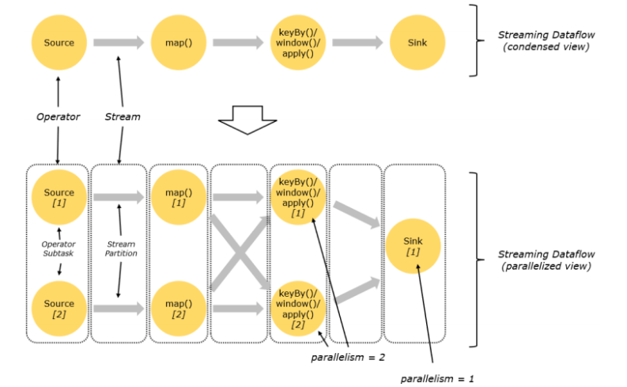

Stream 在算子之间传输数据的形式可以是 one-to-one(forwarding)的模式也可以是 redistributing 的模式，具体是哪一种形式，取决于算子的种类

**One-to-one**：stream(比如在 source 和 map operator 之间)维护着分区以及元素的顺序。那意味着 map 算子的子任务看到的元素的个数以及顺序跟 source 算子的子任务生产的元素的个数、顺序相同，map、fliter、flatMap 等算子都是 one-to-one 的对应关系。类似于 spark 中的**窄依赖**

**Redistributing**：stream(map()跟 keyBy/window 之间或者 keyBy/window 跟 sink之间)的分区会发生改变。每一个算子的子任务依据所选择的 transformation 发送数据到不同的目标任务。例如，keyBy() 基于 hashCode 重分区、broadcast 和 rebalance会随机重新分区，这些算子都会引起 redistribute 过程，而 redistribute 过程就类似于Spark 中的 shuffle 过程。类似于 spark 中的**宽依赖**

### 4.3.5 任务链（Operator Chains）

**相同并行度的** **one to one** **操作**，Flink 这样相连的算子链接在一起形成一个 task，原来的算子成为里面的一部分。将算子链接成 task 是非常有效的优化：它能减少线程之间的切换和基于缓存区的数据交换，在减少时延的同时提升吞吐量。链接的行为可以在编程 API 中进行指定

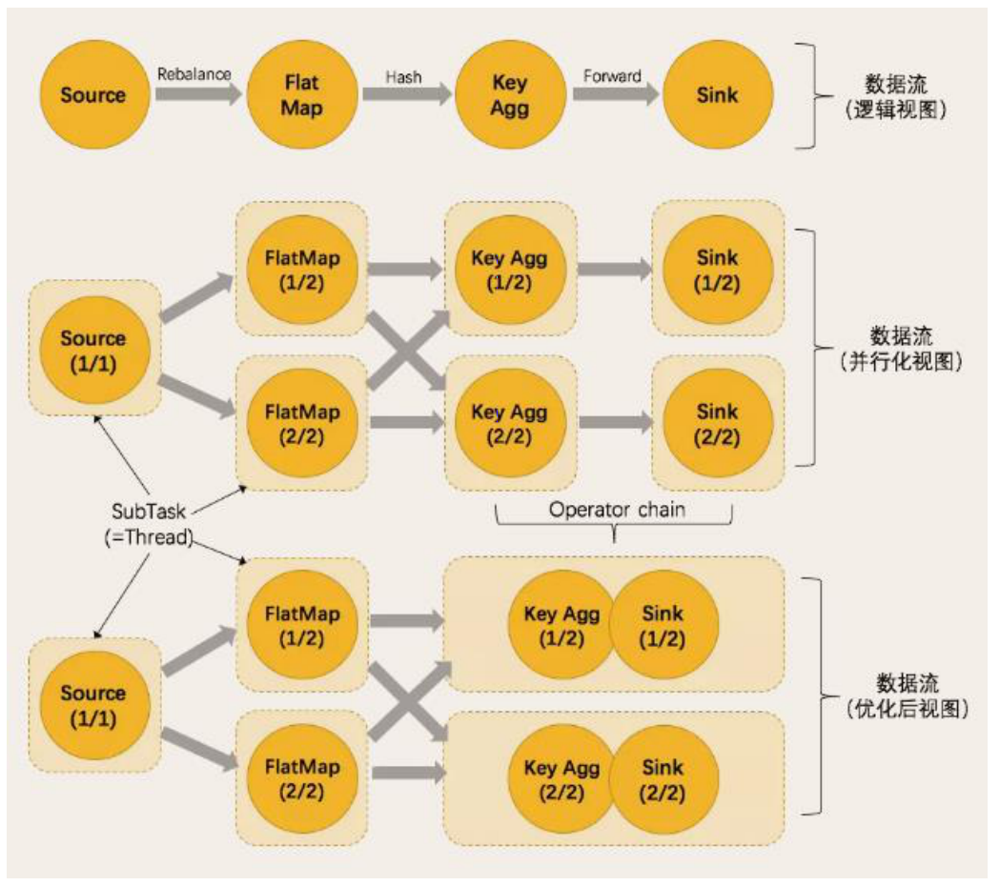


# 5. Flink 流处理 API


## 5.1 Environment

### 5.1.1.**getExecutionEnvironment**

创建一个执行环境，表示当前执行程序的上下文。 如果程序是独立调用的，则此方法返回本地执行环境；如果从命令行客户端调用程序以提交到集群，则此方法返回此集群的执行环境，也就是说，getExecutionEnvironment 会根据查询运行的方式决定返回什么样的运行环境，是最常用的一种创建执行环境的方式

```java
ExecutionEnvironment env = ExecutionEnvironment.getExecutionEnvironment();
StreamExecutionEnvironment env = StreamExecutionEnvironment.getExecutionEnvironment();
```

如果没有设置并行度，会以 flink-conf.yaml 中的配置为准，默认是 1

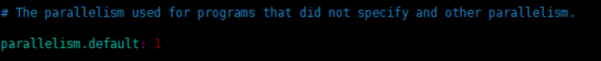

### 5.1.2 **createLocalEnvironment**

返回本地执行环境，需要在调用时指定默认的并行度。

```java
LocalStreamEnvironment env = StreamExecutionEnvironment.createLocalEnvironment(1);
```

### 5.1.3 **createRemoteEnvironment**

返回集群执行环境，将 Jar 提交到远程服务器。需要在调用时指定 JobManager的 IP 和端口号，并指定要在集群中运行的 Jar 包

```java
StreamExecutionEnvironment env = 
StreamExecutionEnvironment.createRemoteEnvironment("jobmanage-hostname", 6123,"YOURPATH//WordCount.jar");
```

## 5.2 Source

### 5.2.1 **从集合读取数据**

```java
public class SourceTest1_Collection {
public static void main(String[] args) throws Exception{
StreamExecutionEnvironment env = 
StreamExecutionEnvironment.getExecutionEnvironment();
// 1.Source:从集合读取数据
DataStream<SensorReading> sensorDataStream = env.fromCollection(
Arrays.asList(
new SensorReading("sensor_1", 1547718199L, 35.8),
new SensorReading("sensor_6", 1547718201L, 15.4),
new SensorReading("sensor_7", 1547718202L, 6.7),
new SensorReading("sensor_10", 1547718205L, 38.1) )
);
// 2.打印
sensorDataStream.print();
// 3.执行
env.execute();
} }
```

### 5.2.2 **从文件读取数据**

```java
DataStream<String> dataStream = env.readTextFile("YOUR_FILE_PATH ");
```

### 5.2.3 **以** **kafka** **消息队列的数据作为来源**

需要引入 kafka 连接器的依赖：

*pom.xml*

```xml
<!--
https://mvnrepository.com/artifact/org.apache.flink/flink-connector-kafka-0.11 
-->
<dependency> 
  <groupId>org.apache.flink</groupId>
  <artifactId>flink-connector-kafka-0.11_2.12</artifactId> 
  <version>1.10.1</version>
</dependency>
```

具体代码如下：

```java
// kafka 配置项
Properties properties = new Properties();
properties.setProperty("bootstrap.servers", "localhost:9092");
properties.setProperty("group.id", "consumer-group");
properties.setProperty("key.deserializer", 
"org.apache.kafka.common.serialization.StringDeserializer");
properties.setProperty("value.deserializer", 
"org.apache.kafka.common.serialization.StringDeserializer");
properties.setProperty("auto.offset.reset", "latest");
// 从 kafka 读取数据
DataStream<String> dataStream = env.addSource( new 
FlinkKafkaConsumer011<String>("sensor", new SimpleStringSchema(), properties));
```

### 5.2.4 **自定义** **Source**

除了以上的 source 数据来源，我们还可以自定义 source。需要做的，只是传入一个 SourceFunction 就可以。具体调用如下

```java
DataStream<SensorReading> dataStream = env.addSource( new MySensor());
```

我们希望可以随机生成传感器数据，MySensorSource 具体的代码实现如下：

```java
public static class MySensor implements SourceFunction<SensorReading>{
private boolean running = true;
public void run(SourceContext<SensorReading> ctx) throws Exception {
Random random = new Random();
HashMap<String, Double> sensorTempMap = new HashMap<String, Double>();
for( int i = 0; i < 10; i++ ){
sensorTempMap.put("sensor_" + (i + 1), 60 + random.nextGaussian() * 20);
}
while (running) {
  for( String sensorId: sensorTempMap.keySet() ){
Double newTemp = sensorTempMap.get(sensorId) + random.nextGaussian();
sensorTempMap.put(sensorId, newTemp);
ctx.collect( new SensorReading(sensorId, System.currentTimeMillis(), 
newTemp));
}
Thread.sleep(1000L);
} }
public void cancel() {
this.running = false; } }
```

## 5.3 Transform

### 5.3.1 **map**


```java
DataStream<Integer> mapStram = dataStream.map(new MapFunction<String, Integer>() {
public Integer map(String value) throws Exception {
return value.length();
}
});
```

### 5.3.2 **flatMap**

```java
DataStream<String> flatMapStream = dataStream.flatMap(new FlatMapFunction<String, 
String>() {
public void flatMap(String value, Collector<String> out) throws Exception {
String[] fields = value.split(","); 
for( String field: fields )
out.collect(field);
  }
});
```

### 5.3.3  **Filter**


```java
DataStream<Interger> filterStream = dataStream.filter(new FilterFunction<String>() 
{
public boolean filter(String value) throws Exception {
return value == 1; }
});
```

### 5.3.4  **KeyBy**

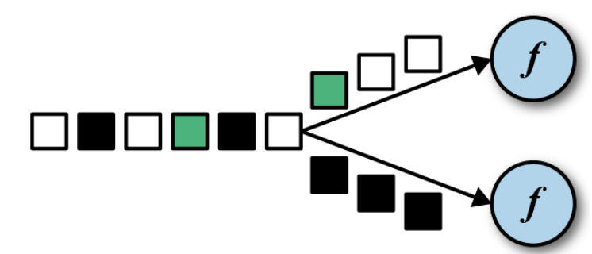

**DataStream** **→** **KeyedStream**：逻辑地将一个流拆分成不相交的分区，每个分区包含具有相同 key 的元素，在内部以 hash 的形式实现的

### 5.3.5 滚动聚合算子（Rolling Aggregation）

这些算子可以针对 KeyedStream 的每一个支流做聚合

+ sum()
+ min()
+ max()
+ minBy()
+ maxBy()

### 5.3.6 **Reduce**

**KeyedStream** **→** **DataStream**：一个分组数据流的聚合操作，合并当前的元素和上次聚合的结果，产生一个新的值，返回的流中包含每一次聚合的结果，而不是只返回最后一次聚合的最终结果

```java
DataStream<String> inputStream = env.readTextFile("sensor.txt");
// 转换成 SensorReading 类型
DataStream<SensorReading> dataStream = inputStream.map(new 
MapFunction<String, SensorReading>() {
public SensorReading map(String value) throws Exception {
String[] fileds = value.split(",");
return new SensorReading(fileds[0], new Long(fileds[1]), new 
Double(fileds[2]));
}
});
// 分组
KeyedStream<SensorReading, Tuple> keyedStream = dataStream.keyBy("id");
// reduce 聚合，取最小的温度值，并输出当前的时间戳
DataStream<SensorReading> reduceStream = keyedStream.reduce(new 
ReduceFunction<SensorReading>() {
@Override
public SensorReading reduce(SensorReading value1, SensorReading value2) 
throws Exception {
return new SensorReading(
value1.getId(),
value2.getTimestamp(),
Math.min(value1.getTemperature(), value2.getTemperature()));
}
});
```

### 5.3.7 **Split** **和** **Select**

**Split**

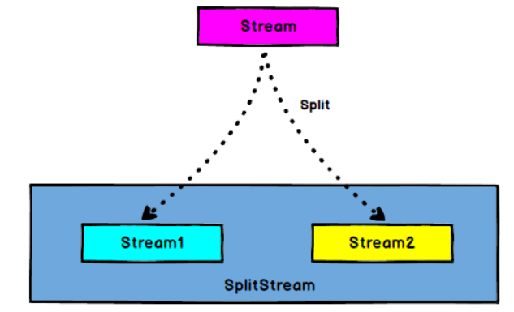

**DataStream** **→** **SplitStream**：根据某些特征把一个 DataStream 拆分成两个或者多个 DataStream

**Select**

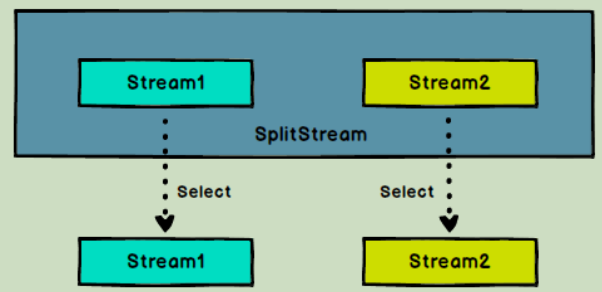

SplitStream→DataStream：从一个 SplitStream 中获取一个或者多个DataStream。

需求：传感器数据按照温度高低（以 30 度为界），拆分成两个流。

```java
SplitStream<SensorReading> splitStream = dataStream.split(new 
OutputSelector<SensorReading>() {
@Override
public Iterable<String> select(SensorReading value) {
return (value.getTemperature() > 30) ? Collections.singletonList("high") : 
Collections.singletonList("low");
}
});
DataStream<SensorReading> highTempStream = splitStream.select("high");
DataStream<SensorReading> lowTempStream = splitStream.select("low");
DataStream<SensorReading> allTempStream = splitStream.select("high", "low");
```

### 5.3.8  **Connect** **和** **CoMap**

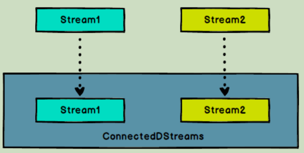

**DataStream,DataStream** **→** **ConnectedStreams**：连接两个保持他们类型的数据流，两个数据流被 Connect 之后，只是被放在了一个同一个流中，内部依然保持各自的数据和形式不发生任何变化，两个流相互独立。

**CoMap,CoFlatMap**

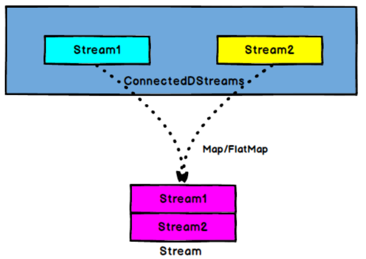

**ConnectedStreams → DataStream**：作用于 ConnectedStreams 上，功能与 map和 flatMap 一样，对 ConnectedStreams 中的每一个 Stream 分别进行 map 和 flatMap处理。

```java
// 合流 connect
DataStream<Tuple2<String, Double>> warningStream = highTempStream.map(new 
MapFunction<SensorReading, Tuple2<String, Double>>() {
@Override
  public Tuple2<String, Double> map(SensorReading value) throws Exception {
return new Tuple2<>(value.getId(), value.getTemperature());
}
});
ConnectedStreams<Tuple2<String, Double>, SensorReading> connectedStreams = 
warningStream.connect(lowTempStream);
DataStream<Object> resultStream = connectedStreams.map(new 
CoMapFunction<Tuple2<String,Double>, SensorReading, Object>() {
@Override
public Object map1(Tuple2<String, Double> value) throws Exception {
return new Tuple3<>(value.f0, value.f1, "warning");
}
@Override
public Object map2(SensorReading value) throws Exception {
return new Tuple2<>(value.getId(), "healthy");
}
});
```

### 5.3.9 **Union**

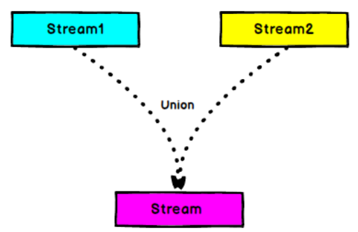

**DataStream** **→** **DataStream**：对两个或者两个以上的 DataStream 进行 union 操作，产生一个包含所有 DataStream 元素的新 DataStream。

```java
DataStream<SensorReading> unionStream = highTempStream.union(lowTempStream);
```

**Connect** **与** **Union** **区别：**

1.  Union 之前两个流的类型必须是一样，Connect 可以不一样，在之后的 coMap中再去调整成为一样的

2.  Connect 只能操作两个流，Union 可以操作多个

   

## 5.4 支持的数据类型

​		Flink 流应用程序处理的是以数据对象表示的事件流。所以在 Flink 内部，我们需要能够处理这些对象。它们需要被序列化和反序列化，以便通过网络传送它们；或者从状态后端、检查点和保存点读取它们。为了有效地做到这一点，Flink 需要明确知道应用程序所处理的数据类型。Flink 使用类型信息的概念来表示数据类型，并为每个数据类型生成特定的序列化器、反序列化器和比较器。

​		Flink 还具有一个类型提取系统，该系统分析函数的输入和返回类型，以自动获取类型信息，从而获得序列化器和反序列化器。但是，在某些情况下，例如 lambda函数或泛型类型，需要显式地提供类型信息，才能使应用程序正常工作或提高其性能。

Flink 支持 Java 和 Scala 中所有常见数据类型。使用最广泛的类型有以下几种   

### 5.4.1 **基础数据类型**

Flink 支持所有的 Java 和 Scala 基础数据类型，Int, Double, Long, String, …

```java
DataStream<Integer> numberStream = env.fromElements(1, 2, 3, 4);
numberStream.map(data -> data * 2);
```

### 5.4.2 **Java** **和** **Scala** 元组（Tuples）

```java
DataStream<Tuple2<String, Integer>> personStream = env.fromElements(
new Tuple2("Adam", 17),
new Tuple2("Sarah", 23) );
personStream.filter(p -> p.f1 > 18);
```

### 5.4.3 **Scala** 样例类（case classes）

```java
case class Person(name: String, age: Int)
val persons: DataStream[Person] = env.fromElements(
Person("Adam", 17),
Person("Sarah", 23) )
  persons.filter(p => p.age > 18)
```

### 5.4.4 **Java** 简单对象（POJOs）

```java
public class Person {
public String name;
public int age;
public Person() {}
public Person(String name, int age) { 
this.name = name; 
this.age = age; 
} }
DataStream<Person> persons = env.fromElements( 
new Person("Alex", 42), 
new Person("Wendy", 23));
```

### 5.4.5 其它（Arrays, Lists, Maps, Enums,等等）

Flink 对 Java 和 Scala 中的一些特殊目的的类型也都是支持的，比如 Java 的ArrayList，HashMap，Enum 等等

## 5.5 实现 UDF 函数——更细粒度的控制流

### 5.5.1 函数类（Function Classes）

Flink 暴露了所有 udf 函数的接口(实现方式为接口或者抽象类)。例如MapFunction, FilterFunction, ProcessFunction 等

下面例子实现了 FilterFunction 接口：

```java
DataStream<String> flinkTweets = tweets.filter(new FlinkFilter());
public static class FlinkFilter implements FilterFunction<String> {
@Override
public boolean filter(String value) throws Exception {
return value.contains("flink");
  } 
}
```

还可以将函数实现成匿名类

```java
DataStream<String> flinkTweets = tweets.filter(new FilterFunction<String>() {
@Override
public boolean filter(String value) throws Exception {
return value.contains("flink");
}
});
```

我们 filter 的字符串"flink"还可以当作参数传进去。

```java
DataStream<String> tweets = env.readTextFile("INPUT_FILE ");
DataStream<String> flinkTweets = tweets.filter(new KeyWordFilter("flink"));
public static class KeyWordFilter implements FilterFunction<String> {
private String keyWord;
KeyWordFilter(String keyWord) { this.keyWord = keyWord; }
@Override
public boolean filter(String value) throws Exception {
return value.contains(this.keyWord);
} }
```

### 5.5.2 匿名函数（Lambda Functions）

```java
DataStream<String> tweets = env.readTextFile("INPUT_FILE");
DataStream<String> flinkTweets = tweets.filter( tweet -> tweet.contains("flink") );
```

### 5.5.3 富函数（Rich Functions）

“富函数”是 DataStream API 提供的一个函数类的接口，所有 Flink 函数类都有其 Rich 版本。它与常规函数的不同在于，可以获取运行环境的上下文，并拥有一些生命周期方法，所以可以实现更复杂的功能

+ RichMapFunction
+ RichFlatMapFunction
+ RichFilterFunction
+ ...

Rich Function 有一个生命周期的概念。典型的生命周期方法有：

+ open()方法是 rich function 的初始化方法，当一个算子例如 map 或者 filter被调用之前 open()会被调用。
+ close()方法是生命周期中的最后一个调用的方法，做一些清理工作
+ getRuntimeContext()方法提供了函数的 RuntimeContext 的一些信息，例如函数执行的并行度，任务的名字，以及 state 状态

```java
public static class MyMapFunction extends RichMapFunction<SensorReading, 
Tuple2<Integer, String>> {
@Override
public Tuple2<Integer, String> map(SensorReading value) throws Exception {
return new Tuple2<>(getRuntimeContext().getIndexOfThisSubtask(), 
value.getId());
}
@Override
public void open(Configuration parameters) throws Exception {
System.out.println("my map open");
// 以下可以做一些初始化工作，例如建立一个和 HDFS 的连接
}
@Override
public void close() throws Exception {
System.out.println("my map close");
// 以下做一些清理工作，例如断开和 HDFS 的连接
} }
```

## 5.6 Sink

Flink 没有类似于 spark 中 foreach 方法，让用户进行迭代的操作。虽有对外的输出操作都要利用 Sink 完成。最后通过类似如下方式完成整个任务最终输出操作。

```java
stream.addSink(new MySink(xxxx))
```

官方提供了一部分的框架的 sink。除此以外，需要用户自定义实现 sink

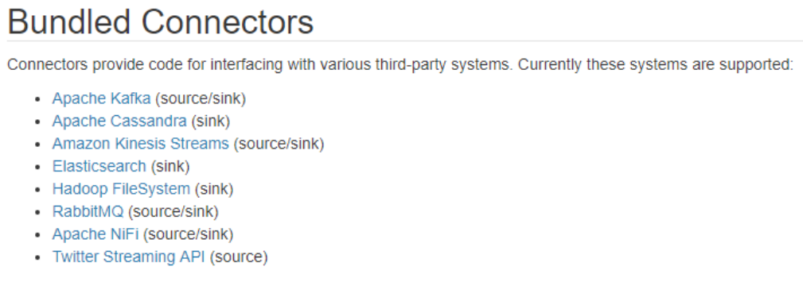

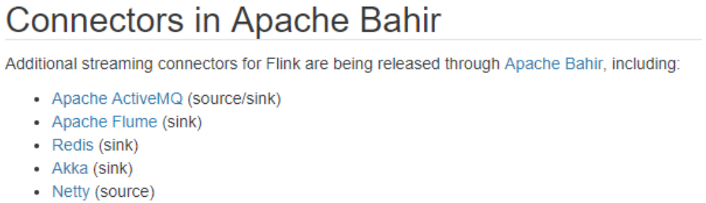

### 5.6.1  **Kafka**

pom.xml

```xml
<!--
https://mvnrepository.com/artifact/org.apache.flink/flink-connector-kafka-0.11 
--><dependency> 
  <groupId>org.apache.flink</groupId> 
  <artifactId>flink-connector-kafka-0.11_2.12</artifactId>
  <version>1.10.1</version>
</dependency>

```

```java
dataStream.addSink(new FlinkKafkaProducer011[String]("localhost:9092", 
"test", new SimpleStringSchema()))
```

### 5.6.2 **Redis**

pom.xml

```xml
<!-- https://mvnrepository.com/artifact/org.apache.bahir/flink-connector-redis 
--><dependency> 
  <groupId>org.apache.bahir</groupId> 
  <artifactId>flink-connector-redis_2.11</artifactId> 
  <version>1.0</version>
</dependency>
```

定义一个 redis 的 mapper 类，用于定义保存到 redis 时调用的命令：

```java
public static class MyRedisMapper implements RedisMapper<SensorReading>{
// 保存到 redis 的命令，存成哈希表
public RedisCommandDescription getCommandDescription() {
return new RedisCommandDescription(RedisCommand.HSET, "sensor_tempe");
}
public String getKeyFromData(SensorReading data) {
return data.getId();
}
public String getValueFromData(SensorReading data) {
return data.getTemperature().toString();
} }
```

在主函数中调用

```java
FlinkJedisPoolConfig config = new FlinkJedisPoolConfig.Builder()
.setHost("localhost")
.setPort(6379)
.build();
dataStream.addSink( new RedisSink<SensorReading>(config, new MyRedisMapper()) );
```

### 5.6.3 **Elasticsearch** 

pom.xml

```xml
<dependency>
  <groupId>org.apache.flink</groupId> 
  <artifactId>flink-connector-elasticsearch6_2.12</artifactId>
  <version>1.10.1</version>
</dependency>
```

在主函数中调用

```java
// es 的 httpHosts 配置
ArrayList<HttpHost> httpHosts = new ArrayList<>();
httpHosts.add(new HttpHost("localhost", 9200));
dataStream.addSink( new ElasticsearchSink.Builder<SensorReading>(httpHosts, new 
MyEsSinkFunction()).build());
```

ElasitcsearchSinkFunction 的实现

```java
public static class MyEsSinkFunction implements 
ElasticsearchSinkFunction<SensorReading>{
@Override
public void process(SensorReading element, RuntimeContext ctx, RequestIndexer 
indexer) {
HashMap<String, String> dataSource = new HashMap<>();
dataSource.put("id", element.getId());
dataSource.put("ts", element.getTimestamp().toString());
dataSource.put("temp", element.getTemperature().toString());
IndexRequest indexRequest = Requests.indexRequest()
.index("sensor")
.type("readingData")
.source(dataSource);
indexer.add(indexRequest);
} }
```

### 5.6.4 **JDBC** **自定义** **sink**

```xml
<!-- https://mvnrepository.com/artifact/mysql/mysql-connector-java --> <dependency> <groupId>mysql</groupId> 
  <artifactId>mysql-connector-java</artifactId>
  <version>5.1.44</version>
</dependency>
```

添加 MyJdbcSink

```java
public static class MyJdbcSink extends RichSinkFunction<SensorReading> {
Connection conn = null;
PreparedStatement insertStmt = null;
PreparedStatement updateStmt = null;
// open 主要是创建连接
@Override
public void open(Configuration parameters) throws Exception {
conn = DriverManager.getConnection("jdbc:mysql://localhost:3306/test", 
"root", "123456");
// 创建预编译器，有占位符，可传入参数
insertStmt = conn.prepareStatement("INSERT INTO sensor_temp (id, temp) VALUES 
(?, ?)");
updateStmt = conn.prepareStatement("UPDATE sensor_temp SET temp = ? WHERE id 
= ?");
}
// 调用连接，执行 sql
@Override
public void invoke(SensorReading value, Context context) throws Exception {
// 执行更新语句，注意不要留 super
updateStmt.setDouble(1, value.getTemperature());
updateStmt.setString(2, value.getId());
updateStmt.execute();
// 如果刚才 update 语句没有更新，那么插入
if (updateStmt.getUpdateCount() == 0) {
insertStmt.setString(1, value.getId());
  insertStmt.setDouble(2, value.getTemperature());
insertStmt.execute();
} }
@Override
public void close() throws Exception {
insertStmt.close();
updateStmt.close();
conn.close();
} }
```

在 main 方法中增加，把明细保存到 mysql 中

```java
dataStream.addSink(new MyJdbcSink())
```

https://www.bilibili.com/video/BV1qy4y1q728?p=46


# 6. Flink 中的 Window

## 6.1 Window

### 6.1.1 **Window** **概述**

​		streaming 流式计算是一种被设计用于处理无限数据集的数据处理引擎，而无限数据集是指一种不断增长的本质上无限的数据集，而 window 是一种切割无限数据为有限块进行处理的手段。

​		Window 是无限数据流处理的核心，Window 将一个无限的 stream 拆分成有限大小的”buckets”桶，我们可以在这些桶上做计算操作

### 6.1.2 **Window** **类型**

Window 可以分成两类

+ CountWindow：按照指定的数据条数生成一个 Window，与时间无关
+ TimeWindow：按照时间生成 Window

对于 TimeWindow，可以根据窗口实现原理的不同分成三类：滚动窗口（Tumbling Window）、滑动窗口（Sliding Window）和会话窗口（Session Window）

1. 滚动窗口（Tumbling Windows）

   将数据依据固定的窗口长度对数据进行切片

   **特点：时间对齐，窗口长度固定，没有重叠**

   滚动窗口分配器将每个元素分配到一个指定窗口大小的窗口中，滚动窗口有一个固定的大小，并且不会出现重叠。例如：如果你指定了一个 5 分钟大小的滚动窗口，窗口的创建如下图所示

   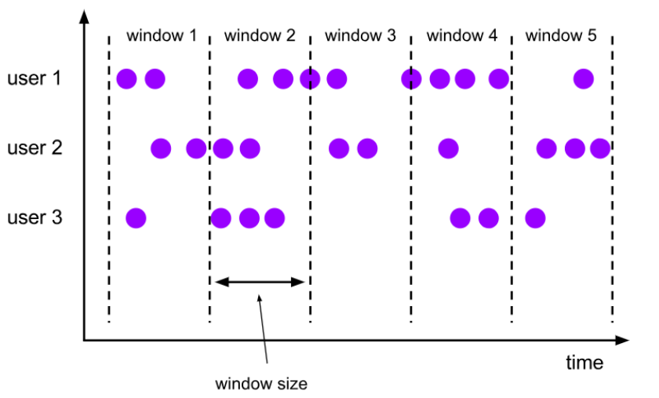

   适用场景：适合做 BI 统计等（做每个时间段的聚合计算）

2. 滑动窗口（Sliding Windows）

   滑动窗口是固定窗口的更广义的一种形式，滑动窗口由固定的窗口长度和滑动间隔组成。

   **特点：时间对齐，窗口长度固定，可以有重叠。**

   滑动窗口分配器将元素分配到固定长度的窗口中，与滚动窗口类似，窗口的大小由窗口大小参数来配置，另一个窗口滑动参数控制滑动窗口开始的频率。因此，滑动窗口如果滑动参数小于窗口大小的话，窗口是可以重叠的，在这种情况下元素会被分配到多个窗口中

   例如，你有 10 分钟的窗口和 5 分钟的滑动，那么每个窗口中 5 分钟的窗口里包含着上个 10 分钟产生的数据，如下图所示：

   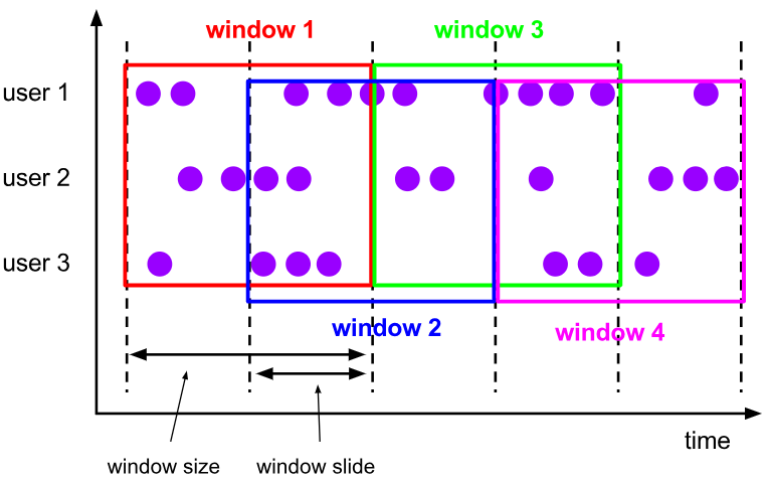

   适用场景：对最近一个时间段内的统计（求某接口最近 5min 的失败率来决定是否要报警）。

3. 会话窗口（Session Windows）

   由一系列事件组合一个指定时间长度的 timeout 间隙组成，类似于 web 应用的session，也就是一段时间没有接收到新数据就会生成新的窗口。

   **特点：时间无对齐。**

   session 窗口分配器通过 session 活动来对元素进行分组，session 窗口跟滚动窗口和滑动窗口相比，不会有重叠和固定的开始时间和结束时间的情况，相反，当它在一个固定的时间周期内不再收到元素，即非活动间隔产生，那个这个窗口就会关闭。一个 session 窗口通过一个 session 间隔来配置，这个 session 间隔定义了非活跃

   周期的长度，当这个非活跃周期产生，那么当前的 session 将关闭并且后续的元素将被分配到新的 session 窗口中去。

   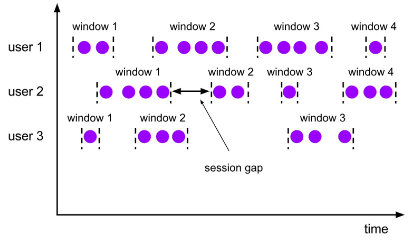

## 6.2 Window API

### 6.2.1 **TimeWindow**

TimeWindow 是将指定时间范围内的所有数据组成一个 window，一次对一个window 里面的所有数据进行计算

1. 滚动窗口

   Flink 默认的时间窗口根据 Processing Time 进行窗口的划分，将 Flink 获取到的数据根据进入 Flink 的时间划分到不同的窗口中

   ```java
   DataStream<Tuple2<String, Double>> minTempPerWindowStream = dataStream
   .map(new MapFunction<SensorReading, Tuple2<String, Double>>() {
   @Override
   public Tuple2<String, Double> map(SensorReading value) throws 
   Exception {
   return new Tuple2<>(value.getId(), value.getTemperature());
   }
   })
   .keyBy(data -> data.f0) 
   .timeWindow( Time.seconds(15) )
   .minBy(1);
   ```

   时间间隔可以通过 Time.milliseconds(x)，Time.seconds(x)，Time.minutes(x)等其中的一个来指定

2. 滑动窗口（SlidingEventTimeWindows）

   滑动窗口和滚动窗口的函数名是完全一致的，只是在传参数时需要传入两个参数，一个是 window_size，一个是 sliding_size

   下面代码中的 sliding_size 设置为了 5s，也就是说，每 5s 就计算输出结果一次，每一次计算的 window 范围是 15s 内的所有元素。

   ```java
   DataStream<SensorReading> minTempPerWindowStream = dataStream
   .keyBy(SensorReading::getId) 
   .timeWindow( Time.seconds(15), Time.seconds(5) )
   .minBy("temperature");
   ```

   时间间隔可以通过 Time.milliseconds(x)，Time.seconds(x)，Time.minutes(x)等其中的一个来指定


### 6.2.2 **CountWindow**

CountWindow 根据窗口中相同 key 元素的数量来触发执行，执行时只计算元素数量达到窗口大小的 key 对应的结果。

注意：CountWindow 的 window_size 指的是相同 Key 的元素的个数，不是输入的所有元素的总数

1. 滚动窗口

   默认的 CountWindow 是一个滚动窗口，只需要指定窗口大小即可，当元素数量达到窗口大小时，就会触发窗口的执行

   ```java
   DataStream<SensorReading> minTempPerWindowStream = dataStream
   .keyBy(SensorReading::getId)
   .countWindow( 5 )
   .minBy("temperature");
   ```

2. 滑动窗口

   滑动窗口和滚动窗口的函数名是完全一致的，只是在传参数时需要传入两个参数，一个是 window_size，一个是 sliding_size。

   下面代码中的 sliding_size 设置为了 2，也就是说，每收到两个相同 key 的数据就计算一次，每一次计算的 window 范围是 10 个元素

   ```java
   DataStream<SensorReading> minTempPerWindowStream = dataStream
   .keyBy(SensorReading::getId)
   .countWindow( 10, 2 )
   .minBy("temperature");
   ```

   ### 6.2.3 **window function**

   window function 定义了要对窗口中收集的数据做的计算操作，主要可以分为两类：

   + 增量聚合函数（incremental aggregation functions）

     每条数据到来就进行计算，保持一个简单的状态。典型的增量聚合函数有ReduceFunction, AggregateFunction

   + 全窗口函数（full window functions）

     先把窗口所有数据收集起来，等到计算的时候会遍历所有数据。ProcessWindowFunction 就是一个全窗口函数。

   ### 6.2.4 **其它可选** **API**

   + .trigger() —— 触发器

     定义 window 什么时候关闭，触发计算并输出结果

   + .evitor() —— 移除器

     定义移除某些数据的逻辑

   + .allowedLateness() —— 允许处理迟到的数据

   + .sideOutputLateData() —— 将迟到的数据放入侧输出流

   + .getSideOutput() —— 获取侧输出流

   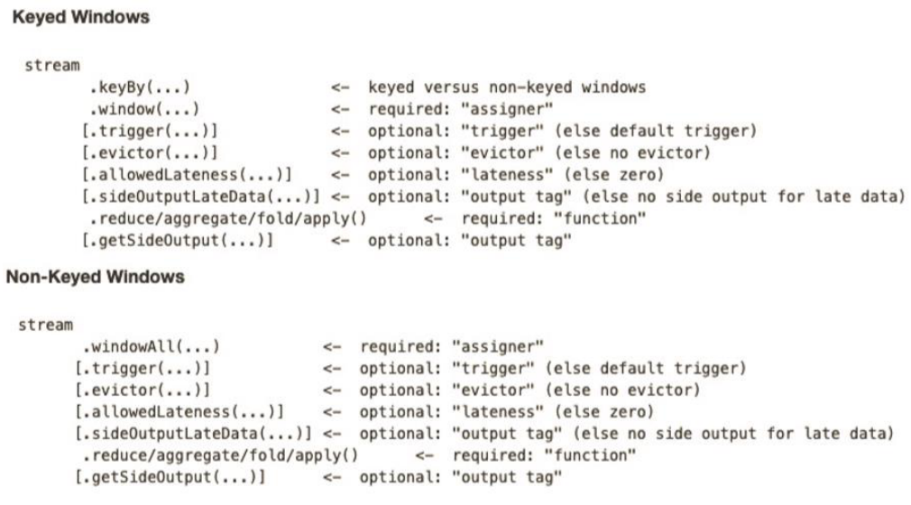

# 7. 时间语义与 Wartermark

## 7.1  Flink 中的时间语义

在 Flink 的流式处理中，会涉及到时间的不同概念，如下图所示：

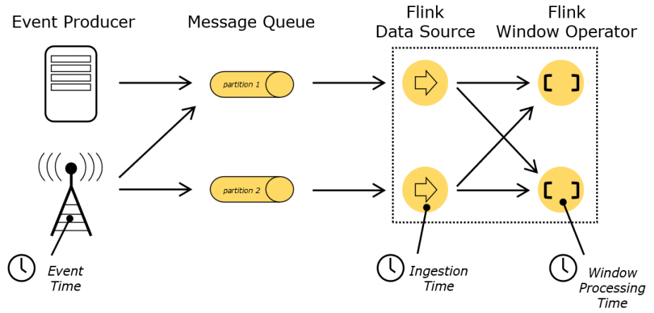

**Event Time**：是事件创建的时间。它通常由事件中的时间戳描述，例如采集的日志数据中，每一条日志都会记录自己的生成时间，Flink 通过时间戳分配器访问事件时间戳。

**Ingestion Time**：是数据进入 Flink 的时间。

**Processing Time**：是每一个执行基于时间操作的算子的本地系统时间，与机器相关，默认的时间属性就是 Processing Time

一个例子——电影《星球大战》：

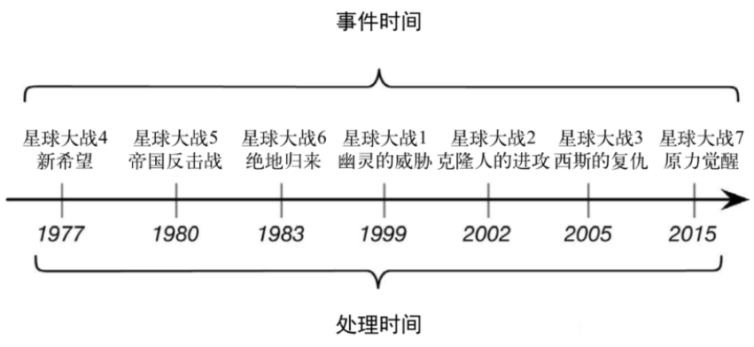

例如，一条日志进入 Flink 的时间为 2017-11-12 10:00:00.123，到达 Window 的系统时间为 2017-11-12 10:00:01.234，日志的内容如下：

```bash
2017-11-02 18:37:15.624 INFO Fail over to rm2
```

对于业务来说，要统计 1min 内的故障日志个数，哪个时间是最有意义的？——eventTime，因为我们要根据日志的生成时间进行统计。

## 7.2 EventTime 的引入

**在** **Flink** **的流式处理中，绝大部分的业务都会使用** **eventTime**，一般只在eventTime 无法使用时，才会被迫使用 ProcessingTime 或者 IngestionTime

如果要使用 EventTime，那么需要引入 EventTime 的时间属性，引入方式如下所示：

```java
StreamExecutionEnvironment env = 
StreamExecutionEnvironment.getExecutionEnvironment
// 从调用时刻开始给 env 创建的每一个 stream 追加时间特征
env.setStreamTimeCharacteristic(TimeCharacteristic.EventTime)
```

## 7.3 Watermark

### 7.3.1 **基本概念**

我们知道，流处理从事件产生，到流经 source，再到 operator，中间是有一个过程和时间的，虽然大部分情况下，流到 operator 的数据都是按照事件产生的时间顺序来的，但是也不排除由于网络、分布式等原因，导致乱序的产生，所谓乱序，就是指 Flink 接收到的事件的先后顺序不是严格按照事件的 Event Time 顺序排列的。

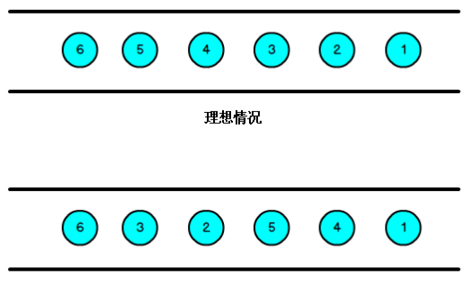

那么此时出现一个问题，一旦出现乱序，如果只根据 eventTime 决定 window 的运行，我们不能明确数据是否全部到位，但又不能无限期的等下去，此时必须要有个机制来保证一个特定的时间后，必须触发 window 去进行计算了，这个特别的机制，就是 Watermark。

+ Watermark 是一种衡量 Event Time 进展的机制。
+ **Watermark** **是用于处理乱序事件的**，而正确的处理乱序事件，通常用Watermark 机制结合 window 来实现。
+ 数据流中的 Watermark 用于表示 timestamp 小于 Watermark 的数据，都已经到达了，因此，window 的执行也是由 Watermark 触发的。
+ Watermark 可以理解成一个延迟触发机制，我们可以设置 Watermark 的延时时长 t，每次系统会校验已经到达的数据中最大的 maxEventTime，然后认定 eventTime小于 maxEventTime - t 的所有数据都已经到达，如果有窗口的停止时间等于maxEventTime – t，那么这个窗口被触发执行

有序流的 Watermarker 如下图所示：（Watermark 设置为 0）

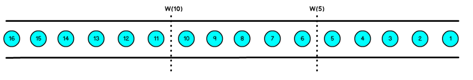

乱序流的 Watermarker 如下图所示：（Watermark 设置为 2）

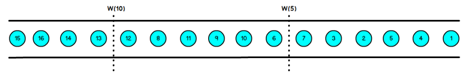

当 Flink 接收到数据时，会按照一定的规则去生成 Watermark，这条 Watermark就等于当前所有到达数据中的 maxEventTime - 延迟时长，也就是说，Watermark 是基于数据携带的时间戳生成的，一旦 Watermark 比当前未触发的窗口的停止时间要晚，那么就会触发相应窗口的执行。由于 event time 是由数据携带的，因此，如果运行过程中无法获取新的数据，那么没有被触发的窗口将永远都不被触发。

上图中，我们设置的允许最大延迟到达时间为 2s，所以时间戳为 7s 的事件对应的 Watermark 是 5s，时间戳为 12s 的事件的 Watermark 是 10s，如果我们的窗口 1 是 1s~5s，窗口 2 是 6s~10s，那么时间戳为 7s 的事件到达时的 Watermarker 恰好触发窗口 1，时间戳为 12s 的事件到达时的 Watermark 恰好触发窗口 2。

Watermark 就是触发前一窗口的“关窗时间”，一旦触发关窗那么以当前时刻为准在窗口范围内的所有所有数据都会收入窗中。

只要没有达到水位那么不管现实中的时间推进了多久都不会触发关窗。

### 7.3.2 **Watermark** **的引入**

watermark 的引入很简单，对于乱序数据，最常见的引用方式如下：

```java
dataStream.assignTimestampsAndWatermarks( new 
BoundedOutOfOrdernessTimestampExtractor<SensorReading>(Time.millisecond
s(1000)) {
@Override
  public long extractTimestamp(element: SensorReading): Long = {
return element.getTimestamp() * 1000L; }
} );
```

Event Time 的使用一定要**指定数据源中的时间戳**。否则程序无法知道事件的事件时间是什么(数据源里的数据没有时间戳的话，就只能使用 Processing Time 了)。

我们看到上面的例子中创建了一个看起来有点复杂的类，这个类实现的其实就是分配时间戳的接口。Flink 暴露了 TimestampAssigner 接口供我们实现，使我们可以自定义如何从事件数据中抽取时间戳。

```java
StreamExecutionEnvironment env = 
StreamExecutionEnvironment.getExecutionEnvironment();
// 设置事件时间语义
env.setStreamTimeCharacteristic(TimeCharacteristic.EventTime);
DataStream<SensorReading> dataStream = env.addSource(new SensorSource())
.assignTimestampsAndWatermarks(new MyAssigner());
```

MyAssigner 有两种类型

+ AssignerWithPeriodicWatermarks
+ AssignerWithPunctuatedWatermarks

以上两个接口都继承自 TimestampAssigner。

**Assigner with periodic watermarks**

周期性的生成 watermark：系统会周期性的将 watermark 插入到流中(水位线也是一种特殊的事件!)。默认周期是 200 毫秒。可以使用ExecutionConfig.setAutoWatermarkInterval()方法进行设置。

```java
// 每隔 5 秒产生一个 watermark
env.getConfig.setAutoWatermarkInterval(5000);
```

产生 watermark 的逻辑：每隔 5 秒钟，Flink 会调用

AssignerWithPeriodicWatermarks 的 getCurrentWatermark()方法。如果方法返回一个时间戳大于之前水位的时间戳，新的 watermark 会被插入到流中。这个检查保证了水位线是单调递增的。如果方法返回的时间戳小于等于之前水位的时间戳，则不会产生新的 watermark

例子，自定义一个周期性的时间戳抽取：

```java
// 自定义周期性时间戳分配器
public static class MyPeriodicAssigner implements 
AssignerWithPeriodicWatermarks<SensorReading>{
private Long bound = 60 * 1000L; // 延迟一分钟
private Long maxTs = Long.MIN_VALUE; // 当前最大时间戳
@Nullable
@Override
public Watermark getCurrentWatermark() {
return new Watermark(maxTs - bound);
}@Override
public long extractTimestamp(SensorReading element, long previousElementTimestamp) 
{
maxTs = Math.max(maxTs, element.getTimestamp());
return element.getTimestamp();
} }
```

一种简单的特殊情况是，如果我们事先得知数据流的时间戳是单调递增的，也就是说没有乱序，那我们可以使用 AscendingTimestampExtractor，这个类会直接使用数据的时间戳生成 watermark。

```java
DataStream<SensorReading> dataStream = …
dataStream.assignTimestampsAndWatermarks(
new AscendingTimestampExtractor<SensorReading>() {
@Override
public long extractAscendingTimestamp(SensorReading element) {
return element.getTimestamp() * 1000; }
});
```

而对于乱序数据流，如果我们能大致估算出数据流中的事件的最大延迟时间，就可以使用如下代码：

```java
DataStream<SensorReading> dataStream = …
dataStream.assignTimestampsAndWatermarks(
new BoundedOutOfOrdernessTimestampExtractor<SensorReading>(Time.seconds(1)) {
@Override
public long extractTimestamp(SensorReading element) {
return element.getTimestamp() * 1000L; }
});
```

**Assigner with punctuated watermarks**

间断式地生成 watermark。和周期性生成的方式不同，这种方式不是固定时间的，而是可以根据需要对每条数据进行筛选和处理。直接上代码来举个例子，我们只给sensor_1 的传感器的数据流插入 watermark：

```java
public static class MyPunctuatedAssigner implements 
AssignerWithPunctuatedWatermarks<SensorReading>{
private Long bound = 60 * 1000L; // 延迟一分钟
@Nullable
@Override
public Watermark checkAndGetNextWatermark(SensorReading lastElement, long 
extractedTimestamp) {
if(lastElement.getId().equals("sensor_1"))
return new Watermark(extractedTimestamp - bound);
else
return null; }
@Override
public long extractTimestamp(SensorReading element, long previousElementTimestamp) 
{
return element.getTimestamp();
} }
```

## 7.4  EvnetTime 在 window 中的使用（Scala 版）

### 7.4.1 	滚动窗口（TumblingEventTimeWindows）

```scala
def main(args: Array[String]): Unit = {
// 环境
val env: StreamExecutionEnvironment = 
StreamExecutionEnvironment.getExecutionEnvironment
env.setStreamTimeCharacteristic(TimeCharacteristic.EventTime)
env.setParallelism(1)
val dstream: DataStream[String] = env.socketTextStream("localhost",7777)
val textWithTsDstream: DataStream[(String, Long, Int)] = dstream.map 
{ text =>
val arr: Array[String] = text.split(" ")
(arr(0), arr(1).toLong, 1) }
val textWithEventTimeDstream: DataStream[(String, Long, Int)] = 
textWithTsDstream.assignTimestampsAndWatermarks(new 
BoundedOutOfOrdernessTimestampExtractor[(String, Long, 
Int)](Time.milliseconds(1000)) {
override def extractTimestamp(element: (String, Long, Int)): Long = {
return element._2
}
})
val textKeyStream: KeyedStream[(String, Long, Int), Tuple] =
  textWithEventTimeDstream.keyBy(0)
textKeyStream.print("textkey:")
val windowStream: WindowedStream[(String, Long, Int), Tuple, TimeWindow] 
= textKeyStream.window(TumblingEventTimeWindows.of(Time.seconds(2)))
val groupDstream: DataStream[mutable.HashSet[Long]] = 
windowStream.fold(new mutable.HashSet[Long]()) { case (set, (key, ts, count)) 
=>
set += ts
}
groupDstream.print("window::::").setParallelism(1)
env.execute()
} }
  
```

结果是按照 Event Time 的时间窗口计算得出的，而无关系统的时间（包括输入的快慢）。

### 7.4.2 滑动窗口（SlidingEventTimeWindows）

```scala
def main(args: Array[String]): Unit = {
// 环境
val env: StreamExecutionEnvironment = 
StreamExecutionEnvironment.getExecutionEnvironment
env.setStreamTimeCharacteristic(TimeCharacteristic.EventTime)
env.setParallelism(1)
  val dstream: DataStream[String] = env.socketTextStream("localhost",7777)
val textWithTsDstream: DataStream[(String, Long, Int)] = dstream.map { text 
=>
val arr: Array[String] = text.split(" ")
(arr(0), arr(1).toLong, 1) }
val textWithEventTimeDstream: DataStream[(String, Long, Int)] = 
textWithTsDstream.assignTimestampsAndWatermarks(new 
BoundedOutOfOrdernessTimestampExtractor[(String, Long, 
Int)](Time.milliseconds(1000)) {
override def extractTimestamp(element: (String, Long, Int)): Long = {
return element._2
}
})
val textKeyStream: KeyedStream[(String, Long, Int), Tuple] = 
textWithEventTimeDstream.keyBy(0)
textKeyStream.print("textkey:")
val windowStream: WindowedStream[(String, Long, Int), Tuple, TimeWindow] = 
textKeyStream.window(SlidingEventTimeWindows.of(Time.seconds(2),Time.millis
econds(500)))
val groupDstream: DataStream[mutable.HashSet[Long]] = windowStream.fold(new 
mutable.HashSet[Long]()) { case (set, (key, ts, count)) =>
set += ts
  }
groupDstream.print("window::::").setParallelism(1)
env.execute()
}
```

### 7.4.3 会话窗口（EventTimeSessionWindows）

相邻两次数据的 EventTime 的时间差超过指定的时间间隔就会触发执行。如果加入 Watermark， 会在符合窗口触发的情况下进行延迟。到达延迟水位再进行窗口触发。

```scala
def main(args: Array[String]): Unit = {
// 环境
val env: StreamExecutionEnvironment = 
StreamExecutionEnvironment.getExecutionEnvironment
env.setStreamTimeCharacteristic(TimeCharacteristic.EventTime)
env.setParallelism(1)
val dstream: DataStream[String] = env.socketTextStream("localhost",7777)
val textWithTsDstream: DataStream[(String, Long, Int)] = dstream.map { text 
=>
val arr: Array[String] = text.split(" ")
(arr(0), arr(1).toLong, 1) }
val textWithEventTimeDstream: DataStream[(String, Long, Int)] = 
textWithTsDstream.assignTimestampsAndWatermarks(new
                                                BoundedOutOfOrdernessTimestampExtractor[(String, Long, 
Int)](Time.milliseconds(1000)) {
override def extractTimestamp(element: (String, Long, Int)): Long = {
return element._2
}
})
val textKeyStream: KeyedStream[(String, Long, Int), Tuple] = 
textWithEventTimeDstream.keyBy(0)
textKeyStream.print("textkey:")
val windowStream: WindowedStream[(String, Long, Int), Tuple, TimeWindow] 
= 
textKeyStream.window(EventTimeSessionWindows.withGap(Time.milliseconds(500)
) )
windowStream.reduce((text1,text2)=>
( text1._1,0L,text1._3+text2._3)
) .map(_._3).print("windows:::").setParallelism(1)
env.execute()
}	
```


