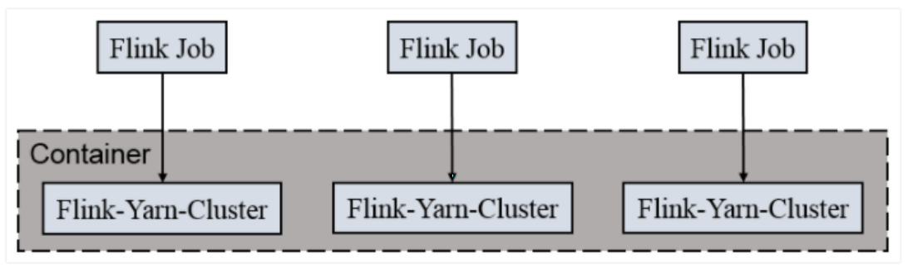

[TOC]

# 1.流处理简介

## 1.1 Flink 是什么


### 1.1.1 Flink 的全球热度


### 1.1.2 Flink 目前在国内企业的应用


## 1.2 为什么要用 Flink

1. 流数据更真实地反映了我们的生活方式
2. 传统的数据架构是基于有限数据集的
3. 我们的目标
   + 低延迟
   + 高吞吐
   + 结果的准确性和良好的容错性

### 1.2.1 哪些行业需要处理流数据

1. 电商和市场营销

   数据报表、广告投放、业务流程需要

2. 物联网（IOT） 

   传感器实时数据采集和显示、实时报警，交通运输业

3. 电信业

   基站流量调配

4. 银行和金融业

   实时结算和通知推送，实时检测异常行

## 1.3 流处理的发展和演变

### 1.3.1 传统数据处理架构

1. 事务处理

   

2. 分析处理

   将数据从业务数据库复制到数仓，再进行分析和查询

   

### 1.3.2 有状态的流式处理


### 1.3.3 流处理的演变

1. lambda 架构

   用两套系统，同时保证低延迟和结果准确

   

   =

## 1.4 Flink 的主要特点

### 1.4.1 事件驱动（Event-driven）


### 1.4.2 基于流的世界观

在 Flink 的世界观中，一切都是由流组成的，离线数据是有界的流；实时数据是一个没有界限的流：这就是所谓的有界流和无界流


### 1.4.3 分层API

+  越顶层越抽象，表达含义越简明，使用越方便

+ 越底层越具体，表达能力越丰富，使用越灵活

  

### 1.4.4 其它特点

+ 支持事件时间（event-time）和处理时间（processing-time）语义
+ 精确一次（exactly-once）的状态一致性保证
+ 低延迟，每秒处理数百万个事件，毫秒级延迟
+ 与众多常用存储系统的连接
+ 高可用，动态扩展，实现7*24小时全天候运行

## 1.5 Flink vs Spark Streaming

### 1.5.1 流（stream）和微批（micro-batching）


### 1.5.2 数据模型

+ spark 采用 RDD 模型，spark streaming 的 DStream 实际上也就是一组 组小批数据 RDD 的集合
+ flink 基本数据模型是数据流，以及事件（Event）序列

### 1.5.3 运行时架构

+ spark 是批计算，将 DAG 划分为不同的 stage，一个完成后才可以计算下一个
+ flink 是标准的流执行模式，一个事件在一个节点处理完后可以直接发往下一个节点进行处理


# 2. 快速上手

## 2.1 搭建 maven 工程

pom 文件

```xml
<?xml version="1.0" encoding="UTF-8"?>
<project xmlns="http://maven.apache.org/POM/4.0.0"
         xmlns:xsi="http://www.w3.org/2001/XMLSchema-instance"
         xsi:schemaLocation="http://maven.apache.org/POM/4.0.0 http://maven.apache.org/xsd/maven-4.0.0.xsd">
    <modelVersion>4.0.0</modelVersion>

    <groupId>org.example</groupId>
    <artifactId>FlinkStudy</artifactId>
    <version>1.0-SNAPSHOT</version>

    <dependencies>
        <dependency>
            <groupId>org.apache.flink</groupId>
            <artifactId>flink-java</artifactId>
            <version>1.10.1</version>
        </dependency>
        <dependency>
            <groupId>org.apache.flink</groupId>
            <artifactId>flink-streaming-java_2.12</artifactId>
            <version>1.10.1</version>
        </dependency>
    </dependencies>
</project>
```

## 2.2 批处理 wordcount

```java
package net.codeshow.wc;

import org.apache.flink.api.common.functions.FlatMapFunction;
import org.apache.flink.api.java.DataSet;
import org.apache.flink.api.java.ExecutionEnvironment;
import org.apache.flink.api.java.operators.AggregateOperator;
import org.apache.flink.api.java.operators.DataSource;
import org.apache.flink.api.java.tuple.Tuple2;
import org.apache.flink.util.Collector;

/**
 * @Description
 * @Author eric
 * @Version V1.0.0
 * @Date 2021/1/19
 */

// 批处理 word count
public class WordCount {
    public static void main(String[] args) throws Exception {
//        创建执行环境
        ExecutionEnvironment env = ExecutionEnvironment.getExecutionEnvironment();
//        从文件中读取数据
        String inputPath = "/Users/cuiguangsong/my_files/workspace/java/FlinkStudy/src/main/resources/hello.txt";
        DataSet<String> inputDataSet = env.readTextFile(inputPath);
//        对数据集进行处理，按空格分词展开，转换成(word,1)二元组进行统计
        DataSet<Tuple2<String, Integer>> resultSet = inputDataSet.flatMap(new MyFlatMapper())
//                按照第一个位置的word分组
                .groupBy(0)
//                将第二个位置上的数据求和
                .sum(1);
        resultSet.print();


    }

    //    自定义类，实现FlatMapFunction接口
    public static class MyFlatMapper implements FlatMapFunction<String, Tuple2<String, Integer>> {

        public void flatMap(String value, Collector<Tuple2<String, Integer>> out) throws Exception {
//        按照空格分词
            String[] words = value.split(" ");
//            遍历所有word，包装成二元组输出
            for (String word : words) {
                out.collect(new Tuple2<>(word, 1));

            }

        }
    }
}

```

## 2.3 流处理 wordcount

```java
package net.codeshow.wc;

import org.apache.flink.api.java.tuple.Tuple2;
import org.apache.flink.api.java.utils.ParameterTool;
import org.apache.flink.streaming.api.datastream.DataStream;
import org.apache.flink.streaming.api.datastream.DataStreamSource;
import org.apache.flink.streaming.api.datastream.SingleOutputStreamOperator;
import org.apache.flink.streaming.api.environment.StreamExecutionEnvironment;

/**
 * @Description
 * @Author eric
 * @Version V1.0.0
 * @Date 2021/1/19
 */
public class StreamWordCount {
    public static void main(String[] args) throws Exception {
//        创建流处理执行环境
        StreamExecutionEnvironment env = StreamExecutionEnvironment.getExecutionEnvironment();
        env.setParallelism(1);
//        String inputPath = "/Users/cuiguangsong/my_files/workspace/java/FlinkStudy/src/main/resources/hello.txt";
//        DataStream<String> inputDataStream = env.readTextFile(inputPath);
//        用parameterTool工具从程序启动参数中提取配置项
        ParameterTool parameterTool = ParameterTool.fromArgs(args);
        String host = parameterTool.get("host");
        int port = parameterTool.getInt("port");

//        从socket文本流读取数据
        DataStream<String> inputDataStream = env.socketTextStream(host, port);
//        基于数据流进行转换计算
        DataStream<Tuple2<String, Integer>> resultStream = inputDataStream.flatMap(new WordCount.MyFlatMapper())
                .keyBy(0)
                .sum(1);
        resultStream.print();
//        执行任务
        env.execute();

    }
}

```

测试——在 linux 系统中用 netcat 命令进行发送测试。

```bash
nc -lk 7777
```

# 3. Flink 部署

## 3.1 Standalone 模式

### 3.1.1 **安装**

解压缩 flink-1.10.1-bin-scala_2.12.tgz，进入 conf 目录中

1. *修改* *flink/conf/flink-conf.yaml* *文件*

   

2. *修改* */conf/slaves* *文件*

   

3. 分发给另外两台机器

   

4. *启动*

   

   访问 http://localhost:8081 可以对 flink 集群和任务进行监控管理。

   


### 3.1.2 **提交任务**

1. *准备数据文件（如果需要）*

   

2. *把含数据文件的文件夹，分发到* *taskmanage* *机器中*

   

   如 果 从 文 件 中 读 取 数 据 ， 由 于 是 从 本 地 磁 盘 读 取 ， 实 际 任 务 会 被 分 发 到taskmanage 的机器中，所以要把目标文件分发

3. *执行程序*

   ```bash
   ./flink run -c com.atguigu.wc.StreamWordCount –p 2 FlinkTutorial-1.0-SNAPSHOT-jar-with-dependencies.jar --host lcoalhost –port 7777
   ```

   

4. *查看计算结果*

   注意：如果输出到控制台，应该在 taskmanager 下查看；如果计算结果输出到文件，同样会保存到 taskmanage 的机器下，不会在 jobmanage 下

   

5. *在* *webui* *控制台查看计算过程*

   

## 3.2 Yarn 模式

以 Yarn 模式部署 Flink 任务时，要求 Flink 是有 Hadoop 支持的版本，Hadoop环境需要保证版本在 2.2 以上，并且集群中安装有 HDFS 服务

### 3.2.1  **Flink on Yarn**

Flink 提供了两种在 yarn 上运行的模式，分别为 Session-Cluster 和 Per-Job-Cluster模式。

1. **Session-cluster** **模式**

   

   Session-Cluster 模式需要先启动集群，然后再提交作业，接着会向 yarn 申请一块空间后，资源永远保持不变。如果资源满了，下一个作业就无法提交，只能等到yarn 中的其中一个作业执行完成后，释放了资源，下个作业才会正常提交。所有作业共享 Dispatcher 和 ResourceManager；共享资源；适合规模小执行时间短的作业

   在 yarn 中初始化一个 flink 集群，开辟指定的资源，以后提交任务都向这里提交。这个 flink 集群会常驻在 yarn 集群中，除非手工停止

2. **Per-Job-Cluster** **模式**

   

   一个 Job 会对应一个集群，每提交一个作业会根据自身的情况，都会单独向 yarn申请资源，直到作业执行完成，一个作业的失败与否并不会影响下一个作业的正常提交和运行。独享 Dispatcher 和 ResourceManager，按需接受资源申请；适合规模大长时间运行的作业

   每次提交都会创建一个新的 flink 集群，任务之间互相独立，互不影响，方便管理。任务执行完成之后创建的集群也会消失

### 3.2.2 **Session Cluster**

1. *启动* *hadoop* *集群（略）*

2. *启动* *yarn-session*

   ```bash
   ./yarn-session.sh -n 2 -s 2 -jm 1024 -tm 1024 -nm test -d
   ```

   其中：

   -n(--container)：TaskManager 的数量。

   -s(--slots)： 每个 TaskManager 的 slot 数量，默认一个 slot 一个 core，默认每个

   taskmanager 的 slot 的个数为 1，有时可以多一些 taskmanager，做冗余。

   -jm：JobManager 的内存（单位 MB)。 

   -tm：每个 taskmanager 的内存（单位 MB)。 

   -nm：yarn 的 appName(现在 yarn 的 ui 上的名字)。 

   -d：后台执行

   

3. *执行任务*

   ```bash
   ./flink run -c com.atguigu.wc.StreamWordCount FlinkTutorial-1.0-SNAPSHOT-jar-with-dependencies.jar --host lcoalhost –port 7777
   ```

4. *去* *yarn* *控制台查看任务状态*

   

5. *取消* *yarn-session*

   ```bash
   yarn application --kill application_1577588252906_0001
   ```

### 3.2.2  **Per Job Cluster**

1. *启动* *hadoop* *集群（略）*

2. **不启动** **yarn-session***，直接执行* *job*

   ```bash
   ./flink run –m yarn-cluster -c com.atguigu.wc.StreamWordCount FlinkTutorial-1.0-SNAPSHOT-jar-with-dependencies.jar --host lcoalhost –port 7777
   ```

## 3.3 Kubernetes 部署

容器化部署时目前业界很流行的一项技术，基于 Docker 镜像运行能够让用户更加 方 便地 对应 用进 行管 理 和运 维。 容器 管理 工 具中 最为 流行 的就 是 Kubernetes（k8s），而 Flink 也在最近的版本中支持了 k8s 部署模式

1）搭建 *Kubernetes* *集群（略）*

2）配置各组件的 *yaml* *文件*

在 k8s 上构建 Flink Session Cluster，需要将 Flink 集群的组件对应的 docker 镜像分别在 k8s 上启动，包括 JobManager、TaskManager、JobManagerService 三个镜像服务。每个镜像服务都可以从中央镜像仓库中获取

3）启动 *Flink Session Cluster*

```bash
// 启动 jobmanager-service 服务
kubectl create -f jobmanager-service.yaml
// 启动 jobmanager-deployment 服务
kubectl create -f jobmanager-deployment.yaml
// 启动 taskmanager-deployment 服务
kubectl create -f taskmanager-deployment.yaml
```

4）访问 *Flink UI* *页面*

集群启动后，就可以通过 JobManagerServicers 中配置的 WebUI 端口，用浏览器输入以下 url 来访问 Flink UI 页面了：

http://*{JobManagerHost:Port}*/api/v1/namespaces/default/services/flink-jobmanager:ui/proxy


