[TOC]

# 1. HDFS概述

## 1.1 HDFS产生背景及定义

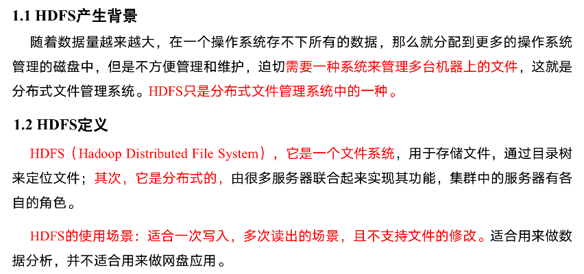

## 1.2 HDFS优缺点

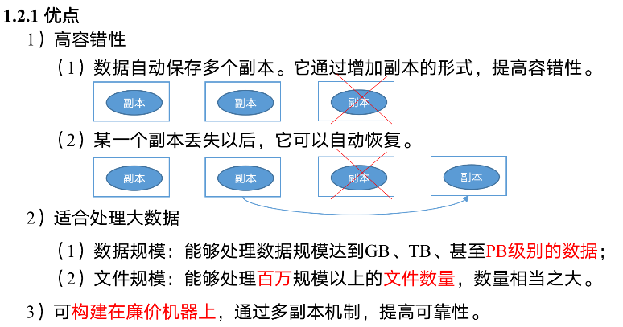

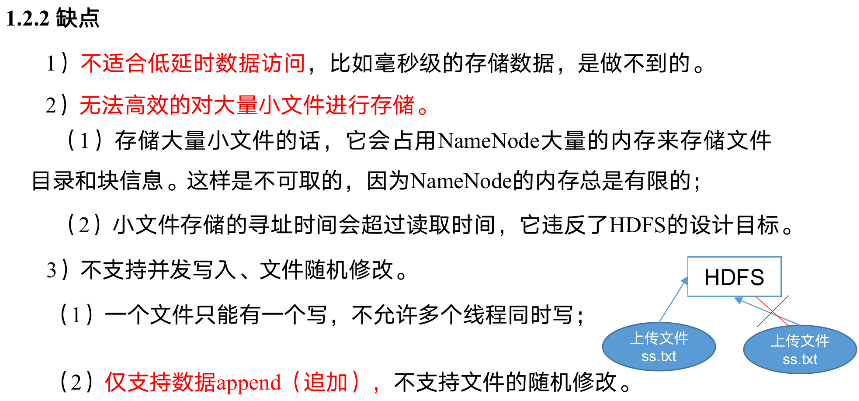

## 1.3 HDFS组成架构

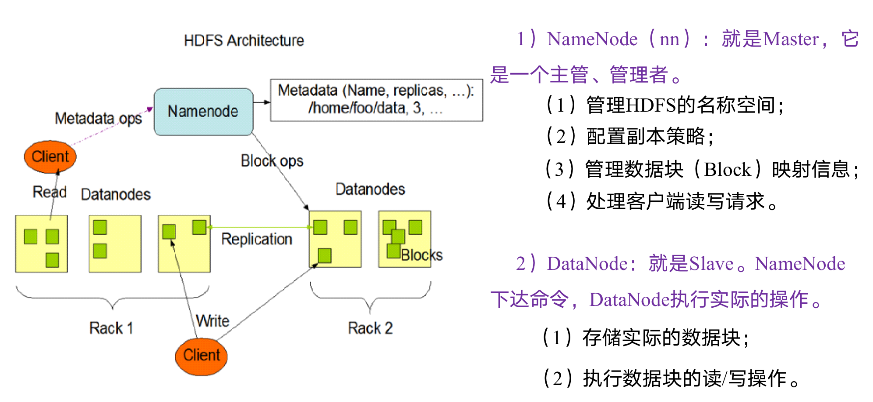

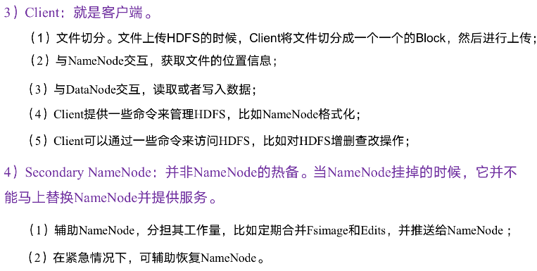

## 1.4 HDFS文件块大小（面试重点）

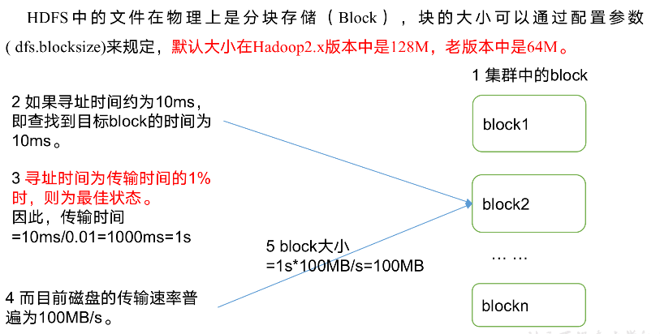


# 2. HDFS的Shell操作（开发重点）

## 2.1 基本语法

```bash
bin/hadoop fs 具体命令   OR  bin/hdfs dfs 具体命令
dfs是fs的实现类。
```

## 2.2 命令大全

```bash
[atguigu@hadoop102 hadoop-2.7.2]$ bin/hadoop fs

[-appendToFile <localsrc> ... <dst>]
        [-cat [-ignoreCrc] <src> ...]
        [-checksum <src> ...]
        [-chgrp [-R] GROUP PATH...]
        [-chmod [-R] <MODE[,MODE]... | OCTALMODE> PATH...]
        [-chown [-R] [OWNER][:[GROUP]] PATH...]
        [-copyFromLocal [-f] [-p] <localsrc> ... <dst>]
        [-copyToLocal [-p] [-ignoreCrc] [-crc] <src> ... <localdst>]
        [-count [-q] <path> ...]
        [-cp [-f] [-p] <src> ... <dst>]
        [-createSnapshot <snapshotDir> [<snapshotName>]]
        [-deleteSnapshot <snapshotDir> <snapshotName>]
        [-df [-h] [<path> ...]]
        [-du [-s] [-h] <path> ...]
        [-expunge]
        [-get [-p] [-ignoreCrc] [-crc] <src> ... <localdst>]
        [-getfacl [-R] <path>]
        [-getmerge [-nl] <src> <localdst>]
        [-help [cmd ...]]
        [-ls [-d] [-h] [-R] [<path> ...]]
        [-mkdir [-p] <path> ...]
        [-moveFromLocal <localsrc> ... <dst>]
        [-moveToLocal <src> <localdst>]
        [-mv <src> ... <dst>]
         [-put [-f] [-p] <localsrc> ... <dst>]
        [-renameSnapshot <snapshotDir> <oldName> <newName>]
        [-rm [-f] [-r|-R] [-skipTrash] <src> ...]
        [-rmdir [--ignore-fail-on-non-empty] <dir> ...]
        [-setfacl [-R] [{-b|-k} {-m|-x <acl_spec>} <path>]|[--set <acl_spec> <path>]]
        [-setrep [-R] [-w] <rep> <path> ...]
        [-stat [format] <path> ...]
        [-tail [-f] <file>]
        [-test -[defsz] <path>]
        [-text [-ignoreCrc] <src> ...]
        [-touchz <path> ...]
        [-usage [cmd ...]]
```

## 2.3 常用命令实操

1. 启动Hadoop集群（方便后续的测试）

   ```bash
   sbin/start-dfs.sh
   sbin/start-yarn.sh
   ```

2. -help：输出这个命令参数

   ```bash
   hadoop fs -help rm
   ```

3. -ls: 显示目录信息

   ```bash
   hadoop fs -ls /
   ```

4. -mkdir：在HDFS上创建目录

   ```bash
   hadoop fs -mkdir -p /sanguo/shuguo
   ```

5. -moveFromLocal：从本地剪切粘贴到HDFS

   ```bash
   touch kongming.txt
   hadoop fs  -moveFromLocal  ./kongming.txt  /sanguo/shuguo
   ```

6. -appendToFile：追加一个文件到已经存在的文件末尾

   ```bash
   touch liubei.txt
   vi liubei.txt
   ```

   ```bash
   输入
   san gu mao lu
   ```

   ```bash
   hadoop fs -appendToFile liubei.txt /sanguo/shuguo/kongming.txt
   ```

7. -cat：显示文件内容

   ```bash
   hadoop fs -cat /sanguo/shuguo/kongming.txt
   ```

8. -chgrp 、-chmod、-chown：Linux文件系统中的用法一样，修改文件所属权限

   ```bash
   hadoop fs  -chmod  666  /sanguo/shuguo/kongming.txt
   hadoop fs  -chown  atguigu:atguigu   /sanguo/shuguo/kongming.txt
   ```

9. -copyFromLocal：从本地文件系统中拷贝文件到HDFS路径去

   ```bash
   hadoop fs -copyFromLocal README.txt /
   ```

10. -copyToLocal：从HDFS拷贝到本地

    ```bash
    hadoop fs -copyToLocal /sanguo/shuguo/kongming.txt ./
    ```

11. -cp ：从HDFS的一个路径拷贝到HDFS的另一个路径

    ```bash
    hadoop fs -cp /sanguo/shuguo/kongming.txt /zhuge.txt
    ```

12. -mv：在HDFS目录中移动文件

    ```bash
    hadoop fs -mv /zhuge.txt /sanguo/shuguo/
    ```

13. -get：等同于copyToLocal，就是从HDFS下载文件到本地

    ```bash
    hadoop fs -get /sanguo/shuguo/kongming.txt ./
    ```

14. -getmerge：合并下载多个文件，比如HDFS的目录 /user/atguigu/test下有多个文件:log.1, log.2,log.3,...

    ```bash
    hadoop fs -getmerge /user/atguigu/test/* ./zaiyiqi.txt
    ```

15. -put：等同于copyFromLocal

    ```bash
    hadoop fs -put ./zaiyiqi.txt /user/atguigu/test/
    ```

16. -tail：显示一个文件的末尾

    ```bash
    hadoop fs -tail /sanguo/shuguo/kongming.txt
    ```

17. -rm：删除文件或文件夹

    ```bash
    hadoop fs -rm /user/atguigu/test/jinlian2.txt
    ```

18. -rmdir：删除空目录

    ```bash
    hadoop fs -mkdir /test
    hadoop fs -rmdir /test
    ```

19. -du统计文件夹的大小信息

    ```bash
    hadoop fs -du -s -h /user/atguigu/test
    
    2.7 K  /user/atguigu/test
    
    hadoop fs -du  -h /user/atguigu/test
    
    1.3 K  /user/atguigu/test/README.txt
    15     /user/atguigu/test/jinlian.txt
    1.4 K  /user/atguigu/test/zaiyiqi.txt
    ```

20. -setrep：设置HDFS中文件的副本数量

    ```bash
    hadoop fs -setrep 10 /sanguo/shuguo/kongming.txt
    ```

    

    这里设置的副本数只是记录在NameNode的元数据中，是否真的会有这么多副本，还得看DataNode的数量。因为目前只有3台设备，最多也就3个副本，只有节点数的增加到10台时，副本数才能达到10

# 3. HDFS客户端操作（开发重点）

## 3.1 HDFS客户端环境准备

1. 根据自己电脑的操作系统拷贝对应的编译后的hadoop jar包到非中文路径（例如：D:\Develop\hadoop-2.7.2）
   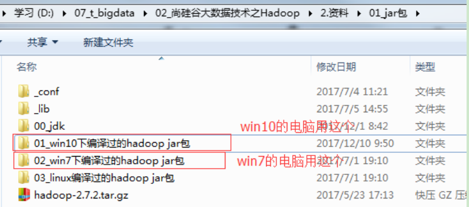

2. 配置HADOOP_HOME环境变量
   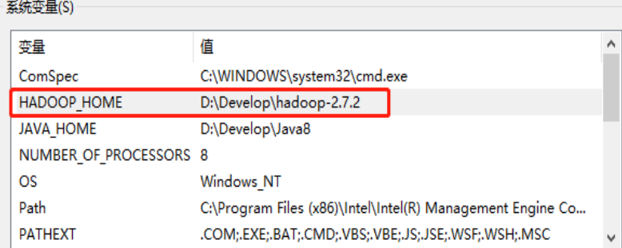

3. 配置Path环境变量
   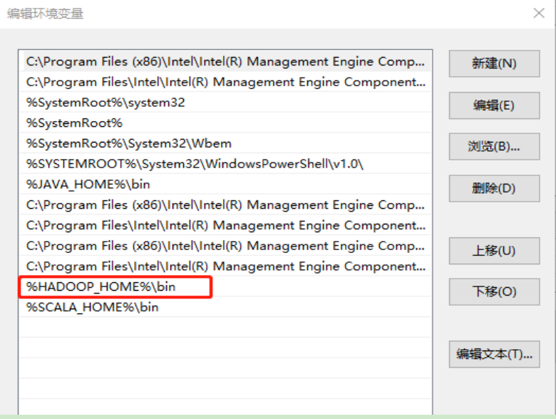

4. 创建一个Maven工程HdfsClientDemo

5. 导入相应的依赖坐标+日志添加

   ```xml
   <dependencies>
   		<dependency>
   			<groupId>junit</groupId>
   			<artifactId>junit</artifactId>
   			<version>RELEASE</version>
   		</dependency>
   		<dependency>
   			<groupId>org.apache.logging.log4j</groupId>
   			<artifactId>log4j-core</artifactId>
   			<version>2.8.2</version>
   		</dependency>
   		<dependency>
   			<groupId>org.apache.hadoop</groupId>
   			<artifactId>hadoop-common</artifactId>
   			<version>2.7.2</version>
   		</dependency>
   		<dependency>
   			<groupId>org.apache.hadoop</groupId>
   			<artifactId>hadoop-client</artifactId>
   			<version>2.7.2</version>
   		</dependency>
   		<dependency>
   			<groupId>org.apache.hadoop</groupId>
   			<artifactId>hadoop-hdfs</artifactId>
   			<version>2.7.2</version>
   		</dependency>
   		<dependency>
   			<groupId>jdk.tools</groupId>
   			<artifactId>jdk.tools</artifactId>
   			<version>1.8</version>
   			<scope>system</scope>
   			<systemPath>${JAVA_HOME}/lib/tools.jar</systemPath>
   		</dependency>
   </dependencies>
   ```

   注意：如果Eclipse/Idea打印不出日志，在控制台上只显示如下内容

   ```bash
   1.log4j:WARN No appenders could be found for logger (org.apache.hadoop.util.Shell).  
   2.log4j:WARN Please initialize the log4j system properly.  
   3.log4j:WARN See http://logging.apache.org/log4j/1.2/faq.html#noconfig for more info.
   ```

   需要在项目的src/main/resources目录下，新建一个文件，命名为“log4j.properties”，在文件中填入

   ```properties
   log4j.rootLogger=INFO, stdout
   log4j.appender.stdout=org.apache.log4j.ConsoleAppender
   log4j.appender.stdout.layout=org.apache.log4j.PatternLayout
   log4j.appender.stdout.layout.ConversionPattern=%d %p [%c] - %m%n
   log4j.appender.logfile=org.apache.log4j.FileAppender
   log4j.appender.logfile.File=target/spring.log
   log4j.appender.logfile.layout=org.apache.log4j.PatternLayout
   log4j.appender.logfile.layout.ConversionPattern=%d %p [%c] - %m%n
   ```

   

6. 创建包名：com.atguigu.hdfs

7. 创建HdfsClient类

   ```java
   public class HdfsClient{	
   @Test
   public void testMkdirs() throws IOException, InterruptedException, URISyntaxException{
   		
   		// 1 获取文件系统
   		Configuration configuration = new Configuration();
   		// 配置在集群上运行
   		// configuration.set("fs.defaultFS", "hdfs://hadoop102:9000");
   		// FileSystem fs = FileSystem.get(configuration);
   
   		FileSystem fs = FileSystem.get(new URI("hdfs://hadoop102:9000"), configuration, "atguigu");
   		
   		// 2 创建目录
   		fs.mkdirs(new Path("/1108/daxian/banzhang"));
   		
   		// 3 关闭资源
   		fs.close();
   	}
   }
   ```

8. 执行程序
   运行时需要配置用户名称

   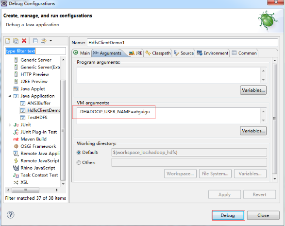

   客户端去操作HDFS时，是有一个用户身份的。默认情况下，HDFS客户端API会从JVM中获取一个参数来作为自己的用户身份：-DHADOOP_USER_NAME=atguigu，atguigu为用户名称

## 3.2 HDFS的API操作

### 3.2.1 HDFS文件上传（测试参数优先级）

1. 编写源代码

   ```java
   @Test
   public void testCopyFromLocalFile() throws IOException, InterruptedException, URISyntaxException {
   
   		// 1 获取文件系统
   		Configuration configuration = new Configuration();
   		configuration.set("dfs.replication", "2");
   		FileSystem fs = FileSystem.get(new URI("hdfs://hadoop102:9000"), configuration, "atguigu");
   
   		// 2 上传文件
   		fs.copyFromLocalFile(new Path("e:/banzhang.txt"), new Path("/banzhang.txt"));
   
   		// 3 关闭资源
   		fs.close();
   
   		System.out.println("over");
   }
   ```

2. 将hdfs-site.xml拷贝到项目的根目录下

   ```xml
   <?xml version="1.0" encoding="UTF-8"?>
   <?xml-stylesheet type="text/xsl" href="configuration.xsl"?>
   
   <configuration>
   	<property>
   		<name>dfs.replication</name>
           <value>1</value>
   	</property>
   </configuration>
   ```

3. 参数优先级

   参数优先级排序：（1）客户端代码中设置的值 >（2）ClassPath下的用户自定义配置文件 >（3）然后是服务器的默认配置

### 3.2.2 HDFS文件下载

```java
@Test
public void testCopyToLocalFile() throws IOException, InterruptedException, URISyntaxException{

		// 1 获取文件系统
		Configuration configuration = new Configuration();
		FileSystem fs = FileSystem.get(new URI("hdfs://hadoop102:9000"), configuration, "atguigu");
		
		// 2 执行下载操作
		// boolean delSrc 指是否将原文件删除
		// Path src 指要下载的文件路径
		// Path dst 指将文件下载到的路径
		// boolean useRawLocalFileSystem 是否开启文件校验
		fs.copyToLocalFile(false, new Path("/banzhang.txt"), new Path("e:/banhua.txt"), true);
		
		// 3 关闭资源
		fs.close();
}
```

### 3.2.3 HDFS文件夹删除

```java
@Test
public void testDelete() throws IOException, InterruptedException, URISyntaxException{

	// 1 获取文件系统
	Configuration configuration = new Configuration();
	FileSystem fs = FileSystem.get(new URI("hdfs://hadoop102:9000"), configuration, "atguigu");
		
	// 2 执行删除
	fs.delete(new Path("/0508/"), true);
		
	// 3 关闭资源
	fs.close();
}
```

### 3.2.4 HDFS文件名更改

```java
@Test
public void testRename() throws IOException, InterruptedException, URISyntaxException{

	// 1 获取文件系统
	Configuration configuration = new Configuration();
	FileSystem fs = FileSystem.get(new URI("hdfs://hadoop102:9000"), configuration, "atguigu"); 
		
	// 2 修改文件名称
	fs.rename(new Path("/banzhang.txt"), new Path("/banhua.txt"));
		
	// 3 关闭资源
	fs.close();
}
```

### 3.2.5 HDFS文件详情查看

查看文件名称、权限、长度、块信息

```java
@Test
public void testListFiles() throws IOException, InterruptedException, URISyntaxException{

	// 1获取文件系统
	Configuration configuration = new Configuration();
	FileSystem fs = FileSystem.get(new URI("hdfs://hadoop102:9000"), configuration, "atguigu"); 
		
	// 2 获取文件详情
	RemoteIterator<LocatedFileStatus> listFiles = fs.listFiles(new Path("/"), true);
		
	while(listFiles.hasNext()){
		LocatedFileStatus status = listFiles.next();
			
		// 输出详情
		// 文件名称
		System.out.println(status.getPath().getName());
		// 长度
		System.out.println(status.getLen());
		// 权限
		System.out.println(status.getPermission());
		// 分组
		System.out.println(status.getGroup());
			
		// 获取存储的块信息
		BlockLocation[] blockLocations = status.getBlockLocations();
			
		for (BlockLocation blockLocation : blockLocations) {
				
			// 获取块存储的主机节点
			String[] hosts = blockLocation.getHosts();
				
			for (String host : hosts) {
				System.out.println(host);
			}
		}
			
		System.out.println("-----------班长的分割线----------");
	}

// 3 关闭资源
fs.close();
}
```

### 3.2.6 HDFS文件和文件夹判断

```java
@Test
public void testListStatus() throws IOException, InterruptedException, URISyntaxException{
		
	// 1 获取文件配置信息
	Configuration configuration = new Configuration();
	FileSystem fs = FileSystem.get(new URI("hdfs://hadoop102:9000"), configuration, "atguigu");
		
	// 2 判断是文件还是文件夹
	FileStatus[] listStatus = fs.listStatus(new Path("/"));
		
	for (FileStatus fileStatus : listStatus) {
		
		// 如果是文件
		if (fileStatus.isFile()) {
				System.out.println("f:"+fileStatus.getPath().getName());
			}else {
				System.out.println("d:"+fileStatus.getPath().getName());
			}
		}
		
	// 3 关闭资源
	fs.close();
}
```

## 3.3 HDFS的I/O流操作

上面我们学的API操作HDFS系统都是框架封装好的。那么如果我们想自己实现上述API的操作该怎么实现呢？

我们可以采用IO流的方式实现数据的上传和下载。

### 3.3.1 HDFS文件上传

1. 需求：把本地e盘上的banhua.txt文件上传到HDFS根目录

2. 编写代码

   ```java
   @Test
   public void putFileToHDFS() throws IOException, InterruptedException, URISyntaxException {
   
   	// 1 获取文件系统
   	Configuration configuration = new Configuration();
   	FileSystem fs = FileSystem.get(new URI("hdfs://hadoop102:9000"), configuration, "atguigu");
   
   	// 2 创建输入流
   	FileInputStream fis = new FileInputStream(new File("e:/banhua.txt"));
   
   	// 3 获取输出流
   	FSDataOutputStream fos = fs.create(new Path("/banhua.txt"));
   
   	// 4 流对拷
   	IOUtils.copyBytes(fis, fos, configuration);
   
   	// 5 关闭资源
   	IOUtils.closeStream(fos);
   	IOUtils.closeStream(fis);
       fs.close();
   }
   ```

### 3.3.2 HDFS文件下载

1. 需求：从HDFS上下载banhua.txt文件到本地e盘上

2. 编写代码

   ```java
   // 文件下载
   @Test
   public void getFileFromHDFS() throws IOException, InterruptedException, URISyntaxException{
   
   	// 1 获取文件系统
   	Configuration configuration = new Configuration();
   	FileSystem fs = FileSystem.get(new URI("hdfs://hadoop102:9000"), configuration, "atguigu");
   		
   	// 2 获取输入流
   	FSDataInputStream fis = fs.open(new Path("/banhua.txt"));
   		
   	// 3 获取输出流
   	FileOutputStream fos = new FileOutputStream(new File("e:/banhua.txt"));
   		
   	// 4 流的对拷
   	IOUtils.copyBytes(fis, fos, configuration);
   		
   	// 5 关闭资源
   	IOUtils.closeStream(fos);
   	IOUtils.closeStream(fis);
   	fs.close();
   }
   ```

### 3.3.3 定位文件读取

1. 需求：分块读取HDFS上的大文件，比如根目录下的/hadoop-2.7.2.tar.gz

2. 编写代码
   （1）下载第一块

   ```java
   @Test
   public void readFileSeek1() throws IOException, InterruptedException, URISyntaxException{
   
   	// 1 获取文件系统
   	Configuration configuration = new Configuration();
   	FileSystem fs = FileSystem.get(new URI("hdfs://hadoop102:9000"), configuration, "atguigu");
   		
   	// 2 获取输入流
   	FSDataInputStream fis = fs.open(new Path("/hadoop-2.7.2.tar.gz"));
   		
   	// 3 创建输出流
   	FileOutputStream fos = new FileOutputStream(new File("e:/hadoop-2.7.2.tar.gz.part1"));
   		
   	// 4 流的拷贝
   	byte[] buf = new byte[1024];
   		
   	for(int i =0 ; i < 1024 * 128; i++){
   		fis.read(buf);
   		fos.write(buf);
   	}
   		
   	// 5关闭资源
   	IOUtils.closeStream(fis);
   	IOUtils.closeStream(fos);
   fs.close();
   }
   ```

   （2）下载第二块

   ```java
   @Test
   public void readFileSeek2() throws IOException, InterruptedException, URISyntaxException{
   
   	// 1 获取文件系统
   	Configuration configuration = new Configuration();
   	FileSystem fs = FileSystem.get(new URI("hdfs://hadoop102:9000"), configuration, "atguigu");
   		
   	// 2 打开输入流
   	FSDataInputStream fis = fs.open(new Path("/hadoop-2.7.2.tar.gz"));
   		
   	// 3 定位输入数据位置
   	fis.seek(1024*1024*128);
     // 4 创建输出流
   	FileOutputStream fos = new FileOutputStream(new File("e:/hadoop-2.7.2.tar.gz.part2"));
   		
   	// 5 流的对拷
   	IOUtils.copyBytes(fis, fos, configuration);
   		
   	// 6 关闭资源
   	IOUtils.closeStream(fis);
   	IOUtils.closeStream(fos);
   }
   ```

   （3）合并文件

   在Window命令窗口中进入到目录E:\，然后执行如下命令，对数据进行合并

   type hadoop-2.7.2.tar.gz.part2 >> hadoop-2.7.2.tar.gz.part1

   合并完成后，将hadoop-2.7.2.tar.gz.part1重新命名为hadoop-2.7.2.tar.gz。解压发现该tar包非常完整


# 4. HDFS的数据流（面试重点）

## 4.1 HDFS写数据流程

### 4.1.1 剖析文件写入

HDFS写数据流程如下图所示

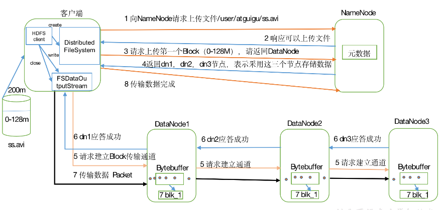

1）客户端通过Distributed FileSystem模块向NameNode请求上传文件，NameNode检查目标文件是否已存在，父目录是否存在

2）NameNode返回是否可以上传

3）客户端请求第一个 Block上传到哪几个DataNode服务器上

4）NameNode返回3个DataNode节点，分别为dn1、dn2、dn3

5）客户端通过FSDataOutputStream模块请求dn1上传数据，dn1收到请求会继续调用dn2，然后dn2调用dn3，将这个通信管道建立完成

6）dn1、dn2、dn3逐级应答客户端

7）客户端开始往dn1上传第一个Block（先从磁盘读取数据放到一个本地内存缓存），以Packet为单位，dn1收到一个Packet就会传给dn2，dn2传给dn3；dn1每传一个packet会放入一个应答队列等待应答

8）当一个Block传输完成之后，客户端再次请求NameNode上传第二个Block的服务器。（重复执行3-7步）

### 4.1.2 网络拓扑-节点距离计算

在HDFS写数据的过程中，NameNode会选择距离待上传数据最近距离的DataNode接收数据。那么这个最近距离怎么计算呢？

节点距离：两个节点到达最近的共同祖先的距离总和


例如，假设有数据中心d1机架r1中的节点n1。该节点可以表示为/d1/r1/n1。利用这种标记，这里给出四种距离描述,如上图所示

### 4.1.3 机架感知（副本存储节点选择）

1. 官方ip地址
   机架感知说明
   http://hadoop.apache.org/docs/r2.7.2/hadoop-project-dist/hadoop-hdfs/HdfsDesign.html#Data_Replication

   ```bash
   For the common case, when the replication factor is three, HDFS’s placement policy is to put one replica on one node in the local rack, another on a different node in the local rack, and the last on a different node in a different rack.
   ```

2. Hadoop2.7.2副本节点选择

   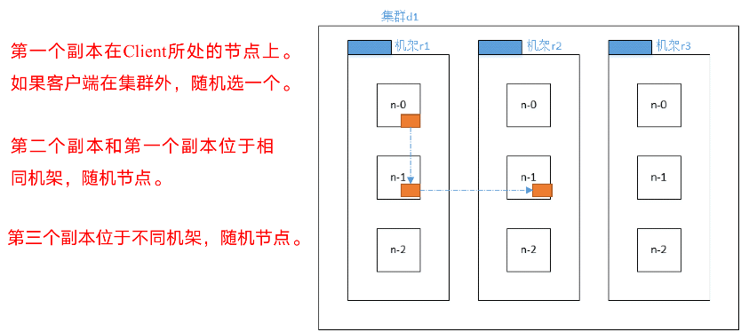

## 4.2 HDFS读数据流程

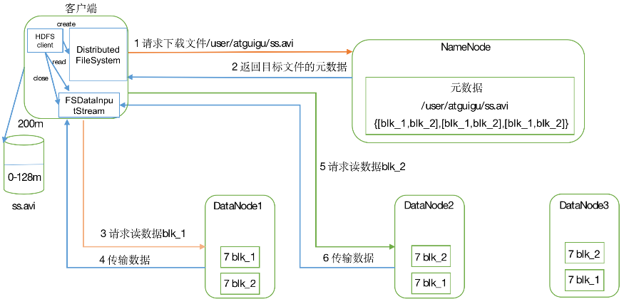

1）客户端通过Distributed FileSystem向NameNode请求下载文件，NameNode通过查询元数据，找到文件块所在的DataNode地址

2）挑选一台DataNode（就近原则，然后随机）服务器，请求读取数据。

3）DataNode开始传输数据给客户端（从磁盘里面读取数据输入流，以Packet为单位来做校验）。

4）客户端以Packet为单位接收，先在本地缓存，然后写入目标文件。

# 5. NameNode和SecondaryNameNode（面试开发重点）

## 5.1 NN和2NN工作机制

思考：NameNode中的元数据是存储在哪里的？

​		首先，我们做个假设，如果存储在NameNode节点的磁盘中，因为经常需要进行随机访问，还有响应客户请求，必然是效率过低。因此，元数据需要存放在内存中。但如果只存在内存中，一旦断电，元数据丢失，整个集群就无法工作了。因此产生在磁盘中备份元数据的FsImage。

​		这样又会带来新的问题，当在内存中的元数据更新时，如果同时更新FsImage，就会导致效率过低，但如果不更新，就会发生一致性问题，一旦NameNode节点断电，就会产生数据丢失。因此，引入Edits文件(只进行追加操作，效率很高)。每当元数据有更新或者添加元数据时，修改内存中的元数据并追加到Edits中。这样，一旦NameNode节点断电，可以通过FsImage和Edits的合并，合成元数据。

​		但是，如果长时间添加数据到Edits中，会导致该文件数据过大，效率降低，而且一旦断电，恢复元数据需要的时间过长。因此，需要定期进行FsImage和Edits的合并，如果这个操作由NameNode节点完成，又会效率过低。因此，引入一个新的节点SecondaryNamenode，专门用于FsImage和Edits的合并。

​		NN和2NN工作机制如下图所示

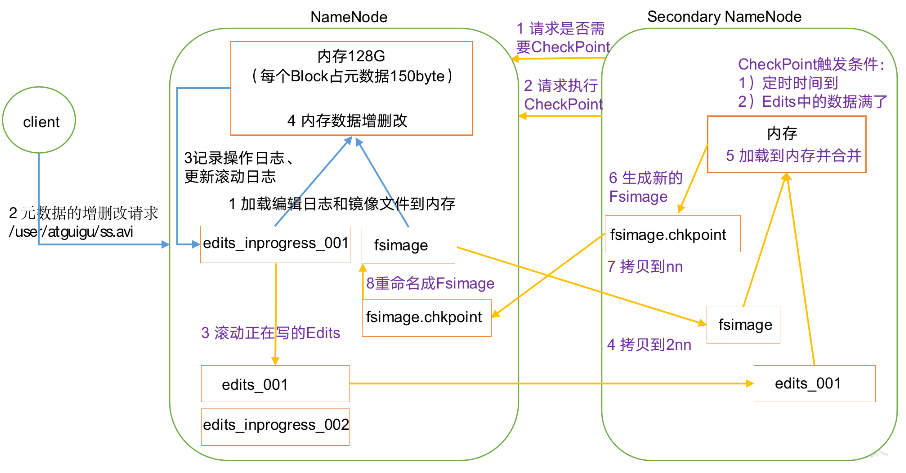

1. 第一阶段：NameNode启动

   （1）第一次启动NameNode格式化后，创建Fsimage和Edits文件。如果不是第一次启动，直接加载编辑日志和镜像文件到内存。

   （2）客户端对元数据进行增删改的请求。

   （3）NameNode记录操作日志，更新滚动日志。

   （4）NameNode在内存中对数据进行增删改。

2. 第二阶段：Secondary NameNode工作

   （1）Secondary NameNode询问NameNode是否需要CheckPoint。直接带回NameNode是否检查结果

   （2）Secondary NameNode请求执行CheckPoint。

   （3）NameNode滚动正在写的Edits日志。

   （4）将滚动前的编辑日志和镜像文件拷贝到Secondary NameNode。

   （5）Secondary NameNode加载编辑日志和镜像文件到内存，并合并。

   （6）生成新的镜像文件fsimage.chkpoint。

   （7）拷贝fsimage.chkpoint到NameNode。

   （8）NameNode将fsimage.chkpoint重新命名成fsimage。

   NN和2NN工作机制详解：

   Fsimage：NameNode内存中元数据序列化后形成的文件。

   Edits：记录客户端更新元数据信息的每一步操作（可通过Edits运算出元数据）。

   NameNode启动时，先滚动Edits并生成一个空的edits.inprogress，然后加载Edits和Fsimage到内存中，此时NameNode内存就持有最新的元数据信息。Client开始对NameNode发送元数据的增删改的请求，这些请求的操作首先会被记录到edits.inprogress中（查询元数据的操作不会被记录在Edits中，因为查询操作不会更改元数据信息），如果此时NameNode挂掉，重启后会从Edits中读取元数据的信息。然后，NameNode会在内存中执行元数据的增删改的操作。

   由于Edits中记录的操作会越来越多，Edits文件会越来越大，导致NameNode在启动加载Edits时会很慢，所以需要对Edits和Fsimage进行合并（所谓合并，就是将Edits和Fsimage加载到内存中，照着Edits中的操作一步步执行，最终形成新的Fsimage）。SecondaryNameNode的作用就是帮助NameNode进行Edits和Fsimage的合并工作。

   SecondaryNameNode首先会询问NameNode是否需要CheckPoint（触发CheckPoint需要满足两个条件中的任意一个，定时时间到和Edits中数据写满了）。直接带回NameNode是否检查结果。SecondaryNameNode执行CheckPoint操作，首先会让NameNode滚动Edits并生成一个空的edits.inprogress，滚动Edits的目的是给Edits打个标记，以后所有新的操作都写入edits.inprogress，其他未合并的Edits和Fsimage会拷贝到SecondaryNameNode的本地，然后将拷贝的Edits和Fsimage加载到内存中进行合并，生成fsimage.chkpoint，然后将fsimage.chkpoint拷贝给NameNode，重命名为Fsimage后替换掉原来的Fsimage。NameNode在启动时就只需要加载之前未合并的Edits和Fsimage即可，因为合并过的Edits中的元数据信息已经被记录在Fsimage中。

## 5.2 Fsimage和Edits解析

1. 概念
   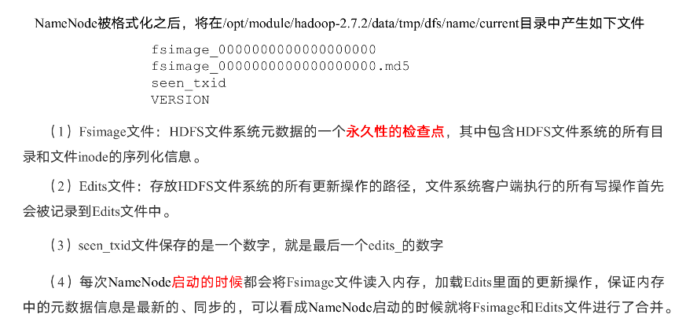

2. oiv查看Fsimage文件

   （1）查看oiv和oev命令

   ```bash
   [atguigu@hadoop102 current]$ hdfs
   oiv            apply the offline fsimage viewer to an fsimage
   oev            apply the offline edits viewer to an edits file
   ```

   （2）基本语法

   ```bash
   hdfs oiv -p 文件类型 -i镜像文件 -o 转换后文件输出路径
   ```

   （3）案例实操

   ```bash
   [atguigu@hadoop102 current]$ pwd
   /opt/module/hadoop-2.7.2/data/tmp/dfs/name/current
   
   [atguigu@hadoop102 current]$ hdfs oiv -p XML -i fsimage_0000000000000000025 -o /opt/module/hadoop-2.7.2/fsimage.xml
   
   [atguigu@hadoop102 current]$ cat /opt/module/hadoop-2.7.2/fsimage.xml
   ```

   将显示的xml文件内容拷贝到Eclipse中创建的xml文件中，并格式化。部分显示结果如下。

   ```xml
   <inode>
   	<id>16386</id>
   	<type>DIRECTORY</type>
   	<name>user</name>
   	<mtime>1512722284477</mtime>
   	<permission>atguigu:supergroup:rwxr-xr-x</permission>
   	<nsquota>-1</nsquota>
   	<dsquota>-1</dsquota>
   </inode>
   <inode>
   	<id>16387</id>
   	<type>DIRECTORY</type>
   	<name>atguigu</name>
   	<mtime>1512790549080</mtime>
   	<permission>atguigu:supergroup:rwxr-xr-x</permission>
   	<nsquota>-1</nsquota>
   	<dsquota>-1</dsquota>
   </inode>
   <inode>
   	<id>16389</id>
   	<type>FILE</type>
   	<name>wc.input</name>
   	<replication>3</replication>
   	<mtime>1512722322219</mtime>
   	<atime>1512722321610</atime>
   	<perferredBlockSize>134217728</perferredBlockSize>
   	<permission>atguigu:supergroup:rw-r--r--</permission>
   	<blocks>
   		<block>
   			<id>1073741825</id>
   			<genstamp>1001</genstamp>
   			<numBytes>59</numBytes>
   		</block>
   	</blocks>
   </inode >
   ```

   思考：可以看出，Fsimage中没有记录块所对应DataNode，为什么？

   在集群启动后，要求DataNode上报数据块信息，并间隔一段时间后再次上报。

3. oev查看Edits文件

   （1）基本语法

   ```bash
   hdfs oev -p 文件类型 -i编辑日志 -o 转换后文件输出路径
   ```

   （2）案例实操

   ```bash
   [atguigu@hadoop102 current]$ hdfs oev -p XML -i edits_0000000000000000012-0000000000000000013 -o /opt/module/hadoop-2.7.2/edits.xml
   
   [atguigu@hadoop102 current]$ cat /opt/module/hadoop-2.7.2/edits.xml
   ```

   将显示的xml文件内容拷贝到Eclipse中创建的xml文件中，并格式化。显示结果如下

   ```xml
   <?xml version="1.0" encoding="UTF-8"?>
   <EDITS>
   	<EDITS_VERSION>-63</EDITS_VERSION>
   	<RECORD>
   		<OPCODE>OP_START_LOG_SEGMENT</OPCODE>
   		<DATA>
   			<TXID>129</TXID>
   		</DATA>
   	</RECORD>
     <RECORD>
   		<OPCODE>OP_ADD</OPCODE>
   		<DATA>
   			<TXID>130</TXID>
   			<LENGTH>0</LENGTH>
   			<INODEID>16407</INODEID>
   			<PATH>/hello7.txt</PATH>
   			<REPLICATION>2</REPLICATION>
   			<MTIME>1512943607866</MTIME>
   			<ATIME>1512943607866</ATIME>
   			<BLOCKSIZE>134217728</BLOCKSIZE>
   			<CLIENT_NAME>DFSClient_NONMAPREDUCE_-1544295051_1</CLIENT_NAME>
   			<CLIENT_MACHINE>192.168.1.5</CLIENT_MACHINE>
   			<OVERWRITE>true</OVERWRITE>
   			<PERMISSION_STATUS>
   				<USERNAME>atguigu</USERNAME>
   				<GROUPNAME>supergroup</GROUPNAME>
   				<MODE>420</MODE>
   			</PERMISSION_STATUS>
   			<RPC_CLIENTID>908eafd4-9aec-4288-96f1-e8011d181561</RPC_CLIENTID>
   			<RPC_CALLID>0</RPC_CALLID>
   		</DATA>
   	</RECORD>
   	<RECORD>
   		<OPCODE>OP_ALLOCATE_BLOCK_ID</OPCODE>
   		<DATA>
   			<TXID>131</TXID>
   			<BLOCK_ID>1073741839</BLOCK_ID>
   		</DATA>
   	</RECORD>
   	<RECORD>
   		<OPCODE>OP_SET_GENSTAMP_V2</OPCODE>
   		<DATA>
   			<TXID>132</TXID>
   			<GENSTAMPV2>1016</GENSTAMPV2>
   		</DATA>
   	</RECORD>
   	<RECORD>
   		<OPCODE>OP_ADD_BLOCK</OPCODE>
   		<DATA>
   			<TXID>133</TXID>
   			<PATH>/hello7.txt</PATH>
   			<BLOCK>
   				<BLOCK_ID>1073741839</BLOCK_ID>
   				<NUM_BYTES>0</NUM_BYTES>
   				<GENSTAMP>1016</GENSTAMP>
   			</BLOCK>
   			<RPC_CLIENTID></RPC_CLIENTID>
   			<RPC_CALLID>-2</RPC_CALLID>
   		</DATA>
   	</RECORD>
   	<RECORD>
   		<OPCODE>OP_CLOSE</OPCODE>
   		<DATA>
         <TXID>134</TXID>
   			<LENGTH>0</LENGTH>
   			<INODEID>0</INODEID>
   			<PATH>/hello7.txt</PATH>
   			<REPLICATION>2</REPLICATION>
   			<MTIME>1512943608761</MTIME>
   			<ATIME>1512943607866</ATIME>
   			<BLOCKSIZE>134217728</BLOCKSIZE>
   			<CLIENT_NAME></CLIENT_NAME>
   			<CLIENT_MACHINE></CLIENT_MACHINE>
   			<OVERWRITE>false</OVERWRITE>
   			<BLOCK>
   				<BLOCK_ID>1073741839</BLOCK_ID>
   				<NUM_BYTES>25</NUM_BYTES>
   				<GENSTAMP>1016</GENSTAMP>
   			</BLOCK>
   			<PERMISSION_STATUS>
   				<USERNAME>atguigu</USERNAME>
   				<GROUPNAME>supergroup</GROUPNAME>
   				<MODE>420</MODE>
   			</PERMISSION_STATUS>
   		</DATA>
   	</RECORD>
   </EDITS >
   ```

   思考：NameNode如何确定下次开机启动的时候合并哪些Edits？

## 5.3 CheckPoint时间设置

   （1）通常情况下，SecondaryNameNode每隔一小时执行一次

   [hdfs-default.xml]

   ```xml
   <property>
     <name>dfs.namenode.checkpoint.period</name>
     <value>3600</value>
   </property>
   ```

   （2）一分钟检查一次操作次数，当操作次数达到1百万时，SecondaryNameNode执行一次。

   ```xml
   <property>
     <name>dfs.namenode.checkpoint.txns</name>
     <value>1000000</value>
   <description>操作动作次数</description>
   </property>
   
   <property>
     <name>dfs.namenode.checkpoint.check.period</name>
     <value>60</value>
   <description> 1分钟检查一次操作次数</description>
   </property >
   ```

## 5.4 NameNode故障处理

   NameNode故障后，可以采用如下两种方法恢复数据

   方法一：将SecondaryNameNode中数据拷贝到NameNode存储数据的目录

1. kill -9 NameNode进程

2. 删除NameNode存储的数据（/opt/module/hadoop-2.7.2/data/tmp/dfs/name）

   ```bash
   rm -rf /opt/module/hadoop-2.7.2/data/tmp/dfs/name/*
   ```

3. 拷贝SecondaryNameNode中数据到原NameNode存储数据目录

   ```bash
   scp -r atguigu@hadoop104:/opt/module/hadoop-2.7.2/data/tmp/dfs/namesecondary/* ./name/
   ```

4. 重新启动NameNode

   ```bash
   sbin/hadoop-daemon.sh start namenode
   ```

方法二：使用-importCheckpoint选项启动NameNode守护进程，从而将SecondaryNameNode中数据拷贝到NameNode目录中

1.  修改hdfs-site.xml

   ```xml
   <property>
     <name>dfs.namenode.checkpoint.period</name>
     <value>120</value>
   </property>
   
   <property>
     <name>dfs.namenode.name.dir</name>
     <value>/opt/module/hadoop-2.7.2/data/tmp/dfs/name</value>
   </property>
   ```

   

2. kill -9 NameNode进程

3. 删除NameNode存储的数据（/opt/module/hadoop-2.7.2/data/tmp/dfs/name）

   ```bash
   rm -rf /opt/module/hadoop-2.7.2/data/tmp/dfs/name/*
   ```

4. 如果SecondaryNameNode不和NameNode在一个主机节点上，需要将SecondaryNameNode存储数据的目录拷贝到NameNode存储数据的平级目录，并删除in_use.lock文件

   ```bash
   [atguigu@hadoop102 dfs]$ scp -r atguigu@hadoop104:/opt/module/hadoop-2.7.2/data/tmp/dfs/namesecondary ./
   
   [atguigu@hadoop102 namesecondary]$ rm -rf in_use.lock
   
   [atguigu@hadoop102 dfs]$ pwd
   /opt/module/hadoop-2.7.2/data/tmp/dfs
   
   [atguigu@hadoop102 dfs]$ ls
   data  name  namesecondary
   ```

5. 导入检查点数据（等待一会ctrl+c结束掉）

   ```bash
   bin/hdfs namenode -importCheckpoint
   ```

6. 启动NameNode

   ```bash
   sbin/hadoop-daemon.sh start namenode
   ```

   ## 5.5 集群安全模式

1. 概述

   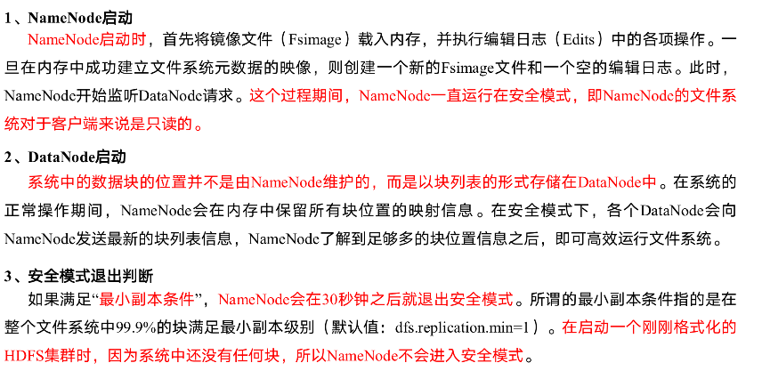

2. 基本语法
   集群处于安全模式，不能执行重要操作（写操作）。集群启动完成后，自动退出安全模式。

   （1）bin/hdfs dfsadmin -safemode get		（功能描述：查看安全模式状态）

   （2）bin/hdfs dfsadmin -safemode enter  （功能描述：进入安全模式状态）

   （3）bin/hdfs dfsadmin -safemode leave	（功能描述：离开安全模式状态）

   （4）bin/hdfs dfsadmin -safemode wait	（功能描述：等待安全模式状态）

3. 案例

   模拟等待安全模式

   （1）查看当前模式

