[TOC]

# 1. 大数据概论

## 1.1 大数据概念


## 1.2 大数据特点（4V）


## 1.3 大数据应用场景


## 1.4 大数据发展前景


## 1.5 大数据部门业务流程分析


## 1.6 大数据部门组织结构（重点）


# 2. 从Hadoop框架讨论大数据生态

## 2.1 Hadoop是什么


## 2.2 Hadoop发展历史


## 2.3 Hadoop三大发行版本

Hadoop三大发行版本：Apache、Cloudera、Hortonworks。

+ Apache版本最原始（最基础）的版本，对于入门学习最好。

+ Cloudera在大型互联网企业中用的较多。

+ Hortonworks文档较好

1. Apache Hadoop
   官网地址：http://hadoop.apache.org/releases.html

   下载地址：https://archive.apache.org/dist/hadoop/common/

2. Cloudera Hadoop
   官网地址：https://www.cloudera.com/downloads/cdh/5-10-0.html

   下载地址：http://archive-primary.cloudera.com/cdh5/cdh/5/

   + 2008年成立的Cloudera是最早将Hadoop商用的公司，为合作伙伴提供Hadoop的商用解决方案，主要是包括支持、咨询服务、培训。
   + 2009年Hadoop的创始人Doug Cutting也加盟Cloudera公司。Cloudera产品主要为CDH，Cloudera Manager，Cloudera Support
   + CDH是Cloudera的Hadoop发行版，完全开源，比Apache Hadoop在兼容性，安全性，稳定性上有所增强
   + Cloudera Manager是集群的软件分发及管理监控平台，可以在几个小时内部署好一个Hadoop集群，并对集群的节点及服务进行实时监控。Cloudera Support即是对Hadoop的技术支持。
   + Cloudera的标价为每年每个节点4000美元。Cloudera开发并贡献了可实时处理大数据的Impala项目。

3. Hortonworks Hadoop
   官网地址：https://hortonworks.com/products/data-center/hdp/

   下载地址：https://hortonworks.com/downloads/#data-platform

   + 2011年成立的Hortonworks是雅虎与硅谷风投公司Benchmark Capital合资组建
   + 公司成立之初就吸纳了大约25名至30名专门研究Hadoop的雅虎工程师，上述工程师均在2005年开始协助雅虎开发Hadoop，贡献了Hadoop80%的代码
   + 雅虎工程副总裁、雅虎Hadoop开发团队负责人Eric Baldeschwieler出任Hortonworks的首席执行官
   + Hortonworks的主打产品是Hortonworks Data Platform（HDP），也同样是100%开源的产品，HDP除常见的项目外还包括了Ambari，一款开源的安装和管理系统。
   + HCatalog，一个元数据管理系统，HCatalog现已集成到Facebook开源的Hive中。Hortonworks的Stinger开创性的极大的优化了Hive项目。Hortonworks为入门提供了一个非常好的，易于使用的沙盒。
   + Hortonworks开发了很多增强特性并提交至核心主干，这使得Apache Hadoop能够在包括Window Server和Windows Azure在内的Microsoft Windows平台上本地运行。定价以集群为基础，每10个节点每年为12500美元。

## 2.4 Hadoop的优势（4高）


## 2.5  Hadoop组成（面试重点）


### 2.5.1 HDFS架构概述

HDFS（Hadoop Distributed File System）的架构概述


### 2.5.2 YARN架构概述


### 2.5.3 MapReduce架构概述

MapReduce将计算过程分为两个阶段：Map和Reduce

+ Map阶段并行处理输入数据
+ Reduce阶段对Map结果进行汇总


## 2.6 大数据技术生态体系


图中涉及的技术名词解释如下:

+ Sqoop：Sqoop是一款开源的工具，主要用于在Hadoop、Hive与传统的数据库(MySql)间进行数据的传递，可以将一个关系型数据库（例如 ：MySQL，Oracle
+ Flume：Flume是Cloudera提供的一个高可用的，高可靠的，分布式的海量日志采集、聚合和传输的系统，Flume支持在日志系统中定制各类数据发送方，用于收集数据；同时，Flume提供对数据进行简单处理，并写到各种数据接受方（可定制）的能力。
+ Kafka：Kafka是一种高吞吐量的分布式发布订阅消息系统，有如下特性：
  + 通过O(1)的磁盘数据结构提供消息的持久化，这种结构对于即使数以TB的消息存储也能够保持长时间的稳定性能
  + 高吞吐量：即使是非常普通的硬件Kafka也可以支持每秒数百万的消息
  + 支持通过Kafka服务器和消费机集群来分区消息
  + 支持Hadoop并行数据加载
+ Storm：Storm用于“连续计算”，对数据流做连续查询，在计算时就将结果以流的形式输出给用户
+ Spark：Spark是当前最流行的开源大数据内存计算框架。可以基于Hadoop上存储的大数据进行计算
+ Oozie：Oozie是一个管理Hdoop作业（job）的工作流程调度管理系统
+ Hbase：HBase是一个分布式的、面向列的开源数据库。HBase不同于一般的关系数据库，它是一个适合于非结构化数据存储的数据库
+ Hive：Hive是基于Hadoop的一个数据仓库工具，可以将结构化的数据文件映射为一张数据库表，并提供简单的SQL查询功能，可以将SQL语句转换为MapReduce任务进行运行。 其优点是学习成本低，可以通过类SQL语句快速实现简单的MapReduce统计，不必开发专门的MapReduce应用，十分适合数据仓库的统计分析
+ R语言：R是用于统计分析、绘图的语言和操作环境。R是属于GNU系统的一个自由、免费、源代码开放的软件，它是一个用于统计计算和统计制图的优秀工具
+ Mahout：Apache Mahout是个可扩展的机器学习和数据挖掘库
+ ZooKeeper：Zookeeper是Google的Chubby一个开源的实现。它是一个针对大型分布式系统的可靠协调系统，提供的功能包括：配置维护、名字服务、 分布式同步、组服务等。ZooKeeper的目标就是封装好复杂易出错的关键服务，将简单易用的接口和性能高效、功能稳定的系统提供给用户。

## 2.7 推荐系统框架图


# 3.Hadoop运行环境搭建

## 3.1 虚拟机环境准备

1.	克隆虚拟机		

2.	修改克隆虚拟机的静态IP

3.	修改主机名

4.	关闭防火墙

5.	创建atguigu用户

6. 配置atguigu用户具有root权限

​            7．在/opt目录下创建文件夹


+ 在/opt目录下创建module、software文件夹
+ 在/opt目录下创建module、software文件夹

## 3.2 安装JDK

1. 卸载现有JDK

   + 查询是否安装Java软件

     ```shell
     rpm -qa | grep java
     ```

   + 如果安装的版本低于1.7，卸载该JDK：

     ```shell
     sudo rpm -e 软件包
     ```

   + 查看JDK安装路径

     ```shell
     which java
     ```

2. 上传jdk到linux

3. 解压JDK到/opt/module目录下

   ```shell
   tar -zxvf jdk-8u144-linux-x64.tar.gz -C /opt/module/
   ```

4. 配置JDK环境变量

   ```shell
   sudo vi /etc/profile
   #在文件末尾追加如下内容
   #JAVA_HOME
   export JAVA_HOME=/opt/module/jdk1.8.0_144
   export PATH=$PATH:$JAVA_HOME/bin
   ```

5. 让修改后的文件生效

   ```shell
   source /etc/profile
   ```

6. 测试JDK是否安装成功

   ```shell
   java -version
   ```

   如果上述命令不可用，重启下机器

## 3.3 安装Hadoop

1. Hadoop下载地址
   https://archive.apache.org/dist/hadoop/common/stable/

2. 上传安装文件到linux

3. 解压安装文件到/opt/module下面

4. 将Hadoop添加到环境变量

   ```shell
   sudo vi /etc/profile
   #在文件末尾追加以下内容
   ##HADOOP_HOME
   export HADOOP_HOME=/opt/module/hadoop-2.7.2
   export PATH=$PATH:$HADOOP_HOME/bin
   export PATH=$PATH:$HADOOP_HOME/sbin
   ```

   执行下面命令让配置文件生效

   ```shell
   source /etc/profile
   ```

5. 测试是否安装成功

   ```shell
   hadoop version
   ```

   如果上述命令不好使，重启下机器

## 3.4 Hadoop目录结构

1. 查看Hadoop目录结构

   ```shell
   总用量 52
   drwxr-xr-x. 2 atguigu atguigu  4096 5月  22 2017 bin
   drwxr-xr-x. 3 atguigu atguigu  4096 5月  22 2017 etc
   drwxr-xr-x. 2 atguigu atguigu  4096 5月  22 2017 include
   drwxr-xr-x. 3 atguigu atguigu  4096 5月  22 2017 lib
   drwxr-xr-x. 2 atguigu atguigu  4096 5月  22 2017 libexec
   -rw-r--r--. 1 atguigu atguigu 15429 5月  22 2017 LICENSE.txt
   -rw-r--r--. 1 atguigu atguigu   101 5月  22 2017 NOTICE.txt
   -rw-r--r--. 1 atguigu atguigu  1366 5月  22 2017 README.txt
   drwxr-xr-x. 2 atguigu atguigu  4096 5月  22 2017 sbin
   drwxr-xr-x. 4 atguigu atguigu  4096 5月  22 2017 share
   ```

2. 重要目录

   + bin目录：存放对Hadoop相关服务（HDFS,YARN）进行操作的脚本
   + etc目录：Hadoop的配置文件目录，存放Hadoop的配置文件
   + lib目录：存放Hadoop的本地库（对数据进行压缩解压缩功能）
   + sbin目录：存放启动或停止Hadoop相关服务的脚本
   + share目录：存放Hadoop的依赖jar包、文档、和官方案例

# 4.Hadoop运行模式

Hadoop运行模式包括：本地模式、伪分布式模式以及完全分布式模式。

Hadoop官方网站：http://hadoop.apache.org/

## 4.1 本地运行模式

### 4.1.1 官方Grep案例

1. 创建在hadoop-2.7.2文件下面创建一个input文件夹

   ```shell
   mkdir input
   ```

2. 将Hadoop的xml配置文件复制到input

   ```shell
   cp etc/hadoop/*.xml input
   ```

3. 执行share目录下的MapReduce程序

   ```shell
   bin/hadoop jar share/hadoop/mapreduce/hadoop-mapreduce-examples-2.7.2.jar grep input output 'dfs[a-z.]+'
   ```

4. 查看输出结果

   ```shell
   cat output/*
   ```

### 4.1.2 官方WordCount案例

1. 创建在hadoop-2.7.2文件下面创建一个wcinput文件夹

   ```shell
   mkdir wcinput
   ```

2. 在wcinput文件下创建一个wc.input文件

   ```shell
   cd wcinput
   touch wc.input
   ```

3. 编辑wc.input文件

   ```shell
   vi wc.input
   ```

   在文件中输入如下内容

   ```sql
   hadoop yarn
   hadoop mapreduce
   atguigu
   atguigu
   ```

   保存退出：:wq

4. 回到Hadoop目录/opt/module/hadoop-2.7.2

5. 执行程序

   ```shell
   hadoop jar
    share/hadoop/mapreduce/hadoop-mapreduce-examples-2.7.2.jar wordcount wcinput wcoutput
   ```

6. 查看结果

   ```shell
   cat wcoutput/part-r-00000
   atguigu 2
   hadoop  2
   mapreduce       1
   yarn    1
   ```

   

## 4.2 伪分布式运行模式

### 4.2.1 启动HDFS并运行MapReduce程序

1. 分析

   （1）配置集群

   （2）启动、测试集群增、删、查

   （3）执行WordCount案例

2. 执行步骤
   （1）配置集群

     （a）配置：hadoop-env.sh

   ​       Linux系统中获取JDK的安装路径

   ```shell
   echo $JAVA_HOME /opt/module/jdk1.8.0_144
   ```

   ​      修改JAVA_HOME 路径

   ```shell
   export JAVA_HOME=/opt/module/jdk1.8.0_144
   ```

   （b）配置：core-site.xml

   ```xml
   <!-- 指定HDFS中NameNode的地址 -->
   <property>
   <name>fs.defaultFS</name>
       <value>hdfs://hadoop101:9000</value>
   </property>
   
   <!-- 指定Hadoop运行时产生文件的存储目录 -->
   <property>
   	<name>hadoop.tmp.dir</name>
   	<value>/opt/module/hadoop-2.7.2/data/tmp</value>
   </property>
   ```

   （c）配置：hdfs-site.xml

   ```xml
   <!-- 指定HDFS副本的数量 -->
   <property>
   	<name>dfs.replication</name>
   	<value>1</value>
   </property>
   ```

   （2）启动集群

   （a）格式化NameNode（第一次启动时格式化，以后就不要总格式化）

   ```shell
   bin/hdfs namenode -format
   ```

   （b）启动NameNode

   ```shell
   sbin/hadoop-daemon.sh start namenode
   ```

   （c）启动DataNode

   ```shell
   sbin/hadoop-daemon.sh start datanode
   ```

   （3）查看集群

   （a）查看是否启动成功

   ```shell
   [atguigu@hadoop101 hadoop-2.7.2]$ jps
   13586 NameNode
   13668 DataNode
   13786 Jps
   ```

      注意：jps是JDK中的命令，不是Linux命令。不安装JDK不能使用jps

   （b）web端查看HDFS文件系统

   http://hadoop101:50070/dfshealth.html#tab-overview

   注意：如果不能查看，看如下帖子处理

   http://www.cnblogs.com/zlslch/p/6604189.html

   （c）查看产生的Log日志

   说明：在企业中遇到Bug时，经常根据日志提示信息去分析问题、解决Bug。

   当前目录：/opt/module/hadoop-2.7.2/logs

   ```shell
   [atguigu@hadoop101 logs]$ ls
   hadoop-atguigu-datanode-hadoop.atguigu.com.log
   hadoop-atguigu-datanode-hadoop.atguigu.com.out
   hadoop-atguigu-namenode-hadoop.atguigu.com.log
   hadoop-atguigu-namenode-hadoop.atguigu.com.out
   SecurityAuth-root.audit
   [atguigu@hadoop101 logs]# cat hadoop-atguigu-datanode-hadoop101.log
   ```

   

   （d）思考：为什么不能一直格式化NameNode，格式化NameNode，要注意什么？

   ```shell
   [atguigu@hadoop101 hadoop-2.7.2]$ cd data/tmp/dfs/name/current/
   [atguigu@hadoop101 current]$ cat VERSION
   clusterID=CID-f0330a58-36fa-4a2a-a65f-2688269b5837
   
   [atguigu@hadoop101 hadoop-2.7.2]$ cd data/tmp/dfs/data/current/
   clusterID=CID-f0330a58-36fa-4a2a-a65f-2688269b5837
   ```

   注意：格式化NameNode，会产生新的集群id,导致NameNode和DataNode的集群id不一致，集群找不到已往数据。所以，格式NameNode时，一定要先删除data数据和log日志，然后再格式化NameNode。

   

   （4）操作集群

   （a）在HDFS文件系统上创建一个input文件夹

   ```shell
   bin/hdfs dfs -mkdir -p /user/atguigu/input
   ```

   （b）将测试文件内容上传到文件系统上

   ```shell
   bin/hdfs dfs -put wcinput/wc.input  /user/atguigu/input/
   ```

   （c）查看上传的文件是否正确

   ```shell
   bin/hdfs dfs -ls  /user/atguigu/input/
   bin/hdfs dfs -cat  /user/atguigu/ input/wc.input
   ```

   （d）运行MapReduce程序

   ```shell
   bin/hadoop jar
   share/hadoop/mapreduce/hadoop-mapreduce-examples-2.7.2.jar wordcount /user/atguigu/input/ /user/atguigu/output
   ```

   （e）查看输出结果

   命令行查看：

   ```shell
   bin/hdfs dfs -cat /user/atguigu/output/*
   ```

   浏览器查看，如图2-34所示

   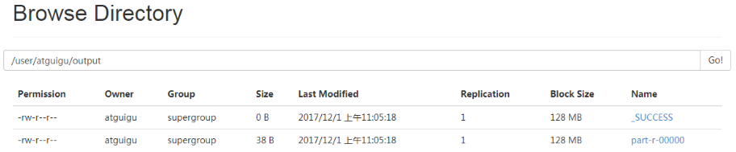

   （f）将测试文件内容下载到本地

   ```shell
   hdfs dfs -get /user/atguigu/output/part-r-00000 ./wcoutput/
   ```

   （g）删除输出结果

   ```shell
   hdfs dfs -rm -r /user/atguigu/output
   ```

### 4.2.2 启动YARN并运行MapReduce程序

1. 分析

   （1）配置集群在YARN上运行MR

   （2）启动、测试集群增、删、查

   （3）在YARN上执行WordCount案例

2. 执行步骤
   （1）配置集群

   （a）配置yarn-env.sh

     配置一下JAVA_HOME

   ```shell
   export JAVA_HOME=/opt/module/jdk1.8.0_144
   ```

   （b）配置yarn-site.xml

   ```xml
   <!-- Reducer获取数据的方式 -->
   <property>
    		<name>yarn.nodemanager.aux-services</name>
    		<value>mapreduce_shuffle</value>
   </property>
   
   <!-- 指定YARN的ResourceManager的地址 -->
   <property>
   <name>yarn.resourcemanager.hostname</name>
   <value>hadoop101</value>
   </property>
   ```

   （c）配置：mapred-env.sh

   ​         配置一下JAVA_HOME

   ```shell
   export JAVA_HOME=/opt/module/jdk1.8.0_144
   ```

   （d）配置： (对mapred-site.xml.template重新命名为) mapred-site.xml

   ```shell
   mv mapred-site.xml.template mapred-site.xml
   vi mapred-site.xml
   ```

   ```xml
   <!-- 指定MR运行在YARN上 -->
   <property>
   		<name>mapreduce.framework.name</name>
   		<value>yarn</value>
   </property>
   ```

   （2）启动集群

   （a）启动前必须保证NameNode和DataNode已经启动

   （b）启动ResourceManager

   ```shell
   sbin/yarn-daemon.sh start resourcemanager
   ```

   （c）启动NodeManager

   ```shell
   sbin/yarn-daemon.sh start nodemanager
   ```

   （3）集群操作

   （a）YARN的浏览器页面查看

   http://hadoop101:8088/cluster

   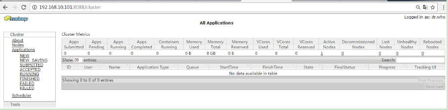

   （b）删除文件系统上的output文件

   ```shell
   bin/hdfs dfs -rm -R /user/atguigu/output
   ```

   （c）执行MapReduce程序

   ```shell
   bin/hadoop jar
    share/hadoop/mapreduce/hadoop-mapreduce-examples-2.7.2.jar wordcount /user/atguigu/input  /user/atguigu/output
   ```

   （d）查看运行结果

   ```shell
   bin/hdfs dfs -cat /user/atguigu/output/*
   ```

   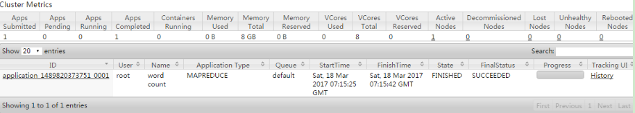

### 4.2.3 配置历史服务器

为了查看程序的历史运行情况，需要配置一下历史服务器。具体配置步骤如下：

1. 配置mapred-site.xml

   ```xml
   vi mapred-site.xml
   ```

   在该文件里面增加如下配置。

   ```xml
   <!-- 历史服务器端地址 -->
   <property>
   <name>mapreduce.jobhistory.address</name>
   <value>hadoop101:10020</value>
   </property>
   <!-- 历史服务器web端地址 -->
   <property>
       <name>mapreduce.jobhistory.webapp.address</name>
       <value>hadoop101:19888</value>
   </property>
   ```

2. 启动历史服务器

   ```shell
   sbin/mr-jobhistory-daemon.sh start historyserver
   ```

3. 查看历史服务器是否启动

   ```shell
   jps
   ```

4. 查看JobHistory

   http://hadoop101:19888/jobhistory

### 4.2.4 配置日志的聚集

日志聚集概念：应用运行完成以后，将程序运行日志信息上传到HDFS系统上。

日志聚集功能好处：可以方便的查看到程序运行详情，方便开发调试

注意：开启日志聚集功能，需要重新启动NodeManager 、ResourceManager和HistoryManager。

开启日志聚集功能具体步骤如下：

1. 配置yarn-site.xml

   ```shell
   vi yarn-site.xml
   ```

   在该文件里面增加如下配置。

   ```xml
   <!-- 日志聚集功能使能 -->
   <property>
     <name>yarn.log-aggregation-enable</name>
   <value>true</value>
   </property>
   
   <!-- 日志保留时间设置7天 -->
   <property>
   <name>yarn.log-aggregation.retain-seconds</name>
   <value>604800</value>
   </property>
   ```

2. 关闭NodeManager 、ResourceManager和HistoryManager

   ```shell
   sbin/yarn-daemon.sh stop resourcemanager
   sbin/yarn-daemon.sh stop nodemanager
   sbin/mr-jobhistory-daemon.sh stop historyserver
   ```

3. 启动NodeManager 、ResourceManager和HistoryManager

   ```shell
   sbin/yarn-daemon.sh start resourcemanager
   sbin/yarn-daemon.sh start nodemanager
   sbin/mr-jobhistory-daemon.sh start historyserver
   ```

4.  删除HDFS上已经存在的输出文件

   ```shell
   bin/hdfs dfs -rm -R /user/atguigu/output
   ```

   

5. 执行WordCount程序

   ```shell
   hadoop jar
    share/hadoop/mapreduce/hadoop-mapreduce-examples-2.7.2.jar wordcount /user/atguigu/input /user/atguigu/output
   ```

   

6. 查看日志

   http://hadoop101:19888/jobhistory

   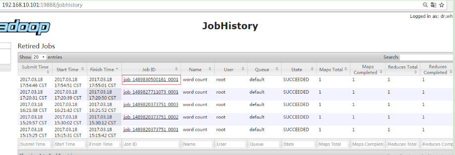

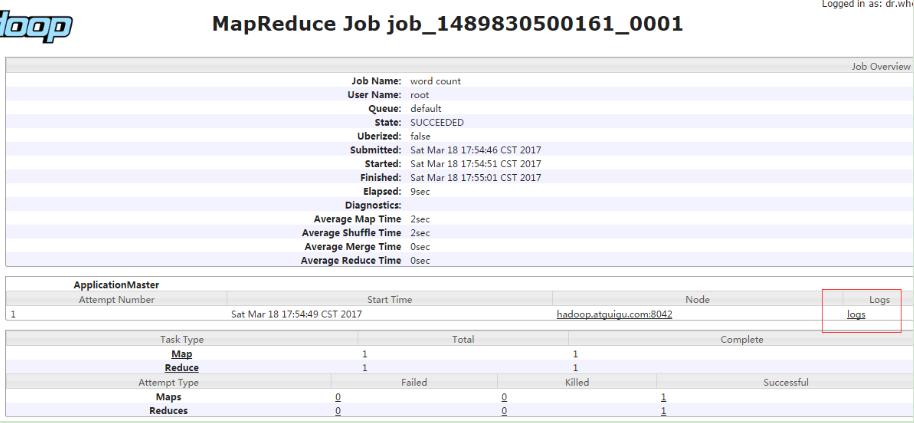   

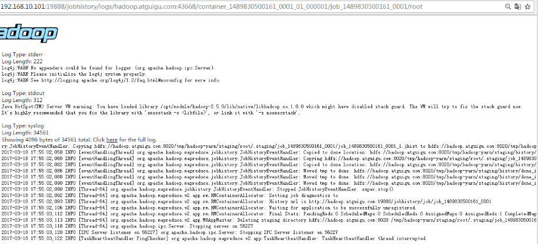

### 4.2.5 配置文件说明

Hadoop配置文件分两类：默认配置文件和自定义配置文件，只有用户想修改某一默认配置值时，才需要修改自定义配置文件，更改相应属性值

（1）默认配置文件:

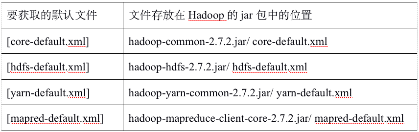

（2）自定义配置文件

core-site.xml、hdfs-site.xml、yarn-site.xml、mapred-site.xml四个配置文件存放在$HADOOP_HOME/etc/hadoop这个路径上，用户可以根据项目需求重新进行修改配置。


## 4.3 完全分布式运行模式（开发重点）

分析：

​	1）准备3台客户机（关闭防火墙、静态ip、主机名称）

​	2）安装JDK

​	3）配置环境变量

​	4）安装Hadoop

​	5）配置环境变量

​    6）配置集群

​    7）单点启动

​	8）配置ssh

​	9）群起并测试集群

### 4.3.1 虚拟机准备

### 4.3.2 编写集群分发脚本xsync

1. scp（secure copy）安全拷贝

   （1）scp定义：

   scp可以实现服务器与服务器之间的数据拷贝。（from server1 to server2）

   （2）基本语法

   scp  -r      $pdir/$fname        $user@hadoop$host:$pdir/$fname

   命令  递归    要拷贝的文件路径/名称   目的用户@主机:目的路径/名称

   （3）案例实操

   ​	（a）在hadoop101上，将hadoop101中/opt/module目录下的软件拷贝到hadoop102上。

   ```shell
   scp -r /opt/module  root@hadoop102:/opt/module
   ```

   ​	（b）在hadoop103上，将hadoop101服务器上的/opt/module目录下的软件拷贝到hadoop103上。

   ```shell
   sudo scp -r atguigu@hadoop101:/opt/module root@hadoop103:/opt/module
   ```

      （c）在hadoop103上操作将hadoop101中/opt/module目录下的软件拷贝到hadoop104上。

   ```shell
   scp -r atguigu@hadoop101:/opt/module root@hadoop104:/opt/module
   ```

   注意：拷贝过来的/opt/module目录，别忘了在hadoop102、hadoop103、hadoop104上修改所有文件的，所有者和所有者组。sudo chown atguigu:atguigu -R /opt/module

   ​	（d）将hadoop101中/etc/profile文件拷贝到hadoop102的/etc/profile上。

   ```shell
   sudo scp /etc/profile root@hadoop102:/etc/profile
   ```

   ​	（e）将hadoop101中/etc/profile文件拷贝到hadoop103的/etc/profile上。

   ```shell
   sudo scp /etc/profile root@hadoop103:/etc/profile
   ```

   ​	（f）将hadoop101中/etc/profile文件拷贝到hadoop104的/etc/profile上

   ```shell
   sudo scp /etc/profile root@hadoop104:/etc/profile
   ```

   注意：拷贝过来的配置文件别忘了source一下/etc/profile。

   

2. rsync 远程同步工具

   rsync主要用于备份和镜像。具有速度快、避免复制相同内容和支持符号链接的优点。

   rsync和scp区别：用rsync做文件的复制要比scp的速度快，rsync只对差异文件做更新。scp是把所有文件都复制过去。

   （1）基本语法

   rsync   -rvl    $pdir/$fname        $user@hadoop$host:$pdir/$fname

   命令  选项参数  要拷贝的文件路径/名称   目的用户@主机:目的路径/名称

   ​	 选项参数说明

   

   （2）案例实操

   把hadoop101机器上的/opt/software目录同步到hadoop102服务器的root用户下的/opt/目录

   ```shell
   rsync -rvl /opt/software/ root@hadoop102:/opt/software
   ```

   

3. xsync集群分发脚本

   （1）需求：循环复制文件到所有节点的相同目录下

   （2）需求分析：

   ​	（a）rsync命令原始拷贝：

   ```shell
   rsync  -rvl     /opt/module  		 root@hadoop103:/opt/
   ```

   ​	（b）期望脚本：

   ```shell
   xsync 要同步的文件名称
   ```

   ​	（c）说明：在/home/atguigu/bin这个目录下存放的脚本，atguigu用户可以在系统任何地方直接执行。

   （3）脚本实现

   ​	（a）在/home/atguigu目录下创建bin目录，并在bin目录下xsync创建文件，文件内容如下：

   ```shell
   mkdir bin
   cd bin/
   touch xsync
   vi xsync
   ```

   在该文件中编写如下代码

   ```shell
   #!/bin/bash
   #1 获取输入参数个数，如果没有参数，直接退出
   pcount=$#
   if((pcount==0)); then
   echo no args;
   exit;
   fi
   
   #2 获取文件名称
   p1=$1
   fname=`basename $p1`
   echo fname=$fname
   
   #3 获取上级目录到绝对路径
   pdir=`cd -P $(dirname $p1); pwd`
   echo pdir=$pdir
   
   #4 获取当前用户名称
   user=`whoami`
   
   #5 循环
   for((host=103; host<105; host++)); do
           echo ------------------- hadoop$host --------------
           rsync -rvl $pdir/$fname $user@hadoop$host:$pdir
   done
   ```

   ​	（b）修改脚本 xsync 具有执行权限

   ```shell
   chmod 777 xsync
   ```

   ​	（c）调用脚本形式：xsync 文件名称

   ```shell
   xsync /home/atguigu/bin
   ```

   注意：如果将xsync放到/home/atguigu/bin目录下仍然不能实现全局使用，可以将xsync移动到/usr/local/bin目录下。

   

### 4.3.3 集群配置

1. 集群部署规划
   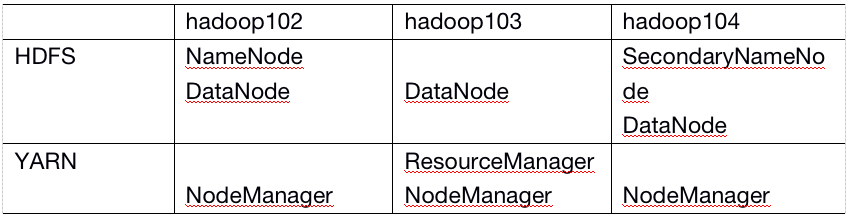

2. 配置集群
   （1）核心配置文件

   配置core-site.xml

   ```shell
   vi core-site.xml
   ```

   在该文件中编写如下配置

   ```xml
   <!-- 指定HDFS中NameNode的地址 -->
   <property>
   		<name>fs.defaultFS</name>
         <value>hdfs://hadoop102:9000</value>
   </property>
   
   <!-- 指定Hadoop运行时产生文件的存储目录 -->
   <property>
   		<name>hadoop.tmp.dir</name>
   		<value>/opt/module/hadoop-2.7.2/data/tmp</value>
   </property>
   ```

   （2）HDFS配置文件

   配置hadoop-env.sh

   ```shell
   vi hadoop-env.sh export JAVA_HOME=/opt/module/jdk1.8.0_144
   ```

   配置hdfs-site.xml

   ```shell
   vi hdfs-site.xml
   ```

   在该文件中编写如下配置

   ```xml
   <property>
   		<name>dfs.replication</name>
   		<value>3</value>
   </property>
   
   <!-- 指定Hadoop辅助名称节点主机配置 -->
   <property>
         <name>dfs.namenode.secondary.http-address</name>
      <value>hadoop104:50090</value>
   </property>
   ```

   （3）YARN配置文件

   配置yarn-env.sh

   ```shell
   vi yarn-env.sh export JAVA_HOME=/opt/module/jdk1.8.0_144
   ```

   配置yarn-site.xml

   ```shell
   vi yarn-site.xml
   ```

   在该文件中增加如下配置

   ```xml
   <!-- Reducer获取数据的方式 -->
   <property>
   		<name>yarn.nodemanager.aux-services</name>
   		<value>mapreduce_shuffle</value>
   </property>
   
   <!-- 指定YARN的ResourceManager的地址 -->
   <property>
   		<name>yarn.resourcemanager.hostname</name>
   		<value>hadoop103</value>
   </property>
   ```

   （4）MapReduce配置文件

   配置mapred-env.sh

   ```shell
   vi mapred-env.sh export JAVA_HOME=/opt/module/jdk1.8.0_144
   ```

   配置mapred-site.xml

   ```shell
   cp mapred-site.xml.template mapred-site.xml
   vi mapred-site.xml
   ```

   在该文件中增加如下配置

   ```xml
   <!-- 指定MR运行在Yarn上 -->
   <property>
   		<name>mapreduce.framework.name</name>
   		<value>yarn</value>
   </property>
   ```

   

3. 在集群上分发配置好的Hadoop配置文件

   ```shell
   xsync /opt/module/hadoop-2.7.2/
   ```

4. 查看文件分发情况

   ```shell
   cat /opt/module/hadoop-2.7.2/etc/hadoop/core-site.xml
   ```

### 4.3.4 集群单点启动

（1）如果集群是第一次启动，需要格式化NameNode

```shell
hadoop namenode -format
```

（2）在hadoop102上启动NameNode

```shell
hadoop-daemon.sh start namenode
```

```shell
jps
3461 NameNode
```

（3）在hadoop102、hadoop103以及hadoop104上分别启动DataNode

```shell
[atguigu@hadoop102 hadoop-2.7.2]$ hadoop-daemon.sh start datanode
[atguigu@hadoop102 hadoop-2.7.2]$ jps
3461 NameNode
3608 Jps
3561 DataNode
[atguigu@hadoop103 hadoop-2.7.2]$ hadoop-daemon.sh start datanode
[atguigu@hadoop103 hadoop-2.7.2]$ jps
3190 DataNode
3279 Jps
[atguigu@hadoop104 hadoop-2.7.2]$ hadoop-daemon.sh start datanode
[atguigu@hadoop104 hadoop-2.7.2]$ jps
3237 Jps
3163 DataNode
```

（4）思考：每次都一个一个节点启动，如果节点数增加到1000个怎么办


### 4.3.5 SSH无密登录配置

1. 配置ssh
   （1）基本语法

   ssh另一台电脑的ip地址

   （2）ssh连接时出现Host key verification failed的解决方法

   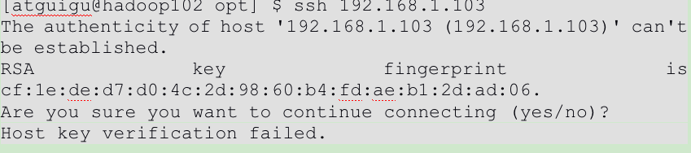

   （3）解决方案如下：直接输入yes

2. 无密钥配置

   （1）免密登录原理

   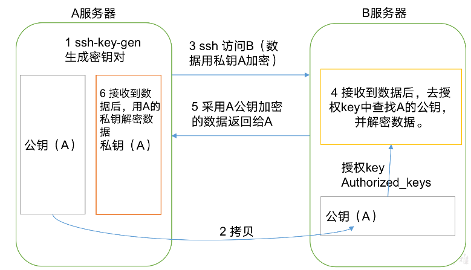

   （2）生成公钥和私钥

   ```shell
   ssh-keygen -t rsa
   ```

   然后敲（三个回车），就会生成两个文件id_rsa（私钥）、id_rsa.pub（公钥）

   （3）将公钥拷贝到要免密登录的目标机器上

   ```shell
   [atguigu@hadoop102 .ssh]$ ssh-copy-id hadoop102
   [atguigu@hadoop102 .ssh]$ ssh-copy-id hadoop103
   [atguigu@hadoop102 .ssh]$ ssh-copy-id hadoop104
   ```

   注意：

   还需要在hadoop102上采用root账号，配置一下无密登录到hadoop102、hadoop103、hadoop104；

   还需要在hadoop103上采用atguigu账号配置一下无密登录到hadoop102、hadoop103、hadoop104服务器上。

   

3. .ssh文件夹下（~/.ssh）的文件功能解释
   

### 4.3.6 群起集群

1. 配置slaves

   ```shell
   /opt/module/hadoop-2.7.2/etc/hadoop/slaves
   [atguigu@hadoop102 hadoop]$ vi slaves
   ```

   在该文件中增加如下内容：

   ```shell
   hadoop102
   hadoop103
   hadoop104
   ```

   注意：该文件中添加的内容结尾不允许有空格，文件中不允许有空行。

   同步所有节点配置文件

   ```shell
   [atguigu@hadoop102 hadoop]$ xsync slaves
   ```

   

2. 启动集群
   （1）如果集群是第一次启动，需要格式化NameNode（注意格式化之前，一定要先停止上次启动的所有namenode和datanode进程，然后再删除data和log数据）

   ```shell
   bin/hdfs namenode -format
   ```

   （2）启动HDFS

   ```shell
   [atguigu@hadoop102 hadoop-2.7.2]$ sbin/start-dfs.sh
   [atguigu@hadoop102 hadoop-2.7.2]$ jps
   4166 NameNode
   4482 Jps
   4263 DataNode
   [atguigu@hadoop103 hadoop-2.7.2]$ jps
   3218 DataNode
   3288 Jps
   [atguigu@hadoop104 hadoop-2.7.2]$ jps
   3221 DataNode
   3283 SecondaryNameNode
   3364 Jps
   ```

   （3）启动YARN

   ```shell
   sbin/start-yarn.sh
   ```

   注意：NameNode和ResourceManger如果不是同一台机器，不能在NameNode上启动 YARN，应该在ResouceManager所在的机器上启动YARN。

   （4）Web端查看SecondaryNameNode

   ​	（a）浏览器中输入：http://hadoop104:50090/status.html

   ​	（b）查看SecondaryNameNode信息

   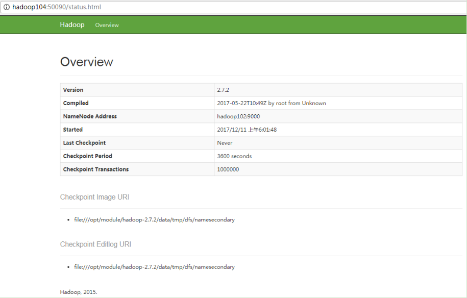

3. 集群基本测试
   （1）上传文件到集群

   上传小文件

   ```shell
   [atguigu@hadoop102 hadoop-2.7.2]$ hdfs dfs -mkdir -p /user/atguigu/input
   [atguigu@hadoop102 hadoop-2.7.2]$ hdfs dfs -put wcinput/wc.input /user/atguigu/input
   ```

   上传大文件

   ```shell
   [atguigu@hadoop102 hadoop-2.7.2]$ bin/hadoop fs -put /opt/software/hadoop-2.7.2.tar.gz  /user/atguigu/input
   ```

   （2）上传文件后查看文件存放在什么位置

   ​	（a）查看HDFS文件存储路径

   ```shell
   [atguigu@hadoop102 subdir0]$ pwd
   /opt/module/hadoop-2.7.2/data/tmp/dfs/data/current/BP-938951106-192.168.10.107-1495462844069/current/finalized/subdir0/subdir0
   ```

   ​	（b）查看HDFS在磁盘存储文件内容

   ```shell
   [atguigu@hadoop102 subdir0]$ cat blk_1073741825
   hadoop yarn
   hadoop mapreduce 
   atguigu
   atguigu
   ```

   （3）拼接

   ```shell
   -rw-rw-r--. 1 atguigu atguigu 134217728 5月  23 16:01 blk_1073741836
   -rw-rw-r--. 1 atguigu atguigu   1048583 5月  23 16:01 blk_1073741836_1012.meta
   -rw-rw-r--. 1 atguigu atguigu  63439959 5月  23 16:01 blk_1073741837
   -rw-rw-r--. 1 atguigu atguigu    495635 5月  23 16:01 blk_1073741837_1013.meta
   ```

   ```shell
   [atguigu@hadoop102 subdir0]$ cat blk_1073741836>>tmp.file
   [atguigu@hadoop102 subdir0]$ cat blk_1073741837>>tmp.file
   [atguigu@hadoop102 subdir0]$ tar -zxvf tmp.file
   ```

   （4）下载

   ```shell
   [atguigu@hadoop102 hadoop-2.7.2]$ bin/hadoop fs -get /user/atguigu/input/hadoop-2.7.2.tar.gz ./
   ```

### 4.3.7 集群启动/停止方式总结

1. 各个服务组件逐一启动/停止

   （1）分别启动/停止HDFS组件

   ```shell
   hadoop-daemon.sh  start / stop  namenode / datanode / secondarynamenode
   ```

   （2）启动/停止YARN

   ```shell
   yarn-daemon.sh  start / stop  resourcemanager / nodemanager
   ```

2. 各个模块分开启动/停止（配置ssh是前提）常用

   （1）整体启动/停止HDFS

   ```shell
   start-dfs.sh   /  stop-dfs.sh
   ```

   （2）整体启动/停止YARN

   ```shell
   start-yarn.sh  /  stop-yarn.sh
   ```

### 4.3.8 集群时间同步

时间同步的方式：找一个机器，作为时间服务器，所有的机器与这台集群时间进行定时的同步，比如，每隔十分钟，同步一次时间

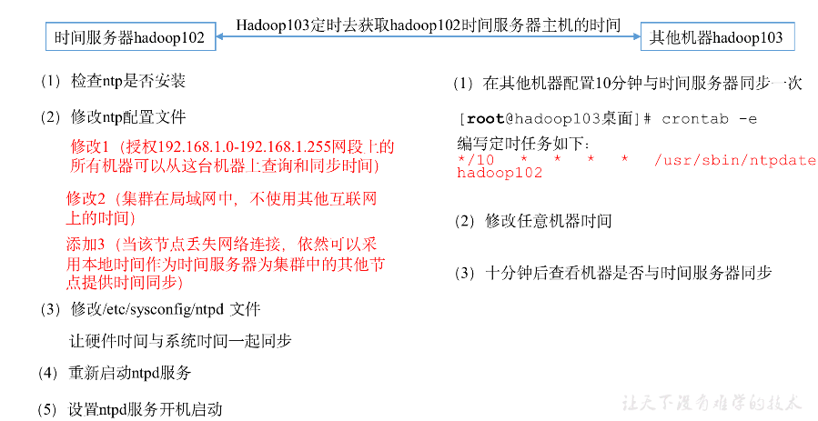

配置时间同步具体实操

1. 时间服务器配置（必须root用户）
   （1）检查ntp是否安装

   ```shell
   [root@hadoop102 桌面]# rpm -qa|grep ntp
   ntp-4.2.6p5-10.el6.centos.x86_64
   fontpackages-filesystem-1.41-1.1.el6.noarch
   ntpdate-4.2.6p5-10.el6.centos.x86_64
   ```

   （2）修改ntp配置文件

   ```shell
   [root@hadoop102 桌面]# vi /etc/ntp.conf
   ```

   修改内容如下

   ​		a）修改1（授权192.168.1.0-192.168.1.255网段上的所有机器可以从这台机器上查询和同步时间）

   #restrict 192.168.1.0 mask 255.255.255.0 nomodify notrap为

   restrict 192.168.1.0 mask 255.255.255.0 nomodify notrap

   ​		b）修改2（集群在局域网中，不使用其他互联网上的时间）

   server 0.centos.pool.ntp.org iburst

   server 1.centos.pool.ntp.org iburst

   server 2.centos.pool.ntp.org iburst

   server 3.centos.pool.ntp.org iburst为

   #server 0.centos.pool.ntp.org iburst

   #server 1.centos.pool.ntp.org iburst

   #server 2.centos.pool.ntp.org iburst

   #server 3.centos.pool.ntp.org iburst

   ​		c）添加3（当该节点丢失网络连接，依然可以采用本地时间作为时间服务器为集群中的其他节点提供时间同步）

   （3）修改/etc/sysconfig/ntpd 文件

   ```shell
   [root@hadoop102 桌面]# vim /etc/sysconfig/ntpd
   ```

   增加内容如下（让硬件时间与系统时间一起同步）

   ```shell
   SYNC_HWCLOCK=yes
   ```

   （4）重新启动ntpd服务

   ```shell
   [root@hadoop102 桌面]# service ntpd status
   ```

   ```shell
   [root@hadoop102 桌面]# service ntpd start
   ```

   （5）设置ntpd服务开机启动

   ```shell
   [root@hadoop102 桌面]# chkconfig ntpd on
   ```

2. 其他机器配置（必须root用户）

   （1）在其他机器配置10分钟与时间服务器同步一次

   ```shell
   [root@hadoop103桌面]# crontab -e
   ```

   编写定时任务如下：

   ```shell
   */10 * * * * /usr/sbin/ntpdate hadoop102
   ```

   （2）修改任意机器时间

   ```shell
   [root@hadoop103桌面]# date -s "2017-9-11 11:11:11"
   ```

   （3）十分钟后查看机器是否与时间服务器同步

   ```shell
   [root@hadoop103桌面]# date
   ```

   说明：测试的时候可以将10分钟调整为1分钟，节省时间。


# 5.Hadoop编译源码（面试重点）

## 5.1 前期准备工作

1. CentOS联网

   配置CentOS能连接外网。Linux虚拟机ping [www.baidu.com](http://www.baidu.com) 是畅通的

   注意：采用root角色编译，减少文件夹权限出现问题

2. jar包准备(hadoop源码、JDK8、maven、ant 、protobuf)

   ```shell
   （1）hadoop-2.7.2-src.tar.gz
   （2）jdk-8u144-linux-x64.tar.gz
   （3）apache-ant-1.9.9-bin.tar.gz（build工具，打包用的）
   （4）apache-maven-3.0.5-bin.tar.gz
   （5）protobuf-2.5.0.tar.gz（序列化的框架）
   ```

## 5.2 jar包安装

注意：所有操作必须在root用户下完成

1. JDK解压、配置环境变量 JAVA_HOME和PATH，验证[java](http://lib.csdn.net/base/javase)-version(如下都需要验证是否配置成功)

   ```shell
   tar -zxf jdk-8u144-linux-x64.tar.gz -C /opt/module/
   
   vi /etc/profile
   #JAVA_HOME：
   export JAVA_HOME=/opt/module/jdk1.8.0_144
   export PATH=$PATH:$JAVA_HOME/bin
   
   source /etc/profile
   ```

   验证命令：java -version

2. Maven解压、配置  MAVEN_HOME和PATH

   ```shell
   tar -zxvf apache-maven-3.0.5-bin.tar.gz -C /opt/module/
   
   vi conf/settings.xml
   
   <mirrors>
       <!-- mirror
        | Specifies a repository mirror site to use instead of a given repository. The repository that
        | this mirror serves has an ID that matches the mirrorOf element of this mirror. IDs are used
        | for inheritance and direct lookup purposes, and must be unique across the set of mirrors.
        |
   <mirror>
          <id>mirrorId</id>
          <mirrorOf>repositoryId</mirrorOf>
          <name>Human Readable Name for this Mirror.</name>
          <url>http://my.repository.com/repo/path</url>
         </mirror>
        -->
           <mirror>
                   <id>nexus-aliyun</id>
                   <mirrorOf>central</mirrorOf>
                   <name>Nexus aliyun</name>
                   <url>http://maven.aliyun.com/nexus/content/groups/public</url>
           </mirror>
   </mirrors>
   ```

   ```shell
   vi /etc/profile
   
   #MAVEN_HOME
   export MAVEN_HOME=/opt/module/apache-maven-3.0.5
   export PATH=$PATH:$MAVEN_HOME/bin
   
   source /etc/profile
   ```

   验证命令：mvn -version

3. ant解压、配置  ANT _HOME和PATH

   ```shell
   tar -zxvf apache-ant-1.9.9-bin.tar.gz -C /opt/module/
   
   vi /etc/profile
   #ANT_HOME
   export ANT_HOME=/opt/module/apache-ant-1.9.9
   export PATH=$PATH:$ANT_HOME/bin
   
   source /etc/profile
   ```

   验证命令：ant -version

4. 安装  glibc-headers 和  g++  命令如下

   ```shell
   yum install glibc-headers
   yum install gcc-c++
   ```

5. 安装make和cmake

   ```shell
   yum install make
   yum install cmake
   ```

   

6. 解压protobuf ，进入到解压后protobuf主目录，/opt/module/protobuf-2.5.0，然后相继执行命令

   ```bash
   tar -zxvf protobuf-2.5.0.tar.gz -C /opt/module/
   
   cd /opt/module/protobuf-2.5.0/
   
   [root@hadoop101 protobuf-2.5.0]#./configure 
   [root@hadoop101 protobuf-2.5.0]# make 
   [root@hadoop101 protobuf-2.5.0]# make check 
   [root@hadoop101 protobuf-2.5.0]# make install 
   [root@hadoop101 protobuf-2.5.0]# ldconfig 
   
   [root@hadoop101 hadoop-dist]# vi /etc/profile
   #LD_LIBRARY_PATH
   export LD_LIBRARY_PATH=/opt/module/protobuf-2.5.0
   export PATH=$PATH:$LD_LIBRARY_PATH
   
   [root@hadoop101 software]#source /etc/profile
   ```

   验证命令：protoc --version

7. 安装openssl库

   ```bash
   [root@hadoop101 software]#yum install openssl-devel
   ```

8. 安装 ncurses-devel库

   ```bash
   [root@hadoop101 software]#yum install ncurses-devel
   ```

   到此，编译工具安装基本完成。

## 5.3 编译源码

1. 解压源码到/opt/目录

   ```bash
   [root@hadoop101 software]# tar -zxvf hadoop-2.7.2-src.tar.gz -C /opt/
   ```

2. 进入到hadoop源码主目录

   ```bash
   [root@hadoop101 hadoop-2.7.2-src]# pwd
   /opt/hadoop-2.7.2-src
   ```

3. 通过maven执行编译命令

   ```bash
   [root@hadoop101 hadoop-2.7.2-src]#mvn package -Pdist,native -DskipTests -Dtar
   ```

   等待时间30分钟左右，最终成功是全部SUCCESS

   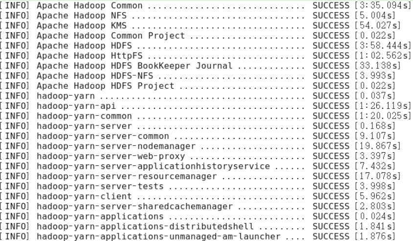

4. 成功的64位hadoop包在/opt/hadoop-2.7.2-src/hadoop-dist/target下

   ```bash
   [root@hadoop101 target]# pwd
   /opt/hadoop-2.7.2-src/hadoop-dist/target
   ```

5. 编译源码过程中常见的问题及解决方案

   （1）MAVEN install时候JVM内存溢出

   处理方式：在环境配置文件和maven的执行文件均可调整MAVEN_OPT的heap大小。（详情查阅MAVEN 编译 JVM调优问题，如：http://outofmemory.cn/code-snippet/12652/maven-outofmemoryerror-method）

   （2）编译期间maven报错。可能网络阻塞问题导致依赖库下载不完整导致，多次执行命令（一次通过比较难）

   ```bash
   [root@hadoop101 hadoop-2.7.2-src]#mvn package -Pdist,nativeN -DskipTests -Dtar
   ```

   （3）报ant、protobuf等错误，插件下载未完整或者插件版本问题，最开始链接有较多特殊情况，同时推荐

   2.7.0版本的问题汇总帖子 http://www.tuicool.com/articles/IBn63qf

# 6. 常见错误及解决方案

1）防火墙没关闭、或者没有启动YARN

**INFO client.RMProxy: Connecting to ResourceManager at hadoop108/192.168.10.108:8032**

2）主机名称配置错误

3）IP地址配置错误

4）ssh没有配置好

5）root用户和atguigu两个用户启动集群不统一

6）配置文件修改不细心

7）未编译源码

**Unable to load native-hadoop library for your platform... using builtin-java classes where applicable**

17/05/22 15:38:58 INFO client.RMProxy: Connecting to ResourceManager at hadoop108/192.168.10.108:8032

8）不识别主机名称

```java
java.net.UnknownHostException: hadoop102: hadoop102
        at java.net.InetAddress.getLocalHost(InetAddress.java:1475)
        at org.apache.hadoop.mapreduce.JobSubmitter.submitJobInternal(JobSubmitter.java:146)
        at org.apache.hadoop.mapreduce.Job$10.run(Job.java:1290)
        at org.apache.hadoop.mapreduce.Job$10.run(Job.java:1287)
        at java.security.AccessController.doPrivileged(Native Method)
at javax.security.auth.Subject.doAs(Subject.java:415)
```

解决办法：

（1）在/etc/hosts文件中添加192.168.1.102 hadoop102

（2）主机名称不要起hadoop  hadoop000等特殊名称

9）DataNode和NameNode进程同时只能工作一个。

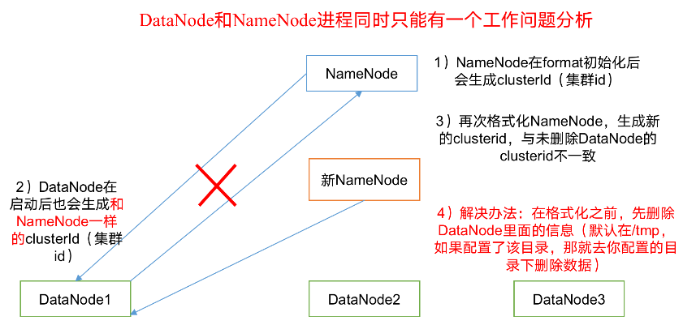

10）执行命令不生效，粘贴word中命令时，遇到-和长–没区分开。导致命令失效

解决办法：尽量不要粘贴word中代码。

11）jps发现进程已经没有，但是重新启动集群，提示进程已经开启。原因是在linux的根目录下/tmp目录中存在启动的进程临时文件，将集群相关进程删除掉，再重新启动集群。

12）jps不生效。

原因：全局变量hadoop java没有生效。解决办法：需要source /etc/profile文件。

13）8088端口连接不上

[atguigu@hadoop102 桌面]$ cat /etc/hosts

注释掉如下代码

\#127.0.0.1  localhost localhost.localdomain localhost4 localhost4.localdomain4

\#::1     hadoop102