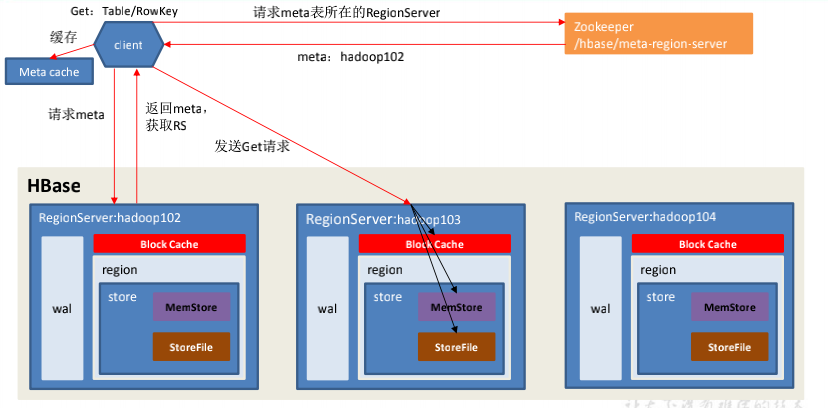
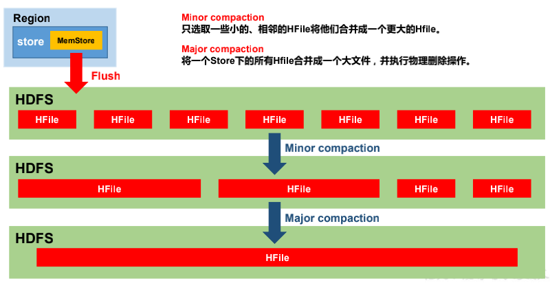
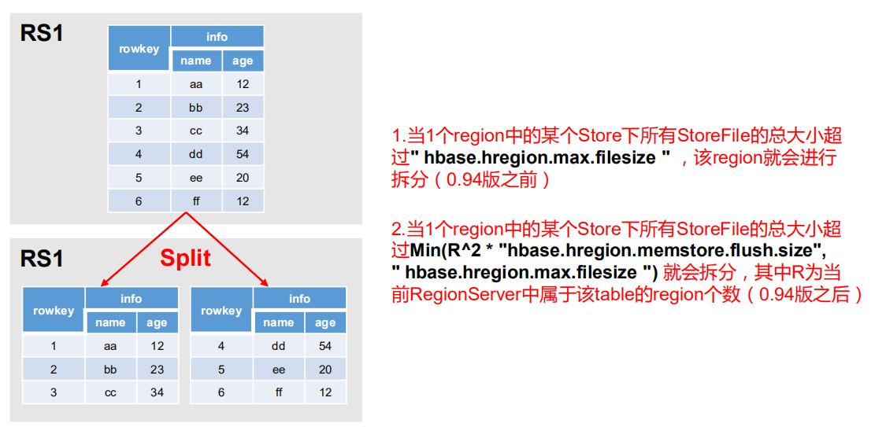

[TOC]

# 1.  **HBase** **简介**

## 1.1 HBase定义

HBase 是一种分布式、可扩展、支持海量数据存储的 NoSQL 数据库

## 1.2 HBase数据模型

逻辑上，HBase 的数据模型同关系型数据库很类似，数据存储在一张表中，有行有列。

但从 HBase 的底层物理存储结构（K-V）来看，HBase 更像是一个 multi-dimensional map

### 1.2.1 HBase逻辑结构


### 1.2.2 HBase物理存储结构


### 1.2.3 **数据模型**

1. **Name Space**

   命名空间，类似于关系型数据库的 DatabBase 概念，每个命名空间下有多个表。HBase有两个自带的命名空间，分别是 hbase 和 default，hbase 中存放的是 HBase 内置的表，default 表是用户默认使用的命名空间

2. **Region**

   类似于关系型数据库的表概念。不同的是，HBase 定义表时只需要声明列族即可，不需要声明具体的列。这意味着，往 HBase 写入数据时，字段可以动态、按需指定。因此，和关系型数据库相比，HBase 能够轻松应对字段变更的场景

3. **Row**

   HBase 表中的每行数据都由一个 **RowKey** 和多个 **Column**（列）组成，数据是按照 RowKey的字典顺序存储的，并且查询数据时只能根据 RowKey 进行检索，所以 RowKey 的设计十分重要。

4. **Column**

   HBase 中的每个列都由 Column Family(列族)和 Column Qualifier（列限定符）进行限定，例如 info：name，info：age。建表时，只需指明列族，而列限定符无需预先定义。

5. **Time Stamp**

   用于标识数据的不同版本（version），每条数据写入时，如果不指定时间戳，系统会自动为其加上该字段，其值为写入 HBase 的时间

6. **Cell**

   由{rowkey, column Family：column Qualifier, time Stamp} 唯一确定的单元。cell 中的数据是没有类型的，全部是字节码形式存贮。

## 1.3 **HBase** **基本架构**


**架构角色：**

1. **Region Server**

   Region Server 为 Region 的管理者，其实现类为 HRegionServer，主要作用如下:

   对于数据的操作：get, put, delete；

   对于 Region 的操作：splitRegion、compactRegion。

2. **Master**

   Master 是所有 Region Server 的管理者，其实现类为 HMaster，主要作用如下：

   对于表的操作：create, delete, alter

   对于 RegionServer的操作：分配 regions到每个RegionServer，监控每个 RegionServer的状态，负载均衡和故障转移

3. **Zookeeper**

   HBase 通过 Zookeeper 来做 Master 的高可用、RegionServer 的监控、元数据的入口以及集群配置的维护等工作

4. **HDFS**

   HDFS 为 HBase 提供最终的底层数据存储服务，同时为 HBase 提供高可用的支持


# 2. **HBase** **快速入门**

## 2.1 **HBase** **安装部署**

### 2.1.1 **Zookeeper** **正常部署**

首先保证 Zookeeper 集群的正常部署，并启动之

```bash
[atguigu@hadoop102 zookeeper-3.4.10]$ bin/zkServer.sh start
[atguigu@hadoop103 zookeeper-3.4.10]$ bin/zkServer.sh start
[atguigu@hadoop104 zookeeper-3.4.10]$ bin/zkServer.sh start
```

### 2.1.2 **Hadoop** **正常部署**

Hadoop 集群的正常部署并启动：

```bash
[atguigu@hadoop102 hadoop-2.7.2]$ sbin/start-dfs.sh
[atguigu@hadoop103 hadoop-2.7.2]$ sbin/start-yarn.sh
```

### 2.1.3 **HBase** **的解压**

解压 Hbase 到指定目录：

```bash
tar -zxvf hbase-1.3.1-bin.tar.gz -C /opt/module
```

### 2.1.4 **HBase** **的配置文件**

修改 HBase 对应的配置文件。

1. hbase-env.sh 修改内容

   ```bash
   export JAVA_HOME=/opt/module/jdk1.6.0_144
   export HBASE_MANAGES_ZK=false
   ```

2. hbase-site.xml 修改内容

   ```xml
   <configuration>
   <property>
   <name>hbase.rootdir</name>
   <value>hdfs://hadoop102:9000/HBase</value>
   </property>
   <property>
   <name>hbase.cluster.distributed</name>
   <value>true</value>
   </property>
   <!-- 0.98 后的新变动，之前版本没有.port,默认端口为 60000 -->
   <property>
   <name>hbase.master.port</name>
   <value>16000</value>
   </property>
   <property> 
   <name>hbase.zookeeper.quorum</name>
   <value>hadoop102,hadoop103,hadoop104</value>
     </property>
   <property> 
   <name>hbase.zookeeper.property.dataDir</name>
   <value>/opt/module/zookeeper-3.4.10/zkData</value>
   </property>
   </configuration>
   ```

3. regionservers

   ```bash
   hadoop102
   hadoop103
   hadoop104
   ```

4. 软连接 hadoop 配置文件到 HBase

   ```bash
   ln -s /opt/module/hadoop-2.7.2/etc/hadoop/core-site.xml /opt/module/hbase/conf/core-site.xml
   ln -s /opt/module/hadoop-2.7.2/etc/hadoop/hdfs-site.xml /opt/module/hbase/conf/hdfs-site.xml
   ```

### 2.1.5 **HBase** **远程发送到其他集群**

```bash
xsync hbase/
```

### 2.1.6 **HBase** **服务的启动**

1. **启动方式**1

   ```bash
   [atguigu@hadoop102 hbase]$ bin/hbase-daemon.sh start master
   [atguigu@hadoop102 hbase]$ bin/hbase-daemon.sh start regionserver
   ```

   提示：如果集群之间的节点时间不同步，会导致 regionserver 无法启动，抛出ClockOutOfSyncException 异常

   修复提示：

   a、同步时间服务

   b、属性：hbase.master.maxclockskew 设置更大的值

   ```xml
   <property>
   <name>hbase.master.maxclockskew</name>
   <value>180000</value>
   <description>Time difference of regionserver from 
   master</description>
   </property>
   ```

2. **启动方式 2**

   ```bash
   bin/start-hbase.sh
   ```

   对应的停止服务

   ```bash
   bin/stop-hbase.sh
   ```

### 2.1.7 **查看** **HBase** **页面**

启动成功后，可以通过“host:port”的方式来访问 HBase 管理页面，例如：

http://hadoop102:16010

## 2.2 **HBase Shell** **操作**

### 2.2.1 **基本操作**

1. **进入 HBase 客户端命令行**

   ```bash
    bin/hbase shell
   ```

2. **查看帮助命令**

   ```bash
    help
   ```

3. **查看当前数据库中有哪些表**

   ```bash
   list
   ```

### 2.2.2 **表的操作**

1. **创建表**

   ```bash
    create 'student','info'
   ```

2. **插入数据到表**

   ```bash
   hbase(main):003:0> put 'student','1001','info:sex','male'
   hbase(main):004:0> put 'student','1001','info:age','18'
   hbase(main):005:0> put 'student','1002','info:name','Janna'
   hbase(main):006:0> put 'student','1002','info:sex','female'
   hbase(main):007:0> put 'student','1002','info:age','20'
   ```

3. **扫描查看表数据**

   ```bash
   hbase(main):008:0> scan 'student'
   hbase(main):009:0> scan 'student',{STARTROW => '1001', STOPROW => '1001'}
   hbase(main):010:0> scan 'student',{STARTROW => '1001'}
   ```

4. **查看表结构**

   ```bash
    describe ‘student’
   ```

5. **更新指定字段的数据**

   ```bash
   hbase(main):012:0> put 'student','1001','info:name','Nick'
   hbase(main):013:0> put 'student','1001','info:age','100'
   ```

6. **查看“指定行”或“指定列族:列”的数据**

   ```bash
   hbase(main):014:0> get 'student','1001'
   hbase(main):015:0> get 'student','1001','info:name'
   ```

7. **统计表数据行数**

   ```bash
    count 'student'
   ```

8. **删除数据**

   删除某 rowkey 的全部数据：

   ```bash
   deleteall 'student','1001'
   ```

   删除某 rowkey 的某一列数据：

   ```bash
    delete 'student','1002','info:sex'
   ```

9. **清空表数据**

   ```bash
   truncate 'student'
   ```

   提示：清空表的操作顺序为先 disable，然后再 truncate。

10. **删除表**

    首先需要先让该表为 disable 状态：

    ```bash
     disable 'student'
    ```

    然后才能 drop 这个表：

    ```bash
    drop 'student'
    ```

    提示：如果直接 drop 表，会报错：ERROR: Table student is enabled. Disable it first

11. **变更表信息**

    将 info 列族中的数据存放 3 个版本

    ```bash
    hbase(main):022:0> alter 'student',{NAME=>'info',VERSIONS=>3}
    hbase(main):022:0> get 'student','1001',{COLUMN=>'info:name',VERSIONS=>3}
    ```

# 3. **HBase** **进阶**

## 3.1 **架构原理**


1. **StoreFile**

   保存实际数据的物理文件，StoreFile 以 HFile 的形式存储在 HDFS 上。每个 Store 会有一个或多个 StoreFile（HFile），数据在每个 StoreFile 中都是有序的

2. **MemStore**

   写缓存，由于 HFile 中的数据要求是有序的，所以数据是先存储在 MemStore 中，排好序后，等到达刷写时机才会刷写到 HFile，每次刷写都会形成一个新的 HFile

3. **WAL**

   由于数据要经 MemStore 排序后才能刷写到 HFile，但把数据保存在内存中会有很高的概率导致数据丢失，为了解决这个问题，数据会先写在一个叫做 Write-Ahead logfile 的文件中，然后再写入 MemStore 中。所以在系统出现故障的时候，数据可以通过这个日志文件重建。

## 3.2 **写流程**


1. Client 先访问 zookeeper，获取 hbase:meta 表位于哪个 Region Server
2. 访问对应的 Region Server，获取 hbase:meta 表，根据读请求的 namespace:table/rowkey，查询出目标数据位于哪个 Region Server 中的哪个 Region 中。并将该 table 的 region 信息以及 meta 表的位置信息缓存在客户端的 meta cache，方便下次访问
3. 与目标 Region Server 进行通讯
4. 将数据顺序写入（追加）到 WAL
5. 将数据写入对应的 MemStore，数据会在 MemStore 进行排序
6. 向客户端发送 ack
7. 等达到 MemStore 的刷写时机后，将数据刷写到 HFile

## 3.3 **MemStore Flush**


**MemStore** **刷写时机：**

1. 当某个 memstroe 的大小达到了 hbase.hregion.memstore.flush.size（默认值128M）， 其所在 region 的所有 memstore 都会刷写。 当 memstore 的大小达到了
   hbase.hregion.memstore.flush.size（默认值128M）

   hbase.hregion.memstore.block.multiplier（默认值4）时，会阻止继续往该 memstore 写数据。

2. 当 region server 中 memstore 的总大小达到

   **java_heapsize**

   ***hbase.regionserver.global.memstore.size***（默认值0.4）

   ***hbase.regionserver.global.memstore.size.lower.limit***（默认值0.95），

   region 会按照其所有 memstore 的大小顺序（由大到小）依次进行刷写。直到 region server中所有 memstore 的总大小减小到上述值以下。 

   当 region server 中 memstore 的总大小达到

   **java_heapsize*hbase.regionserver.global.memstore.size**（默认值0.4）

   时，会阻止继续往所有的 memstore 写数据。

3. 到达自动刷写的时间，也会触发 memstore flush。自动刷新的时间间隔由该属性进行

   配置 **hbase.regionserver.optionalcacheflushinterval（默认 1 **小时）

   

4. 当 WAL 文件的数量超过 **hbase.regionserver.max.logs**，region 会按照时间顺序依次进

   行刷写，直到 WAL 文件数量减小到 **hbase.regionserver.max.log** 以下（该属性名已经废弃，

   现无需手动设置，最大值为 32）。

## 3.4 **读流程**



1. Client 先访问 zookeeper，获取 hbase:meta 表位于哪个 Region Server
2. 访问对应的 Region Server，获取 hbase:meta 表，根据读请求的 namespace:table/rowkey，查询出目标数据位于哪个 Region Server 中的哪个 Region 中。并将该 table 的 region 信息以及 meta 表的位置信息缓存在客户端的 meta cache，方便下次访问
3. 与目标 Region Server 进行通讯
4. 分别在 Block Cache（读缓存），MemStore 和 Store File（HFile）中查询目标数据，并将查到的所有数据进行合并。此处所有数据是指同一条数据的不同版本（time stamp）或者不同的类型（Put/Delete）
5. 将从文件中查询到的数据块（Block，HFile 数据存储单元，默认大小为 64KB）缓存到Block Cache
6. 将合并后的最终结果返回给客户端

## 3.5  **StoreFile Compaction**

由于memstore每次刷写都会生成一个新的HFile，且同一个字段的不同版本（timestamp）和不同类型（Put/Delete）有可能会分布在不同的 HFile 中，因此查询时需要遍历所有的 HFile。

为了减少 HFile 的个数，以及清理掉过期和删除的数据，会进行 StoreFile Compaction。

Compaction 分为两种，分别是 Minor Compaction 和 Major Compaction。Minor Compaction会将临近的若干个较小的 HFile 合并成一个较大的 HFile，但**不会**清理过期和删除的数据。

Major Compaction 会将一个 Store 下的所有的 HFile 合并成一个大 HFile，并且**会**清理掉过期和删除的数据



## 3.6 **Region Split**

默认情况下，每个 Table 起初只有一个 Region，随着数据的不断写入，Region 会自动进行拆分。刚拆分时，两个子 Region 都位于当前的 Region Server，但处于负载均衡的考虑，HMaster 有可能会将某个 Region 转移给其他的 Region Server。

Region Split 时机：

1. 当1个region中的某个Store下所有StoreFile的总大小超过hbase.hregion.max.filesize， 该 Region 就会进行拆分（0.94 版本之前）。

2. 当 1 个 region 中 的 某 个 Store 下所有 StoreFile 的 总 大 小 超 过 Min(R^2 * "hbase.hregion.memstore.flush.size",hbase.hregion.max.filesize")，该 Region 就会进行拆分，其中 R 为当前 Region Server 中属于该 Table 的个数（0.94 版本之后）。   



   

# 4. **HBase API**

## 4.1 **环境准备**

新建项目后在 pom.xml 中添加依赖

```xml
<dependency>
 <groupId>org.apache.hbase</groupId>
 <artifactId>hbase-server</artifactId>
 <version>1.3.1</version>
</dependency>
<dependency>
 <groupId>org.apache.hbase</groupId>
 <artifactId>hbase-client</artifactId>
 <version>1.3.1</version>
</dependency>
```

## 4.2  **HBaseAPI**

### 4.2.1 **获取** **Configuration** **对象**

```java
public static Configuration conf;
static{
//使用 HBaseConfiguration 的单例方法实例化
conf = HBaseConfiguration.create();
conf.set("hbase.zookeeper.quorum", "192.166.9.102");
conf.set("hbase.zookeeper.property.clientPort", "2181");
}
```

### 4.2.2 **判断表是否存在**

```java
public static boolean isTableExist(String tableName) throws 
MasterNotRunningException,
ZooKeeperConnectionException, IOException{
//在 HBase 中管理、访问表需要先创建 HBaseAdmin 对象
    //Connection connection = 
ConnectionFactory.createConnection(conf);
//HBaseAdmin admin = (HBaseAdmin) connection.getAdmin();
HBaseAdmin admin = new HBaseAdmin(conf);
return admin.tableExists(tableName);
}
```

### 4.2.3 **创建表**

```java
public static void createTable(String tableName, String... 
columnFamily) throws
MasterNotRunningException, ZooKeeperConnectionException, 
IOException{
HBaseAdmin admin = new HBaseAdmin(conf);
//判断表是否存在
if(isTableExist(tableName)){
System.out.println("表" + tableName + "已存在");
//System.exit(0);
}else{
//创建表属性对象,表名需要转字节
HTableDescriptor descriptor = new 
HTableDescriptor(TableName.valueOf(tableName));
//创建多个列族
for(String cf : columnFamily){
descriptor.addFamily(new HColumnDescriptor(cf));
}
//根据对表的配置，创建表
admin.createTable(descriptor);
System.out.println("表" + tableName + "创建成功！");
} }
```

### 4.2.4 **删除表**

```java
public static void dropTable(String tableName) throws 
MasterNotRunningException,
ZooKeeperConnectionException, IOException{
HBaseAdmin admin = new HBaseAdmin(conf);
if(isTableExist(tableName)){
admin.disableTable(tableName);
admin.deleteTable(tableName);
System.out.println("表" + tableName + "删除成功！");
}else{
System.out.println("表" + tableName + "不存在！");
} }
```

### 4.2.5 **向表中插入数据**

```java
public static void addRowData(String tableName, String rowKey, 
String columnFamily, String
column, String value) throws IOException{
//创建 HTable 对象
HTable hTable = new HTable(conf, tableName);
//向表中插入数据
Put put = new Put(Bytes.toBytes(rowKey));
//向 Put 对象中组装数据
    put.add(Bytes.toBytes(columnFamily), Bytes.toBytes(column), 
Bytes.toBytes(value));
hTable.put(put);
hTable.close();
System.out.println("插入数据成功");
}
```

### 4.2.6 **删除多行数据**

```java
public static void deleteMultiRow(String tableName, String... rows) 
throws IOException{
HTable hTable = new HTable(conf, tableName);
List<Delete> deleteList = new ArrayList<Delete>();
for(String row : rows){
Delete delete = new Delete(Bytes.toBytes(row));
deleteList.add(delete);
}
hTable.delete(deleteList);
hTable.close();
}
```

### 4.2.7 **获取所有数据**

```java
public static void getAllRows(String tableName) throws IOException{
HTable hTable = new HTable(conf, tableName);
//得到用于扫描 region 的对象
Scan scan = new Scan();
//使用 HTable 得到 resultcanner 实现类的对象
ResultScanner resultScanner = hTable.getScanner(scan);
for(Result result : resultScanner){
Cell[] cells = result.rawCells();
for(Cell cell : cells){
//得到 rowkey
System.out.println(" 行 键 :" +
Bytes.toString(CellUtil.cloneRow(cell)));
//得到列族
System.out.println(" 列 族 " + 
Bytes.toString(CellUtil.cloneFamily(cell)));
System.out.println(" 列 :" + 
Bytes.toString(CellUtil.cloneQualifier(cell)));
System.out.println(" 值 :" + 
Bytes.toString(CellUtil.cloneValue(cell)));
} } }
```

### 4.2.8 **获取某一行数据**

```java
public static void getRow(String tableName, String rowKey) throws 
IOException{
HTable table = new HTable(conf, tableName);
Get get = new Get(Bytes.toBytes(rowKey));
//get.setMaxVersions();显示所有版本
 //get.setTimeStamp();显示指定时间戳的版本
Result result = table.get(get);
for(Cell cell : result.rawCells()){
System.out.println(" 行 键 :" +
                   Bytes.toString(result.getRow()));
System.out.println(" 列 族 " + 
Bytes.toString(CellUtil.cloneFamily(cell)));
System.out.println(" 列 :" + 
Bytes.toString(CellUtil.cloneQualifier(cell)));
System.out.println(" 值 :" + 
Bytes.toString(CellUtil.cloneValue(cell)));
System.out.println("时间戳:" + cell.getTimestamp());
} }
```

### 4.2.9 获取某一行指定“列族:列”的数据

```java
public static void getRowQualifier(String tableName, String rowKey, 
String family, String
qualifier) throws IOException{
HTable table = new HTable(conf, tableName);
Get get = new Get(Bytes.toBytes(rowKey));
get.addColumn(Bytes.toBytes(family), 
Bytes.toBytes(qualifier));
Result result = table.get(get);
for(Cell cell : result.rawCells()){
System.out.println(" 行 键 :" + 
Bytes.toString(result.getRow()));
System.out.println(" 列 族 " + 
Bytes.toString(CellUtil.cloneFamily(cell)));
System.out.println(" 列 :" + 
Bytes.toString(CellUtil.cloneQualifier(cell)));
System.out.println(" 值 :" + 
Bytes.toString(CellUtil.cloneValue(cell)));
} }
```

## 4.3 **MapReduce**

通过 HBase 的相关 JavaAPI，我们可以实现伴随 HBase 操作的 MapReduce 过程，比如使用MapReduce 将数据从本地文件系统导入到 HBase 的表中，比如我们从 HBase 中读取一些原始数据后使用 MapReduce 做数据分析

### 4.3.1 **官方** **HBase-MapReduce**

1. 查看 HBase 的 MapReduce 任务的执行

   ```bash
   bin/hbase mapredcp
   ```

2. 环境变量的导入

   （1）执行环境变量的导入（临时生效，在命令行执行下述操作）

   ```bash
   $ export HBASE_HOME=/opt/module/hbase
   $ export HADOOP_HOME=/opt/module/hadoop-2.7.2
   $ export HADOOP_CLASSPATH=`${HBASE_HOME}/bin/hbase mapredcp`
   ```

   （2）永久生效：在/etc/profile 配置

   ```bash
   export HBASE_HOME=/opt/module/hbase
   export HADOOP_HOME=/opt/module/hadoop-2.7.2
   ```

   并在 hadoop-env.sh 中配置：（注意：在 for 循环之后配）

   ```bash
   export HADOOP_CLASSPATH=$HADOOP_CLASSPATH:/opt/module/hbase/lib/*
   ```

   

3. 运行官方的 MapReduce 任务

   案例一：统计 Student 表中有多少行数据

   ```bash
   $ /opt/module/hadoop-2.7.2/bin/yarn jar lib/hbase-server-1.3.1.jar 
   rowcounter student
   ```

   案例二：使用 MapReduce 将本地数据导入到 HBase

   1）在本地创建一个 tsv 格式的文件：fruit.tsv

   ```bash
   1001 Apple Red
   1002 Pear Yellow
   1003 Pineapple Yellow
   ```

   2）创建 Hbase 表

   ```bash
   Hbase(main):001:0> create 'fruit','info'
   ```

   3）在 HDFS 中创建 input_fruit 文件夹并上传 fruit.tsv 文件

   ```bash
   $ /opt/module/hadoop-2.7.2/bin/hdfs dfs -mkdir /input_fruit/
   $ /opt/module/hadoop-2.7.2/bin/hdfs dfs -put fruit.tsv /input_fruit/
   ```

   4）执行 MapReduce 到 HBase 的 fruit 表中

   ```bash
   $ /opt/module/hadoop-2.7.2/bin/yarn jar lib/hbase-server-1.3.1.jar 
   importtsv \ -Dimporttsv.columns=HBASE_ROW_KEY,info:name,info:color fruit \
   hdfs://hadoop102:9000/input_fruit
   ```

   5）使用 scan 命令查看导入后的结果

   ```bash
   Hbase(main):001:0> scan ‘fruit’
   ```

### 4.3.2 **自定义** **HBase-MapReduce1**

目标：将 fruit 表中的一部分数据，通过 MR 迁入到 fruit_mr 表中

分步实现：

1. 构建 ReadFruitMapper 类，用于读取 fruit 表中的数据

   ```java
   package com.atguigu;
   import java.io.IOException;
   import org.apache.hadoop.hbase.Cell;
   import org.apache.hadoop.hbase.CellUtil;
   import org.apache.hadoop.hbase.client.Put;
   import org.apache.hadoop.hbase.client.Result;
   import org.apache.hadoop.hbase.io.ImmutableBytesWritable;
   import org.apache.hadoop.hbase.mapreduce.TableMapper;
   import org.apache.hadoop.hbase.util.Bytes;
   public class ReadFruitMapper extends 
   TableMapper<ImmutableBytesWritable, Put> {
   @Override
       protected void map(ImmutableBytesWritable key, Result value, 
   Context context) 
   throws IOException, InterruptedException {
   //将 fruit 的 name 和 color 提取出来，相当于将每一行数据读取出来放入到 Put
   对象中。
   Put put = new Put(key.get());
   //遍历添加 column 行
   for(Cell cell: value.rawCells()){
   //添加/克隆列族:info
   if("info".equals(Bytes.toString(CellUtil.cloneFamily(cell)))){
   //添加/克隆列：name
   if("name".equals(Bytes.toString(CellUtil.cloneQualifier(cell))
   )){
   //将该列 cell 加入到 put 对象中
   put.add(cell);
   //添加/克隆列:color
   }else 
   if("color".equals(Bytes.toString(CellUtil.cloneQualifier(cell))))
   {
   //向该列 cell 加入到 put 对象中
   put.add(cell);
   } } }
   //将从 fruit 读取到的每行数据写入到 context 中作为 map 的输出
   context.write(key, put);
   } }
   ```

   

2. 构建 WriteFruitMRReducer 类，用于将读取到的 fruit 表中的数据写入到 fruit_mr 表 中

   ```java
   package com.atguigu.Hbase_mr;
   import java.io.IOException;
   import org.apache.hadoop.Hbase.client.Put;
   import org.apache.hadoop.Hbase.io.ImmutableBytesWritable;
   import org.apache.hadoop.Hbase.mapreduce.TableReducer;
   import org.apache.hadoop.io.NullWritable;
   public class WriteFruitMRReducer extends 
   TableReducer<ImmutableBytesWritable, Put, NullWritable> {
   @Override
   protected void reduce(ImmutableBytesWritable key, Iterable<Put> 
   values, Context context) 
   throws IOException, InterruptedException {
   //读出来的每一行数据写入到 fruit_mr 表中
   for(Put put: values){
   context.write(NullWritable.get(), put);
   } } }
   ```

3. 构建 Fruit2FruitMRRunner extends Configured implements Tool 用于组装运行 Job任务

   ```java
   //组装 Job
   public int run(String[] args) throws Exception {
   //得到 Configuration
   Configuration conf = this.getConf();
   //创建 Job 任务
   Job job = Job.getInstance(conf, 
   this.getClass().getSimpleName());
   job.setJarByClass(Fruit2FruitMRRunner.class);
   //配置 Job
   Scan scan = new Scan();
   scan.setCacheBlocks(false);
   scan.setCaching(500);
   //设置 Mapper，注意导入的是 mapreduce 包下的，不是 mapred 包下的，后者
   是老版本
   TableMapReduceUtil.initTableMapperJob(
   "fruit", //数据源的表名
   scan, //scan 扫描控制器
   ReadFruitMapper.class,//设置 Mapper 类
   ImmutableBytesWritable.class,//设置 Mapper 输出 key 类型
   Put.class,//设置 Mapper 输出 value 值类型
   job//设置给哪个 JOB
   );
   //设置 Reducer
   TableMapReduceUtil.initTableReducerJob("fruit_mr", 
   WriteFruitMRReducer.class, job);
   //设置 Reduce 数量，最少 1 个
   job.setNumReduceTasks(1);
   boolean isSuccess = job.waitForCompletion(true);
   if(!isSuccess){
   throw new IOException("Job running with error");
   }
   return isSuccess ? 0 : 1;
   }
   ```

4. 主函数中调用运行该 Job 任务

   ```java
   public static void main( String[] args ) throws Exception{
   Configuration conf = HbaseConfiguration.create();
   int status = ToolRunner.run(conf, new Fruit2FruitMRRunner(), args);
   System.exit(status);
   }
   ```

5. 打包运行任务

   ```java
   $ /opt/module/hadoop-2.7.2/bin/yarn jar ~/softwares/jars/Hbase-
   0.0.1-SNAPSHOT.jar
   com.z.Hbase.mr1.Fruit2FruitMRRunner
   ```

   提示：运行任务前，如果待数据导入的表不存在，则需要提前创建。

   提示：maven 打包命令：-P local clean package 或-P dev clean package install（将第三方 jar 包一同打包，需要插件：maven-shade-plugin） 

   

### 4.3.3 **自定义** **Hbase-MapReduce2**

目标：实现将 HDFS 中的数据写入到 Hbase 表中。

分步实现：

1. 构建 ReadFruitFromHDFSMapper 于读取 HDFS 中的文件数据

   ```java
   package com.atguigu;
   import java.io.IOException;
   import org.apache.hadoop.hbase.client.Put;
   import org.apache.hadoop.hbase.io.ImmutableBytesWritable;
   import org.apache.hadoop.hbase.util.Bytes;
   import org.apache.hadoop.io.LongWritable;
   import org.apache.hadoop.io.Text;
   import org.apache.hadoop.mapreduce.Mapper;
   public class ReadFruitFromHDFSMapper extends Mapper<LongWritable,
   Text, ImmutableBytesWritable, Put> {
   @Override
   protected void map(LongWritable key, Text value, Context 
   context) throws IOException, InterruptedException {
   //从 HDFS 中读取的数据
   String lineValue = value.toString();
   //读取出来的每行数据使用\t 进行分割，存于 String 数组
   String[] values = lineValue.split("\t");
   //根据数据中值的含义取值
   String rowKey = values[0];
   String name = values[1];
   String color = values[2];
   //初始化 rowKey
   ImmutableBytesWritable rowKeyWritable = new 
   ImmutableBytesWritable(Bytes.toBytes(rowKey));
   //初始化 put 对象
   Put put = new Put(Bytes.toBytes(rowKey));
   //参数分别:列族、列、值 
    put.add(Bytes.toBytes("info"), Bytes.toBytes("name"), 
   Bytes.toBytes(name)); 
    put.add(Bytes.toBytes("info"), Bytes.toBytes("color"), 
   Bytes.toBytes(color)); 
    
    context.write(rowKeyWritable, put);
   } }
   ```

2. 构建 WriteFruitMRFromTxtReducer 类

   ```java
   package com.z.Hbase.mr2;
   import java.io.IOException;
   import org.apache.hadoop.hbase.client.Put;
   import org.apache.hadoop.hbase.io.ImmutableBytesWritable;
   import org.apache.hadoop.hbase.mapreduce.TableReducer;
   import org.apache.hadoop.io.NullWritable;
   public class WriteFruitMRFromTxtReducer extends 
   TableReducer<ImmutableBytesWritable, Put, NullWritable> {
   @Override
   protected void reduce(ImmutableBytesWritable key, Iterable<Put> 
   values, Context context) throws IOException, InterruptedException 
   {
   //读出来的每一行数据写入到 fruit_hdfs 表中
   for(Put put: values){
   context.write(NullWritable.get(), put);
   } } }
   ```

3. 创建 Txt2FruitRunner 组装 Job

   ```java
   public int run(String[] args) throws Exception {
   //得到 Configuration
   Configuration conf = this.getConf();
   //创建 Job 任务
   Job job = Job.getInstance(conf, this.getClass().getSimpleName());
   job.setJarByClass(Txt2FruitRunner.class);
   Path inPath = new 
   Path("hdfs://hadoop102:9000/input_fruit/fruit.tsv");
   FileInputFormat.addInputPath(job, inPath);
   //设置 Mapper
   job.setMapperClass(ReadFruitFromHDFSMapper.class);
   job.setMapOutputKeyClass(ImmutableBytesWritable.class);
   job.setMapOutputValueClass(Put.class);
   //设置 Reducer
   TableMapReduceUtil.initTableReducerJob("fruit_mr", 
   WriteFruitMRFromTxtReducer.class, job);
   //设置 Reduce 数量，最少 1 个
   job.setNumReduceTasks(1);
   boolean isSuccess = job.waitForCompletion(true);
   if(!isSuccess){
   throw new IOException("Job running with error");
   }
   return isSuccess ? 0 : 1;
   }
   ```

4. 调用执行 Job

   ```java
   public static void main(String[] args) throws Exception {
   Configuration conf = HBaseConfiguration.create();
    int status = ToolRunner.run(conf, new Txt2FruitRunner(), 
   args);
    System.exit(status);
   }
   ```

5. 打包运行

   ```java
   $ /opt/module/hadoop-2.7.2/bin/yarn jar hbase-0.0.1-SNAPSHOT.jar
   com.atguigu.hbase.mr2.Txt2FruitRunner
   ```

   提示：运行任务前，如果待数据导入的表不存在，则需要提前创建之。

   提示：maven 打包命令：-P local clean package 或-P dev clean package install（将第三方 jar 包一同打包，需要插件：maven-shade-plugin） 

## 4.4 **与** **Hive** **的集成**

### 4.4.1 **HBase** **与** **Hive** **的对比**

1. Hive

   (1) 数据仓库

   Hive 的本质其实就相当于将 HDFS 中已经存储的文件在 Mysql 中做了一个双射关系，以方便使用 HQL 去管理查询

   (2) 用于数据分析、清洗

   Hive 适用于离线的数据分析和清洗，延迟较高。

   (3) 基于 HDFS、MapReduce

   Hive 存储的数据依旧在 DataNode 上，编写的 HQL 语句终将是转换为 MapReduce 代码执行。

2. HBase

   (1) 数据库

   是一种面向列族存储的非关系型数据库。

   (2) 用于存储结构化和非结构化的数据

   适用于单表非关系型数据的存储，不适合做关联查询，类似 JOIN 等操作。

   (3) 基于 HDFS

   数据持久化存储的体现形式是 HFile，存放于 DataNode 中，被 ResionServer 以 region 的形式进行管理。

   (4) 延迟较低，接入在线业务使用

   面对大量的企业数据，HBase 可以直线单表大量数据的存储，同时提供了高效的数据访问速度。

### 4.4.2 **HBase** **与** **Hive** **集成使用**

尖叫提示：HBase 与 Hive 的集成在最新的两个版本中无法兼容。所以，我们只能含着泪勇敢的重新编译：hive-hbase-handler-1.2.2.jar！！

**环境准备**

因为我们后续可能会在操作 Hive 的同时对 HBase 也会产生影响，所以 Hive 需要持有操作HBase 的 Jar，那么接下来拷贝 Hive 所依赖的 Jar 包（或者使用软连接的形式）。

```bash
export HBASE_HOME=/opt/module/hbase
export HIVE_HOME=/opt/module/hive
ln -s $HBASE_HOME/lib/hbase-common-1.3.1.jar 
$HIVE_HOME/lib/hbase-common-1.3.1.jar
ln -s $HBASE_HOME/lib/hbase-server-1.3.1.jar $HIVE_HOME/lib/hbaseserver-1.3.1.jar
ln -s $HBASE_HOME/lib/hbase-client-1.3.1.jar $HIVE_HOME/lib/hbase-client-1.3.1.jar
ln -s $HBASE_HOME/lib/hbase-protocol-1.3.1.jar 
$HIVE_HOME/lib/hbase-protocol-1.3.1.jar
ln -s $HBASE_HOME/lib/hbase-it-1.3.1.jar $HIVE_HOME/lib/hbase-it-1.3.1.jar
ln -s $HBASE_HOME/lib/htrace-core-3.1.0-incubating.jar 
$HIVE_HOME/lib/htrace-core-3.1.0-incubating.jar
ln -s $HBASE_HOME/lib/hbase-hadoop2-compat-1.3.1.jar 
$HIVE_HOME/lib/hbase-hadoop2-compat-1.3.1.jar
ln -s $HBASE_HOME/lib/hbase-hadoop-compat-1.3.1.jar 
$HIVE_HOME/lib/hbase-hadoop-compat-1.3.1.jar

```

同时在 hive-site.xml 中修改 zookeeper 的属性，如下：

```xml
<property>
 <name>hive.zookeeper.quorum</name>
 <value>hadoop102,hadoop103,hadoop104</value>
 <description>The list of ZooKeeper servers to talk to. This is 
only needed for read/write locks.</description>
</property>
<property>
 <name>hive.zookeeper.client.port</name>
 <value>2181</value>
 <description>The port of ZooKeeper servers to talk to. This is 
only needed for read/write locks.</description>
</property>
```

1. 案例一

   **目标：**建立 Hive 表，关联 HBase 表，插入数据到 Hive 表的同时能够影响 HBase 表

   **分步实现：**

   (1) 在 Hive 中创建表同时关联 HBase

   ```sql
   CREATE TABLE hive_hbase_emp_table(
   empno int,
   ename string,
   job string,
   mgr int,
   hiredate string,
   sal double,
   comm double,
   deptno int)
   STORED BY 'org.apache.hadoop.hive.hbase.HBaseStorageHandler'
   WITH SERDEPROPERTIES ("hbase.columns.mapping" = 
   ":key,info:ename,info:job,info:mgr,info:hiredate,info:sal,info:co
   mm,info:deptno")
   TBLPROPERTIES ("hbase.table.name" = "hbase_emp_table");
   ```

   提示：完成之后，可以分别进入 Hive 和 HBase 查看，都生成了对应的表

   (2) 在 Hive 中创建临时中间表，用于 load 文件中的数据

   提示：不能将数据直接 load 进 Hive 所关联 HBase 的那张表中

   ```sql
   CREATE TABLE emp(
   empno int,
   ename string,
   job string,
   mgr int,
       hiredate string,
   sal double,
   comm double,
   deptno int)
   row format delimited fields terminated by '\t';
   ```

   (3) 向 Hive 中间表中 load 数据

   ```sql
   hive> load data local inpath '/home/admin/softwares/data/emp.txt' into table emp;
   ```

   (4) 通过 insert 命令将中间表中的数据导入到 Hive 关联 Hbase 的那张表中

   ```sql
   hive> insert into table hive_hbase_emp_table select * from emp;
   ```

   (5) 查看 Hive 以及关联的 HBase 表中是否已经成功的同步插入了数据

   Hive：

   ```sql
   hive> select * from hive_hbase_emp_table;
   ```

   HBase：

   ```sql
   Hbase> scan ‘hbase_emp_table’
   ```

   

2. 案例二

   **目标：**在 HBase 中已经存储了某一张表 hbase_emp_table，然后在 Hive 中创建一个外部表来关联 HBase 中的 hbase_emp_table 这张表，使之可以借助 Hive 来分析 HBase 这张表中的数据。