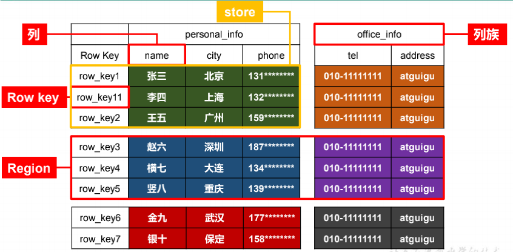
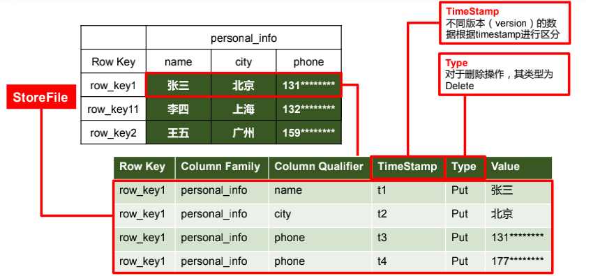
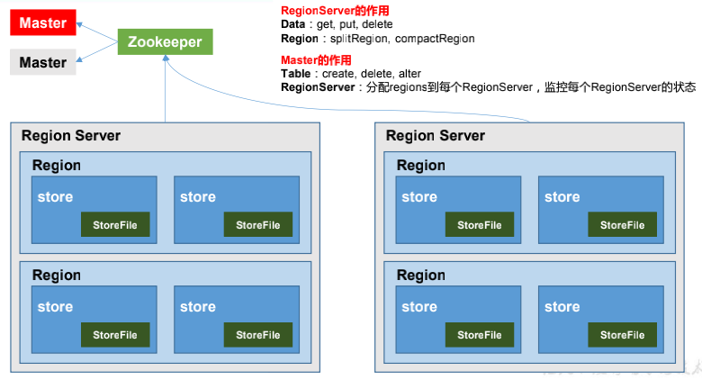
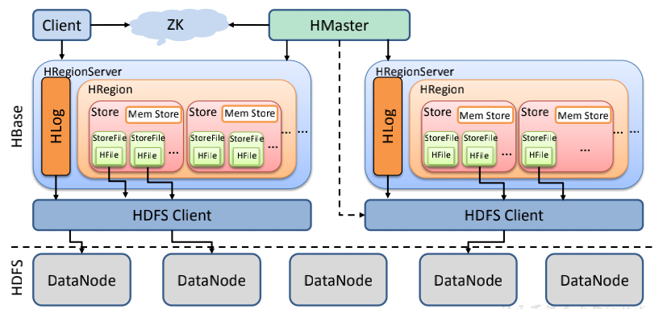
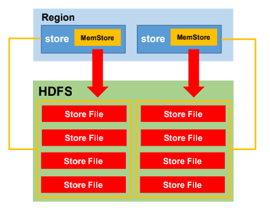

[TOC]

# 1.  **HBase** **简介**

## 1.1 HBase定义

HBase 是一种分布式、可扩展、支持海量数据存储的 NoSQL 数据库

## 1.2 HBase数据模型

逻辑上，HBase 的数据模型同关系型数据库很类似，数据存储在一张表中，有行有列。

但从 HBase 的底层物理存储结构（K-V）来看，HBase 更像是一个 multi-dimensional map

### 1.2.1 HBase逻辑结构



### 1.2.2 HBase物理存储结构



### 1.2.3 **数据模型**

1. **Name Space**

   命名空间，类似于关系型数据库的 DatabBase 概念，每个命名空间下有多个表。HBase有两个自带的命名空间，分别是 hbase 和 default，hbase 中存放的是 HBase 内置的表，default 表是用户默认使用的命名空间

2. **Region**

   类似于关系型数据库的表概念。不同的是，HBase 定义表时只需要声明列族即可，不需要声明具体的列。这意味着，往 HBase 写入数据时，字段可以动态、按需指定。因此，和关系型数据库相比，HBase 能够轻松应对字段变更的场景

3. **Row**

   HBase 表中的每行数据都由一个 **RowKey** 和多个 **Column**（列）组成，数据是按照 RowKey的字典顺序存储的，并且查询数据时只能根据 RowKey 进行检索，所以 RowKey 的设计十分重要。

4. **Column**

   HBase 中的每个列都由 Column Family(列族)和 Column Qualifier（列限定符）进行限定，例如 info：name，info：age。建表时，只需指明列族，而列限定符无需预先定义。

5. **Time Stamp**

   用于标识数据的不同版本（version），每条数据写入时，如果不指定时间戳，系统会自动为其加上该字段，其值为写入 HBase 的时间

6. **Cell**

   由{rowkey, column Family：column Qualifier, time Stamp} 唯一确定的单元。cell 中的数据是没有类型的，全部是字节码形式存贮。

## 1.3 **HBase** **基本架构**



**架构角色：**

1. **Region Server**

   Region Server 为 Region 的管理者，其实现类为 HRegionServer，主要作用如下:

   对于数据的操作：get, put, delete；

   对于 Region 的操作：splitRegion、compactRegion。

2. **Master**

   Master 是所有 Region Server 的管理者，其实现类为 HMaster，主要作用如下：

   对于表的操作：create, delete, alter

   对于 RegionServer的操作：分配 regions到每个RegionServer，监控每个 RegionServer的状态，负载均衡和故障转移

3. **Zookeeper**

   HBase 通过 Zookeeper 来做 Master 的高可用、RegionServer 的监控、元数据的入口以及集群配置的维护等工作

4. **HDFS**

   HDFS 为 HBase 提供最终的底层数据存储服务，同时为 HBase 提供高可用的支持


# 2. **HBase** **快速入门**

## 2.1 **HBase** **安装部署**

### 2.1.1 **Zookeeper** **正常部署**

首先保证 Zookeeper 集群的正常部署，并启动之

```bash
[atguigu@hadoop102 zookeeper-3.4.10]$ bin/zkServer.sh start
[atguigu@hadoop103 zookeeper-3.4.10]$ bin/zkServer.sh start
[atguigu@hadoop104 zookeeper-3.4.10]$ bin/zkServer.sh start
```

### 2.1.2 **Hadoop** **正常部署**

Hadoop 集群的正常部署并启动：

```bash
[atguigu@hadoop102 hadoop-2.7.2]$ sbin/start-dfs.sh
[atguigu@hadoop103 hadoop-2.7.2]$ sbin/start-yarn.sh
```

### 2.1.3 **HBase** **的解压**

解压 Hbase 到指定目录：

```bash
tar -zxvf hbase-1.3.1-bin.tar.gz -C /opt/module
```

### 2.1.4 **HBase** **的配置文件**

修改 HBase 对应的配置文件。

1. hbase-env.sh 修改内容

   ```bash
   export JAVA_HOME=/opt/module/jdk1.6.0_144
   export HBASE_MANAGES_ZK=false
   ```

2. hbase-site.xml 修改内容

   ```xml
   <configuration>
   <property>
   <name>hbase.rootdir</name>
   <value>hdfs://hadoop102:9000/HBase</value>
   </property>
   <property>
   <name>hbase.cluster.distributed</name>
   <value>true</value>
   </property>
   <!-- 0.98 后的新变动，之前版本没有.port,默认端口为 60000 -->
   <property>
   <name>hbase.master.port</name>
   <value>16000</value>
   </property>
   <property> 
   <name>hbase.zookeeper.quorum</name>
   <value>hadoop102,hadoop103,hadoop104</value>
     </property>
   <property> 
   <name>hbase.zookeeper.property.dataDir</name>
   <value>/opt/module/zookeeper-3.4.10/zkData</value>
   </property>
   </configuration>
   ```

3. regionservers

   ```bash
   hadoop102
   hadoop103
   hadoop104
   ```

4. 软连接 hadoop 配置文件到 HBase

   ```bash
   ln -s /opt/module/hadoop-2.7.2/etc/hadoop/core-site.xml /opt/module/hbase/conf/core-site.xml
   ln -s /opt/module/hadoop-2.7.2/etc/hadoop/hdfs-site.xml /opt/module/hbase/conf/hdfs-site.xml
   ```

### 2.1.5 **HBase** **远程发送到其他集群**

```bash
xsync hbase/
```

### 2.1.6 **HBase** **服务的启动**

1. **启动方式**1

   ```bash
   [atguigu@hadoop102 hbase]$ bin/hbase-daemon.sh start master
   [atguigu@hadoop102 hbase]$ bin/hbase-daemon.sh start regionserver
   ```

   提示：如果集群之间的节点时间不同步，会导致 regionserver 无法启动，抛出ClockOutOfSyncException 异常

   修复提示：

   a、同步时间服务

   b、属性：hbase.master.maxclockskew 设置更大的值

   ```xml
   <property>
   <name>hbase.master.maxclockskew</name>
   <value>180000</value>
   <description>Time difference of regionserver from 
   master</description>
   </property>
   ```

2. **启动方式 2**

   ```bash
   bin/start-hbase.sh
   ```

   对应的停止服务

   ```bash
   bin/stop-hbase.sh
   ```

### 2.1.7 **查看** **HBase** **页面**

启动成功后，可以通过“host:port”的方式来访问 HBase 管理页面，例如：

http://hadoop102:16010

## 2.2 **HBase Shell** **操作**

### 2.2.1 **基本操作**

1. **进入 HBase 客户端命令行**

   ```bash
    bin/hbase shell
   ```

2. **查看帮助命令**

   ```bash
    help
   ```

3. **查看当前数据库中有哪些表**

   ```bash
   list
   ```

### 2.2.2 **表的操作**

1. **创建表**

   ```bash
    create 'student','info'
   ```

2. **插入数据到表**

   ```bash
   hbase(main):003:0> put 'student','1001','info:sex','male'
   hbase(main):004:0> put 'student','1001','info:age','18'
   hbase(main):005:0> put 'student','1002','info:name','Janna'
   hbase(main):006:0> put 'student','1002','info:sex','female'
   hbase(main):007:0> put 'student','1002','info:age','20'
   ```

3. **扫描查看表数据**

   ```bash
   hbase(main):008:0> scan 'student'
   hbase(main):009:0> scan 'student',{STARTROW => '1001', STOPROW => '1001'}
   hbase(main):010:0> scan 'student',{STARTROW => '1001'}
   ```

4. **查看表结构**

   ```bash
    describe ‘student’
   ```

5. **更新指定字段的数据**

   ```bash
   hbase(main):012:0> put 'student','1001','info:name','Nick'
   hbase(main):013:0> put 'student','1001','info:age','100'
   ```

6. **查看“指定行”或“指定列族:列”的数据**

   ```bash
   hbase(main):014:0> get 'student','1001'
   hbase(main):015:0> get 'student','1001','info:name'
   ```

7. **统计表数据行数**

   ```bash
    count 'student'
   ```

8. **删除数据**

   删除某 rowkey 的全部数据：

   ```bash
   deleteall 'student','1001'
   ```

   删除某 rowkey 的某一列数据：

   ```bash
    delete 'student','1002','info:sex'
   ```

9. **清空表数据**

   ```bash
   truncate 'student'
   ```

   提示：清空表的操作顺序为先 disable，然后再 truncate。

10. **删除表**

    首先需要先让该表为 disable 状态：

    ```bash
     disable 'student'
    ```

    然后才能 drop 这个表：

    ```bash
    drop 'student'
    ```

    提示：如果直接 drop 表，会报错：ERROR: Table student is enabled. Disable it first

11. **变更表信息**

    将 info 列族中的数据存放 3 个版本

    ```bash
    hbase(main):022:0> alter 'student',{NAME=>'info',VERSIONS=>3}
    hbase(main):022:0> get 'student','1001',{COLUMN=>'info:name',VERSIONS=>3}
    ```

# 3. **HBase** **进阶**

## 3.1 **架构原理**



1. **StoreFile**

   保存实际数据的物理文件，StoreFile 以 HFile 的形式存储在 HDFS 上。每个 Store 会有一个或多个 StoreFile（HFile），数据在每个 StoreFile 中都是有序的

2. **MemStore**

   写缓存，由于 HFile 中的数据要求是有序的，所以数据是先存储在 MemStore 中，排好序后，等到达刷写时机才会刷写到 HFile，每次刷写都会形成一个新的 HFile

3. **WAL**

   由于数据要经 MemStore 排序后才能刷写到 HFile，但把数据保存在内存中会有很高的概率导致数据丢失，为了解决这个问题，数据会先写在一个叫做 Write-Ahead logfile 的文件中，然后再写入 MemStore 中。所以在系统出现故障的时候，数据可以通过这个日志文件重建。

## 3.2 **写流程**


1. Client 先访问 zookeeper，获取 hbase:meta 表位于哪个 Region Server
2. 访问对应的 Region Server，获取 hbase:meta 表，根据读请求的 namespace:table/rowkey，查询出目标数据位于哪个 Region Server 中的哪个 Region 中。并将该 table 的 region 信息以及 meta 表的位置信息缓存在客户端的 meta cache，方便下次访问
3. 与目标 Region Server 进行通讯
4. 将数据顺序写入（追加）到 WAL
5. 将数据写入对应的 MemStore，数据会在 MemStore 进行排序
6. 向客户端发送 ack
7. 等达到 MemStore 的刷写时机后，将数据刷写到 HFile

## 3.3 **MemStore Flush**



**MemStore** **刷写时机：**

1. 当某个 memstroe 的大小达到了 hbase.hregion.memstore.flush.size（默认值128M）， 其所在 region 的所有 memstore 都会刷写。 当 memstore 的大小达到了
   hbase.hregion.memstore.flush.size（默认值128M）

   hbase.hregion.memstore.block.multiplier（默认值4）时，会阻止继续往该 memstore 写数据。

2. 当 region server 中 memstore 的总大小达到

   **java_heapsize**

   ***hbase.regionserver.global.memstore.size***（默认值0.4）

   ***hbase.regionserver.global.memstore.size.lower.limit***（默认值0.95），

   region 会按照其所有 memstore 的大小顺序（由大到小）依次进行刷写。直到 region server中所有 memstore 的总大小减小到上述值以下。 

   当 region server 中 memstore 的总大小达到

   **java_heapsize*hbase.regionserver.global.memstore.size**（默认值0.4）

   时，会阻止继续往所有的 memstore 写数据。

3. 到达自动刷写的时间，也会触发 memstore flush。自动刷新的时间间隔由该属性进行

   配置 **hbase.regionserver.optionalcacheflushinterval（默认 1 **小时）

   

4. 当 WAL 文件的数量超过 **hbase.regionserver.max.logs**，region 会按照时间顺序依次进

   行刷写，直到 WAL 文件数量减小到 **hbase.regionserver.max.log** 以下（该属性名已经废弃，

   现无需手动设置，最大值为 32）。

## 3.4 **读流程**


   

   

   