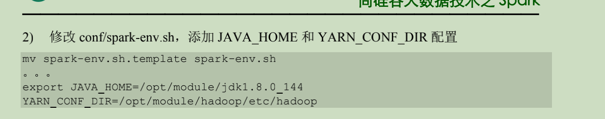

[TOC]


# 1. Spark概述

## 1.1 Spark是什么


+ Spark是一种基于内存的快速、通用、可扩展的大数据分析计算引擎，使用Scala语言编写
+ Spark Core中提供了Spark最基础与核心的功能
+ Spark SQL是Spark用来操作结构化数据的组件。通过spark SQL，用户可以使用SQL或者Apache Hive版本的SQL方言(HQL)来查询数据
+ Spark Streaming 是Spark平台上针对实时数据进行流式计算的组件，提供了丰富的处理数据流的API

## 1.2 一次性数据计算

框架在处理数据的时候，会从存储设备中读取数据，进行逻辑操作，然后将处理的结果重新存储到介质中


## 1.3 Spark VS Hadoop

+ Spark和Hadoop的根本差异是多个作业之间的数据通信问题:Spark多个作业之间数据通信是基于内存，而Hadoop是基于磁盘
+ Hadoop MapReduce由于其设计初衷并不是为了满足循环迭代数据流处理，因此在多并行运行的数据可复用场景(比如机器学习、图挖掘算法、交互式数据挖掘算法)中存在诸多计算效率等问题。所以Spark应运而生，Spark就是在传统的MapReduce计算框架的基础上，利用其计算过程的优化，从而大大加快了数据分析、挖掘的运行和读写速度，并将计算单元缩小到更适合并行计算和重复使用的RDD计算模型
+ 机器学习中ALS、凸优化梯度下降等，这些都需要基于数据集或者数据集的衍生数据反复查询反复操作。MR这种模式不太适合，即使多MR串行处理，性能和时间也是一个问题。数据的共享依赖于磁盘。另外一种是交互式数据挖掘，MR显然不擅长。而Spark所基于的Scala语言恰恰擅长函数的处理
+ Spark是一个分布式数据快速分析项目。它的核心技术是弹性分布式数据集(Resilient Distributed Datasets),提供了比MapReduce丰富的模型，可以快速在内存中对数据集进行多次迭代，来支持复杂的数据挖掘算法和图形计算算法
+ Spark Task的启动时间快。Spark采用fork线程的方式，而Hadoop采用创建新的进程的方式
+ Spark只有在shuffle的时候将数据写入磁盘，而Hadoop中多个MR作业之间的数据交互都要依赖于磁盘交互
+ Spark的缓存机制比HDFS的缓存机制高效

在绝大多数的数据计算场景中，Spar确实会比MapReduce更有优势，但是Spark是基于内存的，所以在实际的生产环境中，由于内存的限制，可能会由于内存资源不足导致Job执行失败，此时MapReduce其实是一个更好的选择，所以Spark并不能完全替代MR

## 1.4 Spark核心模块


### 1.4.1 Spark Core

Spark Core中提供了Spark最基础与最核心的功能，Spark其他功能如:Spark SQL，Spark Streaming,GraphX,MLlib都是在Spark Core的基础上进行扩展的

### 1.4.2 Spark SQL

Spark SQL是Spark用来操作结构化数据的组件。通过Spark SQL，用户可以使用SQL或者Apache Hive版本的SQL方言(HQL)来查询数据

### 1.4.3 Spark Streaming

Spark Streaming是Spark平台上针对实时数据进行流式计算的组件，提供了丰富的处理数据流的API

### 1.4.4 Spark MLlib

MLlib 是Spark提供的一个机器学习算法库。MLlib不仅提供了模型评估、数据导入等额外的功能，还提供了一些更底层的机器学习原语

### 1.4.5 Spark GraphX

GraphX是Spark面向图计算提供的框架与算法库


# 2. Spark 快速上手

## 2.1 创建Maven项目

### 2.1.1增加scala插件


### 2.1.2 增加依赖关系


### 2.1.3 WordCount


# 3. Spark运行环境

Spark作为一个数据处理框架和计算引擎，被设计在所有常见的集群环境中运行，在国内工作中主流的环境为Yarn,不过容器式环境也慢慢流行起来。


## 3.1 Local模式

所谓Local模式，就是不需要其他任何节点资源就可以在本地执行Spark代码的环境

### 3.1.1 解压缩文件


### 3.1.2 启动Local环境


### 3.1.3 命令行工具

在解压缩文件夹下的data目录中添加word.txt文件。在命令行工具中执行如下代码指令(和IDEA中代码简化版一致)


### 3.1.4 退出本地模式

Ctrl + c 或者输入Scala命令

```scala
:quit
```

### 3.1.5 提交应用

```scala
./spark-submit  \
 --class org.apache.spark.examples.SparkPi \
 --master local[2] \
 ../examples/jars/spark-examples_2.12-3.0.0.jar \
 10
```

+ --class 表示要执行的程序的主类，此处可以替换成自己写的程序
+ --master local[2] 部署模式，默认为本地模式，数字表示分配的虚拟CPU核数量
+ spark-examples_2.12-3.0.0.jar 运行的应用类所在的jar包，实际使用时，可以设定为自己打的Jar包
+ 数字10 表示程序的入口参数，用于设定当前应用的任务数量


## 3.2 Standalone模式

Spark的Standalone模式体现了经典的master-slave模式

集群规划:


### 3.2.1 解压缩文件


### 3.2.2 修改配置文件

+ 进入解压缩后路径的conf目录，修改slaves.template文件名为slaves

  ```shell
  mv slaves.template slaves
  ```

+ 修改slaves文件，添加work节点

  ```shell
  Hadoop02
  Hadoop03
  Hadoop04
  ```

+ 修改spark-env.sh.template文件名为spark-env.sh

  ```shell
  mv spark-env.sh.template spark-env.sh
  ```

+ 在spark-env.sh文件中追加JAVA_HOME环境变量和集群对应的master节点

  ```shell
  export JAVA_HOME=/opt/jdk1.8.0_261
  SPARK_MASTER_HOST=Hadoop02
  SPARK_MASTER_PORT=7077
  ```

  注意:7077端口，相当于Hadoop3内部通信的8020端口，此处的端口需要确定自己的Hadoop配置

+  分发spark-standlone目录

  ```shell
  xsync.sh  spark-standalone
  ```

  

### 3.2.3 启动集群

+ 执行脚本命令

  ```shell
  sbin/start-all.sh
  ```

  

+ 查看三台服务器的运行进程

  


+ 查看Master资源监控Web UI界面:http://hadoop02:8080/

  

### 3.2.4 提交应用

```shell
./spark-submit  \
 --class org.apache.spark.examples.SparkPi \
 --master spark://Hadoop02:7077  \
 ../examples/jars/spark-examples_2.12-3.0.0.jar \
 10
```

+ --class 表示要执行程序的主类

+ --master spark://Hadoop02:7077 独立部署模式，连接到Spark集群

+ spark-examples_2.12-3.0.0.jar 运行类所在的Jar包

+ 数字10表示程序的入口参数，用于设定当前应用的任务数量

  

+ 执行任务时会产生多个Java进程

  

+ 执行任务时，默认采用服务器集群节点的总核数，每个节点内存 1024M

  

### 3.2.5 提交参数说明

在提交应用中一般会同时提交一些参数

```shell
bin/spark-submit \
--class <main-class>
--master <master-url> \
... # other options
<application-jar> \
[application-arguments]
```


### 3.2.6 配置历史服务器

由于spark-shell停止后，集群监控Hadoop02:4040页面就看不到历史任务的运行情况，所以开发时都配置历史服务器记录任务运行情况

+ 修改spark-defaults.conf.template文件名为spark-defaults.conf

+ 修改spark-defaults.conf文件，配置日志存储路径

  ```shell
  spark.eventLog.enabled true
  spark.eventLog.dir hdfs://Hadoop02:9000/directory
  ```

注意:需要启动Hadoop集群，HDFS上的directory目录需要提前存在

```shell
sbin/start-dfs.sh
hadoop fs -mkdir /directory
```

+ 修改spark-env.sh文件，添加日志配置

  ```shell
  export SPARK_HISTORY_OPTS="
  -Dspark.history.ui.port=18080
  -Dspark.history.fs.logDirectory=hdfs://Hadoop02:9000/directory
  -Dspark.history.retainedApplications=30"
  ```

  1. 参数1含义:WEB UI访问的端口为18080
  2. 参数2含义:指定历史服务器日志存储路径
  3. 参数3含义:指定保存Application历史记录的个数，如果超过这个值，旧的应用程序信息将被删除，这个是内存中的应用数，而不是页面上显示的应用数

+ 分发配置文件

  ```shell
  xsync.sh  spark-defaults.conf
  ```

+ 重新执行任务

  ```shell
  ./spark-submit  \
   --class org.apache.spark.examples.SparkPi \
   --master spark://Hadoop02:7077  \
   ../examples/jars/spark-examples_2.12-3.0.0.jar \
   10
  ```

  

+ 查看历史服务:Hadoop02:18080

  

### 3.2.7 配置高可用(HA)

所谓的高可用是因为当前集群中的Master节点只有一个，所以会存在单点故障问题。所以为了解决单点故障问题，需要在集群中配置多个Master节点，一旦处于活动状态的Master发生故障时，由备用Masterr提供服务，保证作业可以继续执行。这里的高可用一般采用Zookeeper设置。

集群规划:


+ 停止集群

  ```shell
  sbin/stop-all.sh
  ```

+ 启动Zookeeper

  ```shell
  sh zkServer.sh start
  ```

+ 修改spark-env.sh文件添加如下配置

  ```shell
  #注释掉下面这两行
  # SPARK_MASTER_HOST=Hadoop02
  # SPARK_MASTER_PORT=7077
  
  #Master监控页面默认访问端口为8080，但是可能会和Zookeeper冲突，所以改成8989，也可以自定义
  SPARK_MASTER_WEBUI_PORT=8989
  export SPARK_DAEMON_JAVA_OPTS="
  -Dspark.deploy.recoveryMode=ZOOKEEPER
  -Dspark.deploy.zookeeper.url=Hadoop02,Hadoop03,Hadoop04
  -Dspark.deploy.zookeeper.dir=/spark"
  ```

+  分发配置文件

  ```shell
  xsync.sh spark-env.sh
  ```

+ 启动集群

  ```shell
  sbin/start-all.sh
  ```

  

+ 启动Hadoop03的单独的Master节点，此时Hadoop02节点Master状态处于备用状态

  ```shell
  sbin/start-master.sh
  ```

  

+ 提交应用到高可用集群

  ```shell
  ./spark-submit  \
   --class org.apache.spark.examples.SparkPi \
   --master spark://Hadoop02:7077,Hadoop03:7077  \
   ../examples/jars/spark-examples_2.12-3.0.0.jar \
   10
  ```

+ 停止Hadoop02的Master资源监控进程

  

+ 查看Hadoop03的Master资源监控Web UI,稍等一段时间后，Hadoop03节点的Master状态提升为活动状态

  

## 3.3 Yarn模式


该操作这个



