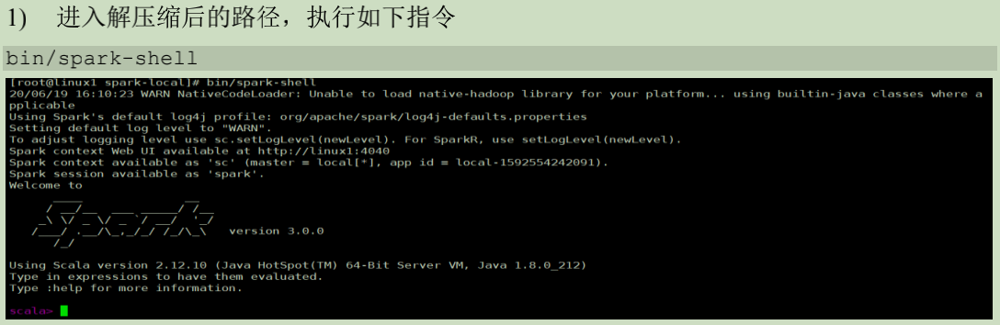

[TOC]


# 1. Spark概述

## 1.1 Spark是什么


+ Spark是一种基于内存的快速、通用、可扩展的大数据分析计算引擎，使用Scala语言编写
+ Spark Core中提供了Spark最基础与核心的功能
+ Spark SQL是Spark用来操作结构化数据的组件。通过spark SQL，用户可以使用SQL或者Apache Hive版本的SQL方言(HQL)来查询数据
+ Spark Streaming 是Spark平台上针对实时数据进行流式计算的组件，提供了丰富的处理数据流的API

## 1.2 一次性数据计算

框架在处理数据的时候，会从存储设备中读取数据，进行逻辑操作，然后将处理的结果重新存储到介质中


## 1.3 Spark VS Hadoop

+ Spark和Hadoop的根本差异是多个作业之间的数据通信问题:Spark多个作业之间数据通信是基于内存，而Hadoop是基于磁盘
+ Hadoop MapReduce由于其设计初衷并不是为了满足循环迭代数据流处理，因此在多并行运行的数据可复用场景(比如机器学习、图挖掘算法、交互式数据挖掘算法)中存在诸多计算效率等问题。所以Spark应运而生，Spark就是在传统的MapReduce计算框架的基础上，利用其计算过程的优化，从而大大加快了数据分析、挖掘的运行和读写速度，并将计算单元缩小到更适合并行计算和重复使用的RDD计算模型
+ 机器学习中ALS、凸优化梯度下降等，这些都需要基于数据集或者数据集的衍生数据反复查询反复操作。MR这种模式不太适合，即使多MR串行处理，性能和时间也是一个问题。数据的共享依赖于磁盘。另外一种是交互式数据挖掘，MR显然不擅长。而Spark所基于的Scala语言恰恰擅长函数的处理
+ Spark是一个分布式数据快速分析项目。它的核心技术是弹性分布式数据集(Resilient Distributed Datasets),提供了比MapReduce丰富的模型，可以快速在内存中对数据集进行多次迭代，来支持复杂的数据挖掘算法和图形计算算法
+ Spark Task的启动时间快。Spark采用fork线程的方式，而Hadoop采用创建新的进程的方式
+ Spark只有在shuffle的时候将数据写入磁盘，而Hadoop中多个MR作业之间的数据交互都要依赖于磁盘交互
+ Spark的缓存机制比HDFS的缓存机制高效

在绝大多数的数据计算场景中，Spar确实会比MapReduce更有优势，但是Spark是基于内存的，所以在实际的生产环境中，由于内存的限制，可能会由于内存资源不足导致Job执行失败，此时MapReduce其实是一个更好的选择，所以Spark并不能完全替代MR

## 1.4 Spark核心模块


### 1.4.1 Spark Core

Spark Core中提供了Spark最基础与最核心的功能，Spark其他功能如:Spark SQL，Spark Streaming,GraphX,MLlib都是在Spark Core的基础上进行扩展的

### 1.4.2 Spark SQL

Spark SQL是Spark用来操作结构化数据的组件。通过Spark SQL，用户可以使用SQL或者Apache Hive版本的SQL方言(HQL)来查询数据

### 1.4.3 Spark Streaming

Spark Streaming是Spark平台上针对实时数据进行流式计算的组件，提供了丰富的处理数据流的API

### 1.4.4 Spark MLlib

MLlib 是Spark提供的一个机器学习算法库。MLlib不仅提供了模型评估、数据导入等额外的功能，还提供了一些更底层的机器学习原语

### 1.4.5 Spark GraphX

GraphX是Spark面向图计算提供的框架与算法库


# 2. Spark 快速上手

## 2.1 创建Maven项目

### 2.1.1增加scala插件


### 2.1.2 增加依赖关系


### 2.1.3 WordCount


# 3. Spark运行环境

Spark作为一个数据处理框架和计算引擎，被设计在所有常见的集群环境中运行，在国内工作中主流的环境为Yarn,不过容器式环境也慢慢流行起来。


## 3.1 Local模式

所谓Local模式，就是不需要其他任何节点资源就可以在本地执行Spark代码的环境

### 3.1.1 解压缩文件


### 3.1.2 启动Local环境




### 3.1.3 命令行工具

在解压缩文件夹下的data目录中添加word.txt文件。在命令行工具中执行如下代码指令(和IDEA中代码简化版一致)


### 3.1.4 退出本地模式

Ctrl + c 或者输入Scala命令

```scala
:quit
```

### 3.1.5 提交应用

```scala
./spark-submit  \
 --class org.apache.spark.examples.SparkPi \
 --master local[2] \
 ../examples/jars/spark-examples_2.12-3.0.0.jar \
 10
```

+ --class 表示要执行的程序的主类，此处可以替换成自己写的程序
+ --master local[2] 部署模式，默认为本地模式，数字表示分配的虚拟CPU核数量
+ spark-examples_2.12-3.0.0.jar 运行的应用类所在的jar包，实际使用时，可以设定为自己打的Jar包
+ 数字10 表示程序的入口参数，用于设定当前应用的任务数量


## 3.2 Standalone模式

Spark的Standalone模式体现了经典的master-slave模式

集群规划:


### 3.2.1 解压缩文件


### 3.2.2 修改配置文件

+ 进入解压缩后路径的conf目录，修改slaves.template文件名为slaves

  ```shell
  mv slaves.template slaves
  ```

+ 修改slaves文件，添加work节点

  ```shell
  Hadoop02
  Hadoop03
  Hadoop04
  ```

+ 修改spark-env.sh.template文件名为spark-env.sh

  ```shell
  mv spark-env.sh.template spark-env.sh
  ```

+ 在spark-env.sh文件中追加JAVA_HOME环境变量和集群对应的master节点

  ```shell
  export JAVA_HOME=/opt/jdk1.8.0_261
  SPARK_MASTER_HOST=Hadoop02
  SPARK_MASTER_PORT=7077
  ```

  注意:7077端口，相当于Hadoop3内部通信的8020端口，此处的端口需要确定自己的Hadoop配置

+  分发spark-standlone目录

  ```shell
  xsync.sh  spark-standalone
  ```

  

### 3.2.3 启动集群

+ 执行脚本命令

  ```shell
  sbin/start-all.sh
  ```

  

+ 查看三台服务器的运行进程

  


+ 查看Master资源监控Web UI界面:http://hadoop02:8080/

  

### 3.2.4 提交应用

```shell
./spark-submit  \
 --class org.apache.spark.examples.SparkPi \
 --master spark://Hadoop02:7077  \
 ../examples/jars/spark-examples_2.12-3.0.0.jar \
 10
```

+ --class 表示要执行程序的主类

+ --master spark://Hadoop02:7077 独立部署模式，连接到Spark集群

+ spark-examples_2.12-3.0.0.jar 运行类所在的Jar包

+ 数字10表示程序的入口参数，用于设定当前应用的任务数量

  

+ 执行任务时会产生多个Java进程

  

+ 执行任务时，默认采用服务器集群节点的总核数，每个节点内存 1024M

  

### 3.2.5 提交参数说明

在提交应用中一般会同时提交一些参数

```shell
bin/spark-submit \
--class <main-class>
--master <master-url> \
... # other options
<application-jar> \
[application-arguments]
```


### 3.2.6 配置历史服务器

由于spark-shell停止后，集群监控Hadoop02:4040页面就看不到历史任务的运行情况，所以开发时都配置历史服务器记录任务运行情况

+ 修改spark-defaults.conf.template文件名为spark-defaults.conf

+ 修改spark-defaults.conf文件，配置日志存储路径

  ```shell
  spark.eventLog.enabled true
  spark.eventLog.dir hdfs://Hadoop02:9000/directory
  ```

注意:需要启动Hadoop集群，HDFS上的directory目录需要提前存在

```shell
sbin/start-dfs.sh
hadoop fs -mkdir /directory
```

+ 修改spark-env.sh文件，添加日志配置

  ```shell
  export SPARK_HISTORY_OPTS="
  -Dspark.history.ui.port=18080
  -Dspark.history.fs.logDirectory=hdfs://Hadoop02:9000/directory
  -Dspark.history.retainedApplications=30"
  ```

  1. 参数1含义:WEB UI访问的端口为18080
  2. 参数2含义:指定历史服务器日志存储路径
  3. 参数3含义:指定保存Application历史记录的个数，如果超过这个值，旧的应用程序信息将被删除，这个是内存中的应用数，而不是页面上显示的应用数

+ 分发配置文件

  ```shell
  xsync.sh  spark-defaults.conf
  ```

+ 重新执行任务

  ```shell
  ./spark-submit  \
   --class org.apache.spark.examples.SparkPi \
   --master spark://Hadoop02:7077  \
   ../examples/jars/spark-examples_2.12-3.0.0.jar \
   10
  ```

  

+ 查看历史服务:Hadoop02:18080

  

### 3.2.7 配置高可用(HA)

所谓的高可用是因为当前集群中的Master节点只有一个，所以会存在单点故障问题。所以为了解决单点故障问题，需要在集群中配置多个Master节点，一旦处于活动状态的Master发生故障时，由备用Masterr提供服务，保证作业可以继续执行。这里的高可用一般采用Zookeeper设置。

集群规划:


+ 停止集群

  ```shell
  sbin/stop-all.sh
  ```

+ 启动Zookeeper

  ```shell
  sh zkServer.sh start
  ```

+ 修改spark-env.sh文件添加如下配置

  ```shell
  #注释掉下面这两行
  # SPARK_MASTER_HOST=Hadoop02
  # SPARK_MASTER_PORT=7077
  
  #Master监控页面默认访问端口为8080，但是可能会和Zookeeper冲突，所以改成8989，也可以自定义
  SPARK_MASTER_WEBUI_PORT=8989
  export SPARK_DAEMON_JAVA_OPTS="
  -Dspark.deploy.recoveryMode=ZOOKEEPER
  -Dspark.deploy.zookeeper.url=Hadoop02,Hadoop03,Hadoop04
  -Dspark.deploy.zookeeper.dir=/spark"
  ```

+  分发配置文件

  ```shell
  xsync.sh spark-env.sh
  ```

+ 启动集群

  ```shell
  sbin/start-all.sh
  ```

  

+ 启动Hadoop03的单独的Master节点，此时Hadoop02节点Master状态处于备用状态

  ```shell
  sbin/start-master.sh
  ```

  

+ 提交应用到高可用集群

  ```shell
  ./spark-submit  \
   --class org.apache.spark.examples.SparkPi \
   --master spark://Hadoop02:7077,Hadoop03:7077  \
   ../examples/jars/spark-examples_2.12-3.0.0.jar \
   10
  ```

+ 停止Hadoop02的Master资源监控进程

  

+ 查看Hadoop03的Master资源监控Web UI,稍等一段时间后，Hadoop03节点的Master状态提升为活动状态

  

## 3.3 Yarn模式

独立部署(Standalone)模式由Spark自身提供资源，无需其他框架提供资源。这种方式降低了和其他第三方资源框架的耦合性，独立性非常强。但是Spark主要是计算框架，而不是资源调度框架，所以本身提供的资源调度并不是它的强项，所以还是和其他专业的资源调度框架集成会更靠谱一些。

### 3.3.1 解压缩文件

将spark-3.0.0-bin-hadoop3.2.tgz文件上传到Linux并解压缩，放到指定位置

```shell
tar -zvxf spark-3.0.0-bin-hadoop3.2.tgz  -C ../module/
```

### 3.3.2 修改配置文件

1. 修改 /opt/module/hadoop-3.3.0/etc/hadoop/yarn-site.xml，并分发

   ```xml
   <!--是否启动一个线程检查每个任务正使用的物理内存量，如果任务超出分配值，则直接将其杀掉，默认
   是 true -->
   <property>
   <name>yarn.nodemanager.pmem-check-enabled</name>
   <value>false</value>
   </property>
   <!--是否启动一个线程检查每个任务正使用的虚拟内存量，如果任务超出分配值，则直接将其杀掉，默认
   是 true -->
   <property>
   <name>yarn.nodemanager.vmem-check-enabled</name>
   <value>false</value>
   </property>
   ```

2. 修改/opt/module/spark-yarn/conf/spark-env.sh,添加如下配置

   ```shell
   YARN_CONF_DIR=/opt/module/hadoop-3.3.0/etc/hadoop
   JAVA_HOME=/opt/jdk1.8.0_261
   ```

### 3.3.3 启动HDFS以及Yarn集群

+ 启动Zookeeper集群
+ 启动Hadoop集群
+ 启动Spark集群

### 3.3.4 提交应用

```shell
./spark-submit  \
--class org.apache.spark.examples.SparkPi \
--master yarn \
--deploy-mode cluster \
/opt/module/spark-yarn/examples/jars/spark-examples_2.12-3.0.0.jar \
10
```

### 3.3.5 配置历史服务器

1. 修改spark-defaults.conf.template文件名为spark-defaults.conf

2. 修改spark-defaults.conf文件，配置日志存储路径

   ```shell
   spark.eventLog.enabled true
   spark.eventLog.dir hdfs://Hadoop02:9000/directory
   ```

   注意:需要启动hadoop集群，HDFS上的目录需要提前存在

   ```shell
   sbin/start-dfs.sh
   hadoop fs -mkdir /directory
   ```

3. 修改spark-env.sh，添加日志配置

   ```shell
   export SPARK_HISTORY_OPTS="
   -Dspark.history.ui.port=18080
   -Dspark.history.fs.logDirectory=hdfs://Hadoop02:9000/directory
   -Dspark.history.retainedApplications=30"
   ```

   + 参数1含义:WEB UI访问的端口好为18080
   + 参数2含义:指定历史服务器日志存储路径
   + 参数3含义指定保存Application历史记录的个数，如果超过这个值，旧的应用程序信息将被删除，这个是内存中的应用数，而不是页面上显示的应用数

   

4. 修改spark-defaults.conf

   ```shell
   spark.yarn.historyServer.address=Hadoop02:18080
   spark.history.ui.port=18080
   ```

   

5. 启动历史服务

   ```shell
   sbin/start-history-server.sh
   ```

   

6. 重新提交应用

   ```shell
   ./spark-submit  \
   --class org.apache.spark.examples.SparkPi \
   --master yarn \
   --deploy-mode client \
   /opt/module/spark-yarn/examples/jars/spark-examples_2.12-3.0.0.jar \
   10
   ```

   

7. Web页面查看日志

   

## 3.4 K8S & Mesos模式

Mesos是Apache下的开源分布式资源管理框架，它被称为是分布式系统的内核，在Twitter得到广泛应用，管理着Twitter超过30，0000台服务器上的应用部署，但是在国内，依然使用着传统的Hadoop大数据框架，所以国内使用Mesos框架的并不多，但是原理其实都是差不多。


容器化部署是目前业界很流行的一项技术，基于Docker镜像运行能够让用户更加方便地对应用进行管理和运维。容器管理工具最为流行的就是Kubernetes(K8S),而Spark也在最近的版本中支持了K8S部署模式

https://spark.apache.org/docs/latest/running-on-kubernetes.html


## 3.5 Windows模式

Spark提供了可以在windows系统下启动本地集群的方式。

### 3.5.1 解压缩文件

将文件 spark-3.0.0-bin-hadoop3.2.tgz 解压缩到无中文无空格的路径中

### 3.5.2 启动本地环境

1. 执行解压缩文件路径下 bin 目录中的 spark-shell.cmd 文件，启动 Spark 本地环境
   
2. 在 bin 目录中创建 input 目录，并添加 word.txt 文件, 在命令行中输入脚本代码
   

### 3.5.3 命令行提交应用

在 DOS 命令行窗口中执行提交指令

```shell
spark-submit --class org.apache.spark.examples.SparkPi --master 
local[2] ../examples/jars/spark-examples_2.12-3.0.0.jar 10
```


## 3.6 部署对比


## 3.7 端口号

+ Spark查看当前Spark-shell运行任务情况端口号:4040(计算)
+ Spark Master内部通信服务端口号:7077
+ Standalone模式下，Spark Master Web端口号：8080(资源)
+ Spark历史服务器端口号:18080
+ Hadoop Yarn任务运行情况查看端口号：8088

# 4. Spark运行架构

## 4.2 运行架构

Spark框架的核心是一个计算引擎，整体来说，它采用了标准master-slave的结构

如下图所示，展示了一个Spark执行时的基本结构。图中的Driver表示master,负责管理整个集群中的作业任务调度。图中的Executor则是slave,负责实际执行任务。


## 4.2 核心组件

从上图可以看出，对于Spark框架有两个核心组件:

### 4.2.1 Driver

Spark驱动器节点，用于执行Spark任务中的main方法，负责实际代码的执行工作。

Driver在Spark作业执行时主要负责:

+ 将用户程序转化为作业(job)
+ 在Executor之间调度任务(task)
+ 跟踪Exexutor的执行情况
+ 通过UI展示查询运行情况

实际上，无法准确地描述Driver的定义，因为在整个的编程过程中没有看到任何有关Driver的字眼。所以简单理解，所谓的Driver就是驱使整个应用运行起来的程序，也称之为Driver类

### 4.2.2 Executor

Spark Executor是集群中工作节点(Worker)中的一个JVM 进程，负责在Spark作业中运行具体任务(Task),彼此之间相互独立。Spark应用启动时，Executor节点被同时启动，并且始终伴随着整个Spark应用的声明周期而存在。如果有Executor节点发生了故障或崩溃，Spark应用也可以继续执行，会将出错节点上的任务调度到其他Executor节点上继续运行

Executor有两个核心功能:

+ 负责运行组成Spark应用的任务，并将结果返回给驱动器进程
+ 它们通过自身的块管理器(Block Manager)为用户程序中要求缓存的RDD提供内存式存储。RDD是直接缓存在Executor进程内的，因此任务可以在运行时充分利用缓存数据加速运算

### 4.2.3 Master & Worker

Spark集群的独立部署环境中，不需要依赖其他的资源调度框架，自身就实现了资源调度的功能，所以环境中还有其他两个核心组件：Master和Worker,这里的Master是一个进程，主要负责资源的调度和分配，并进行集群的监控等职责，类似于Yarn环境中的RM，而Worker呢，也是进程，一个Worker运行在集群中的一台服务器上，由Master分配资源对数据进行并行的处理和计算，类似于Yarn环境中NM

### 4.2.4 ApplicationMaster

Hadoop用户向YARN集群提交应用程序时，提交程序中应该包含ApplicationMaster,用于向资源调度器申请执行任务的资源容器Container,运行用户自己的程序任务job,监控整个任务的执行，跟踪整个任务的状态，处理任务失败等异常情况。

说的简单点就是ResourceManager(资源)和Driver(计算)之间的解耦合靠的就是ApplicationMaster.

## 4.3核心概念

### 4.3.1 Executor与Core

Spark Executor是集群中运行在工作节点(Worker)中的一个JVM进程，是整个集群中的专门用于计算的节点。在提交应用时，可以提供参数指定计算节点的个数以及对应的资源。这里的资源一般指的是工作节点Executor的内存大小和使用的虚拟CPU核(Core)数量。

应用程序相关启动参数如下:


### 4.3.2 并行度(Parallelism)

在分布式计算框架中一般都是多个任务同时执行，由于任务分布在不同的计算节点进行计算，所以能够真正地实现多任务并行执行，注意这里是并行而不是并发。我们将整个集群并行执行任务的数量称之为并行度。一个作业到底并行度是多少取决于框架的默认配置也可以在应用程序运行过程中动态地修改。

### 4.3.3 有向无环图(DAG)


大数据计算引擎框架我们根据使用方式的不同一般会分为四类，其中第一类就是Hadoop所承载的MapReduce,它将计算分为两个阶段，分别为Map阶段和Reduce阶段。对于上层应用来说，就不得不想方设法去拆分算法，甚至于不得不在上层应用实现多个Job的串联，以完成一个完整的算法，例如迭代计算。由于这样的弊端，催生了支持DAG的框架。因此支持DAG的框架被划分为第二代计算引擎。如Tez以及更上层的Oozie。这里不去细究各种DAG的实现之间的区别，不过对于当时的Tez和Oozie来说，大多还是批处理的任务。接下来就是以Spark为代表的第三代的计算引擎。第三代计算引擎的主要特点是Job内部的DAG支持(不跨越Job),以及实时计算。

这里所谓的有向无环图，并不是真正意义上的图形，而是由Spark程序直接映射成的数据流的高级抽象模型。简单理解就是将整个程序的执行过程用图形表示出来，这样更直观，更便于理解，可以用于表示程序的拓扑结构。

DAG(Directed Acyclic Graph)有向无环图是由点和线组成的拓扑图形，该图形具有方向，不会闭环。

## 4.4 提交流程

所谓的提交流程，其实就是我们开发人员根据需求写的应用程序通过Spark客户端提交给Spark运行环境执行计算的流程。在不同的部署环境中，这个提交过程基本相同，但是又有细微的差别，这里不进行详细的比较。但是因为在国内工作中，将Spark应用部署到Yarn环境中会更多一些，所以下面所讲的提交流程是基于Yarn环境的。


Spark应用程序提交到Yarn环境中执行的时候，一般会有两种部署执行的方式:Client和Cluster。两种模式主要区别在于:Driver程序的运行节点位。

### 4.2.1 Yarn Client模式

Client模式将用于监控和调度的Driver模块在客户端执行，而不是在Yarn中，所以一般用于测试。

+ Driverz在任务提交的本地机器上运行
+ Driver启动后会和ResourceManager通讯申请启动ApplicationMaster
+ ResourceManager分配container，在合适的NodeManager上启动ApplicationMaster,负责向ResourceManager申请Executor内存
+ ResourceManager接到ApplicationMaster的资源申请后会分配container,然后ApplicationMaster在资源分配指定的NodeManager上启动Executor进程。
+ Executor进程启动后会向Driver反向注册，Executor全部注册完成后Driver开始执行Main函数
+ 之后执行到Action算子时，触发一个Job,并根据宽依赖开始划分stage，每个stage生成对应的TaskSet，之后将task分发到各个Executor上执行。

### 4.2.2 Yarn Cluster模式

Cluster模式将用于监控和调度的Driver模块启动在Yarn集群资源中执行。一般应用于实际生产环境。

+ 在Yarn Cluster模式下，任务提交后会和ResourceManager通讯申请启动ApplicationMaster
+ 随后ResourceManager分配container,在合适的NodeManager上启动ApplicationMaster,此时的ApplicationMaster就是Driver
+ Driver启动后ResourceManager申请Executor内存，ResourceManager接到ApplicationMaster的资源申请会分配container,然后在合适的NodeManager上启动Executor进程
+ Executor进程启动后会向Driver反向注册，Executor全部注册完成后Driver开始执行Main函数
+ 之后执行到Actioin算子时，触发一个Job,并根据宽依赖开始划分stage,每个stage生成对应的TaskSet,之后将task分发到各个Executor上执行。

# 5. Spark核心编程

Spark计算框架为了能够进行高并发和高吞吐的数据处理，封装了三大数据结构，用于处理不同的应用场景。三大数据结构分别是:

+ RDD:弹性分布式数据集
+ 累加器:分布式共享只写变量
+ 广播变量:分布式共享只读变量

## 5.1 RDD

### 5.1.1 什么是RDD

RDD(Resilient Distributed Dataset)叫做弹性分布式数据集，是Spark中最基本的数据处理模型。代码中是一个抽象类，它代表一个弹性的、不可变、可分区、里面的元素可并行计算的集合。

1. 弹性
   + 存储的弹性:内存与磁盘的自动切换 
   + 容错的弹性:数据丢失可以自动恢复
   + 计算的弹性:计算出错重试机制
   + 分片的弹性:可根据需要重新分片
2. 分布式:数据存储在大数据集群不同节点上
3. 数据集:RDD封装了计算逻辑，并不保存数据
4. 数据抽象：RDD是一个抽象类，需要子类具体实现
5. 不可变：RDD封装了计算逻辑，是不可以改变的，想要改变，只能产生新的RDD，在新的RDD里面封装计算逻辑
6. 可分区、并行计算

### 5.1.2 核心属性


+ 分区列表
  RDD数据结构中存在分区列表，用于执行任务时并行计算，是实现分布式计算的重要属性
  
+ 分区计算函数
  Spark在计算时，是使用分区函数对每一个分区进行计算
  
+ RDD之间的依赖关系
  RDD是计算模型的封装，当需求中需要将多个计算模型进行组合时，就需要将多个RDD建立依赖关系
  

+ 分区器(可选)
  当数据为KV类型数据时，可以通过设定分区器自定义数据的分区
  

+ 首选位置(可选)

  计算数据时，可以根据计算节点的状态选择不同的节点位置进行计算
  

### 5.1.3执行原理

从计算的角度来讲，数据处理过程中需要计算资源(内存&CPU)和计算模型(逻辑)，执行时，需要将计算资源和计算模型进行协调和整合。

Spark框架在执行时，先申请资源，然后将应用程序的数据处理逻辑分解成一个一个的计算任务。然后将任务发到已经分配资源的计算节点上，按照指定的计算模型进行数据的计算。最后得到计算结果。

RDD是Spark框架中用于数据处理的核心模型，下面是Yarn环境中，RDD的工作原理：

1. 启动YARN集群环境
   
2. Spark通过申请资源创建调度节点和计算节点
   

3. Spark根据需求将计算逻辑根据分区划分成不同的任务
   

4. 调度节点将任务根据节点状态发送到对应的计算节点进行计算
   

   从以上流程可以看出RDD在整个流程中主要用于将逻辑进行封装，并生成Task发送给Executor节点执行计算

   

### 5.1.4 基础编程

#### 5.1.4.1 RDD创建

在Spark中创建RDD的方式分为4种:

1. 从集合(内存)中创建RDD
   从集合中创建RDD,Spark主要提供了两个方法parallelize和makeRDD

   ```scala
   package net.codeshow.spark.core.rdd.builder
   
   import org.apache.spark.{SparkConf, SparkContext}
   
   object Spark01_RDD_Memory {
     def main(args: Array[String]): Unit = {
       //@todo 准备环境
       val sparkConf = new SparkConf().setMaster("local[*]").setAppName("RDD")
       val sc = new SparkContext(sparkConf)
   
       //@todo 创建RDD
       //从内存中创建RDD,将内存中的集合的数据作为处理的数据源
       val seq = Seq[Int](1, 2, 3, 4)
       //parallelize : 并行
       //    val rdd = sc.parallelize(seq)
       //上行代码的等价写法
       //makeRDD 在底层实现时，还是调用的parallelize
       val rdd = sc.makeRDD(seq)
       rdd.collect().foreach(println)
       //@todo 关闭环境
       sc.stop()
     }
   }
   ```

2. 从外部存储(文件)创建RDD
   由外部存储系统的数据创建RDD包括本地的文件系统、所有Hadoop支持的数据集比如HDFS、HBase等

   ```scala
   package net.codeshow.spark.core.rdd.builder
   
   import org.apache.spark.{SparkConf, SparkContext}
   
   object Spark02_RDD_File {
     def main(args: Array[String]): Unit = {
       //@todo 准备环境
       val sparkConf = new SparkConf().setMaster("local[*]").setAppName("RDD")
       val sc = new SparkContext(sparkConf)
   
       //@todo 创建RDD
       //从文件中创建RDD,将文件中的数据作为处理的数据源
       //路径默认是以当前环境的根路径为基准
       //可以写绝对路径，也可以写相对路径
       //    val rdd = sc.textFile("datas/1.txt")
       //除了可以像上面那样，指定文件的路径，也可以指定多个文件所在的目录
       //    val rdd = sc.textFile("datas")
       //路径还可以使用通配符
       //    val rdd = sc.textFile("datas/1*.txt")
       //path还可以是分布式文件系统路径:HDFS
       val rdd = sc.textFile("hdfs://Hadoop02:9000/test.txt")
       rdd.collect().foreach(println)
       //@todo 关闭环境
       sc.stop()
     }
   }
   ```

3. 从其他RDD创建
   主要是通过一个RDD运算完后，再产生新的RDD

4. 直接创建RDD(new)
   使用new的方式直接构造RDD,一般由Spark框架自身使用。

#### 5.1.4.2 RDD并行度与分区


