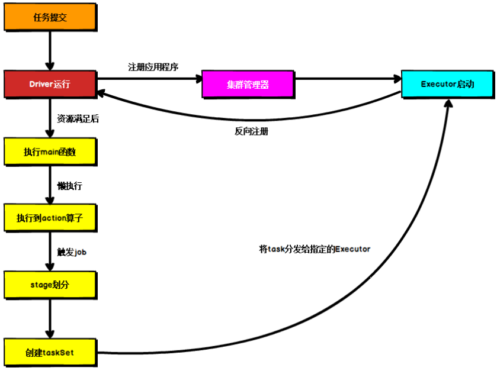
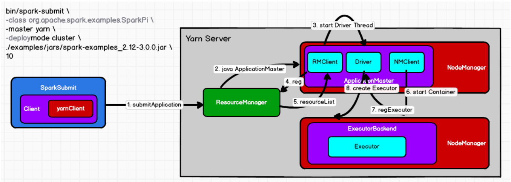
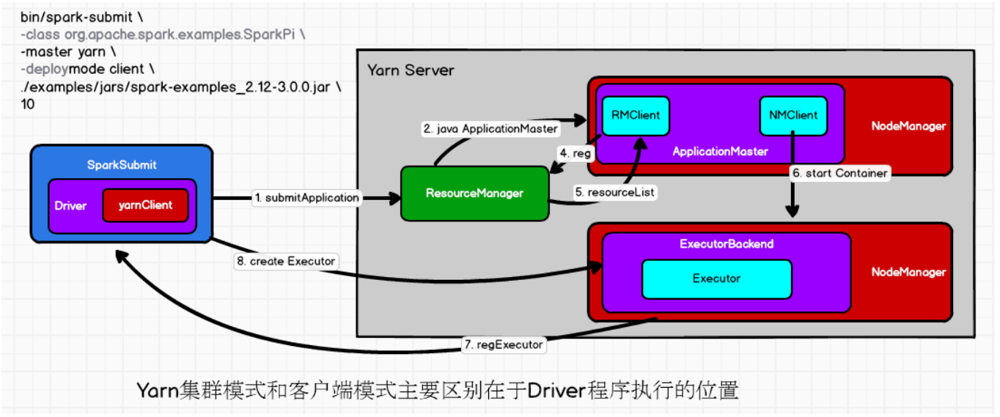
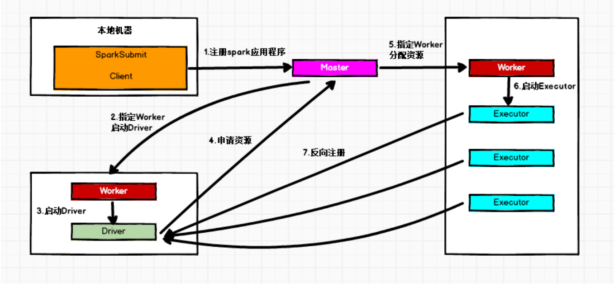
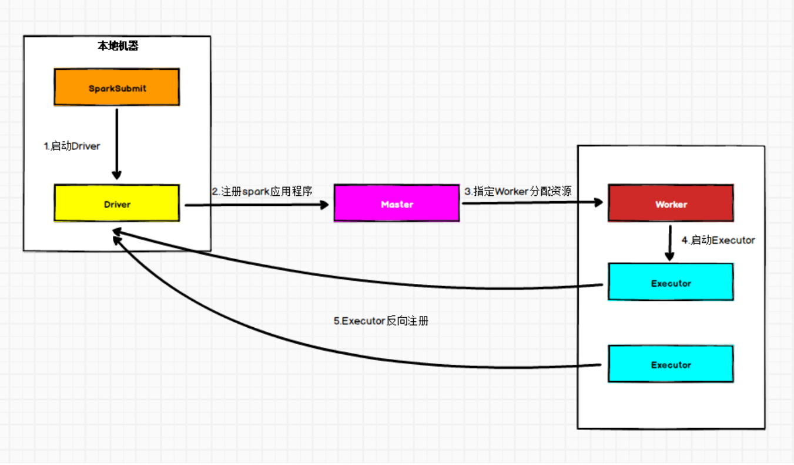
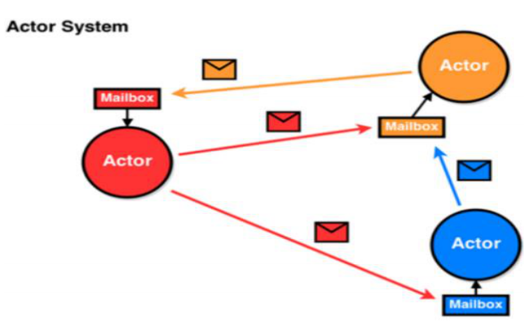
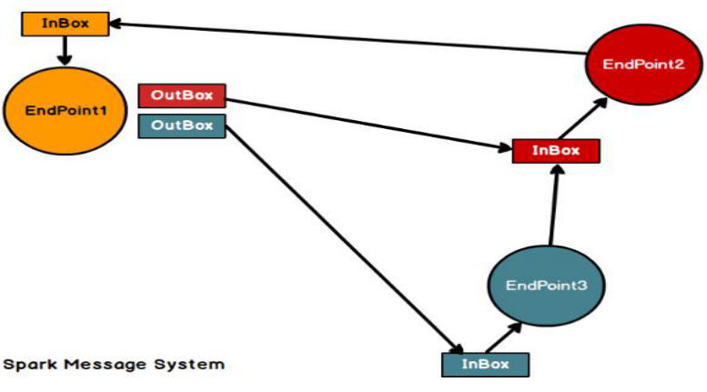
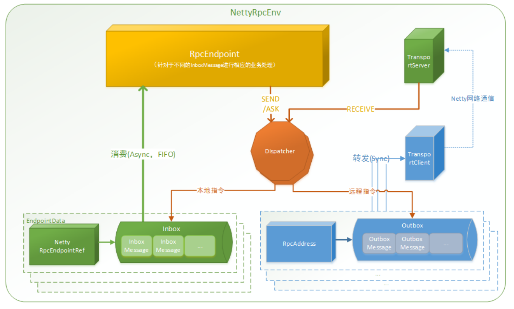

[TOC]

# 1. Spark内核概述

Spark内核泛指Spark的核心运行机制，包括Spark核心组件的运行机制、Spark任务调度机制、Spark内存管理机制、Spark核心功能的运行原理，熟练掌握Spark内核原理，能够帮助我们更好地完成Spark代码设计，并能够帮助我们准确锁定项目运行过程中出现的问题的症结所在。

## 1.1 Spark核心组件回顾

### 1.1.1 Driver

Spark驱动器节点，用于执行Spark任务中的main方法，负责实际代码的执行工作。Driver在Spark作业执行时主要负责:

1. 将用户程序转化为作业(Job)
2. 在Executor之间调度任务(Task)
3. 跟踪Executor的执行情况
4. 通过UI展示查询运行情况

### 1.1.2 Executor

Spark Executor对象是负责在Spark作业中运行具体任务，任务彼此之间相互独立。Spark应用启动时，ExecutorBackend节点被同时启动，并且始终伴随着整个Spark应用的声明周期而存在。如果有ExecutorBackend节点发生了故障或崩溃，Spark应用也可以继续执行，会将出错节点上的任务调度到其他Executor节点上继续运行。

Executor有两个核心功能:

1. 负责运行组成Spark应用的任务，并将结果返回给驱动器(Driver)
2. 它们通过自身的块管理器(Block Manager)为用户程序中要求缓存的RDD提供内存式存储。RDD是直接缓存在Executor进程内的，因此任务可以在运行时充分利用缓存数据加速运算


## 1.2 Spark通用运行流程概述



上图为Spark通用运行流程图，体现了基本的Spark应用程序在部署中的基本提交流程。

这个流程是按照如下的核心步骤进行工作的:

1. 任务提交后，都会先启动Driver程序
2. 随后Driver向集群管理器注册应用程序
3. 之后集群管理器根据此任务的配置文件分配Executor并启动
4. Driver开始执行main函数，Spark查询为懒执行，当执行到Actioin算子时开始反向推算，根据宽依赖进行stage的划分，随后每一个Stage对应一个TaskSet，TaskSet中有多个Task,查找可用资源Executor进行调度
5. 根据本地化原则，Task会被分发到指定的Executor去执行，在任务执行的过程中，Executor也会不断与Driver进行通信，报告任务完成情况。


# 2.Spark部署模式

Spark支持多种集群管理器(Cluster Manager),分别为:

1. Standalone:独立模式，Spark原生的简单集群管理器自带完整的服务，可单独部署到一个集群中，无需依赖任何其他资源管理系统，使用Standalone可以很方便地搭建一个集群

2. Hadoop Yarn:统一的资源管理机制，在上面可以运行多套计算框架，如MR，Storm等。根据Driver在集群中的位置不同，分为yarn client(集群外)和yarn cluster(集群内部)

3. Apache Mesos:一个强大的分布式资源管理框架，它允许多种不同的框架部署在其上，包括yarn

4. K8S:容器式部署环境

   实际上，除了上述这些通用的集群管理器外，Spark内部也提供了方便用户测试和学习的本地集群部署模式和Windows环境。由于在实际工作环境下使用的绝大多数的集群管理器是Hadoop Yarn,因此我们关注的重点是Hadoop Yarn模式下的Spark集群部署

## 2.1 Yarn模式运行机制

### 2.1.1 Yarn Cluster模式

1.  执行脚本提交任务，实际上是启动一个SparkSubmit的JVM进程
2. SparkSubmit类中的main方法反射调用YarnClusterApplication的main方法
3. YarnClusterApplication创建Yarn客户端，然后向Yarn服务器发送执行指令:bin/java ApplicationMaster
4. Yarn框架收到指令后会在指定的NM(NodeManager)中启动ApplicationMaster
5. ApplicationMaster启动Driver线程，执行用户的作业
6. AM(ApplicationMaster)向RM(ResourceManager)注册，申请资源
7. 获取资源后AM向NM发送指令:bin/java YarnCoarseGrainedExecutorBackend
8. CoarseGrainedExecutorBackend进程会接收消息，跟Driver通信，注册已经启动的Executor,然后启动计算对象Executor等待接收任务
9. Driver线程继续执行完成作业的调度和任务的执行
10. Driver分配任务并监控任务的执行

***注意:*** SparkSubmit、ApplicationMaster和CoarseGrainedExecutorBackend是独立的进程，Driver是独立的线程，Executor和YarnClusterApplication是对象



### 2.1.2 Yarn Client模式

1. 执行脚本提交任务，实际是启动一个SparkSubmit的JVM进程

2. SparkSubmit类中的main方法反射调用用户代码的main方法

3. 启动Driver线程，执行用户的作业，并创建ScheduleBackend

4. YarnClientSchedulerBackend向RM发送指令:bin/java ExecutorLauncher

5. Yarn框架收到指令后会在指定的NM中启动ExecutorLauncher(实际上还是调用ApplicationMaster的main方法)

   ```scala
   object ExecutorLauncher {
   def main(args: Array[String]): Unit = {
   ApplicationMaster.main(args)
   } }
   ```

   

6. AM向RM注册，申请资源

7. 获取资源后AM向NM发送指令:bin/java CoarseGrainedExecutorBackend

8. CoarseGrainedExecutorBackend进程会接收消息，跟Driver通信，注册已经启动的Executor，然后启动计算对象Executor等待接收任务

9. Driver分配任务并监控任务的执行

***注意:*** SparkSubmit、ApplicationMaster和CoarseGrainedExecutorBackend是独立的进程，Executor和Driver是对象


## 2.2 Standalone模式运行机制

Standalone集群有2个重要组成部分，分别是:

1. Master(RM):是一个进程，主要负责资源的调度和分配，并进行集群的监控等职责
2. Worker(NM):是一个进程，一个Worker运行在集群的一台服务器上，主要负责两个职责，一个是自己的内存存储RDD的某个或某些partiton,另一个是启动其他进程和线程(Executor)，对RDD上的partition进行并行的处理和计算

### 2.2.1 Standalone Cluster模式



在Standalone Cluster模式下，任务提交后，Master会找到一个Worker启动Driver。Driver启动后向Master注册应用程序，Master根据submit脚本的资源需求找到内部资源至少可以启动一个Executor的所有Worker,然后在这些Worker之间分配Executor，Worker上的Executor启动后会向Driver反向注册，所有的Executor注册完成后，Driver开始执行main函数，之后执行到Action算子时，开始划分Stage，每个Stage生成对应的taskSet，之后将Task分发到各个Executor上执行

### 2.2.2. Standalone Client模式



在Standalone Client模式下，Driver在任务提交的本地机器上运行。Driver启动后向Master注册应用程序，Master根据submit脚本的资源需求找到内部资源至少可以启动一个Executor的所有Worker，然后在这些Worker之间分配Executor，Worker上的Executor启动后会向Driver反向注册，所有的Executor注册完成后，Driver开始执行main函数，之后执行到Action算子时，开始划分Stage，每个Stage生成对应的TaskSet，之后将Task分发到各个Executor上执行。


# 3. Spark通讯架构

## 3.1 Spark通信架构概述

Spark中通信架构的发展:

+ Spark早起版本中采用Akka作为内部通信组件
+ Spark1.3引入Netty通信框架，为了解决Shuffle的大数据传输问题使用
+ Spark1.6中Akka和Netty可以配置使用。Netty完全实现了Akka在Spark中的功能
+ Spark2系列中，Spark抛弃Akka，使用Netty

Spark2.x版本使用Netty通讯框架作为内部通讯组件。Spark基于Netty新的RPC框架借鉴了Akka中的设计，它是Actor模型，如下图所示:



Spark通讯框架中各个组件(Client/Master/Worker)可以认为是一个个独立的实体，各个实体之间通过消息来进行通信。具体各个组件之间的关系图如下:



Endpoint(Client/Master/Worker)有1个InBox和N个OutBox(N>=1,N取决于当前Endpoint与多少其他的Endpoint进行通信，一个与其通讯的其他Endpoint对应一个OutBox),Endpoint接收到的消息被写入InBox,发送出去的消息写入OutBox被发送到其他Endpoint的InBox中。

***Spark通信终端***

***Driver:***

```scala
class DriverEndpoint extends IsolatedRpcEndpoint
```

***Executor:***

```scala
class CoarseGrainedExecutorBackend extends IsolatedRpcEndpoint
```

## 3.2 Spark通讯架构解析

Spark通信架构如下图所示:



+ RpcEndpoint:RPC通信终端。Spark针对每个节点(Client/Master/Worker)都称之为一个RPC终端，且都实现RpcEndpoint接口，内部根据不同端点的需求，设计不同的消息和不同的业务处理，如果需要发送(询问)则调用Dispatcher。在Spark中，所有的终端都存在生命周期:
  + Constructor
  + onStart
  + receive*
  + onStop
+ RpcEnv:RPC上下文环境，每个RPC终端运行时依赖的上下文环境称为RpcEnv,在当前Spark版本中使用的NettyRpcEnv
+ Dispatcher:消息调度(分发)器，针对于RPC终端需要发送远程消息或者从远程RPC接收到的消息，分发至对应的指令收件箱(发件箱)。如果指令接收方是自己则存入收件箱，如果指令接收方不是自己，则放入发件箱。
+ Inbox:指令消息收件箱。一个本地RpcEndpoint对应一个收件箱，Dispatcher在每次向Inbox存入消息时，都将对应EndpointData加入内部ReceiveQueue中，另外Dispatcher创建时会启动一个单独线程进行轮询ReceiverQueue,进行收件箱消息消费
+ RpcEndpointRef:RpcEndpointRef是对远程RpcEndpoint的一个引用。当我们需要向一个具体的RpcEndpoint发送消息时，一般我们需要获取到该RpcEndpoint的引用，然后通过该应用发送消息
+ OutBox:指令消息发件箱。对于当前RpcEndpoint来说，一个目标RpcEndpoint对应一个发件箱，如果向多个目标RpcEndpoint发送消息，则有多个OutBox。当消息放入Outbox后，紧接着通过TransportClient将消息发送出去。消息放入发件箱以及发送过程是在同一个线程中进行。
+ RpcAddress:表示远程的RpcEndpointRef的地址，Host+Port
+ TransportClient:Netty通信客户端，一个OutBox对应一个TransportClient，TransportClient不断轮询OutBox,根据OutBox消息的receiver信息，请求对应的远程TransportServer
+ TransportServer：Netty通信服务端，一个RpcEndpoint对应一个TranportServer，接受远程消息后调用Dispatcher分发消息至对应收发件箱

# 4.Spark任务调度机制

​	在生产环境下，Spark集群的部署方式一般为Yarn-Cluster模式，下面的内核分析内容默认集群的部署方式为Yarn-Cluster模式。Driver线程主要是初始化SparkContext对象，准备运行所需的上下文，然后一方面保持与ApplicationMaster的RPC连接，通过ApplicationMaster申请资源，另一方面根据用户业务逻辑开始调度任务，将任务下发到已有的空闲Executor上

​	当ResourceManager向ApplicationMaster返回Container资源时，ApplicationMaster就尝试在对应的Container上启动Executor进程，Executor进程起来后，会向Driver反向注册，注册成功后保持与Driver的心跳，同时等待Driver分发任务，当分发的任务执行完毕后，将任务状态上报给Driver

## 4.1 Spark任务调度概述

当Driver启动后，Driver会根据用户程序路逻辑准备任务，并根据Executor资源情况逐步分发任务。在详细阐述任务调度前，首先说明下Spark里的几个概念。一个Spark应用程序包括Job、Stage以及Task三个概念

1. Job是以Action方法为界，遇到一个Action方法则触发一个Job
2. Stage是Job的子集，以RDD宽依赖(Shuffle)为界，遇到Shuffle做一次划分
3. Task是Stage的子集，以并行度(分区数)来衡量，分区数是多少，则有多少个task

Spark的任务调度总体来说分两路进行，一路是Stage级的调度，一路是Task级的调度，总体调度流程如下图所示:


Spark RDD通过其Transactions操作，形成了RDD血缘(依赖)关系图，即DAG,最后通过action的调用，触发Job并调度执行，执行过程中会创建两个调度器:DAGScheduler 和TaskScheduler

+ DAGScheduler负责Stage级的调度，主要是将job切分成若干Stages，并将每个Stage打包成TaskSet交给TaskScheduler调度
+ TaskScheduler负责Task级的调度，将DAGScheduler给过来的TaskSet 按照指定的调度测策略分发到Executor上执行，调度过程中SchedulerBackend负责提供可用资源，其中SchedulerBackend有多种实现，分别对接不同的资源管理系统。


Driver初始化SparkContext过程中，会分别初始化DAGScheduler、TaskScheduler、SchedulerBackend以及HeartbeatReceiver,并启动SchedulerBackend以及HeartbeatReceiver. SchedulerBackend通过ApplicationMaster申请资源，并不断从TaskScheduler中拿到合适的Task分发到Executor执行。HeartReceiver负责接收Executor的心跳消息，监控Executor的存活状况，并通知到TaskScheduler

## 4.2 Spark Stage级调度

Spark的任务调度是从DAG切割开始，主要是DAGScheduler来完成。当遇到个Action操作后就会触发一个job的计算，并交给DAGScheduler来提交，下图是涉及到job提交的相关方法调用流程图


1. job由最终的RDD和Action方法封装而成
2. SparkContext将Job交给DAGScheduler提交，它会根据RDD的血缘关系构成的DAG进行切分，将一个job划分为若干Stages，具体划分策略是，由最终的RDD不断通过依赖回溯判断父依赖是否是宽依赖，即以Shuffle为界，划分Stage，窄依赖的RDD之间被划分到同一个Stage中，可以进行pipeline式计算。划分的Stages分两类，一类叫做ResultStage,为DAG最下游的Stage，由Action方法决定，另一类叫做ShuffleMapStage，为下游Stage准备数据，下面看一个简单的例子WordCount


​		Job 由 saveAsTextFile 触发，该 Job 由 RDD-3 和 saveAsTextFile 方法组成，根据 RDD 之间的依赖关系从 RDD-3 开始回溯搜索，直到没有依赖的 RDD-0，在回溯搜索过程中，RDD- 3 依赖 RDD-2，并且是宽依赖，所以在 RDD-2 和 RDD-3 之间划分 Stage，RDD-3 被划到最后一个 Stage，即 ResultStage 中，RDD-2 依赖 RDD-1，RDD-1 依赖 RDD-0，这些依赖都是窄依赖，所以将 RDD-0、RDD-1 和 RDD-2 划分到同一个 Stage，形成 pipeline 操作，。即ShuffleMapStage 中，实际执行的时候，数据记录会一气呵成地执行 RDD-0 到 RDD-2 的转化。不难看出，其本质上是一个深度优先搜索（Depth First Search）算法。

​		一个 Stage 是否被提交，需要判断它的父 Stage 是否执行，只有在父 Stage 执行完毕才能提交当前 Stage，如果一个 Stage 没有父 Stage，那么从该 Stage 开始提交。Stage 提交时会将 Task 信息（分区信息以及方法等）序列化并被打包成 TaskSet 交给 TaskScheduler，一个 Partition 对应一个 Task，另一方面 TaskScheduler 会监控 Stage 的运行状态，只有 Executor 丢失或者 Task 由于 Fetch 失败才需要重新提交失败的 Stage 以调度运行失败的任务，其他类型的 Task 失败会在 TaskScheduler 的调度过程中重试。

​		相对来说 DAGScheduler 做的事情较为简单，仅仅是在 Stage 层面上划分 DAG，提交Stage 并监控相关状态信息。TaskScheduler 则相对较为复杂，下面详细阐述其细节。

## 4.3 Spark Task级调度

Spark Task 的调度是由 TaskScheduler 来完成，由前文可知，DAGScheduler 将 Stage 打包到交给 TaskScheTaskSetduler，TaskScheduler 会将 TaskSet 封装为 TaskSetManager 加入到调度队列中，TaskSetManager 结构如下图所示。


TaskSetManager 负 责监控 管理 同一 个 Stage 中的 Tasks， TaskScheduler 就是以TaskSetManager 为单元来调度任务。

前面也提到，TaskScheduler 初始化后会启动 SchedulerBackend，它负责跟外界打交道，接收 Executor 的注册信息，并维护 Executor 的状态，所以说 SchedulerBackend 是管“粮食”的，同时它在启动后会定期地去“询问”TaskScheduler 有没有任务要运行，也就是说，它会定期地“问”TaskScheduler“我有这么余粮，你要不要啊”，TaskScheduler 在 SchedulerBackend“问”它的时候，会从调度队列中按照指定的调度策略选择 TaskSetManager 去调度运行，大致方法调用流程如下图所示：


上图中，将 TaskSetManager 加入 rootPool 调度池中之后，调用 SchedulerBackend 的riceiveOffers 方法给 driverEndpoint 发送 ReceiveOffer 消息；driverEndpoint 收到 ReceiveOffer 消息后调用 makeOffers 方法，过滤出活跃状态的 Executor（这些 Executor 都是任务启动时反向注册到 Driver 的 Executor），然后将 Executor 封装成 WorkerOffer 对象；准备好计算资源（WorkerOffer）后，taskScheduler 基于这些资源调用 resourceOffer 在 Executor 上分配 task。 

### 4.3.1 调度策略

TaskScheduler 支持两种调度策略，一种是 FIFO，也是默认的调度策略，另一种是 FAIR。 在 TaskScheduler 初始化过程中会实例化 rootPool，表示树的根节点，是 Pool 类型。

1. FIFO调度策略
   如果是采用 FIFO 调度策略，则直接简单地将 TaskSetManager 按照先来先到的方式入

   队，出队时直接拿出最先进队的 TaskSetManager，其树结构如下图所示，TaskSetManager 保

   存在一个 FIFO 队列中。
   

2. FAIR调度策略
   FAIR 调度策略的树结构如下图所示：
   

FAIR 模式中有一个 rootPool 和多个子 Pool，各个子 Pool 中存储着所有待分配的TaskSetMagager。 在 FAIR 模式中，需要先对子 Pool 进行排序，再对子 Pool 里面的 TaskSetMagager 进行排序，因为 Pool 和 TaskSetMagager 都继承了 Schedulable 特质，因此使用相同的排序算法。排序过程的比较是基于 Fair-share 来比较的，每个要排序的对象包含三个属性: 

runningTasks值（正在运行的Task数）、minShare值、weight值，比较时会综合考量runningTasks值，minShare 值以及 weight 值。

注意，minShare、weight 的值均在公平调度配置文件 fairscheduler.xml 中被指定，调度池在构建阶段会读取此文件的相关配置。

1. 如果A对象的runningTasks大于它的minShare，B对象的runningTasks小于它的minShare，那么 B 排在 A 前面；（runningTasks 比 minShare 小的先执行）

2. 如果 A、B 对象的 runningTasks 都小于它们的 minShare，那么就比较 runningTasks 与minShare 的比值（minShare 使用率），谁小谁排前面；（minShare 使用率低的先执行）

3.  如果 A、B 对象的 runningTasks 都大于它们的 minShare，那么就比较 runningTasks 与weight 的比值（权重使用率），谁小谁排前面。（权重使用率低的先执行）

4. 如果上述比较均相等，则比较名字。

整体上来说就是通过minShare和weight这两个参数控制比较过程，可以做到让minShare使用率和权重使用率少（实际运行 task 比例较少）的先运行。FAIR 模式排序完成后，所有的 TaskSetManager 被放入一个 ArrayBuffer 里，之后依次

被取出并发送给 Executor 执行。从调度队列中拿到 TaskSetManager 后，由于 TaskSetManager 封装了一个 Stage 的所有

Task，并负责管理调度这些 Task，那么接下来的工作就是 TaskSetManager 按照一定的规则一个个取出 Task 给 TaskScheduler，TaskScheduler 再交给 SchedulerBackend 去发到 Executor上执行。

### 4.3.2 本地化调度

​		DAGScheduler 切割 Job，划分 Stage, 通过调用 submitStage 来提交一个 Stage 对应的tasks，submitStage 会调用 submitMissingTasks，submitMissingTasks 确定每个需要计算的 task 的 preferredLocations，通过调用 getPreferrdeLocations()得到 partition 的优先位置，由于一个partition 对应一个 Task，此 partition 的优先位置就是 task 的优先位置，对于要提交到TaskScheduler 的 TaskSet 中的每一个 Task，该 task 优先位置与其对应的 partition 对应的优先位置一致。

​		从调度队列中拿到 TaskSetManager 后，那么接下来的工作就是 TaskSetManager 按照一定的规则一个个取出 task 给 TaskScheduler，TaskScheduler 再交给 SchedulerBackend 去发到Executor 上执行。前面也提到，TaskSetManager 封装了一个 Stage 的所有 Task，并负责管理调度这些 Task。

根据每个 Task 的优先位置，确定 Task 的 Locality 级别，Locality 一共有五种，优先级由高到低顺序：


在调度执行时，Spark 调度总是会尽量让每个 task 以最高的本地性级别来启动，当一个task 以 X 本地性级别启动，但是该本地性级别对应的所有节点都没有空闲资源而启动失败，此时并不会马上降低本地性级别启动而是在某个时间长度内再次以 X 本地性级别来启动该task，若超过限时时间则降级启动，去尝试下一个本地性级别，依次类推。可以通过调大每个类别的最大容忍延迟时间，在等待阶段对应的 Executor 可能就会有相应的资源去执行此 task，这就在在一定程度上提到了运行性能。

### 4.3.3失败重试与黑名单机制

​		除了选择合适的 Task 调度运行外，还需要监控 Task 的执行状态，前面也提到，与外部打交道的是 SchedulerBackend，Task 被提交到 Executor 启动执行后，Executor 会将执行状态上报给 SchedulerBackend，SchedulerBackend 则告诉 TaskScheduler，TaskScheduler 找到该Task 对应的 TaskSetManager，并通知到该 TaskSetManager，这样 TaskSetManager 就知道 Task的失败与成功状态，对于失败的 Task，会记录它失败的次数，如果失败次数还没有超过最大重试次数，那么就把它放回待调度的 Task 池子中，否则整个 Application 失败。

​		在记录 Task 失败次数过程中，会记录它上一次失败所在的 Executor Id 和 Host，这样下次再调度这个 Task 时，会使用黑名单机制，避免它被调度到上一次失败的节点上，起到一定的容错作用。黑名单记录 Task 上一次失败所在的 Executor Id 和 Host，以及其对应的“拉黑”时间，“拉黑”时间是指这段时间内不要再往这个节点上调度这个 Task 了。

# 5.Spark Shuffle 解析

## 5.1 Shuffle的核心要点

### 5.1.1  **ShuffleMapStage** **与** **ResultStage**


在划分 stage 时，最后一个 stage 称为 finalStage，它本质上是一个 ResultStage 对象，前面的所有 stage 被称为 ShuffleMapStage。ShuffleMapStage 的结束伴随着 shuffle 文件的写磁盘。ResultStage 基本上对应代码中的 action 算子，即将一个函数应用在 RDD 的各个 partition的数据集上，意味着一个 job 的运行结束。

## 5.2 HashShuffle解析

### 5.2.1 未优化的HashShuffle

​		这里我们先明确一个假设前提：每个 Executor 只有 1 个 CPU core，也就是说，无论这个 Executor 上分配多少个 task 线程，同一时间都只能执行一个 task 线程。

​		如下图中有 3 个 Reducer，从 Task 开始那边各自把自己进行 Hash 计算(分区器：hash/numreduce 取模)，分类出 3 个不同的类别，每个 Task 都分成 3 种类别的数据，想把不同的数据汇聚然后计算出最终的结果，所以 Reducer 会在每个 Task 中把属于自己类别的数据收集过来，汇聚成一个同类别的大集合，每 1 个 Task 输出 3 份本地文件，这里有 4 个Mapper Tasks，所以总共输出了 4 个 Tasks x 3 个分类文件 = 12 个本地小文件。


### 5.2.2 优化后的HashShuffle

​		优化的 HashShuffle 过程就是启用合并机制，合并机制就是复用 buffer，开启合并机制的配置是 spark.shuffle.consolidateFiles。该参数默认值为 false，将其设置为 true 即可开启优化机制。通常来说，如果我们使用 HashShuffleManager，那么都建议开启这个选项。

​		这里还是有 4 个 Tasks，数据类别还是分成 3 种类型，因为 Hash 算法会根据你的 Key进行分类，在同一个进程中，无论是有多少过 Task，都会把同样的 Key 放在同一个 Buffer里，然后把 Buffer 中的数据写入以 Core 数量为单位的本地文件中，(一个 Core 只有一种类型的 Key 的数据)，每 1 个 Task 所在的进程中，分别写入共同进程中的 3 份本地文件，这里有 4 个 Mapper Tasks，所以总共输出是 2 个 Cores x 3 个分类文件 = 6 个本地小文件。


## 5.3 SortShuffle解析

### 5.3.1 普通SortShuffle

​		在该模式下，数据会先写入一个数据结构，reduceByKey 写入 Map，一边通过 Map 局部聚合，一边写入内存。Join 算子写入 ArrayList 直接写入内存中。然后需要判断是否达到阈值，如果达到就会将内存数据结构的数据写入到磁盘，清空内存数据结构。

​		在溢写磁盘前，先根据 key 进行排序，排序过后的数据，会分批写入到磁盘文件中。默认批次为 10000 条，数据会以每批一万条写入到磁盘文件。写入磁盘文件通过缓冲区溢写的方式，每次溢写都会产生一个磁盘文件，也就是说一个 Task 过程会产生多个临时文件。

​		最后在每个 Task 中，将所有的临时文件合并，这就是 merge 过程，此过程将所有临时文件读取出来，一次写入到最终文件。意味着一个 Task 的所有数据都在这一个文件中。同时单独写一份索引文件，标识下游各个Task的数据在文件中的索引，start offset和end offset。 


### 5.3.2 bypass SortShuffle

bypass运行机制的触发条件如下:

1) shuffle reduce task 数量小于等于 spark.shuffle.sort.bypassMergeThreshold 参数的值，默认

为 200。

2) 不是聚合类的 shuffle 算子（比如 reduceByKey）。

此时 task 会为每个 reduce 端的 task 都创建一个临时磁盘文件，并将数据按 key 进行hash 然后根据 key 的 hash 值，将 key 写入对应的磁盘文件之中。当然，写入磁盘文件时也是先写入内存缓冲，缓冲写满之后再溢写到磁盘文件的。最后，同样会将所有临时磁盘文件都合并成一个磁盘文件，并创建一个单独的索引文件。

​		该过程的磁盘写机制其实跟未经优化的 HashShuffleManager 是一模一样的，因为都要创建数量惊人的磁盘文件，只是在最后会做一个磁盘文件的合并而已。因此少量的最终磁盘文件，也让该机制相对未经优化的 HashShuffleManager 来说，shuffle read 的性能会更好。

​		而该机制与普通 SortShuffleManager 运行机制的不同在于：不会进行排序。也就是说，启用该机制的最大好处在于，shuffle write 过程中，不需要进行数据的排序操作，也就节省掉了这部分的性能开销。

