第4天 监控中心Zabbix入门

## 一、监控介绍

- 你用过哪些监控软件？

- zabbix 和 nagios、cacti、ganglia 有什么区别？

- zabbix 有那些好处？

- zabbix 的监控流程是什么？

- zabbix 常见监控项有那些？

###  1、Cacti    

 Cacti 是一套基于 PHP、MySQL、SNMP 及 RRD Tool 开发的监测图形分析工具,Cacti 是使用轮询的方式由主服务器向设备发送数据请求来获取设备上状态数据信息的,如果设备不断增多,这个轮询的过程就非常的耗时,轮询的结果就不能即时的反应设备的状态了。Cacti 监控关注的是对数据的展示,却不关注数据异常后的反馈。如果凌晨 3 点的时候设备的某个数据出现异常,除非监控人员在屏幕前发现这个异常变化,否则是没有任何报警机制能够让我们道出现了异常。

### 2、Nagios   

- Nagios 是一款开源的免费网络监控报警服务,能有效监控 Windows、Linux 和 Unix 的主机状态,交换机、路由器和防火墙等网络设置,打印机、网络投影、网络摄像等设备。在系统或服务状态异常时发出邮件或短信报警第一时间通知运维人员,在状态恢复后发出正常的邮件或短信通知。Nagios 有完善的插件功能,可以方便的根据应用服务扩展功能。

-  Nagios 已经可以支持由数万台服务器或上千台网络设备组成的云技术平台的监控,它可以充分发挥自动化运维技术特点在设备和人力资源减少成本。只是 Nagios 无法将多个相同应用集群的数据集合起来,也不能监控到集群中特殊节点的迁移和恢复。


### 3、Ganglia

-  Ganglia 是 UC Berkeley 发起的一个开源集群监视项目,设计用于测量数以千计的节点。Ganglia 的核心包含 gmond、gmetad 以及一个 Web 前端。

- 主要是用来监控系统性能,如:CPU 、内存、硬盘利用率, I/O 负载、网络流量情况等,通过曲线很容易见到每个节点的工作状态,对合理调整、分配系统资源,提高系统整体   性能起到重要作用,目前是监控HADOOP 的官方推荐服务。

### 4、Zabbix    

- Zabbix 是一个基于 WEB 界面的提供分布式系统监视以及网络监视功能的企业级的开源解决方案。zabbix 能监视各种网络参数,保证服务器系统的安全运营;并提供灵活的通知机制以让系统管理员快速定位/解决存在的各种问题。

-  Zabbix 是由 Alexei Vladishev 创建，目前由 Zabbix SIA 在持续开发和支持。
-  Zabbix 是一个企业级的分布式开源监控方案。 
-  Zabbix 是一款能够监控各种网络参数以及服务器健康性和完整性的软件。
-  Zabbix 使用灵活的通知机制，允许用户为几乎任何事件配置基于邮件的告警。这样可以快速反馈服务器的问题。基于已存储的数据，Zabbix提供了出色的报告和数据可视化功能。这些功能使得Zabbix成为容量规划的理想方案。 
-  Zabbix 支持主动轮询和被动捕获。
-  Zabbix所有的报告、统计信息和配置参数都可以通过基于Web的前端页面进行访问。基于Web的前端页面可以确保您从任何方面评估您的网络状态和服务器的健康性。
-   Zabbix是免费的。Zabbix是根据GPL通用公共许可证第2版编写和发行的。这意味着它的源代码都是免费发行的，可供公众任意使用, [商业支持](http://www.zabbix.com/support.php) 由Zabbix公司提供。

## 二、监控区别

- ​    nagios 图形不是特别好，也可以安装图形插件，但是也不怎么好看
- ​    nagios 一般情况下如果需要图形可以和 cacti 配合使用
- ​    cacti 的监控是轮询监控,效率低，图形相对 nagios 比较好看
- ​    zabbix 和 nagios 因为是并发监控，对 cpu 的要求更高
- ​    zabbix 在性能和功能上都强大很多
- ​    zabbix 的图形相当漂亮
- ​    支持多种监控方式 zabbix-agent  snmp 等等
- ​    支持分布式监控,能监控的 agent 非常多
- ​    zabbix 有图形的 web 配置界面，配置简洁
- ​    zabbix 支持自动发现功能


## 三、Zabbix 监控介绍

###  1、Zabbix 监控架构

​                                 

### 3、Zabbix 优点

-  开源,无软件成本投入

-  Server 对设备性能要求低

- 支持设备多,自带多种监控模板

- 支持分布式集中管理,有自动发现功能,可以实现自动化监控

- 开放式接口,扩展性强,插件编写容易

- 当监控的 item 比较多服务器队列比较大时可以采用主动状态,被监控客户端主动 从server 端去下载需要监控的 item 然后取数据上传到 server 端。 这种方式对服务器的负载比较小。

-  Api 的支持,方便与其他系统结合

### 4、Zabbix 缺点

- ​    需在被监控主机上安装 agent,所有数据都存在数据库里, 产生的数据据很大,瓶颈主要在数据库。
- ​    项目批量修改不方便   
- ​     社区虽然成熟，但是中文资料相对较少，服务支持有限；
- ​     入门容易，能实现基础的监控，但是深层次需求需要非常熟悉Zabbix并进行大量的二次定制开发难度较大
- ​    系统级别报警设置相对比较多，如果不筛选的话报警邮件会很多；并且自定义的项目报警需要自己设置，过程比较繁琐；
- ​     缺少数据汇总功能，如无法查看一组服务器平均值，需进行二次开发； 


### 5、Zabbix 监控系统监控对象

- 数据库：   MySQL,MariaDB,Oracle,SQL Server     agent

- 应用软件：Nginx,Apache,PHP,Tomcat                    agent
  \-------------------------------------------------------------------------------------------------------------------------------

- 集群：      LVS,Keepalived,HAproxy,RHCS,F5         agent

- 虚拟化：   VMware,KVM,XEN ,docker,k8s              agent

- 操作系统：Linux,Unix,Windows性能参数               agent
  \-------------------------------------------------------------------------------------------------------------------------------

- 硬件： 服务器，存储，网络设备                              IPMI

- 网络： 网络环境（内网环境，外网环境）              SNMP
  \-------------------------------------------------------------------------------------------------------------------------------


### 6、Zabbix监控方式

#### 1、被动模式

- 被动检测：相对于agent而言；agent, **server向agent请求获取配置的各监控项相关的数据**，agent接收请求、获取数据并响应给server；


#### 2、主动模式

- 主动检测：相对于agent而言；agent(active),**agent向server请求与自己相关监控项配置**，主动地将server配置的监控项相关的数据发送给server；


- 主动监控能极大节约监控server 的资源。


### 7、Zabbix 架构

 Zabbix由几个主要的软件组件构成，这些组件的功能如下。

 

#### 1、Zabbix Server

-  Zabbix server 是 agent 程序报告系统可用性、系统完整性和统计数据的核心组件，是所有配置信息、统计信息和操作数据的核心存储器。 


#### 2、Zabbix 数据库存储

-  所有配置信息和 Zabbix 收集到的数据都被存储在数据库中。 


#### 3、Zabbix Web 界面

- 为了从任何地方和任何平台都可以轻松的访问Zabbix, 我们提供基于Web的Zabbix界面。该界面是Zabbix Server的一部分，通常(但不一定)跟Zabbix Server运行在同一台物理机器上。 


-  如果使用 SQLite,Zabbix Web 界面必须要跟Zabbix Server运行在同一台物理机器上。


#### 4、Zabbix Proxy 代理服务器

-  Zabbix proxy 可以替Zabbix Server收集性能和可用性数据。Proxy代理服务器是Zabbix软件可选择部署的一部分；当然，Proxy代理服务器可以帮助单台Zabbix Server分担负载压力。 


#### 5、Zabbix Agent 监控代理

-  Zabbix agents监控代理 部署在监控目标上，能够主动监控本地资源和应用程序，并将收集到的数据报告给Zabbix Server。 


#### 6、Zabbix 数据流

- 监控方面，为了创建一个监控项(item)用于采集数据，必须先创建一个主机（host）。

- 告警方面，在监控项里创建触发器（trigger），通过触发器（trigger）来触发告警动作（action）。 因此，如果你想收到Server XCPU负载过高的告警，必须满足

​      1、为Server X创建一个host并关联一个用于对CPU进行监控的监控项（Item）。 

​      2、创建一个Trigger，设置成当CPU负载过高时会触发 

​      3、Trigger被触发，发送告警邮件 

虽然看起来有很多步骤，但是使用模板的话操作起来其实很简单，Zabbix 这样的设计使得配置机制非常灵活易用。 

### 8、Zabbix 常用术语的含义


####  1、主机 (host) 

 - 一台你想监控的网络设备，用IP或域名表示 

####  2、主机组 (host group) 

 - 主机的逻辑组；它包含主机和模板。一个主机组里的主机和模板之间并没有任何直接的关联。通常在给不同用户组的主机分配权限时候使用主机组。 

#### 3、监控项 (item) 

 - 你想要接收的主机的特定数据，一个度量数据。 

####  4、触发器 (trigger) 

 - 一个被用于定义问题阈值和“评估”监控项接收到的数据的逻辑表达式 
    当接收到的数据高于阈值时，触发器从“OK”变成“Problem”状态。当接收到的数据低于阈值时，触发器保留/返回一个“OK”的状态。 

####  5、事件 (event) 

 - 单次发生的需要注意的事情，例如触发器状态改变或发现有监控代理自动注册 

####  6、异常 (problem) 

 - 一个处在“异常”状态的触发器 

####  7、动作 (action) 

 - 一个对事件做出反应的预定义的操作。 
 - 一个动作由操作(例如发出通知)和条件(当时操作正在发生)组成 

####  8、升级 (escalation) 

 - 一个在动作内执行操作的自定义场景; 发送通知/执行远程命令的序列 

####  9、媒介 (media) 

 - 发送告警通知的手段；告警通知的途径 

####  10、通知 (notification) 

 - 利用已选择的媒体途径把跟事件相关的信息发送给用户 

####  11、远程命令 (remote command) 

 - 一个预定义好的，满足一些条件的情况下，可以在被监控主机上自动执行的命令 

####  12、模版 (template) 

 - 一组可以被应用到一个或多个主机上的实体（监控项，触发器，图形，聚合图形，应用，LLD，Web场景）的集合 
 - 模版的任务就是加快对主机监控任务的实施；也可以使监控任务的批量修改更简单。模版是直接关联到每台单独的主机上。 

####  13、应用 (application) 

 - 一组监控项组成的逻辑分组 

####  14、web 场景 (web scenario) 

 - 利用一个或多个HTTP请求来检查网站的可用性 

####  15、前端 (frontend) 

 - Zabbix提供的web界面 

####  16、Zabbix API 

 - Zabbix API允许你使用JSON RPC协议 **(是一个无状态且轻量级的远程过程调用（RPC）传送协议，其传递内容透过 JSON 为主)** 来创建、更新和获取Zabbix对象（如主机、监控项、图形和其他）信息或者执行任何其他的自定义的任务 

####  17、Zabbix server 

 - Zabbix软件实现监控的核心程序，主要功能是与Zabbix proxies和Agents进行交互、触发器计算、发送告警通知；并将数据集中保存等 

####  18、Zabbix agent 

 - 一个部署在监控对象上的，能够主动监控本地资源和应用的程序 
 - Zabbix agent 部署在监控的目标上，主动监测本地的资源和应用(硬件驱动，内存，处理器统计等)。 
 - Zabbix agent收集本地的操作信息并将数据报告给Zabbix server用于进一步处理。一旦出现异常 (比如硬盘空间已满或者有崩溃的服务进程), Zabbix server会主动警告管理员指定机器上的异常。. Zabbix agents 的极端高效缘于它可以利用本地系统调用来完成统计数据的收集。 

####  19、被动（passive）和主动（active）检查

 Zabbix agents 可以执行被动和主动两种检查方式

 1、被动检查（passive check） 模式中 agent 应答数据请求，Zabbix server（或者proxy）询问agent数据,如CPU 的负载情况，然后 Zabbix agent 回送结果。 

 2、主动检查（Active checks） 处理过程将相对复杂。 Agent 必须首先从 Zabbix sever 索取监控项列表以进行独立处理，然后周期性地发送新的值给server。 

 执行被动或主动检查是通过选择相应的监测项目类型来配置的。item type. Zabbix agent 处理监控项类型有 Zabbix agent 和 Zabbix agent (active)。 

####  20、Zabbix proxy 

 - 
 - 
 - 一个帮助 Zabbix Server 收集数据，分担Zabbix Server的负载的程序 
 - Zabbix Proxy 是一个可以从一个或多个受监控设备收集监控数据，并将信息发送到Zabbix sever的进程，基本上是代表 sever工作的。 所有收集的数据都在本地进行缓存，然后传送到 proxy 所属的 Zabbix sever。 
 -  部署 Proxy 是可选的，但是可能非常有益于分散单个 Zabbix sever 的负载。 如果只有 proxy 收集数据，sever上的进程就会减少 CPU 消耗和磁盘 I / O 负载。
 -  Zabbix proxy 是完成远程区域、分支机构、没有本地管理员的网络的集中监控的理想解决方案。 
 -  Zabbix proxy需要使用独立的数据库。 

## 四、Zabbix 监控系统部署

### 1、实验准备

　　centos7.5 系统服务器3台、 一台作为监控服务器， 两台台作为被监控节点， 配置好yum源、 防火墙关闭、 各节点时钟服务同步、 各节点之间可以通过主机名互相通信。

#### 1、所有机器关闭防火墙和 selinux

```shell
[root@qfedu.com ~]# setenforce 0 （修改配置文件关闭）
[root@qfedu.com ~]# sed -i 's/SELINUX=enforcing/SELINUX=disabled/' /etc/selinux/config 
[root@qfedu.com ~]# systemctl stop firewalld.service
```

#### 2、实验服务器配置


### 2、Zabbix的安装

#### 1、更新 yum 仓库

##### 1、下载 yum 仓库

```shell
[root@qfedu.com ~]# yum -y install wget
[root@qfedu.com ~]# wget http://repo.zabbix.com/zabbix/3.4/rhel/7/x86_64/zabbix-release-3.4-2.el7.noarch.rpm

# 安装zabbix源（官方）
[root@qfedu.com ~]# rpm -ivh https://repo.zabbix.com/zabbix/4.2/rhel/7/x86_64/zabbix-release-4.2-1.el7.noarch.rpm
```

##### 2、安装 yum 仓库

```shell
[root@qfedu.com ~]# rpm -ivh zabbix-release-4.2-1.el7.noarch.rpm
```

##### 3、更新 yum 仓库

```shell
[root@qfedu.com ~]# yum repolist 
Loaded plugins: fastestmirror, langpacks  
Loading mirror speeds from cached hostfile
zabbix-non-supported                                                      4/4
repo id                     repo name                                   status
base                        base                                         9,363
epel                        epel                                        11,349
zabbix/x86_64               Zabbix Official Repository - x86_64             80
zabbix-non-supported/x86_64 Zabbix Official Repository non-supported -       4
repolist: 20,796
```

##### 4、安装 Zabbix

```shell
[root@qfedu.com~]# yum -y install epel-release.noarch
[root@qfedu.com~]# yum -y install zabbix-agent zabbix-get zabbix-sender zabbix-server-mysql zabbix-web zabbix-web-mysql
或者（官方）
[root@qfedu.com~]# yum-config-manager --enable rhel-7-server-optional-rpms
```

#### 2）安装设置数据库：

##### 1、创建 mariadb.repo

```shell
[root@qfedu.com ~]# vim /etc/yum.repos.d/mariadb.repo
写入以下内容：
[mariadb]
name = MariaDB 
baseurl = https://mirrors.ustc.edu.cn/mariadb/yum/10.4/centos7-amd64 
gpgkey=https://mirrors.ustc.edu.cn/mariadb/yum/RPM-GPG-KEY-MariaDB 
gpgcheck=1
```

##### 2、yum 安装最新版本 mariadb

```shell
[root@qfedu.com ~]# yum install -y MariaDB-server MariaDB-client
```

##### 3、修改配置文件

```shell
[root@qfedu.com ~]# vim /etc/my.cnf.d/server.cnf
    [mysqld]
    skip_name_resolve = ON          # 跳过主机名解析
    innodb_file_per_table = ON      # 开启独立表空间
    innodb_buffer_pool_size = 256M  # 缓存池大小
    max_connections = 2000          # 最大连接数
    log-bin = master-log            # 开启二进制日志
```

4、重启数据库服务

```shell
[root@qfedu.com~]# systemctl restart mariadb
[root@qfedu.com~]# mysql_secure_installation  # 初始化mariadb
```

5、创建数据库并授权账号

```shell
MariaDB [(none)]> create database zabbix character set 'utf8';  # 创建zabbix数据库
MariaDB [(none)]> grant all on zabbix.* to 'zbxuser'@'192.168.37.%' identified by 'keer';										# 注意授权网段
MariaDB [(none)]> flush privileges;           # 刷新授权
```

6、导入 Zabbix 服务表
查看 zabbix-server-mysql 这个包提供了什么

```shell
[root@qfedu.com~]# rpm -ql zabbix-server-mysql
/etc/logrotate.d/zabbix-server
/etc/zabbix/zabbix_server.conf
/usr/lib/systemd/system/zabbix-server.service
/usr/lib/tmpfiles.d/zabbix-server.conf
/usr/lib/zabbix/alertscripts
/usr/lib/zabbix/externalscripts
/usr/sbin/zabbix_server_mysql
/usr/share/doc/zabbix-server-mysql-3.2.6
/usr/share/doc/zabbix-server-mysql-3.2.6/AUTHORS
/usr/share/doc/zabbix-server-mysql-3.2.6/COPYING
/usr/share/doc/zabbix-server-mysql-3.2.6/ChangeLog
/usr/share/doc/zabbix-server-mysql-3.2.6/NEWS
/usr/share/doc/zabbix-server-mysql-3.2.6/README
/usr/share/doc/zabbix-server-mysql-3.2.6/create.sql.gz      # 生成表的各种脚本
/usr/share/man/man8/zabbix_server.8.gz
/var/log/zabbix
/var/run/zabbix
```

使用 create.sql.gz 生成所需要的表

```shell
[root@qfedu.com~]# gzip -d create.sql.gz
[root@qfedu.com~]# head  create.sql           #查看一下表头
CREATE TABLE `users` (
    `userid`                 bigint unsigned                           NOT NULL,
    `alias`                  varchar(100)    DEFAULT ''                NOT NULL,
    `name`                   varchar(100)    DEFAULT ''                NOT NULL,
    `surname`                varchar(100)    DEFAULT ''                NOT NULL,
    `passwd`                 char(32)        DEFAULT ''                NOT NULL,
    `url`                    varchar(255)    DEFAULT ''                NOT NULL,
    `autologin`              integer         DEFAULT '0'               NOT NULL,
    `autologout`             integer         DEFAULT '900'             NOT NULL,
    `lang`                   varchar(5)      DEFAULT 'en_GB'           NOT NULL,
```

查看表头发现没有创建数据库的命令，这正是手动创建数据库的原因。把所需表导入数据库即可：

```shell
[root@qfedu.com ~]# mysql -uzbxuser -h192.168.37.111 -p zabbix < create.sql 
Enter password:
```

导入以后，我们进去数据库查看一下：

```shell
[root@qfedu.com ~]# mysql -uzbxuser -h192.168.37.111 -p
Enter password:
MariaDB [(none)]> show databases;
+--------------------+
| Database           |
+--------------------+
| information_schema |
| zabbix             |
+--------------------+
MariaDB [(none)]> use zabbix;
Database changed
MariaDB [zabbix]> show tables;
+----------------------------+
| Tables_in_zabbix           |
+----------------------------+
| acknowledges               |
| actions                    |
| alerts                     |
……
| usrgrp                     |
| valuemaps                  |
+----------------------------+
127 rows in set (0.00 sec)
```

可以看出来，我们的数据已经导入成功了。

### 3、配置 server 端

数据库准备好了以后，我们要去修改 server 端的配置文件。

```shell
[root@qfedu.com ~]# cd /etc/zabbix/
[root@qfedu.com zabbix]# ls
web  zabbix_agentd.conf  zabbix_agentd.d  zabbix_server.conf
#为了方便我们以后恢复，我们把配置文件备份一下
[root@qfedu.com zabbix]# cp zabbix_server.conf{,.bak}
[root@qfedu.com zabbix]# vim zabbix_server.conf
ListenPort=10051            # 默认监听端口
SourceIP=192.168.37.111     # 发采样数据请求的 IP
```

#### 1、Zabbix 日志

- 默认用文件记录，也可以发送给我们的 rsyslog 日志记录系统，如果我们选择默认，则日志存放在 LogFile=/var/log/zabbix/zabbix_server.log 中，也可以自己设置。

#### 2、日志的滚动

- 默认值为1，表示滚动。我们设为0则表示不滚动。当数据特别多的时候，我们也可以设置成为1，然后在 Maximum size of log file in MB 设置当数据文件最大到多少时会自动滚动。 

​                                                                                  

#### 3、日志的级别

- 一共有6个级别。我们可以根据自己的需要来设置级别。其中0表示输出最少的信息，5表示输出最详细的信息，默认值为3，设置为3的话就表示，0、1、2、3四个级别都显示。考虑到生产系统中的压力时，这里的信息，如果没有必要的话，越简单越好，只要在出错的时候，我们可以依据其进行排错即可。

​                                       

#### 4、数据库相关的设置

```shell
    DBHost=192.168.37.111       #数据库对外的主机
    DBName=zabbix               #数据库名称
    DBUser=zbxuser              #数据库用户
    DBPassword=keer             #数据库密码
    DBPort=3306                 #数据库启动端口
```

> **补充**：
>
> 1、使用 grep -i "^####" zabbix_server.conf  来查看配置文件中有哪些大段
>
> 2、使用 grep -i "^###" zabbix_server.conf 来查看配置文件中每一段中的配置项有哪些

#### 5、启动服务

```shell
[root@server zabbix]# systemctl start zabbix-server.service
```

#### 6、确认服务端口开启

```shell
[root@server zabbix]# ss -nutl |grep 10051
tcp    LISTEN     0      128       *:10051                 *:*                  
tcp    LISTEN     0      128      :::10051                :::*    
```

### 4、配置 web GUI

#### 　1、查找 web GUI 的配置文件

```shell
[root@qfedu.com ~]# rpm -ql zabbix-web | less
/etc/httpd/conf.d/zabbix.conf
/etc/zabbix/web
/etc/zabbix/web/maintenance.inc.php
/etc/zabbix/web/zabbix.conf.php
/usr/share/doc/zabbix-web-3.2.6
/usr/share/doc/zabbix-web-3.2.6/AUTHORS
/usr/share/doc/zabbix-web-3.2.6/COPYING
/usr/share/doc/zabbix-web-3.2.6/ChangeLog
/usr/share/doc/zabbix-web-3.2.6/NEWS
/usr/share/doc/zabbix-web-3.2.6/README
……
```

#### 2、编辑配置文件

- /etc/httpd/conf.d/zabbix.conf 文件，这个配置文件就是做映射的文件

```shell
Alias /zabbix /usr/share/zabbix     # 访问的时候要在主机后加上/zabbix来访问服务
```


注意： 时区是一定要设置的，这里被注释掉是因为，在 php 的配置文件中设置时区，如果在php配置文件中设置时区，则对所有的 php 服务均有效，如果在 zabbix.conf 中设置时区，则仅对zabbix服务有效。所以，在 php 配置文件中设置时区：

```shell
[root@qfedu.com ~]# vim /etc/php.ini
    [Date]
    ; Defines the default timezone used by the date functions
    ; http://php.net/date.timezone
    date.timezone = Asia/Shanghai
```

#### 3、启动 httpd 服务

```shell
[root@qfedu.com ~]# systemctl enable httpd
[root@qfedu.com ~]# systemctl start httpd
```

### 5、浏览器访问并进行初始化设置

浏览器访问http://192.168.37.111/zabbix，第一次访问时需要进行一些初始化的设置，按照提示操作：


- 点击Finish以后，跳转到登录页面，使用账号密码登录即可：


- 默认用户名为：Admin ，密码为：zabbix ，登录后进入仪表盘：


### 6、配置 agent 端

- 在被监控的主机安装好agent，设置好 server，并添加到 server 端，将其纳入监控系统中。


#### 1、安装 zabbix 安装源

```shell
[root@node1 ~]# wget https://repo.zabbix.com/zabbix/4.2/rhel/7/x86_64/zabbix-release-4.2-1.el7.noarch.rpm
[root@node1 ~]# rpm -ivh zabbix-release-4.2-1.el7.noarch.rpm 
[root@node1 ~]# yum -y install epel-release.noarch
[root@node1 ~]# yum install zabbix-agent zabbix-sender -y
```

#### 2、修改配置文件

#### 1、确认配置文件

```shell
[root@node1 zabbix]# rpm -ql zabbix-agent 
/etc/logrotate.d/zabbix-agent
/etc/zabbix/zabbix_agentd.conf
/etc/zabbix/zabbix_agentd.d
/etc/zabbix/zabbix_agentd.d/userparameter_mysql.conf
/usr/lib/systemd/system/zabbix-agent.service
/usr/lib/tmpfiles.d/zabbix-agent.conf
/usr/sbin/zabbix_agentd
/usr/share/doc/zabbix-agent-3.4.4
/usr/share/doc/zabbix-agent-3.4.4/AUTHORS
/usr/share/doc/zabbix-agent-3.4.4/COPYING
/usr/share/doc/zabbix-agent-3.4.4/ChangeLog
/usr/share/doc/zabbix-agent-3.4.4/NEWS
/usr/share/doc/zabbix-agent-3.4.4/README
/usr/share/man/man8/zabbix_agentd.8.gz
/var/log/zabbix
/var/run/zabbix
```

#### 2、编辑配置文件

对配置文件做一个备份，然后修改配置文件

```shell
[root@node1 ~]# cd /etc/zabbix/
[root@node1 ~]# cd /etc/zabbix/
[root@node1 zabbix]# ls
zabbix_agentd.conf  zabbix_agentd.d
[root@node1 zabbix]# cp zabbix_agentd.conf{,.bak}
[root@node1 zabbix]# vim zabbix_agentd.conf
```

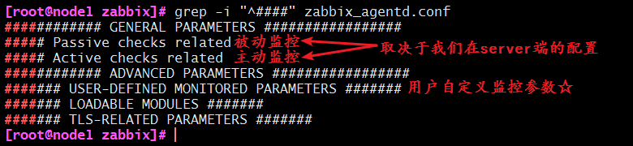


- 重点需要修改 GENERAL PARAMETERS 段：

- 是否允许别人执行远程操作命令，默认是禁用的，打开的话会有安全风险。


```shell
Server=192.168.37.111       # 指明服务器是谁的
ListenPort=10050            # 自己监听的端口
ListenIP=0.0.0.0            # 自己监听的地址，0.0.0.0表示本机所有地址
StartAgents=3               # 优化时使用的

ServerActive=192.168.37.111 # 主动监控时的服务器
Hostname=node1.keer.com     # 自己能被server端识别的名称
```

- 启动服务


```shell
[root@node1 zabbix]# systemctl start zabbix-agent.service
```

- 查看端口是否已开启


```shell
[root@node1 zabbix]# ss -ntul |grep 10050
tcp    LISTEN     0      128       *:10050                 *:*  
```

- 已经开启成功就可以去 server 端添加主机了，其他主机进行同样的操作，唯一不同的就是配置文件中的 Hostname 要设为对应主机名


### 7、监控过程详解

#### 1、修改密码及中文版

####                                                 

- 按如上操作即可，选择中文以后，点击下面的update即可更新成功


- 为了安全起见修改密码


- 修改完成后同样点击更新即可。

#### 2、创建主机及主机群组

　　1、定义一个主机群组


　　2、添加主机


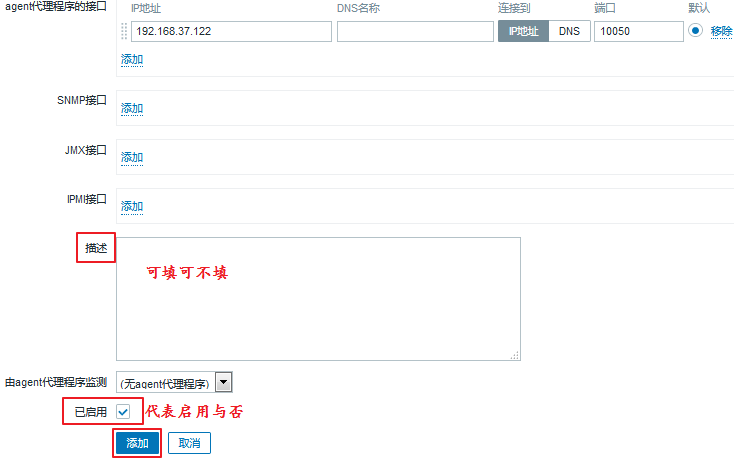

- 当然，上面有很多选择卡，有一个加密：


- 设置完成后，点击添加。添加的主机已经出现在列表中


- 同样的把node2节点添加进来：


#### 3、监控项 (items)

##### 1、 介绍

- 点击  node1 的监控项，即可创建监控项，首先，创建三个应用集：


-  应用集一般配合监控项使用，是多个同类型的监控项的分类目录


- 定义监控项


- 任何一个被监控项，如果想要能够被监控，一定要在 zabbix-server 端定义了能够连接至 zabbix-agent  端，并且能够通过命令获取信息。或者在 agent  端定义了能够让server 端获取命令。一般都是内建的命令，都对应的有其名字，被我们称之为 key。


- 关于key值，可以直接在网页上设置(服务器自动执行)，也可以使用命令行命令(手动执行)来获取：

```shell
[root@qfedu.com ~]#  zabbix_get -s 192.168.37.122 -p 10050 -k "system.cpu.intr"
```

- 在 agent 端，也可以使用命令来查看 intr 的速率变化：


- 继续配置监控项：


##### 2、定义一个不带参数的监控项


- 设置完以后，点击更新，即可加入，并会自动跳转至如下页面


- 定义完成，回到所有主机，等待5秒，可以看到，node1节点后面的选项已经变成绿色：


- 回到仪表盘，可以看到，监控项有一个处于启用状态：


- 点击最新数据，选择要查看主机，应用一下，就可以看到数据状态：


- 可以看到，还有一个图形页面，点进去则可以看图形的分布：


- 事实上，需要关注的指标有很多种，一一添加进来即可。

- 以上定义的监控项是很简单的，指定一个`key`即可，但是有些监控项是带有参数的，这样一来，监控项就有更多的灵活性。接下来，简单说明需要带参数的监控项：

##### 3、定义一个带参数的监控项


- [] 就是需要参数的意思，里面的值即为参数

- <> 为不可省略的。

我们就以这个例子来说明：

- if  表示是接口名；

- <mode> 表示是那种模式，包括但不限于：packets(包)、bytes(字节)、errors(错误)、dropped(丢包)、overuns等等（上述内容通过 ifconfig 查看）

　设置一个监控值：


- 通过命令行来查看：

```shell
[root@qfedu.com~]# zabbix_get -s 192.168.37.122 -p 10050 -k "net.if.in[ens33,packets]"
```

-  查看网页的显示情况：检测中 ---> 最新数据 ---> Network Interface Stats(图形)


**中文乱码解决方法**

- Zabbix监控页面中文显示异常，具体为显示为方块，如图所示。


1、查找zabbix安装目找到字体具体位置。

```shell
#查找zabbix安装位置
[root@qfedu.com~]# whereis zabbix
zabbix: /usr/lib/zabbix /etc/zabbix /usr/share/zabbix
[root@qfedu.com~]# ls /usr/share/zabbix/
actionconf.php                 app                 charts.php                   hostinventories.php  items.php        report2.php        styles
adm.gui.php                    applications.php    conf                         host_prototypes.php  js               report4.php        sysmap.php
adm.housekeeper.php            audio               conf.import.php              host_screen.php      jsLoader.php     robots.txt         sysmaps.php
adm.iconmapping.php            auditacts.php       correlation.php              hosts.php            jsrpc.php        screenconf.php     templates.php
adm.images.php                 auditlogs.php       discoveryconf.php            httpconf.php         latest.php       screenedit.php     toptriggers.php
adm.macros.php                 browserwarning.php  disc_prototypes.php          httpdetails.php      local            screen.import.php  tr_events.php
adm.other.php                  chart2.php          favicon.ico                  image.php            locale           screens.php        trigger_prototypes.php
adm.regexps.php                chart3.php          fonts                        images               maintenance.php  search.php         triggers.php
adm.triggerdisplayoptions.php  chart4.php          graphs.php                   img                  map.import.php   services.php       usergrps.php
adm.triggerseverities.php      chart5.php          history.php                  imgstore.php         map.php          setup.php          users.php
adm.valuemapping.php           chart6.php          host_discovery.php           include              overview.php     slideconf.php      zabbix.php
adm.workingtime.php            chart7.php          hostgroups.php               index_http.php       profile.php      slides.php
api_jsonrpc.php                chart.php           hostinventoriesoverview.php  index.php            queue.php        srv_status.php
#字体文件位置
[root@qfedu.com~]# ls /usr/share/zabbix/fonts/
graphfont.ttf
[root@qfedu.com~]# cd /usr/share/zabbix/fonts/
[root@server fonts]# pwd
/usr/share/zabbix/fonts
[root@server fonts]# ls -l
总用量 0
lrwxrwxrwx. 1 root root 33 3月  25 15:24 graphfont.ttf -> /etc/alternatives/zabbix-web-font
```


- 采用 winscp/xftp等工具将 Windows 中文字体上传到 /usr/share/zabbix/fonts/ 文件夹。本文中文字体为宋体。字体权限修改后截图如下所示：


- 切换至/etc/alternatives 目录查看软链接。


- 删除旧软链接并新建。也可以修改为其他中文字体，例如仿宋或者微软雅黑。


```shell
# 删除旧软链接
[root@quedu.com fonts]# rm -f /etc/alternatives/zabbix-web-font
# 新建软链接
[root@quedu.com fonts]# ln -s /usr/share/zabbix/fonts/simsun.ttc  /etc/alternatives/zabbix-web-font
```

- 刷新浏览器页面即可，如果显示异常，请重新启动 zabbix-server 服务。


```shell
[root@quedu.com fonts]# systemctl restart zabbix-server
```

正常显示字体如图所示。


##### 4、快速定义类似指标

- 要定义一个类似的指标，直接选择克隆，然后简单的修改参数即可。

- 就以定义的 net.if.in[ens33,packets] 为例，如果我们想要在定义一个`out`的进行如下操作即可：


- 如果要以字节为单位需要定义的话，进行同样的操作：


- 如果有需要的话也可以把 byte 再克隆成out。

- 可以看一下，已经定义的指标：


- 进入检测中 ---> 最新数据，可以看到，我们定义的监控项都已经有值了：


##### 5、删除监控项

- 如果有一个监控项，用不上了，就可以删除掉。但是如果你直接删除的话，默认数据是会留下的，所以要先清除数据，然后再删除，具体操作步骤如下：


##### 6、监控项存储的值

对于监控项存储的值，老一点的版本只有以下三种方式：

- As is：  不对数据做任何处理(存储的为原始值)

- Delta：（simple change)(变化)，本次采样减去前一次采样的值的结果

- Delta：（speed per second)(速率)，本次采样减去前一次采样的值，再除以经过的时长；

在3.4版本以后有了更多的表现形式：


#### 4、触发器（trigger）

##### 1、简介

当采集的值定义完了以后，就可以来定义触发器了。触发器的定义是：**界定某特定的item采集到的数据的非合理区间或非合理状态。通常为逻辑表达式。**逻辑表达式（阈值）：通常用于定义数据的不合理区间，其结果如下：

- OK (不符合条件)：正常状态 --> 较老的zabbix版本，其为FALSE；

- PROBLEM(符合条件)：非正常状态 --> 较老的zabbix版本，其为TRUE；

评定采样数值是否为合理区间的比较稳妥的方法是——根据最后N次的平均值来判定结果；这个最后N次通常有两种定义方式：

- 最近N分钟所得结果的平均值

- 最近N次所得结果的平均值

触发器存在可调用的函数：

- nodata()　　　　#是否采集到数据，采集不到则为异常

- last()　　　　　   #最近几次

- date()                    #时间，返回当前的时间，格式YYYYMMDD

- time()                    #返回当前的时间，HHMMSS格式的当前时间。

- now()                    #返回距离Epoch(1970年1月1日00:00:00UTC)时间的秒数

- dayofmonth()      #返回当前是本月的第几天

**注：能用数值保存的就不要使用字符串**

##### 2、触发器表达式

基本的触发器表达式格式如下所示

```
{<server>:<key>.<function>(<parameter>)}<operator><constant>
```

- server：主机名称；
- key：主机上关系的相应监控项的key；
- function：评估采集到的数据是否在合理范围内时所使用的函数，其评估过程可以根据采取的数据、当前时间及其它因素进行；
- 目前触发器所支持的函数有avg、count、change、date、dayofweek、delta、diff、iregexp、last、max、min、nodata、now、sum等
- parameter：函数参数；大多数数值函数可以接受秒数为其参数，而如果在数值参数之前使用“#”做为前缀，则表示为最近几次的取值，如sum(300)表示300秒内所有取值之和，而sum(#10)则表示最近10次取值之和；
- 此外，avg、count、last、min和max还支持使用第二个参数，用于完 成时间限定；例如，max(1h,7d)将返回一周之前的最大值；
- 表达式所支持的运算符及其功能如下图所示：
  　　

##### 3、定义一个触发器

　查看一下 rate of packets(in) 的值，并以其为标准确定我们的非正常的值：


- 图中最大值为74，最小值为4，平均值为24。这样的话，可以定义50以上的都是非正常的值。

- 定义一个触发器：进入：配置 ---> 主机 ---> node1 ---> 触发器 ---> 创建触发器


- 表达式可以直接点击右侧的添加，然后定义自己所需的内容，即可自动生成：


- 生成完毕后，我们就点击页面下方的添加，即成功定义了一个触发器，同时页面自动跳转：


- 查看定义了触发器的监控项：


- 看到里面就有了一根线，就是定义的值，超过线的即为异常状态，看起来非常直观。现在即使超过了这根线，也仅仅会产生一个触发器事件而不会做其他任何事。因此，需要去定义一个动作(action)。

##### 4、触发器的依赖关系

- 触发器彼此之间可能会存在依赖关系的，一旦某一个触发器被触发了，那么依赖这个触发器的其余触发器都不需要再报警。

- 多台主机是通过交换机的网络连接线来实现被监控的。如果交换机出了故障，我们的主机自然也无法继续被监控，如果此时，所有主机统统报警……想想也是一件很可怕的事情。要解决这样的问题，就是定义触发器之间的依赖关系，当交换机挂掉，只有自己报警就可以了，其余的主机就不需要在报警了。**这样，也更易于我们判断真正故障所在。**

- **注意**：目前zabbix不能够直接定义主机间的依赖关系，其依赖关系仅能通过触发器来定义。

- 定义一个依赖关系：打开任意一个触发器，上面就有依赖关系，我们进行定义即可：


- 由于当前只定义了一个触发器，就不演示了，过程就是这样~添加以后点击更新即可。触发器可以有多级依赖关系，比如我们看下面的例子：
- 


#### 5、定义动作（action）

##### 1、 简介

- 需要去基于一个对应的事件为条件来指明该做什么事，一般就是执行远程命令或者发警报。

- 有一个**告警升级**的机制，所以，当发现问题的时候，一般是先执行一个**远程操作命令**，如果能够解决问题，就会发一个恢复操作的讯息给接收人，如果问题依然存在，则会执行**发警报**的操作，一般默认的警报接收人是当前系统中有的 zabbix 用户，所以当有人需要收到警报操作的话，我们则需要把它加入我们的定义之中。

- 每一个用户也应该有一个接收告警信息的方式，即媒介，就像我们接收短信是需要有手机号的一样。

- 每一个监控主机，能够传播告警信息的媒介有很多种，就算我们的每一种大的媒介，能够定义出来的实施媒介也有很多种。而对于一个媒介来说，每一个用户都有一个统一的或者不同的接收告警信息的端点，我们称之为目标地或者目的地。

综上为了能够发告警信息，

- 第一，我们要事先定义一个媒介，

- 第二，还要定义这个媒介上用户接收消息的端点（当然，在用户上，我们也称之为用户的媒介）。

系统内建的媒介类型：

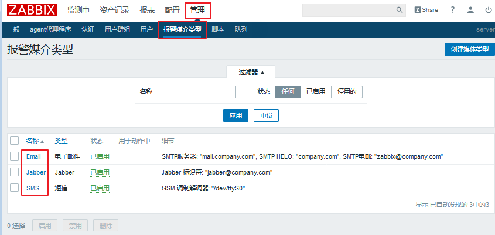

这只是基本的媒介类型，里面还有更多的细分，以 Email为例：


注意：同一个类型也可以定义多个，以 Email 为例，可以定义一个腾讯的服务器，一个网易的服务器，一个阿里的服务器等等。

##### 2、定义一个媒介（media）

以 Email 为例定义一个媒介：

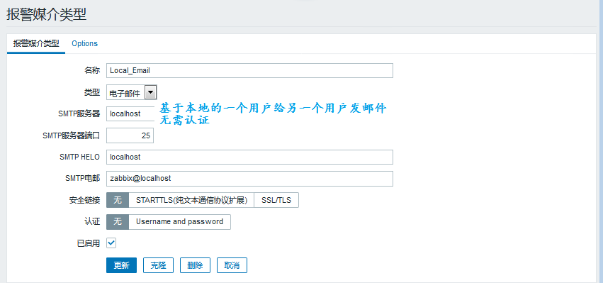


定义后更新就可以
媒介定义好了，怎么才能够让用户接收到邮件呢？比如让Admin用户接收邮件，应该怎么操作呢？具体步骤如下

- 进入 管理 ---> 用户 ---> Admin ---> 报警媒介

- 添加一条进来：


- 添加过后是这样的


- 更新就可以

**注意： 一个用户可以添加多个接收的媒介类型。 请使用163/qq邮箱测试**

##### 3、定义一个动作（action）

　动作是在某些特定条件下触发的，比如，某个触发器被触发了，就会触发动作。现在基于redis来定义一个动作。

- 在 agent 端使用 yum 安装一下 redis：

```shell
[root@node1 ~]# yum install redis -y
```

- 修改配置文件：


```shell
[root@node1 ~]# vim /etc/redis.conf 
bind 0.0.0.0        #不做任何认证操作
```

- 启动服务检查端口：


```shell
[root@node1 ~]# systemctl start redis
[root@node1 ~]# ss -nutlp | grep redis
tcp    LISTEN     0      128       *:6379                  *:*                   users:(("redis-server",pid=5250,fd=4))
```

###### 1、定义监控项

- 进入 配置 ---> 主机 ---> node1 ---> 监控项（items）---> 创建监控项

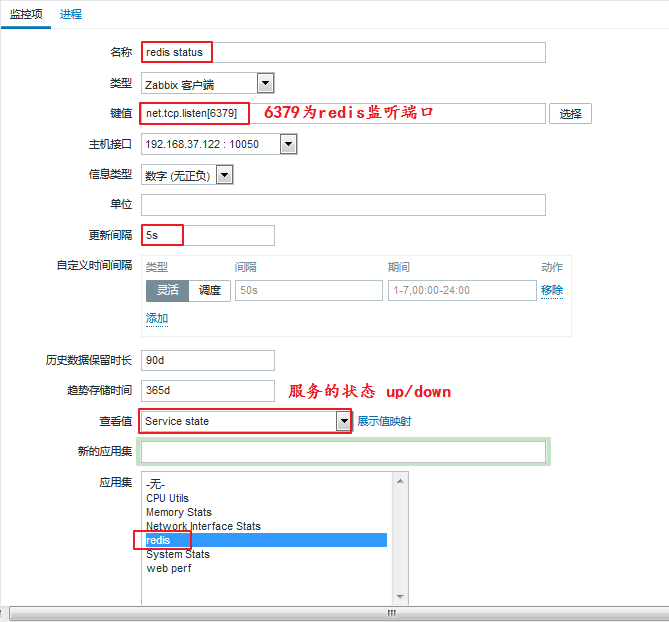

- 填写完毕以后点击下方的添加


- 该监控项已成功添加。
- 查看值：检测中 ---> 最新数据


###### 2、定义触发器

- 定义好了监控项以后，定义一个触发器，当服务有问题的时候，才能及时知道：

- 进入 配置 ---> 主机 ---> node1 ---> 触发器（trigger）---> 创建触发器

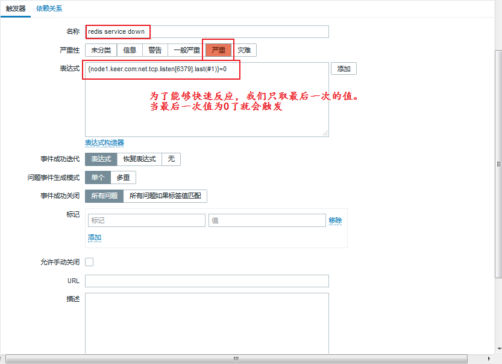

- 填写完毕以后点击下方的添加。


- 该触发器已成功添加

- 查看：监测中 ---> 最新数据

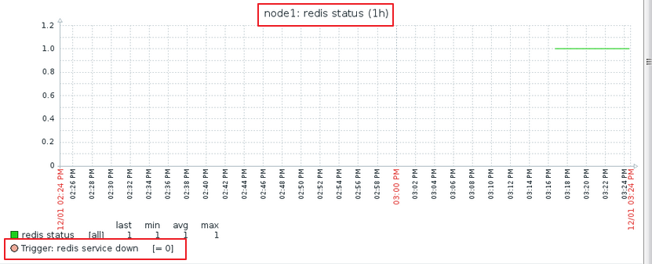

- 手动关闭 redis 服务来检测一下：

```shell
[root@node1 ~]# systemctl stop redis.service
```

- 进入 监测中 ---> 问题


- 看到已经显示的是问题了。并且有持续的时间，当服务被打开，会转为已解决状态：

```shell
[root@node1 ~]# systemctl start redis.service 
```

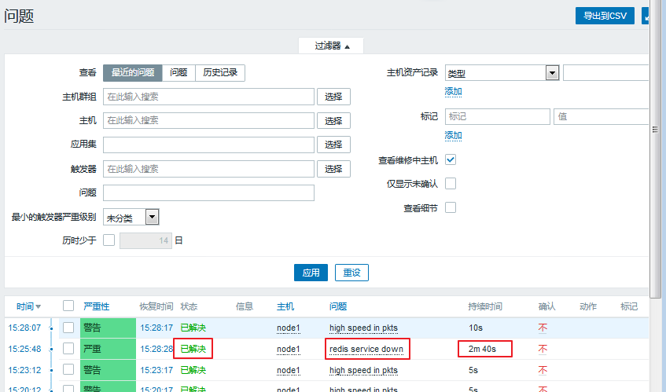

###### 3、定义动作（action）

- 进入 配置 ---> 动作 ---> 创建动作（注意选择事件源为触发器）


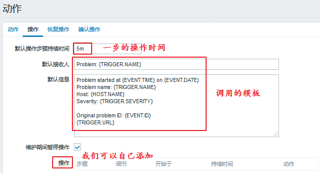

- 操作添加：


需要在虚拟机上进行两项操作，

- 修改 sudo 配置文件使 zabbix 用户能够临时拥有管理员权限；

- 修改 zabbix 配置文件使其允许接收远程命令。

进行如下操作：

```shell
[root@node1 ~]# visudo          # 相当于“vim /etc/sudoers”
    ## Allow root to run any commands anywhere
    root    ALL=(ALL)   ALL
    zabbix    ALL=(ALL)   NOPASSWD: ALL     # 添加的一行，表示不需要输入密码

[root@node1 ~]# vim /etc/zabbix/zabbix_agentd.conf
    EnableRemoteCommands=1          # 允许接收远程命令
    LogRemoteCommands=1             # 把接收的远程命令记入日志

[root@node1 ~]# systemctl restart zabbix-agent.service
```

- 添加了第一步需要做的事情，重启服务，如果重启不成功怎么办呢？就需要来添加第二步：


- 添加完成以后


- 操作添加完了，如果服务自动恢复了，可以发送消息来提示：


- 动作设置完毕，可以点击添加了，添加完成会自动跳转至如下页面：


- 可以手动停止服务来进行测试：

```shell
[root@node1 ~]# systemctl stop redis.service 
```

- 到问题页面来查看，发现确实有问题，并且已经解决：


- server 端查看是否收到邮件


- agent 端查看端口是否开启

```shell
[root@node1 ~]# systemctl stop redis.service 
[root@node1 ~]# ss -ntl
State       Recv-Q Send-Q Local Address:Port               Peer Address:Port              
LISTEN      0      128        *:6379                   *:*                  
LISTEN      0      128        *:111                    *:*                  
LISTEN      0      5      192.168.122.1:53                     *:*                  
LISTEN      0      128        *:22                     *:*                  
LISTEN      0      128    127.0.0.1:631                    *:*                  
LISTEN      0      128        *:23000                  *:*                  
LISTEN      0      100    127.0.0.1:25                     *:*                  
LISTEN      0      128        *:10050                  *:*                  
LISTEN      0      128       :::111                   :::*                  
LISTEN      0      128       :::22                    :::*                  
LISTEN      0      128      ::1:631                   :::*                  
LISTEN      0      100      ::1:25                    :::* 
```

- 端口正常开启，动作触发已经完成。


> 补充：可以使用脚本来发送警报，脚本存放路径在配置文件中可以找到，定义为：AlterScriptsPath=/usr/lib/zabbix/alertscripts

- 手动修改一下redis服务的监听端口，这样就不能通过重启服务恢复了：


```shell
[root@node1 ~]# vim /etc/redis.conf
    #port 6379
    port 6380               #注释掉原来的端口，更换为新的端口

[root@node1 ~]# systemctl restart redis
```

- 网页查看状态：进入 监测中 ---> 问题，可以看到是报错的：

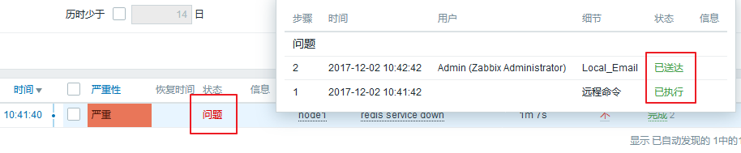

- 经过了重启服务以后还是没能把解决问题，就会发邮件告警


- 把服务端口改回来，然后重启服务。这样，等到问题自动解决了以后，会再次收到邮件：


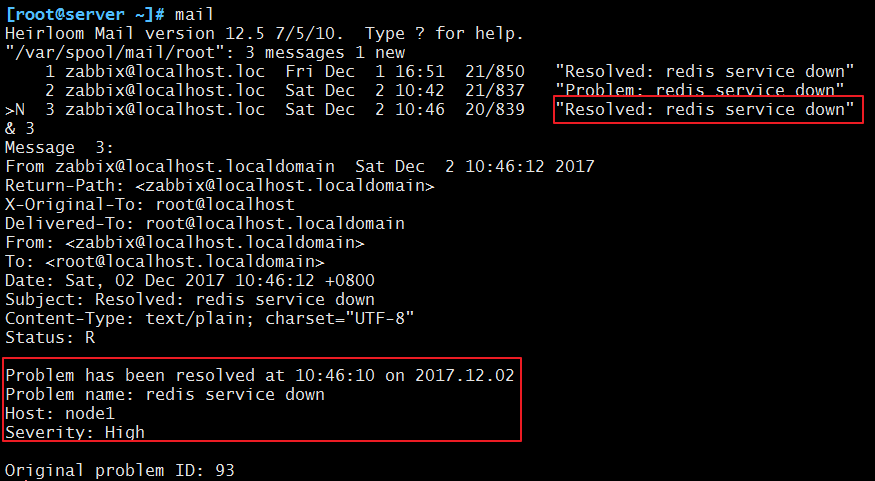

- 动作设定已经全部测试完成。　

#### 6、zabbix可视化

##### 1、 简介

数据日积月累，想要更直观的了解到各项数据的情况，图形无疑是最佳选择。zabbix 提供了众多的可视化工具直观展示，如 graph、screen 及 map 等。前面也看到过一些简单的图形展示。如果想要把多个相关的数据定义在同一张图上去查看，就需要去自定义图形


##### 2、自定义图形（Graphs）

自定义图形中可以集中展示多个时间序列的数据流。支持四种不同形式的图形

- **线状图**(normal)

- **堆叠面积图**(stacked)、

- **饼图**(pie)”

- **分离型饼图**(exploded)

设置过程如下：进入 配置 ---> 主机 ---> node1 ---> 图形，选择右上角创建图形：


- 看一看四种状态：


- 主机都可以自定义，一般线型是看的最清晰的，通常会使用这个。克隆一个 packets 来更改为 bytes 用同样的，如果想添加别的内容，也都可以添加的。

- 这里添加了三个图形，我们可以在 监测中 ---> 图形 来查看


##### 3、聚合图形（Screens）

- 创建的自定义图形也可以放在一个聚合图里显示，具体的设置方法： 进入 监测中 ---> 聚合图形 ---> 选择右上角创建聚合图形

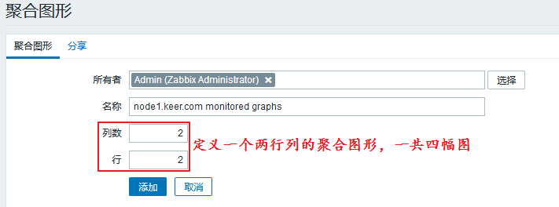

- 可以选择分享：

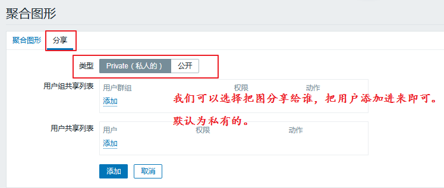

- 定义好了添加即可

- 定义完成以后，需要编辑一下，来指定保存哪些图：


- 依次添加即可，添加完成之后：


- 因为只有三张图，所以添加的有重复的。

##### 4、幻灯片演示（Slide shows）

- 如果有多个聚合图形想要按顺序展示的话，我们就可以定义一个幻灯片。

- 具体步骤：进入 监测中 ---> 聚合图形 ---> 右上角选择幻灯片演示 ---> 创建幻灯片


- 打开以后显示的是图片1，5s以后会自动切换为图片2。这样就可以实现幻灯片演示，就不需要去手动切换了。


##### 5、 定义拓扑图（Maps）

- 在拓扑图中，可以定义成一个复杂的网络连接图，可以使用一台主机来连接另一台主机，这样的话，就可以查看出到底是哪个链接出了问题。

- 进入 监测中 ---> 拓扑图 ---> 所有地图 ---> Local network(默认就有的)


- 通过 Ping 和 Traceroute 就可以实验我们上述的功能。

#### 7、模板

##### 1、创建模板

- 每一个主机的监控项都很多，一个一个的添加实在是太头疼了，更何况，可能不止一个主机。可以把一个 redis 的监控项添加进一个模板里，这样更方便于我们以后的添加。

- 具体操作：进入 配置 ---> 模板 ---> 选择右上角创建模板


- 填写完以后，点击下方的添加即可。

- 基于组过滤，就能看到定义的模板：


- 可以向里面添加应用集、监控项、触发器、图形等等，添加完成以后，后期再有主机需要添加就直接套用模板即可。
- 需要注意的一点是，**现在添加的是模板，所以不会立即采用数据，只有链接到主机上以后，才会真正生效。**

##### 2、模板的导入与导出

- 可以直接导入一个模板，在互联网上可以找到很多，导入的步骤如下：


- 创建好的模板也可以导出为文件：

- 任意选中一个准备好的模板，然后页面的最下方就有导出按钮：


- 就可以非常方便的进行应用了

##### 3、模板的应用

- 进入 配置 ---> 主机 ---> node1 ---> 模板，选择要添加的模板了：


- 点击更新了。成功链接至模板，主机数据就会更新了：


**注意：**

- 一个主机可以链接多个模板，但尽量不要让一个指标被采样两次。

- 如果有多个主机，同时这些主机也在一个主机组里，这样的话，只需要在这个主机组里添加模板，就能够让在主机组里的所有主机进行监控

##### 4、移除模板链接

- 当一个主机的模板不想要用了，可以移除模板链接，

- 具体操作步骤：进入 配置 ---> 主机 ---> node1 ---> 模板，可以把不需要的模板移除：


- 删除试试看，移除并清理以后，点击更新。就会自动跳转至如下界面：


- 模板已经被移除


#### 8、宏（macro）

##### 1、简介

- 宏是一种抽象(Abstraction)，它根据一系列预定义的规则替换一定的文本模式，而解释器或编译器在遇到宏时会自动进行这一模式替换。类似地，zabbix基于宏保存预设文本模式，并且在调用时将其替换为其中的文本。

- zabbix有许多内置的宏，如{HOST.NAME}、{HOST.IP}、{TRIGGER.DESCRIPTION}、{TRIGGER.NAME}、{TRIGGER.EVENTS.ACK}等。　　

- 详细信息请参考[官方文档](https://www.zabbix.com/documentation/2.0/manual/appendix/macros/supported_by_location)　　

##### 2、级别

宏一共有三种级别，分别是全局宏、模板宏、主机宏。不同级别的宏的适用范围也不一样。

- 全局宏也可以作用于所有的模板宏和主机宏，优先级最低。

- 模板宏则可以作用于所有使用该模板的主机，优先级排在中间。

- 主机宏则只对单个主机有效，优先级最高。

##### 3、类型

- 宏的类型分为系统内建的宏和用户自定义的宏。

- 为了更强的灵活性，zabbix还支持在全局、模板或主机级别使用用户自定义宏(user macro)。

- 系统内建的宏在使用的时候需要`{MACRO}`的语法格式，用户自定义宏要使用`{$MACRO}`这种特殊的语法格式。

- 宏可以应用在item keys和descriptions、trigger名称和表达式、主机接口IP/DNS及端口、discovery机制的SNMP协议的相关信息中……

- 宏的名称只能使用**大写字母、数字及下划线**。

- 进一步信息请参考[官方文档](https://www.zabbix.com/documentation/2.0/manual/appendix/macros/supported_by_location#additional_support_for_user_macros)。

##### 4、定义一个宏

　　如果想要在监控项(items)上使用宏，就要先去定义一个宏，然后去创建监控项，直接引用定义好的宏即可。具体操作步骤：

###### 1、定义全局宏

- 进入 管理 ---> 一般 ---> 右上角选择宏


- 全局宏就添加好了

###### 2、定义监控项，调用宏

- 进入 配置 ---> 主机 ---> 所有主机 ---> 监控项 ---> 右上角创建监控项


- 填写完成以后，点击添加。看到这个调用宏的监控项已经添加成功：


- 查看监控项现在的状态：进入 监测中 ---> 最新数据


- 把服务停掉。就会变成 down 的状态

```shell
[root@node1 ~]# systemctl stop redis
```


- 发现监控项是可以正常使用的。

###### 3、修改宏

如果把 node1 节点上的 redis 服务监听端口手动改掉，定义的监控项就不能正常使用了，这样的话，就需要去修改宏。因为只是个例，所以我们不需要去修改全局宏，只用修改模板宏或者主机宏就可以了。

模板宏和主机宏的不同修改操作：

- **模板宏**：模板宏的修改，配置 ---> 模板 ---> redis stats（相应的模板） ---> 宏


- 点击添加就可以了。

- **主机宏**：主机宏的修改，配置 ---> 主机 ---> 所有主机 ---> node1 ---> 宏

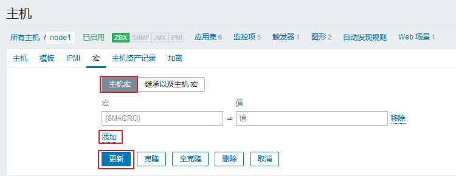

- 点击添加就可以了。


## 五、Zabbix 用户参数

### 1、介绍和用法

#### 1、介绍

自定义用户参数，也就是自定义key，有时可能想要运行一个代理检查，而不是 Zabbix 的预定义，就可以编写一个命令来检索需要的数据，并将其包含在代理配置文件("UserParameter"配置参数)的用户参数中

#### 2、用法格式 syntax

UserParameter=<key>,<command>

- A user parameter also contains a key　　一个用户参数也包含一个键


- The key will be necessary when configuring an item 　　在配置监控项时，key是必需的


- Note: Need to restart the agent 　　注意:需要重新启动 agent 服务 


### 2、用法展示

#### 1、修改 agent 端的配置，设置用户参数

##### 1、查找的参数的命令

```shell
[root@centos7 ~]# free | awk '/^Mem/{print $3}'
```


##### 2、修改配置文件，把查找参数的命令设为用户参数

```shell
[root@centos7 ~]# cd /etc/zabbix/zabbix_agentd.d/
[root@centos7 ~]# vim memory_usage.conf
UserParameter=memory.used,free | awk '/^Mem/{print $3}'
```

##### 3、重启agent 服务

```shell
[root@centos7 ~]# systemctl restart zabbix-agent.service 
```

##### 4、在 zabbix-server 端，查询

```shell
[root@centos7 ~]# zabbix_get -s 192.168.30.7 -p 10050 -k "memory.used"
```


##### 5、在监控上，设置一个item监控项，使用这个用户参数


##### 6、查询 graph 图形

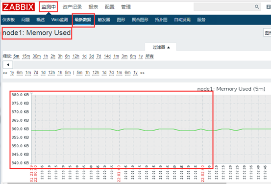

 

### 3、用法升级

#### 1、修改 agent 端的配置，设置用户参数

##### 1、命令行查询参数的命令


##### 2、修改配置文件，把查找参数的命令设为用户参数

```shell
UserParameter=memory.stats[*],cat /proc/meminfo | awk '/^$1/{print $$2}'
```

- 分析：$$2：表示不是调前边位置参数的$2 ，而是 awk 的参数 $2


- 注意：$1是调用前边的[*]，位置参数，第一个参数


#### 2、在zabbix-server 端，查询使用这个用户参数的key


 

#### 3、在监控上，设置一个item监控项，使用这个用户参数

##### 1、添加 Memory Total 的 item 监控项，使用 **memory.stats[MemTotal]** 的用户参数


- 在进程中定义倍数，规定单位


##### 2、clone 克隆 Memory Total 创建Memory Free 的监控项

**memory.stats[MemFree]** 用户参数


##### 3、创建 Memory Buffers 的 item 监控项，使用 **memory.stats[Buffers]** 的key


 

#### 4、上面3个监控项的 graph 图形

##### 1、memory total


##### 2、memory free


##### 3、buffers


 

### 4、使用用户参数监控 php-fpm 服务的状态

在agent 端：

#### 1、下载，设置php-fpm

```shell
[root@centos7 ~]# yum -y install php-fpm
[root@centos7 ~]# vim /etc/php-fpm.d/www.conf # 打开php-fpm的状态页面
```

```shell
user = nginx
group = nginx
pm.status_path = /status    # php-fpm 的状态监测页面
ping.path = /ping           # ping 接口，存活状态是否ok
ping.response = pong        # 响应内容pong
```

#### 2、 开启 php-fpm 服务

```shell
[root@centos7 ~]# systemctl start php-fpm
```

#### 3、设置 nginx ，设置代理php，和php-fpm的状态页面匹配

```shell
[root@centos7 ~]# vim /etc/nginx/nginx.conf
location ~ \.php$ {
            fastcgi_pass   127.0.0.1:9000;
            fastcgi_index  index.php;
            fastcgi_param  SCRIPT_FILENAME  $document_root$fastcgi_script_name;
            include        fastcgi_params;
}
location ~* /(php-fpm-status|ping) {
            fastcgi_pass   127.0.0.1:9000;
            fastcgi_index  index.php;
            fastcgi_param  SCRIPT_FILENAME  $fastcgi_script_name;
            include        fastcgi_params;

            allow 127.0.0.1;   # 因为这个页面很重要，所有需加访问控制
            deny all;

            access_log off;    # 访问这个页面就不用记录日志了
}
```

#### 4、复制状态信息页面到网站根目录

```shell
[root@centos7 ~]# cp /usr/share/fpm/status.html /usr/share/nginx/html/
```


#### 5、开启nginx服务

```shell
[root@centos7 ~]# systemctl start nginx
```

#### 6、在agent 端，设置用户参数

##### 1、查询 curl 192.168.30.7/php-fpm-status


##### 2、设置

```shell
[root@centos7 ~]# cd /etc/zabbix/zabbix_agentd.d/
[root@centos7 ~]# vim php_status.conf
UserParameter=php-fpm.stats[\*],curl -s http://127.0.0.1/status | awk '/^$1/{print $$NF}'
```

- 分析：设置用户参数为php-fpm.stats[*]，$1为第一个参数；$$NF为awk中的参数，倒数第一列


#####  3、重启服务

```shell
[root@centos7 ~]# systemctl restart zabbix-agent
```

#### 4、在zabbix-server 端，查询使用这个用户参数的key

```shell
[root@centos7 ~]# zabbix_get -s 192.168.30.7 -p 10050 -k "php-fpm.stats[idle]"
[root@centos7 ~]# zabbix_get -s 192.168.30.7 -p 10050 -k "php-fpm.stats[active]"
[root@centos7 ~]# zabbix_get -s 192.168.30.7 -p 10050 -k "php-fpm.stats[max active]"
```


 

#### 5、创建一个模板，在模板上创建4个item监控项，使用定义的用户参数

##### 1、创建一个模板


##### 2、在模板上配置 items 监控项，使用刚定义的用户参数

```shell
fpm.stats[total processes]
```


##### 3、再clone克隆几个items监控项

```shell
fpm.stats[active processes]
```


```shell
fpm.stats[max active processes]
```


````shell
 fpm.stats[idle processes]
````


##### 6、host主机链接模板


 

#### 7、查看graph 图形

##### 1、php-fpm total processes


##### 2、php-fpm active processes


##### 3、php-fpm max active processes

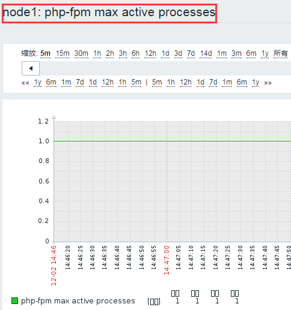

##### 4、php-fpm idle processes


 

#### 8、把模板导出，可以给别人使用

##### 1、导出模板


- 最下面有导出


##### 2、自己定义用户参数的文件，也不要忘记导出

```shell
[root@centos7 ~]# /etc/zabbix/zabbix_agentd.d/php_status.conf 
```

## 六、Zabbix 网络发现

### 1、介绍

网络发现：zabbix server 扫描指定网络范围内的主机；网络发现是zabbix 最具特色的功能之一，它能够根据用户事先定义的规则自动添加监控的主机或服务等

优点：

- 加快Zabbix部署


- 简化管理


在快速变化的环境中使用Zabbix，而不需要过度管理 

### 2、发现方式

- ip地址范围


- 可用服务（ftp, ssh, http, ...）


- zabbix_agent的响应


- snmp_agent的响应 


### 3、发现过程

网络发现通常包含两个阶段：discovery 发现和 actions 动作

1、discovery

- Zabbix定期扫描网络发现规则中定义的IP范围；检查的频率对于每个规则都是可配置的，每个规则都有一组用于为IP范围执行的服务检查

- 由网络发现模块执行的服务和主机(IP)的每个检查都会生成一个发现事件


- 8种响应事件


2、actions

  网络发现中的事件可以触发 action，从而自动执行指定的操作，把 discvery events当作前提条件；

- Sending notifications 发送通知


- Adding/removing hosts 添加/删除主机


- Enabling/disabling hosts 启用/禁用host


- Adding hosts to a group 向组中添加主机


- Removing hosts from a group 移除组中的主机


- Linking hosts to/unlinking from a template 从模板链接主机或取消链接


- Executing remote scripts 执行远程脚本


这些事件的配置还可以基于设备的类型、IP 、状态、上线/ 离线等进行配置

3、网络发现：接口添加

网络发现中添加主机时会自动创建 interface 接口

例如：

- 如果基于SNMP 检测成功，则会创建SNMP 接口


- 如果某服务同时响应给了agent 和SNMP ，则**两种接口都会创建**


- 如果同一种发现机制( 如agent) 返回了非惟一数据，则**第一个接口被识别为默认，其它的为额外接口**


- 即便是某主机开始时只有agent 接口，后来又通过snmp 发现了它，同样会为其添加额外的snmp 接口


- 不同的主机如果返回了相同的数据，则第一个主机将被添加，余下的主机会被当作第一个主机的额外接口


### 4、配置网络发现 Network discovery

#### 1、准备一台可被扫描发现的主机

##### 1、安装 agent 段的包

```shell
[root@node1 ~]# yum -y install zabbix-agent zabbix-sender
```

##### 2、设置 agent 配置，可以把之前设置好的node1的配置传过来

```shell
[root@node1 ~]# vim /etc/zabbix/zabbix_agentd.conf
Hostname=node2.qfedu.com #只需修改hostname
```

##### 3、 visudo 修改sudo的配置

```shell
[root@node1 ~]# visudo
#Defaults !visiblepw
zabbix ALL=(ALL) NOPASSWD: ALL
```


##### 4、开启服务

```shell
[root@node1 ~]# systemctl start zabbix-agent
```

#### 2、设置自动发现规则 discovery


注释：

#### 3、key

```shell
[root@node1 ~]# zabbix_get -s 192.168.30.2 -p 10050 -k "system.hostname"
```

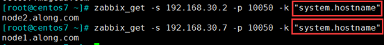

##### 2、更新间隔

1h就好，不要扫描太过频繁，扫描整个网段，太废资源；这里为了实验，设为1m 

#### 4、自动发现成功


 

#### 5、设置自动发现discovery 的动作action

##### 1、创建


##### 2、设置action动作


###### 1、设置A条件，自动发现规则=test.net

###### 2、设置B条件，自动发现状态=up


###### 3、要做什么操作

- 添加主机到监控


- 自动链接Template OS Linux 到此host


##### 3、配置action 完成，默认是 disabled 停用的


##### 4、启用动作，查看效果

确实已经生效，添加主机成功，模板链接成功


#####  5、如果自己需要添加的主机已经扫描添加完成，就可以关闭网络扫描了，因为太耗资源

 

## 七、Zabbix web 监控

### 1、介绍

#### 1、 Web 监控

  监控指定的站点的**资源下载速度**，及**页面响应时间**，还有**响应代码**；

##### 1、术语

- web Scenario： web场景（站点）


- web page ：web页面，一个场景有多个页面


- 內建key：要测一个页面，要测三个步骤（下边3个內建key）


##### 2、内建 key

- web.test.in[Scenario,Step,bps]：传输速率


- web.test.time[Scenario,Step]： 响应时长


- web.test.rspcode[Scenario,Step]：响应码


### 2、创建设置web场景

#### 1、创建


 

#### 2、配置 web 监测


##### 1、点击步骤，设置 web page web 页面

###### 1、设置名为 home page

URL为http://192.168.30.7/index.html 的web页面


###### 2、设置名为 fpm status

URL为http://192.168.30.7/fpm-status 的web页面


###### 3、设置2个 web 页面成功


- 如果有特殊认证，也可以添加


 

### 3、查看测试


 

## 八、Zabbix 主动/被动 监控

### 1、介绍

- 被动检测：相对于agent而言；agent, **server向agent请求获取配置的各监控项相关的数据**，agent接收请求、获取数据并响应给server；


- 主动检测：相对于agent而言；agent(active),**agent向server请求与自己相关监控项配置**，主动地将server配置的监控项相关的数据发送给server；


主动监控能极大节约监控server 的资源。zabbix_sender 发送数据：实现人工生成数据，发给server端

- zabbix server上的某主机上，直接定义Item时随便定义一个不与其它已有key冲突的key即可，即item type为"zabbix trapper"；


- 用法选项：

```shell
zabbix_sender
　　-z zabbix_server_ip
　　-p zabbix_server_port
　　-s zabbix_agent_hostname
　　-k key
　　-o value 值
```

### 2、设置一个通过內建key发送数据的主动监控

#### 1、agent 端所需要基本配置

```shell
ServerActive=192.168.30.107 # 给哪个监控server 发送数据
Hostname=node1.qfedu.com    # 自己的主机名，假设主机定死了，不设置下一项
#HostnameItem=              # 如果自己的主机名易变动，这一项相当于key一样去匹配
```

注意：若后两项同时启用，下边一个选择生效

#### 2、设置一个主动监测


##### 1、选择进程，每秒更改，

因为key：system.cpu.switches ：上下文的数量进行切换，它返回一个整数值。为了监控效果，选择下一秒减上一秒的值作为监控


#### 3、已经有 graph 图形


 

### 3、设置一个通过命令zabbix_sender发送数据的主动监控

#### 1、配置一个zabbix traper(采集器) 的item 监控项


#### 2、agent 端手动发送数据


#### 3、监控到数据的变化


