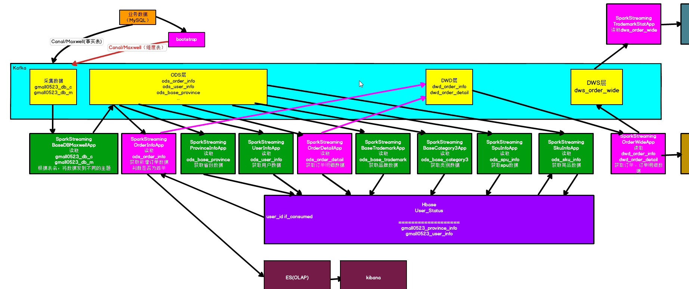
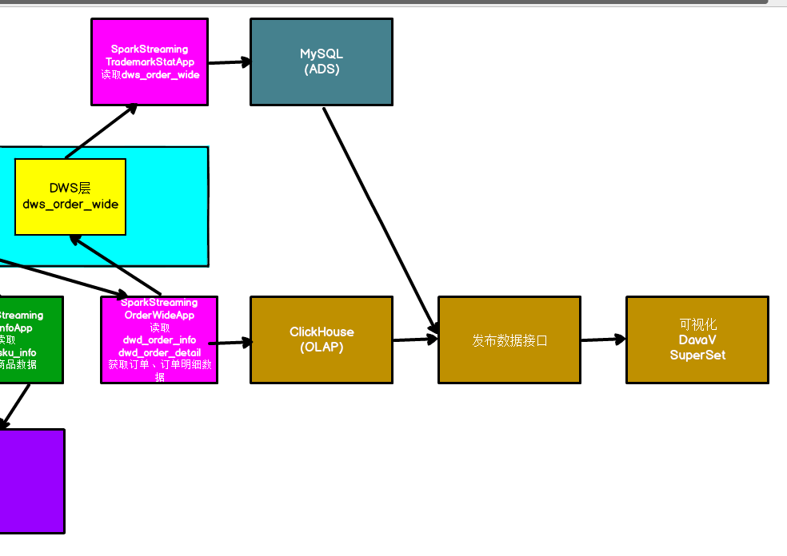
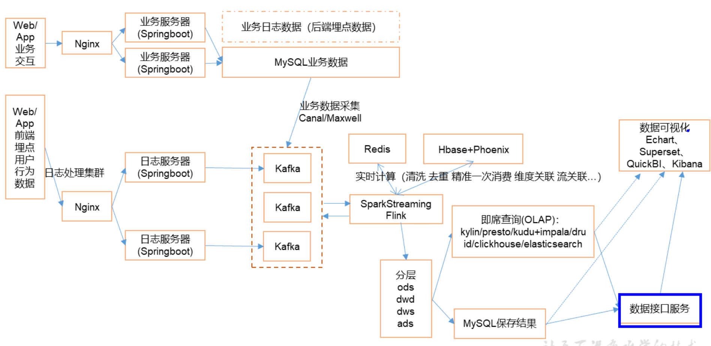
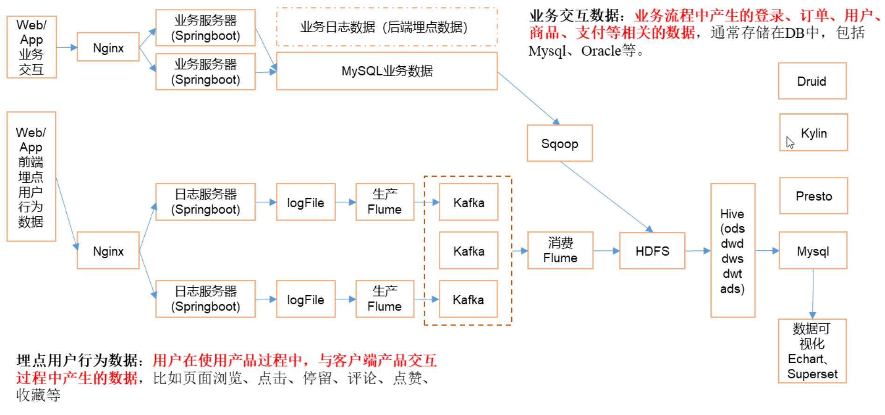
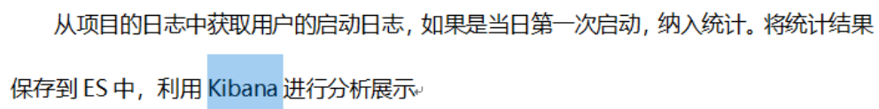
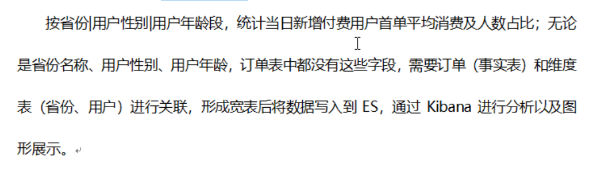
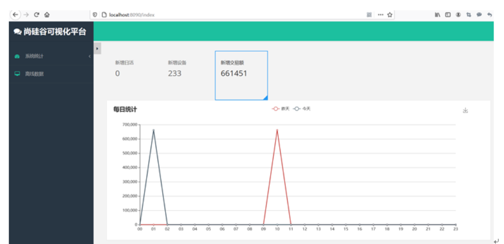

[TOC]

# 1. 项目介绍

## 1.1 实时计算项目架构

基于Spark streaming 对电商平台的用户行为以及订单业务通过不同的指标和维度进行实时的分析和计算，主要环节包括数据的产生、数据的传输、数据的存储以及分析计算以及最终的可视化

类似kafka这样的消息中间件的主要作用有3个：系统解耦、异步通信、流量削峰

注意：离线数据仓库的分层是在hive中完成的，实时的数据分层是在kafka中完成的

## 1.2 离线数仓项目架构

## 1.3 主要需求

### 1.3.1 当日用户首次登录(日活)分时趋势图，昨日对比

### 1.3.2 当日新增付费用户(首单)分析(ods+dwd)

### 1.3.3 订单明细实付金额分摊以及交易额统计(dws)

### 1.3.4 ADS聚合以及可视化

该看P19

链接: https://pan.baidu.com/s/1JAT1bpR8O285rp3KNcP9AQ  密码: p0uc