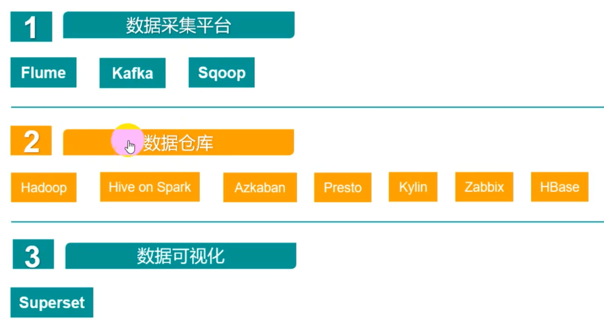
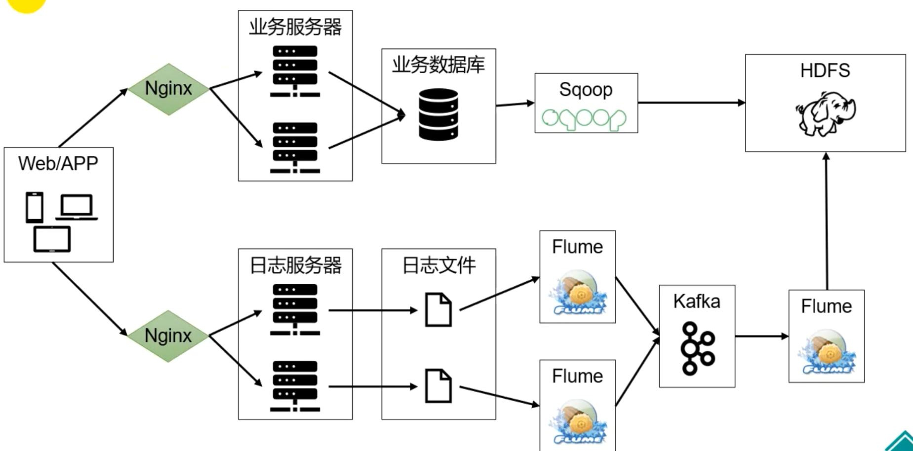
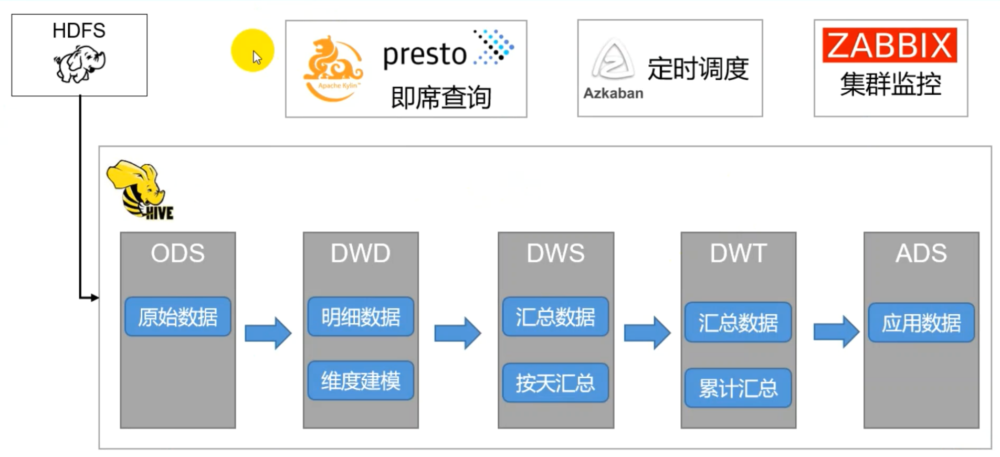
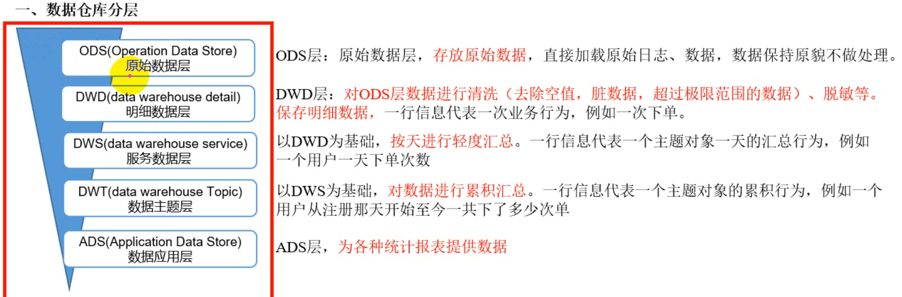
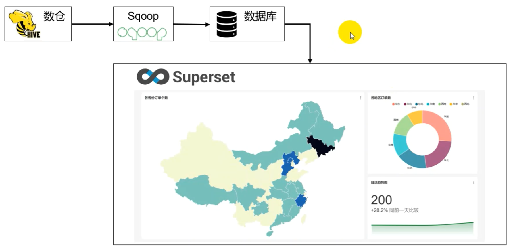

[TOC]

# 1.数仓整体架构

## 1.1 技术选型

# 2.数据采集平台

## 2.1数据采集平台架构设计

# 3.数据仓库

## 3.1 数据仓库架构

## 3.2 数仓分层

# 4.数据可视化

## 4.1 数据可视化架构

# 5. 面试题

## 5.1 记录条数

hive在查询一张经过lzo压缩过并且建了索引的表时，使用select count(*) from 表名要比select * from 表名查出的记录数要多一条。

原因如下：

在执行select * 的时候不走计算引擎，读表时所使用的inputformat是建表时指定的inputformat(com.hadoop.mapred.DeprecatedLzoTextInputFormat),使用上述这种inputformat可以正确地识别lzo索引文件，就不会将索引文件当成数据文件。

在执行select count(*)的时候会走计算引擎，这个时候所使用的inputformat是hive中参数hive.input.format指定的inpugformat,该参数的默认值是org.apache.hadoop.hive.ql.io.CombineHiveInputFormat,该inputformat在真正开启mapreduce之前，先将表中的小文件进行合并，正式开始mapreduce时，再使用建表时指定的Inputformat,使用CombineHiveInputFormat之后相当于把索引文件和数据文件合并了，之后DeprecatedLzoTextInputFormat就识别不了索引文件了，就会把索引文件也当成数据，所以就会多出一条