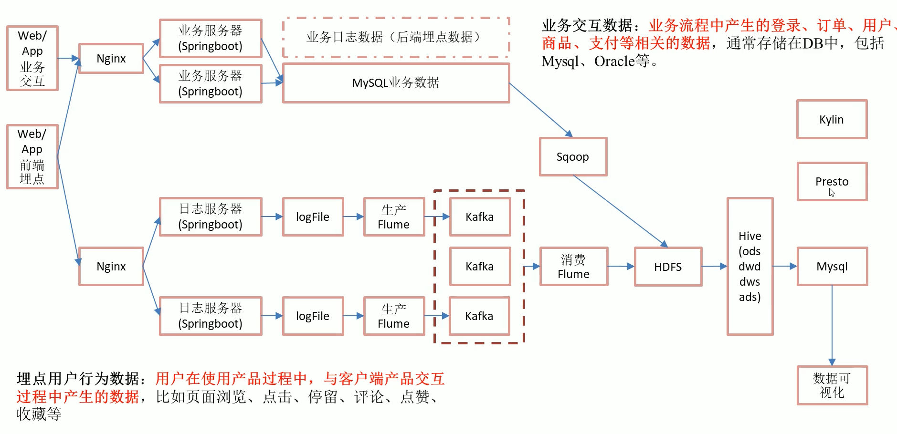
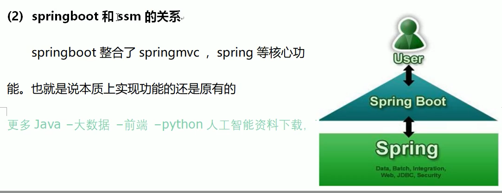
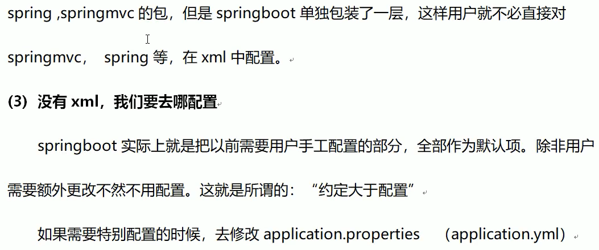

[TOC]

# 1.项目介绍

## 1.1 普通实时计算与实时数仓比较

## 1.2 实时电商数仓分层

### 1.2.1 ODS

原始数据、日志和业务数据

### 1.2.2 DWD

以数据对象为单位进行分流，比如订单、页面访问等

### 1.2.3 DIM（Dimension）

维度数据

### 1.2.4 DWM(Data WareHouse Middle)

对于部分数据对象进行进一步加工，比如独立访问、跳出行为，也可以和维度进行关联

### 1.2.5 DWS

根据某个主题将多个事实数据轻度聚合，形成主题宽表

### 1.2.6 ADS

把Clickhouse中的数据根据可视化需要进行筛选聚合

# 2. 实时需求概览

## 2.1 离线计算与实时计算的比较

## 2.2 实时需求种类

### 2.2.1 日常统计报表或分析图中需要包含当日部分

### 2.2.2 实时数据大屏监控

### 2.2.3 数据预警或提示

### 2.2.4 实时推荐系统

# 3. 统计架构分析

## 3.1 离线架构

## 3.2 实时架构

# 4. 日志数据采集

## 4.1 模拟日志生成器的使用

## 4.2 日志采集模块-本地测试

### 4.2.1 SpringBoot简介

该看p11

### 4.2.2 快速搭建SpringBoot程序

### 4.2.3 SpringBoot整合Kafka

## 4.3 日志采集模块-打包单机部署

### 4.3.1 修改

### 4.3.2 打包

### 4.3.3 上传

### 4.3.4 修改

### 4.3.5 测试

