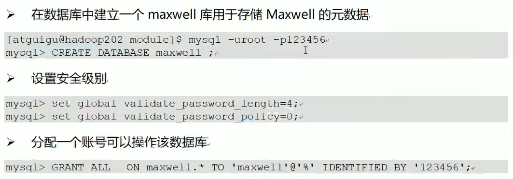
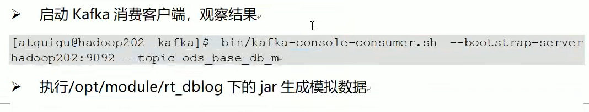

[TOC]

# 1.项目介绍

## 1.1 普通实时计算与实时数仓比较

## 1.2 实时电商数仓分层

### 1.2.1 ODS

原始数据、日志和业务数据

### 1.2.2 DWD

以数据对象为单位进行分流，比如订单、页面访问等

### 1.2.3 DIM（Dimension）

维度数据

### 1.2.4 DWM(Data WareHouse Middle)

对于部分数据对象进行进一步加工，比如独立访问、跳出行为，也可以和维度进行关联

### 1.2.5 DWS

根据某个主题将多个事实数据轻度聚合，形成主题宽表

### 1.2.6 ADS

把Clickhouse中的数据根据可视化需要进行筛选聚合

# 2. 实时需求概览

## 2.1 离线计算与实时计算的比较

## 2.2 实时需求种类

### 2.2.1 日常统计报表或分析图中需要包含当日部分

### 2.2.2 实时数据大屏监控

### 2.2.3 数据预警或提示

### 2.2.4 实时推荐系统

# 3. 统计架构分析

## 3.1 离线架构

## 3.2 实时架构

数据采集流程设计

# 4. 日志数据采集

## 4.1 模拟日志生成器的使用

## 4.2 日志采集模块-本地测试

### 4.2.1 SpringBoot简介

### 4.2.2 快速搭建SpringBoot程序

### 4.2.3 SpringBoot整合Kafka

## 4.3 日志采集模块-打包单机部署

### 4.3.1 修改

### 4.3.2 打包

### 4.3.3 上传

### 4.3.4 修改

### 4.3.5 测试

# 5. 业务数据库数据采集

## 5.1 Maxwell介绍

## 5.2 Maxwell工作原理

### 5.2.1 MySQL主从复制过程

### 5.2.2 Maxwell的工作原理

### 5.2.3 MySQL的binlog

## 5.3  MySQL的准备

### 5.3.1 创建实时业务数据库

### 5.3.2 导入建表数据

### 5.3.3 修改/etc/my.cnf文件

### 5.3.4 重启MySQL使配置生效

### 5.3.5 模拟生成数据

## 5.4 安装Maxwell

## 5.5 初始化Maxwell元数据库

## 5.6 使用Maxwell监控抓取MySQL数据

# 6. 附录1:Nginx教程

# 7. 附录2:canal搭建教程

## 7.6 Canal和Maxwell的对比

