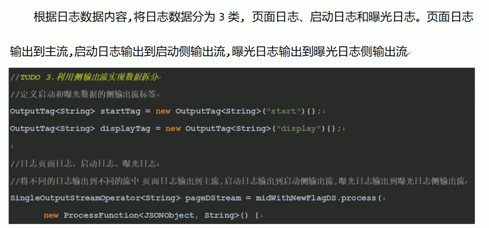

[TOC]

# 1. 需求分析及实现思路

## 1.1 分层需求分析

## 1.2 每层的职能

## 1.3 DWD层数据准备实现思路

# 2.环境搭建

## 2.1 在工程中新建模块gmall2021-realtime

## 2.2 创建如下包结构

## 2.3 修改配置文件

### 2.3.1 在pom.xml添加如下配置

### 2.3.2  在resources目录下创建log4j.properties配置文件

# 3.准备用户行为日志DWD层

## 3.1 主要任务

### 3.1.1 识别新老用户

### 3.1.2 利用侧输出流实现数据拆分

### 3.1.3 将不同流的数据推送到下游的kafka

## 3.2 代码实现

### 3.2.1 接收kafka数据，并进行转换

1. 封装操作kafka的工具类，并提供获取kafka消费者的方法(读)

### 3.2.2 识别新老访客

### 3.2.3 利用侧输出流实现数据拆分

### 3.2.4 将不同流的数据推送到下游kafka

# 4. 准备业务数据DWD层

## 4.1 主要任务

### 4.1.1 接收kafka数据，过滤空值数据

对Maxwell抓取数据进行ETL,有用的部分保留，没用的过滤掉

### 4.1.2 实现动态分流功能

该看44

### 4.1.3 把分好的流保存到对应表、主题中

## 4.2 代码实现

### 4.2.1 接收kafka数据，过滤空值数据

### 4.2.2 根据MySQL的配置表，动态进行分流

# 5. 总结

