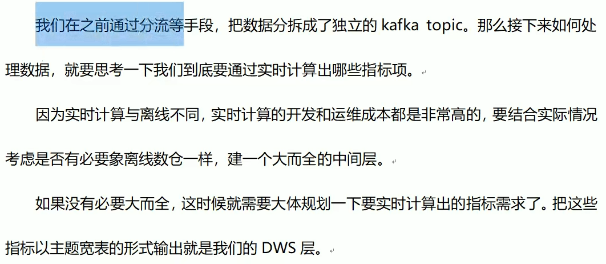
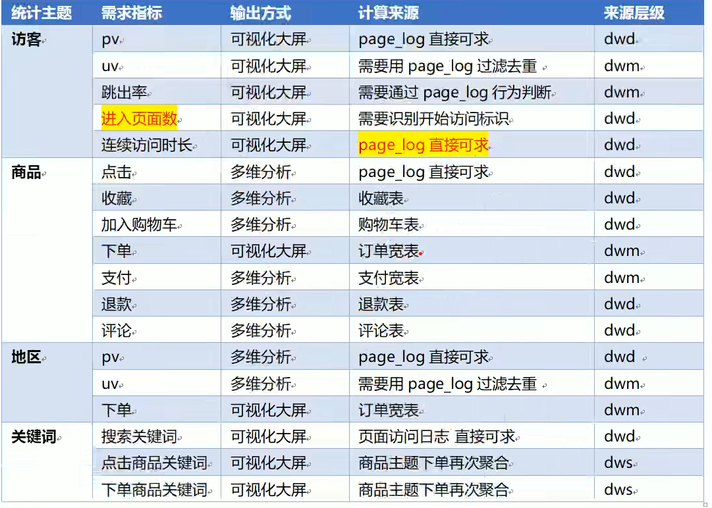
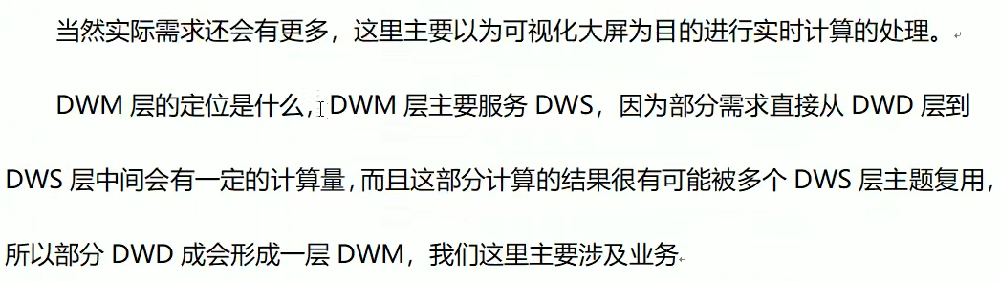
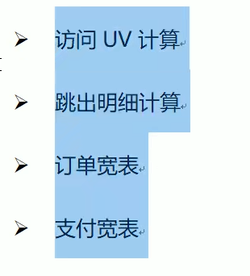
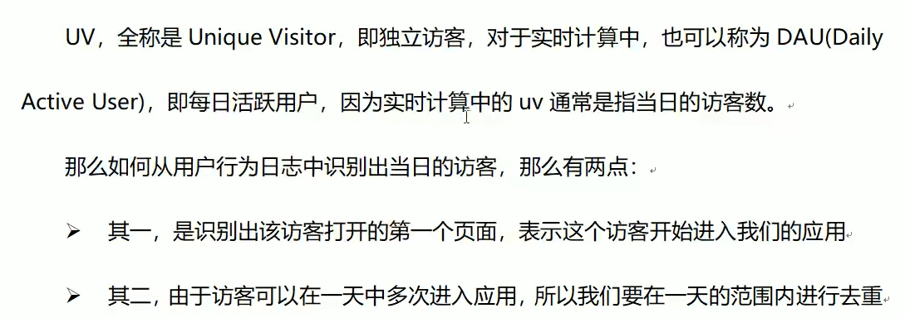
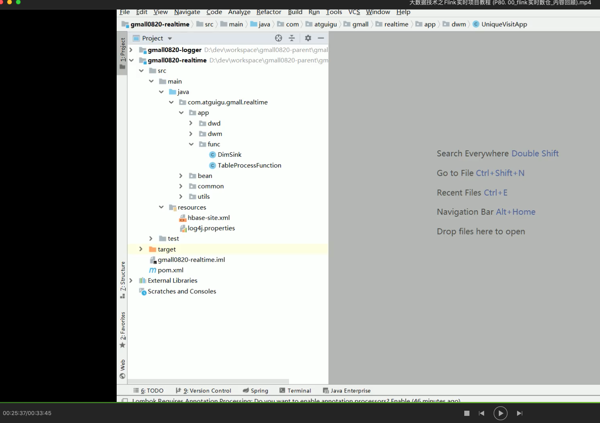

[TOC]

# 1. DWS与DWM层的设计

## 1.1 设计思路

## 1.2 需求梳理

# 2. DWM层-访客UV计算

## 2.1 需求分析与思路

## 2.2 代码实现

### 2.2.1 从kafka的dwd page log主题接收数据

# 3. DWM层-跳出明细计算

# 4. DWM层-订单宽表

# 5. DWM层-支付宽表(练习)

# 6. 总结

