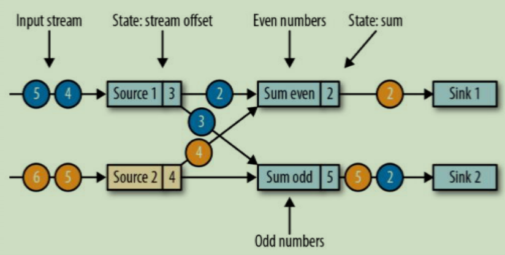
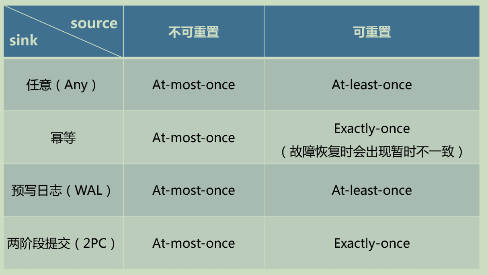
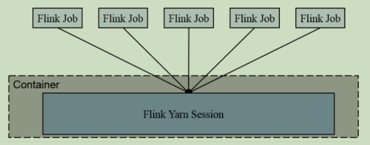
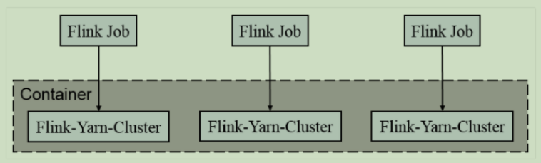
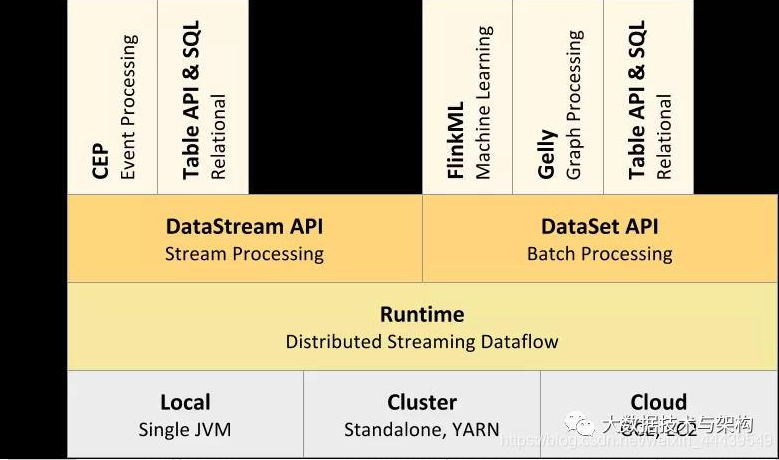
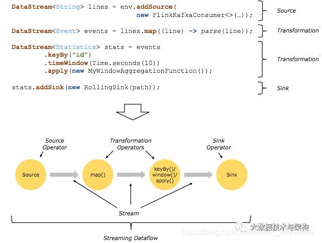
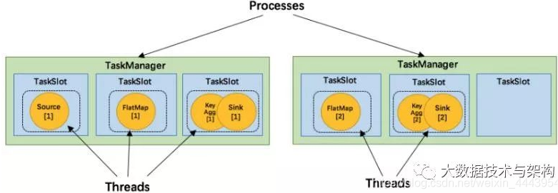

[TOC]

# 1. 介绍一下Flink

Apache Flink 是一个框架和分布式处理引擎，用于对无界和有界数据流进行状态计算

# 2.Flink有哪些特点

1. 事件驱动(Event-driven)

2. 基于流的世界观

   在 Flink 的世界观中，一切都是由流组成的，离线数据是有界的流；实时数据是一个没有界限的流：这就是所谓的有界流和无界流

3. 分成API

   +  越顶层越抽象，表达含义越简明，使用越方便
   + 越底层越具体，表达能力越丰富，使用越灵活

4. 支持事件时间(event-time)和处理时间(processing-time)语义

5. 精确一次(exactly-once)的状态一致性保证

6. 低延迟，每秒处理数百万个事件，毫秒级延迟

7. 与众多常用存储系统的连接

8. 高可用、可扩展

# 3. Flink和Spark Streaming的区别

最重要的一点是流(stream)和微批(micro-batching)的区别，Flink是stream，Spark Streaming是微批

1. 数据模型
   + spark 采用 RDD 模型，spark streaming 的 DStream 实际上也就是一组组小批数据 RDD 的集合
   + flink 基本数据模型是数据流，以及事件（Event）序列
2. 运行时架构
   + spark 是批计算，将 DAG 划分为不同的 stage，一个完成后才可以计算下一个
   + flink 是标准的流执行模式，一个事件在一个节点处理完后可以直接发往下一个节点进行处理

# 4. Flink有哪些组件

主要包括4大组件：JobManager、TaskManager、ResourceManager、Dispatcher

## 4.1 JobManager

1. 控制一个应用程序执行的主进程，也就是说，每个应用程序都会被一个不同的JobManager 所控制执行
2. JobManager 会先接收到要执行的应用程序，这个应用程序会包括：作业图（JobGraph）、逻辑数据流图（logical dataflow graph）和打包了所有的类库和其它资源的JAR包
3. JobManager 会把JobGraph转换成一个物理层面的数据流图，这个图被叫做“执行图”（ExecutionGraph），包含了所有可以并发执行的任务
4. JobManager 会向资源管理器（ResourceManager）请求执行任务必要的资源，也就是任务管理器（TaskManager）上的插槽（slot）。一旦它获取到了足够的资源，就会将执行图分发到真正运行它们的TaskManager上。而在运行过程中，JobManager会负责所有需要中央协调的操作，比如说检查点（checkpoints）的协调

## 4.2 TaskManager

1. Flink中的工作进程。通常在Flink中会有多个TaskManager运行，每一个TaskManager都包含了一定数量的插槽（slots）。插槽的数量限制了TaskManager能够执行的任务数量
2. 启动之后，TaskManager会向资源管理器注册它的插槽；收到资源管理器的指令后，TaskManager就会将一个或者多个插槽提供给JobManager调用。JobManager就可以向插槽分配任务（tasks）来执行了
3. 在执行过程中，一个TaskManager可以跟其它运行同一应用程序的TaskManager交换数据

## 4.3 ResourceManager

1. 主要负责管理任务管理器(TaskManager)的插槽(slot),TaskManger 插槽是Flink中定义的处理资源单元。
2. Flink为不同的环境和资源管理工具提供了不同资源管理器，比如YARN、Mesos、K8s，以及standalone部署
3. 当JobManager申请插槽资源时，ResourceManager会将有空闲插槽的TaskManager分配给JobManager。如果ResourceManager没有足够的插槽来满足JobManager的请求，它还可以向资源提供平台发起会话，以提供启动TaskManager进程的容器

## 4.4 Dispatcher

1. 可以跨作业运行，它为应用提交提供了REST接口
2. 当一个应用被提交执行时，分发器就会启动并将应用移交给一个JobManager
3. Dispatcher也会启动一个Web UI，用来方便地展示和监控作业执行的信息
4. Dispatcher在架构中可能并不是必需的，这取决于应用提交运行的方式

# 5. Flink任务提交流程(抽象)

这个提交流程对Standlone模式和Yarn模式的提交流程进行了抽象


1. 通过WebUI提交应用给Dispatcher
2. 启动一个JobManager， Dispatcher提交应用给该JobManager
3. JobManager向ResourceManager请求slots
4. ResourceManager启动slots对应数量的TaskManager
5. TaskManager向ResourceManager注册slots
6. ResourceManager向TaskManger发出提供slot的指令
7. TaskManager向JobManager提供slots
8. JobManager向TaskManager提交要在slots中执行的任务
9. TaskManager之间可以交换数据

# 6. Flink Yarn集群任务的提交流程(per-job模式)

面试的时候注意区分好面试官问的 是哪个任务提交流程


1. 上传Flink的jar包和配置到HDFS
2. client提交job给ResourceManager(不是Flink集群的，而是Yarn的)
3. 启动一个ApplicationMaster(包含当前要启动的JobManager以及要用到的Flink内部自己的ResourceManager)
4. JobManager先向Flink集群内部的ResourceManager申请资源，由于这个内部的RS本身并没有资源的控制权，再向Yarn的ResourceManager申请资源
5. Yarn的ResourceManager根据当前所需要的资源，启动对应的NodeManager,然后启动相关的TaskManager
6. TaskManager启动后会向Flink集群内部的ResourceManager注册slot
7. TaskManager接收JobManager分配的任务、执行之

如果是session模式就和 # 5 中的流程差不多了

# 7. 任务调度原理


1. Graph Builder根据业务代码生成Dataflow graph
2. 将Dataflow graph提交给JobManager
3. JobManager分析Dataflow graph，确定所需要的资源
4. JobManager可以将任务部署到TaskManager，也可以stop、cancel以及触发checkpoints
5. TaskManager需要向JobManager汇报任务的执行状态、心跳等信息

# 8. 描述一下并行度（Parallelism） 

一个特定算子的 子任务（subtask）的个数被称之为其并行度（parallelism）。

一般情况下，一个 stream 的并行度，可以认为就是其所有算子中最大的并行度

+ Flink 中每一个 TaskManager 都是一个JVM进程，它可能会在独立的线程上执行一个或多个子任务
+ 为了控制一个 TaskManager 能接收多少个 task， TaskManager 通过 task slot 来进行控制（一个 TaskManager 至少有一个 slot）
+ 默认情况下，Flink 允许子任务共享 slot，即使它们是不同任务的子任务。 这样的结果是，一个 slot 可以保存作业的整个管道
+ Task Slot 是静态的概念，是指 TaskManager 具有的并发执行能力

# 9. Flink程序的组成

所有的Flink程序都是由三部分组成的： Source 、Transformation 和 Sink

+ Source 负责读取数据源
+ Transformation 利用各种算子进行处理加工
+ Sink 负责输出

# 10. 4层执行图

Flink 中的执行图可以分成四层：StreamGraph -> JobGraph -> ExecutionGraph -> 物理执行图 

+ StreamGraph

  是根据用户通过 Stream API 编写的代码生成的最初的图。用来表示程序的拓扑结构

+ JobGraph

  StreamGraph经过优化后生成了 JobGraph，提交给 JobManager 的数据结构。主要的优化为，将多个符合条件的节点 chain 在一起作为一个节点

+ ExecutionGraph

  JobManager 根据 JobGraph 生成ExecutionGraph。ExecutionGraph是JobGraph的并行化版本，是调度层最核心的数据结构

+ 物理执行图

  JobManager 根据 ExecutionGraph 对 Job 进行调度后，在各个TaskManager 上部署 Task 后形成的“图”，并不是一个具体的数据结构

# 11. 算子之间传输数据的两种形式

一个程序中，不同的算子可能具有不同的并行度，算子之间传输数据的形式可以是 one-to-one (forwarding) 的模式也可以是redistributing 的模式，具体是哪一种形式，取决于算子的种类

+ One-to-one

  stream维护着分区以及元素的顺序（比如source和map之间），这意味着map 算子的子任务看到的元素的个数以及顺序跟 source 算子的子任务生产的元素的个数、顺序相同。map、fliter、flatMap等算子都是one-to-one

  的对应关系。

+ Redistributing

  stream的分区会发生改变。每一个算子的子任务依据所选择的transformation发送数据到不同的目标任务。例如，keyBy 基于 hashCode 重分区、而 broadcast 和 rebalance 会随机重新分区，这些算子都会引起redistribute过程，而 redistribute 过程就类似于 Spark 中的 shuffle 过程

# 12. 描述一下任务链(Operator Chains)

Flink 采用了一种称为任务链的优化技术，可以在特定条件下减少本地通信的开销。为了满足任务链的要求，必须将两个或多个算子设为相同的并行度，并通过本地转发（local forward）的方式进行连接,**相同并行度**的 **one-to-one** 操作，Flink 这样相连的算子链接在一起形成一个 task，原来的算子成为里面的 subtask


**可以进行合并的条件:**并行度相同、并且是 one-to-one 操作，两个条件缺一不可


# 13. 描述一下Flink中的窗口(window)

将无限流切割为有限流的一种方式，会将流数据分发到有限大小的桶(bucket)中进行分析

# 14. 窗口(window)有哪些类型

1. 时间窗口（Time Window）

   + 滚动时间窗口
   + 滑动时间窗口
   + 会话窗口

2. 计数窗口（Count Window）

   +  滚动计数窗口
   + 滑动计数窗口

   

# 15. 什么是滚动窗口(Tumbling Windows)

+ 将数据依据固定的窗口长度对数据进行切分
+ 时间对齐，窗口长度固定，没有重叠

# 16. 什么是滑动窗口(Sliding Windows)

+ 滑动窗口是固定窗口的更广义的一种形式，滑动窗口由固定的窗口长度和滑动间隔组成
+ 窗口长度固定，可以有重叠

# 17. 什么是会话窗口

+ 由一系列事件组合一个指定时间长度的 timeout 间隙组成，也就是一段时间没有接收到新数据就会生成新的窗口
+ 特点：时间无对齐

# 18. 三种时间语义

+ Event Time：事件创建的时间，一般情况下更关心该时间语义
+ Ingestion Time：数据进入Flink的时间。应用场景:存在多个 Source Operator 的情况下，每个 Source Operator可以使用自己本地系统时钟指派 Ingestion Time。后续基于时间相关的各种操作，都会使用数据记录中的 Ingestion Time
+ Processing Time：执行操作算子的本地系统时间，与机器相关。应用场景:没有事件时间的情况下，或者对实时性要求超高的情况下

# 19. 描述一下Watermark

1. Watermark 是一种衡量 Event Time 进展的机制，可以设定延迟触发
2. Watermark 是用于处理乱序事件的，而正确的处理乱序事件，通常用Watermark 机制结合 window 来实现
3. 数据流中的 Watermark 用于表示 timestamp 小于 Watermark 的数据，都已经到达了，因此，window 的执行也是由 Watermark 触发的
4. watermark 用来让程序自己平衡延迟和结果正确性

# 20. watermark 的特点

1. watermark 是一条特殊的数据记录
2. watermark 必须单调递增，以确保任务的事件时间时钟在向前推进，而不是在后退
3. watermark 与数据的时间戳相关

# 21. watermark 的传递


如果上下游有多个并行子任务，上游向下游传递是通过广播变量的方式，下游接收上游的watermark会保持一个分区watermark,自己的时钟是以这些分区watermark中最小的那个为准

# 22. watermark 的设定

+ 在 Flink 中，watermark 由应用程序开发人员生成，这通常需要对相应的领域有一定的了解
+ 如果watermark设置的延迟太久，收到结果的速度可能就会很慢，解决办法是在水位线到达之前输出一个近似结果
+ 而如果watermark到达得太早，则可能收到错误结果，不过 Flink 处理迟到数据的机制可以解决这个问题

# 23. Flink 中的状态

1. 由一个任务维护，并且用来计算某个结果的所有数据，都属于这个任务的状态
2. 可以认为状态就是一个本地变量，可以被任务的业务逻辑访问
3. Flink 会进行状态管理，包括状态一致性、故障处理以及高效存储和访问，以便开发人员可以专注于应用程序的逻辑
4. 在 Flink 中，状态始终与特定算子相关联
5. 为了使运行时的 Flink 了解算子的状态，算子需要预先注册其状态

# 24. Flink中的状态的分类

有两种类型的状态：

+ 算子状态（Operator State） 

  算子状态的作用范围限定为算子任务

+ 键控状态（Keyed State） 

  根据输入数据流中定义的键（key）来维护和访问

# 25. 描述一下算子状态（Operator State）

+ 算子状态的作用范围限定为算子任务，由同一并行任务所处理的所有数据都可以访问到相同的状态
+ 状态对于同一子任务而言是共享的 
+ 算子状态不能由相同或不同算子的另一个子任务访问

# 26， 算子状态数据结构有哪些

1. 列表状态（List state） 

   将状态表示为一组数据的列表

2. 联合列表状态（Union list state） 

   也将状态表示为数据的列表。它与常规列表状态的区别在于，在发生故障时的恢复

   **列表状态和联合列表状态的区别还得查一下**

3. 广播状态（Broadcast state） 

   如果一个算子有多项任务，而它的每项任务状态又都相同，那么这种特殊情况最适合应用广播状态

# 27. 描述一下键控状态（Keyed State）

+ 键控状态是根据输入数据流中定义的键（key）来维护和访问的
+ Flink 为每个 key 维护一个状态实例，并将具有相同键的所有数据，都分区到同一个算子任务中，这个任务会维护和处理这个 key 对应的状态
+ 当任务处理一条数据时，它会自动将状态的访问范围限定为当前数据的 key

# 28. 键控状态数据结构有哪些

1. 值状态（Value state）

   将状态表示为单个的值 

2. 列表状态（List state） 

   将状态表示为一组数据的列表

3. 映射状态（Map state） 

   将状态表示为一组 Key-Value 对 

4. 聚合状态（Reducing state & Aggregating State） 

   将状态表示为一个用于聚合操作的列表

# 29. 描述一下状态后端（State Backends） 

+ 每传入一条数据，有状态的算子任务都会读取和更新状态
+ 由于有效的状态访问对于处理数据的低延迟至关重要，因此每个并行任务都会在本地维护其状态，以确保快速的状态访问
+ 状态的存储、访问以及维护，由一个可插入的组件决定，这个组件就叫做**状态后端**（state backend）
+ 状态后端主要负责两件事：本地的状态管理，以及将检查点（checkpoint）状态写入远程存储

# 30. 状态后端的类型有哪些

类型有3种：MemoryStateBackend、FsStateBackend、RocksDBStateBackend

1. MemoryStateBackend

   内存级的状态后端，会将键控状态作为内存中的对象进行管理，将它们存储在TaskManager 的 JVM 堆上，而将 checkpoint 存储在 JobManager 的内存中

   特点：快速、低延迟，但不稳定

2. FsStateBackend

   将 checkpoint 存到远程的持久化文件系统（FileSystem）上，而对于本地状态，跟 MemoryStateBackend 一样，也会存在 TaskManager 的 JVM 堆上

   同时拥有内存级的本地访问速度，和更好的容错保证

3. RocksDBStateBackend

   将所有状态序列化后，存入本地的 RocksDB 中存储

# 31. 描述一下一致性检查点（Checkpoints） 

+ Flink 故障恢复机制的核心，就是应用状态的一致性检查点
+ 有状态流应用的一致检查点，其实就是所有任务的状态，在某个时间点的一份拷贝（一份快照）；这个时间点，应该是所有任务都恰好处理完一个相同的输入数据的时候


# 32. 描述一下从检查点恢复状态步骤

+ 在执行流应用程序期间，Flink 会定期保存状态的一致检查点

+ 如果发生故障， Flink 将会使用最近的检查点来一致恢复应用程序的状态，并重新启动处理流程

1. 遇到故障之后，第一步就是重启应用

2. 第二步是从 checkpoint 中读取状态，将状态重置

   从检查点重新启动应用程序后，其内部状态与检查点完成时的状态完全相同

3. 开始消费并处理检查点到发生故障之间的所有数据

   这种检查点的保存和恢复机制可以为应用程序状态提供“精确一次”（exactly-once）的一致性，因为所有算子都会保存检查点并恢复其所有状态，这样一来所有的输入流就都会被重置到检查点完成时的位置

# 33. 检查点的实现算法

1. 一种简单的想法

   暂停应用，保存状态到检查点，再重新恢复应用

2. Flink 的改进实现

   + 基于 Chandy-Lamport 算法的分布式快照
   + 将检查点的保存和数据处理分离开，不暂停整个应用

# 34. Flink 检查点算法

检查点分界线（Checkpoint Barrier）

+ Flink 的检查点算法用到了一种称为分界线（barrier）的特殊数据形式，用来把一条流上数据按照不同的检查点分开
+ 分界线之前到来的数据导致的状态更改，都会被包含在当前分界线所属的检查点中；而基于分界线之后的数据导致的所有更改，就会被包含在之后的检查点中

# 35. Flink 检查点算法工作流程



1. 现在是一个有两个输入流的应用程序，用并行的两个 Source 任务来读取

2. JobManager 会向每个 source 任务发送一条带有新检查点 ID 的消息，通过这种方式来启动检查点

3. 数据源将它们的状态写入检查点，并发出一个检查点 barrier

4. 状态后端在状态存入检查点之后，会返回通知给 source 任务,source 任务就会向 JobManager 确认检查点完成

5. 分界线对齐：barrier 向下游传递，sum 任务会等待所有输入分区的 barrier 到达 

6. 对于barrier已经到达的分区，继续到达的数据会被缓存

7. 而barrier尚未到达的分区，数据会被正常处理

8. 当收到所有输入分区的 barrier 时，任务就将其状态保存到状态后端的检查点中,然后将 barrier 继续向下游转发

9. 向下游转发检查点 barrier 后，任务继续正常的数据处理

10. Sink 任务向 JobManager 确认状态保存到 checkpoint 完毕

11. 当所有任务都确认已成功将状态保存到检查点时，检查点就真正完成了

# 36. 保存点（Savepoints） 

Flink 还提供了可以自定义的镜像保存功能，就是保存点（savepoints） 

+  原则上，创建保存点使用的算法与检查点完全相同，因此保存点可以认为就是具有一些额外元数据的检查点
+ Flink不会自动创建保存点，因此用户（或者外部调度程序）必须明确地触发创建操作
+ 保存点是一个强大的功能。除了故障恢复外，保存点可以用于：有计划的手动备份，更新应用程序，版本迁移，暂停和重启应用，等等


# 37. 什么是状态一致性

1. 有状态的流处理，内部每个算子任务都可以有自己的状态
2. 对于流处理器内部来说，所谓的状态一致性，其实就是我们所说的计算结果要保证准确。
3. 一条数据不应该丢失，也不应该重复计算
4. 在遇到故障时可以恢复状态，恢复以后的重新计算，结果应该也是完全正确的

# 38. 状态一致性分类

1. AT-MOST-ONCE（最多一次）

   当任务故障时，最简单的做法是什么都不干，既不恢复丢失的状态，也不重播丢失的数据。At-most-once 语义的含义是最多处理一次事件

2. AT-LEAST-ONCE（至少一次）

   在大多数的真实应用场景，我们希望不丢失事件。这种类型的保障称为 atleast-once，意思是所有的事件都得到了处理，而一些事件还可能被处理多次

3. EXACTLY-ONCE（精确一次）

   恰好处理一次是最严格的保证，也是最难实现的。恰好处理一次语义不仅仅意味着没有事件丢失，还意味着针对每一个数据，内部状态仅仅更新一次

# 39. exactly-once 语义 是如何保证的

Flink 依靠 checkpoint 机制来实现 exactly-once 语义，如果要实现端到端的 exactly-once，还需要外部 source 和 sink 满足一定的条件。状态的存储通过状态后端来管理，Flink 中可以配置不同的状态后端

端到端 exactly-once:

1. 内部保证 —— checkpoint
2. source 端 —— 可重设数据的读取位置
3. sink 端 —— 从故障恢复时，数据不会重复写入外部系统
   + 幂等写入
   + 事务写入

# 40. 幂等写入（Idempotent Writes）

所谓幂等操作，是说一个操作，可以重复执行很多次,但只导致一次结果更改，也就是说,后面再重复执行就不起作用了 

# 41. 事务写入（Transactional Writes）

## 41.1 事务（Transaction） 

1. 应用程序中一系列严密的操作，所有操作必须成功完成，否则在每个操作中所作的所有更改都会被撤消
2. 具有原子性：一个事务中的一系列的操作要么全部成功，要么一个都不做

## 41.2 实现思想

构建的事务对应着 checkpoint，等到 checkpoint 真正完成的时候，才把所有对应的结果写入 sink 系统中

## 41.3 实现方式

+ 预写日志
+ 两阶段提交

# 42. 预写日志（Write-Ahead-Log，WAL） 

+ 把结果数据先当成状态保存，然后在收到 checkpoint 完成的通知时，一次性写入 sink 系统
+ 简单易于实现，由于数据提前在状态后端中做了缓存，所以无论什么sink 系统，都能用这种方式一批搞定
+ DataStream API 提供了一个模板类：GenericWriteAheadSink，来实现这种事务性 sink

# 43. 两阶段提交（Two-Phase-Commit，2PC）

+ 对于每个 checkpoint，sink 任务会启动一个事务，并将接下来所有接收的数据添加到事务里
+ 然后将这些数据写入外部 sink 系统，但不提交它们 —— 这时只是“预提交”
+ 当它收到 checkpoint 完成的通知时，它才正式提交事务，实现结果的真正写入
+ 这种方式真正实现了 exactly-once，它需要一个提供事务支持的外部sink 系统。Flink 提供了 TwoPhaseCommitSinkFunction 接口。

# 44. 两阶段提交对外部 sink 系统的要求

+ 外部 sink 系统必须提供事务支持，或者 sink 任务必须能够模拟外部系统上的事务
+ 在 checkpoint 的间隔期间里，必须能够开启一个事务并接受数据写入
+ 在收到 checkpoint 完成的通知之前，事务必须是“等待提交”的状态。在故障恢复的情况下，这可能需要一些时间。如果这个时候sink系统关闭事务（例如超时了），那么未提交的数据就会丢失
+ sink 任务必须能够在进程失败后恢复事务
+ 提交事务必须是幂等操作

# 45. 不同 Source 和 Sink 的一致性保证




# 46. Flink+Kafka 端到端状态一致性的保证

+ 内部 —— 利用 checkpoint 机制，把状态存盘，发生故障的时候可以恢复，保证内部的状态一致性
+ source —— kafka consumer 作为 source，可以将偏移量保存下来，如果后续任务出现了故障，恢复的时候可以由连接器重置偏移量，重新消费数据，保证一致性
+ sink —— kafka producer 作为sink，采用两阶段提交 sink，需要实现一个 TwoPhaseCommitSinkFunction

# 47. Exactly-once 两阶段提交步骤

1. 第一条数据来了之后，开启一个 kafka 的事务（transaction），正常写入 kafka 分区日志但标记为未提交，这就是“预提交”
2. jobmanager 触发 checkpoint 操作，barrier 从 source 开始向下传递，遇到barrier 的算子将状态存入状态后端，并通知 jobmanager
3. sink 连接器收到 barrier，保存当前状态，存入 checkpoint，通知 jobmanager，并开启下一阶段的事务，用于提交下个检查点的数据
4. jobmanager 收到所有任务的通知，发出确认信息，表示 checkpoint 完成
5. sink 任务收到 jobmanager 的确认信息，正式提交这段时间的数据
6. 外部kafka关闭事务，提交的数据可以正常消费了。

# 48. 更新模式

+ 对于流式查询，需要声明如何在表和外部连接器之间执行转换
+ 与外部系统交换的消息类型，由更新模式（Update Mode）指定

1. 追加（Append）模式

   表只做插入操作，和外部连接器只交换插入（Insert）消息

2. 撤回（Retract）模式

   + 表和外部连接器交换添加（Add）和撤回（Retract）消息
   + 插入操作（Insert）编码为 Add 消息；删除（Delete）编码为 Retract 消息；更新（Update）编码为上一条的 Retract 和下一条的 Add 消息

3. 更新插入（Upsert）模式

    更新和插入都被编码为 Upsert 消息；删除编码为 Delete 消息

# 49. 用户自定义函数（UDF） 

+ 用户定义函数（User-defined Functions，UDF）是一个重要的特性，它们显著地扩展了查询的表达能力
+ 在大多数情况下，用户定义的函数必须先注册，然后才能在查询中使用
+ 函数通过调用 registerFunction（）方法在 TableEnvironment 中注册。当用户定义的函数被注册时，它被插入到 TableEnvironment 的函数目录中，这样Table API 或 SQL 解析器就可以识别并正确地解释它

# 50. 标量函数（Scalar Functions） 

+ 用户定义的标量函数，可以将0、1或多个标量值，映射到新的标量值
+ 为了定义标量函数，必须在 org.apache.flink.table.functions 中扩展基类ScalarFunction，并实现（一个或多个）求值（eval）方法
+ 标量函数的行为由求值方法决定，求值方法必须公开声明并命名为 eval

# 51. 表函数（Table Functions） 

+ 用户定义的表函数，也可以将0、1或多个标量值作为输入参数；与标量函数不同的是，它可以返回任意数量的行作为输出，而不是单个值
+ 为了定义一个表函数，必须扩展 org.apache.flink.table.functions 中的基类TableFunction 并实现（一个或多个）求值方法
+ 表函数的行为由其求值方法决定，求值方法必须是 public 的，并命名为 eval

# 52. 聚合函数（Aggregate Functions）

+ 用户自定义聚合函数（User-Defined Aggregate Functions，UDAGGs）可以把一个表中的数据，聚合成一个标量值
+ 用户定义的聚合函数，是通过继承 AggregateFunction 抽象类实现的

AggregationFunction要求必须实现的方法：

+ createAccumulator()
+ accumulate()
+ getValue()

AggregateFunction 的工作原理如下： 

1. 首先，它需要一个累加器（Accumulator），用来保存聚合中间结果的数据结构；可以通过调用 createAccumulator() 方法创建空累加器
2. 随后，对每个输入行调用函数的 accumulate() 方法来更新累加器
3. 处理完所有行后，将调用函数的 getValue() 方法来计算并返回最终结果

# 53. 表聚合函数（Table Aggregate Functions）

+ 用户定义的表聚合函数（User-Defined Table Aggregate Functions，UDTAGGs），可以把一个表中数据，聚合为具有多行和多列的结果表
+ 用户定义表聚合函数，是通过继承 TableAggregateFunction 抽象类来实现的

AggregationFunction 要求必须实现的方法：

+ createAccumulator()
+ accumulate()
+ emitValue()

TableAggregateFunction 的工作原理如下: 

1. 首先，它同样需要一个累加器（Accumulator），它是保存聚合中间结果的数据结构。通过调用 createAccumulator() 方法可以创建空累加器
2. 随后，对每个输入行调用函数的 accumulate() 方法来更新累加器
3. 处理完所有行后，将调用函数的 emitValue() 方法来计算并返回最终结果

# 54. 什么是 CEP

+ 复杂事件处理（Complex Event Processing，CEP） 
+ Flink CEP是在 Flink 中实现的复杂事件处理（CEP）库
+ CEP 允许在无休止的事件流中检测事件模式，让我们有机会掌握数据中重要的部分
+ 一个或多个由简单事件构成的事件流通过一定的规则匹配,然后输出用户想得到的数据 — 满足规则的复杂事件

# 55. CEP 的特点

+ 目标：从有序的简单事件流中发现一些高阶特征
+ 输入：一个或多个由简单事件构成的事件流
+ 处理：识别简单事件之间的内在联系，多个符合一定规则的简单事件构成复杂事件
+ 输出：满足规则的复杂事件

# 56. **Flink on Yarn**的两种模式

Flink 提供了两种在 yarn 上运行的模式，分别为 Session-Cluster 和 Per-Job-Cluster模式。

1. **Session-cluster** **模式**

   

   Session-Cluster 模式需要先启动集群，然后再提交作业，接着会向 yarn 申请一块空间后，资源永远保持不变。如果资源满了，下一个作业就无法提交，只能等到yarn 中的其中一个作业执行完成后，释放了资源，下个作业才会正常提交。所有作业共享 Dispatcher 和 ResourceManager；共享资源；适合规模小执行时间短的作业。

   在 yarn 中初始化一个 flink 集群，开辟指定的资源，以后提交任务都向这里提交。这个 flink 集群会常驻在 yarn 集群中，除非手工停止。

2. **Per-Job-Cluster** 模式

   

   一个 Job 会对应一个集群，每提交一个作业会根据自身的情况，都会单独向 yarn申请资源，直到作业执行完成，一个作业的失败与否并不会影响下一个作业的正常提交和运行。独享 Dispatcher 和 ResourceManager，按需接受资源申请；适合规模大长时间运行的作业。

   每次提交都会创建一个新的 flink 集群，任务之间互相独立，互不影响，方便管理。任务执行完成之后创建的集群也会消失。

   

   

# 57. 应用架构

问题：公司怎么提交的实时任务，有多少 Job Manager、Task Manager？

1. 我们使用 yarn session 模式提交任务；另一种方式是每次提交都会创建一个新的 Flink 集群，为每一个 job 提供资源，任务之间互相独立，互不影响，方便管理。任务执行完成之后创建的集群也会消失。线上命令脚本如下：bin/yarn-session.sh -n 7 -s 8 -jm 3072 -tm 32768 -qu root.*.* -nm *-* -d 

   其中申请 7 个 taskManager，每个 8 核，每个 taskmanager 有 32768M 内存。

2. 集群默认只有一个 Job Manager。但为了防止单点故障，我们配置了高可用。对于 standlone 模式，我们公司一般配置一个主 Job Manager，两个备用 Job Manager，然后结合 ZooKeeper 的使用，来达到高可用；对于 yarn 模式，yarn 在Job Mananger 故障会自动进行重启，所以只需要一个，我们配置的最大重启次数是10 次。

# 58. 怎么做压力测试和监控？

我们一般碰到的压力来自以下几个方面：

1. 产生数据流的速度如果过快，而下游的算子消费不过来的话，会产生背压。背压的监控可以使用 Flink Web UI(localhost:8081) 来可视化监控 Metrics，一旦报警就能知道。一般情况下背压问题的产生可能是由于 sink 这个 操作符没有优化好，做一下优化就可以了。比如如果是写入 ElasticSearch， 那么可以改成批量写入，可以调大 ElasticSearch 队列的大小等等策略
2. 设置 watermark 的最大延迟时间这个参数，如果设置的过大，可能会造成内存的压力。可以设置最大延迟时间小一些，然后把迟到元素发送到侧输出流中去。晚一点更新结果。或者使用类似于 RocksDB 这样的状态后端， RocksDB 会开辟堆外存储空间，但 IO 速度会变慢，需要权衡。
3. 还有就是滑动窗口的长度如果过长，而滑动距离很短的话，Flink 的性能会下降的很厉害。我们主要通过时间分片的方法，将每个元素只存入一个“重叠窗口”，这样就可以减少窗口处理中状态的写入
4. 状态后端使用 RocksDB，还没有碰到被撑爆的问题。


# 59. 为什么使用 Flink 替代 Spark？

主要考虑的是 flink 的低延迟、高吞吐量和对流式数据应用场景更好的支持；另外，flink 可以很好地处理乱序数据，而且可以保证 exactly-once 的状态一致性

# 60. Flink 的 checkpoint 存在哪里？

可以是内存，文件系统，或者 RocksDB

# 61. 如果下级存储不支持事务，Flink 怎么保证 exactly-once？ 

端到端的 exactly-once 对 sink 要求比较高，具体实现主要有幂等写入和事务性写入两种方式。幂等写入的场景依赖于业务逻辑，更常见的是用事务性写入。而事务性写入又有预写日志（WAL）和两阶段提交（2PC）两种方式

如果外部系统不支持事务，那么可以用预写日志的方式，把结果数据先当成状态保存，然后在收到 checkpoint 完成的通知时，一次性写入 sink 系统

# 62. 说一下 Flink 状态机制？

Flink 内置的很多算子，包括源 source，数据存储 sink 都是有状态的。在Flink 中，状态始终与特定算子相关联。Flink 会以 checkpoint 的形式对各个任务的状态进行快照，用于保证故障恢复时的状态一致性。Flink 通过状态后端来管理状态和 checkpoint 的存储，状态后端可以有不同的配置选择

# 63. 海量 key 去重

问题：怎么去重？考虑一个实时场景：双十一场景，滑动窗口长度为 1 小时，滑动距离为 10 秒钟，亿级用户，怎样计算 UV？

解答：使用类似于 scala 的 set 数据结构或者 redis 的 set 显然是不行的，因为可能有上亿个 Key，内存放不下。所以可以考虑使用布隆过滤器（Bloom Filter）来去重

# 64. Flink 的 checkpoint 机制对比 spark 有什么不同和优势？

spark streaming 的 checkpoint 仅仅是针对 driver 的故障恢复做了数据和元数据的 checkpoint。而 flink 的 checkpoint 机制 要复杂了很多，它采用的是轻量级的分布式快照，实现了每个算子的快照，及流动中的数据的快照

# 65. Flink CEP 编程中当状态没有到达的时候会将数据保存在哪里？

在流式处理中，CEP 当然是要支持 EventTime 的，那么相对应的也要支持数据的迟到现象，也就是 watermark 的处理逻辑。CEP 对未匹配成功的事件序列的处理，和迟到数据是类似的。在 Flink CEP 的处理逻辑中，状态没有满足的和

迟到的数据，都会存储在一个 Map 数据结构中，也就是说，如果我们限定判断事件序列的时长为 5 分钟，那么内存中就会存储 5 分钟的数据，这在我看来，也是对内存的极大损伤之一


# 66. Flink 程序在面对数据高峰期时如何处理？

使用大容量的 Kafka 把数据先放到消息队列里面作为数据源，再使用Flink 进行消费，不过这样会影响到一点实时性

# 67. Flink是如何做容错的？

Flink 实现容错主要靠强大的CheckPoint机制和State机制。Checkpoint 负责定时制作分布式快照、对程序中的状态进行备份；State 用来存储计算过程中的中间状态。

# 68. Flink有没有重启策略？说说有哪几种？

+ 固定延迟重启策略（Fixed Delay Restart Strategy）

+ 故障率重启策略（Failure Rate Restart Strategy）

+ 没有重启策略（No Restart Strategy）

+ Fallback重启策略（Fallback Restart Strategy）

# 69. Flink 的 kafka 连接器有什么特别的地方？

Flink源码中有一个独立的connector模块，所有的其他connector都依赖于此模块，Flink  在1.9版本发布的全新kafka连接器，摒弃了之前连接不同版本的kafka集群需要依赖不同版本的connector这种做法，只需要依赖一个connector即可

# 70. 说说 Flink的内存管理是如何做的?

Flink 并不是将大量对象存在堆上，而是将对象都序列化到一个预分配的内存块上。此外，Flink大量的使用了堆外内存。如果需要处理的数据超出了内存限制，则会将部分数据存储到硬盘上。Flink 为了直接操作二进制数据实现了自己的序列化框架。

理论上Flink的内存管理分为三部分：

- Network Buffers：这个是在TaskManager启动的时候分配的，这是一组用于缓存网络数据的内存，每个块是32K，默认分配2048个，可以通过“taskmanager.network.numberOfBuffers”修改
- Memory Manage pool：大量的Memory  Segment块，用于运行时的算法（Sort/Join/Shuffle等），这部分启动的时候就会分配。下面这段代码，根据配置文件中的各种参数来计算内存的分配方法。（heap or off-heap，这个放到下节谈），内存的分配支持预分配和lazy load，默认懒加载的方式。
- User Code，这部分是除了Memory Manager之外的内存用于User code和TaskManager本身的数据结构

# 71. 说说 Flink的序列化如何做的?

Java本身自带的序列化和反序列化的功能，但是辅助信息占用空间比较大，在序列化对象时记录了过多的类信息

Apache Flink摒弃了Java原生的序列化方法，以独特的方式处理数据类型和序列化，包含自己的类型描述符，泛型类型提取和类型序列化框架

TypeInformation 是所有类型描述符的基类。它揭示了该类型的一些基本属性，并且可以生成序列化器。TypeInformation 支持以下几种类型：

- BasicTypeInfo: 任意Java 基本类型或 String 类型
- BasicArrayTypeInfo: 任意Java基本类型数组或 String 数组
- WritableTypeInfo: 任意 Hadoop Writable 接口的实现类
- TupleTypeInfo: 任意的 Flink Tuple 类型(支持Tuple1 to Tuple25)。Flink tuples 是固定长度固定类型的Java Tuple实现
- CaseClassTypeInfo: 任意的 Scala CaseClass(包括 Scala tuples)
- PojoTypeInfo: 任意的 POJO (Java or Scala)，例如，Java对象的所有成员变量，要么是 public 修饰符定义，要么有 getter/setter 方法
- GenericTypeInfo: 任意无法匹配之前几种类型的类

针对前六种类型数据集，Flink皆可以自动生成对应的TypeSerializer，能非常高效地对数据集进行序列化和反序列化

# 72. Flink中的Window出现了数据倾斜，你有什么解决办法

window产生数据倾斜指的是数据在不同的窗口内堆积的数据量相差过多。本质上产生这种情况的原因是数据源头发送的数据量速度不同导致的。出现这种情况一般通过两种方式来解决：

- 在数据进入窗口前做预聚合
- 重新设计窗口聚合的key

# 73. Flink中在使用聚合函数 GroupBy、Distinct、KeyBy 等函数时出现数据热点该如何解决？

数据倾斜和数据热点是所有大数据框架绕不过去的问题。处理这类问题主要从3个方面入手：

1. 在业务上规避这类问题

   例如一个假设订单场景，北京和上海两个城市订单量增长几十倍，其余城市的数据量不变。这时候我们在进行聚合的时候，北京和上海就会出现数据堆积，我们可以单独数据北京和上海的数据

2. Key的设计上

   把热key进行拆分，比如上个例子中的北京和上海，可以把北京和上海按照地区进行拆分聚合

3. 参数设置

   Flink 1.9.0 SQL(Blink Planner) 性能优化中一项重要的改进就是升级了微批模型，即 MiniBatch。原理是缓存一定的数据后再触发处理，以减少对State的访问，从而提升吞吐和减少数据的输出量

# 74. Flink任务延迟高，想解决这个问题，你会如何入手？

在Flink的后台任务管理中，我们可以看到Flink的哪个算子和task出现了反压。最主要的手段是资源调优和算子调优。资源调优即是对作业中的Operator的并发数（parallelism）、CPU（core）、堆内存（heap_memory）等参数进行调优。作业参数调优包括：并行度的设置，State的设置，checkpoint的设置。

# 75. Flink是如何处理反压的？

Flink 内部是基于 producer-consumer 模型来进行消息传递的，Flink的反压设计也是基于这个模型。Flink  使用了高效有界的分布式阻塞队列，就像 Java 通用的阻塞队列（BlockingQueue）一样。下游消费者消费变慢，上游就会受到阻塞

# 76. Flink的反压和Strom有哪些不同？

Storm 是通过监控 Bolt 中的接收队列负载情况，如果超过高水位值就会将反压信息写到 Zookeeper ，Zookeeper 上的 watch 会通知该拓扑的所有 Worker 都进入反压状态，最后 Spout 停止发送 tuple。

Flink中的反压使用了高效有界的分布式阻塞队列，下游消费变慢会导致发送端阻塞。

二者最大的区别是Flink是逐级反压，而Storm是直接从源头降速。

# 77. 说说Flink1.9的新特性？

- 支持hive读写，支持UDF
- Flink SQL TopN和GroupBy等优化
- Checkpoint跟savepoint针对实际业务场景做了优化
- Flink state查询

# 78. 消费kafka数据的时候，如何处理脏数据？

可以在处理前加一个fliter算子，将不符合规则的数据过滤出去

# 79. **Flink 的组件栈有哪些？**

根据 Flink 官网描述，Flink 是一个分层架构的系统，每一层所包含的组件都提供了特定的抽象，用来服务于上层组件



自下而上，每一层分别代表：

+ Deploy 层：该层主要涉及了Flink的部署模式，在上图中我们可以看出，Flink  支持包括local、Standalone、Cluster、Cloud等多种部署模式。

+ Runtime 层：Runtime层提供了支持 Flink  计算的核心实现，比如：支持分布式 Stream  处理、JobGraph到ExecutionGraph的映射、调度等等，为上层API层提供基础服务。

+ API层：API  层主要实现了面向流（Stream）处理和批（Batch）处理API，其中面向流处理对应DataStream API，面向批处理对应DataSet API，后续版本，Flink有计划将DataStream和DataSet  API进行统一。

+ Libraries层：该层称为Flink应用框架层，根据API层的划分，在API层之上构建的满足特定应用的实现计算框架，也分别对应于面向流处理和面向批处理两类。面向流处理支持：CEP（复杂事件处理）、基于SQL-like的操作（基于Table的关系操作）；面向批处理支持：FlinkML（机器学习库）、Gelly（图处理）。

# 80. **Flink 的运行必须依赖 Hadoop组件吗？**

Flink可以完全独立于Hadoop，在不依赖Hadoop组件下运行。但是做为大数据的基础设施，Hadoop体系是任何大数据框架都绕不过去的。Flink可以集成众多Hadooop 组件，例如Yarn、Hbase、HDFS等等。例如，Flink可以和Yarn集成做资源调度，也可以读写HDFS，或者利用HDFS做检查点。

# 81. **你们的Flink集群规模多大？**

大家注意，这个问题看起来是问你实际应用中的Flink集群规模，其实还隐藏着另一个问题：Flink可以支持多少节点的集群规模？
 在回答这个问题时候，可以将自己生产环节中的集群规模、节点、内存情况说明，同时说明部署模式（一般是Flink on Yarn），除此之外，用户也可以同时在小集群（少于5个节点）和拥有 TB 级别状态的上千个节点上运行 Flink 任务。

# 82. **Flink的基础编程模型了解吗？**



上图是来自Flink官网的运行流程图。通过上图我们可以得知，Flink 程序的基本构建是数据输入来自一个 Source，Source  代表数据的输入端，经过 Transformation  进行转换，然后在一个或者多个Sink接收器中结束。数据流（stream）就是一组永远不会停止的数据记录流，而转换（transformation）是将一个或多个流作为输入，并生成一个或多个输出流的操作。执行时，Flink程序映射到 streaming dataflows，由流（streams）和转换操作（transformation operators）组成

# 83. **说说 Flink 的常用算子？**

+ Map

  DataStream →  DataStream，输入一个参数产生一个参数，map的功能是对输入的参数进行转换操作。

+ Filter

  过滤掉指定条件的数据。

+ KeyBy

  按照指定的key进行分组。

+ Reduce

  用来进行结果汇总合并。

+ Window

  窗口函数，根据某些特性将每个key的数据进行分组（例如：在5s内到达的数据）

# 84. **说说你知道的Flink分区策略？**

目前 Flink 支持了8中分区策略的实现。

1. **GlobalPartitioner**

   数据会被分发到下游算子的第一个实例中进行处理

2. **ShufflePartitioner**

   数据会被随机分发到下游算子的每一个实例中进行处理

3. **RebalancePartitioner**

   数据会被循环发送到下游的每一个实例中进行处理

4. **RescalePartitioner**

   这种分区器会根据上下游算子的并行度，循环的方式输出到下游算子的每个实例。假设上游并行度为2，编号为A和B。下游并行度为4，编号为1，2，3，4。那么A则把数据循环发送给1和2，B则把数据循环发送给3和4。假设上游并行度为4，编号为A，B，C，D。下游并行度为2，编号为1，2。那么A和B则把数据发送给1，C和D则把数据发送给2

5. **BroadcastPartitioner**

   广播分区会将上游数据输出到下游算子的每个实例中。适合于大数据集和小数据集做Jion的场景。

6. **ForwardPartitioner**

   ForwardPartitioner 用于将记录输出到下游本地的算子实例。它要求上下游算子并行度一样。简单的说，**ForwardPartitioner**用来做数据的控制台打印。

7. **KeyGroupStreamPartitioner**

   Hash分区器。会将数据按 Key 的 Hash 值输出到下游算子实例中

8. **CustomPartitionerWrapper**

   用户自定义分区器。需要用户自己实现Partitioner接口，来定义自己的分区逻辑

# 85. **Flink的并行度了解吗？Flink的并行度设置是怎样的？**

Flink中的任务被分为多个并行任务来执行，其中每个并行的实例处理一部分数据。这些并行实例的数量被称为并行度

我们在实际生产环境中可以从四个不同层面设置并行度：

- 操作算子层面(Operator Level)
- 执行环境层面(Execution Environment Level)
- 客户端层面(Client Level)
- 系统层面(System Level)

需要注意的优先级：算子层面>环境层面>客户端层面>系统层面。


# 86. **Flink的Slot和parallelism有什么区别？**

slot是指taskmanager的并发执行能力，假设我们将 taskmanager.numberOfTaskSlots 配置为3 那么每一个  taskmanager 中分配3个 TaskSlot, 3个 taskmanager 一共有9个TaskSlot。

parallelism是指taskmanager实际使用的并发能力。假设我们把 parallelism.default 设置为1，那么9个 TaskSlot 只能用1个，有8个空闲。

# 87. **用过Flink中的分布式缓存吗？如何使用？**

Flink实现的分布式缓存和Hadoop有异曲同工之妙。目的是在本地读取文件，并把他放在 taskmanager 节点中，防止task重复拉取。

```scala
val env = ExecutionEnvironment.getExecutionEnvironment

// register a file from HDFS
env.registerCachedFile("hdfs:///path/to/your/file", "hdfsFile")

// register a local executable file (script, executable, ...)
env.registerCachedFile("file:///path/to/exec/file", "localExecFile", true)

// define your program and execute
...
val input: DataSet[String] = ...
val result: DataSet[Integer] = input.map(new MyMapper())
...
env.execute()
```

# 88. **说说Flink中的广播变量，使用时需要注意什么？**

我们知道Flink是并行的，计算过程可能不在一个 Slot 中进行，那么有一种情况即：当我们需要访问同一份数据。那么Flink中的广播变量就是为了解决这种情况。

我们可以把广播变量理解为是一个公共的共享变量，我们可以把一个dataset 数据集广播出去，然后不同的task在节点上都能够获取到，这个数据在每个节点上只会存在一份。

# 89. **Flink Table & SQL 熟悉吗？TableEnvironment这个类有什么作用**

ableEnvironment是Table API和SQL集成的核心概念。
 这个类主要用来：

- 在内部catalog中注册表
- 注册外部catalog
- 执行SQL查询
- 注册用户定义（标量，表或聚合）函数
- 将DataStream或DataSet转换为表
- 持有对ExecutionEnvironment或StreamExecutionEnvironment的引用

# 90. **Flink SQL的实现原理是什么？是如何实现 SQL 解析的呢？**

Flink 的SQL解析是基于Apache Calcite这个开源框架

基于此，一次完整的SQL解析过程如下：

- 用户使用对外提供Stream SQL的语法开发业务应用
- 用calcite对StreamSQL进行语法检验，语法检验通过后，转换成calcite的逻辑树节点；最终形成calcite的逻辑计划
- 采用Flink自定义的优化规则和calcite火山模型、启发式模型共同对逻辑树进行优化，生成最优的Flink物理计划
- 对物理计划采用janino codegen生成代码，生成用低阶API DataStream 描述的流应用，提交到Flink平台执行


# 91. **Flink是如何支持批流一体的？**

Flink的开发者认为批处理是流处理的一种特殊情况。批处理是有限的流处理。Flink 使用一个引擎支持了DataSet API 和 DataStream API

# 92. **Flink是如何做到高效的数据交换的？**

在一个Flink Job中，数据需要在不同的task中进行交换，整个数据交换是有 TaskManager 负责的，TaskManager  的网络组件首先从缓冲buffer中收集records，然后再发送。Records 并不是一个一个被发送的，而是积累一个批次再发送，batch  技术可以更加高效的利用网络资源

# 93. **Flink 分布式快照的原理是什么？**

Flink的分布式快照是根据Chandy-Lamport算法量身定做的。简单来说就是持续创建分布式数据流及其状态的一致快照

核心思想是在 input source 端插入 barrier，控制 barrier 的同步来实现 snapshot 的备份和 exactly-once 语义

# 94. **Flink 计算资源的调度是如何实现的？**

TaskManager中最细粒度的资源是Task slot，代表了一个固定大小的资源子集，每个TaskManager会将其所占有的资源平分给它的slot。

通过调整 task slot 的数量，用户可以定义task之间是如何相互隔离的。每个 TaskManager  有一个slot，也就意味着每个task运行在独立的 JVM 中。每个 TaskManager  有多个slot的话，也就是说多个task运行在同一个JVM中。

而在同一个JVM进程中的task，可以共享TCP连接（基于多路复用）和心跳消息，可以减少数据的网络传输，也能共享一些数据结构，一定程度上减少了每个task的消耗。  每个slot可以接受单个task，也可以接受多个连续task组成的pipeline，如下图所示，FlatMap函数占用一个taskslot，而key Agg函数和sink函数共用一个taskslot：



# 95. **简述Flink的数据抽象及数据交换过程？**

Flink  为了避免JVM的固有缺陷例如java对象存储密度低，FGC影响吞吐和响应等，实现了自主管理内存。MemorySegment就是Flink的内存抽象。默认情况下，一个MemorySegment可以被看做是一个32kb大的内存块的抽象。这块内存既可以是JVM里的一个byte[]，也可以是堆外内存（DirectByteBuffer）。

在MemorySegment这个抽象之上，Flink在数据从operator内的数据对象在向TaskManager上转移，预备被发给下个节点的过程中，使用的抽象或者说内存对象是Buffer。

对接从Java对象转为Buffer的中间对象是另一个抽象StreamRecord。

# 96. Flink编程模型是什么？

其实就一句话，就是 **Source->Transformation\*->Sink**

# 97. Flink假如遇到程序异常重启怎么办？

Flink有一些重启策略，并且只要做了checkpoint那么就可以做到最少一次，当然不一定可以做到精确一次，但是有些组件是可以做到的。一般设置的重启策略就是固定延迟重启策略，重启不删除checkpoint，一般我们公司设置的重启次数为4次，如果停止了，我们会发钉钉告警，启动的时候从checkpoint来进行启动。


   


   