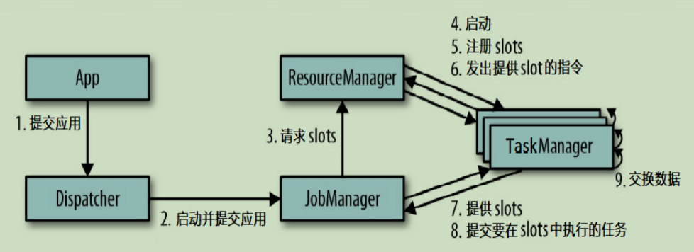
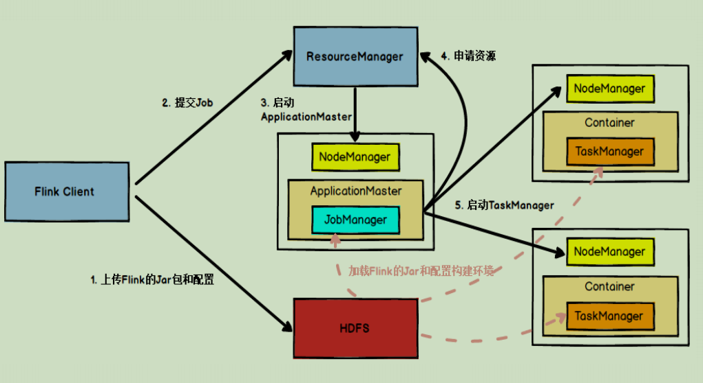
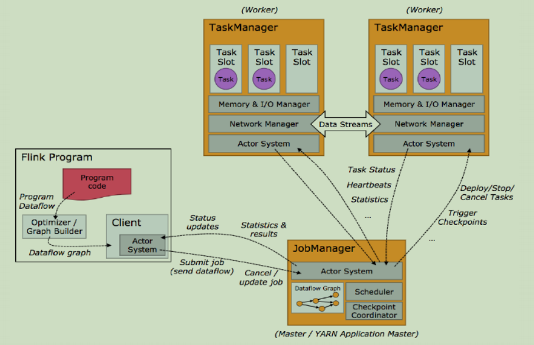
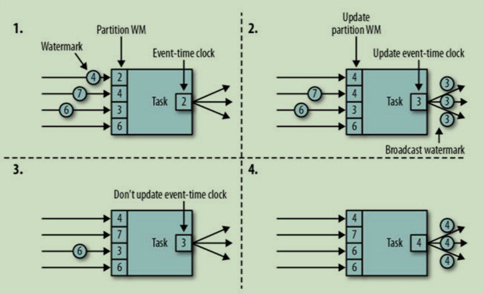

[TOC]

# 1. 介绍一下Flink

Apache Flink 是一个框架和分布式处理引擎，用于对无界和有界数据流进行状态计算

# 2.Flink有哪些特点

1. 事件驱动(Event-driven)

2. 基于流的世界观

   在 Flink 的世界观中，一切都是由流组成的，离线数据是有界的流；实时数据是一个没有界限的流：这就是所谓的有界流和无界流

3. 分成API

   +  越顶层越抽象，表达含义越简明，使用越方便
   + 越底层越具体，表达能力越丰富，使用越灵活

4. 支持事件时间(event-time)和处理时间(processing-time)语义

5. 精确一次(exactly-once)的状态一致性保证

6. 低延迟，每秒处理数百万个事件，毫秒级延迟

7. 与众多常用存储系统的连接

8. 高可用、可扩展

# 3. Flink和Spark Streaming的区别

最重要的一点是流(stream)和微批(micro-batching)的区别，Flink是stream，Spark Streaming是微批

1. 数据模型
   + spark 采用 RDD 模型，spark streaming 的 DStream 实际上也就是一组组小批数据 RDD 的集合
   + flink 基本数据模型是数据流，以及事件（Event）序列
2. 运行时架构
   + spark 是批计算，将 DAG 划分为不同的 stage，一个完成后才可以计算下一个
   + flink 是标准的流执行模式，一个事件在一个节点处理完后可以直接发往下一个节点进行处理

# 4. Flink有哪些组件

主要包括4大组件：JobManager、TaskManager、ResourceManager、Dispatcher

## 4.1 JobManager

1. 控制一个应用程序执行的主进程，也就是说，每个应用程序都会被一个不同的JobManager 所控制执行
2. JobManager 会先接收到要执行的应用程序，这个应用程序会包括：作业图（JobGraph）、逻辑数据流图（logical dataflow graph）和打包了所有的类库和其它资源的JAR包
3. JobManager 会把JobGraph转换成一个物理层面的数据流图，这个图被叫做“执行图”（ExecutionGraph），包含了所有可以并发执行的任务
4. JobManager 会向资源管理器（ResourceManager）请求执行任务必要的资源，也就是任务管理器（TaskManager）上的插槽（slot）。一旦它获取到了足够的资源，就会将执行图分发到真正运行它们的TaskManager上。而在运行过程中，JobManager会负责所有需要中央协调的操作，比如说检查点（checkpoints）的协调

## 4.2 TaskManager

1. Flink中的工作进程。通常在Flink中会有多个TaskManager运行，每一个TaskManager都包含了一定数量的插槽（slots）。插槽的数量限制了TaskManager能够执行的任务数量
2. 启动之后，TaskManager会向资源管理器注册它的插槽；收到资源管理器的指令后，TaskManager就会将一个或者多个插槽提供给JobManager调用。JobManager就可以向插槽分配任务（tasks）来执行了
3. 在执行过程中，一个TaskManager可以跟其它运行同一应用程序的TaskManager交换数据

## 4.3 ResourceManager

1. 主要负责管理任务管理器(TaskManager)的插槽(slot),TaskManger 插槽是Flink中定义的处理资源单元。
2. Flink为不同的环境和资源管理工具提供了不同资源管理器，比如YARN、Mesos、K8s，以及standalone部署
3. 当JobManager申请插槽资源时，ResourceManager会将有空闲插槽的TaskManager分配给JobManager。如果ResourceManager没有足够的插槽来满足JobManager的请求，它还可以向资源提供平台发起会话，以提供启动TaskManager进程的容器

## 4.4 Dispatcher

1. 可以跨作业运行，它为应用提交提供了REST接口
2. 当一个应用被提交执行时，分发器就会启动并将应用移交给一个JobManager
3. Dispatcher也会启动一个Web UI，用来方便地展示和监控作业执行的信息
4. Dispatcher在架构中可能并不是必需的，这取决于应用提交运行的方式

# 5. Flink任务提交流程(抽象)

这个提交流程对Standlone模式和Yarn模式的提交流程进行了抽象

1. 通过WebUI提交应用给Dispatcher
2. 启动一个JobManager， Dispatcher提交应用给该JobManager
3. JobManager向ResourceManager请求slots
4. ResourceManager启动slots对应数量的TaskManager
5. TaskManager向ResourceManager注册slots
6. ResourceManager向TaskManger发出提供slot的指令
7. TaskManager向JobManager提供slots
8. JobManager向TaskManager提交要在slots中执行的任务
9. TaskManager之间可以交换数据

# 6. Flink Yarn集群任务的提交流程(per-job模式)

面试的时候注意区分好面试官问的 是哪个任务提交流程

1. 上传Flink的jar包和配置到HDFS
2. client提交job给ResourceManager(不是Flink集群的，而是Yarn的)
3. 启动一个ApplicationMaster(包含当前要启动的JobManager以及要用到的Flink内部自己的ResourceManager)
4. JobManager先向Flink集群内部的ResourceManager申请资源，由于这个内部的RS本身并没有资源的控制权，再向Yarn的ResourceManager申请资源
5. Yarn的ResourceManager根据当前所需要的资源，启动对应的NodeManager,然后启动相关的TaskManager
6. TaskManager启动后会向Flink集群内部的ResourceManager注册slot
7. TaskManager接收JobManager分配的任务、执行之

如果是session模式就和 # 5 中的流程差不多了

# 7. 任务调度原理

1. Graph Builder根据业务代码生成Dataflow graph
2. 将Dataflow graph提交给JobManager
3. JobManager分析Dataflow graph，确定所需要的资源
4. JobManager可以将任务部署到TaskManager，也可以stop、cancel以及触发checkpoints
5. TaskManager需要向JobManager汇报任务的执行状态、心跳等信息

# 8. 描述一下并行度（Parallelism） 

一个特定算子的 子任务（subtask）的个数被称之为其并行度（parallelism）。

一般情况下，一个 stream 的并行度，可以认为就是其所有算子中最大的并行度

+ Flink 中每一个 TaskManager 都是一个JVM进程，它可能会在独立的线程上执行一个或多个子任务
+ 为了控制一个 TaskManager 能接收多少个 task， TaskManager 通过 task slot 来进行控制（一个 TaskManager 至少有一个 slot）
+ 默认情况下，Flink 允许子任务共享 slot，即使它们是不同任务的子任务。 这样的结果是，一个 slot 可以保存作业的整个管道
+ Task Slot 是静态的概念，是指 TaskManager 具有的并发执行能力

# 9. Flink程序的组成

所有的Flink程序都是由三部分组成的： Source 、Transformation 和 Sink

+ Source 负责读取数据源
+ Transformation 利用各种算子进行处理加工
+ Sink 负责输出

# 10. 4层执行图

Flink 中的执行图可以分成四层：StreamGraph -> JobGraph -> ExecutionGraph -> 物理执行图 

+ StreamGraph

  是根据用户通过 Stream API 编写的代码生成的最初的图。用来表示程序的拓扑结构

+ JobGraph

  StreamGraph经过优化后生成了 JobGraph，提交给 JobManager 的数据结构。主要的优化为，将多个符合条件的节点 chain 在一起作为一个节点

+ ExecutionGraph

  JobManager 根据 JobGraph 生成ExecutionGraph。ExecutionGraph是JobGraph的并行化版本，是调度层最核心的数据结构

+ 物理执行图

  JobManager 根据 ExecutionGraph 对 Job 进行调度后，在各个TaskManager 上部署 Task 后形成的“图”，并不是一个具体的数据结构

# 11. 算子之间传输数据的两种形式

一个程序中，不同的算子可能具有不同的并行度，算子之间传输数据的形式可以是 one-to-one (forwarding) 的模式也可以是redistributing 的模式，具体是哪一种形式，取决于算子的种类

+ One-to-one

  stream维护着分区以及元素的顺序（比如source和map之间），这意味着map 算子的子任务看到的元素的个数以及顺序跟 source 算子的子任务生产的元素的个数、顺序相同。map、fliter、flatMap等算子都是one-to-one

  的对应关系。

+ Redistributing

  stream的分区会发生改变。每一个算子的子任务依据所选择的transformation发送数据到不同的目标任务。例如，keyBy 基于 hashCode 重分区、而 broadcast 和 rebalance 会随机重新分区，这些算子都会引起redistribute过程，而 redistribute 过程就类似于 Spark 中的 shuffle 过程

# 12. 描述一下任务链(Operator Chains)

Flink 采用了一种称为任务链的优化技术，可以在特定条件下减少本地通信的开销。为了满足任务链的要求，必须将两个或多个算子设为相同的并行度，并通过本地转发（local forward）的方式进行连接,**相同并行度**的 **one-to-one** 操作，Flink 这样相连的算子链接在一起形成一个 task，原来的算子成为里面的 subtask

**可以进行合并的条件:**并行度相同、并且是 one-to-one 操作，两个条件缺一不可

# 13. 描述一下Flink中的窗口(window)

将无限流切割为有限流的一种方式，会将流数据分发到有限大小的桶(bucket)中进行分析

# 14. 窗口(window)有哪些类型

1. 时间窗口（Time Window）

   + 滚动时间窗口
   + 滑动时间窗口
   + 会话窗口

2. 计数窗口（Count Window）

   +  滚动计数窗口
   + 滑动计数窗口

   

# 15. 什么是滚动窗口(Tumbling Windows)

+ 将数据依据固定的窗口长度对数据进行切分
+ 时间对齐，窗口长度固定，没有重叠

# 16. 什么是滑动窗口(Sliding Windows)

+ 滑动窗口是固定窗口的更广义的一种形式，滑动窗口由固定的窗口长度和滑动间隔组成
+ 窗口长度固定，可以有重叠

# 17. 什么是会话窗口

+ 由一系列事件组合一个指定时间长度的 timeout 间隙组成，也就是一段时间没有接收到新数据就会生成新的窗口
+ 特点：时间无对齐

# 18. 三种时间语义

+ Event Time：事件创建的时间，一般情况下更关心该时间语义
+ Ingestion Time：数据进入Flink的时间
+ Processing Time：执行操作算子的本地系统时间，与机器相关

# 19. 描述一下Watermark

1. Watermark 是一种衡量 Event Time 进展的机制，可以设定延迟触发
2. Watermark 是用于处理乱序事件的，而正确的处理乱序事件，通常用Watermark 机制结合 window 来实现
3. 数据流中的 Watermark 用于表示 timestamp 小于 Watermark 的数据，都已经到达了，因此，window 的执行也是由 Watermark 触发的
4. watermark 用来让程序自己平衡延迟和结果正确性

# 20. watermark 的特点

1. watermark 是一条特殊的数据记录
2. watermark 必须单调递增，以确保任务的事件时间时钟在向前推进，而不是在后退
3. watermark 与数据的时间戳相关

# 21. watermark 的传递

如果上下游有多个并行子任务，上游向下游传递是通过广播变量的方式，下游接收上游的watermark会保持一个分区watermark,自己的时钟是以这些分区watermark中最小的那个为准

# 22. watermark 的设定

+ 在 Flink 中，watermark 由应用程序开发人员生成，这通常需要对相应的领域有一定的了解
+ 如果watermark设置的延迟太久，收到结果的速度可能就会很慢，解决办法是在水位线到达之前输出一个近似结果
+ 而如果watermark到达得太早，则可能收到错误结果，不过 Flink 处理迟到数据的机制可以解决这个问题

# 23. Flink 中的状态

1. 由一个任务维护，并且用来计算某个结果的所有数据，都属于这个任务的状态
2. 可以认为状态就是一个本地变量，可以被任务的业务逻辑访问
3. Flink 会进行状态管理，包括状态一致性、故障处理以及高效存储和访问，以便开发人员可以专注于应用程序的逻辑
4. 在 Flink 中，状态始终与特定算子相关联
5. 为了使运行时的 Flink 了解算子的状态，算子需要预先注册其状态

# 24. Flink中的状态的分类

有两种类型的状态：

+ 算子状态（Operator State） 

  算子状态的作用范围限定为算子任务

+ 键控状态（Keyed State） 

  根据输入数据流中定义的键（key）来维护和访问

# 25. 描述一下算子状态（Operator State）

+ 算子状态的作用范围限定为算子任务，由同一并行任务所处理的所有数据都可以访问到相同的状态
+ 状态对于同一子任务而言是共享的 
+ 算子状态不能由相同或不同算子的另一个子任务访问

# 26， 算子状态数据结构有哪些

1. 列表状态（List state） 

   将状态表示为一组数据的列表

2. 联合列表状态（Union list state） 

   也将状态表示为数据的列表。它与常规列表状态的区别在于，在发生故障时的恢复

   **列表状态和联合列表状态的区别还得查一下**

3. 广播状态（Broadcast state） 

   如果一个算子有多项任务，而它的每项任务状态又都相同，那么这种特殊情况最适合应用广播状态

# 27. 描述一下键控状态（Keyed State）

+ 键控状态是根据输入数据流中定义的键（key）来维护和访问的
+ Flink 为每个 key 维护一个状态实例，并将具有相同键的所有数据，都分区到同一个算子任务中，这个任务会维护和处理这个 key 对应的状态
+ 当任务处理一条数据时，它会自动将状态的访问范围限定为当前数据的 key

# 28. 键控状态数据结构有哪些

1. 值状态（Value state）

   将状态表示为单个的值 

2. 列表状态（List state） 

   将状态表示为一组数据的列表

3. 映射状态（Map state） 

   将状态表示为一组 Key-Value 对 

4. 聚合状态（Reducing state & Aggregating State） 

   将状态表示为一个用于聚合操作的列表

# 29. 描述一下状态后端（State Backends） 

+ 每传入一条数据，有状态的算子任务都会读取和更新状态
+ 由于有效的状态访问对于处理数据的低延迟至关重要，因此每个并行任务都会在本地维护其状态，以确保快速的状态访问
+ 状态的存储、访问以及维护，由一个可插入的组件决定，这个组件就叫做**状态后端**（state backend）
+ 状态后端主要负责两件事：本地的状态管理，以及将检查点（checkpoint）状态写入远程存储

# 30. 状态后端的类型有哪些

类型有3种：MemoryStateBackend、FsStateBackend、RocksDBStateBackend

1. MemoryStateBackend

   内存级的状态后端，会将键控状态作为内存中的对象进行管理，将它们存储在TaskManager 的 JVM 堆上，而将 checkpoint 存储在 JobManager 的内存中

   特点：快速、低延迟，但不稳定

2. FsStateBackend

   将 checkpoint 存到远程的持久化文件系统（FileSystem）上，而对于本地状态，跟 MemoryStateBackend 一样，也会存在 TaskManager 的 JVM 堆上

   同时拥有内存级的本地访问速度，和更好的容错保证

3. RocksDBStateBackend

   将所有状态序列化后，存入本地的 RocksDB 中存储

# 31. 描述一下一致性检查点（Checkpoints） 

+ Flink 故障恢复机制的核心，就是应用状态的一致性检查点
+ 有状态流应用的一致检查点，其实就是所有任务的状态，在某个时间点的一份拷贝（一份快照）；这个时间点，应该是所有任务都恰好处理完一个相同的输入数据的时候

   