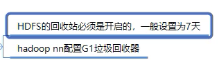

[TOC]

# 1. MapReduce的工作流程(掌握程度3分)

**回答1：**

1. 在客户端执行submit()方法之前，会先去获取一下待读取文件的信息
2. 将Job提交给yarn，这时候会带着3个信息过去(job.split(文件的切片信息),jar.job.xml)
3. Yarn会根据文件的切片信息去计算将要启动的MapTask的数量，然后去启动MapTask
4. MapTask会调用InputFormat()方法去HDFS上面读取文件,InputFormat()方法会再去调用RecordRead()方法，将数据以行首字母的偏移量为key,一行数据为value传给mapper()方法
5. Mapper()方法做一些逻辑处理后，将数据传到分区方法中，对数据进行一个分区标注后，发送到环形缓冲区中
6. 环形缓冲区默认的大小是100M，达到80%的阈值将会溢写
7. 在溢写之前会做一个排序的动作，排序的规则是按照key进行字典序排序，排序的手段是快排
8. 溢写会产生出大量的溢写文件，会再次调用merge()方法，使用归并排序，默认10个溢写文件合并成一个大文件
9. 也可以对溢写文件做一次localReduce也就是combiner的操作，但前提是combiner的结果不能对最终的结果有影响
10. 等待所有的MapTask结束之后，会启动一定数量的ReduceTask
11. ReduceTask会启动拉取线程到map端拉取数据，拉取到的数据会先加载到内存中，内存不够会写到磁盘里，等待所有的数据数据拉取完毕会将这些输出再进行一次归并排序
12. 归并后的文件会再次进行一次分组的操作，然后将数据以组为单位发送到reduce()方法
13. reduce()方法做一些逻辑判断后，最终调用OutputFormat()方法，OutputFormat()会再去调用RecordWrite()方法将数据以KV的形式写出到HDFS上

**回答2：**

​        1.客户端将每个block块切片（逻辑切分），每个切片都对应一个map任务，默认一个block块对应一个切片和一个map任务，split包含的信息：分片的元数据信息，包含起始位置，长度，和所在节点列表等

　　2.map按行读取切片数据，组成键值对，key为当前行在源文件中的字节偏移量，value为读到的字符串

　　3.map函数对键值对进行计算，输出<key,value,partition（分区号）>格式数据，partition指定该键值对由哪个reducer进行处理。通过分区器，key的hashcode对reducer个数取模。
　　4.map将kvp写入环形缓冲区内，环形缓冲区默认为100MB，阈值为80%，当环形缓冲区达到80%时，就向磁盘溢写小文件，该小文件先按照分区号排序，区号相同的再按照key进行排序，归并排序。溢写的小文件如果达到三个，则进行归并，归并为大文件，大文件也按照分区和key进行排序，目的是降低中间结果数据量（网络传输），提升运行效率
　　5.如果map任务处理完毕，则reducer发送http get请求到map主机上下载数据，该过程被称为洗牌shuffle
　　6.可以设置combinclass（需要算法满足结合律），先在map端对数据进行一个压缩，再进行传输，map任务结束，reduce任务开始
　　7.reduce会对洗牌获取的数据进行归并，如果有时间，会将归并好的数据落入磁盘（其他数据还在洗牌状态）
　　8.每个分区对应一个reduce，每个reduce按照key进行分组，每个分组调用一次reduce方法，该方法迭代计算，将结果写到hdfs输出

 **洗牌阶段**

　　1.copy:一个reduce任务需要多个map任务的输出，每个map任务完成时间很可能不同，当只要有一个map任务完成，reduce任务立即开始复制，复制线程数配置mapred-site.xml参数“mapreduce.reduce.shuffle.parallelcopies"，默认为5.

　　2.copy缓冲区：如果map输出相当小，则数据先被复制到reduce所在节点的内存缓冲区大小配置mapred-site.xml参数“mapreduce.reduce.shuffle.input.buffer.percent”，默认0.70），当内存缓冲区大小达到阀值（mapred-site.xml参数“mapreduce.reduce.shuffle.merge.percent”，默认0.66）或内存缓冲区文件数达到阀值（mapred-site.xml参数“mapreduce.reduce.merge.inmem.threshold”，默认1000）时，则合并后溢写磁盘。
　　3.sort：复制完成所有map输出后，合并map输出文件并归并排序
　　4.sort的合并：将map输出文件合并，直至≤合并因子（mapred-site.xml参数“mapreduce.task.io.sort.factor”，默认10）。例如，有50个map输出文件，进行5次合并，每次将10各文件合并成一个文件，最后5个文件。

# 2. HDFS分布式存储工作机制

## 2.1 HDFS的重要特性

**First.** HDFS是一个文件系统，用于存储和管理文件，通过统一的命名空间（类似于本地文件系统的目录树）。是分布式的，服务器集群中各个节点都有自己的角色和职责。

　　**Then.**

　　1.HDFS中的文件在物理上是**分块存储（block）**，块的大小可以通过配置参数( dfs.blocksize)来规定，默认大小在hadoop2.x版本中是128M，之前的版本中是64M。

　　2.HDFS文件系统会给客户端提供一个**统一的抽象目录树**，客户端通过路径来访问文件，形如：hdfs://namenode:port/dir-a/dir-b/dir-c/file.data

　　3.**目录结构及文件分块位置信息(元数据)**的管理由namenode节点承担，namenode是HDFS集群主节点，负责维护整个hdfs文件系统的目录树，以及每一个路径（文件）所对应的数据块信息（blockid及所在的datanode服务器）

　　4.文件的各个block的存储管理由datanode节点承担，datanode是HDFS集群从节点，每一个block都可以在多个datanode上存储多个副本（副本数量也可以通过参数设置dfs.replication，默认是3）

　　5.Datanode会定期向Namenode汇报自身所保存的文件block信息，而namenode则会负责保持文件的副本数量，HDFS的内部工作机制对客户端保持透明，客户端请求访问HDFS都是通过向namenode申请来进行。

　　6.HDFS是设计成适应一次写入，多次读出的场景，且不支持文件的修改。需要频繁的RPC交互，写入性能不好。

## 2.2 **HDFS写数据分析**

**1.概述**

 　客户端要向HDFS写数据，首先要跟namenode通信以确认可以写文件并获得接收文件block的datanode，然后客户端按顺序将文件逐个block传递给相应datanode，并由接收到block的datanode负责向其他datanode复制block的副本。

**2.写数据步骤详解**

　　1）客户端向namenode发送上传文件请求，namenode对要上传目录和文件进行检查，判断是否可以上传，并向客户端返回检查结果。

　　2）客户端得到上传文件的允许后读取客户端配置，如果没有指定配置则会读取默认配置（例如副本数和块大小默认为3和128M，副本是由客户端决定的）。向namenode请求上传一个数据块。

　　3）namenode会根据客户端的配置来查询datanode信息，如果使用默认配置，那么最终结果会返回同一个机架的两个datanode和另一个机架的datanode。这称为“机架感知”策略。

> 机架感知：HDFS采用一种称为机架感知(rack-aware)的策略来改进数据的可靠性、可用性和网络带宽的利用率。大型HDFS实例一般运行在跨越多个机架的计算机组成的集群上，不同机架上的两台机器之间的通讯需要经过交换机。在大多数情况下，同一个机架内的两台机器间的带宽会比不同机架的两台机器间的带宽大。通过一个机架感知的过程，Namenode可以确定每个Datanode所属的机架id。一个简单但没有优化的策略就是将副本存放在不同的机架上。这样可以有效防止当整个机架失效时数据的丢失，并且允许读数据的时候充分利用多个机架的带宽。这种策略设置可以将副本均匀分布在集群中，有利于当组件失效情况下的负载均衡。但是，因为这种策略的一个写操作需要传输数据块到多个机架，这增加了写的代价。在大多数情况下，副本系数是3，HDFS的存放策略是将一个副本存放在本地机架的节点上，一个副本放在同一机架的另一个节点上，最后一个副本放在不同机架的节点上。这种策略减少了机架间的数据传输，这就提高了写操作的效率。机架的错误远远比节点的错误少，所以这个策略不会影响到数据的可靠性和可用性。于此同时，因为数据块只放在两个（不是三个）不同的机架上，所以此策略减少了读取数据时需要的网络传输总带宽。在这种策略下，副本并不是均匀分布在不同的机架上。三分之一的副本在一个节点上，三分之二的副本在一个机架上，其他副本均匀分布在剩下的机架中，这一策略在不损害数据可靠性和读取性能的情况下改进了写的性能

4）客户端在开始传输数据块之前会把数据缓存在本地，当缓存大小超过了一个数据块的大小，客户端就会从namenode获取要上传的datanode列表。之后会在客户端和第一个datanode建立连接开始流式的传输数据，这个datanode会一小部分一小部分（4K）的接收数据然后写入本地仓库，同时会把这些数据传输到第二个datanode，第二个datanode也同样一小部分一小部分的接收数据并写入本地仓库，同时传输给第三个datanode，依次类推。这样逐级调用和返回之后，待这个数据块传输完成客户端后告诉namenode数据块传输完成，这时候namenode才会更新元数据信息记录操作日志。

5）第一个数据块传输完成后会使用同样的方式传输下面的数据块直到整个文件上传完成。

**细节：**

　　a.请求和应答是使用RPC的方式，客户端通过ClientProtocol与namenode通信，namenode和datanode之间使用DatanodeProtocol交互。在设计上，namenode不会主动发起RPC，而是响应来自客户端或 datanode  的RPC请求。客户端和datanode之间是使用socket进行数据传输，和namenode之间的交互采用nio封装的RPC。

　　b.HDFS有自己的序列化协议。

　　c.在数据块传输成功后但客户端没有告诉namenode之前如果namenode宕机那么这个数据块就会丢失。

　　d.在流式复制时，逐级传输和响应采用响应队列来等待传输结果。队列响应完成后返回给客户端。

　　c.在流式复制时如果有一台或两台（不是全部）没有复制成功，不影响最后结果，只不过datanode会定期向namenode汇报自身信息。如果发现异常namenode会指挥datanode删除残余数据和完善副本。如果副本数量少于某个最小值就会进入安全模式。

> 安全模式：Namenode启动后会进入一个称为安全模式的特殊状态。处于安全模式的Namenode是不会进行数据块的复制的。Namenode从所有的  Datanode接收心跳信号和块状态报告。块状态报告包括了某个Datanode所有的数据块列表。每个数据块都有一个指定的最小副本数。当Namenode检测确认某个数据块的副本数目达到这个最小值，那么该数据块就会被认为是副本安全(safely  replicated)的；在一定百分比（这个参数可配置）的数据块被Namenode检测确认是安全之后（加上一个额外的30秒等待时间），Namenode将退出安全模式状态。接下来它会确定还有哪些数据块的副本没有达到指定数目，并将这些数据块复制到其他Datanode

## 2.3 HDFS读数据分析

**1.概述**

 　客户端将要读取的文件路径发送给namenode，namenode获取文件的元信息（主要是block的存放位置信息）返回给客户端，客户端根据返回的信息找到相应datanode逐个获取文件的block并在客户端本地进行数据追加合并从而获得整个文件。

**2.读数据步骤详解**

​        1）客户端向namenode发起RPC调用，请求读取文件数据。

　　2）namenode检查文件是否存在，如果存在则获取文件的元信息（blockid以及对应的datanode列表）。

　　3）客户端收到元信息后选取一个网络距离最近的datanode，依次请求读取每个数据块。客户端首先要校检文件是否损坏，如果损坏，客户端会选取另外的datanode请求。

　　4）datanode与客户端简历socket连接，传输对应的数据块，客户端收到数据缓存到本地，之后写入文件。

　　5）依次传输剩下的数据块，直到整个文件合并完成。

> 它会检验从Datanode获取的数据跟相应的校验和文件中的校验和是否匹配，如果不匹配，客户端可以选择从其他Datanode获取该数据块的副本

## 2.4 HDFS删除数据分析

HDFS删除数据比较流程相对简单，只列出详细步骤:

　　1）客户端向namenode发起RPC调用，请求删除文件。namenode检查合法性。

　　2）namenode查询文件相关元信息，向存储文件数据块的datanode发出删除请求。

　　3）datanode删除相关数据块。返回结果。

　　4）namenode返回结果给客户端。

> 　当用户或应用程序删除某个文件时，这个文件并没有立刻从HDFS中删除。实际上，HDFS会将这个文件重命名转移到/trash目录。只要文件还在/trash目录中，该文件就可以被迅速地恢复。文件在/trash中保存的时间是可配置的，当超过这个时间时，Namenode就会将该文件从名字空间中删除。删除文件会使得该文件相关的数据块被释放。注意，从用户删除文件到HDFS空闲空间的增加之间会有一定时间的延迟。只要被删除的文件还在/trash目录中，用户就可以恢复这个文件。如果用户想恢复被删除的文件，他/她可以浏览/trash目录找回该文件。/trash目录仅仅保存被删除文件的最后副本。/trash目录与其他的目录没有什么区别，除了一点：在该目录上HDFS会应用一个特殊策略来自动删除文件。目前的默认策略是删除/trash中保留时间超过6小时的文件。将来，这个策略可以通过一个被良好定义的接口配置。
>
> 　　当一个文件的副本系数被减小后，Namenode会选择过剩的副本删除。下次心跳检测时会将该信息传递给Datanode。Datanode遂即移除相应的数据块，集群中的空闲空间加大。同样，在调用setReplication API结束和集群中空闲空间增加间会有一定的延迟。

## 2.5 NameNode元数据管理原理分析

**1.概述**

　　首先明确namenode的职责：响应客户端请求、管理元数据。

　　namenode对元数据有三种存储方式：

　　内存元数据(NameSystem)

　　磁盘元数据镜像文件

　　数据操作日志文件（可通过日志运算出元数据）

　　细节：HDFS不适合存储小文件的原因，每个文件都会产生元信息，当小文件多了之后元信息也就多了，对namenode会造成压力。

　　**2.对三种存储机制的进一步解释**

　　内存元数据就是当前namenode正在使用的元数据，是存储在内存中的。

　　磁盘元数据镜像文件是内存元数据的镜像，保存在namenode工作目录中，它是一个准元数据，作用是在namenode宕机时能够快速较准确的恢复元数据。称为fsimage。

　　数据操作日志文件是用来记录元数据操作的，在每次改动元数据时都会追加日志记录，如果有完整的日志就可以还原完整的元数据。主要作用是用来完善fsimage，减少fsimage和内存元数据的差距。称为editslog。

　　**3.checkpoint机制分析**

　　因为namenode本身的任务就非常重要，为了不再给namenode压力，日志合并到fsimage就引入了另一个角色secondarynamenode。secondarynamenode负责定期把editslog合并到fsimage，“定期”是namenode向secondarynamenode发送RPC请求的，是按时间或者日志记录条数为“间隔”的，这样即不会浪费合并操作又不会造成fsimage和内存元数据有很大的差距。因为元数据的改变频率是不固定的。

　　每隔一段时间，会由secondary namenode将namenode上积累的所有edits和一个最新的fsimage下载到本地，并加载到内存进行merge（这个过程称为checkpoint）。

​        1）namenode向secondarynamenode发送RPC请求，请求合并editslog到fsimage。

　　2）secondarynamenode收到请求后从namenode上读取（通过http服务）editslog（多个，滚动日志文件）和fsimage文件。

　　3）secondarynamenode会根据拿到的editslog合并到fsimage。形成最新的fsimage文件。（中间有很多步骤，把文件加载到内存，还原成元数据结构，合并，再生成文件，新生成的文件名为fsimage.checkpoint）。

　　4）secondarynamenode通过http服务把fsimage.checkpoint文件上传到namenode，并且通过RPC调用把文件改名为fsimage。

　　namenode和secondary namenode的工作目录存储结构完全相同，所以，当namenode故障退出需要重新恢复时，可以从secondary  namenode的工作目录中将fsimage拷贝到namenode的工作目录，以恢复namenode的元数据。

　　关于checkpoint操作的配置：

> dfs.namenode.checkpoint.check.period=60  #检查触发条件是否满足的频率，60秒
>
> dfs.namenode.checkpoint.dir=file://${hadoop.tmp.dir}/dfs/namesecondary
>
> \#以上两个参数做checkpoint操作时，secondary namenode的本地工作目录
>
> dfs.namenode.checkpoint.edits.dir=${dfs.namenode.checkpoint.dir}
>
> dfs.namenode.checkpoint.max-retries=3 #最大重试次数
>
> dfs.namenode.checkpoint.period=3600 #两次checkpoint之间的时间间隔3600秒
>
> dfs.namenode.checkpoint.txns=1000000 #两次checkpoint之间最大的操作记录

editslog和fsimage文件存储在$dfs.namenode.name.dir/current目录下，这个目录可以在hdfs-site.xml中配置的。这个目录下的文件结构如下：

包括edits日志文件（滚动的多个文件），有一个是edits_inprogress_*是当前正在写的日志。fsimage文件以及md5校检文件。seen_txid是记录当前滚动序号，代表seen_txid之前的日志都已经合并完成

> 　　$dfs.namenode.name.dir/current/seen_txid非常重要，是存放transactionId的文件，format之后是0，它代表的是namenode里面的edits_*文件的尾数，namenode重启的时候，会按照seen_txid的数字恢复。所以当你的hdfs发生异常重启的时候，一定要比对seen_txid内的数字是不是你edits最后的尾数，不然会发生重启namenode时metaData的资料有缺少，导致误删Datanode上多余Block的信息。

# 3. HadoopHA架构原理(100%)

归纳起来主要是两块：元数据同步和主备选举。元数据同步依赖于QJM共享存储，主备选举依赖于ZKFC和Zookeeper

## 3.1 Hadoop 系统架构

### 3.1.1 Hadoop1.x和Hadoop2.x 架构

在介绍HA之前，我们先来看下Hadoop的系统架构，这对于理解HA是至关重要的。Hadoop 1.x之前，其官方架构如图1所示:

从图中可看出，1.x版本之前只有一个Namenode,所有元数据由惟一的Namenode负责管理,可想而之当这个NameNode挂掉时整个集群基本也就不可用。
 Hadoop 2.x的架构与1.x有什么区别呢。我们来看下2.x的架构：

2.x版本中，HDFS架构解决了单点故障问题，即引入双NameNode架构，同时借助共享存储系统来进行元数据的同步，共享存储系统类型一般有几类，如：Shared NAS+NFS、BookKeeper、BackupNode 和 Quorum Journal  Manager(QJM)，上图中用的是QJM作为共享存储组件，通过搭建奇数结点的JournalNode实现主备NameNode元数据操作信息同步。通过ZKFC 选举Active ，监控状态，自动备援。DN会同时向ActiveNN和StandbyNN发送心跳。

**Active NameNode**：接受client的RPC请求并处理，同时写自己的Editlog和共享存储上的Editlog，接收DataNode的Block report, block location updates和heartbeat
**Standby NameNode**：同样会接到来自DataNode的Block report, block location  updates和heartbeat，同时会从共享存储的Editlog上读取并执行这些log操作，使得自己的NameNode中的元数据（Namespcaeinformation + Block locations map）都是和Active  NameNode中的元数据是同步的。所以说Standby模式的NameNode是一个热备（Hot Standby  NameNode），一旦切换成Active模式，马上就可以提供NameNode服务
**JounalNode**：用于Active NameNode，Standby NameNode同步数据，本身由一组JounnalNode结点组成，该组结点基数个，支持Paxos协议，保证高可用，是CDH5唯一支持的共享方式（相对于CDH4 促在NFS共享方式）
**ZKFC(单独进程)：**
 a.监控NN的健康状态
 b.向ZK定期发送心跳，使自己可以被选举,当自己被ZK选为主时，active FailoverController通过RPC调用使相应的NN转换为active
 c.自动备援

### 3.1.2 Hadoop 2.x元数据

Hadoop的元数据主要作用是维护HDFS文件系统中文件和目录相关信息。元数据的存储形式主要有3类：内存镜像、磁盘镜像(FSImage)、日志(EditLog)。在Namenode启动时，会加载磁盘镜像到内存中以进行元数据的管理，存储在NameNode内存；磁盘镜像是某一时刻HDFS的元数据信息的快照，包含所有相关Datanode节点文件块映射关系和命名空间(Namespace)信息，存储在NameNode本地文件系统；日志文件记录client发起的每一次操作信息，即保存所有对文件系统的修改操作，用于定期和磁盘镜像合并成最新镜像，保证NameNode元数据信息的完整，存储在NameNode本地和共享存储系统(QJM)中。

如下所示为NameNode本地的EditLog和FSImage文件格式，EditLog文件有两种状态： inprocess和finalized, inprocess表示正在写的日志文件，文件名形式:edits*inprocess*[start-txid]，finalized表示已经写完的日志文件,文件名形式：edits*[start-txid]*[end-txid]； FSImage文件也有两种状态, finalized和checkpoint， finalized表示已经持久化磁盘的文件，文件名形式:  fsimage_[end-txid], checkpoint表示合并中的fsimage, 2.x版本checkpoint过程在Standby  Namenode(SNN)上进行，SNN会定期将本地FSImage和从QJM上拉回的ANN的EditLog进行合并，合并完后再通过RPC传回ANN。

上面所示的还有一个很重要的文件就是seen_txid,保存的是一个事务ID，这个事务ID是EditLog最新的一个结束事务id，当NameNode重启时，会顺序遍历从edits_0000000000000000001到seen_txid所记录的txid所在的日志文件，进行元数据恢复，如果该文件丢失或记录的事务ID有问题，会造成数据块信息的丢失。

HA其本质上就是要保证主备NN元数据是保持一致的，即保证fsimage和editlog在备NN上也是完整的。元数据的同步很大程度取决于EditLog的同步，而这步骤的关键就是共享文件系统，下面开始介绍一下关于QJM共享存储机制

## 3.2 QJM原理

### 3.2.1 QJM背景

在QJM出现之前，为保障集群的HA，设计的是一种基于NAS的共享存储机制，即主备NameNode间通过NAS进行元数据的同步。该方案有什么缺点呢，主要有以下几点：

- 定制化硬件设备：必须是支持NAS的设备才能满足需求
- 复杂化部署过程：在部署好NameNode后，还必须额外配置NFS挂载、定制隔离脚本，部署易出错
- 简陋化NFS客户端：Bug多，部署配置易出错，导致HA不可用

所以对于替代方案而言，也必须解决NAS相关缺陷才能让HA更好服务。即设备无须定制化，普通设备即可配置HA，部署简单，相关配置集成到系统本身，无需自己定制，同时元数据的同步也必须保证完全HA，不会因client问题而同步失败。

### 3.2.2 QJM原理

#### 3.2.2.1 **QJM介绍**

QJM全称是Quorum Journal Manager,  由JournalNode（JN）组成，一般是奇数点结点组成。每个JournalNode对外有一个简易的RPC接口，以供NameNode读写EditLog到JN本地磁盘。当写EditLog时，NameNode会同时向所有JournalNode并行写文件，只要有N/2+1结点写成功则认为此次写操作成功，遵循Paxos协议。其内部实现框架如下：

从图中可看出，主要是涉及EditLog的不同管理对象和输出流对象，每种对象发挥着各自不同作用：

- FSEditLog：所有EditLog操作的入口
- JournalSet: 集成本地磁盘和JournalNode集群上EditLog的相关操作
- FileJournalManager: 实现本地磁盘上 EditLog 操作
- QuorumJournalManager: 实现JournalNode 集群EditLog操作
- AsyncLoggerSet: 实现JournalNode 集群 EditLog 的写操作集合
- AsyncLogger：发起RPC请求到JN，执行具体的日志同步功能
- JournalNodeRpcServer：运行在 JournalNode 节点进程中的 RPC 服务，接收 NameNode 端的 AsyncLogger 的 RPC 请求。
- JournalNodeHttpServer：运行在 JournalNode 节点进程中的 Http 服务，用于接收处于 Standby 状态的 NameNode 和其它 JournalNode 的同步 EditLog 文件流的请求。

#### 3.2.2.2 **QJM 写过程分析**

上面提到EditLog，NameNode会把EditLog同时写到本地和JournalNode。写本地由配置中参数dfs.namenode.name.dir控制，写JN由参数dfs.namenode.shared.edits.dir控制，在写EditLog时会由两个不同的输出流来控制日志的写过程，分别为：EditLogFileOutputStream(本地输出流)和QuorumOutputStream(JN输出流)。写EditLog也不是直接写到磁盘中，为保证高吞吐，NameNode会分别为EditLogFileOutputStream和QuorumOutputStream定义两个同等大小的Buffer，大小大概是512KB，一个写Buffer(buffCurrent)，一个同步Buffer(buffReady)，这样可以一边写一边同步，所以EditLog是一个异步写过程，同时也是一个批量同步的过程，避免每写一笔就同步一次日志。

这个是怎么实现边写边同步的呢，这中间其实是有一个缓冲区交换的过程，即bufferCurrent和buffReady在达到条件时会触发交换，如bufferCurrent在达到阈值同时bufferReady的数据又同步完时，bufferReady数据会清空，同时会将bufferCurrent指针指向bufferReady以满足继续写，另外会将bufferReady指针指向bufferCurrent以提供继续同步EditLog。上面过程用流程图就是表示如下：

里有一个问题，既然EditLog是异步写的，怎么保证缓存中的数据不丢呢,其实这里虽然是异步,但实际所有日志都需要通过logSync同步成功后才会给client返回成功码，假设某一时刻NameNode不可用了，其内存中的数据其实是未同步成功的，所以client会认为这部分数据未写成功。

第二个问题是，EditLog怎么在多个JN上保持一致的呢。下面展开介绍。

**1.隔离双写：**

在ANN每次同步EditLog到JN时，先要保证不会有两个NN同时向JN同步日志。这个隔离是怎么做的。这里面涉及一个很重要的概念Epoch Numbers，很多分布式系统都会用到。Epoch有如下几个特性：

- 当NN成为活动结点时，其会被赋予一个EpochNumber
- 每个EpochNumber是惟一的，不会有相同的EpochNumber出现
- EpochNumber有严格顺序保证，每次NN切换后其EpochNumber都会自增1，后面生成的EpochNumber都会大于前面的EpochNumber

QJM是怎么保证上面特性的呢，主要有以下几点：

这样就能保证主备NN发生切换时，就算同时向JN同步日志，也能保证日志不会写乱，因为发生切换后，原ANN的EpochNumber肯定是小于新ANN的EpochNumber，所以原ANN向JN的发起的所有同步请求都会拒绝，实现隔离功能，防止了脑裂。

- 第一步，在对EditLog作任何修改前，QuorumJournalManager(NameNode上)必须被赋予一个EpochNumber
- 第二步， QJM把自己的EpochNumber通过newEpoch(N)的方式发送给所有JN结点
- 第三步， 当JN收到newEpoch请求后，会把QJM的EpochNumber保存到一个lastPromisedEpoch变量中并持久化到本地磁盘
- 第四步， ANN同步日志到JN的任何RPC请求（如logEdits(),startLogSegment()等），都必须包含ANN的EpochNumber
- 第五步，JN在收到RPC请求后，会将之与lastPromisedEpoch对比，如果请求的EpochNumber小于lastPromisedEpoch,将会拒绝同步请求，反之，会接受同步请求并将请求的EpochNumber保存在lastPromisedEpoch

**2. 恢复in-process日志**

为什么要这步呢，如果在写过程中写失败了，可能各个JN上的EditLog的长度都不一样，需要在开始写之前将不一致的部分恢复。恢复机制如下：

1. ANN先向所有JN发送getJournalState请求；
2. JN会向ANN返回一个Epoch（lastPromisedEpoch)；
3. ANN收到大多数JN的Epoch后，选择最大的一个并加1作为当前新的Epoch，然后向JN发送新的newEpoch请求，把新的Epoch下发给JN；
4. JN收到新的Epoch后，和lastPromisedEpoch对比，若更大则更新到本地并返回给ANN自己本地一个最新EditLogSegment起始事务Id,若小则返回NN错误；
5. ANN收到多数JN成功响应后认为Epoch生成成功，开始准备日志恢复；
6. ANN会选择一个最大的EditLogSegment事务ID作为恢复依据，然后向JN发送prepareRecovery； RPC请求，对应Paxos协议2p阶段的Phase1a，若多数JN响应prepareRecovery成功，则可认为Phase1a阶段成功；
7. ANN选择进行同步的数据源，向JN发送acceptRecovery RPC请求，并将数据源作为参数传给JN。
8. JN收到acceptRecovery请求后，会从JournalNodeHttpServer下载EditLogSegment并替换到本地保存的EditLogSegment，对应Paxos协议2p阶段的Phase1b，完成后返回ANN请求成功状态。
9.  ANN收到多数JN的响应成功请求后，向JN发送finalizeLogSegment请求，表示数据恢复完成，这样之后所有JN上的日志就能保持一致。数据恢复后，ANN上会将本地处于in-process状态的日志更名为finalized状态的日志，形式如edits*[start-txid]*[stop-txid]。

**3.日志同步**

这个步骤上面有介绍到关于日志从ANN同步到JN的过程,具体如下：

 通过上面一些步骤，日志能保证成功同步到JN，同时保证JN日志的一致性，进而备NN上同步日志时也能保证数据是完整和一致的。

1. 执行logSync过程，将ANN上的日志数据放到缓存队列中
2. 将缓存中数据同步到JN，JN有相应线程来处理logEdits请求
3. JN收到数据后，先确认EpochNumber是否合法，再验证日志事务ID是否正常，将日志刷到磁盘，返回ANN成功码
4.  ANN收到JN成功请求后返回client写成功标识，若失败则抛出异常

#### 3.2.2.4 **QJM读过程分析**

这个读过程是面向备NN(SNN)的，SNN定期检查JournalNode上EditLog的变化，然后将EditLog拉回本地。SNN上有一个线程StandbyCheckpointer，会定期将SNN上FSImage和EditLog合并，并将合并完的FSImage文件传回主NN（ANN）上，就是所说的Checkpointing过程。下面我们来看下Checkpointing是怎么进行的。

在2.x版本中，已经将原来的由SecondaryNameNode主导的Checkpointing替换成由SNN主导的Checkpointing。下面是一个CheckPoint的流向图:

总的来说，就是在SNN上先检查前置条件，前置条件包括两个方面：距离上次Checkpointing的时间间隔和EditLog中事务条数限制。前置条件任何一个满足都会触发Checkpointing，然后SNN会将最新的NameSpace数据即SNN内存中当前状态的元数据保存到一个临时的fsimage文件(  fsimage.ckpt）然后比对从JN上拉到的最新EditLog的事务ID，将fsimage.ckpt_中没有，EditLog中有的所有元数据修改记录合并一起并重命名成新的fsimage文件，同时生成一个md5文件。将最新的fsimage再通过HTTP请求传回ANN。通过定期合并fsimage有什么好处呢，主要有以下几个方面：

1. 可以避免EditLog越来越大，合并成新fsimage后可以将老的EditLog删除
2. 可以避免主NN（ANN）压力过大，合并是在SNN上进行的
3. 可以保证fsimage保存的是一份最新的元数据，故障恢复时避免数据丢失

## 3.3 主备切换机制

要完成HA，除了元数据同步外，还得有一个完备的主备切换机制，Hadoop的主备选举依赖于ZooKeeper。下面是主备切换的状态图：

从图中可以看出，整个切换过程是由ZKFC来控制的，具体又可分为HealthMonitor、ZKFailoverController和ActiveStandbyElector三个组件。

1. ZKFailoverController: 是HealthMontior和ActiveStandbyElector的母体，执行具体的切换操作
2. HealthMonitor: 监控NameNode健康状态，若状态异常会触发回调ZKFailoverController进行自动主备切换
3. ActiveStandbyElector: 通知ZK执行主备选举，若ZK完成变更，会回调ZKFailoverController相应方法进行主备状态切换

在故障切换期间，ZooKeeper主要是发挥什么作用呢，有以下几点：

1. 失败保护：集群中每一个NameNode都会在ZooKeeper维护一个持久的session,机器一旦挂掉，session就会过期，故障迁移就会触发
2. Active NameNode选择：ZooKeeper有一个选择ActiveNN的机制，一旦现有的ANN宕机，其他NameNode可以向ZooKeeper申请排他成为下一个Active节点
3. 防脑裂： ZK本身是强一致和高可用的，可以用它来保证同一时刻只有一个活动节点

那在哪些场景会触发自动切换呢，从HDFS-2185中归纳了以下几个场景：

1. ActiveNN  JVM奔溃：ANN上HealthMonitor状态上报会有连接超时异常，HealthMonitor会触发状态迁移至SERVICE_NOT_RESPONDING, 然后ANN上的ZKFC会退出选举，SNN上的ZKFC会获得Active Lock, 作相应隔离后成为Active结点。
2. ActiveNN JVM冻结：这个是JVM没奔溃，但也无法响应，同奔溃一样，会触发自动切换。
3. ActiveNN 机器宕机：此时ActiveStandbyElector会失去同ZK的心跳，会话超时，SNN上的ZKFC会通知ZK删除ANN的活动锁，作相应隔离后完成主备切换。
4. ActiveNN 健康状态异常： 此时HealthMonitor会收到一个HealthCheckFailedException，并触发自动切换。
5. Active ZKFC奔溃：虽然ZKFC是一个独立的进程，但因设计简单也容易出问题，一旦ZKFC进程挂掉，虽然此时NameNode是OK的，但系统也认为需要切换，此时SNN会发一个请求到ANN要求ANN放弃主结点位置，ANN收到请求后，会触发完成自动切换。
6. ZooKeeper奔溃：如果ZK奔溃了，主备NN上的ZKFC都会感知断连，此时主备NN会进入一个NeutralMode模式，同时不改变主备NN的状态，继续发挥作用，只不过此时，如果ANN也故障了，那集群无法发挥Failover, 也就不可用了，所以对于此种场景，ZK一般是不允许挂掉到多台，至少要有N/2+1台保持服务才算是安全的。

# 4. Yarn的资源调度工作机制

# 5. Hadoop的组成结构

secondaryNameNode的工作机制查一下

# 6. MapReduce的shuffle过程

# 7. Hadoop的垃圾回收机制

# 8. Hadoop离线查看小文件

# 9. MapReduce为什么不直接Map或者Reduce

# 10. HDFS小文件怎么处理的？

## 10.1 小文件的危害

## 10.2 在flume阶段配置参数解决小文件的问题

## 10.3  使用Hadoop自带的HAR

将多个小文件打包成一个正式文件，NameNode中的元数据也就存储一份

## 10.4 CombineFileputFormat

MR读取数据时将多个小文件当做一个文件，只启一个MapTask,提高任务的执行效率

# 11. Map任务和Reduce在哪运行的

# 12. Hadoop文件大小怎么切分(切片原则)

# 13. Yarn的3个核心组件

# 14. 如何进行集群监控

# 15. NameNode线程数过少会报什么错误