[TOC]

# 1. 自增变量

## 1.1 题目/问题描述

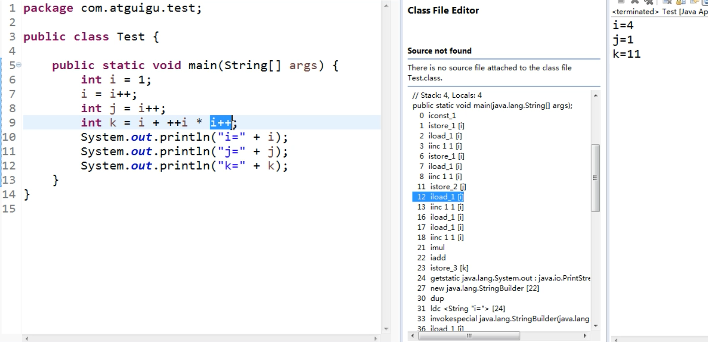

## 1.2 总结

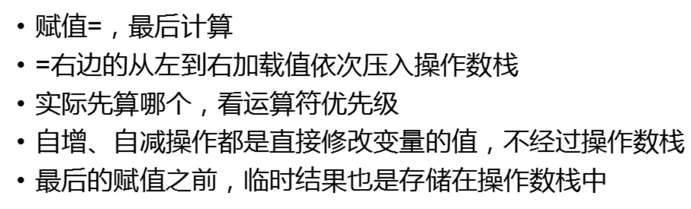

# 2. 单例模式

##  2.1 题目描述

编程题:写一个Singleton示例

# 3. 类初始化和实例初始化顺序

## 3.1 题目描述

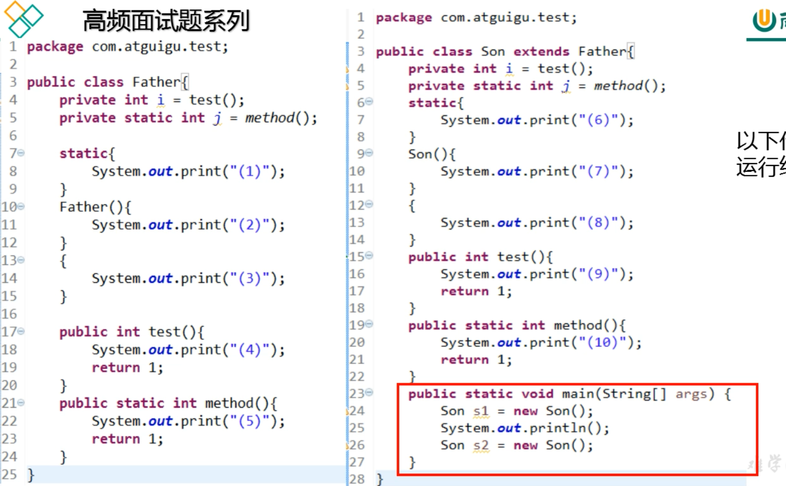

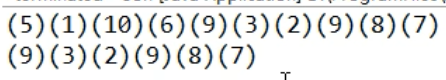

## 3.2 类初始化过程

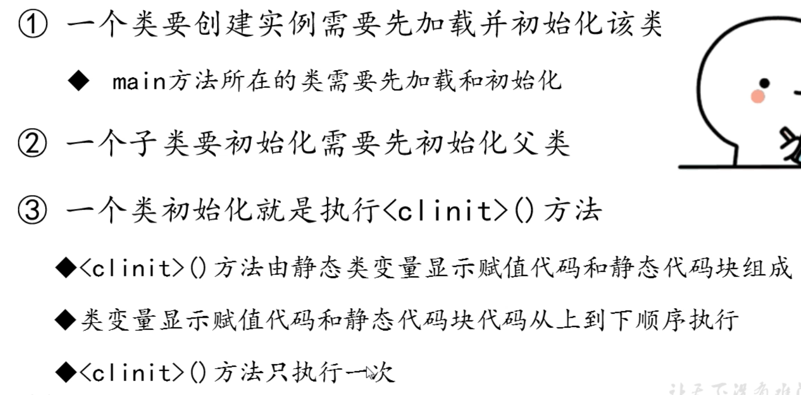

1. 如果有父类，先进行父类的初始化
2. 初始化父类静态变量(如果有的话)
3. 初始化父类静态代码块(如果有的话)
4. 初始化子类静态变量
5. 初始化子类静态代码块

## 3.3 实例初始化过程

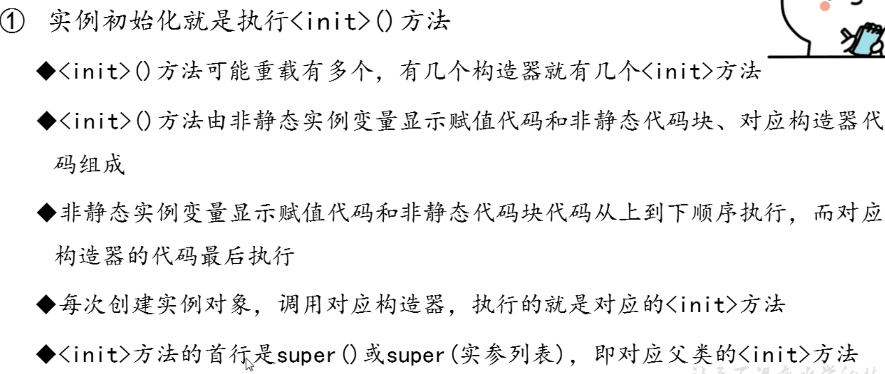

1. super()
2. 初始化局部变量
3. 子类的非静态代码块
4. 子类的无参构造器(最后)

## 3.4 方法的重写

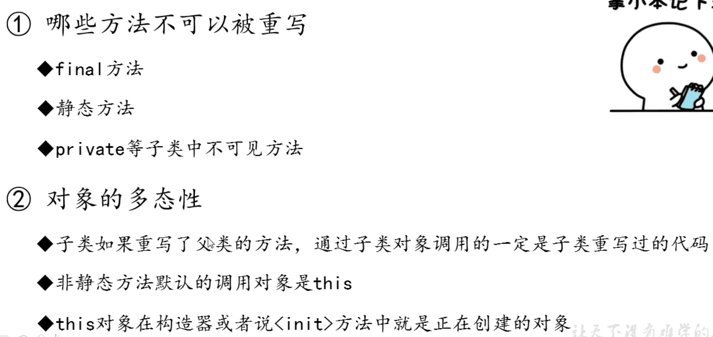

重写的要求：

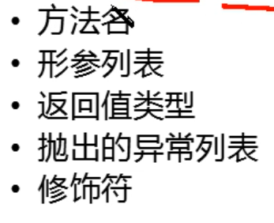

## 3.5 Override和Overload的区别

重载（Overload）是让类以统一的方式处理不同类型数据的一种手段，实质表现就是多个具有不同的参数个数或者类型的同名函数（返回值类型可随意，不能以返回类型作为重载函数的区分标准）同时存在于同一个类中，是一个类中多态性的一种表现（调用方法时通过传递不同参数个数和参数类型来决定具体使用哪个方法的多态性）。
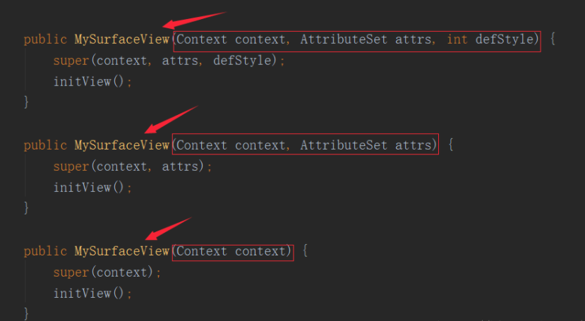

重写（Override）是父类与子类之间的多态性，实质是对父类的函数进行重新定义，如果在子类中定义某方法与其父类有相同的名称和参数则该方法被重写，不过子类函数的访问修饰权限不能小于父类的；若子类中的方法与父类中的某一方法具有相同的方法名、返回类型和参数表，则新方法将覆盖原有的方法，如需父类中原有的方法则可使用 super 关键字。

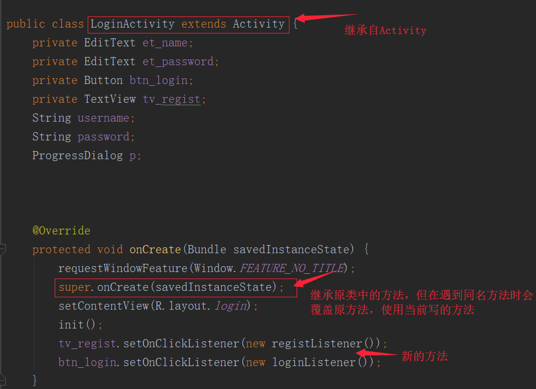

**重载规则：**必须具有不同的参数列表； 可以有不同的返回类型；可以有不同的访问修饰符；可以抛出不同的异常。

重写规则：参数列表必须完全与被重写的方法相同，否则不能称其为重写；返回类型必须一直与被重写的方法相同，否则不能称其为重写；访问修饰符的限制一定要大于等于被重写方法的访问修饰符；重写方法一定不能抛出新的检查异常或者比被重写方法申明更加宽泛的检查型异常，譬如父类方法声明了一个检查异常 IOException，在重写这个方法时就不能抛出 Exception，只能抛出 IOException 的子类异常，可以抛出非检查异常。

***重载与重写是 `Java 多态性`的不同表现。***
　　***重写是父类与子类之间多态性的表现，在运行时起作用（动态多态性，譬如实现动态绑定）***
　　***而重载是一个类中多态性的表现，在编译时起作用（静态多态性，譬如实现静态绑定）。***

## 3.6 Java 构造方法能否被重写和重载？

重写是子类方法重写父类的方法，重写的方法名不变，而类的构造方法名必须与类名一致，假设父类的构造方法如果能够被子类重写则子类类名必须与父类类名一致才行，所以 **Java 的构造方法**是`不能被重写`的。而重载是针对同一个的，所以构造方法`可以被重载`。

# 4. 方法的参数传递机制

## 4.1 问题描述

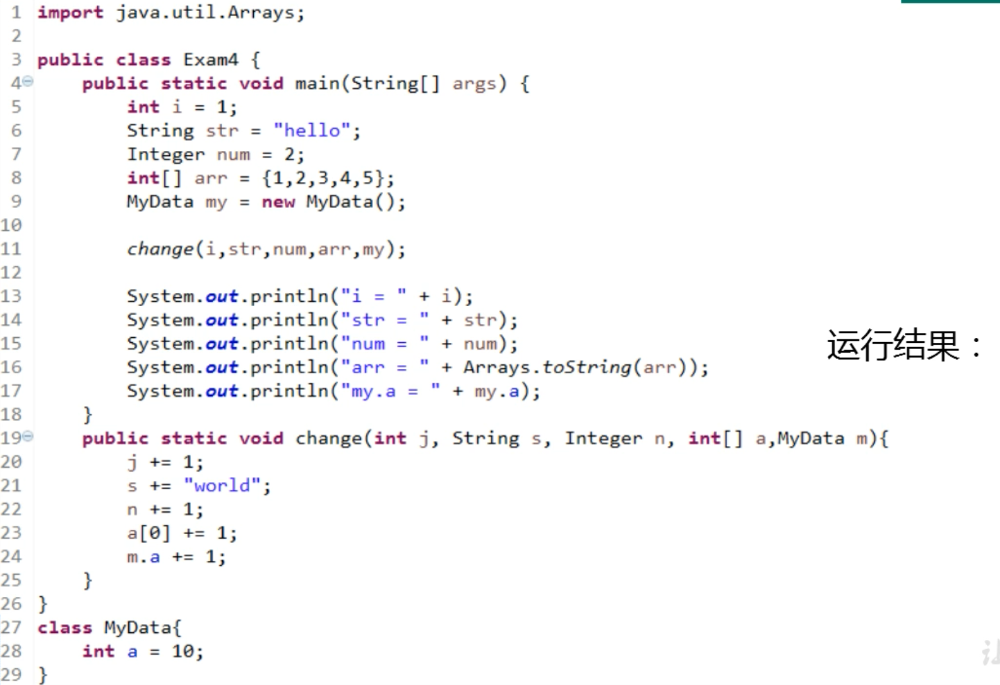

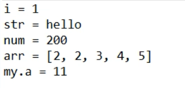

# 5. 递归与迭代

## 5.1 题目描述

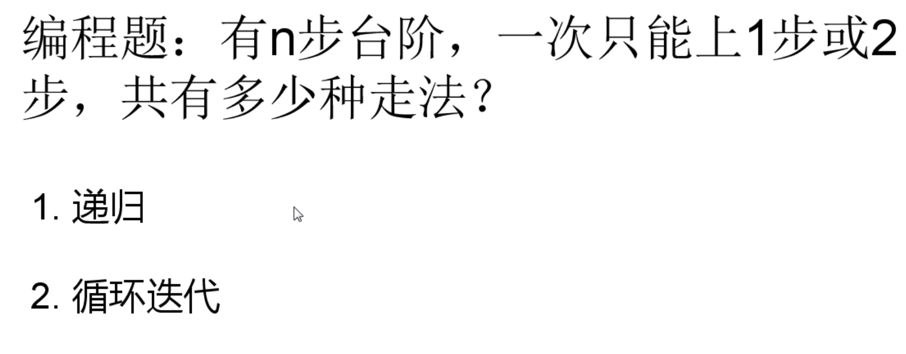

## 5.2 总结

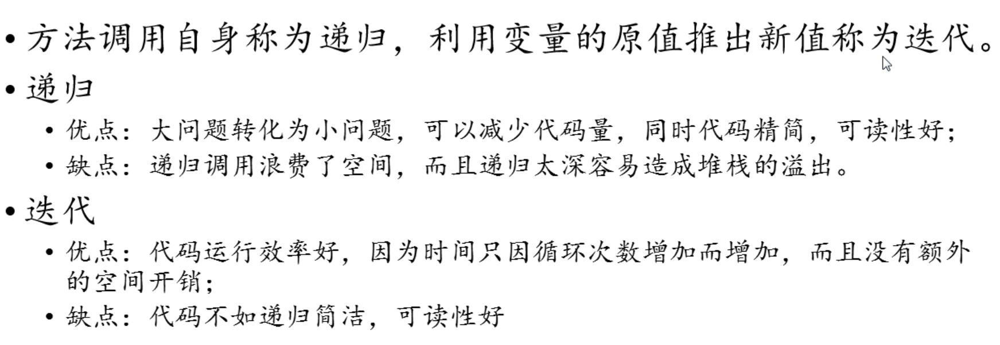

# 6. 成员变量与局部变变量

## 6.1 题目描述

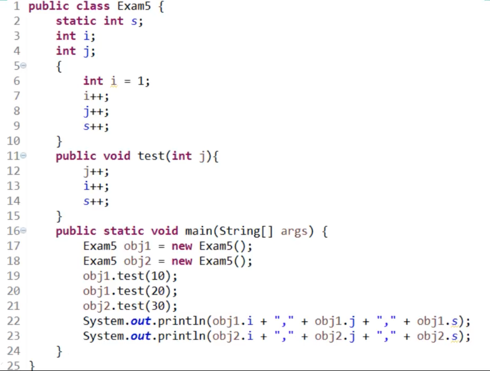

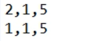

## 6.2 总结

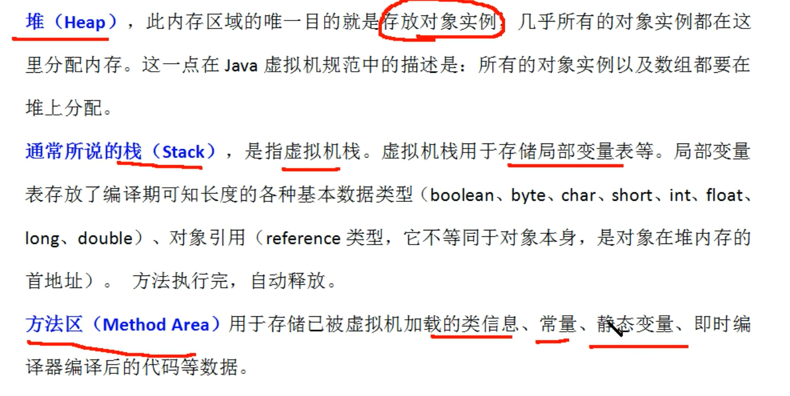

