[TOC]

# 1. 什么是kafka/原理

Kafka是一个分布式的基于发布订阅模式的消息队列(Message Queue),其中的消息是以topic进行分类的，生产者生产消息，消费者消费消息都是面向topic的。topic是逻辑上的概念，partition是物理上的概念，每个partition对应于一个log文件，该文件存储的是producer生产的数据。Producer生产的数据会被不断追加到该log文件末端，且每条数据都有自己的offset。消费者组中的每个消费者，都会实时记录自己消费到了哪个offset，以便出错恢复时从上次的位置继续消费。

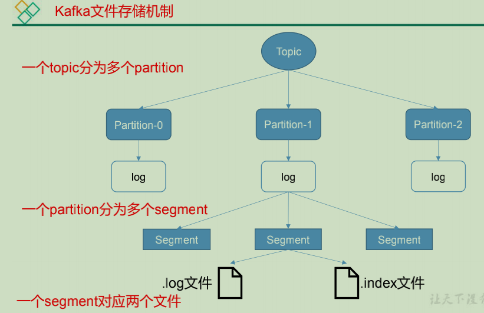

由于生产者生产的消息不断追加到log文件末尾，为防止log文件过大导致数据定位效率低下，kafka采取了分片和索引机制，将每个partition分为多个segment。每个segment对应两个文件：`.index`文件和`.log`文件；index和log文件以当前segment的第一条消息的offset命名，`.index`文件存储大量的索引信息，`.log`文件存储大量的数据，索引文件中的元数据指向对应数据文件中message的物理偏移地址。

# 2. Kafka/消息队列的作用

换个问法：为什么要使用kafka？为什么要使用消息队列？

1. 缓冲和削峰

   上游数据时有突发流量，下游可能扛不住，或者下游没有足够多的机器来保证冗余，kafka在中间可以起到一个缓冲的作用，把消息暂存在kafka中，下游服务就可以按照自己的节奏进行慢慢处理

2. 解耦

   消息队列可以作为一个接口层，接口重要的业务流程。只需要遵守约定，针对数据编程即可获取扩展能力

3. 冗余

   可以采用一对多的方式，一个生产者发布消息，可以被多个订阅topic的服务消费到，供多个毫无关联的业务使用。

4. 健壮性

   消息队列可以堆积请求，所以消费端业务即使短时间宕机，也不会影响主要业务的正常进行

5. 异步通信

   很多时候用户不想也不需要立即处理消息。消息队列提供了异步处理机制，允许用户把一个消息放入队列，但并不立即处理它。想向队列中放入多少消息就放多少，然后在需要的时候再去处理它们。

# 3.ISR/OSR/AR含义？

ISR:In-Sync Replicas 副本同步队列

AR:Assigned Replicas 所有副本

OSR:Outof-Sync Replicas 副本不同步队列

ISR由leader维护，follower从leader同步数据有一定的延迟，延迟超过阈值，leader就会把follower踢出ISR,存入OSR,新加入的follower也会先存放在OS

leader把follower踢出ISR的两个条件(满足一个就会被踢出)：

1. 延迟时间：`replica.lag.time.max.ms`
2. 延迟条数: `replica.lag.max.messages`

AR=OSR+ISR

# 4. kafka中的broker是做什么的？

一台kafka服务器就是一个broker。一个集群由多个broker组成，一个broker可以容纳多个topic。

broker是消息的代理，Producers往Brokers里面的指定Topic中写消息，Consumers从Brokers里面拉取指定topic的消息，然后进行业务处理，broker在中间起到了一个代理保存消息的中转站。

# 5. Zookeeper在kafka中起的作用

0.9版本之前，kafka用Zookeeper做meta信息存储、consumer的消费状态管理、group的管理、以及存储offset的值，0.9版本之后，offset存储在kafka内部一个默认的topic中，consumer使用了kafka内部的group coordination协议，减少了对Zookeeper的依赖，Zookeeper在kafka中用来选举controller和检测broker是否存活

# 6. ACK的三个不同值的含义

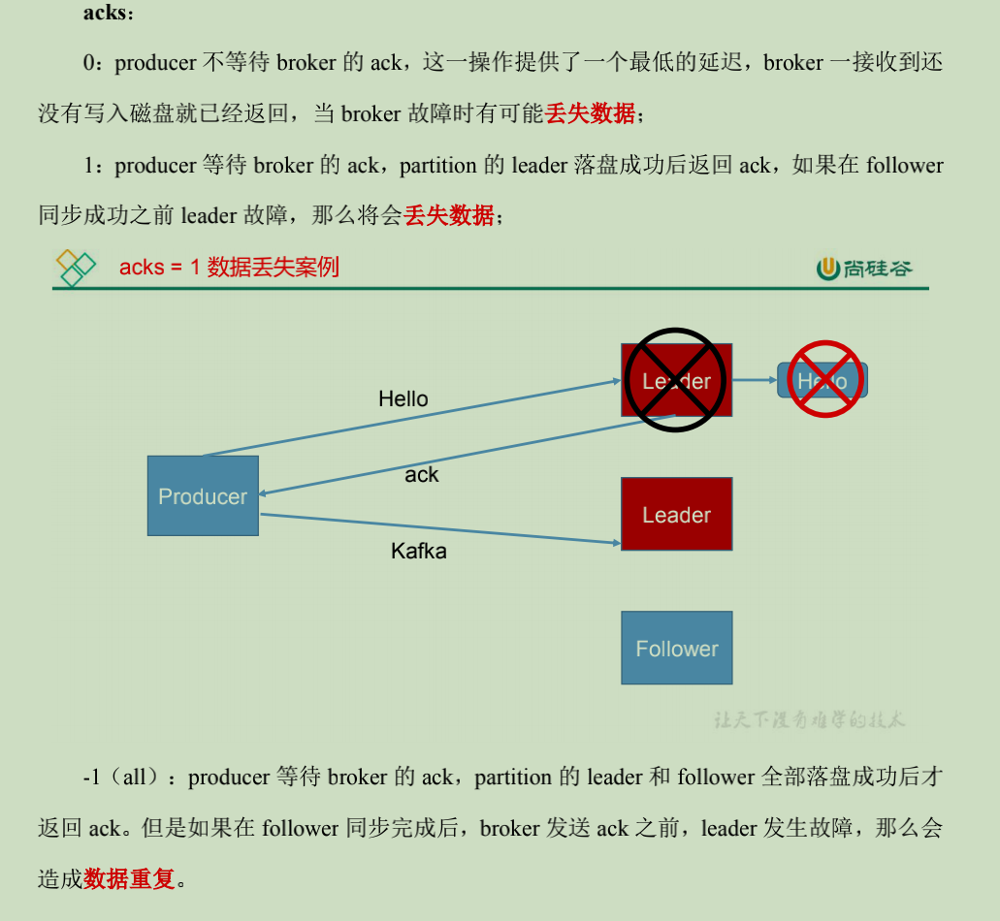

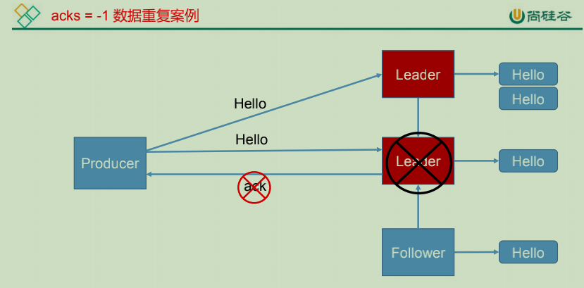

# 7. kakfa如何保证精确一次消费

# 8. 说一下kafka的unclean配置

unclean.leader.election.enable 为true的话，意味着非ISR集合的broker 也可以参与选举，这样有可能就会丢数据，spark streaming在消费过程中拿到的 end offset 会突然变小，导致 spark streaming job挂掉。如果unclean.leader.election.enable参数设置为true，就有可能发生数据丢失和数据不一致的情况，Kafka的可靠性就会降低；而如果unclean.leader.election.enable参数设置为false，Kafka的可用性就会降低。

# 9.如果leader crash时，ISR为空怎么办？

kafka在Broker端提供了一个配置参数:`unclean.leader.election`,这个参数有两个值：

+ true(默认):允许不同步副本成为leader，由于不同步副本的消息较为滞后，此时成为leader可能会出现消息不一致的情况
+ false:不允许不同步副本成为leader，此时如果发生ISR列表为空，会一直等待旧的leader恢复，降低了可用性

# 10. kafka的消息格式是怎么样的

一个kafka的Message由一个固定长度的header和一个变长的消息体组成

header部分由一个字节的magic(文件格式)和四个字节的CRC32(用于判断body消息体是否正常)组成

当magic的值为1的时候，会在magic和CRC32之间多一个字节的数据：attributes(保存一些相关属性，比如是否压缩、压缩格式等等)，如果magic的值为0，那么不保存attributes属性

body是由N个字节构成的一个消息体，包含了具体的key/value消息

# 11. 说一下consumer group

Consumer group 表示消费者组，消费者组内每个消费者负责消费不同分区的数据，一个分区只能由一个组内消费者消费。消费者组之间互不影响。所有的消费者都属于某个消费者组，即消费者组是逻辑上的一个订阅者。

# 12. kafka中的数据是否会丢失或者重复消费

要确定kafka的消费是否丢失或者重复，从两个方面入手分析：消息发送和消息消费

## 12.1 消息发送

kafka消息发送有两种方式:同步(sync)和异步(async),默认是同步方式，可通过`producer.type`属性进行配置。kafka通过配置`request.required.acks`属性来确认消息的生产

- 0：表示不进行消息接收是否成功的确认，此时如果网络异常或者缓冲区满了可能会丢失数据
- 1：表示当leader接收成功时确认，如果在follower同步完成数据之前，leader出现故障，会导致数据丢失
- -1：表示leader和follower都接收成功时确认

## 12.2 消息消费

kafka消息消费有两个consumer接口，Low-level API和High-level API

1. Low-level API:消费者自己维护offset等值，可以实现对kafka的完全控制
2. High-level API:封装了对partition和offset的管理，使用简单

如果使用高级接口Hign-level API,可能存在一个问题就是当消息消费者从集群中把消息取出来，并提交了新的消息offset之后，还没来得及消费就挂掉了，这个时候就会导致数据丢失

## 12.3 解决方案

同步模式下，确认机制设置为-1，即让消息写入leader和follower之后再确认消息发送成功。异步模式下，为防止缓冲区慢，可以在配置文件中设置不限制阻塞超时时间，当缓冲区满时让生产者一直处于阻塞状态。

# 13. kafka为什么不支持读写分离

在 Kafka 中，生产者写入消息、消费者读取消息的操作都是与 leader 副本进行交互的，从 而实现的是一种主写主读的生产消费模型。

Kafka 并不支持主写从读，因为主写从读有 2 个很明 显的缺点:

(1)数据一致性问题。数据从主节点转到从节点必然会有一个延时的时间窗口，这个时间 窗口会导致主从节点之间的数据不一致。某一时刻，在主节点和从节点中 A 数据的值都为 X， 之后将主节点中 A 的值修改为 Y，那么在这个变更通知到从节点之前，应用读取从节点中的 A 数据的值并不为最新的 Y，由此便产生了数据不一致的问题。

(2)延时问题。类似 Redis 这种组件，数据从写入主节点到同步至从节点中的过程需要经 历网络→主节点内存→网络→从节点内存这几个阶段，整个过程会耗费一定的时间。而在 Kafka 中，主从同步会比 Redis 更加耗时，它需要经历网络→主节点内存→主节点磁盘→网络→从节 点内存→从节点磁盘这几个阶段。对延时敏感的应用而言，主写从读的功能并不太适用。

# 14. kafka是怎么体现消息顺序性的

kafka每个partition中的消息在写入时是有序的，消费时，每个partition只能被每一个group中的一个消费者消费，保证了消费时也是有序的。

整个topic不保证有序，如果为了保证topic整个有序，那么将partition调整为1

# 15. 消费者提交位移的值

消费者提交消费位移时提交的是当前消费到的最新消息的offset还是offset+1？

是offset+1

# 16. kafka中的事务是怎么实现的？

kafka在0.11版本引入了事务支持，事务可以保证kafka在Exactly Once语义的基础上，生产和消费可以跨分区和会话，要么全部成功，要么全部失败

## 16.1 Producer事务

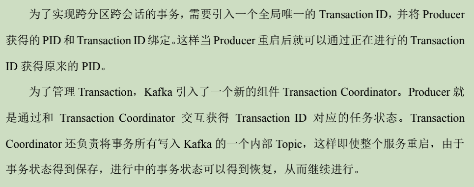

## 16.2 Consumer事务

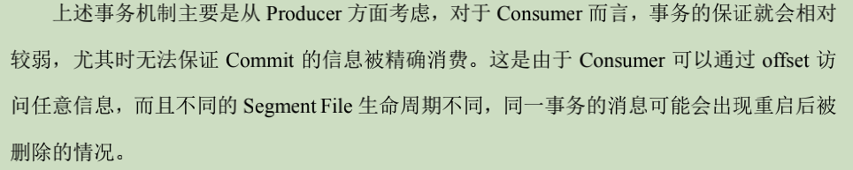

# 17. Kafka中有那些地方需要选举

一共有两处需要用到选举

1. Partition 的leader 选举策略是ISR
2. Kafka Controller  选举策略是先到先得

# 18. kafka中的HW、LEO分别表示什么含义

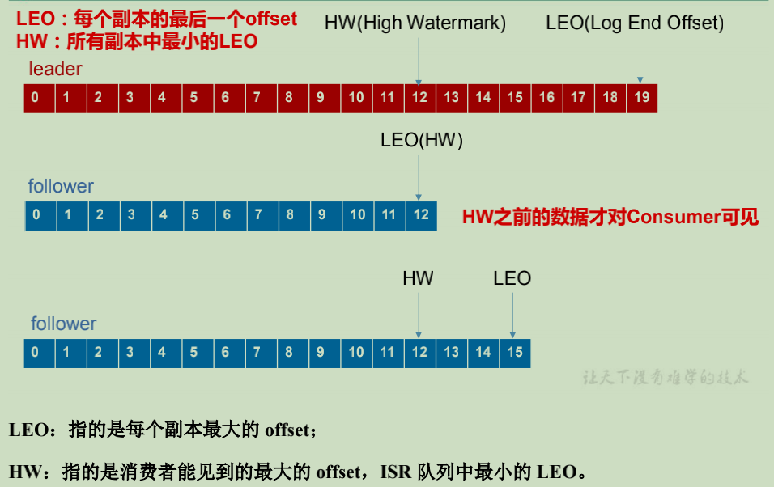

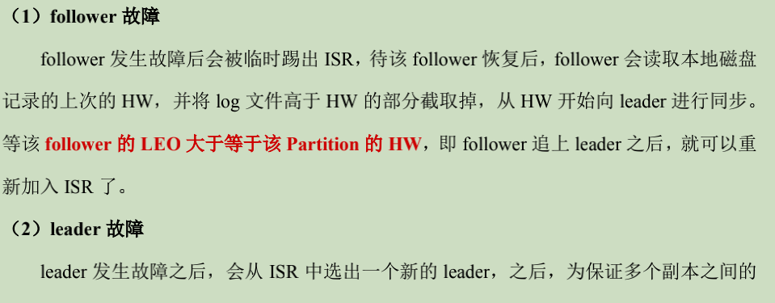

# 19. kafka中的拦截器、序列化器、分区器的处理顺序

这个问题另外一种问法：kafka生产者客户端的整体结构是怎么样的？

还有的问法：kafka生产者客户端使用了几个线程来处理，分别是什么？

2个，主线程和Sender线程。主线程负责创建消息，然后通过分区器、序列化器、拦截器作用之后缓存到累加器RecordAccumulator中。Sender线程负责将RecordAccumulator中消息发送到kafka中.

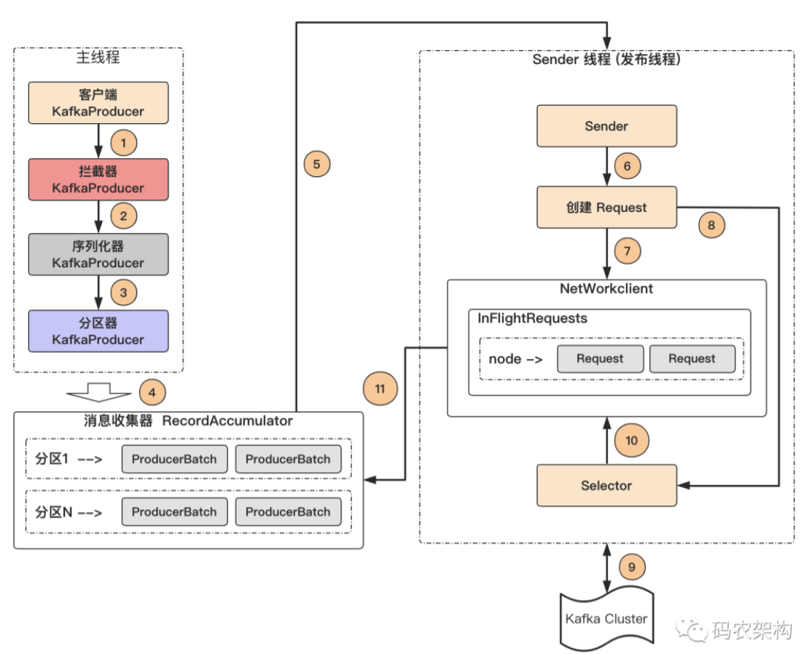

**1.拦截器：**发送前准备：**过滤、修改**消息，发送回调前：**统计**

**2.序列化器：对象**转换成**字节数组**发送给 Kafka

**3.分区器：根据 key 计算 partition**

# 20. 消费者与topic分区数的关系

“消费组中的消费者个数如果超过 topic 的分区，那么就会有消费者消费不到数据”这句话是否正确？

不正确，通过自定义分区分配策略，可以将一个consumer指定消费所有partition

# 21. 有哪些情况会造成重复消费

1. 在ack设置为-1的情况下，在leader和follower都已经落盘成功，broker返回ack之前，leader挂了，会导致重复消费
2.  消费者消费后没有commit  offset(比如程序崩溃、强行kill、消费耗时、自动提交offset)

# 22. 有哪些情况会造成消息漏消费

1. ack设置为0的情况下，broker发生故障
2. ack设置为1的情况下，leader返回ack确认后，follower在还没有完成数据同步时发生故障

# 23.创建一个topic的逻辑

当你使用 kafka-topics.sh 创建（删除）了一个 topic 之后，Kafka 背后会执行什么逻辑？

1. 会在 zookeeper 中的/brokers/topics 节点下创建一个新的 topic 节点，如：/brokers/topics/first
2. 触发 Controller 的监听程序
3. kafka Controller 负责 topic 的创建工作，并更新 metadata cache

# 24. Kafka 分区数可以增加或减少吗？为什么?

我们可以使用 bin/kafka-topics.sh 命令对 Kafka 增加 Kafka 的分区数据，但是 Kafka 不支持减少分区数。 Kafka 分区数据不支持减少是由很多原因的，比如减少的分区其数据放到哪里去？是删除，还是保留？删除的话，那么这些没消费的消息不就丢了。如果保留这些消息如何放到其他分区里面？追加到其他分区后面的话那么就破坏了 Kafka 单个分区的有序性。如果要保证删除分区数据插入到其他分区保证有序性，那么实现起来逻辑就会非常复杂

# 25. kafka内部topic

__consumer_offsets 以下划线开头，保存消费组的偏移

# 26. kafka分区分配策略

## 26.1 分区在集群中的分配策略

1. 将所有broker（n个）和partition排序
2. 将第i个Partition分配到第（i mode n）个broker上

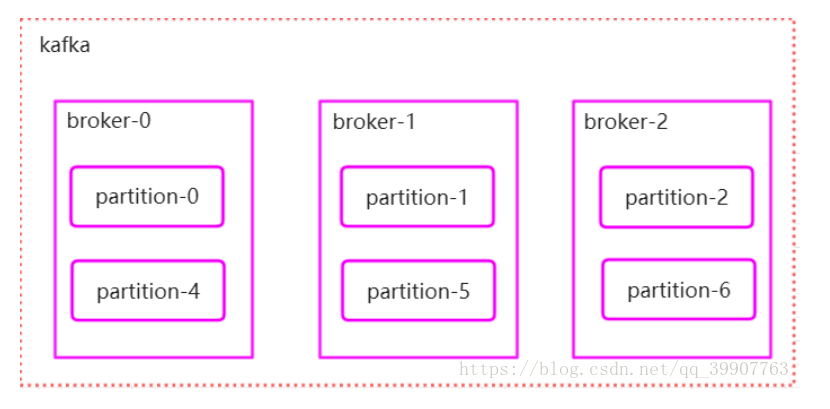

**注意上图少画了一个broker-3**

## 26.2 Producer如何把消息发送给对应的分区

1. 当key为空时，消息随机发送到各个分区（各个版本会有不同，有的是采用轮询的方式，有的是随机，有的是一定时间内只发送给固定partition,隔一段时间后随机换一个）
2. 用key的ha’sh值对partion个数取模，决定要把消息发送到哪个partition上

## 26.3消费者分区分配策略

kafka内部中存在两种分配策略：Range和RoundRobin

kafka分配分区的条件：1）同一个消费组内消费者的新增、关闭或崩溃，2）订阅的主题新增分区

1. Range

   对每个主题而言的。首先按照分区序号排序，然后将消费者排序。分区数%消费者数=m，如果m！=0，前m个消费者多消费一个分区（每个主题）

   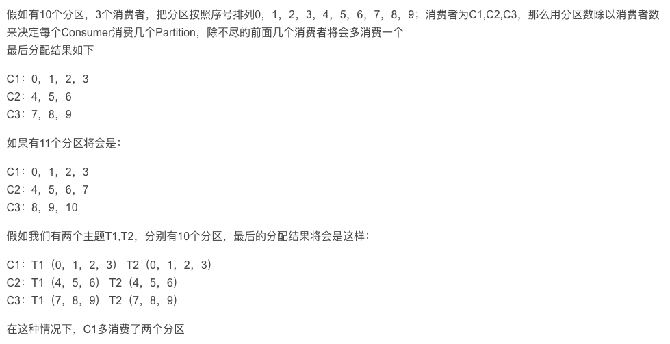

   

2. RoundRobin

   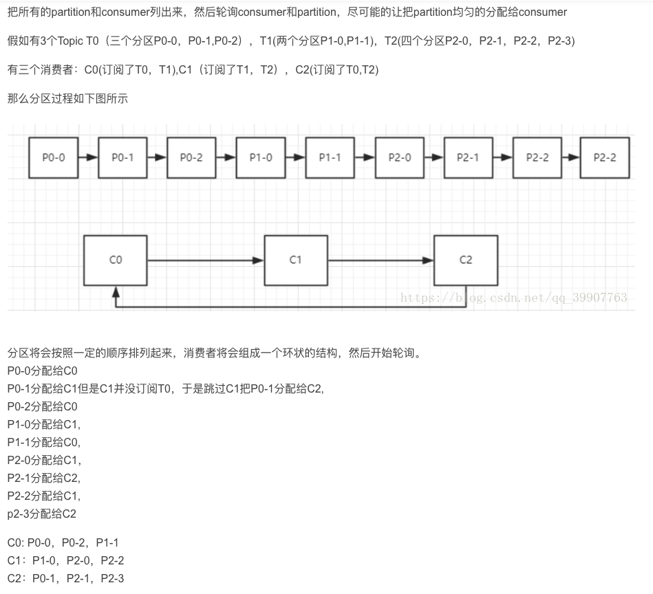

# 27. 简述kafka的日志目录结构

日志中包含多个日志段，而每个日志段又包含：消息日志文件、位移索引文件、时间戳索引文件、已终止的事务索引文件

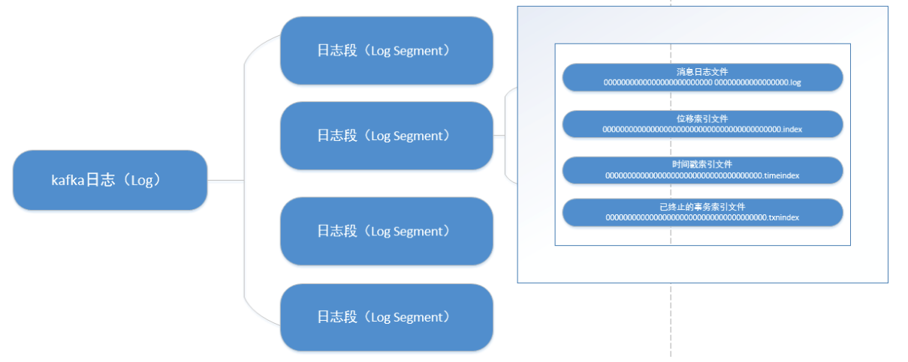

# 28.kafka controller如何查找offset对应的消息

1. 通过文件名前缀数字x找到该绝对offset 对应消息所在文件

2. offset-x为在文件中的相对偏移

3. 通过index文件中记录的索引找到最近的消息的位置

4. 从最近位置开始逐条寻找

# 29. kafka controller的作用

https://blog.csdn.net/yanerhao/article/details/106481252

1. 选举Leader和ISR
2. 同步元数据信息包括broker和分区的元数据信息
3. broker增删监听与处理
4. topic变化监听与处理
5. 分区变化监听与变化处理
6. broker优雅退出

# 30. 失效副本是指什么？有那些应对措施？

Kafka源码注释中说明了一般有两种情况会导致副本失效：

1. follower副本进程卡住，在一段时间内根本没有向leader副本发起同步请求，比如频繁的Full GC。
2. follower副本进程同步过慢，在一段时间内都无法追赶上leader副本，比如IO开销过大。

https://blog.csdn.net/u013256816/article/details/78851989

# 31. Kafka 的哪些设计让它有如此高的性能？

## 31.1 顺序写

操作系统每次从磁盘读写数据的时候，需要先寻址，也就是先要找到数据在磁盘上的物理位置，然后再进行数据读写，如果是机械硬盘，寻址就需要较长的时间。

Kafka 的设计中，数据其实是存储在磁盘上面，一般来说，会把数据存储在内存上面性能才会好。

但是 Kafka 用的是顺序写，追加数据是追加到末尾，磁盘顺序写的性能极高，在磁盘个数一定，转数达到一定的情况下，基本和内存速度一致。

随机写的话是在文件的某个位置修改数据，性能会较低。

## 31.2 零拷贝

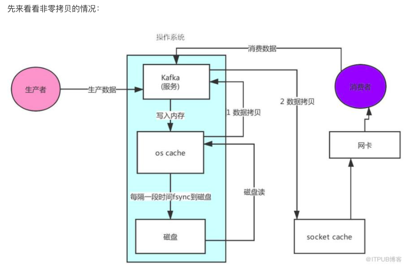

可以看到数据的拷贝从内存拷贝到 Kafka 服务进程那块，又拷贝到 Socket 缓存那块，整个过程耗费的时间比较高。Kafka 利用了 Linux 的 sendFile 技术（NIO），省去了进程切换和一次数据拷贝，让性能变得更好。

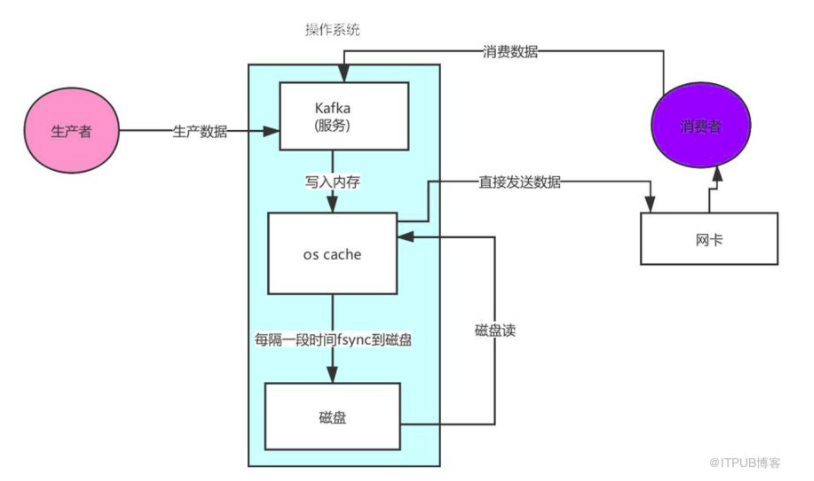

## 31.3 日志分段存储

Kafka 规定了一个分区内的 .log 文件最大为 1G，做这个限制目的是为了方便把 .log 加载到内存去操作

Kafka Broker 有一个参数，log.segment.bytes，限定了每个日志段文件的大小，最大就是 1GB。

一个日志段文件满了，就自动开一个新的日志段文件来写入，避免单个文件过大，影响文件的读写性能，这个过程叫做 log rolling，正在被写入的那个日志段文件，叫做 active log segment。

## 31.4 网络设计

Kafka 的网络设计和 Kafka 的调优有关，这也是为什么它能支持高并发的原因

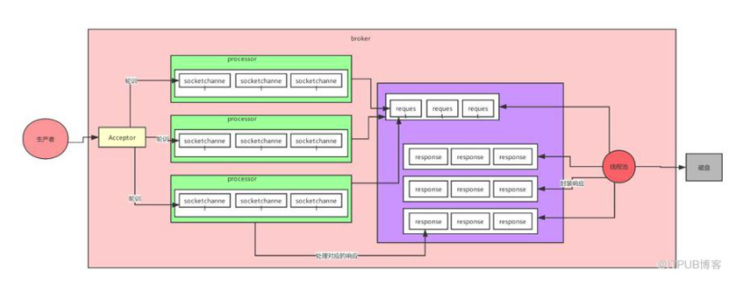

首先客户端发送请求全部会先发送给一个 Acceptor，Broker 里面会存在 3 个线程（默认是 3 个）。

这 3 个线程都是叫做 Processor，Acceptor 不会对客户端的请求做任何的处理，直接封装成一个个 socketChannel 发送给这些 Processor 形成一个队列。

发送的方式是轮询，就是先给第一个 Processor 发送，然后再给第二个，第三个，然后又回到第一个。

消费者线程去消费这些 socketChannel 时，会获取一个个 Request 请求，这些 Request 请求中就会伴随着数据。

线程池里面默认有 8 个线程，这些线程是用来处理 Request 的，解析请求，如果 Request 是写请求，就写到磁盘里。读的话返回结果。

Processor 会从 Response 中读取响应数据，然后再返回给客户端。这就是 Kafka 的网络三层架构。

所以如果我们需要对 Kafka 进行增强调优，增加 Processor 并增加线程池里面的处理线程，就可以达到效果。

Request 和 Response 那一块部分其实就是起到了一个缓存的效果，是考虑到 Processor 们生成请求太快，线程数不够不能及时处理的问题。

所以这就是一个加强版的 Reactor 网络线程模型。

