[TOC]

# 1. Spark中创建RDD的4中方式

## 1.1 **从集合（内存）中创建** **RDD**

从集合中创建 RDD，Spark 主要提供了两个方法：parallelize 和 makeRDD

```scala
val sparkConf =
new SparkConf().setMaster("local[*]").setAppName("spark")
val sparkContext = new SparkContext(sparkConf)
val rdd1 = sparkContext.parallelize(
List(1,2,3,4)
)
val rdd2 = sparkContext.makeRDD(
List(1,2,3,4)
)
rdd1.collect().foreach(println)
rdd2.collect().foreach(println)
sparkContext.stop()
```

从底层代码实现来讲，makeRDD 方法其实就是 parallelize 方法

```scala
def makeRDD[T: ClassTag](
seq: Seq[T],
numSlices: Int = defaultParallelism): RDD[T] = withScope {
parallelize(seq, numSlices)
}
```

## 1.2 **从外部存储（文件）创建** **RDD**

由外部存储系统的数据集创建 RDD 包括：本地的文件系统，所有 Hadoop 支持的数据集，比如 HDFS、HBase 等。

```scala
val sparkConf =
new SparkConf().setMaster("local[*]").setAppName("spark")
val sparkContext = new SparkContext(sparkConf)
val fileRDD: RDD[String] = sparkContext.textFile("input")
fileRDD.collect().foreach(println)
sparkContext.stop()
```

## 1.3 **从其他** **RDD** **创建**

主要是通过一个 RDD 运算完后，再产生新的 RDD

## 1.4 **直接创建** RDD（new）

使用 new 的方式直接构造 RDD，一般由 Spark 框架自身使用


# 2. Spark中创建DataFrame的3种方式

## 2.1 通过 Spark 的数据源进行创建

Spark 支持创建文件的数据源格式包括：

```bash
csv format jdbc json load option options orc parquet schema 
table text textFile
```

读取 json 文件创建 DataFrame

```scala
scala> val df = spark.read.json("data/user.json")
df: org.apache.spark.sql.DataFrame = [age: bigint， username: string]
```


## 2.2 从一个存在的 RDD 进行转换


## 2. 3 从 Hive Table 进行查询返回


# 3. Spark是什么

Spark 是一种基于内存的快速、通用、可扩展的大数据分析计算引擎。

# 4. Spark有哪些模块

+ Spark SQL

  Spark SQL 是 Spark 用来操作结构化数据的组件。通过 Spark SQL，用户可以使用 SQL或者 Apache Hive 版本的 SQL 方言（HQL）来查询数据

+ Spark Streaming

  Spark Streaming 是 Spark 平台上针对实时数据进行流式计算的组件，提供了丰富的处理数据流的 API。

+ Spark MLib

  MLlib 是 Spark 提供的一个机器学习算法库。MLlib 不仅提供了模型评估、数据导入等额外的功能，还提供了一些更底层的机器学习原语

+ Spark Graphx

  GraphX 是 Spark 面向图计算提供的框架与算法库

# 5. Spark运行模式

## 5.1 Local模式

不需要其他任何节点资源就可以在本地执行 Spark 代码的环境

提交应用示例：

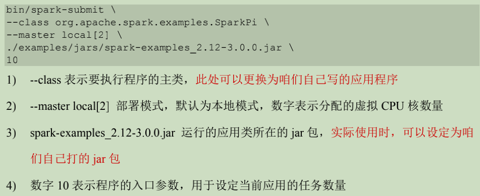

## 5.2 Standalone模式

独立模式，Spark 原生的简单集群管理器，自带完整的服务，可单独部署到一个集群中，无需依赖任何其他资源管理系统，使用 Standalone 可以很方便地搭建一个集群

Standalone 集群有 2 个重要组成部分，分别是：

1) Master(RM)：是一个进程，主要负责资源的调度和分配，并进行集群的监控等职责；

2) Worker(NM)：是一个进程，一个 Worker 运行在集群中的一台服务器上，主要负责两个职责，一个是用自己的内存存储 RDD 的某个或某些 partition；另一个是启动其他进程和线程（Executor），对 RDD 上的 partition 进行并行的处理和计算

提交应用示例

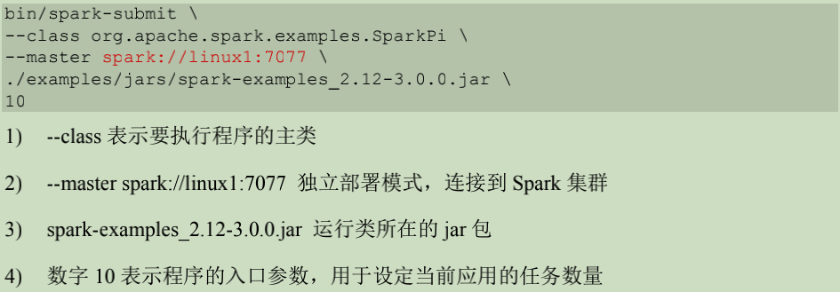


## 5.3 Yarn模式

统一的资源管理机制，在上面可以运行多套计算框架，如 MR、Storm等。根据 Driver 在集群中的位置不同，分为 yarn client（集群外）和 yarn cluster（集群内部）

提交应用示例

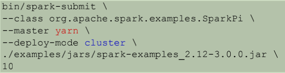

## 5.4 **K8S **

容器式部署环境。

##  Mesos模式

一个强大的分布式资源管理框架，它允许多种不同的框架部署在其上，包括 Yarn

## 5.5 Windows模式


## 5.6 部署模式对比

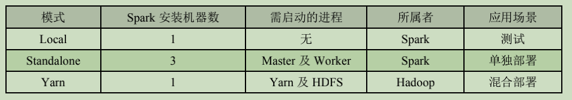

# 6. Spark常用端口号

+ Spark 查看当前 Spark-shell 运行任务情况端口号：4040（计算） 
+ Spark Master 内部通信服务端口号：7077
+ Standalone 模式下，Spark Master Web 端口号：8080（资源）
+ Spark 历史服务器端口号：18080
+ Hadoop YARN 任务运行情况查看端口号：8088

# 7. Spark核心组件

## 7.1 **Driver**

Spark 驱动器节点，用于执行 Spark 任务中的 main 方法，负责实际代码的执行工作

Driver 在 Spark 作业执行时主要负责：

+ 将用户程序转化为作业（job） 
+ 在 Executor 之间调度任务(task)
+ 跟踪 Executor 的执行情况
+ 通过 UI 展示查询运行情况

## 7.2 **Executor**

Spark Executor 是集群中工作节点（Worker）中的一个 JVM 进程，负责在 Spark 作业中运行具体任务（Task），任务彼此之间相互独立。Spark 应用启动时，Executor 节点被同时启动，并且始终伴随着整个 Spark 应用的生命周期而存在。如果有 Executor 节点发生了故障或崩溃，Spark 应用也可以继续执行，会将出错节点上的任务调度到其他Executor 节点上继续运行。

Executor 有两个核心功能：

+ 负责运行组成 Spark 应用的任务，并将结果返回给驱动器进程
+ 它们通过自身的块管理器（Block Manager）为用户程序中要求缓存的 RDD 提供内存式存储。RDD 是直接缓存在 Executor 进程内的，因此任务可以在运行时充分利用缓存数据加速运算

## 7.3 **Master & Worker**

Spark 集群的独立部署环境中，不需要依赖其他的资源调度框架，自身就实现了资源调度的功能，所以环境中还有其他两个核心组件：Master 和 Worker，这里的 Master 是一个进程，主要负责资源的调度和分配，并进行集群的监控等职责，类似于 Yarn 环境中的 RM, 而Worker 呢，也是进程，一个 Worker 运行在集群中的一台服务器上，由 Master 分配资源对数据进行并行的处理和计算，类似于 Yarn 环境中 NM


## 7.4 **ApplicationMaster**

Hadoop 用户向 YARN 集群提交应用程序时,提交程序中应该包含 ApplicationMaster，用于向资源调度器申请执行任务的资源容器 Container，运行用户自己的程序任务 job，监控整个任务的执行，跟踪整个任务的状态，处理任务失败等异常情况。

说的简单点就是，ResourceManager（资源）和 Driver（计算）之间的解耦合靠的就是ApplicationMaster


# 8. 提交流程

## 8.1 **Yarn Client** **模式**

Client 模式将用于监控和调度的 Driver 模块在客户端执行，而不是在 Yarn 中，所以一般用于测试

1. Driver 在任务提交的本地机器上运行
2. ResourceManager 分配 container，在合适的 NodeManager 上启动 ApplicationMaster，负责向 ResourceManager 申请 Executor 内存
3. ResourceManager 接到 ApplicationMaster 的资源申请后会分配 container，然后ApplicationMaster 在资源分配指定的 NodeManager 上启动 Executor 进程
4. Executor 进程启动后会向 Driver 反向注册，Executor 全部注册完成后 Driver 开始执行main 函数
5. 之后执行到 Action 算子时，触发一个 Job，并根据宽依赖开始划分 stage，每个 stage 生成对应的 TaskSet，之后将 task 分发到各个 Executor 上执行

## 8.2 **Yarn Cluster** **模式**

Cluster 模式将用于监控和调度的 Driver 模块启动在 Yarn 集群资源中执行。一般应用于实际生产环境

1. 在 YARN Cluster 模式下，任务提交后会和 ResourceManager 通讯申请启动ApplicationMaster
2. 随后 ResourceManager 分配 container，在合适的 NodeManager 上启动 ApplicationMaster，此时的 ApplicationMaster 就是 Driver
3. Driver 启动后向 ResourceManager 申请 Executor 内存，ResourceManager 接到ApplicationMaster 的资源申请后会分配 container，然后在合适的 NodeManager 上启动Executor 进程
4. Executor 进程启动后会向 Driver 反向注册，Executor 全部注册完成后 Driver 开始执行main 函数
5. 之后执行到 Action 算子时，触发一个 Job，并根据宽依赖开始划分 stage，每个 stage 生成对应的 TaskSet，之后将 task 分发到各个 Executor 上执行

# 9. Spark 3大数据结构

## 9.1 RDD : 弹性分布式数据集


## 9.2 累加器：分布式共享只写变量


## 9.3 广播变量：分布式共享只读变量


# 10. map 和 mapPartitions 的区别？

## 10.1 数据处理角度

Map 算子是分区内一个数据一个数据的执行，类似于串行操作。而 mapPartitions 算子是以分区为单位进行批处理操作

## 10.2 功能的角度

Map 算子主要目的将数据源中的数据进行转换和改变。但是不会减少或增多数据。

MapPartitions 算子需要传一个迭代器，返回一个迭代器，没有要求的元素的个数保持不变，所以可以增加或减少数据

## 10.3 性能的角度

Map 算子因为类似于串行操作，所以性能比较低，而是 mapPartitions 算子类似于批处理，所以性能较高。但是 mapPartitions 算子会长时间占用内存，那么这样会导致内存可能不够用，出现内存溢出的错误。所以在内存有限的情况下，不推荐使用。使用 map 操作。


# 11. zip的几个问题

1. 如果两个 RDD 数据类型不一致怎么办？

   拉链操作两个数据源的类型可以不一致

2. 如果两个 RDD 数据分区不一致怎么办？

   两个数据源的分区数要保持一致，否则报 Can't zip RDDs with unequal numbers of partitions

3. 如果两个 RDD 分区数据数量不一致怎么办？

   两个数据源的每个分区中的数据数量要保持一致，否则报 Can only zip RDDs with same number of elements in each partition


# 12. **partitionBy**的几个问题

1. 如果重分区的分区器和当前 RDD 的分区器一样怎么办？

   如果相同，则不再进行分区划分

2. 如果想按照自己的方法进行数据分区怎么办

   自定义分区器


# 13. reduceByKey 和 groupByKey 的区别？

1. **从** **shuffle** **的角度**

   reduceByKey 和 groupByKey 都存在 shuffle 的操作，但是 reduceByKey可以在 shuffle 前对分区内相同 key 的数据进行预聚合（combine）功能，这样会减少落盘的数据量，而 groupByKey 只是进行分组，不存在数据量减少的问题，reduceByKey 性能比较高

2. **从功能的角度**

   reduceByKey 其实包含分组和聚合的功能。GroupByKey 只能分组，不能聚合，所以在分组聚合的场合下，推荐使用 reduceByKey，如果仅仅是分组而不需要聚合。那么还是只能使用 groupByKey

# 14. reduceByKey、foldByKey、aggregateByKey、combineByKey 的区别

reduceByKey: 相同 key 的第一个数据不进行任何计算，分区内和分区间计算规则相同

FoldByKey: 相同 key 的第一个数据和初始值进行分区内计算，分区内和分区间计算规则相同

AggregateByKey：相同 key 的第一个数据和初始值进行分区内计算，分区内和分区间计算规则可以不相同

CombineByKey:当计算时，发现数据结构不满足要求时，可以让第一个数据转换结构。分区内和分区间计算规则不相同


# 15. join操作如果 key 存在不相等的情况会是什么结果

join:两个不同数据源的数据，相同key的value会连接在一起，形成元组
如果两个数据源中key没有匹配上，那么数据不会出现在结果中
如果两个数据源中key有多个相同的，会依次匹配，可能会出现笛卡尔乘积，数据量会呈现几何性增长会导致性能降低

# 16. RDD转换算子有哪些？

根据数据处理方式的不同分为3类：Value类型、双Value类型、Key-Value类型

1. Value类型

   + map

     将处理的数据逐条进行映射转换

   + **mapPartitions**

     将待处理的数据以分区为单位发送到计算节点进行处理，这里的处理是指可以进行任意的处理，哪怕是过滤数据

   + **mapPartitionsWithIndex**

     将待处理的数据以分区为单位发送到计算节点进行处理，这里的处理是指可以进行任意的处理，哪怕是过滤数据，在处理时同时可以获取当前分区索引。

   + **flatMap**

     将处理的数据进行扁平化后再进行映射处理

   + **glom**

     将同一个分区的数据直接转换为相同类型的内存数组进行处理，分区不变

   + **groupBy**

     将数据根据指定的规则进行分组, 分区默认不变，但是数据会被打乱重新组合，我们将这样的操作称之为 shuffle。极限情况下，数据可能被分在同一个分区中一个组的数据在一个分区中，但是并不是说一个分区中只有一个组

   + **filter**

     将数据根据指定的规则进行筛选过滤，符合规则的数据保留，不符合规则的数据丢弃。

     当数据进行筛选过滤后，分区不变，但是分区内的数据可能不均衡，生产环境下，可能会出现数据倾斜

   + **sample**

     根据指定的规则从数据集中抽取数据

   + **distinct**

     将数据集中重复的数据去重

   + **coalesce**

     根据数据量缩减分区，用于大数据集过滤后，提高小数据集的执行效率

     当 spark 程序中，存在过多的小任务的时候，可以通过 coalesce 方法，收缩合并分区，减少分区的个数，减小任务调度成本

   + **repartition**

     该操作内部其实执行的是 coalesce 操作，参数 shuffle 的默认值为 true。无论是将分区数多的RDD 转换为分区数少的 RDD，还是将分区数少的 RDD 转换为分区数多的 RDD，repartition操作都可以完成，因为无论如何都会经 shuffle 过程

   + **sortBy**

     该操作用于排序数据。在排序之前，可以将数据通过 f 函数进行处理，之后按照 f 函数处理的结果进行排序，默认为升序排列。排序后新产生的 RDD 的分区数与原 RDD 的分区数一致。中间存在 shuffle 的过程

     

2. 双Value类型

   + **intersection**

     对源 RDD 和参数 RDD 求交集后返回一个新的 RDD

   + **union**

     对源 RDD 和参数 RDD 求并集后返回一个新的 RDD

   + **subtract**

     以一个 RDD 元素为主，去除两个 RDD 中重复元素，将其他元素保留下来。求差集

   + **zip**

     将两个 RDD 中的元素，以键值对的形式进行合并。其中，键值对中的 Key 为第 1 个 RDD中的元素，Value 为第 2 个 RDD 中的相同位置的元素。

     

3. Key-Value类型

   + **partitionBy**

     将数据按照指定 Partitioner 重新进行分区。Spark 默认的分区器是 HashPartitioner

   + **reduceByKey**

     可以将数据按照相同的 Key 对 Value 进行聚合

   + **groupByKey**

     将数据源的数据根据 key 对 value 进行分组

   + **aggregateByKey**

     将数据根据不同的规则进行分区内计算和分区间计算

   + **foldByKey**

     当分区内计算规则和分区间计算规则相同时，aggregateByKey 就可以简化为 foldByKey

   + **combineByKey**

     最通用的对 key-value 型 rdd 进行聚集操作的聚集函数（aggregation function）。类似于

     aggregate()，combineByKey()允许用户返回值的类型与输入不一致

   + **sortByKey**

     在一个(K,V)的 RDD 上调用，K 必须实现 Ordered 接口(特质)，返回一个按照 key 进行排序的

   + **join**

     在类型为(K,V)和(K,W)的 RDD 上调用，返回一个相同 key 对应的所有元素连接在一起的(K,(V,W))的 RDD

   + **leftOuterJoin**

     类似于 SQL 语句的左外连接

   + **cogroup**

     在类型为(K,V)和(K,W)的 RDD 上调用，返回一个(K,(Iterable<V>,Iterable<W>))类型的 RDD


# 17.什么是RDD?

RDD（Resilient Distributed Dataset）叫做弹性分布式数据集，是 Spark 中最基本的数据处理模型。代码中是一个抽象类，它代表一个弹性的、不可变、可分区、里面的元素可并行计算的集合


# 18. RDD的行动算子有哪些?

1. **reduce**

   聚集 RDD 中的所有元素，先聚合分区内数据，再聚合分区间数据

2. **collect**

   在驱动程序中，以数组 Array 的形式返回数据集的所有元素

3. **count**

   返回 RDD 中元素的个数

4. **first**

   返回 RDD 中的第一个元素

5. **take**

   返回一个由 RDD 的前 n 个元素组成的数组

6. **takeOrdered**

   返回该 RDD 排序后的前 n 个元素组成的数组

7. **aggregate**

   分区的数据通过初始值和分区内的数据进行聚合，然后再和初始值进行分区间的数据聚合

8. **fold**

   折叠操作，aggregate 的简化版操作

9. **countByKey**

   统计每种 key 的个数

10. **save** **相关算子**

    +  saveAsTextFile
    + saveAsObjectFile
    + saveAsSequenceFile

11. **foreach**

    分布式遍历 RDD 中的每一个元素，调用指定函数


# 19. 描述一下RDD序列化的闭包检测

从计算的角度, 算子以外的代码都是在 Driver 端执行, 算子里面的代码都是在 Executor端执行。那么在 scala 的函数式编程中，就会导致算子内经常会用到算子外的数据，这样就形成了闭包的效果，如果使用的算子外的数据无法序列化，就意味着无法传值给 Executor端执行，就会发生错误，所以需要在执行任务计算前，检测闭包内的对象是否可以进行序列化，这个操作我们称之为闭包检测。Scala2.12 版本后闭包编译方式发生了改变


# 20. 描述一下**RDD** **血缘关系**

RDD 只支持粗粒度转换，即在大量记录上执行的单个操作。将创建 RDD 的一系列 Lineage（血统）记录下来，以便恢复丢失的分区。RDD 的 Lineage 会记录 RDD 的元数据信息和转换行为，当该 RDD 的部分分区数据丢失时，它可以根据这些信息来重新运算和恢复丢失的数据分区。


# 21. 描述一下**RDD** **依赖关系**

这里所谓的依赖关系，其实就是两个相邻 RDD 之间的关系


# 22. **RDD** **窄依赖**

窄依赖表示每一个父(上游)RDD 的 Partition 最多被子（下游）RDD 的一个 Partition 使用

# 23. **RDD** **宽依赖**

宽依赖表示同一个父（上游）RDD 的 Partition 被多个子（下游）RDD 的 Partition 依赖，会引起 Shuffle


# 24. RDD任务切分

RDD 任务切分中间分为：Application、Job、Stage 和 Task

+ Application：初始化一个 SparkContext 即生成一个 Application
+ Job：一个 Action 算子就会生成一个 Job
+ Stage：Stage 等于宽依赖(ShuffleDependency)的个数加 1
+ Task：一个 Stage 阶段中，最后一个 RDD 的分区个数就是 Task 的个数

注意：Application->Job->Stage->Task 每一层都是 1 对 n 的关系


# 25. **RDD Cache** **缓存**

RDD 通过 Cache 或者 Persist 方法将前面的计算结果缓存，默认情况下会把数据以缓存在 JVM 的堆内存中。但是并不是这两个方法被调用时立即缓存，而是触发后面的 action 算子时，该 RDD 将会被缓存在计算节点的内存中，并供后面重用

**存储级别**

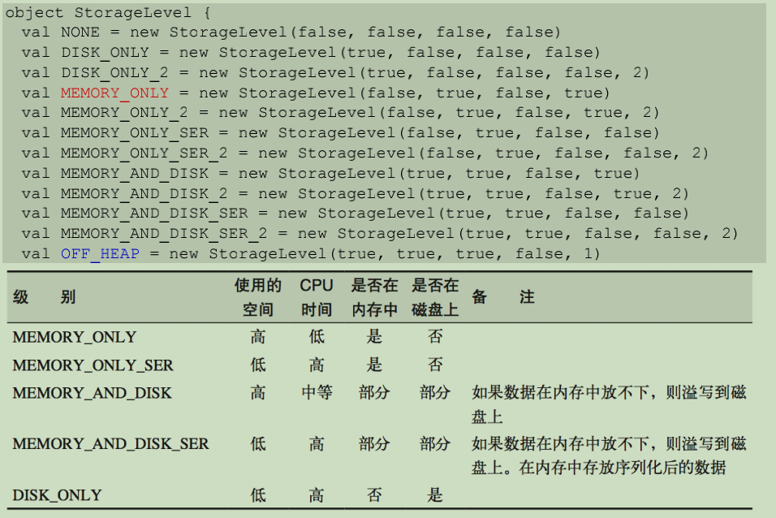


# 26. **RDD CheckPoint** **检查点**

所谓的检查点其实就是通过将 RDD 中间结果写入磁盘


# 27. 缓存和检查点的区别

1. Cache 缓存只是将数据保存起来，不切断血缘依赖。Checkpoint 检查点切断血缘依赖
2. Cache 缓存的数据通常存储在磁盘、内存等地方，可靠性低。Checkpoint 的数据通常存储在 HDFS 等容错、高可用的文件系统，可靠性高

# 28. RDD有哪些分区器

Spark 目前支持 Hash 分区和 Range 分区，和用户自定义分区。Hash 分区为当前的默认分区。分区器直接决定了 RDD 中分区的个数、RDD 中每条数据经过 Shuffle 后进入哪个分区，进而决定了 Reduce 的个数。

+ 只有 Key-Value 类型的 RDD 才有分区器，非 Key-Value 类型的 RDD 分区的值是 None
+ 每个 RDD 的分区 ID 范围：0 ~ (numPartitions - 1)，决定这个值是属于那个分区的

## 28.1 **Hash** **分区**

对于给定的 key，计算其 hashCode,并除以分区个数取余

## 28.2 **Range** **分区**

将一定范围内的数据映射到一个分区中，尽量保证每个分区数据均匀，而且分区间有序

# 29. 累加器的实现原理

累加器用来把 Executor 端变量信息聚合到 Driver 端。在 Driver 程序中定义的变量，在Executor 端的每个 Task 都会得到这个变量的一份新的副本，每个 task 更新这些副本的值后，传回 Driver 端进行 merge。


# 30. 广播变量的实现原理

广播变量用来高效分发较大的对象。向所有工作节点发送一个较大的只读值，以供一个或多个 Spark 操作使用。比如，如果你的应用需要向所有节点发送一个较大的只读查询表，广播变量用起来都很顺手。在多个并行操作中使用同一个变量，但是 Spark 会为每个任务分别发送

# 31. SparkSQL是什么

Spark SQL 是 Spark 用于结构化数据(structured data)处理的 Spark 模块。

# 32. **DataFrame** **是什么**

DataFrame 是一种以 RDD 为基础的分布式数据集，类似于传统数据库中的二维表格。DataFrame 与 RDD 的主要区别在于，前者带有 schema 元信息，即 DataFrame所表示的二维表数据集的每一列都带有名称和类型

# 33. **DataSet** **是什么**

DataSet 是分布式数据集合。DataSet 是 Spark 1.6 中添加的一个新抽象，是 DataFrame的一个扩展。它提供了 RDD 的优势（强类型，使用强大的 lambda 函数的能力）以及 Spark SQL 优化执行引擎的优点。DataSet 也可以使用功能性的转换（操作 map，flatMap，filter等等）。

+ 用户友好的 API 风格，既具有类型安全检查也具有 DataFrame 的查询优化特性
+ DataSet 是强类型的。比如可以有 DataSet[Car]，DataSet[Person]
+ DataFrame 是 DataSet 的特列，DataFrame=DataSet[Row] ，所以可以通过 as 方法将DataFrame 转换为 DataSet。Row 是一个类型，跟 Car、Person 这些的类型一样，所有的表结构信息都用 Row 来表示。获取数据时需要指定顺序

# 34. RDD、DataFrame、DataSet **三者的关系**

## 34.1 三者的共性

+ RDD、DataFrame、DataSet 全都是 spark 平台下的分布式弹性数据集，为处理超大型数据提供便利
+ 三者都有惰性机制，在进行创建、转换，如 map 方法时，不会立即执行，只有在遇到Action 如 foreach 时，三者才会开始遍历运算
+ 三者有许多共同的函数，如 filter，排序等
+ 在对 DataFrame 和 Dataset 进行操作许多操作都需要这个包:import spark.implicits._（在创建好 SparkSession 对象后尽量直接导入）
+ 三者都会根据 Spark 的内存情况自动缓存运算，这样即使数据量很大，也不用担心会内存溢出
+ 三者都有 partition 的概念
+ DataFrame 和 DataSet 均可使用模式匹配获取各个字段的值和类型

## 34.2 三者的区别

1. RDD
   + RDD 一般和 spark mllib 同时使用
   + RDD 不支持 sparksql 操作
2. DataFrame
   + 与 RDD 和 Dataset 不同，DataFrame 每一行的类型固定为 Row，每一列的值没法直接访问，只有通过解析才能获取各个字段的值
   + DataFrame 与 DataSet 一般不与 spark mllib 同时使用
   + DataFrame 与 DataSet 均支持 SparkSQL 的操作，比如 select，groupby 之类，还能注册临时表/视窗，进行 sql 语句操作
   + DataFrame 与 DataSet 支持一些特别方便的保存方式，比如保存成 csv，可以带上表头，这样每一列的字段名一目了然
3. DataSet
   + Dataset 和 DataFrame 拥有完全相同的成员函数，区别只是每一行的数据类型不同。DataFrame 其实就是 DataSet 的一个特例
   + DataFrame 也可以叫 Dataset[Row],每一行的类型是 Row，不解析，每一行究竟有哪些字段，各个字段又是什么类型都无从得知，只能用上面提到的 getAS 方法或者共性中的第七条提到的模式匹配拿出特定字段。而 Dataset 中，每一行是什么类型是不一定的，在自定义了 case class 之后可以很自由的获得每一行的信息

## 34.3 三者的相互转换

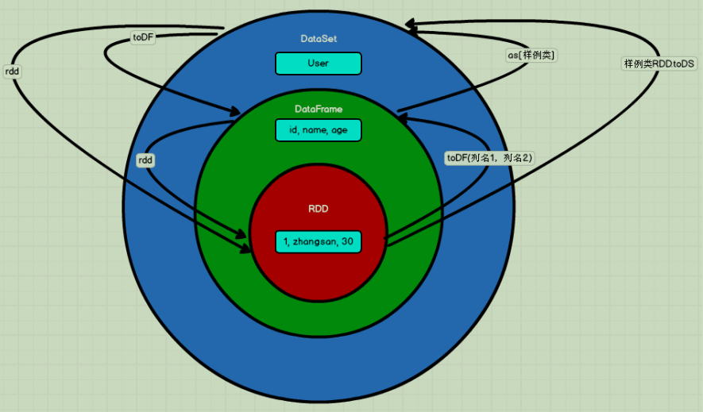

# 35. **Executor**有什么功能

Spark Executor 对象是负责在 Spark 作业中运行具体任务，任务彼此之间相互独立。Spark 应用启动时，ExecutorBackend 节点被同时启动，并且始终伴随着整个 Spark 应用的生命周期而存在。如果有 ExecutorBackend 节点发生了故障或崩溃，Spark 应用也可以继续执行，会将出错节点上的任务调度到其他 Executor 节点上继续运行。

Executor 有两个核心功能：

+ 负责运行组成 Spark 应用的任务，并将结果返回给驱动器（Driver）；
+ 它们通过自身的块管理器（Block Manager）为用户程序中要求缓存的 RDD 提供内存式存储。RDD 是直接缓存在 Executor 进程内的，因此任务可以在运行时充分利用缓存数据加速运算

# 36. Spark运行流程

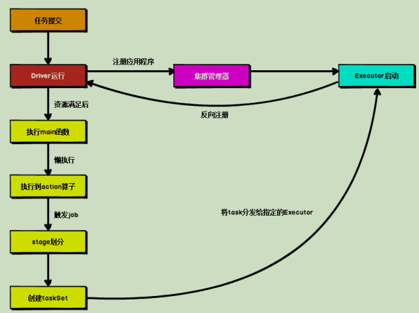

1. 任务提交后，都会先启动 Driver 程序
2. 随后 Driver 向集群管理器注册应用程序
3. 之后集群管理器根据此任务的配置文件分配 Executor 并启动
4. Driver 开始执行 main 函数，Spark 查询为懒执行，当执行到 Action 算子时开始反向推算，根据宽依赖进行 Stage 的划分，随后每一个 Stage 对应一个 Taskset，Taskset 中有多个 Task，查找可用资源 Executor 进行调度
5. 根据本地化原则，Task 会被分发到指定的 Executor 去执行，在任务执行的过程中，Executor 也会不断与 Driver 进行通信，报告任务运行情况


# 37. Spark **YARN** **Cluster** 模式运行流程

1. 执行脚本提交任务，实际是启动一个 SparkSubmit 的 JVM 进程；

2. SparkSubmit 类中的 main 方法反射调用 YarnClusterApplication 的 main 方法

3. YarnClusterApplication 创建 Yarn 客户端，然后向 Yarn 服务器发送执行指令：bin/java ApplicationMaster

4. Yarn 框架收到指令后会在指定的 NM 中启动 ApplicationMaster

5. ApplicationMaster 启动 Driver 线程，执行用户的作业

6. AM 向 RM 注册，申请资源

7. 获取资源后 AM 向 NM 发送指令：bin/java YarnCoarseGrainedExecutorBackend

8. CoarseGrainedExecutorBackend 进程会接收消息，跟 Driver 通信，注册已经启动的Executor；然后启动计算对象 Executor 等待接收任务

9. Driver 线程继续执行完成作业的调度和任务的执行

10. Driver 分配任务并监控任务的执行

    

    注意：SparkSubmit、ApplicationMaster 和 CoarseGrainedExecutorBackend 是独立的进程；Driver

    是独立的线程；Executor 和 YarnClusterApplication 是对象

    


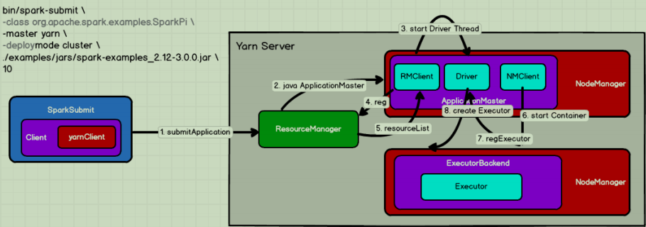

# 38. **YARN Client** **模式**运行流程

1. 执行脚本提交任务，实际是启动一个 SparkSubmit 的 JVM 进程
2. SparkSubmit 类中的 main 方法反射调用用户代码的 main 方法
3. 启动 Driver 线程，执行用户的作业，并创建 ScheduleBackend
4. YarnClientSchedulerBackend 向 RM 发送指令：bin/java ExecutorLauncher
5. Yarn 框架收到指令后会在指定的 NM 中启动 ExecutorLauncher（实际上还是调用ApplicationMaster 的 main 方法）
6. AM 向 RM 注册，申请资源
7. 获取资源后 AM 向 NM 发送指令：bin/java CoarseGrainedExecutorBackend
8. CoarseGrainedExecutorBackend 进程会接收消息，跟 Driver 通信，注册已经启动的Executor；然后启动计算对象 Executor 等待接收任务
9. Driver 分配任务并监控任务的执行

注意：SparkSubmit、ApplicationMaster 和 YarnCoarseGrainedExecutorBackend 是独立的进程；Executor 和 Driver 是对象

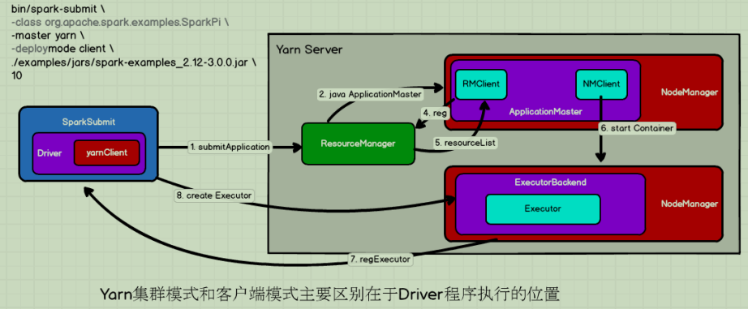

# 39.  **Standalone Cluster** **模式**运行流程

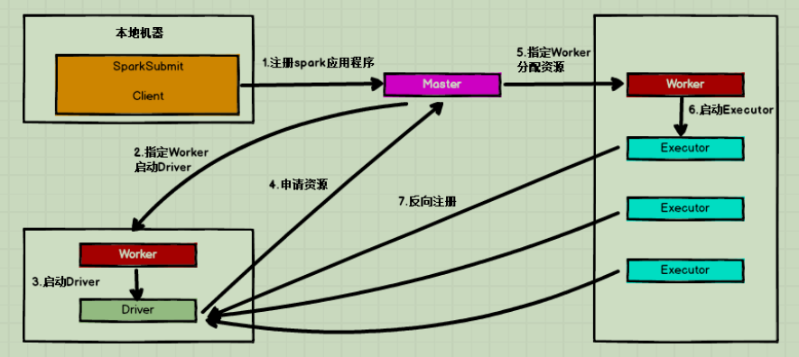

在 Standalone Cluster 模式下，任务提交后，Master 会找到一个 Worker 启动 Driver。Driver 启动后向 Master 注册应用程序，Master 根据 submit 脚本的资源需求找到内部资源至少可以启动一个 Executor 的所有 Worker，然后在这些 Worker 之间分配 Executor，Worker 上 的 Executor 启动后会向 Driver 反向注册，所有的 Executor 注册完成后，Driver 开始执行 main函数，之后执行到 Action 算子时，开始划分 Stage，每个 Stage 生成对应的 taskSet，之后将Task 分发到各个 Executor 上执行

# 40. **Standalone Client** **模式**运行流程

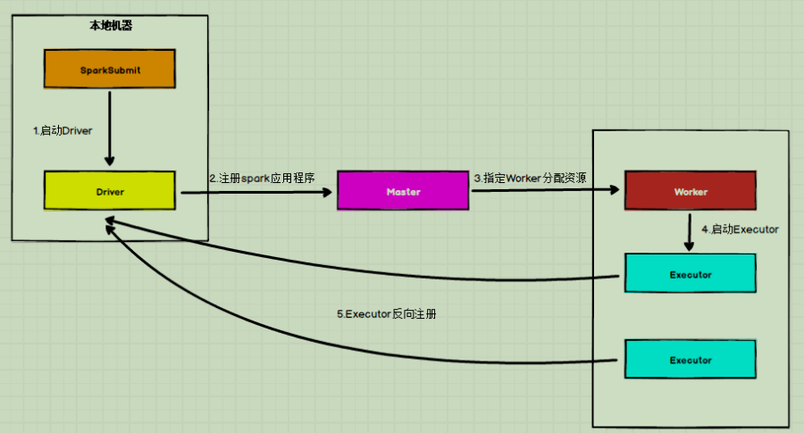

在 Standalone Client 模式下，Driver 在任务提交的本地机器上运行。Driver 启动后向Master 注册应用程序，Master 根据 submit 脚本的资源需求找到内部资源至少可以启动一个Executor 的所有 Worker，然后在这些 Worker 之间分配 Executor，Worker 上的 Executor 启动后会向 Driver 反向注册，所有的 Executor 注册完成后，Driver 开始执行 main 函数，之后执行到 Action 算子时，开始划分 Stage，每个 Stage 生成对应的 TaskSet，之后将 Task 分发到各个 Executor 上执行


# 41. Spark的任务调度策略

TaskScheduler 支持两种调度策略，一种是 FIFO，也是默认的调度策略，另一种是 FAIR。 

在 TaskScheduler 初始化过程中会实例化 rootPool，表示树的根节点，是 Pool 类型。

## 41.1 FIFO 调度策略

如果是采用 FIFO 调度策略，则直接简单地将 TaskSetManager 按照先来先到的方式入队，出队时直接拿出最先进队的 TaskSetManager，其树结构如下图所示，TaskSetManager 保存在一个 FIFO 队列中。

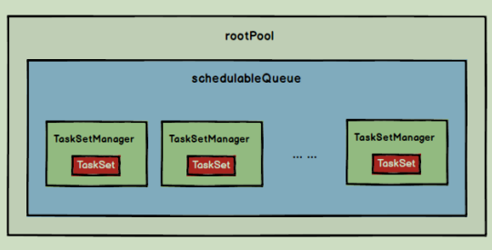

## 41.2 FAIR 调度策略

FAIR 调度策略的树结构如下图所示：

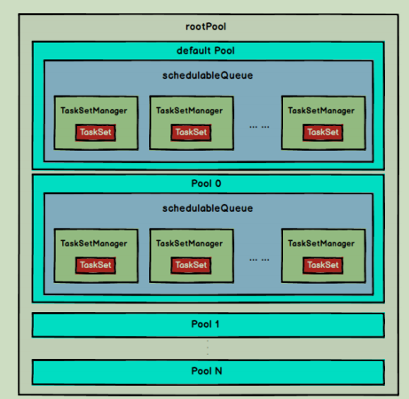

FAIR 模式中有一个 rootPool 和多个子 Pool，各个子 Pool 中存储着所有待分配的TaskSetMagager

在 FAIR 模式中，需要先对子 Pool 进行排序，再对子 Pool 里面的 TaskSetMagager 进行排序，因为 Pool 和 TaskSetMagager 都继承了 Schedulable 特质，因此使用相同的排序算法

排序过程的比较是基于 Fair-share 来比较的，每个要排序的对象包含三个属性: 

runningTasks值（正在运行的Task数）、minShare值、weight值，比较时会综合考量runningTasks值，minShare 值以及 weight 值

注意，minShare、weight 的值均在公平调度配置文件 fairscheduler.xml 中被指定，调度池在构建阶段会读取此文件的相关配置。

1. 如果A对象的runningTasks大于它的minShare，B对象的runningTasks小于它的minShare，那么 B 排在 A 前面；（runningTasks 比 minShare 小的先执行）
2. 如果 A、B 对象的 runningTasks 都小于它们的 minShare，那么就比较 runningTasks 与minShare 的比值（minShare 使用率），谁小谁排前面；（minShare 使用率低的先执行）
3. 如果 A、B 对象的 runningTasks 都大于它们的 minShare，那么就比较 runningTasks 与weight 的比值（权重使用率），谁小谁排前面。（权重使用率低的先执行）
4. 如果上述比较均相等，则比较名字。

整体上来说就是通过minShare和weight这两个参数控制比较过程，可以做到让minShare使用率和权重使用率少（实际运行 task 比例较少）的先运行。

FAIR 模式排序完成后，所有的 TaskSetManager 被放入一个 ArrayBuffer 里，之后依次被取出并发送给 Executor 执行

从调度队列中拿到 TaskSetManager 后，由于 TaskSetManager 封装了一个 Stage 的所有Task，并负责管理调度这些 Task，那么接下来的工作就是 TaskSetManager 按照一定的规则一个个取出 Task 给 TaskScheduler，TaskScheduler 再交给 SchedulerBackend 去发到 Executor上执行

# 42. Spark任务的本地化调度

DAGScheduler 切割 Job，划分 Stage, 通过调用 submitStage 来提交一个 Stage 对应的tasks，submitStage 会调用 submitMissingTasks，submitMissingTasks 确定每个需要计算的 task 的 preferredLocations，通过调用 getPreferrdeLocations()得到 partition 的优先位置，由于一个partition 对应一个 Task，此 partition 的优先位置就是 task 的优先位置，对于要提交到TaskScheduler 的 TaskSet 中的每一个 Task，该 task 优先位置与其对应的 partition 对应的优先位置一致。

从调度队列中拿到 TaskSetManager 后，那么接下来的工作就是 TaskSetManager 按照一定的规则一个个取出 task 给 TaskScheduler，TaskScheduler 再交给 SchedulerBackend 去发到Executor 上执行。前面也提到，TaskSetManager 封装了一个 Stage 的所有 Task，并负责管理调度这些 Task。

根据每个 Task 的优先位置，确定 Task 的 Locality 级别，Locality 一共有五种，优先级由高到低顺序：

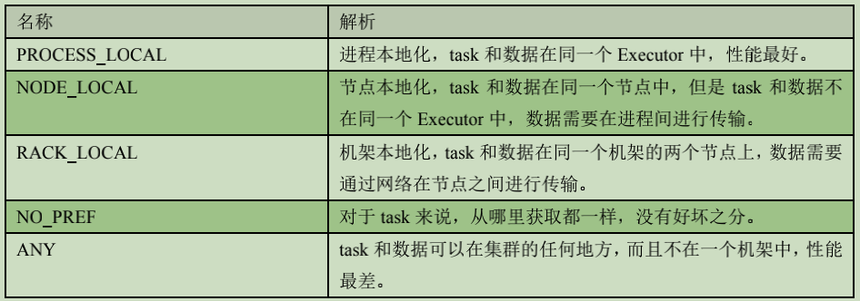

在调度执行时，Spark 调度总是会尽量让每个 task 以最高的本地性级别来启动，当一个task 以 X 本地性级别启动，但是该本地性级别对应的所有节点都没有空闲资源而启动失败，此时并不会马上降低本地性级别启动而是在某个时间长度内再次以 X 本地性级别来启动该task，若超过限时时间则降级启动，去尝试下一个本地性级别，依次类推。

可以通过调大每个类别的最大容忍延迟时间，在等待阶段对应的 Executor 可能就会有相应的资源去执行此 task，这就在在一定程度上提到了运行性能。

# 43. Spark任务调度的**失败重试与黑名单机制**

除了选择合适的 Task 调度运行外，还需要监控 Task 的执行状态，前面也提到，与外部打交道的是 SchedulerBackend，Task 被提交到 Executor 启动执行后，Executor 会将执行状态上报给 SchedulerBackend，SchedulerBackend 则告诉 TaskScheduler，TaskScheduler 找到该Task 对应的 TaskSetManager，并通知到该 TaskSetManager，这样 TaskSetManager 就知道 Task的失败与成功状态，对于失败的 Task，会记录它失败的次数，如果失败次数还没有超过最大重试次数，那么就把它放回待调度的 Task 池子中，否则整个 Application 失败。

在记录 Task 失败次数过程中，会记录它上一次失败所在的 Executor Id 和 Host，这样下次再调度这个 Task 时，会使用黑名单机制，避免它被调度到上一次失败的节点上，起到一定的容错作用。黑名单记录 Task 上一次失败所在的 Executor Id 和 Host，以及其对应的“拉黑”时间，“拉黑”时间是指这段时间内不要再往这个节点上调度这个 Task 了。

# 44. 描述一下**ShuffleMapStage** **与** **ResultStage**

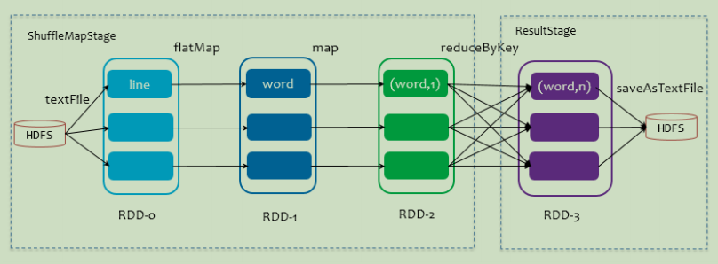

在划分 stage 时，最后一个 stage 称为 finalStage，它本质上是一个 ResultStage 对象，前面的所有 stage 被称为 ShuffleMapStage。

ShuffleMapStage 的结束伴随着 shuffle 文件的写磁盘。

ResultStage 基本上对应代码中的 action 算子，即将一个函数应用在 RDD 的各个 partition的数据集上，意味着一个 job 的运行结束。

# 45. Spark中的7种存储级别

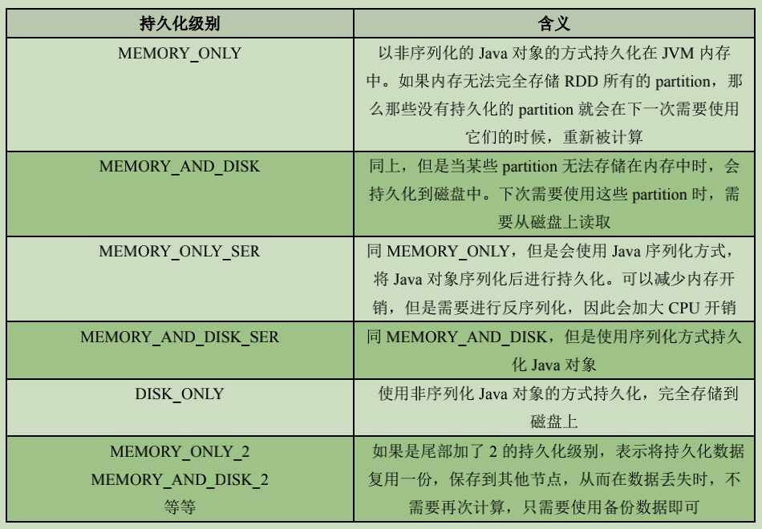

可以看出存储级别从三个维度定义了 RDD 的 Partition（同时也就是 Block）的存储方式：

1. **存储位置**

   磁盘／堆内内存／堆外内存。如 MEMORY_AND_DISK 是同时在磁盘和堆内内存上存储，实现了冗余备份。OFF_HEAP 则是只在堆外内存存储，目前选择堆外内存时不能同时存储到其他位置

2. **存储形式**

   Block 缓存到存储内存后，是否为非序列化的形式。如 MEMORY_ONLY 是非序列化方式存储，OFF_HEAP 是序列化方式存储

3. **副本数量**

   大于 1 时需要远程冗余备份到其他节点。如 DISK_ONLY_2 需要远程备份 1个副本。

# 46. RDD的缓存机制

RDD 在缓存到存储内存之前，Partition 中的数据一般以迭代器（Iterator）的数据结构来访问，这是 Scala 语言中一种遍历数据集合的方法。通过 Iterator 可以获取分区中每一条序列化或者非序列化的数据项(Record)，这些 Record 的对象实例在逻辑上占用了 JVM 堆内内存的 other 部分的空间，同一 Partition 的不同 Record 的存储空间并不连续。

RDD 在缓存到存储内存之后，Partition 被转换成 Block，Record 在堆内或堆外存储内存中占用一块连续的空间。将 Partition 由不连续的存储空间转换为连续存储空间的过程，Spark称之为"展开"（Unroll）。

Block 有序列化和非序列化两种存储格式，具体以哪种方式取决于该 RDD 的存储级别。非序列化的 Block 以一种 DeserializedMemoryEntry 的数据结构定义，用一个数组存储所有的对象实例，序列化的 Block 则以 SerializedMemoryEntry 的数据结构定义，用字节缓冲区（ByteBuffer）来存储二进制数据。每个 Executor 的 Storage 模块用一个链式 Map 结构（LinkedHashMap）来管理堆内和堆外存储内存中所有的 Block 对象的实例，对这个

LinkedHashMap 新增和删除间接记录了内存的申请和释放。

因为不能保证存储空间可以一次容纳 Iterator 中的所有数据，当前的计算任务在 Unroll 时要向 MemoryManager 申请足够的 Unroll 空间来临时占位，空间不足则 Unroll 失败，空间足够时可以继续进行。

对于序列化的 Partition，其所需的 Unroll 空间可以直接累加计算，一次申请。

对于非序列化的 Partition 则要在遍历 Record 的过程中依次申请，即每读取一条 Record，采样估算其所需的 Unroll 空间并进行申请，空间不足时可以中断，释放已占用的 Unroll 空间。

如果最终 Unroll 成功，当前 Partition 所占用的 Unroll 空间被转换为正常的缓存 RDD 的存储空间，如下图所示。

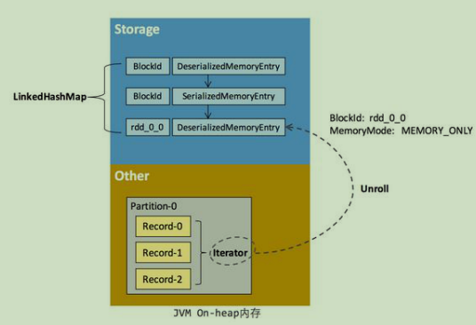

# 47. RDD的淘汰与落盘

由于同一个 Executor 的所有的计算任务共享有限的存储内存空间，当有新的 Block 需要缓存但是剩余空间不足且无法动态占用时，就要对 LinkedHashMap 中的旧 Block 进行淘汰（Eviction），而被淘汰的 Block 如果其存储级别中同时包含存储到磁盘的要求，则要对其进行落盘（Drop），否则直接删除该 Block。

存储内存的淘汰规则为：

1. 被淘汰的旧 Block 要与新 Block 的 MemoryMode 相同，即同属于堆外或堆内内存
2. 新旧 Block 不能属于同一个 RDD，避免循环淘汰
3. 旧 Block 所属 RDD 不能处于被读状态，避免引发一致性问题
4. 遍历 LinkedHashMap 中 Block，按照最近最少使用（LRU）的顺序淘汰，直到满足新Block 所需的空间。其中 LRU 是 LinkedHashMap 的特性

落盘的流程则比较简单，如果其存储级别符合_useDisk 为 true 的条件，再根据其_deserialized判断是否是非序列化的形式，若是则对其进行序列化，最后将数据存储到磁盘，在 Storage模块中更新其信息

# 48. Spark常规性能调优

## 48.1 **最优资源配置**

Spark 性能调优的第一步，就是为任务分配更多的资源，在一定范围内，增加资源的分配与性能的提升是成正比的，实现了最优的资源配置后，在此基础上再考虑进行后面论述的性能调优策略。

资源的分配在使用脚本提交 Spark 任务时进行指定，标准的 Spark 任务提交脚本如下所示：

```bash
bin/spark-submit \
--class com.atguigu.spark.Analysis \
--master yarn
--deploy-mode cluster
--num-executors 80 \
--driver-memory 6g \
--executor-memory 6g \
--executor-cores 3 \
/usr/opt/modules/spark/jar/spark.jar \
```

可以进行分配的资源如表所示：

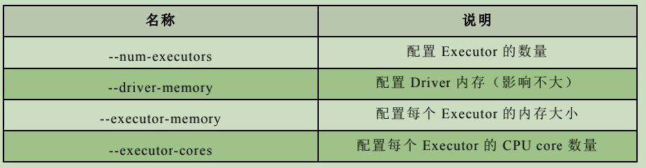

对各项资源进行了调节后，得到的性能提升会有如下表现：

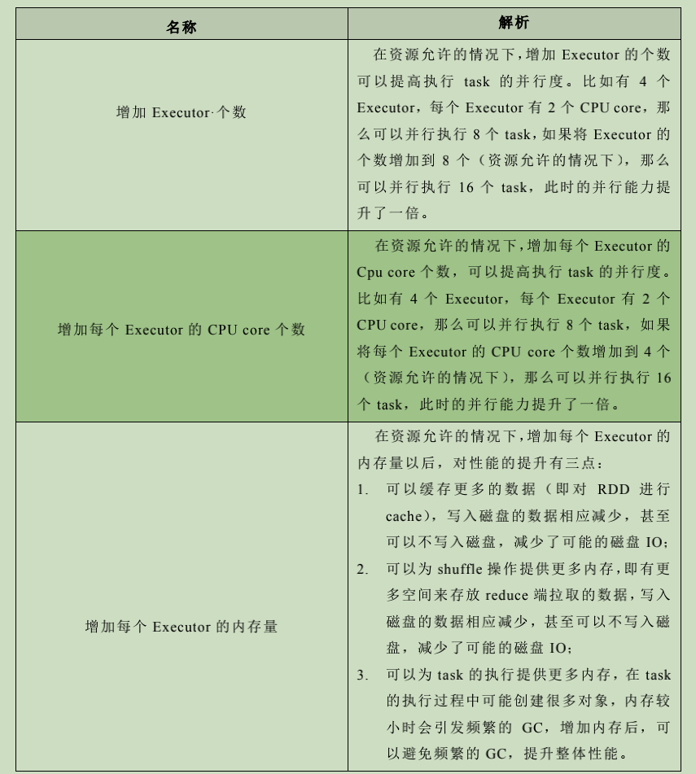

参数配置参考值：

+ --num-executors：50~100
+ --driver-memory：1G~5G
+ --executor-memory：6G~10G
+ --executor-cores：3 
+ --master：实际生产环境一定使用 yarn


## 48.2 **RDD** **优化**

1. RDD 复用

   在对 RDD 进行算子时，要避免相同的算子和计算逻辑之下对 RDD 进行重复的计算

   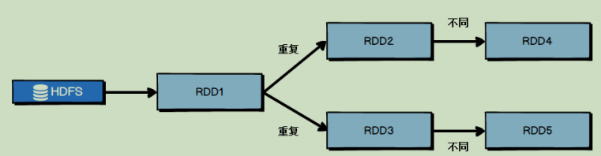

   对上图中的 RDD 计算架构进行修改，得到如下图所示的优化结果：

   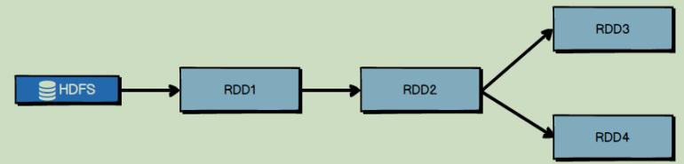

2. RDD 持久化

   在 Spark 中，当多次对同一个 RDD 执行算子操作时，每一次都会对这个 RDD 以之前的父 RDD 重新计算一次，这种情况是必须要避免的，对同一个 RDD 的重复计算是对资源的极大浪费，因此，必须对多次使用的 RDD 进行持久化，通过持久化将公共 RDD 的数据缓存到内存/磁盘中，之后对于公共 RDD 的计算都会从内存/磁盘中直接获取 RDD 数据。

3. RDD 尽可能早的 filter 操作

   获取到初始 RDD 后，应该考虑尽早地过滤掉不需要的数据，进而减少对内存的占用，从而提升 Spark 作业的运行效率

## 48.3 **并行度调节**

Spark 作业中的并行度指各个 stage 的 task 的数量。

如果并行度设置不合理而导致并行度过低，会导致资源的极大浪费，例如，20 个 Executor，每个 Executor 分配 3 个 CPU core，而 Spark 作业有 40 个 task，这样每个 Executor 分配到的task 个数是 2 个，这就使得每个 Executor 有一个 CPU core 空闲，导致资源的浪费。

理想的并行度设置，应该是让并行度与资源相匹配，简单来说就是在资源允许的前提下，并行度要设置的尽可能大，达到可以充分利用集群资源。合理的设置并行度，可以提升整个Spark 作业的性能和运行速度

Spark 官方推荐，task 数量应该设置为 Spark 作业总 CPU core 数量的 2~3 倍。之所以没有推荐 task 数量与 CPU core 总数相等，是因为 task 的执行时间不同，有的 task 执行速度快而有的 task 执行速度慢，如果 task 数量与 CPU core 总数相等，那么执行快的 task 执行完成后，会出现 CPU core 空闲的情况。如果 task 数量设置为 CPU core 总数的 2~3 倍，那么一个task 执行完毕后，CPU core 会立刻执行下一个 task，降低了资源的浪费，同时提升了 Spark作业运行的效率。

## 49.4 **广播大变量**

默认情况下，task 中的算子中如果使用了外部的变量，每个 task 都会获取一份变量的复本，这就造成了内存的极大消耗。一方面，如果后续对 RDD 进行持久化，可能就无法将 RDD数据存入内存，只能写入磁盘，磁盘 IO 将会严重消耗性能；另一方面，task 在创建对象的时候，也许会发现堆内存无法存放新创建的对象，这就会导致频繁的 GC，GC 会导致工作线程停止，进而导致 Spark 暂停工作一段时间，严重影响 Spark 性能。

假设当前任务配置了 20 个 Executor，指定 500 个 task，有一个 20M 的变量被所有 task共用，此时会在 500 个 task 中产生 500 个副本，耗费集群 10G 的内存，如果使用了广播变量， 那么每个 Executor 保存一个副本，一共消耗 400M 内存，内存消耗减少了 5 倍。

广播变量在每个 Executor 保存一个副本，此 Executor 的所有 task 共用此广播变量，这让变量产生的副本数量大大减少。

在初始阶段，广播变量只在 Driver 中有一份副本。task 在运行的时候，想要使用广播变量中的数据，此时首先会在自己本地的 Executor 对应的 BlockManager 中尝试获取变量，如果本地没有，BlockManager 就会从 Driver 或者其他节点的 BlockManager 上远程拉取变量的复本，并由本地的 BlockManager 进行管理；之后此 Executor 的所有 task 都会直接从本地的BlockManager 中获取变量。

## 49.4 **Kryo** **序列化**

默认情况下，Spark 使用 Java 的序列化机制。Java 的序列化机制使用方便，不需要额外的配置，在算子中使用的变量实现 Serializable 接口即可，但是，Java 序列化机制的效率不高，序列化速度慢并且序列化后的数据所占用的空间依然较大。

Kryo 序列化机制比 Java 序列化机制性能提高 10 倍左右，Spark 之所以没有默认使用Kryo 作为序列化类库，是因为它不支持所有对象的序列化，同时 Kryo 需要用户在使用前注册需要序列化的类型，不够方便，但从 Spark 2.0.0 版本开始，简单类型、简单类型数组、字符串类型的 Shuffling RDDs 已经默认使用 Kryo 序列化方式了。

## 49.5 **调节本地化等待时长**

Spark 作业运行过程中，Driver 会对每一个 stage 的 task 进行分配。根据 Spark 的 task 分配算法，Spark 希望 task 能够运行在它要计算的数据算在的节点（数据本地化思想），这样就可以避免数据的网络传输。通常来说，task 可能不会被分配到它处理的数据所在的节点，因为这些节点可用的资源可能已经用尽，此时，Spark 会等待一段时间，默认 3s，如果等待指定时间后仍然无法在指定节点运行，那么会自动降级，尝试将 task 分配到比较差的本地化级别所对应的节点上，比如将 task 分配到离它要计算的数据比较近的一个节点，然后进行计算，如果当前级别仍然不行，那么继续降级。

当 task 要处理的数据不在 task 所在节点上时，会发生数据的传输。task 会通过所在节点的 BlockManager 获取数据，BlockManager 发现数据不在本地时，户通过网络传输组件从数据所在节点的 BlockManager 处获取数据。

网络传输数据的情况是我们不愿意看到的，大量的网络传输会严重影响性能，因此，我们希望通过调节本地化等待时长，如果在等待时长这段时间内，目标节点处理完成了一部分task，那么当前的 task 将有机会得到执行，这样就能够改善 Spark 作业的整体性能。

Spark 的本地化等级如表所示：(面试问:Spark的数据本地性有哪几种？)

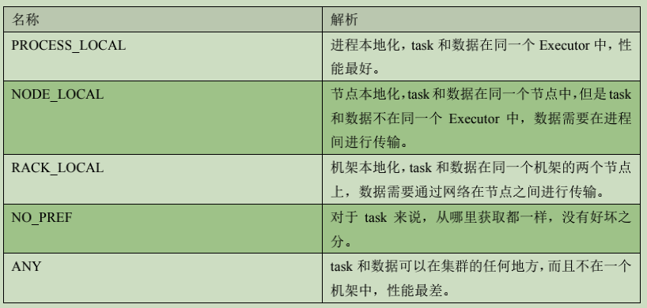


# 49.算子调优

## 49.1 **mapPartitions**

普通的 map 算子对 RDD 中的每一个元素进行操作，而 mapPartitions 算子对 RDD 中每一个分区进行操作。如果是普通的 map 算子，假设一个 partition 有 1 万条数据，那么 map算子中的 function 要执行 1 万次，也就是对每个元素进行操作。

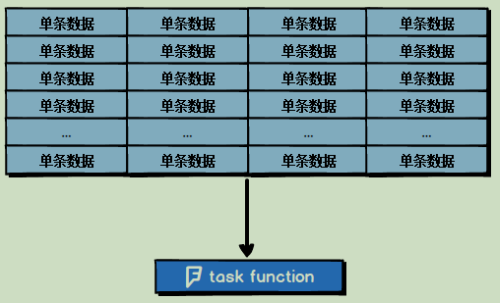

如果是 mapPartition 算子，由于一个 task 处理一个 RDD 的 partition，那么一个 task 只会执行一次 function，function 一次接收所有的 partition 数据，效率比较高。

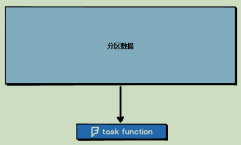

比如，当要把 RDD 中的所有数据通过 JDBC 写入数据，如果使用 map 算子，那么需要对 RDD 中的每一个元素都创建一个数据库连接，这样对资源的消耗很大，如果使用mapPartitions 算子，那么针对一个分区的数据，只需要建立一个数据库连接。

mapPartitions 算子也存在一些缺点：对于普通的 map 操作，一次处理一条数据，如果在处理了 2000 条数据后内存不足，那么可以将已经处理完的 2000 条数据从内存中垃圾回收掉；但是如果使用 mapPartitions 算子，但数据量非常大时，function 一次处理一个分区的数据，如果一旦内存不足，此时无法回收内存，就可能会 OOM，即内存溢出。

因此，mapPartitions 算子适用于数据量不是特别大的时候，此时使用 mapPartitions 算子对性能的提升效果还是不错的。（当数据量很大的时候，一旦使用 mapPartitions 算子，就会直接 OOM）

在项目中，应该首先估算一下 RDD 的数据量、每个 partition 的数据量，以及分配给每个 Executor 的内存资源，如果资源允许，可以考虑使用 mapPartitions 算子代替 map。

## 49.2 **foreachPartition** **优化数据库操作**

在生产环境中，通常使用 foreachPartition 算子来完成数据库的写入，通过 foreachPartition算子的特性，可以优化写数据库的性能。

如果使用 foreach 算子完成数据库的操作，由于 foreach 算子是遍历 RDD 的每条数据，因此，每条数据都会建立一个数据库连接，这是对资源的极大浪费，因此，对于写数据库操作，我们应当使用 foreachPartition 算子。

与 mapPartitions 算子非常相似，foreachPartition 是将 RDD 的每个分区作为遍历对象，一次处理一个分区的数据，也就是说，如果涉及数据库的相关操作，一个分区的数据只需要创建一次数据库连接，如图所示：


使用了 foreachPartition 算子后，可以获得以下的性能提升：

+ 对于我们写的 function 函数，一次处理一整个分区的数据
+ 对于一个分区内的数据，创建唯一的数据库连接
+ 只需要向数据库发送一次 SQL 语句和多组参数

在生产环境中，全部都会使用 foreachPartition 算子完成数据库操作。foreachPartition 算子存在一个问题，与 mapPartitions 算子类似，如果一个分区的数据量特别大，可能会造成 OOM，即内存溢出

## 49.3 **filter** **与** **coalesce** **的配合使用**

在 Spark 任务中我们经常会使用 filter 算子完成 RDD 中数据的过滤，在任务初始阶段，从各个分区中加载到的数据量是相近的，但是一旦进过 filter 过滤后，每个分区的数据量有可能会存在较大差异，如图所示：

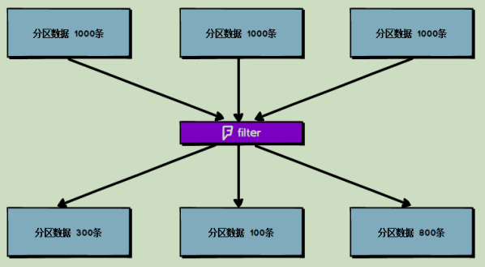

根据图中信息我们可以发现两个问题：

+ 每个 partition 的数据量变小了，如果还按照之前与 partition 相等的 task 个数去处理当前数据，有点浪费 task 的计算资源
+ 每个 partition 的数据量不一样，会导致后面的每个 task 处理每个 partition 数据的时候，每个 task 要处理的数据量不同，这很有可能导致数据倾斜问题

如上图所示，第二个分区的数据过滤后只剩100条，而第三个分区的数据过滤后剩下800条，在相同的处理逻辑下，第二个分区对应的 task 处理的数据量与第三个分区对应的 task 处理的数据量差距达到了 8 倍，这也会导致运行速度可能存在数倍的差距，这也就是数据倾斜问题。

针对上述的两个问题，我们分别进行分析：

针对第一个问题，既然分区的数据量变小了，我们希望可以对分区数据进行重新分配，比如将原来 4 个分区的数据转化到 2 个分区中，这样只需要用后面的两个 task 进行处理即可，避免了资源的浪费

针对第二个问题，解决方法和第一个问题的解决方法非常相似，对分区数据重新分配，让每个 partition 中的数据量差不多，这就避免了数据倾斜问题

那么具体应该如何实现上面的解决思路？我们需要 coalesce 算子。

repartition 与 coalesce 都可以用来进行重分区，其中 repartition 只是 coalesce 接口中 shuffle为 true 的简易实现，coalesce 默认情况下不进行 shuffle，但是可以通过参数进行设置。

假设我们希望将原本的分区个数 A 通过重新分区变为 B，那么有以下几种情况：

1. **A > B**（多数分区合并为少数分区）

   + A 与 B 相差值不大

     此时使用 coalesce 即可，无需 shuffle 过程。

   + A 与 B 相差值很大

     此时可以使用 coalesce 并且不启用 shuffle 过程，但是会导致合并过程性能低下，所以推荐设置 coalesce 的第二个参数为 true，即启动 shuffle 过程。

2. **A < B**（少数分区分解为多数分区）

   此时使用 repartition 即可，如果使用 coalesce 需要将 shuffle 设置为 true，否则 coalesce 无效。我们可以在 filter 操作之后，使用 coalesce 算子针对每个 partition 的数据量各不相同的情况，压缩 partition 的数量，而且让每个 partition 的数据量尽量均匀紧凑，以便于后面的 task 进行计算操作，在某种程度上能够在一定程度上提升性能。

   注意：local 模式是进程内模拟集群运行，已经对并行度和分区数量有了一定的内部优化，因此不用去设置并行度和分区数量。


## 49.4 **repartition** **解决** **SparkSQL** **低并行度问题**

并行度的设置对于Spark SQL 是不生效的，用户设置的并行度只对于 Spark SQL 以外的所有 Spark 的 stage 生效。

Spark SQL 的并行度不允许用户自己指定，Spark SQL 自己会默认根据 hive 表对应的HDFS 文件的 split 个数自动设置 Spark SQL 所在的那个 stage 的并行度，用户自己通spark.default.parallelism 参数指定的并行度，只会在没 Spark SQL 的 stage 中生效。

由于 Spark SQL 所在 stage 的并行度无法手动设置，如果数据量较大，并且此 stage 中后续的 transformation 操作有着复杂的业务逻辑，而 Spark SQL 自动设置的 task 数量很少，这就意味着每个 task 要处理为数不少的数据量，然后还要执行非常复杂的处理逻辑，这就可能表现为第一个有 Spark SQL 的 stage 速度很慢，而后续的没有 Spark SQL 的 stage 运行速度非常快

为了解决 Spark SQL 无法设置并行度和 task 数量的问题，我们可以使用 repartition 算子。

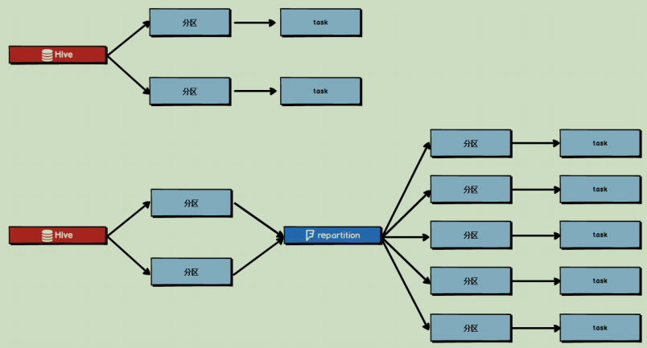

Spark SQL 这一步的并行度和 task 数量肯定是没有办法去改变了，但是，对于Spark SQL 查询出来的 RDD，立即使用 repartition 算子，去重新进行分区，这样可以重新分区为多个 partition，从 repartition 之后的 RDD 操作，由于不再涉及 Spark SQL，因此 stage 的并行度就会等于你手动设置的值，这样就避免了 Spark SQL 所在的 stage 只能用少量的 task 去处理大量数据并执行复杂的算法逻辑

## 49.5 **reduceByKey** **预聚合**

reduceByKey 相较于普通的 shuffle 操作一个显著的特点就是会进行 map 端的本地聚合，map 端会先对本地的数据进行 combine 操作，然后将数据写入给下个 stage 的每个 task 创建的文件中，也就是在 map 端，对每一个 key 对应的 value，执行 reduceByKey 算子函数。

reduceByKey 算子的执行过程如图所示：

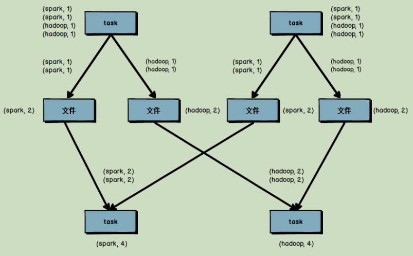

使用 reduceByKey 对性能的提升如下：

1. 本地聚合后，在 map 端的数据量变少，减少了磁盘 IO，也减少了对磁盘空间的占用
2. 本地聚合后，下一个 stage 拉取的数据量变少，减少了网络传输的数据量
3. 本地聚合后，在 reduce 端进行数据缓存的内存占用减少
4. 本地聚合后，在 reduce 端进行聚合的数据量减少

基于 reduceByKey 的本地聚合特征，我们应该考虑使用 reduceByKey 代替其他的 shuffle 算子，例如 groupByKey。reduceByKey 与 groupByKey 的运行原理如图所示：

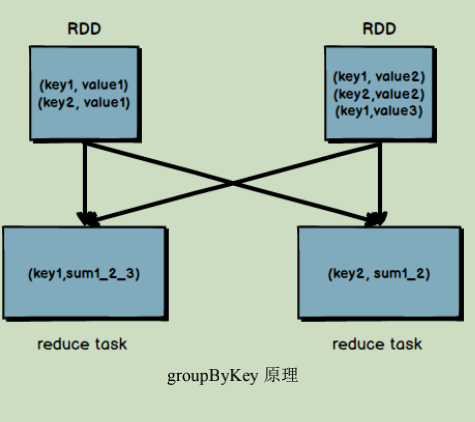

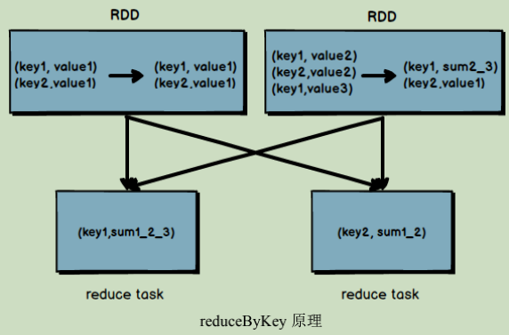

根据上图可知，groupByKey 不会进行 map 端的聚合，而是将所有 map 端的数据 shuffle 到reduce 端，然后在 reduce 端进行数据的聚合操作。由于 reduceByKey 有 map 端聚合的特性，使得网络传输的数据量减小，因此效率要明显高于 groupByKey。

# 50. Shuffle调优

## 50.1 **调节** **map** **端缓冲区大小**

在 Spark 任务运行过程中，如果 shuffle 的 map 端处理的数据量比较大，但是 map 端缓冲的大小是固定的，可能会出现 map 端缓冲数据频繁 spill 溢写到磁盘文件中的情况，使得性能非常低下，通过调节 map 端缓冲的大小，可以避免频繁的磁盘 IO 操作，进而提升 Spark任务的整体性能。

map 端缓冲的默认配置是 32KB，如果每个 task 处理 640KB 的数据，那么会发生 640/32 = 20 次溢写，如果每个 task 处理 64000KB 的数据，就会发生 64000/32=2000 次溢写，这对于性能的影响是非常严重的

map 端缓冲的配置方法如代码清单所示：

```scala
val conf = new SparkConf()
.set("spark.shuffle.file.buffer", "64")
```

## 50.2 **调节** **reduce** **端拉取数据缓冲区大小**

Spark Shuffle 过程中，shuffle reduce task 的 buffer 缓冲区大小决定了 reduce task 每次能够缓冲的数据量，也就是每次能够拉取的数据量，如果内存资源较为充足，适当增加拉取数据缓冲区的大小，可以减少拉取数据的次数，也就可以减少网络传输的次数，进而提升性能。

reduce 端数据拉取缓冲区的大小可以通过 spark.reducer.maxSizeInFlight 参数进行设置，默认为 48MB，该参数的设置方法如代码清单所示：

```scala
val conf = new SparkConf()
.set("spark.reducer.maxSizeInFlight", "96")
```

## 50.3 **调节** **reduce** **端拉取数据重试次数**

Spark Shuffle 过程中，reduce task 拉取属于自己的数据时，如果因为网络异常等原因导致失败会自动进行重试。对于那些包含了特别耗时的 shuffle 操作的作业，建议增加重试最大次数（比如 60 次），以避免由于 JVM 的 full gc 或者网络不稳定等因素导致的数据拉取失败。在实践中发现，对于针对超大数据量（数十亿~上百亿）的 shuffle 过程，调节该参数可以大幅度提升稳定性。

reduce 端拉取数据重试次数可以通过 spark.shuffle.io.maxRetries 参数进行设置，该参数就代表了可以重试的最大次数。如果在指定次数之内拉取还是没有成功，就可能会导致作业执行失败，默认为 3，该参数的设置方法如代码清单所示：

```scala
val conf = new SparkConf()
.set("spark.shuffle.io.maxRetries", "6")
```

## 50.4 **调节** **reduce** **端拉取数据等待间隔**

Spark Shuffle 过程中，reduce task 拉取属于自己的数据时，如果因为网络异常等原因导致失败会自动进行重试，在一次失败后，会等待一定的时间间隔再进行重试，可以通过加大间隔时长（比如 60s），以增加 shuffle 操作的稳定性。

reduce 端拉取数据等待间隔可以通过 spark.shuffle.io.retryWait 参数进行设置，默认值为 5s，该参数的设置方法如代码清单所示：

```scala
val conf = new SparkConf()
.set("spark.shuffle.io.retryWait", "60s")
```

## 50.5 **调节** **SortShuffle** **排序操作阈值**

对于 SortShuffleManager，如果 shuffle reduce task 的数量小于某一阈值则 shuffle write 过程中不会进行排序操作，而是直接按照未经优化的 HashShuffleManager 的方式去写数据，但是最后会将每个 task 产生的所有临时磁盘文件都合并成一个文件，并会创建单独的索引文件。

当你使用 SortShuffleManager 时，如果的确不需要排序操作，那么建议将这个参数调大一些，大于 shuffle read task 的数量，那么此时 map-side 就不会进行排序了，减少了排序的性能开销，但是这种方式下，依然会产生大量的磁盘文件，因此 shuffle write 性能有待提高。

SortShuffleManager 排序操作阈值的设置可以通过 spark.shuffle.sort. bypassMergeThreshold 这一参数进行设置，默认值为 200，该参数的设置方法如代码清单所示：

```scala
val conf = new SparkConf()
.set("spark.shuffle.sort.bypassMergeThreshold", "400")
```

# 51. JVM调优

## 51.1 **降低** **cache** **操作的内存占比**

1. 静态内存管理机制

   根据 Spark 静态内存管理机制，堆内存被划分为了两块，Storage 和 Execution。Storage主要用于缓存 RDD 数据和 broadcast 数据，Execution 主要用于缓存在 shuffle 过程中产生的中间数据，Storage 占系统内存的 60%，Execution 占系统内存的 20%，并且两者完全独立。在一般情况下，Storage 的内存都提供给了 cache 操作，但是如果在某些情况下 cache 操作内存不是很紧张，而 task 的算子中创建的对象很多，Execution 内存又相对较小，这回导致频繁的 minor gc，甚至于频繁的 full gc，进而导致 Spark 频繁的停止工作，性能影响会很大。在 Spark UI 中可以查看每个 stage 的运行情况，包括每个 task 的运行时间、gc 时间等等，如果发现 gc 太频繁，时间太长，就可以考虑调节 Storage 的内存占比，让 task 执行算子函数式，有更多的内存可以使用。

   Storage 内存区域可以通过 spark.storage.memoryFraction 参数进行指定，默认为 0.6，即60%，可以逐级向下递减，如代码清单所示：

   ```scala
   val conf = new SparkConf()
   .set("spark.storage.memoryFraction", "0.4")
   ```

2. 统一内存管理机制

   根据 Spark 统一内存管理机制，堆内存被划分为了两块，Storage 和 Execution。Storage主要用于缓存数据，Execution 主要用于缓存在 shuffle 过程中产生的中间数据，两者所组成的内存部分称为统一内存，Storage 和 Execution 各占统一内存的 50%，由于动态占用机制的实现，shuffle 过程需要的内存过大时，会自动占用 Storage 的内存区域，因此无需手动进行调节。

## 51.2 **调节** **Executor** **堆外内存**

Executor 的堆外内存主要用于程序的共享库、Perm Space、 线程 Stack 和一些 Memory mapping 等, 或者类 C 方式 allocate object。

有时，如果你的 Spark 作业处理的数据量非常大，达到几亿的数据量，此时运行 Spark作业会时不时地报错，例如 shuffle output file cannot find，executor lost，task lost，out of memory等，这可能是 Executor 的堆外内存不太够用，导致 Executor 在运行的过程中内存溢出。

stage 的 task 在运行的时候，可能要从一些 Executor 中去拉取 shuffle map output 文件，但是 Executor 可能已经由于内存溢出挂掉了，其关联的 BlockManager 也没有了，这就可能会报出 shuffle output file cannot find，executor lost，task lost，out of memory 等错误，此时，就可以考虑调节一下 Executor 的堆外内存，也就可以避免报错，与此同时，堆外内存调节的比较大的时候，对于性能来讲，也会带来一定的提升。

默认情况下，Executor 堆外内存上限大概为 300 多 MB，在实际的生产环境下，对海量数据进行处理的时候，这里都会出现问题，导致 Spark 作业反复崩溃，无法运行，此时就会去调节这个参数，到至少 1G，甚至于 2G、4G。

Executor 堆外内存的配置需要在 spark-submit 脚本里配置，如代码清单所示：

```bash
--conf spark.yarn.executor.memoryOverhead=2048
```

以上参数配置完成后，会避免掉某些 JVM OOM 的异常问题，同时，可以提升整体 Spark作业的性能。

## 51.3 **调节连接等待时长**

在 Spark 作业运行过程中，Executor 优先从自己本地关联的 BlockManager 中获取某份数据，如果本地BlockManager没有的话，会通过TransferService远程连接其他节点上Executor的 BlockManager 来获取数据。

如果 task 在运行过程中创建大量对象或者创建的对象较大，会占用大量的内存，这会导致频繁的垃圾回收，但是垃圾回收会导致工作现场全部停止，也就是说，垃圾回收一旦执行，Spark 的 Executor 进程就会停止工作，无法提供响应，此时，由于没有响应，无法建立网络连接，会导致网络连接超时。

在生产环境下，有时会遇到 file not found、file lost 这类错误，在这种情况下，很有可能是 Executor 的 BlockManager 在拉取数据的时候，无法建立连接，然后超过默认的连接等待时长 60s 后，宣告数据拉取失败，如果反复尝试都拉取不到数据，可能会导致 Spark 作业的崩溃。这种情况也可能会导致 DAGScheduler 反复提交几次 stage，TaskScheduler 返回提交几次 task，大大延长了我们的 Spark 作业的运行时间。

此时，可以考虑调节连接的超时时长，连接等待时长需要在 spark-submit 脚本中进行设置，

设置方式如代码清单所示：

```bash
--conf spark.core.connection.ack.wait.timeout=300
```

调节连接等待时长后，通常可以避免部分的 XX 文件拉取失败、XX 文件 lost 等报错。


# 52. **数据倾斜的表现**

1. Spark 作业的大部分 task 都执行迅速，只有有限的几个 task 执行的非常慢，此时可能出现了数据倾斜，作业可以运行，但是运行得非常慢
2. Spark 作业的大部分 task 都执行迅速，但是有的 task 在运行过程中会突然报出 OOM，反复执行几次都在某一个 task 报出 OOM 错误，此时可能出现了数据倾斜，作业无法正常运行


问题：什么是数据倾斜？

少数的task处理了绝大多数数据

# 53. 如何**定位数据倾斜问题**

1. 查阅代码中的 shuffle 算子，例如 reduceByKey、countByKey、groupByKey、join 等算子，根据代码逻辑判断此处是否会出现数据倾斜
2. 查看 Spark 作业的 log 文件，log 文件对于错误的记录会精确到代码的某一行，可以根据异常定位到的代码位置来明确错误发生在第几个 stage，对应的 shuffle 算子是哪一个


# 54. 避免数据倾斜的解决方案

## 54.1 **聚合原数据**

1. 避免 shuffle 过程

   绝大多数情况下，Spark 作业的数据来源都是 Hive 表，这些 Hive 表基本都是经过 ETL之后的昨天的数据。为了避免数据倾斜，我们可以考虑避免 shuffle 过程，如果避免了 shuffle过程，那么从根本上就消除了发生数据倾斜问题的可能。

   如果 Spark 作业的数据来源于 Hive 表，那么可以先在 Hive 表中对数据进行聚合，例如按照 key 进行分组，将同一 key 对应的所有 value 用一种特殊的格式拼接到一个字符串里去，这样，一个 key 就只有一条数据了；之后，对一个 key 的所有 value 进行处理时，只需要进行 map 操作即可，无需再进行任何的 shuffle 操作。通过上述方式就避免了执行 shuffle 操作，也就不可能会发生任何的数据倾斜问题。

   对于 Hive 表中数据的操作，不一定是拼接成一个字符串，也可以是直接对 key 的每一条数据进行累计计算。

   要区分开，处理的数据量大和数据倾斜的区别。

   

2. 缩小 key 粒度（增大数据倾斜可能性，降低每个 task 的数据量）

   key 的数量增加，可能使数据倾斜更严重。

3. 增大 key 粒度（减小数据倾斜可能性，增大每个 task 的数据量）

   如果没有办法对每个 key 聚合出来一条数据，在特定场景下，可以考虑扩大 key 的聚合粒度。

   例如，目前有 10 万条用户数据，当前 key 的粒度是（省，城市，区，日期），现在我们考虑扩大粒度，将 key 的粒度扩大为（省，城市，日期），这样的话，key 的数量会减少，key 之间的数据量差异也有可能会减少，由此可以减轻数据倾斜的现象和问题。（此方法只针对特定类型的数据有效，当应用场景不适宜时，会加重数据倾斜）

## 54.2 **过滤导致倾斜的** **key**

如果在 Spark 作业中允许丢弃某些数据，那么可以考虑将可能导致数据倾斜的 key 进行过滤，滤除可能导致数据倾斜的 key 对应的数据，这样，在 Spark 作业中就不会发生数据倾斜了。

## 54.3 **提高** **shuffle** **操作中的** **reduce** **并行度**

当上述方案对于数据倾斜的处理没有很好的效果时，可以考虑提高 shuffle 过程中的 reduce 端并行度，reduce 端并行度的提高就增加了 reduce 端 task 的数量，那么每个 task分配到的数据量就会相应减少，由此缓解数据倾斜问题。

1. **reduce** **端并行度的设置**

   在大部分的 shuffle 算子中，都可以传入一个并行度的设置参数，比如 reduceByKey(500)，这个参数会决定 shuffle 过程中 reduce 端的并行度，在进行 shuffle 操作的时候，就会对应着创建指定数量的 reduce task。对于 Spark SQL 中的 shuffle 类语句，比如 group by、join 等，需要设置一个参数，即 spark.sql.shuffle.partitions，该参数代表了 shuffle read task 的并行度，该值默认是 200，对于很多场景来说都有点过小。

   增加 shuffle read task 的数量，可以让原本分配给一个 task 的多个 key 分配给多个 task，从而让每个 task 处理比原来更少的数据。举例来说，如果原本有 5 个 key，每个 key 对应 10条数据，这 5 个 key 都是分配给一个 task 的，那么这个 task 就要处理 50 条数据。而增加了shuffle read task 以后，每个 task 就分配到一个 key，即每个 task 就处理 10 条数据，那么自然每个 task 的执行时间都会变短了。

2. **reduce** **端并行度设置存在的缺陷**

   提高 reduce 端并行度并没有从根本上改变数据倾斜的本质和问题（方案一和方案二从根本上避免了数据倾斜的发生），只是尽可能地去缓解和减轻 shuffle reduce task 的数据压力，以及数据倾斜的问题，适用于有较多 key 对应的数据量都比较大的情况。

   该方案通常无法彻底解决数据倾斜，因为如果出现一些极端情况，比如某个 key 对应的数据量有 100 万，那么无论你的 task 数量增加到多少，这个对应着 100 万数据的 key 肯定还是会分配到一个 task 中去处理，因此注定还是会发生数据倾斜的。所以这种方案只能说是在发现数据倾斜时尝试使用的第一种手段，尝试去用嘴简单的方法缓解数据倾斜而已，或者是和其他方案结合起来使用。

   在理想情况下，reduce 端并行度提升后，会在一定程度上减轻数据倾斜的问题，甚至基本消除数据倾斜；但是，在一些情况下，只会让原来由于数据倾斜而运行缓慢的 task 运行速度稍有提升，或者避免了某些 task 的 OOM 问题，但是，仍然运行缓慢，此时，要及时放弃该方案，开始尝试其他的方案

## 54.4 **使用随机** **key** **实现**双重聚合

当使用了类似于 groupByKey、reduceByKey 这样的算子时，可以考虑使用随机 key 实现双重聚合，如图所示：

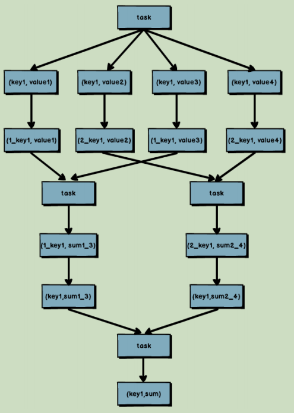

首先，通过 map 算子给每个数据的 key 添加随机数前缀，对 key 进行打散，将原先一样的 key 变成不一样的 key，然后进行第一次聚合，这样就可以让原本被一个 task 处理的数据分散到多个 task 上去做局部聚合；随后，去除掉每个 key 的前缀，再次进行聚合。

此方法对于由 groupByKey、reduceByKey 这类算子造成的数据倾斜由比较好的效果，仅仅适用于聚合类的 shuffle 操作，适用范围相对较窄。如果是 join 类的 shuffle 操作，还得用其他的解决方案。

## 54.5 **将** **reduce join** **转换为** **map join**

正常情况下，join 操作都会执行 shuffle 过程，并且执行的是 reduce join，也就是先将所有相同的 key 和对应的 value 汇聚到一个 reduce task 中，然后再进行 join。普通 join 的过程如下图所示：

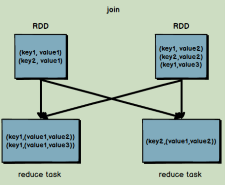

普通的 join 是会走 shuffle 过程的，而一旦 shuffle，就相当于会将相同 key 的数据拉取到一个 shuffle read task 中再进行 join，此时就是 reduce join。但是如果一个 RDD 是比较小的，则可以采用广播小 RDD 全量数据+map 算子来实现与 join 同样的效果，也就是 map join，此时就不会发生 shuffle 操作，也就不会发生数据倾斜。

（注意，RDD 是并不能进行广播的，只能将 RDD 内部的数据通过 collect 拉取到 Driver 内存然后再进行广播）

**核心思路：**

不使用 join 算子进行连接操作，而使用 Broadcast 变量与 map 类算子实现 join 操作，进而完全规避掉 shuffle 类的操作，彻底避免数据倾斜的发生和出现。将较小 RDD 中的数据直接通过 collect 算子拉取到 Driver 端的内存中来，然后对其创建一个 Broadcast 变量；接着对另外一个 RDD 执行 map 类算子，在算子函数内，从 Broadcast 变量中获取较小 RDD 的全量数据，与当前 RDD 的每一条数据按照连接 key 进行比对，如果连接 key 相同的话，那么就将两个 RDD 的数据用你需要的方式连接起来。

根据上述思路，根本不会发生 shuffle 操作，从根本上杜绝了 join 操作可能导致的数据倾斜问题。

当 join 操作有数据倾斜问题并且其中一个 RDD 的数据量较小时，可以优先考虑这种方式，效果非常好。map join 的过程如图所示：

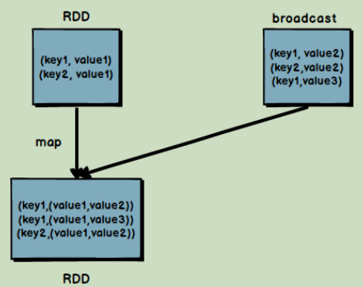

**不适用场景分析：**

由于Spark 的广播变量是在每个Executor中保存一个副本，如果两个 RDD数据量都比较大，那么如果将一个数据量比较大的 RDD 做成广播变量，那么很有可能会造成内存溢出。

## 54.6 **sample** **采样对**倾斜**key** 单独进行 **join**

在 Spark 中，如果某个 RDD 只有一个 key，那么在 shuffle 过程中会默认将此 key 对应的数据打散，由不同的 reduce 端 task 进行处理。

当由单个 key 导致数据倾斜时，可有将发生数据倾斜的 key 单独提取出来，组成一个RDD，然后用这个原本会导致倾斜的 key 组成的 RDD 根其他 RDD 单独 join，此时，根据Spark 的运行机制，此 RDD 中的数据会在 shuffle 阶段被分散到多个 task 中去进行 join 操作。倾斜 key 单独 join 的流程如图所示：

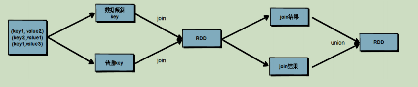

1. 适用场景分析

   对于 RDD 中的数据，可以将其转换为一个中间表，或者是直接使用 countByKey()的方式，看一个这个 RDD 中各个 key 对应的数据量，此时如果你发现整个 RDD 就一个 key 的数据量特别多，那么就可以考虑使用这种方法。

   当数据量非常大时，可以考虑使用 sample 采样获取 10%的数据，然后分析这 10%的数据中哪个 key 可能会导致数据倾斜，然后将这个 key 对应的数据单独提取出来

2. 不适用场景分析

   如果一个 RDD 中导致数据倾斜的 key 很多，那么此方案不适用。

## 54.7 **使用随机数扩容进行** **join**

如果在进行 join 操作时，RDD 中有大量的 key 导致数据倾斜，那么进行分拆 key 也没什么意义，此时就只能使用最后一种方案来解决问题了，对于 join 操作，我们可以考虑对其中一个 RDD 数据进行扩容，另一个 RDD 进行稀释后再join

我们会将原先一样的 key 通过附加随机前缀变成不一样的 key，然后就可以将这些处理后的“不同 key”分散到多个 task 中去处理，而不是让一个 task 处理大量的相同 key。这一种方案是针对有大量倾斜 key 的情况，没法将部分 key 拆分出来进行单独处理，需要对整个RDD 进行数据扩容，对内存资源要求很高。

1. **核心思想**

   选择一个 RDD，使用 flatMap 进行扩容，对每条数据的 key 添加数值前缀（1~N 的数值），将一条数据映射为多条数据；（扩容）

   选择另外一个 RDD，进行 map 映射操作，每条数据的 key 都打上一个随机数作为前缀（1~N 的随机数）；（稀释）

   将两个处理后的 RDD，进行 join 操作。

   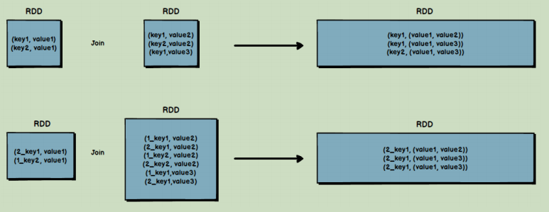

2. **局限性**

   + 如果两个 RDD 都很大，那么将 RDD 进行 N 倍的扩容显然行不通
   + 使用扩容的方式只能缓解数据倾斜，不能彻底解决数据倾斜问题

   当 RDD 中有几个 key 导致数据倾斜时，方案(**sample** **采样对**倾斜**key** 单独进行 **join**)不再适用，而当前方案又非常消耗资源，此时可以引入当前方案的思想完善方案(**sample** **采样对**倾斜**key** 单独进行 **join**)：

   + 对包含少数几个数据量过大的 key 的那个 RDD，通过 sample 算子采样出一份样本来，然后统计一下每个 key 的数量，计算出来数据量最大的是哪几个 key。 
   + 然后将这几个 key 对应的数据从原来的 RDD 中拆分出来，形成一个单独的 RDD，并给每个 key 都打上 n 以内的随机数作为前缀，而不会导致倾斜的大部分 key 形成另外一个RDD。
   + 接着将需要 join 的另一个 RDD，也过滤出来那几个倾斜 key 对应的数据并形成一个单独的 RDD，将每条数据膨胀成 n 条数据，这 n 条数据都按顺序附加一个 0~n 的前缀，不会导致倾斜的大部分 key 也形成另外一个 RDD
   + 再将附加了随机前缀的独立 RDD 与另一个膨胀 n 倍的独立 RDD 进行 join，此时就可以将原先相同的 key 打散成 n 份，分散到多个 task 中去进行 join 了
   + 而另外两个普通的 RDD 就照常 join 即可
   + 最后将两次 join 的结果使用 union 算子合并起来即可，就是最终的 join 结果

# 55. **Spark** **故障排除**

## 55.1  **故障排除一：控制** **reduce** **端缓冲大小以避免** **OOM**

在 Shuffle 过程，reduce 端 task 并不是等到 map 端 task 将其数据全部写入磁盘后再去拉取，而是 map 端写一点数据，reduce 端 task 就会拉取一小部分数据，然后立即进行后面的聚合、算子函数的使用等操作。

reduce 端 task 能够拉取多少数据，由 reduce 拉取数据的缓冲区 buffer 来决定，因为拉取过来的数据都是先放在 buffer 中，然后再进行后续的处理，buffer 的默认大小为 48MB。reduce 端 task 会一边拉取一边计算，不一定每次都会拉满 48MB 的数据，可能大多数时候拉取一部分数据就处理掉了。

虽然说增大 reduce 端缓冲区大小可以减少拉取次数，提升 Shuffle 性能，但是有时 map端的数据量非常大，写出的速度非常快，此时 reduce 端的所有 task 在拉取的时候，有可能全部达到自己缓冲的最大极限值，即 48MB，此时，再加上 reduce 端执行的聚合函数的代码，可能会创建大量的对象，这可难会导致内存溢出，即 OOM。

如果一旦出现 reduce 端内存溢出的问题，我们可以考虑减小 reduce 端拉取数据缓冲区的大小，例如减少为 12MB。

在实际生产环境中是出现过这种问题的，这是典型的以性能换执行的原理。reduce 端拉取数据的缓冲区减小，不容易导致 OOM，但是相应的，reudce 端的拉取次数增加，造成更多的网络传输开销，造成性能的下降。

注意，要保证任务能够运行，再考虑性能的优化。

## 55.2 **故障排除二：**JVM GC**导致的** **shuffle** **文件拉取失败**

在 Spark 作业中，有时会出现 shuffle file not found 的错误，这是非常常见的一个报错，有时出现这种错误以后，选择重新执行一遍，就不再报出这种错误。

出现上述问题可能的原因是 Shuffle 操作中，后面 stage 的 task 想要去上一个 stage 的task 所在的 Executor 拉取数据，结果对方正在执行 GC，执行 GC 会导致 Executor 内所有的工作现场全部停止，比如 BlockManager、基于 netty 的网络通信等，这就会导致后面的 task拉取数据拉取了半天都没有拉取到，就会报出 shuffle file not found 的错误，而第二次再次执行就不会再出现这种错误。

可以通过调整 reduce 端拉取数据重试次数和 reduce 端拉取数据时间间隔这两个参数来对 Shuffle 性能进行调整，增大参数值，使得 reduce 端拉取数据的重试次数增加，并且每次失败后等待的时间间隔加长。

```scala
val conf = new SparkConf()
.set("spark.shuffle.io.maxRetries", "60")
.set("spark.shuffle.io.retryWait", "60s")
```

## 55.3 **故障排除三：解决各种序列化导致的报错**

当 Spark 作业在运行过程中报错，而且报错信息中含有 Serializable 等类似词汇，那么可能是序列化问题导致的报错

序列化问题要注意以下三点：

+ 作为 RDD 的元素类型的自定义类，必须是可以序列化的；
+ 算子函数里可以使用的外部的自定义变量，必须是可以序列化的
+ 不可以在 RDD 的元素类型、算子函数里使用第三方的不支持序列化的类型，例如Connection

## 55.4 **故障排除四：解决算子函数返回** **NULL** **导致的问题**

在一些算子函数里，需要我们有一个返回值，但是在一些情况下我们不希望有返回值，此时我们如果直接返回 NULL，会报错，例如 Scala.Math(NULL)异常

如果你遇到某些情况，不希望有返回值，那么可以通过下述方式解决：

1. 返回特殊值，不返回 NULL，例如“-1”
2. 在通过算子获取到了一个 RDD 之后，可以对这个 RDD 执行 filter 操作，进行数据过滤，将数值为-1 的数据给过滤掉
3. 在使用完 filter 算子后，继续调用 coalesce 算子进行优化

## 55.5 **故障排除五：解决** **YARN-CLIENT** **模式导致的网卡流量激增问**题

YARN-client 模式的运行原理如下图所示：

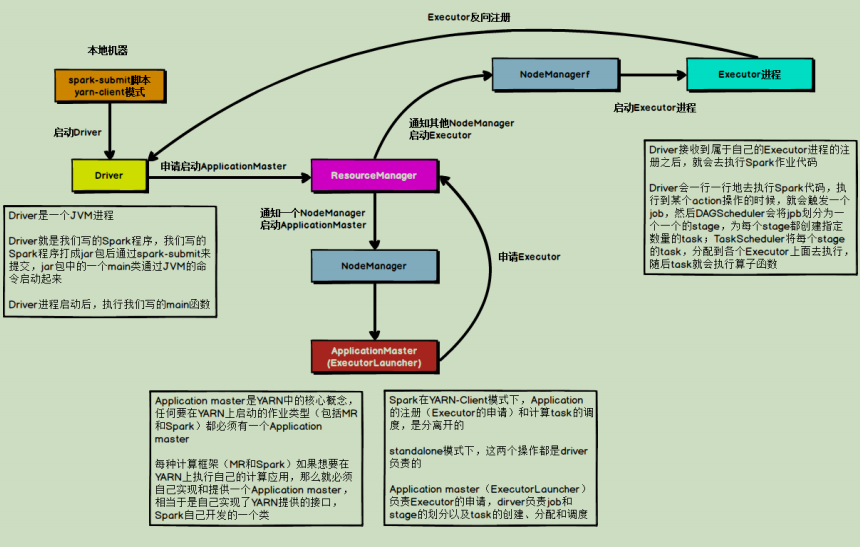

在 YARN-client 模式下，Driver 启动在本地机器上，而 Driver 负责所有的任务调度，需要与 YARN 集群上的多个 Executor 进行频繁的通信

假设有 100 个 Executor， 1000 个 task，那么每个 Executor 分配到 10 个 task，之后，Driver 要频繁地跟 Executor 上运行的 1000 个 task 进行通信，通信数据非常多，并且通信品类特别高。这就导致有可能在 Spark 任务运行过程中，由于频繁大量的网络通讯，本地机器的网卡流量会激增。

注意，YARN-client 模式只会在测试环境中使用，而之所以使用 YARN-client 模式，是由于可以看到详细全面的 log 信息，通过查看 log，可以锁定程序中存在的问题，避免在生产环境下发生故障。

在生产环境下，使用的一定是 YARN-cluster 模式。在 YARN-cluster 模式下，就不会造成本地机器网卡流量激增问题，如果 YARN-cluster 模式下存在网络通信的问题，需要运维团队进行解决。

## 55.6 **故障排除六：解决** **YARN-CLUSTER** **模式的** **JVM** **栈内存溢出无**法执行问题

YARN-cluster 模式的运行原理如下图所示：

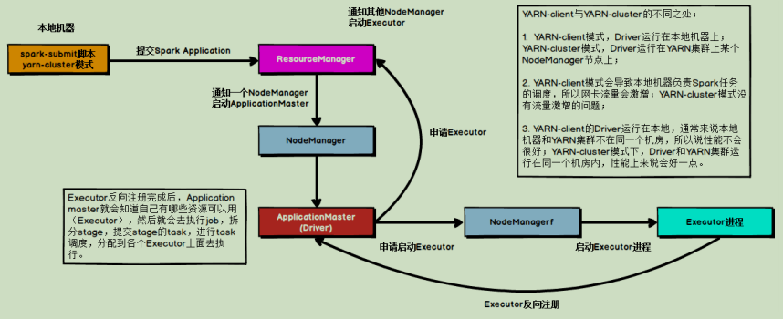

当 Spark 作业中包含 SparkSQL 的内容时，可能会碰到 YARN-client 模式下可以运行，但是YARN-cluster 模式下无法提交运行（报出 OOM 错误）的情况。

YARN-client 模式下，Driver 是运行在本地机器上的，Spark 使用的 JVM 的 PermGen 的配置，是本地机器上的 spark-class 文件，JVM 永久代的大小是 128MB，这个是没有问题的，但是在 YARN-cluster 模式下，Driver 运行在 YARN 集群的某个节点上，使用的是没有经过配置的默认设置，PermGen 永久代大小为 82MB。

SparkSQL 的内部要进行很复杂的 SQL 的语义解析、语法树转换等等，非常复杂，如果sql 语句本身就非常复杂，那么很有可能会导致性能的损耗和内存的占用，特别是对 PermGen的占用会比较大。

所以，此时如果 PermGen 的占用好过了 82MB，但是又小于 128MB，就会出现 YARN-client模式下可以运行，YARN-cluster 模式下无法运行的情况。

解决上述问题的方法时增加 PermGen 的容量，需要在 spark-submit 脚本中对相关参数进行设置，设置方法如代码清单所示。

```bash
--conf spark.driver.extraJavaOptions="-XX:PermSize=128M -XX:MaxPermSize=256M"
```

通过上述方法就设置了 Driver 永久代的大小，默认为 128MB，最大 256MB，这样就可以避免上面所说的问题


## 55.7 **故障排除七：解决** **SparkSQL** **导致的** **JVM** **栈内存溢出**

当 SparkSQL 的 sql 语句有成百上千的 or 关键字时，就可能会出现 Driver 端的 JVM 栈内存溢出。

JVM 栈内存溢出基本上就是由于调用的方法层级过多，产生了大量的，非常深的，超出了 JVM 栈深度限制的递归。（我们猜测 SparkSQL 有大量 or 语句的时候，在解析 SQL 时，例如转换为语法树或者进行执行计划的生成的时候，对于 or 的处理是递归，or 非常多时，会发生大量的递归）

此时，建议将一条 sql 语句拆分为多条 sql 语句来执行，每条 sql 语句尽量保证 100 个以内的子句。根据实际的生产环境试验，一条 sql 语句的 or 关键字控制在 100 个以内，通常不会导致 JVM 栈内存溢出。

## 55.8 **故障排除八：持久化与** **checkpoint** **的使用**

Spark 持久化在大部分情况下是没有问题的，但是有时数据可能会丢失，如果数据一旦丢失，就需要对丢失的数据重新进行计算，计算完后再缓存和使用，为了避免数据的丢失，可以选择对这个 RDD 进行 checkpoint，也就是将数据持久化一份到容错的文件系统上（比如 HDFS）。

一个 RDD 缓存并 checkpoint 后，如果一旦发现缓存丢失，就会优先查看 checkpoint 数据存不存在，如果有，就会使用 checkpoint 数据，而不用重新计算。也即是说，checkpoint可以视为 cache 的保障机制，如果 cache 失败，就使用 checkpoint 的数据。

使用 checkpoint 的优点在于提高了 Spark 作业的可靠性，一旦缓存出现问题，不需要重新计算数据，缺点在于，checkpoint 时需要将数据写入 HDFS 等文件系统，对性能的消耗较大。


# 56. 简述Spark的宽窄依赖，以及Spark如何划分stage，每个stage根据什么决定task个数?

窄依赖:父RDD的一个分区至多只会被子RDD的一个分区依赖

宽依赖:父RDD的一个分区会被子RDD的多个分区依赖(涉及到shuffle)

Stage是如何划分：根据RDD之间的依赖关系的不同将Job划分成不同的Stage，遇到一个宽依赖则划分一个Stage

每个stage又根据什么决定task个数： Stage是一个TaskSet，将Stage根据分区数划分成一个个的Task


# 57. Spark中哪些算子会导致Shuffle?

- reduceByKey
- groupByKey
- ...ByKey

join、distinct、repartition

# 58. 简述下Spark中的缓存(cache和persist)与checkpoint机制，并指出两者的区别和联系

关于Spark缓存和检查点的区别，大致可以从这3个角度去回答：

- 位置

​    Persist 和 Cache将数据保存在内存，Checkpoint将数据保存在HDFS

- 生命周期

​    Persist 和 Cache  程序结束后会被清除或手动调用unpersist方法，Checkpoint永久存储不会被删除。

- RDD依赖关系

​    Persist 和 Cache，不会丢掉RDD间的依赖链/依赖关系，CheckPoint会斩断依赖链。


# 59. 如何使用Spark实现TopN的获取

- 方法1：

​    （1）按照key对数据进行聚合（groupByKey）

​    （2）将value转换为数组，利用scala的sortBy或者sortWith进行排序（mapValues）

​    注意：当数据量太大时，会导致OOM

- 方法2：

​    （1）取出所有的key

​    （2）对key进行迭代，每次取出一个key利用spark的排序算子进行排序

- 方法3：

​    （1）自定义分区器，按照key进行分区，使不同的key进到不同的分区

​    （2）对每个分区运用spark的排序算子进行排序


# 60. Spark为什么比mapreduce快？

　    1）基于内存计算，减少低效的磁盘交互；
　　2）高效的调度算法，基于DAG；
　　3）容错机制Linage，精华部分就是DAG和Lingae


# 61. hadoop和spark的shuffle相同和差异

1. 从 high-level 的角度来看，两者并没有大的差别。 都是将 mapper（Spark 里是 ShuffleMapTask）的输出进行 partition，不同的 partition 送到不同的 reducer（Spark 里 reducer 可能是下一个 stage 里的 ShuffleMapTask，也可能是 ResultTask）。Reducer 以内存作缓冲区，边 shuffle 边 aggregate 数据，等到数据 aggregate 好以后进行 reduce() （Spark 里可能是后续的一系列操作）。

2. 从 low-level 的角度来看，两者差别不小。 Hadoop MapReduce 是 sort-based，进入 combine() 和 reduce() 的 records 必须先 sort。这样的好处在于 combine/reduce() 可以处理大规模的数据，因为其输入数据可以通过外排得到（mapper 对每段数据先做排序，reducer 的 shuffle 对排好序的每段数据做归并）。目前的 Spark 默认选择的是 hash-based，通常使用 HashMap 来对 shuffle 来的数据进行 aggregate，不会对数据进行提前排序。如果用户需要经过排序的数据，那么需要自己调用类似 sortByKey() 的操作；如果你是Spark 1.1的用户，可以将spark.shuffle.manager设置为sort，则会对数据进行排序。在Spark 1.2中，sort将作为默认的Shuffle实现。

3. 从实现角度来看，两者也有不少差别。 Hadoop MapReduce 将处理流程划分出明显的几个阶段：map(), spill, merge, shuffle, sort, reduce() 等。每个阶段各司其职，可以按照过程式的编程思想来逐一实现每个阶段的功能。在 Spark 中，没有这样功能明确的阶段，只有不同的 stage 和一系列的 transformation()，所以 spill, merge, aggregate 等操作需要蕴含在 transformation() 中。如果我们将 map 端划分数据、持久化数据的过程称为 shuffle write，而将 reducer 读入数据、aggregate 数据的过程称为 shuffle read。那么在 Spark 中，问题就变为怎么在 job 的逻辑或者物理执行图中加入 shuffle write 和 shuffle read 的处理逻辑？以及两个处理逻辑应该怎么高效实现？ Shuffle write由于不要求数据有序，shuffle write 的任务很简单：将数据 partition 好，并持久化。之所以要持久化，一方面是要减少内存存储空间压力，另一方面也是为了 fault-tolerance。


# 62. cache和pesist的区别

1. cache和persist都是用于将一个RDD进行缓存的，这样在之后使用的过程中就不需要重新计算了，可以大大节省程序运行时间；

2. cache只有一个默认的缓存级别MEMORY_ONLY ，cache调用了persist，而persist可以根据情况设置其它的缓存级别；

3. executor执行的时候，默认60%做cache，40%做task操作，persist最根本的函数，最底层的函数

# 63. RDD有哪些缺陷？

1. 不支持细粒度的写和更新操作（如网络爬虫），spark写数据是粗粒度的所谓粗粒度，就是批量写入数据，为了提高效率。但是读数据是细粒度的也就是说可以一条条的读
2. 不支持增量迭代计算，Flink支持

# 64. rdd有几种操作类型？

1. transformation，rdd由一种转为另一种rdd
2. action
3. cronroller，crontroller是控制算子,cache,persist，对性能和效率的有很好的支持三种类型，不要回答只有2种

# 65. Spark程序执行，有时候默认为什么会产生很多task，怎么修改默认task执行个数

1. 因为输入数据有很多task，尤其是有很多小文件的时候，有多少个输入block就会有多少个task启动
2. spark中有partition的概念，每个partition都会对应一个task，task越多，在处理大规模数据的时候，就会越有效率。不过task并不是越多越好，如果平时测试，或者数据量没有那么大，则没有必要task数量太多
3. 参数可以通过spark_home/conf/spark-default.conf配置文件设置:spark.sql.shuffle.partitions 50 spark.default.parallelism 10第一个是针对spark sql的task数量第二个是非spark sql程序设置生效

# 66. 为什么Spark Application在没有获得足够的资源，job就开始执行了，可能会导致什么什么问题发生?

会导致执行该job时候集群资源不足，导致执行job结束也没有分配足够的资源，分配了部分Executor，该job就开始执行task，应该是task的调度线程和Executor资源申请是异步的；如果想等待申请完所有的资源再执行job的：需要将spark.scheduler.maxRegisteredResourcesWaitingTime设置的很大；spark.scheduler.minRegisteredResourcesRatio 设置为1，但是应该结合实际考虑否则很容易出现长时间分配不到资源，job一直不能运行的情况。


# 67. join操作优化经验？

join其实常见的就分为两类： map-side join 和 reduce-side join。当大表和小表join时，用map-side join能显著提高效率。将多份数据进行关联是数据处理过程中非常普遍的用法，不过在分布式计算系统中，这个问题往往会变的非常麻烦，因为框架提供的 join 操作一般会将所有数据根据 key 发送到所有的 reduce 分区中去，也就是 shuffle 的过程。造成大量的网络以及磁盘IO消耗，运行效率极其低下，这个过程一般被称为 reduce-side-join。如果其中有张表较小的话，我们则可以自己实现在 map 端实现数据关联，跳过大量数据进行 shuffle 的过程，运行时间得到大量缩短，根据不同数据可能会有几倍到数十倍的性能提升


# 68. 介绍一下cogroup rdd实现原理，你在什么场景下用过这个rdd

cogroup的函数实现:这个实现根据两个要进行合并的两个RDD操作,生成一个CoGroupedRDD的实例,这个RDD的返回结果是把相同的key中两个RDD分别进行合并操作,最后返回的RDD的value是一个Pair的实例,这个实例包含两个Iterable的值,第一个值表示的是RDD1中相同KEY的值,第二个值表示的是RDD2中相同key的值.由于做cogroup的操作,需要通过partitioner进行重新分区的操作,因此,执行这个流程时,需要执行一次shuffle的操作(如果要进行合并的两个RDD的都已经是shuffle后的rdd,同时他们对应的partitioner相同时,就不需要执行shuffle


# 69.你所理解的 Spark 的 shuffle 过程

Spark shuffle 处于一个宽依赖，可以实现类似混洗的功能，将相同的 Key 分发至同一个 Reducer上进行处理。

# 70. Spark有哪些聚合类的算子,我们应该尽量避免什么类型的算子？

在我们的开发过程中，**能避免则尽可能避免使用** reduceByKey、join、distinct、repartition 等会进行 shuffle 的算子，尽量使用 map 类的非 shuffle 算子。这样的话，没有 shuffle 操作或者仅有较少 shuffle 操作的 Spark 作业，可以大大减少性能开销


# 71. Spark为什么快，Spark SQL 一定比 Hive 快吗

Spark SQL 比 Hadoop Hive 快，是有一定条件的，而且不是 Spark SQL 的引擎比 Hive 的引擎快，相反，Hive 的 HQL 引擎还比 Spark SQL 的引擎更快。其实，关键还是在于 Spark 本身快。

1. 消除了冗余的 HDFS 读写: Hadoop 每次 shuffle 操作后，必须写到磁盘，而 Spark 在 shuffle 后不一定落盘，可以 cache 到内存中，以便迭代时使用。如果操作复杂，很多的 shufle 操作，那么 Hadoop 的读写 IO 时间会大大增加，也是 Hive 更慢的主要原因了
2. 消除了冗余的 MapReduce 阶段: Hadoop 的 shuffle 操作一定连着完整的 MapReduce 操作，冗余繁琐。而 Spark 基于 RDD 提供了丰富的算子操作，且 reduce 操作产生 shuffle 数据，可以缓存在内存
3. JVM 的优化: Hadoop 每次 MapReduce 操作，启动一个 Task 便会启动一次 JVM，基于进程的操作。而 Spark 每次 MapReduce 操作是基于线程的，只在启动 Executor 是启动一次 JVM，内存的 Task 操作是在线程复用的。每次启动 JVM 的时间可能就需要几秒甚至十几秒，那么当 Task 多了，这个时间 Hadoop 不知道比 Spark 慢了多少

**记住一种反例** 考虑一种极端查询:

```sql
Select month_id, sum(sales) from T group by month_id;
```

这个查询只有一次 shuffle 操作，此时，也许 Hive HQL 的运行时间也许比 Spark 还快，反正 shuffle 完了都会落一次盘，或者都不落盘。

**结论** Spark 快不是绝对的，但是绝大多数，Spark 都比 Hadoop 计算要快。这主要得益于其对 mapreduce 操作的优化以及对 JVM 使用的优化。

# 72. RDD, DAG, Stage怎么理解？

**DAG** Spark 中使用 DAG 对 RDD 的关系进行建模，描述了 RDD 的依赖关系，这种关系也被称之为 lineage（血缘），RDD 的依赖关系使用 Dependency 维护。DAG 在 Spark 中的对应的实现为 DAGScheduler。

**RDD** RDD 是 Spark 的灵魂，也称为弹性分布式数据集。一个 RDD 代表一个可以被分区的只读数据集。RDD 内部可以有许多分区(partitions)，每个分区又拥有大量的记录(records)。Rdd的五个特征： 1. dependencies: 建立 RDD 的依赖关系，主要 RDD 之间是宽窄依赖的关系，具有窄依赖关系的 RDD 可以在同一个 stage 中进行计算。 2. partition: 一个 RDD 会有若干个分区，分区的大小决定了对这个 RDD 计算的粒度，每个 RDD 的分区的计算都在一个单独的任务中进行。 3. preferedlocations: 按照“移动数据不如移动计算”原则，在 Spark 进行任务调度的时候，优先将任务分配到数据块存储的位置。 4. compute: Spark 中的计算都是以分区为基本单位的，compute 函数只是对迭代器进行复合，并不保存单次计算的结果。 5. partitioner: 只存在于（K,V）类型的 RDD 中，非（K,V）类型的 partitioner 的值就是 None。

RDD 的算子主要分成2类，action 和 transformation。这里的算子概念，可以理解成就是对数据集的变换。action 会触发真正的作业提交，而 transformation 算子是不会立即触发作业提交的。每一个 transformation 方法返回一个新的 RDD。只是某些 transformation 比较复杂，会包含多个子 transformation，因而会生成多个 RDD。这就是实际 RDD 个数比我们想象的多一些 的原因。通常是，当遇到 action 算子时会触发一个job的提交，然后反推回去看前面的 transformation 算子，进而形成一张有向无环图。

**Stage** 在 DAG 中又进行 stage 的划分，划分的依据是依赖是否是 shuffle 的，每个 stage 又可以划分成若干 task。接下来的事情就是 driver 发送 task 到 executor，**executor 自己的线程池**去执行这些 task，完成之后将结果返回给 driver。action 算子是划分不同 job 的依据。

# 73. Job 和 Task 怎么理解

**Job** Spark 的 Job 来源于用户执行 action 操作（这是 Spark 中实际意义的 Job），就是从 RDD 中获取结果的操作，而不是将一个 RDD 转换成另一个 RDD 的 transformation 操作。

**Task** 一个 Stage 内，最终的 RDD 有多少个 partition，就会产生多少个 task。看一看图就明白了，可以数一数每个 Stage 有多少个 Task。


# 74. Spark 的5大优势

1. 更高的性能。因为数据被加载到集群主机的分布式内存中。数据可以被快速的转换迭代，并缓存用以后续的频繁访问需求。在数据全部加载到内存的情况下，Spark可以比Hadoop快100倍，在内存不够存放所有数据的情况下快hadoop10倍。
2. 通过建立在Java,Scala,Python,SQL（应对交互式查询）的标准API以方便各行各业使用，同时还含有大量开箱即用的机器学习库。 
3. 与现有Hadoop 1和2.x(YARN)生态兼容，因此机构可以无缝迁移。 
4. 方便下载和安装。方便的shell（REPL: Read-Eval-Print-Loop）可以对API进行交互式的学习。 
5. 借助高等级的架构提高生产力，从而可以讲精力放到计算上。


# 75. Transformation和action是什么？区别？举几个常用方法

RDD 创建后就可以在 RDD 上进行数据处理。RDD 支持两种操作: 1. 转换（transformation）: 即从现有的数据集创建一个新的数据集 2. 动作（action）: 即在数据集上进行计算后，返回一个值给 Driver 程序

RDD 的转化操作是返回一个新的 RDD 的操作，比如 map() 和 filter() ，而行动操作则是向驱动器程序返回结果或把结果写入外部系统的操作，会触发实际的计算，比如 count() 和 first() 。Spark 对待转化操作和行动操作的方式很不一样，因此理解你正在进行的操作的类型是很重要的。如果对于一个特定的函数是属于转化操作还是行动操作感到困惑，你可以看看它的返回值类型：转化操作返回的是 RDD，而行动操作返回的是其他的数据类型。

RDD 中所有的 Transformation 都是惰性的，也就是说，它们并不会直接计算结果。相反的它们只是记住了这些应用到基础数据集（例如一个文件）上的转换动作。只有当发生一个要求返回结果给 Driver 的 Action 时，这些 Transformation 才会真正运行

# 76. Spark sql你使用过没有，在哪个项目里面使用的

离线 ETL 之类的，结合机器学习等


# 77. 为什么要用Yarn来部署Spark?

因为 Yarn 支持动态资源配置。Standalone 模式只支持简单的固定资源分配策略，每个任务固定数量的 core，各 Job 按顺序依次分配在资源，资源不够的时候就排队。这种模式比较适合单用户的情况，多用户的情境下，会有可能有些用户的任务得不到资源。

Yarn 作为通用的种子资源调度平台，除了 Spark 提供调度服务之外，还可以为其他系统提供调度，如 Hadoop MapReduce, Hive 等。


# 78. 说说Worker和Excutor的异同

Worker 是指每个及节点上启动的一个进程，负责管理本节点，jps 可以看到 Worker 进程在运行。 Excutor 每个Spark 程序在每个节点上启动的一个进程，专属于一个 Spark 程序，与 Spark 程序有相同的生命周期，负责 Spark 在节点上启动的 Task，管理内存和磁盘。如果一个节点上有多个 Spark 程序，那么相应就会启动多个执行器

# 79. 说说什么是窗口间隔和滑动间隔

对于窗口操作，在其窗口内部会有 N 个批处理数据，批处理数据的个数由窗口间隔决定，其为窗口持续的时间，在窗口操作中只有窗口间隔满足了才会触发批数据的处理（指一开始的阶段）。

滑动间隔是指经过多长时间窗口滑动一次形成新的窗口，滑动窗口默认情况下和批次间隔的相同，而窗口间隔一般设置得要比它们都大

# 80. 说说Spark的预写日志功能

也叫 WriteAheadLogs，通常被用于数据库和文件系统中，保证数据操作的持久性。预写日志通常是先将操作写入到一个持久可靠的日志文件中，然后才对数据施加该操作，当加入施加该操作中出现异常，可以通过读取日志文件并重新施加该操作，从而恢复系统。

当 WAL 开启后，所有收到的数据同时保存到了容错文件系统的日志文件中，当 Spark Streaming 失败，这些接受到的数据也不会丢失。另外，接收数据的正确性只在数据被预写到日志以后接收器才会确认。已经缓存但还没有保存的数据可以在 Driver 重新启动之后由数据源再发送一次（经常问）。

这两个机制保证了数据的零丢失，即所有的数据要么从日志中恢复，要么由数据源重发


# 81. Spark 经常说的 Repartition 有什么作用

一般上来说有多少个 Partition，就有多少个 Task，Repartition 的理解其实很简单，就是把原来 RDD 的分区重新安排。这样做有什么好坏呢？

1. 避免小文件
2. 减少 Task 个数
3. 但是会增加每个 Task 处理的数据量，Task 运行时间可能会增加

# 82. 写一个wordcount程序

```scala
    sc.textFile("datas")
      .flatMap(_.split(" "))
      .groupBy(word => word)
      .map {
        //模式匹配
        case (word, list) => {
          (word, list.size)
        }
      }
      .collect()
      .foreach(println)
```

# 83. Task 和 Stage 的分类

Task 指具体的**执行任务**，一个 Job 在每个 Stage 内都会按照 RDD 的 Partition 数量，创建多个 Task，Task 分为 ShuffleMapTask 和 ResultTask 两种。

ShuffleMapStage 中的 Task 为 ShuffleMapTask，而 ResultStage 中的 Task 为 ResultTask。

ShuffleMapTask 和 ResultTask 类似于 Hadoop 中的 Map 任务和 Reduce 任务。

# 84. **什么是shuffle，以及为什么需要shuffle？**

shuffle中文翻译为洗牌，需要shuffle的原因是：某种具有共同特征的数据汇聚到一个计算节点上进行计算

 # 85. **Spark master HA 主从切换过程不会影响集群已有的作业运行，为什么？**

因为程序在运行之前，已经申请过资源了，driver和Executors通讯，不需要和master进行通讯的

# 86. **Spark并行度怎么设置比较合适**

- spark并行度，每个core承载2~4个partition（并行度）
- 并行读和数据规模无关，只和内存和cpu有关

#  87. **Spark如何处理不能被序列化的对象？**

封装成object

# 88. **partition和block的关联**

1. hdfs中的block是分布式存储的最小单元，等分，可设置冗余，这样设计有一部分磁盘空间的浪费，但是整齐的block大小，便于快速找到、读取对应的内容
2. Spark中的partition是RDD的最小单元，RDD是由分布在各个节点上的partition组成的
3. partition是指的spark在计算过程中，生成的数据在计算空间内最小单元
4. 同一份数据（RDD）的partion大小不一，数量不定，是根据application里的算子和最初读入的数据分块数量决定
5. block位于存储空间；partion位于计算空间，block的大小是固定的、partion大小是不固定的，是从2个不同的角度去看数据

# 89. **Mapreduce操作的mapper和reducer阶段相当于spark中的哪几个算子？**

相当于spark中的map算子和reduceByKey算子，区别：MR会自动进行排序的，spark要看具体partitioner

# 90. **RDD的弹性表现在哪几点？**

1. 自动的进行内存和磁盘的存储切换
2. 基于Lingage的高效容错
3. task如果失败会自动进行特定次数的重试
4. stage如果失败会自动进行特定次数的重试，而且只会计算失败的分片
5. checkpoint和persist，数据计算之后持久化缓存
6. 数据调度弹性，DAG TASK调度和资源无关
7. 数据分片的高度弹性,分片很多碎片可以合并成大的

# 91. **cache后面能不能接其他算子,它是不是action操作？**

- 可以接其他算子，但是接了算子之后，起不到缓存应有的效果，因为会重新触发cache
- cache不是action操作

# 91. **什么场景下要进行persist操作？**

1. 某个步骤计算非常耗时或计算链条非常长，需要进行persist持久化
2. shuffle之后为什么要persist，shuffle要进性网络传输，风险很大，数据丢失重来，恢复代价很
3. shuffle之前进行persist，框架默认将数据持久化到磁盘，这个是框架自动做的

# 92. **reduceByKey是不是action？**

不是，很多人都会以为是action，reduce rdd是action

# 93. **collect功能是什么，其底层是怎么实现的？**

- driver通过collect把集群中各个节点的内容收集过来汇总成结果
- collect返回结果是Array类型的，合并后Array中只有一个元素，是tuple类型（KV类型的）的

# 94. **map与flatMap的区别**

- map：对RDD每个元素转换，文件中的每一行数据返回一个数组对象
- flatMap：对RDD每个元素转换，然后再扁平化，将所有的对象合并为一个对象，会抛弃值为null的值

# 95. **列举你常用的action？**

collect，reduce,take,count,saveAsTextFile

# 96. **union操作是产生宽依赖还是窄依赖？**

窄依赖

# 97. **Spark累加器有哪些特点？**

1. 全局的，只增不减，记录全局集群的唯一状态
2. 在exe中修改它，在driver读取
3. executor级别共享的，广播变量是task级别的共享
4. 两个application不可以共享累加器，但是同一个app不同的job可以共享

# 98. **spark hashParitioner的弊端**

- 分区原理：对于给定的key，计算其hashCode
- 弊端是数据不均匀，容易导致数据倾斜

# 99. **RangePartitioner分区的原理**

- 尽量保证每个分区中数据量的均匀，而且分区与分区之间是有序的，也就是说一个分区中的元素肯定都是比另一个分区内的元素小或者大
- 分区内的元素是不能保证顺序的
- 简单的说就是将一定范围内的数映射到某一个分区内

# 100. **Spark中的HashShufle的有哪些不足？**

1. shuffle产生海量的小文件在磁盘上，此时会产生大量耗时的、低效的IO操作
2. 容易导致内存不够用，由于内存需要保存海量的文件操作句柄和临时缓存信息
3. 容易出现数据倾斜，导致OOM

# 101 TopN问题

给定一个大文件，求里面Ip出现最多次数的前N个Ip地址和出现次数

```scala
//用正则找出IP地址
data.map(line=>"""\d+\.\d+\.\d+\.\d+""".r.findAllIn(line).mkString)
//过滤掉非IP地址
.filter(_!="")
//map
.map(word=>(word,1))
//reduce
.reduceByKey(_+_)
//逆转map
.map(word=>(word._2,word._1))
//排序
.sortByKey(false).map(word=>(word._2,word._1)) take 50
```

# 102. **如何使用Spark解决分组排序问题**

https://blog.csdn.net/huitoukest/article/details/51273143

# 103. **给定a、b两个文件，各存放50亿个url，每个url各占64字节，内存限制是4G，让你找出a、b文件共同的url?**

方案1：可以估计每个文件安的大小为5G×64=320G，远远大于内存限制的4G。所以不可能将其完全加载到内存中处理。考虑采取分而治之的方法。
 遍历文件a，对每个url求取hash(url)%1000，然后根据所取得的值将url分别存储到1000个小文件(记为a0,a1,…,a999)中。这样每个小文件的大约为300M。
 遍历文件b，采取和a相同的方式将url分别存储到1000小文件(记为b0,b1,…,b999)。这样处理后，所有可能相同的url都在对应的小文件(a0vsb0,a1vsb1,…,a999vsb999)中，不对应的小文件不可能有相同的url。然后我们只要求出1000对小文件中相同的url即可。
 求每对小文件中相同的url时，可以把其中一个小文件的url存储到hash_set中。然后遍历另一个小文件的每个url，看其是否在刚才构建的hash_set中，如果是，那么就是共同的url，存到文件里面就可以了。

方案2：如果允许有一定的错误率，可以使用Bloomfilter，4G内存大概可以表示340亿bit。将其中一个文件中的url使用Bloomfilter映射为这340亿bit，然后挨个读取另外一个文件的url，检查是否与Bloomfilter，如果是，那么该url应该是共同的url(注意会有一定的错误率)。

# 104. **有一个1G大小的一个文件，里面每一行是一个词，词的大小不超过16字节，内存限制大小是1M，要求返回频数最高的100个词。**

Step1：顺序读文件中，对于每个词x，取hash(x)%5000，然后按照该值存到5000个小文件(记为f0,f1,...,f4999)中，这样每个文件大概是200k左右，如果其中的有的文件超过了1M大小，还可以按照类似的方法继续往下分，直到分解得到的小文件的大小都不超过1M;

Step2：对每个小文件，统计每个文件中出现的词以及相应的频率(可以采用trie树/hash_map等)，并取出出现频率最大的100个词(可以用含100个结点的最小堆)，并把100词及相应的频率存入文件，这样又得到了5000个文件;

Step3：把这5000个文件进行归并(类似与归并排序);

# 105. **现有海量日志数据保存在一个超级大的文件中，该文件无法直接读入内存，要求从中提取某天出访问百度次数最多的那个IP**

分而治之+Hash
 1)IP地址最多有2^32=4G种取值情况，所以不能完全加载到内存中处理;
 2)可以考虑采用“分而治之”的思想，按照IP地址的Hash(IP)%1024值，把海量IP日志分别存储到1024个小文件中。这样，每个小文件最多包含4MB个IP地址;
 3)对于每一个小文件，可以构建一个IP为key，出现次数为value的Hashmap，同时记录当前出现次数最多的那个IP地址;
 4)可以得到1024个小文件中的出现次数最多的IP，再依据常规的排序算法得到总体上出现次数最多的IP;

# 106. **在2.5亿个整数中找出不重复的整数，注，内存不足以容纳这2.5亿个整数**

方案1：采用2-Bitmap(每个数分配2bit，00表示不存在，01表示出现一次，10表示多次，11无意义)进行，共需内存2^32*2bit=1GB内存，还可以接受。然后扫描这2.5亿个整数，查看Bitmap中相对应位，如果是00变01，01变10，10保持不变。所描完事后，查看bitmap，把对应位是01的整数输出即可。

方案2：也可采用与第1题类似的方法，进行划分小文件的方法。然后在小文件中找出不重复的整数，并排序。然后再进行归并，注意去除重复的元素。

# 107. **给40亿个不重复的unsignedint的整数，没排过序的，然后再给一个数，如何快速判断这个数是否在那40亿个数当中?**

申请512M的内存，一个bit位代表一个unsignedint值。读入40亿个数，设置相应的bit位，读入要查询的数，查看相应bit位是否为1，为1表示存在，为0表示不存在

# 108. mllib支持的算法？

分类、聚类、回归、协同过滤

# 109. DataFrame 和 RDD 最大的区别

多了schema


