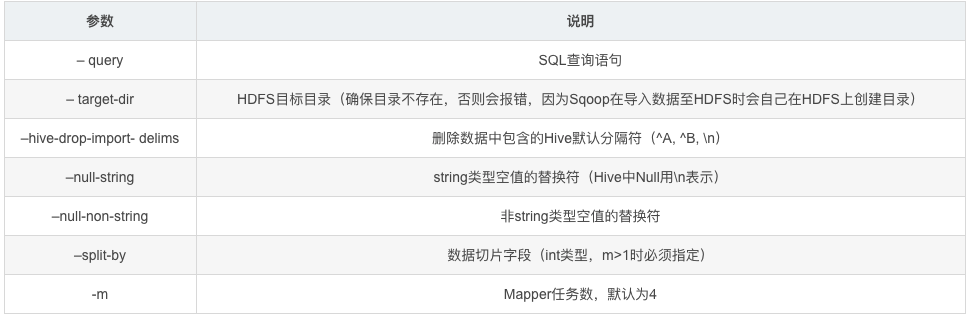
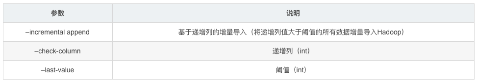
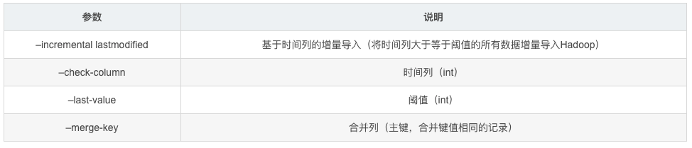

[TOC]

# 1.如何导入MySQL中的一张大表到HDFS

有一个存有上亿条数据的mysql表，怎么优化导入到HDFS速度

方案：

方案1：通过写脚本分批导入HDFS

方案2：启用并发导入

脚本如下：

```bash
#!/bin/bash
source /etc/profile

host=127.0.0.1

for((i=1; i<=100; i++))
do   
    start=$(((${i} - 1) * 100000 + 1))
    end=$((${i} * 100000))

    sql="select person_id,capture_time,write_time,capture_resource_id,major_capture_image_url,minor_capture_image_url,sex,age,orientation,glasses,knapsack, bag,messenger_bag,shoulder_bag,umbrella,hair,hat,mask,upper_color,upper_type,upper_texture,bottom_color,bottom_type,trolley_case,barrow,baby,feature_type,feature_code from big_data.pedestrian_sm where person_id>=${start} and person_id<=${end} and \$CONDITIONS";  

    sqoop import --connect jdbc:mysql://${host}:3306/big_data \
    --username root \
    --password 123456 \
    --query "${sql}" \
    --fields-terminated-by '\001' \
    --delete-target-dir \
    --target-dir hdfs://hsmaster:9000/tmp/big_data/pedestrian_sm/${start}-${end}/ \
    --split-by person_id \
    -m 8

    echo Sqoop import from: ${start} to: ${end} success....................................


    hive -e "
        use big_data;
        load data inpath 'hdfs://master:9000/tmp/big_data/pedestrian_sm/${start}-${end}' into table big_data.pedestrian_sm;
    "

    echo Hive load from: ${start}-${end} success....................................

done
```


Sqoop支持全量数据导入和增量数据导入，同时可以指定数据是否以并发形式导入

## 1.1 全量数据导入

```bash
# 全量数据导入
sqoop import \
 --connect jdbc:mysql://192.168.xxx.xxx:3316/testdb \
 --username root \
 --password 123456 \
 --query “select * from test_table where \$CONDITIONS” \
 --target-dir /user/root/person_all \ 
 --fields-terminated-by “,” \
 --hive-drop-import-delims \
 --null-string “\\N” \
 --null-non-string “\\N” \
 --split-by id \
 -m 6 \
```

重要参数说明：




## 1.2 增量数据导入

增量数据导入分为两种，一是基于递增列的增量数据导入(Append方式)，二是基于时间列的增量数据导入(LastModified方式)

1. Append方式

   举个栗子，有一个订单表，里面每个订单有一个唯一标识自增列ID，在关系型数据库中以主键形式存在。之前已经将id在0~5201314之间的编号的订单导入到Hadoop中了（这里为HDFS），现在一段时间后我们需要将近期产生的新的订单数据导入Hadoop中（这里为HDFS），以供后续数仓进行分析。此时我们只需要指定–incremental 参数为append，–last-value参数为5201314即可。表示只从id大于5201314后开始导入。

   

   ```sql
   # Append方式的全量数据导入
    sqoop import \
      --connect jdbc:mysql://192.168.xxx.xxx:3316/testdb \
      --username root \
      --password 123456 \
      --query “select order_id, name from order_table where \$CONDITIONS” \
      --target-dir /user/root/orders_all \ 
      --split-by order_id \
      -m 6  \
      --incremental append \
      --check-column order_id \
      --last-value 5201314
   ```

   参数说明：

   

   

   

2. LastModified方式

   此方式要求原有表中有time字段，它能指定一个时间戳，让Sqoop把该时间戳之后的数据导入至Hadoop（这里为HDFS）。因为后续订单可能状态会变化，变化后time字段时间戳也会变化，此时Sqoop依然会将相同状态更改后的订单导入HDFS，当然我们可以指定merge-key参数为orser_id，表示将后续新的记录与原有记录合并


   ```bash
   # 将时间列大于等于阈值的数据增量导入HDFS
    sqoop import \
      --connect jdbc:mysql://192.168.xxx.xxx:3316/testdb \
      --username root \
      --password transwarp \
      --query “select order_id, name from order_table where \$CONDITIONS” \
      --target-dir /user/root/order_all \ 
      --split-by id \
      -m 4  \
      --incremental lastmodified \
      --merge-key order_id \
      --check-column time \
      # remember this date !!!
      --last-value “2014-11-09 21:00:00”  
   ```

   

## 1.3 并发导入参数设置

我们知道通过 -m 参数能够设置导入数据的 map 任务数量，即指定了 -m 即表示导入方式为并发导入，这时我们必须同时指定 - -split-by 参数指定根据哪一列来实现哈希分片，从而将不同分片的数据分发到不同 map 任务上去跑，避免数据倾斜。

注意点：

- 生产环境中，为了防止主库被Sqoop抽崩，我们一般从备库中抽取数据。
- 一般RDBMS的导出速度控制在60~80MB/s，每个 map 任务的处理速度5~10MB/s 估算，即 -m 参数一般设置4~8，表示启动 4~8 个map 任务并发抽取。

