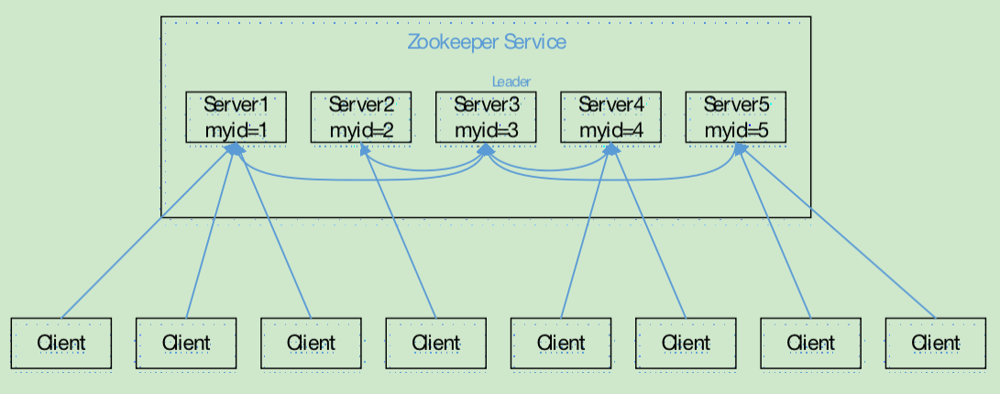
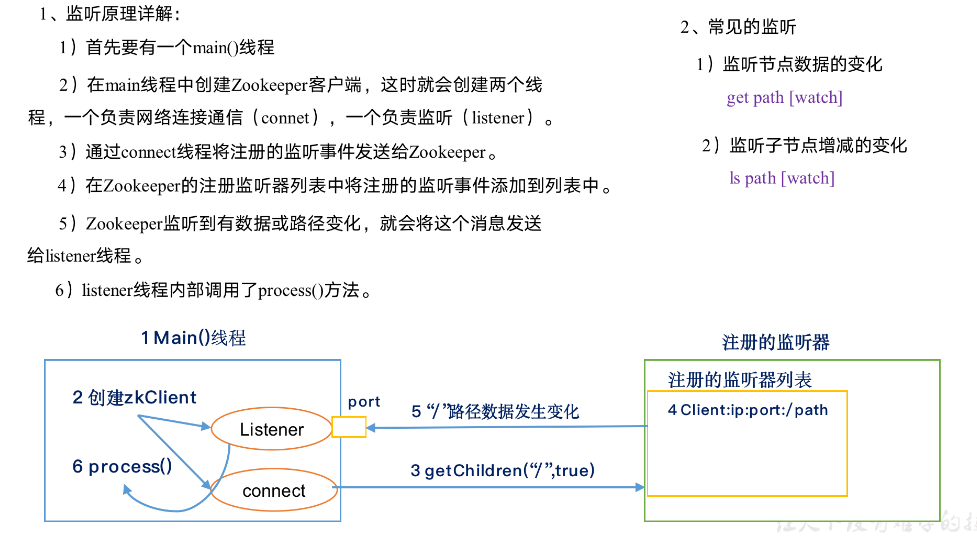
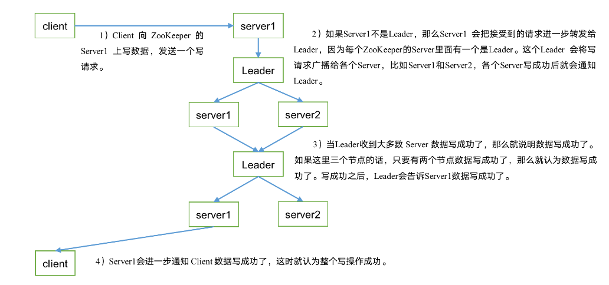
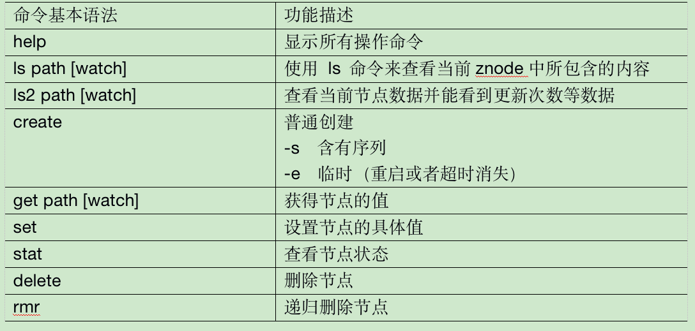

[TOC]

# 1.选举机制

1）半数机制：集群中半数以上机器存活，集群可用。所以Zookeeper适合安装奇数台服务器。

2）Zookeeper虽然在配置文件中并没有指定Master和Slave。但是，Zookeeper工作时，是有一个节点为Leader，其他则为Follower，Leader是通过内部的选举机制临时产生的。

3）以一个简单的例子来说明整个选举的过程。

假设有五台服务器组成的Zookeeper集群，它们的id从1-5，同时它们都是最新启动的，也就是没有历史数据，在存放数据量这一点上，都是一样的。假设这些服务器依序启动，来看看会发生什么，如图所示。

（1）服务器1启动，此时只有它一台服务器启动了，它发出去的报文没有任何响应，所以它的选举状态一直是LOOKING状态。

（2）服务器2启动，它与最开始启动的服务器1进行通信，互相交换自己的选举结果，由于两者都没有历史数据，所以id值较大的服务器2胜出，但是由于没有达到超过半数以上的服务器都同意选举它(这个例子中的半数以上是3)，所以服务器1、2还是继续保持LOOKING状态。

（3）服务器3启动，根据前面的理论分析，服务器3成为服务器1、2、3中的老大，而与上面不同的是，此时有三台服务器选举了它，所以它成为了这次选举的Leader。

（4）服务器4启动，根据前面的分析，理论上服务器4应该是服务器1、2、3、4中最大的，但是由于前面已经有半数以上的服务器选举了服务器3，所以它只能接收当小弟的命了。

（5）服务器5启动，同4一样当小弟。

# 2. 节点的类型有哪些

有4种：持久节点、临时节点、持久顺序节点、临时顺序节点

1. 持久节点

   除非手动删除，否则节点一直存在于Zookeeper上

2. 临时节点

   临时节点的生命周期与客户端会话绑定，一旦客户端会话失效(客户端与Zookeeper连接断开不一定会话失效)，那么这个客户端创建的所有临时节点都会被移除

3. 持久顺序节点

   基本特性同持久节点，只是增加了顺序属性，节点名后会追加一个由父节点维护的自增整型数字

4. 临时顺序节点

   基本特性同临时节点，增加了顺序属性，节点名后会追加一个由父节点维护的自增整型数字

# 3. 监听器的原理

# 4. 写数据流程

# 5. 常用客户端操作命令

# 6. zookeeper的部署方式有哪几种？

单机模式，集群模式,伪集群模式

# 7. 介绍一下Zookeeper

Zookeeper是一个开源的分布式协调服务，分布式应用程序可以基于Zookeeper实现诸如数据发布/订阅、负载均衡、命名服务、分布式协调/通知、集群管理、Master选举、分布式锁和分布式队列等功能。

# 8. Zookeeper怎么保证主从节点的状态同步

Zookeeper的核心是原子广播机制，这个机制保证了各个server之间的同步。实现这个机制的协议叫做Zab协议。Zab协议有两种模式，分别是恢复模式和广播模式。

1. 恢复模式

   当服务启动或者Leader崩溃后，Zab就进入了恢复模式，当leader被选举出来，且大多数server完成了和leader的状态同步以后，恢复模式就结束了。状态同步保证了leader和server具有相同的系统状态

2. 广播模式

   一旦leader已经和多数follower进行了状态同步后，它就可以开始广播消息了，即进入广播状态。这时候当一个server加入Zookeeper服务中，它会在恢复模式下启动，发现leader，并和leader进行状态同步。待同步结束，它也参与消息广播。Zookeeper服务一直维持在Broadcast状态，直到leader崩溃了或者leader失去了大部分的follwer的支持

# 9. 有哪些角色

## 9.1 leader

1. 事务请求的唯一调度和处理者，保证集群事务处理的顺序性
2. 集群内部各服务的调度者

## 9.2 follower

1. 处理客户端的非事务请求，转发事务请求给leader服务器
2. 参与事务请求Proposal的投票
3. 参与leader选举投票

## 9.3 observer

1. 3.0版本以后引入的一个服务器角色，在不影响集群事务处理能力的基础上提升集群的非事务处理能力
2. 处理客户端的非事务请求，转发事务请求给leader服务器
3. 不参与任何形式的投票

# 10.Server的工作状态有哪些？

服务器有4种状态：LOOKING、FOLLOWING、LEADING、OBSERVING

1. LOOKING

   寻找leader状态。当服务器处于该状态时，它会认为当前集群中没有leader，因此需要进入leader选举状态

2. FOLLOWING

   跟随者状态，表名当前服务器是Follower

3. LEADING

   领导者状态，表名当前服务器是Leader

4. OBSERVING

   观察者状态，表名当前服务器是Observer

# 11. 说一下数据同步过程

整个集群完成leader选举后，Learner(Follower和Observer的统称)会向Leader服务器进行注册。当Learner服务器向Leader服务器完成注册后，进入数据同步环节。

## 11.1 数据同步流程

数据同步均以消息传递的方式进行

1. Learner向Leader注册
2. 数据同步
3. 同步确认

## 11.2 数据同步前所做的工作

在进行数据同步前，Leader服务器会完成数据同步初始化

1. peerLastZxid

   从learner服务器注册时发送的ACKEPOCH消息中提取lastZxid(该Learner服务器最后处理的ZXID)

2. minCommittedLog

   Leader服务器Proposal缓存队列committedLog中最小的ZXID

3. maxCommittedLog

   Leader服务器Proposal缓存队列committedLog中最大的ZXID

## 11.3 Zookeeper的数据同步的分类(4类)

1. 直接差异化同步(DIFF同步)

   场景：peerLastZxid介于minCommittedLog与maxCommittedLog之间

2. 先回滚再差异化同步(TRUNC+DIFF同步)

   场景：当新的Leader服务器发现某个Learner服务器包含了一条自己没有的事务记录，那么就需要让该Learner服务器进行事务回滚，回滚到Leader服务器上存在的同时也是最接近peerLastZxid的ZXID

3. 仅回滚同步(TRUNC同步)

   peerLastZxid大于maxCommittedLog

4. 全量同步(SNAP同步)

   场景一：peerLastZxid小于minCommittedLog

   场景二：Leader服务器上没有Proposal缓存队列且peerLastZxid不等于lastProcessZxid

# 12. 如何保证事务顺序一致性

Zookeeper采用了全局递增的事务id来标识，所有的Proposal都在被提出的时候加上了zxid，zxid实际上是一个64位的数字，高32位是epoch(纪元)用来标识Leader周期，如果有新的Leader选举出来，epoch会自增，低32位用来递增计数。当新产生Proposal的时候，会依据数据库的两阶段过程，首先向其他的server发出事务执行请求，如果超过半数的机器都能执行并且成功，那么就开始执行。

# 13. 分布式集群中为什么会有Master主节点

在分布式环境中，有些业务逻辑只需要集群中的某一台机器进行执行，其他的机器可以共享这个结果，这样可以大大减少重复计算，提高性能。

# 14.Zookeeper宕机如何处理

Zookeeper本身也是集群，推荐配置不少于3个服务器。Zookeeper自身也要保证当一个节点宕机时，其他节点会继续提供服务

1. 如果是一个follow节点宕机，还有两台服务器提供访问，因为Zookeeper上的数据是有多个副本的，数据不会丢失
2. 如果是一个Leader宕机，Zookeeper会选举出新的Leader
3. ZK集群的机制是只要超过半数的节点正常，集群就能正常提供服务。只有在Zk节点挂的太多，只剩一半或不到一半节点能工作，集群才失效

所以

1. 3个节点的cluster可以挂掉1个节点(leader可以得到2票>1.5)
2. 2个节点的cluster就不能挂掉任何1个节点了(leader可以得到1票<=1)

# 15. Zookeeper对节点的watch监听通知是永久的吗？

不是永久的。

一个Watch事件是一个一次性的触发器，当被设置了Watch的数据发生了改变的时候，则服务器将这个改变发送给设置了Watch的客户端以便通知它们。

## 15.1 为什么不是永久的？

如果服务端变动频繁，而监听的客户端很多的情况下，每次变动都要通知到所有的客户端，给网络和服务器造成很大压力。

在实际的应用中，很多情况下，我们的客户端不需要知道服务端的每一次变动，只要最新的数据即可

# 16. ZAB与Paxos算法的区别与联系

## 16.1 相同点

1. 两者都存在一个类似Leader进程的角色，由其负责协调多个Follower进程的运行
2. Leader进程都会等待超过半数的Follower做出正确的反馈后，才会将一个提案进行提交
3. ZAB协议中，每个Proposal中都包含一个epoch值来代表当前的Leader周期，Paxos中名字为Ballot

## 16.2 不同点

ZAB用来构建高可用的分布式数据主备系统(Zookeeper),Paxos是用来构建分布式一致性状态机系统

# 17.Zookeeper的典型应用场景

1. 数据发布/订阅
2. 负载均衡
3. 命名服务
4. 分布式协调/通知
5. 集群管理
6. Master选举
7. 分布式锁
8. 分布式队列

# 18. 说一下Zookeeper的通知机制

client端会对某个znode建立一个watcher事件，当该znode发生变化时，这些client会收到zk的通知，然后client可以根据znode变化来做出业务上的改变等。

