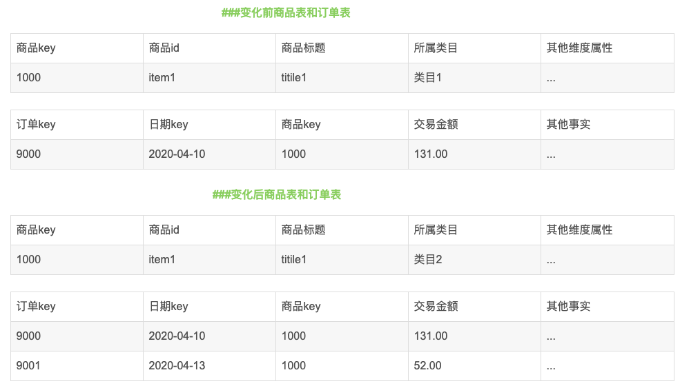
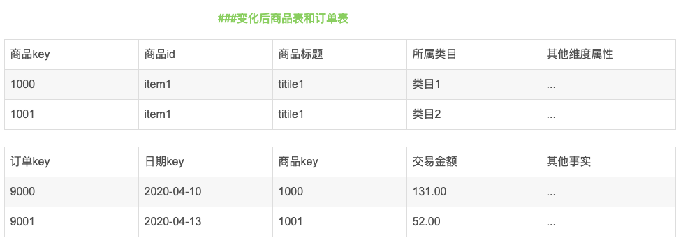

[TOC]

# 1. 举一个口径不一致的例子

所谓口径就是取数逻辑，口径是统计学中的一种叫法

举个口径不一致的例子：

需求1：统计视频类别热度top10 

需求2：统计各类别视频热度top10

# 2. 有哪些复杂的需求实现

# 3. 数据仓库的特点

- 数据仓库的数据是面向主题的
- 数据仓库的数据是集成的
- 数据仓库的数据是不可更新的
- 数据仓库的数据是随时间不断变化的

# 4. 介绍一下数据仓库

另外一种问法：说一下你对数据仓库的理解

数据仓库是面向主题的、集成的、相对稳定的、反映历史变化的数据集合，目的在于支持决策，构建面向分析集成化数据环境，为企业提供支持

# 5. 数据仓库与数据库的区别

1. 数据粒度不同

   数据库存储的是操作型数据，是细节性的数据，是当前的数据，反映的是最后修改的结果。数据仓库是分析型的集成或汇总的数据，面向主题，并且保存数据的所有历史状态

2. 数据的生命周期不同

   数据库存的数据的生命周期比较短，不会保存很久的数据，数据仓库则需要历史数据来反映趋势的变化和分析

3. 建模方法不同

   数据库采用范式建模，不能有冗余，数据仓库的建模方法有DW范式建模和DM维度建模，可以存在冗余

4. 时间敏感度不同

   数据库的数据要求及时性非常高，数据仓库可以容忍数据的一定延迟

5. 目标不同

   数据库主要面向业务处理，数据仓库面向分析用户

# 6. 范式建模和维度建模的区别

关系模型严格遵循第三范式，物理表数量多，数据冗余程度低，主要应用于OLTP系统中，维度模型主要应用于OLAP系统中，通常以某一个事实表为中心进行表的组织，主要面向业务，特征是可能存在数据的冗余，但是能方便地得到数据

# 7. 维度建模过程中遇到的问题

## 7.1 业务系统维度增加

维度增加不难处理，最坏的情况需要追溯维度历史数据，需要重跑宽表数据。如果该维度属于独立业务，也可以以补充表的方式处理。在指标层，维度交叉会增加指标的量，如果之前有完整的指标体系，以建指标的方式处理的报表，那么增加维度也很简单，单独计算下增加维度带来的新二级指标即可。如果不是以指标方式处理的报表， 而是以汇总表的方式和其他指标混合在一张表里面了，那么恭喜你可能要重跑该表历史数据了。

# 8. 项目中有哪些主题

设备主题

会员主题

商品主题

活动主题

地区主题

# 9. 项目中有哪些模型

- 业务模型
- 领域模型
- 逻辑模型
- 物理模型

# 10. 数据仓库总线架构、总线矩阵

## 10.1 什么是总线矩阵

企业数据仓库总线矩阵是用于设计并与企业数据仓库总线架构交互的基本工具。矩阵的行表示业务过程，列表示维度。矩阵中的点表示维度与给定的业务过程是否存在关联关系

## 10.2 采用总线矩阵的必要性

企业数据仓库总线矩阵是DW/BI系统的一个总体数据架构，如果我们在建立数据仓库的时候，只考虑单独的某个业务系统的数据建设，则无法满足一致性的目标，例如：相互有联系的系统数据的维度不同导致关联复杂或者关关联不上，数据之间相互成为了孤岛，对于后期的扩展或者整个数仓的建设都是巨大的障碍

# 11. 数据仓库 高内聚低耦合原则怎么理解

一个逻辑或者物理模型由哪些记录和字段组成，应该遵循最基本的软件设计方法论的高内聚和低耦合原则。主要从数据业务特性和访问特性两个角度来考虑，将业务相近或者相关、粒度相同的数据设计为 一个逻辑或者物理模型；将高概率同时访问的数据放在一起；将低概率同时访问的数据分开存储

# 12. 数据仓库应该遵循的原则

## 12.1 高内聚低耦合

主要从数据业务特性和访问特性两个角度来考虑，将业务相近或者相关、粒度相同的数据设计为一个逻辑或物理模型，将高概率同时访问的数据放在一起，将低概率同时访问的数据分开存储

## 12.2 核心模型与扩展模型分离

核心模型包括的字段支持常用的核心业务，扩展模型包括的字段支持个性化或少量的应用的需求，不能让扩展模型的字段过度侵入核心模型，以免破坏架构的间接性与可维护性

## 12.3 公共处理逻辑下沉及单一

越是底层公用的处理逻辑越应该在数据调度依赖的底层进行封装与实现。不要让公用的处理逻辑暴露给应用层实现，不要让公共逻辑多处同时存在。

## 12.4 成本与性能的平衡

适当的数据冗余可换取查询和刷新性能，不宜过度冗余与数据复制

## 12.5 数据可回滚

处理逻辑不变，在不同时间多次运行结果确定不变

## 12.6 命名清晰、可理解

表命名需要清晰、一致

# 13. 数据仓库的核心模型与扩展模型

核心模型包括的字段支持常用的核心业务，扩展模型包括的字段支持个性化或少量的应用的需求，不能让扩展模型的字段过度侵入核心模型，以免破坏核心模型的架构间接性与可维护性

# 14. 维度建模一致性如何保证？

1. 重写维度值

   采用此种方式，不保留历史数据，始终取最新的数据

   

   

2. 插入新的维度行

   采用此种方式，保留历史数据

   维度值变化前的事实和过去的维度值关联，纬度值变化后的事实和当前的维度值关联

   

   

3. 添加维度列

   采用第2种处理方式不能将变化前后记录的事实归一为变化前的维度或者归一为变化后的维度。比如根据业务需求，需要将4月份的交易额全部统计到类目2上，采用第2种方式无法实现。针对此问题，采用第3种方式，保留历史数据，可以使用任何一个属性列

   

# 15. 数据仓库为什么要分层

1. 复杂问题简单化
2. 减少重复开发
3. 隔离原始数据

# 16. 数据治理

