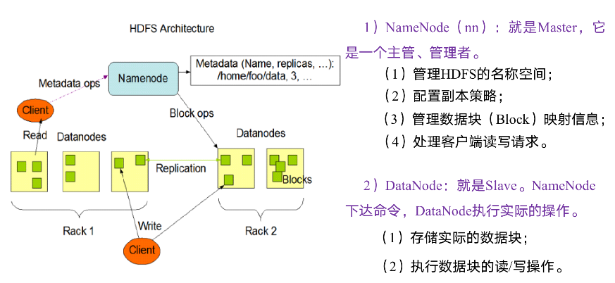
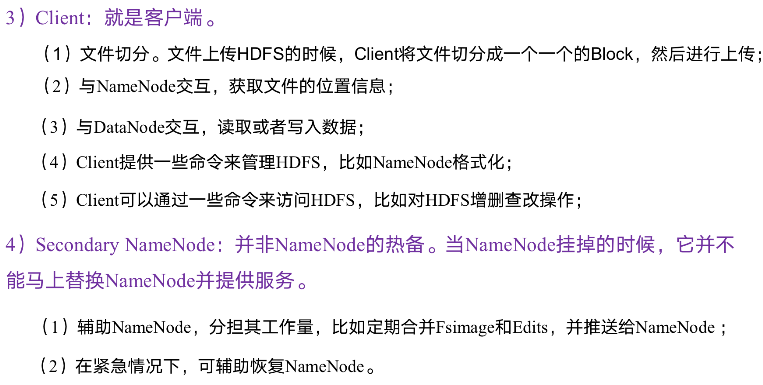

[TOC]

# 1. 开发语言方面


## 1.1 Go

### 1.1.1 Channel

1. CSP模型(面试常常问)

2. 创建

   ```go
   ch := make(chan int)
   ```

   channel和map类似，make创建了一个底层数据结构的引用，当赋值或参数传递时，只是拷贝了一个channel引用，指向相同的chnnel对象。和其他引用类型一样，channel的空值为nil,使用==可以对类型相同的channel进行比较，只有指向相同对象或者同为Nil时，才返回true

3. 读写操作

   ```go
   ch := make(chan int)
   
   // write to channel
   ch <- x
   
   // read from channel
   x <- ch
   
   // another way to read
   x = <- ch
   ```

   Channel一定要初始化后才能进行读写操作，否则会永久阻塞

4. 关闭(面试常问，细节需要注意)

   ```go
   ch := make(chan int)
   close(ch)
   ```

   下面6点一定要熟记:

   + 关闭一个未初始化/nil的channel会panic
   + 重复关闭同一个channel会panic
   + 向一个已经关闭的channel发送消息会panic
   + 从已关闭的channel读取消息不会产生panic,且能读出channel中还未被读取的消息，若消息均已经读出，会读到类型的零值。从一个已关闭的channel中读取消息永远不会阻塞，并且会返回一个为false的ok-idiom，可以用它来判断channel是否关闭。
   + 关闭channel会产生一个广播机制，所有从channel读取消息的goroutine都会收到消息
   + 向nil的channel里写会panic
   + 从一个为Nil的channel里读会panic

   **注意channel如果需要关闭的话一定是写的那端来关闭channel**

5. 带缓存的和不带缓存的

   + 无缓存的channel

     从无缓存的channel中读取消息会阻塞，直到有goroutine向该channel中发送消息

     向无缓存的channel中发送消息也会阻塞，直到有goroutine从channel中读取消息

   + 有缓存的channel

     有缓存的channel的声明方式为指定make函数的第二个参数，该参数为channel缓存的容量

     ```go
     ch := make(chan int, 10)
     ```

     有缓存的channel类似于一个阻塞队列(采用环形数组实现)。当缓存未满时，向channel中发送消息不会阻塞，当缓存满时，发送操作将被阻塞，直到有其他goroutine从中读取消息；相应的，当channel中消息不为空时，读取消息不会出现阻塞，当channel为空时，读取操作会造成阻塞，直到有goroutine向channel中写入消息。

     通过len函数可以获得chan中的元素个数，通过cap函数可以得到channel的缓存长度

   

6. 用法

   + goroutine之间通信

     ```go
     c := make(chan int)  // Allocate a channel.
     
     // Start the sort in a goroutine; when it completes, signal on the channel.
     go func() {
         list.Sort()
         c <- 1  // Send a signal; value does not matter.
     }()
     
     doSomethingForAWhile()
     <-c
     ```

     主goroutine会阻塞，直到执行sort的goroutine完成

   + range遍历

     Channel也可以使用range取值，并且会一直从channel中读取数据，直到有goroutine对该channel执行close操作，循环才会结束

     ```go
     // consumer worker
     ch := make(chan int, 10)
     for x := range ch{
         fmt.Println(x)
     }
     ```

     在for执行的过程中，如果channel已经close，for循环会自动退出

     上面的代码等价于

     ```go
     for {
         x, ok := <- ch
         if !ok {
             break
         }
         
         fmt.Println(x)
     }
     ```

   + 配合select使用

     Select用法类似于IO多路复用，可以同时监听多个channel的消息状态

     ```go
     select {
         case <- ch1:
         ...
         case <- ch2:
         ...
         case ch3 <- 10;
         ...
         default:
         ...
     }
     ```

     + Select可以同时监听多个channel的写入和读取
     + 执行select时，若只有一个case通过(不阻塞)，则执行这个case块
     + 若有多个case通过，则随机挑选一个case执行
     + 若所有case均阻塞，且定义了default模块，则执行default模块。若未定义default模块，则select语句阻塞，直到有case被唤醒
     + 使用break会跳出select块
     + 可以将某个channel设置为nil，进行强制阻塞，对于select分支来说，就是强制禁用此分支

     **设置超时时间**

     ```go
     ch := make(chan struct{})
     
     // finish task while send msg to ch
     go doTask(ch)
     
     timeout := time.After(5 * time.Second)
     select {
         case <- ch:
             fmt.Println("task finished.")
         case <- timeout:
             fmt.Println("task timeout.")
     }
     ```

     **Quit channel**

     有一些场景中，一些worker goroutine需要处理一直循环处理信息，直到收到quit信号

     ```go
     msgCh := make(chan struct{})
     quitCh := make(chan struct{})
     for {
         select {
         case <- msgCh:
             doWork()
         case <- quitCh:
             finish()
             return
     }
     ```

     **单向channel**

     所谓单向channel就是只可写入或只可读的channel,事实上channel只读或只写都没有意义，所谓的单向channel其实只是声明时使用

     ```go
     func foo(ch chan<- int) <-chan int {...}
     ```

     `chan <- int`表示一个只可以写入的channel,`<-chan int`表示一个只可以读取的channel。上面这个函数约定了`foo`内只能向ch中写入数据，返回一个只能读取的channel,虽然使用普通的channel也没有问题，但这样在方法声明时约定可以防止channel被滥用，这种预防机制发生在编译期。

   + 合并多个channel的输出到一个channel形成一个消息队列

     ```go
     /**
     将多个输入的channel进行合并成一个channel
      */
     func testMergeInput() {
     	input1 := make(chan int)
     	input2 := make(chan int)
     	output := make(chan int)
     
     	go func(in1, in2 <-chan int, out chan<- int) {
     		for {
     			select {
     			case v := <-in1:
     				out <- v
     			case v := <-in2:
     				out <- v
     			}
     		}
     	}(input1, input2, output)
     
     	go func() {
     		for i := 0; i < 10; i++ {
     			input1 <- i
     			time.Sleep(time.Millisecond * 100)
     		}
     	}()
     
     	go func() {
     		for i := 20; i < 30; i++ {
     			input2 <- i
     			time.Sleep(time.Millisecond * 100)
     		}
     	}()
     
     	go func() {
     		for {
     			select {
     			case value := <-output:
     				fmt.Println("输出：", value)
     			}
     		}
     	}()
     
     	time.Sleep(time.Second * 5)
     	fmt.Println("主线程退出")
     }
     ```

     

7. channel的组成

   主要组成:一个环形数组实现的队列，用于存储消息元素；两个链表实现的goroutine等待队列，用于存储阻塞在recv和send操作上的goroutine;一个互斥锁，用户各个属性变动的同步

8. 通过channel传递的数据

   经过channel传递的数据是相互独立的，修改传递之后的数据不会影响修改之前的数据

9. 生产者消费者问题

   通过channel可以比较方便的实现生产者消费者模型，这里开启一个生产者线程，一个消费者线程，生产者线程往channel中发送消息，同时阻塞，消费者线程轮询获取channel中的消息，进行处理，然后阻塞，这时生产者线程唤醒继续后面的逻辑，如此便形成了简单的生产者消费者模型。同时生产者在完成了所有的消息发送后，可以通过quit这个channel通知消费者线程退出，而消费者线程退出时，通知主线程退出，整个程序完成退出。

   ```go
   /**
   生产者消费者问题
    */
   func testPCB() {
   	fmt.Println("test PCB")
   
   	intchan := make(chan int)
   	quitChan := make(chan bool)
   	quitChan2 := make(chan bool)
   
   	value := 0
   
   	go func() {
   		for i := 0; i < 3; i++ {
   
   			value = value + 1
   			intchan <- value
   
   			fmt.Println("write finish, value ", value)
   
   			time.Sleep(time.Second)
   		}
   		quitChan <- true
   	}()
   	go func() {
   		for {
   			select {
   			case v := <-intchan:
   				fmt.Println("read finish, value ", v)
   			case <-quitChan:
   				quitChan2 <- true
   				return
   			}
   		}
   
   	}()
   
   	<-quitChan2
   	fmt.Println("task is done ")
   }
   ```

10. 通过channel实现并发数量控制

    通过设置一个带缓冲数量的的channel来实现最大并发数量，最大并发数量即为缓冲数量，任务开始时想limit这个channel发送消息，任务执行完成后从这个limit读取消息，这样就可以保证当并发数量达到limit的缓冲数量时，limit <- true 这里会发生阻塞，停止创建新的线程，知道某个线程执行完成任务后，从limit读取数据，这样就能保证最大并发数量控制在缓冲数量。

    ```go
    /*
    测试通过channel来控制最大并发数，来处理事件
     */
    func testMaxNumControl()  {
    	maxNum := 3
    	limit := make(chan bool, maxNum)
    	quit := make(chan bool)
    
    	for i:=0; i<100; i++{
    		fmt.Println("start worker : ", i)
    
    		limit <- true
    
    		go func(i int) {
    			fmt.Println("do worker start: ", i)
    			time.Sleep(time.Millisecond * 20)
    			fmt.Println("do worker finish: ", i)
    
    			<- limit
    
    			if i == 99{
    				fmt.Println("完成任务")
    				quit <- true
    			}
    
    		}(i)
    	}
    
    	<-quit
    	fmt.Println("收到退出通知，主程序退出")
    }
    ```

    

11. 监听中断信号的channel

    ```go
    quit := make(chan os.Signal)
    signal.Notify(quit, os.Interrupt)
    <- quit
    ```

    

12. 利用channel实现同步控制

    开启多个线程做赚钱和花钱的操作，共享读写remainMoney这个剩余金额变量，实现生产者消费者模型

    ```go
    //同步控制模型，生产者模型
    var lockChan = make(chan int, 1)
    var remainMoney = 1000
    func testSynchronize()  {
    	quit := make(chan bool, 2)
    
    	go func() {
    		for i:=0; i<10; i++{
    			money := (rand.Intn(12) + 1) * 100
    			go testSynchronize_expense(money)
    
    			time.Sleep(time.Millisecond * time.Duration(rand.Intn(500)))
    		}
    
    		quit <- true
    	}()
    
    	go func() {
    		for i:=0; i<10; i++{
    			money := (rand.Intn(12) + 1) * 100
    			go testSynchronize_gain(money)
    
    			time.Sleep(time.Millisecond * time.Duration(rand.Intn(500)))
    		}
    
    		quit <- true
    	}()
    
    	<- quit
    	<- quit
    
    	fmt.Println("主程序退出")
    }
    
    func testSynchronize_expense(money int)  {
    	lockChan <- 0
    
    	if(remainMoney >= money){
    		srcRemainMoney := remainMoney
    		remainMoney -= money
    		fmt.Printf("原来有%d, 花了%d，剩余%d\n", srcRemainMoney, money, remainMoney)
    	}else{
    		fmt.Printf("想消费%d钱不够了, 只剩%d\n", money, remainMoney)
    	}
    
    	<- lockChan
    }
    
    func testSynchronize_gain(money int)  {
    	lockChan <- 0
    
    	srcRemainMoney := remainMoney
    	remainMoney += money
    	fmt.Printf("原来有%d, 赚了%d，剩余%d\n", srcRemainMoney, money, remainMoney)
    
    	<- lockChan
    }
    ```

13. channel是否关闭的判断

    读已关闭的channel会得到零值，如果不确定channel是否关闭，需要使用`ok`进行检测。ok的结果和含义：

    - `true`：读到数据，并且通道没有关闭。
    - `false`：通道关闭，无数据读到。

    ```go
    if v, ok := <- ch; ok {
        fmt.Println(v)
    }
    ```

### 1.1.2 defer

1. defer的用途

   + 关闭文件句柄
   + 锁资源释放
   + 数据库连接释放

2. 输出顺序

   大原则是先进后出

   ```go
   package main
   
   import "fmt"
   
   func main() {
       var users [5]struct{}
       for i := range users {
           defer fmt.Println(i)
       }
   }
   ```

   输出：4 3 2 1 0

   如果上面的代码在defer中使用闭包，那么打印结果就不一样le

   ```go
   package main
   
   import "fmt"
   
   func main() {
       var users [5]struct{}
       for i := range users {
           defer func() { fmt.Println(i) }()
       }
   }
   ```

   输出：4 4 4 4 4

   原因：此处变量i在循环执行的时候是会被复用的，最后一次for循环i被赋值为4，所以最终输出的结果就是4

   不使用闭包的话，而是改用函数就可以正常输出预期的 4 3 2 1 0

   ```go
   package main
   
   import "fmt"
   
   func main() {
       var users [5]struct{}
       for i := range users {
           defer Print(i)
       }
   }
   func Print(i int) {
       fmt.Println(i)
   }
   ```

   

3. defer调用引用结构体函数

   ```go
   package main
   
   import "fmt"
   
   type Users struct {
       name string
   }
   
   func (t *Users) GetName() { // 注意这里是 * 传地址 引用Users
       fmt.Println(t.name)
   }
   func main() {
       list := []Users{{"乔峰"}, {"慕容复"}, {"清风扬"}}
       for _, t := range list {
           defer t.GetName()
       }
   }
   ```

   输出：清风扬 清风扬 清风扬

   如果向打印出 清风扬 慕容复 乔峰 需要使用类似下面的写法

   ```go
   package main
   
   import "fmt"
   
   type Users struct {
       name string
   }
   
   func (t *Users) GetName() { // 注意这里是 * 传地址 引用Users
       fmt.Println(t.name)
   }
   func GetName(t Users) { // 定义一个函数，名称自定义
       t.GetName() // 调用结构体USers的方法GetName
   }
   func main() {
       list := []Users{{"乔峰"}, {"慕容复"}, {"清风扬"}}
       for _, t := range list {
           defer GetName(t)
       }
   }
   ```

   输出：清风扬 慕容复 乔峰

   修改一下最初的代码

   ```go
   package main
   
   import "fmt"
   
   type Users struct {
       name string
   }
   
   func (t *Users) GetName() { // 注意这里是 * 传地址 引用Users
       fmt.Println(t.name)
   }
   func GetName(t Users) { // 定义一个函数，名称自定义
       t.GetName() // 调用结构体USers的方法GetName
   }
   func main() {
       list := []Users{{"乔峰"}, {"慕容复"}, {"清风扬"}}
       for _, t := range list {
           t2 := t // 定义新变量t2 t赋值给t2
           defer t2.GetName()
       }
   }
   ```

   输出：清风扬 慕容复 乔峰

4. 多个defer的执行顺序

   多个defer注册，按照先进后出的次序执行，哪怕函数或者某个延迟调用出错，这些调用依旧会被执行

   ```go
   package main
   
   func users(i int) {
       defer println("北丐")
       defer println("南帝")
   
       defer func() {
           println("西毒")
           println(10 / i) // 异常未被捕获，逐步往外传递，最终终止进程。
       }()
   
       defer println("东邪")
   }
   
   func main() {
       users(0)
       println("武林排行榜,这里不会被输出哦")
   }
   ```

   输出:

   东邪
   西毒
   南帝
   北丐
   panic: runtime error: integer divide by zero
   goroutine 1 [running]:
   main.users.func1(0x0)

   

5. 延迟调用参数在求值或复制，指针或闭包会"延迟"读取

   ```go
   package main
   
   func test() {
       x, y := "乔峰", "慕容复"
   
       defer func(s string) {
           println("defer:", s, y) // y 闭包引用 输出延迟和的值，即y+= 后的值=慕容复第二
       }(x) // 匿名函数调用，传送参数x 被复制,注意这里的x 是 乔峰,而不是下面的 x+= 后的值
   
       x += "第一"
       y += "第二"
       println("x =", x, "y =", y)
   }
   
   func main() {
       test()
   }
   ```

   输出：

   x = 乔峰第一 y = 慕容复第二
   defer: 乔峰 慕容复第二

   但是如果向下面这样的代码输出就会发生改变:

   ```go
   package main
   
   func test() {
   	x, y := "乔峰", "慕容复"
   	defer println("defer:", y)
   	x += "第一"
   	y += "第二"
   	println("x =", x, "y =", y)
   }
   
   func main() {
   	test()
   }
   ```

   x = 乔峰第一 y = 慕容复第二
   defer: 慕容复

   

6. defer在匿名返回值和命名返回值函数中的表现不同

   ```go
   package main
   
   import "fmt"
   
   func Users() (s string) {
   
   	s = "乔峰"
   	defer func() {
   		fmt.Println("延迟执行后:" + s)
   	}()
   
   	return "清风扬"
   }
   
   func main() {
   	println(Users())
   }
   ```

   输出：

   延迟执行后:清风扬
   清风扬

   通过上面这段代码可以总结出return和defer的执行顺序如下:

   先执行return语句的赋值，然后执行defer语句，最后执行return

   也就是说return不是原子操作

   

   再看一个例子

   ```go
   func returnValues() int {
       var result int
       defer func() {
           result++
           fmt.Println("defer")
       }()
       return result
   }
   
   func namedReturnValues() (result int) {
       defer func() {
           result++
           fmt.Println("defer")
       }()
       return result
   }
   ```

   上面的方法会输出0，下面的方法输出1。上面的方法使用了匿名返回值，下面的使用了命名返回值，除此之外其他的逻辑均相同，为什么输出的结果会有区别呢？

   要搞清这个问题首先需要了解defer的执行逻辑，文档中说defer语句在方法返回“时”触发，也就是说return和defer是“同时”执行的。以匿名返回值方法举例，过程如下。

   - 将result赋值给返回值（可以理解成Go自动创建了一个返回值retValue，相当于执行retValue = result）
   - 然后检查是否有defer，如果有则执行
   - 返回刚才创建的返回值（retValue）

   在这种情况下，defer中的修改是对result执行的，而不是retValue，所以defer返回的依然是retValue。在命名返回值方法中，由于返回值在方法定义时已经被定义，所以没有创建retValue的过程，result就是retValue，defer对于result的修改也会被直接返回。

   

7. 在for循环中使用defer可能导致性能问题

   ```go
   func deferInLoops() {
       for i := 0; i < 100; i++ {
           f, _ := os.Open("/etc/hosts")
           defer f.Close()
       }
   }
   ```

   defer在紧邻创建资源的语句后生命力，看上去逻辑没有什么问题。但是和直接调用相比，defer的执行存在着额外的开销，例如defer会对其后需要的参数进行内存拷贝，还需要对defer结构进行压栈出栈操作。所以在循环中定义defer可能导致大量的资源开销，在本例中，可以将f.Close()语句前的defer去掉，来减少大量defer导致的额外资源消耗。

8. 调用os.Exit时，defer不会被执行

   当发生panic时，所在goroutine的所有defer会被执行，但是当调用os.Exit()方法退出程序时,defer不会被执行

### 1.1.3 recover

recover仅在延迟函数defer中有效，在正常的执行过程中，调用recover会返回nil并且没有其他任何效果，如果当前的goroutine panic,调用recover可以捕获到panic的输入值，并且恢复正常的执行


## 1.2 Java

### 1.2.1 HashMap

重点掌握源码、预留数、扩容、对性能的影响

**读写的时间复杂度**

回答面试官的答案：

理想状态下读的时间复杂度是O(1)

读的理想情况：由于hashmap是通过数组+链表实现的，所以在链表长度尽可能短(为0)读的时间复杂度就是O(1)

理想情况下写的时间复杂度也是O(1)

同理，写的时间复杂度有可能是O(1)、O(logn)、O(n)

写(put)操作的流程：

第一步：key.hashcode()，时间复杂度O(1)。

第二步：找到桶以后，判断桶里是否有元素，如果没有，直接new一个entey节点插入到数组中。时间复杂度O(1)。

第三步：如果桶里有元素，并且元素个数小于6，则调用equals方法，比较是否存在相同名字的key，不存在则new一个entry插入都链表尾部。时间复杂度O(1)+O(n)=O(n)。

第四步：如果桶里有元素，并且元素个数大于6，则调用equals方法，比较是否存在相同名字的key，不存在则new一个entry插入都链表尾部。时间复杂度O(1)+O(logn)=O(logn)。红黑树查询的时间复杂度是logn。


和b+树的区别：

- B+树的叶子节点带有双向链表，方便区间查找，hashmap很难实现区间查找


1. 底层实现

   HashMap是由数组+链表组成的，数组是HashMap的主体，链表则是主要为了解决哈希冲突而存在的

2. 扩容

   默认的负载因子大小为0.75,也就是说当一个map填满了75%的bucket的时候，和其他集合类一样，将会创建原来HashMap大小的两倍的bucket数组，来重新调整map的大小，并将原来的对象放入新的bucket数组中，这个过程叫做rehashing,因为它调用hash方法找到新的bucket位置，这个值只可能在两个地方，一个是原下标的位置，另一种是下标为<原下标+原容量>的位置

   

   另外一种：

   HashMap的初始桶的数量为16，loadFact为0.75,当桶里面的数据记录超过阈值的时候，HashMap将会进行扩容则操作，每次都会变为原来大小的2倍，直到设定的最大值之后就无法再resize了。

3. 为什么说HashMap是线程不安全的？

   或者换种问法，HashMap为什么在多线程的情况下会出现死循环

   + put的时候导致的多线程数据不一致

     有两个线程A和B，首先A希望插入一个key-value对到HashMap中，首先计算记录所要落到的桶的索引坐标，然后获取到该桶里面的链表头结点，此时线程A的时间片用完了，而此时线程B被调度得以执行，和线程A一样执行，只不过线程B成功将记录插到了桶里面，假设线程A插入的记录计算出来的桶索引和线程B要插入的记录计算出来的桶索引是一样的，那么当线程B成功插入之后，线程A再次被调度运行时，它依然持有过期的链表头但是它对此一无所知，以至于它认为它应该这样做，如此一来就覆盖了线程B插入的记录，这样线程B插入的记录就凭空消失了，造成了数据不一致的行为。

     

     

     

     ---

     上面的简化回答:

     在hashmap做put操作的时候会调用到`addEntry`方法。现在假如A线程和B线程同时对同一个数组位置调用addEntry，两个线程会同时得到现在的头结点，然后A写入新的头结点之后，B也写入新的头结点，那B的写入操作就会覆盖A的写入操作造成A的写入操作丢失

   + resize操作时的线程不安全

     addEntry中当加入新的键值对后键值对总数量超过门限值的时候会调用一个resize操作， 这个操作会新生成一个新的容量的数组，然后对原数组的所有键值对重新进行计算和写入新的数组，之后指向新生成的数组。当多个线程同时检测到总数量超过阈值的时候就会同时进行resize操作，各自生成新的数组并rehash后赋给该map底层的数组table,结果最终只有最后一个线程生成的新数组被赋给table变量，其他线程的均会丢失。而且当某些线程已经完成赋值而其他线程刚开始的时候，就会用已经被赋值的table作为原始数组，这样也会有问题

   

   

   + HashMap的get操作可能因为resize而引起死循环（cpu100%）

     下面是resize的代码

     ```java
     void transfer(Entry[] newTable, boolean rehash) {  
             int newCapacity = newTable.length;  
             for (Entry<K,V> e : table) {  
       
                 while(null != e) {  
                     Entry<K,V> next = e.next;           
                     if (rehash) {  
                         e.hash = null == e.key ? 0 : hash(e.key);  
                     }  
                     int i = indexFor(e.hash, newCapacity);   
                     e.next = newTable[i];  
                     newTable[i] = e;  
                     e = next;  
                 } 
             }  
         }  
     ```

     这个方法的功能是将原来的记录重新计算在新桶的位置，然后迁移过去

     

     我们假设有两个线程同时需要执行resize操作，我们原来的桶数量为2，记录数为3，需要resize桶到4，原来的记录分别为：[3,A],[7,B],[5,C]，在原来的map里面，我们发现这三个entry都落到了第二个桶里面。
      假设线程thread1执行到了transfer方法的Entry next = e.next这一句，然后时间片用完了，此时的e = [3,A], next = [7,B]。线程thread2被调度执行并且顺利完成了resize操作，需要注意的是，此时的[7,B]的next为[3,A]。此时线程thread1重新被调度运行，此时的thread1持有的引用是已经被thread2 resize之后的结果。线程thread1首先将[3,A]迁移到新的数组上，然后再处理[7,B]，而[7,B]被链接到了[3,A]的后面，处理完[7,B]之后，就需要处理[7,B]的next了啊，而通过thread2的resize之后，[7,B]的next变为了[3,A]，此时，[3,A]和[7,B]形成了环形链表，在get的时候，如果get的key的桶索引和[3,A]和[7,B]一样，那么就会陷入死循环。

     如果在取链表的时候从头开始取（现在是从尾部开始取）的话，则可以保证节点之间的顺序，那样就不存在这样的问题了。

   

4. HashMap和HashTable的区别

   + HashMap允许null key和null value,而HashTable不允许
   + HashMap不是线程安全的，HashTable是线程安全的
   + HashMap是非synchronized的，HashTable是synchronized的
   + HashMap的迭代器是fail-fast迭代器，而HashTable的迭代器不是fail-fast的，当有其他线程改变了HashMap的结构(增加或者移除元素)将会抛出ConcurrentModificationException
   + 由于Hashtable是线程安全的也是synchronized，所以在单线程环境下它比HashMap要慢
   + 继承的父类不同， Hashtable继承自Dictionary类，而HashMap继承自AbstractMap类。但二者都实现了Map接口
   
  
   

   
5. 解决hash冲突的方法

   - 开放定址法
   - 再哈希法
   - 链地址法
   - 建立公共溢出区

   

   

6. java7和java8 HashMap的变化

   

   变动/优化主要在上图中红框内的部分，在插入的时候，如果链表长度大于8，会将链表转换成红黑树进行插入

7. 如何让HashMap同步？

   ```java
   Map m = Collections.synchronizeMap(hashMap);
   ```

   


### 1.2.2 多线程模型实现

https://www.cnblogs.com/kaleidoscope/p/9598140.html


### 1.2.3 线程池

https://www.cnblogs.com/zincredible/p/10984459.html

问：

java官方提供了几种线程池

各自的作用？


注意下面的线程池的拒绝策略面试会问到


1. 线程池使用实例代码

```java
public class Test {
     public static void main(String[] args) {   
         ThreadPoolExecutor executor = new ThreadPoolExecutor(5, 10, 200, TimeUnit.MILLISECONDS,
                 new ArrayBlockingQueue<Runnable>(5));
          
         for(int i=0;i<15;i++){
             MyTask myTask = new MyTask(i);
             executor.execute(myTask);
             System.out.println("线程池中线程数目："+executor.getPoolSize()+"，队列中等待执行的任务数目："+
             executor.getQueue().size()+"，已执行玩别的任务数目："+executor.getCompletedTaskCount());
         }
         executor.shutdown();
     }
}
 
 
class MyTask implements Runnable {
    private int taskNum;
     
    public MyTask(int num) {
        this.taskNum = num;
    }
     
    @Override
    public void run() {
        System.out.println("正在执行task "+taskNum);
        try {
            Thread.currentThread().sleep(4000);
        } catch (InterruptedException e) {
            e.printStackTrace();
        }
        System.out.println("task "+taskNum+"执行完毕");
    }
}
```

2. ## ThreadPoolExecutor类的参数有哪些

   + corePoolSize

     核心池的大小

   + maximumPoolSize

     线程池最大线程

   + keepAliveTime

     示线程没有任务执行时最多保持多久时间会终止。默认情况下，只有当线程池中的线程数大于corePoolSize时，keepAliveTime才会起作用，直到线程池中的线程数不大于corePoolSize

   + unit

     参数keepAliveTime的时间单位

   + workQueue

     一个阻塞队列，用来存储等待执行的任务

     常用的队列有如下几个：

     ArrayBlockingQueue:基于数组的先进先出队列，此队列创建时必须指定大小；

     LinkedBlockingQueue:基于链表的先进先出队列，如果创建时没有指定此队列大小，则默认为Integer.MAX_VALUE；

     SynchronousQueue:这个队列比较特殊，它不会保存提交的任务，而是将直接新建一个线程来执行新来的任务

     

   + threadFactory

     线程工厂，主要用来创建线程

   + handler

     表示当拒绝处理任务时的策略，有以下四种取值

     ```java
     ThreadPoolExecutor.AbortPolicy:丢弃任务并抛出RejectedExecutionException异常。 
     ThreadPoolExecutor.DiscardPolicy：也是丢弃任务，但是不抛出异常。 
     ThreadPoolExecutor.DiscardOldestPolicy：丢弃队列最前面的任务，然后重新尝试执行任务（重复此过程）
     ThreadPoolExecutor.CallerRunsPolicy：由调用线程处理该任务 
     ```

3. 线程池的状态

   线程池有4种状态:RUNNING、SHUTDOWN、STOP、TERMINATED

   创建线程后，初始时，线程池处于RUNNINING状态；

   如果调用了shutdown()方法，则线程池处于SHUTDOWN状态，此时线程池不能够接受新的任务，它会等待所有任务执行完毕；

   如果调用了shutdownNow()方法，则线程池处于STOP状态，此时线程池不能接受新的任务，并且会去尝试终止正在执行的任务；

   当线程池处于SHUTDOWN或STOP状态，并且所有工作线程已经销毁，任务缓存队列已经清空或执行结束后，线程池被设置为TERMINATED状态；

4. 任务提交给线程池之后的处理策略

   - 如果当前线程池中的线程数目小于corePoolSize，则每来一个任务，就会创建一个线程去执行这个任务；
   - 如果当前线程池中的线程数目>=corePoolSize，则每来一个任务，会尝试将其添加到任务缓存队列当中，若添加成功，则该任务会等待空闲线程将其取出去执行；若添加失败（一般来说是任务缓存队列已满），则会尝试创建新的线程去执行这个任务；
   - 如果当前线程池中的线程数目达到maximumPoolSize，则会采取任务拒绝策略进行处理；
   - 如果线程池中的线程数量大于 corePoolSize时，如果某线程空闲时间超过keepAliveTime，线程将被终止，直至线程池中的线程数目不大于corePoolSize；如果允许为核心池中的线程设置存活时间，那么核心池中的线程空闲时间超过keepAliveTime，线程也会被终止

5. 线程池的关闭

   + shutdown()

     不会立即终止线程池，而是要等所有任务缓存队列中的任务都执行完后才终止，但再也不会接受新的任务

   + shutdownNow()

     立即终止线程池，并尝试打断正在执行的任务，并且清空任务缓存队列，返回尚未执行的任务


### 1.2.4 future

https://www.cnblogs.com/flydean/p/12680281.html

### 1.2.5 StringBuilder、StringBuffer与String的区别的区别

1. StringBuffer是线程安全的，StringBuilder不是线程安全的
2. 缓冲区的区别：StringBuffer每次获取toString都会直接使用缓冲区的toStringCache值来构造一个字符串，而StringBuilder则每次都需要复制一次字符数组，再构造一个字符串
3. 性能:StringBuilder的性能远优于StringBuffer
4. 三者的区别：String是不可变的，另外两者都是可变的


三者的底层实现也需要掌握

### 1.2.6 进程、线程、协程的区别和联系


https://blog.csdn.net/daaikuaichuan/article/details/82951084


进程满足不了哪些才出现了线程


### 1.2.7 java的垃圾回收算法

**1）引用计数法** 应用于：微软的 COM/ActionScrip3/Python 等

a) 如果对象没有被引用，就会被回收，缺点：需要维护一个引用计算器

**2）复制算法** 年轻代中使用的是 Minor GC，这种 GC 算法采用的是复制算法(Copying)

a) 效率高，缺点：需要内存容量大，比较耗内存

b) 使用在占空间比较小、刷新次数多的新生区

**3）标记清除** 老年代一般是由标记清除或者是标记清除与标记整理的混合实现

a) 效率比较低，会差生碎片。

**4）标记压缩** 老年代一般是由标记清除或者是标记清除与标记整理的混合实现

a) 效率低速度慢，需要移动对象，但不会产生碎片。

**5）标记清除压缩**标记清除-标记压缩的集合，多次 GC 后才 Compact

a) 使用于占空间大刷新次数少的养老区，是 3 4 的集合体


### 1.2.8 LinkedList和ArrayList的区别

        1. ArrayList是实现了基于动态数组的数据结构，而LinkedList是基于链表的数据结构；
    
        2. 对于随机访问get和set，ArrayList要优于LinkedList，因为LinkedList要移动指针；
    
       3. 对于添加和删除操作add和remove，一般大家都会说LinkedList要比ArrayList快，因为ArrayList要移动数据。但是实际情况并非这样，对于添加或删除，LinkedList和ArrayList并不能明确说明谁快谁慢


### 1.2.9 java什么地方用到了红黑树

Hashmap


### 1.2.10 sleep和wait的区别

1、来自不同的类：sleep是Thread的静态类方法，谁调用的谁去睡觉，即使在a线程里调用了b的sleep方法，实际上还是a去睡觉，要让b线程睡觉要在b的代码中调用sleep。

2、有没有释放锁(释放资源)：sleep不出让系统资源;wait是进入线程等待池等待，出让系统资源，其他线程可以占用CPU。

3、一般wait不会加时间限制，因为如果wait线程的运行资源不够，再出来也没用，要等待其他线程调用notify/notifyAll唤醒等待池中的所有线程，才会进入就绪队列等待OS分配系统资源。sleep(milliseconds)可以用时间指定使它自动唤醒过来，如果时间不到只能调用interrupt()强行打断。

4、sleep必须捕获异常，而wait，notify和notifyAll不需要捕获异常


### 1.2.11 Volatile关键字是怎么保证线程安全的

https://blog.csdn.net/weixin_42298382/article/details/112883222

从java内存模型的角度谈一谈？

与synchronized的区别


### 1.2.12 讲一下JVM对于synchronized的优化

锁升级


### 1.2.13 讲一下锁粗化


### 1.2.14 JVM的内存区域都有哪些


### 1.2.15 什么情况下会导致OOM

和堆里的OOM有什么区别

哪个区域不会发生OOM


### 1.2.16 讲一下反射

什么场景下会用到反射


### 1.2.17 cpu一直100%的原因分析

如果我发现当前系统的的CPU利用率一直是100%，可以讲一下造成这个现象的原因吗

如何使用java命令结合linux命令找出问题所在


### 1.2.18 衡量java代码运行效率的指标


### 1.2.19 用通俗的语言介绍下多态


### 1.2.20 JMM


### 1.2.21 重载和重写的区别

英文名称分别是什么


### 1.2.22 ConcurrentHashMap

底层实现


### 1.2.23 equals 和==操作符的区别

equals和hashcode之间的关系


### 1.2.24 精度问题

两个double相加，比如0.1+0.1=0.200001这类问题如何解决


### 1.2.25 JVM相关

面试官问：我main方法new 了一个类，并调用它的run方法，JVM中都发生了什么


### 1.2.26 强引用、弱引用、虚引用


### 1.2.27 ThreadLocal可能导致的内存泄漏问题


### 1.2.28 JVM中的锁


### 1.2.29 lock和synchronized的区别


### 1.2.30 除了锁，其他保证线程安全的方式


### 1.2.31 同步块外部执行wait和notify能达到效果吗


### 1.2.32 java concurrent包里面用过什么


### 1.2.33 读写锁

为什么并发读要加锁


### 1.2.34 使用synchronized关键字有什么隐患


### 1.2.35 如何终止一个正在运行的线程


### 1.2.36 JVM CMS垃圾回收器和G1之间的区别？

G1详细是怎么回收垃圾的


### 1.2.37 JVM如何判断对象是否可回收


### 1.2.38 什么时候、什么情况下会发生GC回收

新生代和老年代分别介绍


### 1.2.39 java调试命令

看线程运行状态用什么？

看堆栈信息用什么


### 1.2.40 反射机制


### 1.2.41 抽象类和接口


## 1.3 Scala


# 2.算法方面(√)

## 2.1 各种排序算法代码实现以及空间时间复杂度(重点堆排序和快排)

如何理解排序的稳定性

哪些是稳定的？哪些不稳定


### 2.1.1 冒泡排序


### 2.1.2 快排

快速排序的基本思想：通过一趟排序将待排记录分隔成独立的两部分，其中一部分记录的关键字均比另一部分的关键字小，则可分别对这两部分记录继续进行排序，以达到整个序列有序。

```go
func quickSort(arr []int, start, end int) {
    if start < end {
        i, j := start, end
        key := arr[(start+end)/2]
        for i <= j {
            for arr[i] < key {
                i++
            }
            for arr[j] > key {
                j--
            }
            if i <= j {
                arr[i], arr[j] = arr[j], arr[i]
                i++
                j--
            }
        }

        if start < j {
            quickSort(arr, start, j)
        }
        if end > i {
            quickSort(arr, i, end)
        }
    }
}
```


### 2.1.3 归并排序

算法思想：不断的将大的数组拆分成2个小数组，使得小数组内有序，然后使用合并的排序思想对已经有序的数组进行和兴，合并为一个大的数组，直到所有数据都合并到一个数组中为止。

```go
func mergeSort(arr []int) []int {
        length := len(arr)
        if length < 2 {
                return arr
        }
        middle := length / 2
        left := arr[0:middle]
        right := arr[middle:]
        return merge(mergeSort(left), mergeSort(right))
}

func merge(left []int, right []int) []int {
        var result []int
        for len(left) != 0 && len(right) != 0 {
                if left[0] <= right[0] {
                        result = append(result, left[0])
                        left = left[1:]
                } else {
                        result = append(result, right[0])
                        right = right[1:]
                }
        }

        for len(left) != 0 {
                result = append(result, left[0])
                left = left[1:]
        }

        for len(right) != 0 {
                result = append(result, right[0])
                right = right[1:]
        }

        return result
}
```


### 2.1.4 堆排序

1. 大顶堆：每个节点的值都大于或等于其子节点的值，在堆排序算法中用于升序排列；
2. 小顶堆：每个节点的值都小于或等于其子节点的值，在堆排序算法中用于降序排列；

```go
func heapSort(arr []int) []int {
        arrLen := len(arr)
        buildMaxHeap(arr, arrLen)
        for i := arrLen - 1; i >= 0; i-- {
                swap(arr, 0, i)
                arrLen -= 1
                heapify(arr, 0, arrLen)
        }
        return arr
}

func buildMaxHeap(arr []int, arrLen int) {
        for i := arrLen / 2; i >= 0; i-- {
                heapify(arr, i, arrLen)
        }
}

func heapify(arr []int, i, arrLen int) {
        left := 2*i + 1
        right := 2*i + 2
        largest := i
        if left < arrLen && arr[left] > arr[largest] {
                largest = left
        }
        if right < arrLen && arr[right] > arr[largest] {
                largest = right
        }
        if largest != i {
                swap(arr, i, largest)
                heapify(arr, largest, arrLen)
        }
}

func swap(arr []int, i, j int) {
        arr[i], arr[j] = arr[j], arr[i]

```

## 2.2 二叉树镜像

```java
/**
public class TreeNode {
    int val = 0;
    TreeNode left = null;
    TreeNode right = null;

    public TreeNode(int val) {
        this.val = val;

    }

}
*/
public class Solution {
    public void Mirror(TreeNode root) {
        if(root == null) {
            return ;
        }
        if(root.left == null && root.right == null) {
            return ;
        }
        TreeNode temp = root.left;
        root.left = root.right;
        root.right = temp;
        Mirror(root.left);
        Mirror(root.right);
    }
}
```

## 2.3重排链表


```go
func reorderList(head *ListNode) {
    if head == nil {
        return
    }
    nodes := []*ListNode{}
    for node := head; node != nil; node = node.Next {
        nodes = append(nodes, node)
    }
    i, j := 0, len(nodes)-1
    for i < j {
        nodes[i].Next = nodes[j]
        i++
        if i == j {
            break
        }
        nodes[j].Next = nodes[i]
        j--
    }
    nodes[i].Next = nil
}
```

```java
class Solution {
    public void reorderList(ListNode head) {
        if (head == null) {
            return;
        }
        List<ListNode> list = new ArrayList<ListNode>();
        ListNode node = head;
        while (node != null) {
            list.add(node);
            node = node.next;
        }
        int i = 0, j = list.size() - 1;
        while (i < j) {
            list.get(i).next = list.get(j);
            i++;
            if (i == j) {
                break;
            }
            list.get(j).next = list.get(i);
            j--;
        }
        list.get(i).next = null;
    }
}
```

## 2.6 逆序对


https://leetcode-cn.com/problems/shu-zu-zhong-de-ni-xu-dui-lcof/solution/shu-zu-zhong-de-ni-xu-dui-by-leetcode-solution/

```go
func reversePairs(nums []int) int {
    return mergeSort(nums, 0, len(nums)-1)
}

func mergeSort(nums []int, start, end int) int {
    if start >= end {
        return 0
    }
    mid := start + (end - start)/2
    cnt := mergeSort(nums, start, mid) + mergeSort(nums, mid + 1, end)
    tmp := []int{}
    i, j := start, mid + 1
    for i <= mid && j <= end {
        if nums[i] <= nums[j] {
            tmp = append(tmp, nums[i])
            cnt += j - (mid + 1)
            i++
        } else {
            tmp = append(tmp, nums[j])
            j++
        }
    }
    for ; i <= mid; i++ {
        tmp = append(tmp, nums[i])
        cnt += end - (mid + 1) + 1
    }
    for ; j <= end; j++ {
        tmp = append(tmp, nums[j])
    }
    for i := start; i <= end; i++ {
        nums[i] = tmp[i - start]
    }
    return cnt
}
```


## 2.8 划分字段


根据一系列分隔符划分字段，可以用正则分布

```java
# java
String address="上海|上海市|闵行区|吴中路"; 
String[] splitAddress=address.split("\\|"); //如果以竖线为分隔符，则split的时候需要加上两个斜杠 \\ 进行转义
```

```sql
#sql
hive> select split('abcdef', 'c') from test;
["ab", "def"]
```


## 2.9 数组最小和问题


定义：一个数组从0~N-1，每个元素的左侧小于或等于该元素的所有元素之和称之为该元素的最小和。数组中所有元素的最小和称之为数组的最小和。求给定数组的最小和。

```java
package net.codeshow;

/**
 * @Description
 * @Author eric
 * @Version V1.0.0
 * @Date 2021/4/11
 */
public class Test73 {

    public static int getSmallSum(int[] arr) {
        if (arr == null || arr.length == 0) {
            return 0;
        }
        return func(arr, 0, arr.length - 1);
    }

    public static int func(int[] s, int l, int r) {
        if (l == r) {
            return 0;
        }
        int mid = (l + r) / 2;
        return func(s, l, mid) + func(s, mid + 1, r) + merge(s, l, mid, r);
    }

    public static int merge(int[] s, int left, int mid, int right) {

        int[] h = new int[right - left + 1];
        int hi = 0;
        int i = left;
        int j = mid + 1;
        int smallSum = 0;
        while (i <= mid && j <= right) {
            if (s[i] <= s[j]) {
                smallSum += s[i] * (right - j + 1);
                h[hi++] = s[i++];
            } else {
                h[hi++] = s[j++];
            }

        }

        for (; ((j < right + 1) || (i < mid + 1)); j++, i++) {
            h[hi++] = i > mid ? s[j] : s[i];
        }
        for (int k = 0; k != h.length; k++) {
            s[left++] = h[k];
        }
        return smallSum;
    }


    public static void main(String[] args) {

        int[] arr = new int[6];
        arr[0] = 1;
        arr[1] = 3;
        arr[2] = 5;
        arr[3] = 2;
        arr[4] = 4;
        arr[5] = 6;

        int x = getSmallSum(arr);
        System.out.println(x);
    }
}
```

## 2.10 单链表翻转

```go
type Node struct {
    Val int
    Next *Node
}

func reverse(listNode *Node) *Node {
    var node *Node
    head := listNode
    for head != nil {
        head.Next, node, head = node, head, head.Next
        // 下边是上一句的拆解
        // tmp := head.Next
        // head.Next = node
        // node = head
        // head = tmp
    }
    return node
}
```

## 2.11 原地删除有序数组中重复的元素

原地删除有序数组中重复的元素，然后返回删除后的长度

https://leetcode-cn.com/problems/remove-duplicates-from-sorted-array/solution/shan-chu-pai-xu-shu-zu-zhong-de-zhong-fu-xiang-by-/

```java
public int removeDuplicates(int[] nums) {
    if (nums.length == 0) return 0;
    int i = 0;
    for (int j = 1; j < nums.length; j++) {
        if (nums[j] != nums[i]) {
            i++;
            nums[i] = nums[j];
        }
    }
    return i + 1;
}
```

## 2.12 随机快排

```go
func quickSort(arr []int, start, end int) {
    if start < end {
        i, j := start, end
        rand.Seed(time.Now().UnixNano())
        key := arr[start + rand.Intn(end-start)]
        for i <= j {
            for arr[i] < key {
                i++
            }
            for arr[j] > key {
                j--
            }
            if i <= j {
                arr[i], arr[j] = arr[j], arr[i]
                i++
                j--
            }
        }

        if start < j {
            quickSort(arr, start, j)
        }
        if end > i {
            quickSort(arr, i, end)
        }
    }
}
```

## 2.13 TopK


https://leetcode-cn.com/problems/top-k-frequent-elements/

在这里，我们可以利用堆的思想：建立一个小顶堆，然后遍历「出现次数数组」：

如果堆的元素个数小于 kk，就可以直接插入堆中。
如果堆的元素个数等于 kk，则检查堆顶与当前出现次数的大小。如果堆顶更大，说明至少有 kk 个数字的出现次数比当前值大，故舍弃当前值；否则，就弹出堆顶，并将当前值插入堆中。
遍历完成后，堆中的元素就代表了「出现次数数组」中前 kk 大的值。

```java
class Solution {
    public int[] topKFrequent(int[] nums, int k) {
        Map<Integer, Integer> occurrences = new HashMap<Integer, Integer>();
        for (int num : nums) {
            occurrences.put(num, occurrences.getOrDefault(num, 0) + 1);
        }

        // int[] 的第一个元素代表数组的值，第二个元素代表了该值出现的次数
        PriorityQueue<int[]> queue = new PriorityQueue<int[]>(new Comparator<int[]>() {
            public int compare(int[] m, int[] n) {
                return m[1] - n[1];
            }
        });
        for (Map.Entry<Integer, Integer> entry : occurrences.entrySet()) {
            int num = entry.getKey(), count = entry.getValue();
            if (queue.size() == k) {
                if (queue.peek()[1] < count) {
                    queue.poll();
                    queue.offer(new int[]{num, count});
                }
            } else {
                queue.offer(new int[]{num, count});
            }
        }
        int[] ret = new int[k];
        for (int i = 0; i < k; ++i) {
            ret[i] = queue.poll()[0];
        }
        return ret;
    }
}
```

## 2.14 找出只出现一次的数


一个数组中，只有一个数字出现了一次，其它的都出现了两次，请你找出那个只出现一次的数字，比较简单，数组中的所有数全部异或一下就可以了


## 2.15 无序数组求目标值(数组中第K大的数)


优先队列的思路是很朴素的。因为第 K 大元素，其实就是整个数组排序以后后半部分最小的那个元素。因此，我们可以维护一个有 K 个元素的最小堆：

1、如果当前堆不满，直接添加；

2、堆满的时候，如果新读到的数小于等于堆顶，肯定不是我们要找的元素，只有新都到的数大于堆顶的时候，才将堆顶拿出，然后放入新读到的数，进而让堆自己去调整内部结构。

说明：这里最合适的操作其实是 replace，即直接把新读进来的元素放在堆顶，然后执行下沉（siftDown）操作。Java 当中的 PriorityQueue 没有提供这个操作，只好先 poll() 再 offer()。

优先队列的写法就很多了，这里例举一下我能想到的（以下的写法大同小异，没有本质差别）。

假设数组有 len 个元素。

思路1：把 len 个元素都放入一个最小堆中，然后再 pop() 出 len - k 个元素，此时最小堆只剩下 k 个元素，堆顶元素就是数组中的第 k 个最大元素。

思路2：把 len 个元素都放入一个最大堆中，然后再 pop() 出 k - 1 个元素，因为前 k - 1 大的元素都被弹出了，此时最大堆的堆顶元素就是数组中的第 k 个最大元素。

```java
import java.util.PriorityQueue;

public class Solution {

    public int findKthLargest(int[] nums, int k) {
        int len = nums.length;
        // 使用一个含有 len 个元素的最小堆，默认是最小堆，可以不写 lambda 表达式：(a, b) -> a - b
        PriorityQueue<Integer> minHeap = new PriorityQueue<>(len, (a, b) -> a - b);
        for (int i = 0; i < len; i++) {
            minHeap.add(nums[i]);
        }
        for (int i = 0; i < len - k; i++) {
            minHeap.poll();
        }
        return minHeap.peek();
    }
}
```

## 2.16 大数据算法

paxos,2pc,3pc,zab,cap,base

https://www.cnblogs.com/qdhxhz/p/11167025.html


## 2.17 贪心算法和动态规划有什么区别

贪心算法：

- 1.贪心算法中，作出的每步贪心决策都无法改变，因为贪心策略是由上一步的最优解推导下一步的最优解，而上一部之前的最优解则不作保留。
- 2.由（1）中的介绍，可以知道贪心法正确的条件是：每一步的最优解一定包含上一步的最优解。

动态规划算法：

- 1.全局最优解中一定包含某个局部最优解，但不一定包含前一个局部最优解，因此需要记录之前的所有最优解
- 2.动态规划的关键是状态转移方程，即如何由以求出的局部最优解来推导全局最优解
- 3.边界条件：即最简单的，可以直接得出的局部最优解


## 2.18 最大连续子数组和

```java
 public static int maxSum(int[] arr) {
        if (arr == null || arr.length == 0) {
            return 0;
        }
        int max = Integer.MIN_VALUE;
        int cur = 0;
        for (int i = 0; i != arr.length; i++) {
            cur += arr[i];
            max = Math.max(max, cur);
            cur = Math.max(cur, 0);
        }
        return max;
    }
```

## 2.19 逆序栈中数据

不使用其他数据结构，只用一个辅助栈和递归算法，逆序栈中数据

```java
public void reverse(Stack<Integer> stack){
        //如果栈为null 退出
        if (stack.isEmpty()){
            return;
        }
        //将栈底元素拿到
        int i = removeLastElement(stack);
        reverse(stack);
        //存储当前层的i值
        stack.push(i);
    }

    public int removeLastElement(Stack<Integer> stack){
        int res = stack.pop();
        if (stack.isEmpty()){
            return res;
        }else {
            //返回的是递归函数的栈底的值
            int last = removeLastElement(stack);
            //存储当前层的res值
            stack.push(res);
            return last;
        }
    }
```

## 2.21 和为0的三元组


给出一个有n个整数的数组S，在S中找到三个整数a, b, c，找到所有使得a + b + c = 0的三元组

https://leetcode-cn.com/problems/3sum/solution/san-shu-zhi-he-by-leetcode-solution/

```java
class Solution {
    public List<List<Integer>> threeSum(int[] nums) {
        int n = nums.length;
        Arrays.sort(nums);
        List<List<Integer>> ans = new ArrayList<List<Integer>>();
        // 枚举 a
        for (int first = 0; first < n; ++first) {
            // 需要和上一次枚举的数不相同
            if (first > 0 && nums[first] == nums[first - 1]) {
                continue;
            }
            // c 对应的指针初始指向数组的最右端
            int third = n - 1;
            int target = -nums[first];
            // 枚举 b
            for (int second = first + 1; second < n; ++second) {
                // 需要和上一次枚举的数不相同
                if (second > first + 1 && nums[second] == nums[second - 1]) {
                    continue;
                }
                // 需要保证 b 的指针在 c 的指针的左侧
                while (second < third && nums[second] + nums[third] > target) {
                    --third;
                }
                // 如果指针重合，随着 b 后续的增加
                // 就不会有满足 a+b+c=0 并且 b<c 的 c 了，可以退出循环
                if (second == third) {
                    break;
                }
                if (nums[second] + nums[third] == target) {
                    List<Integer> list = new ArrayList<Integer>();
                    list.add(nums[first]);
                    list.add(nums[second]);
                    list.add(nums[third]);
                    ans.add(list);
                }
            }
        }
        return ans;
    }
}
```

```go
func threeSum(nums []int) [][]int {
    n := len(nums)
    sort.Ints(nums)
    ans := make([][]int, 0)
 
    // 枚举 a
    for first := 0; first < n; first++ {
        // 需要和上一次枚举的数不相同
        if first > 0 && nums[first] == nums[first - 1] {
            continue
        }
        // c 对应的指针初始指向数组的最右端
        third := n - 1
        target := -1 * nums[first]
        // 枚举 b
        for second := first + 1; second < n; second++ {
            // 需要和上一次枚举的数不相同
            if second > first + 1 && nums[second] == nums[second - 1] {
                continue
            }
            // 需要保证 b 的指针在 c 的指针的左侧
            for second < third && nums[second] + nums[third] > target {
                third--
            }
            // 如果指针重合，随着 b 后续的增加
            // 就不会有满足 a+b+c=0 并且 b<c 的 c 了，可以退出循环
            if second == third {
                break
            }
            if nums[second] + nums[third] == target {
                ans = append(ans, []int{nums[first], nums[second], nums[third]})
            }
        }
    }
    return ans
}

```


## 2.22 机器人走步问题

有一个机器人的位于一个 m × n 个网格左上角。
机器人每一时刻只能向下或者向右移动一步。机器人试图达到网格的右下角。
问有多少条不同的路径

https://leetcode-cn.com/problems/unique-paths/


## 2.23 八皇后问题


## https://leetcode-cn.com/problems/eight-queens-lcci/

# 3.Spark(√)

## 3.1 DAG生成和Stage划分

### 3.1.1 什么是DAG

DAG:有向无环图，指的是数据转换执行的过程，有方向，无闭环，原始的RDD通过一系列的转换操作就形成了DAG有向无环图，任务执行时可以按照DAG的描述执行真正的计算。

有以下几个注意点:

1. 一个Spark应用中可以有一到多个DAG,取决于触发了多少次Action
2. 一个DAG中会有不同的阶段/stage,划分阶段/stage的依据是宽依赖
3. 一个阶段/stage中可以有多个Task,一个分区对应一个Task

### 3.1.2 如何划分DAG的stage

对于窄依赖，partition的转换处理在stage中完成计算，不划分(将窄依赖尽量放在在同一个stage中，可以实现流水线计算)

对于宽依赖，由于有shuffle的存在，只能在父RDD处理完成后，才能开始接下来的计算，也就是说需要要划分stage（出现宽依赖即拆分）


stage切割规则：从后往前，遇到宽依赖就切割stage


提交的整个spark任务为一个application,根据任务里面的action算子可以将application划分为多个Job,每个job按照宽依赖划分为多个stage，每个stage按照处理数据不同(默认numslice数目)划分为不同的task

### 3.1.3 为什么要划分Stage

概括来将是便于并行计算

一个复杂的业务逻辑如果有shuffle，那么就意味着前面阶段产生结果后，才能执行下一个阶段，即下一个阶段的计算要依赖上一个阶段的数据。那么我们按照shuffle进行划分(也就是按照宽依赖进行划分)，就可以将一个DAG划分成多个Stage/阶段，在同一个Stage中，会有多个算子操作，可以形成一个pipeline流水线，流水线内的多个平行的分区可以并行执行


## 3.2 宽窄依赖

窄依赖定义：窄依赖表示每一个父(上游)RDD 的 Partition 最多被子（下游）RDD 的一个 Partition 使用

宽依赖定义：宽依赖表示同一个父（上游）RDD 的 Partition 被多个子（下游）RDD 的 Partition 依赖，会引起 Shuffle


窄依赖有3种:

+ 一对一依赖
+ Range依赖
+ Prune依赖

宽依赖只有一种:shuffle依赖

## 3.3 造成shuffle的一些操作

> Operations which can cause a shuffle include **repartition** operations like [`repartition`](http://spark.apache.org/docs/latest/rdd-programming-guide.html#RepartitionLink) and [`coalesce`](http://spark.apache.org/docs/latest/rdd-programming-guide.html#CoalesceLink), **ByKey** operations (except for counting) like [`groupByKey`](http://spark.apache.org/docs/latest/rdd-programming-guide.html#GroupByLink) and [`reduceByKey`](http://spark.apache.org/docs/latest/rdd-programming-guide.html#ReduceByLink), and **join** operations like [`cogroup`](http://spark.apache.org/docs/latest/rdd-programming-guide.html#CogroupLink) and [`join`](http://spark.apache.org/docs/latest/rdd-programming-guide.html#JoinLink).

上面试官方给出的，总结一下就是如下操作会导致shuffle:

1. 类似repartition和coalesce这样的repartition操作
2. 类似groupByKey和reduceByKey这样的除了用于counting的ByKey操作
3. 类似cogroup和join这样的join操作


## 3.4 repartition和coalesce的关系

通过 coalesce 方法，收缩合并分区，减少分区的个数,repartition内部其实执行的是 coalesce 操作，参数 shuffle 的默认值为 true。无论是将分区数多的RDD 转换为分区数少的 RDD，还是将分区数少的 RDD 转换为分区数多的 RDD，repartition操作都可以完成，因为无论如何都会经 shuffle 过程


## 3.5 常见的action函数

下面的图片来自官网


## 3.6 常见的transformation函数

下面的图片来自官网


## 3.7 wordCount代码

### 3.7.1 scala版

```scala
import org.apache.spark.rdd.RDD
import org.apache.spark.{SparkConf, SparkContext}
 
object partice1{
 
  def main(args: Array[String]): Unit = {
 
    val conf = new SparkConf()
 
    /**
      * 如果这个参数不设置，默认运行的是集群模式
      * 如果设置成local代表运行的是local模式
      */
    conf.setMaster("local")
    //设置任务名
    conf.setAppName("WordCount")
    //创建SparkCore的程序入口
    val sc = new SparkContext(conf)
    //读取文件  生成RDD
    val file: RDD[String] = sc.textFile("D:\\hello.txt")
    //把每一行数据按照","分割
    val word: RDD[String] = file.flatMap(_.split(","))
    //让每一个单词都出现一次
    val wordOne: RDD[(String, Int)] = word.map((_,1))
    //单词计数
    val wordcount: RDD[(String, Int)] = wordOne.reduceByKey(_+_)
    //按照单词出现的次数  降序排序
    val sortRDD: RDD[(String, Int)] = wordcount.sortBy(tuple => tuple._2,false)
    //将最终的结果进行保存
    sortRDD.saveAsTextFile("D:\\aaa")
 
    sc.stop()
  }
}
```

### 3.7.2 java版

```java
import org.apache.spark.SparkConf;
import org.apache.spark.api.java.JavaPairRDD;
import org.apache.spark.api.java.JavaRDD;
import org.apache.spark.api.java.JavaSparkContext;
import scala.Tuple2;
 
import java.util.Arrays;
 
public class SparkWordCountWithJava8 {
    public static void main(String[] args) {
        SparkConf conf = new SparkConf();
        conf.setAppName("WortCount");
        conf.setMaster("local");
        JavaSparkContext sc = new JavaSparkContext(conf);
 
        JavaRDD<String> fileRDD = sc.textFile("E:\\hello.txt");
        JavaRDD<String> wordRdd = fileRDD.flatMap(line -> Arrays.asList(line.split(",")).iterator());
        JavaPairRDD<String, Integer> wordOneRDD = wordRdd.mapToPair(word -> new Tuple2<>(word, 1));
        JavaPairRDD<String, Integer> wordCountRDD = wordOneRDD.reduceByKey((x, y) -> x + y);
        JavaPairRDD<Integer, String> count2WordRDD = wordCountRDD.mapToPair(tuple -> new Tuple2<>(tuple._2, tuple._1));
        JavaPairRDD<Integer, String> sortRDD = count2WordRDD.sortByKey(false);
        JavaPairRDD<String, Integer> resultRDD = sortRDD.mapToPair(tuple -> new Tuple2<>(tuple._2, tuple._1));
        resultRDD.saveAsTextFile("E:\\result8");
 
    }
```


## 3.8 Spark为什么快

1. 消除了冗余的HDFS读写

   Hadoop每次shuffle操作后，必须写到磁盘，而Spark在shuffle后不一定落盘，可以cache到内存中，以便迭代时使用。如果操作复杂，很多的shufle操作，那么Hadoop的读写IO时间会大大增加

2. 消除了冗余的MapReduce阶段

   Hadoop的shuffle操作一定连着完整的MapReduce操作，冗余繁琐。而Spark基于RDD提供了丰富的算子操作，且reduce操作产生shuffle数据，可以缓存在内存中。

3. JVM的优化

   Spark Task的启动时间快。Spark采用fork线程的方式，Spark每次MapReduce操作是基于线程的，而Hadoop采用创建新的进程的方式，启动一个Task便会启动一次JVM，Spark的Executor是启动一次JVM，内存的Task操作是在线程池内线程复用的，每次启动JVM的时间可能就需要几秒甚至十几秒，那么当Task多了，这个时间Hadoop不知道比Spark慢了多

## 3.9 任务执行流程

1. 构建DAG（调用RDD上的方法）
2. DAGScheduler将DAG切分Stage（切分的依据是shuffle），将Stage中生成的Task以TaskSet的形式给TaskScheduler
3. TaskScheduler调度Task（根据资源情况将Task调度到相应的Executor中）
4. Executor接收Task，然后将Task丢入到线程池中执行


用下面的话回答面试官问的执行流程会比较好：

我们使用spark-submit提交一个Spark作业之后，这个作业就会启动一个对应的Driver进程。根据你使用的部署模式（deploy-mode）不同，Driver进程可能在本地启动，也可能在集群中某个工作节点上启动。Driver进程本身会根据我们设置的参数，占有一定数量的内存和CPU core。而Driver进程要做的第一件事情，就是向集群管理器（可以是Spark Standalone集群，也可以是其他的资源管理集群，美团•大众点评使用的是YARN作为资源管理集群）申请运行Spark作业需要使用的资源，这里的资源指的就是Executor进程。YARN集群管理器会根据我们为Spark作业设置的资源参数，在各个工作节点上，启动一定数量的Executor进程，每个Executor进程都占有一定数量的内存和CPU core。

在申请到了作业执行所需的资源之后，Driver进程就会开始调度和执行我们编写的作业代码了。Driver进程会将我们编写的Spark作业代码分拆为多个stage，每个stage执行一部分代码片段，并为每个stage创建一批task，然后将这些task分配到各个Executor进程中执行。task是最小的计算单元，负责执行一模一样的计算逻辑（也就是我们自己编写的某个代码片段），只是每个task处理的数据不同而已。一个stage的所有task都执行完毕之后，会在各个节点本地的磁盘文件中写入计算中间结果，然后Driver就会调度运行下一个stage。下一个stage的task的输入数据就是上一个stage输出的中间结果。如此循环往复，直到将我们自己编写的代码逻辑全部执行完，并且计算完所有的数据，得到我们想要的结果为止

## 3.10 flink和spark streaming有什么区别

主要从2个方面来回答：

1. 数据模型

   - spark采用RDD模型，spark streaming的DStream实际上也就是一组组小批数据RDD的集合
   - flink基本数据模型是数据流以及事件(event)序列

2. 运行时架构

   - spark是批计算，将DAG划分为不同的stage，一个完成后才可以计算下一个
   - Flink是标准的流执行模式，一个事件在一个节点处理完后可以直接发往下一个节点进行处理

3. 容错

   - Flink基于两阶段提交实现了精确一次语义
   - spark streaming只能做到不丢数据但是有重复

4. 背压

   - flink在数据传输过程中使用了分布式阻塞队列，一个阻塞队列中，当队列满了以后发送者会被天然阻塞，这种阻塞功能相当于给这个阻塞队列提供了背压的能力

   - spark streaming为了实现背压，在原来的架构基础上构造了一个`速率控制器`，这个`速率控制器`会根据几个属性(任务的结束时间、处理时长、处理消息)来计算一个速率

     > 什么是背压？
     >
     > Backpressure，就是消费者需要多少，生产者就生产多少。这有点类似于TCP里的流量控制，接收方根据自己的接收窗口的情况来控制接收速率，并通过反向的ACK包来控制发送方的发送速率。这种方案只对于cold Observable有效。cold Observable是那些允许降低速率的发送源，比如两台机器传一个文件，速率可大可小，即使降低到每秒几个字节，只要时间足够长，还是能够完成的。相反的例子就是音视频直播，速率低于某个值整个功能就没法用了（这种类似于hot Observable）

5. 延时

   - spark streaming是秒级别的
   - flink是亚秒级别的

6. 状态存储

   - spark的状态管理只有两个对应的算子(UpdateStateByKey和mapWithState)
   - Flink提供文件、内存、RocksDB三种状态存储，五种类型的状态(ValueState、ListState、ReducingState、AggregatingState、FoldingState、MapState)


## 3.11 spark streamiing相比flink有什么优点

一般都是问 Flink 比 Spark 有什么优势，这个是反过来问的，要注意哦

微批处理优势：

Spark Streaming 的微批处理虽然实时性不如Flink，但是微批对于实时性要求不是很高的任务有着很大优势。

- 比如10W+的数据写入MySql，假如采用Flink实时处理，Sink 到 MySql 中，Flink是事件驱动的，每条都去插入或更新数据库，明显不靠谱，因为数据库扛不住。假如在Flink的Sink处加上批处理，虽然可以提高性能，但是如果最后一个批次没有达到批大小阈值，数据就不会刷出进而导致数据丢失。
- Flink是基于状态的计算，所以在多个窗口内做关联操作是很难实现的，只能把所有状态丢到内存中，但如果超出内存，就会直接内存溢出。Spark 因为是基于RDD的可以利用RDD的优势，哪怕数据超出内存一样算，所以在较粗时间粒度极限吞吐量上Spark Streaming要优于Flink。

语言优势：

- Flink和Spark都是由Scla和Java混合编程实现，Spark的核心逻辑由Scala完成，而Flink的主要核心逻辑由Java完成。在对第三方语言的支持上，Spark支持的更为广泛，Spark几乎完美的支持Scala，Java，Python，R语言编程。


## 3.12 调优

### 3.12.1 避免创建重复的RDD


### 3.12.2 尽可能复用同一个RDD

比如说有个RDD的数据格式是key-value类型的，另一个是单value类型的，这两个RDD的value数据是完全一样的，那么此时可以只使用key-value类型的RDD

### 3.12.3 对多次使用的RDD进行持久化

spark中对于一个RDD执行多次算子的默认原理是这样的：每次对RDD执行一个算子操作时，都会重新从源头计算一遍，计算出那个RDD来，然后再对这个RDD执行你的算子操作，这种方式的性能是很差的。

我们的建议是：对多次使用的RDD进行持久化，此时spark会根据指定的持久化策略，将RDD中的数据保存到内存或者磁盘中，以后每次对这个RDD进行操作时，都会直接从内存或者磁盘中提取持久化的RDD数据，然后执行算子，而不会从源头重新计算一遍这个RDD。

> spark的持久化策略
>
> 


### 3.12.4 尽量避免使用shuffle类算子

Shuffle过程中，各个节点上的相同的key都会先写入到本地磁盘中，然后其他节点需要通过网络传输拉取各个节点上的磁盘文件中相同的key,而且相同的key都拉取到同一个节点进行聚合操作时，还有可能因为一个节点上处理的key过多，导致内存不够存放，进而溢写到磁盘。


### 3.12.5 使用map-side预聚合的shuffle操作

如果一定要使用shuffle操作，无法用map类的算子来替代，那么尽量使用可以map-side预聚合的算子

所谓的map-side预聚合说的是每个节点本地对相同的key进行一次聚合操作，类似于MR中的combiner。 Map-side 预聚合后，每个节点本地就只会有一条相同的key，其他节点在拉取所有节点上的相同key时，就会大大减少需要拉取的数量，从而也就减少了磁盘IO以及网络传输开销。


推荐使用reduceByKey或者aggregateByKey替代groupByKey，因为reduceByKey和aggregateByKey会根据用户自定义函数对每个节点本地的key进行预聚合，而groupByKey算子是不会进行预聚合的。


### 3.12.6 使用高性能的算子

1. 使用reduceByKey/aggregateByKey替代groupByKey

   原因是前两个算子会进行map-side的预聚合操作

2. 使用mapPartitions代替普通map

   mapPartitions类的算子，一次函数调用会处理一个Partition所有的数据，而不是一次函数调用处理一条

3. 使用foreachPartitions替代foreach

   原理类似于`使用mapPartitions 替代普通map`,也是一次函数调用处理一个partition的所有数据，而不是一次函数调用处理一条数据

4. 使用filter之后进行coalesce操作

   通常对一个RDD执行filter算子过滤掉RDD中较多的数据后(比如30%以上的数据)，建议使用coalesce算子减少RDD的partition数量，因为filter之后，RDD的每个partition中的很多数据都会被过滤掉，此时如果照常进行后续的计算，其实每个task处理的partition中的数量并不多，有一点资源浪费

5. 使用repartitionAndSortWithinPartitios替代repartition与sort类操作

   如果需要在repartition之后还要进行排序，官方建议直接使用repartitionAndSortWithinPartition算子，因为该算子可以一边进行重分区的shuffle操作，一边进行排序，shuffle与sort两个操作同时进行，比先shuffle再sort来说性能可能是要高的。

### 3.12.7 广播大变量

在算子函数中使用到外部变量时，默认情况下，spark会将该变量复制多个副本，通过网络传输到task中，此时每个task都有一个变量副本，如果变量本身比较大的话，那么大量的变量副本在网络中传输的性能开销以及在各个节点的Executor中占用过多的内存导致的频繁GC，都会极大的影响性能。


### 3.12.8 使用Kryo优化序列化性能

在spark中有3个地方涉及到了序列化:

1. 在算子函数中使用到外部变量时，该变量会被序列化后进行网路传输
2. 将自定义的类型作为RDD的泛型类型，所有自定义类型对象，都会进行序列化
3. 使用可序列化的持久化策略时，spark会将RDD中的每个partition都序列化成一个大的字节数组

上述用到序列化的地方都可以使用Kryo序列化类库来优化序列化的性能

spark之所以默认没有使用Kryo作为序列化类库，是因为Kryo要求最好要注册所有需要进行序列化的自定义类型，这对于开发者来说比较麻烦。


### 3.12.9 优化数据结构

在Java中，有三种类型比较耗内存：

1. 对象

   每个Java对象都有对象头、引用等额外的信息，比较占用空间

2. 字符串

   每个字符串内部都有一个字符数组以及长度等额外信息

3. 集合类型

   比如HashMap、LinkedList等，因为集合类型内部通常会使用一些内部类来封装集合元素，比如Map.Entry

官方建议，在spark编码中，特别是对算子函数的代码，尽量不要使用上述结构，尽量使用字符串代替对象，使用原始类型(int,long) 替代字符串，使用数组代替集合类型，这样尽可能地减少内存占用，从而降低GC频率，提升性能

### 3.12.10 资源参数调优

### num-executors

- 参数说明：该参数用于设置Spark作业总共要用多少个Executor进程来执行。Driver在向YARN集群管理器申请资源时，YARN集群管理器会尽可能按照你的设置来在集群的各个工作节点上，启动相应数量的Executor进程。这个参数非常之重要，如果不设置的话，默认只会给你启动少量的Executor进程，此时你的Spark作业的运行速度是非常慢的。
- 参数调优建议：每个Spark作业的运行一般设置50~100个左右的Executor进程比较合适，设置太少或太多的Executor进程都不好。设置的太少，无法充分利用集群资源；设置的太多的话，大部分队列可能无法给予充分的资源。

### executor-memory

- 参数说明：该参数用于设置每个Executor进程的内存。Executor内存的大小，很多时候直接决定了Spark作业的性能，而且跟常见的JVM OOM异常，也有直接的关联。
- 参数调优建议：每个Executor进程的内存设置4G~8G较为合适。但是这只是一个参考值，具体的设置还是得根据不同部门的资源队列来定。可以看看自己团队的资源队列的最大内存限制是多少，num-executors乘以executor-memory，是不能超过队列的最大内存量的。此外，如果你是跟团队里其他人共享这个资源队列，那么申请的内存量最好不要超过资源队列最大总内存的1/3~1/2，避免你自己的Spark作业占用了队列所有的资源，导致别的同学的作业无法运行。

### executor-cores

- 参数说明：该参数用于设置每个Executor进程的CPU core数量。这个参数决定了每个Executor进程并行执行task线程的能力。因为每个CPU core同一时间只能执行一个task线程，因此每个Executor进程的CPU core数量越多，越能够快速地执行完分配给自己的所有task线程。
- 参数调优建议：Executor的CPU core数量设置为2~4个较为合适。同样得根据不同部门的资源队列来定，可以看看自己的资源队列的最大CPU core限制是多少，再依据设置的Executor数量，来决定每个Executor进程可以分配到几个CPU core。同样建议，如果是跟他人共享这个队列，那么num-executors * executor-cores不要超过队列总CPU core的1/3~1/2左右比较合适，也是避免影响其他同学的作业运行。

### driver-memory

- 参数说明：该参数用于设置Driver进程的内存。
- 参数调优建议：Driver的内存通常来说不设置，或者设置1G左右应该就够了。唯一需要注意的一点是，如果需要使用collect算子将RDD的数据全部拉取到Driver上进行处理，那么必须确保Driver的内存足够大，否则会出现OOM内存溢出的问题。

### spark.default.parallelism

- 参数说明：该参数用于设置每个stage的默认task数量。这个参数极为重要，如果不设置可能会直接影响你的Spark作业性能。
- 参数调优建议：Spark作业的默认task数量为500~1000个较为合适。很多同学常犯的一个错误就是不去设置这个参数，那么此时就会导致Spark自己根据底层HDFS的block数量来设置task的数量，默认是一个HDFS block对应一个task。通常来说，Spark默认设置的数量是偏少的（比如就几十个task），如果task数量偏少的话，就会导致你前面设置好的Executor的参数都前功尽弃。试想一下，无论你的Executor进程有多少个，内存和CPU有多大，但是task只有1个或者10个，那么90%的Executor进程可能根本就没有task执行，也就是白白浪费了资源！因此Spark官网建议的设置原则是，设置该参数为num-executors * executor-cores的2~3倍较为合适，比如Executor的总CPU core数量为300个，那么设置1000个task是可以的，此时可以充分地利用Spark集群的资源。

### spark.storage.memoryFraction

- 参数说明：该参数用于设置RDD持久化数据在Executor内存中能占的比例，默认是0.6。也就是说，默认Executor 60%的内存，可以用来保存持久化的RDD数据。根据你选择的不同的持久化策略，如果内存不够时，可能数据就不会持久化，或者数据会写入磁盘。
- 参数调优建议：如果Spark作业中，有较多的RDD持久化操作，该参数的值可以适当提高一些，保证持久化的数据能够容纳在内存中。避免内存不够缓存所有的数据，导致数据只能写入磁盘中，降低了性能。但是如果Spark作业中的shuffle类操作比较多，而持久化操作比较少，那么这个参数的值适当降低一些比较合适。此外，如果发现作业由于频繁的gc导致运行缓慢（通过spark web ui可以观察到作业的gc耗时），意味着task执行用户代码的内存不够用，那么同样建议调低这个参数的值。

### spark.shuffle.memoryFraction

- 参数说明：该参数用于设置shuffle过程中一个task拉取到上个stage的task的输出后，进行聚合操作时能够使用的Executor内存的比例，默认是0.2。也就是说，Executor默认只有20%的内存用来进行该操作。shuffle操作在进行聚合时，如果发现使用的内存超出了这个20%的限制，那么多余的数据就会溢写到磁盘文件中去，此时就会极大地降低性能。
- 参数调优建议：如果Spark作业中的RDD持久化操作较少，shuffle操作较多时，建议降低持久化操作的内存占比，提高shuffle操作的内存占比比例，避免shuffle过程中数据过多时内存不够用，必须溢写到磁盘上，降低了性能。此外，如果发现作业由于频繁的gc导致运行缓慢，意味着task执行用户代码的内存不够用，那么同样建议调低这个参数的值。

资源参数的调优，没有一个固定的值，需要同学们根据自己的实际情况（包括Spark作业中的shuffle操作数量、RDD持久化操作数量以及spark web ui中显示的作业gc情况），同时参考本篇文章中给出的原理以及调优建议，合理地设置上述参数。


## 3.13 Spark的RDD讲一下

弹性分布式数据集，是spark中最基本的数据抽象，代表一个不可变、可分区、里面的元素可并行计算的集合

## 3.14 spark和mr的区别


1. spark处理数据是基于内存的，MR是基于磁盘处理数据的

   MR将中间结果保存到磁盘中，减少了内存占用，牺牲了性能

   spark是将计算的中间结果保存到内存中，可以反复利用，提高了处理数据的性能

2. spark是粗粒度资源申请，MR是细粒度资源申请

   粗粒度资源申请指的是在提交资源时，spark会提前向资源管理器将资源申请完毕，如果申请不到资源就等待，如果申请到就运行task任务，而不需要task再去申请资源

   MR是细粒度申请资源，提交任务，task自己申请资源自己运行程序，自己释放资源，虽然资源能够充分利用，但是这样任务运行的很慢

3. 任务维护方式

   MR任务以进程的方式维护，需要数秒时间才能启动任务，spark 任务以线程方式维护，对于小数据集读取能够达到亚秒的延迟

4. 磁盘IO

   MR每步运算都要从磁盘读取数据，结束后写入磁盘数据，仅有一小部分数据作为临时缓存放入内存，磁盘IO开销比较大

   Spark将中间结果直接放入内存，既提高了迭代运算效率，又避免了大量的重复计算

5. 任务延迟

   MR将任务分成一系列运算顺序执行，每次运算涉及磁盘IO，任务衔接不及时，需要等上步完成才能进行下步运算，无法满足复杂任务和多阶段计算任务需求

   Spark基于DAG任务调度执行机制，不涉及磁盘IO延迟，迭代运算更快

6. 内存管理

   MR任务在启动时已经在JVM内指定了最大内存，不能超过指定的最大内存

   Spark在超过指定最大内存后，会使用操作系统内存，既保证了内存的基本使用，又避免了提早分配过多内存带来的资源浪费

## 3.15 spark map和flatmap的区别

map函数会对每一条输入进行指定的操作，然后为每一条输入返回一个对象；而flatMap函数则是两个操作的集合：

先映射后扁平化

操作1：同map函数一样：对每一条输入进行指定的操作，然后为每一条输入返回一个对象

操作2：最后将所有对象合并为1个对象


下面是一个例子：

map函数后，RDD的值为 Array(Array("a","b"),Array("c","d"),Array("e","f"))

flatMap函数处理后，RDD的值为 Array("a","b","c","d","e","f")

## 3.16 数据倾斜

### 3.16.1 数据倾斜是什么(原理)

在进行shuffle的时候，必须将各个节点上相同的key拉取到某个节点上的一个task来进行处理，比如按照key进行聚合或join等操作。此时如果某个key对应的数据量特别大的话，就会发生数据倾斜。比如大部分key对应10条数据，但是个别key却对应了100万条数据，那么大部分task可能就只会分配到10条数据，然后1秒钟就运行完了；但是个别task可能分配到了100万数据，要运行一两个小时。因此，整个Spark作业的运行进度是由运行时间最长的那个task决定的


### 3.16.2 数据倾斜发生的现象

- 绝大多数task执行得都非常快，但个别task执行极慢。比如，总共有1000个task，997个task都在1分钟之内执行完了，但是剩余两三个task却要一两个小时。这种情况很常见。
- 原本能够正常执行的Spark作业，某天突然报出OOM（内存溢出）异常，观察异常栈，是我们写的业务代码造成的。这种情况比较少见


### 3.16.3 如何定位发生数据倾斜的代码


1. 某个task执行特别慢的情况

   首先要定位数据倾斜发生在第几个stage中

   如果是用yarn-client模式提交，那么本地是直接可以看到log的，可以在log中找到当前运行到了第几个stage；如果是用yarn-cluster模式提交，则可以通过Spark Web UI来查看当前运行到了第几个stage。此外，无论是使用yarn-client模式还是yarn-cluster模式，我们都可以在Spark Web UI上深入看一下当前这个stage各个task分配的数据量，从而进一步确定是不是task分配的数据不均匀导致了数据倾斜。

   知道数据倾斜发生在哪一个stage之后，接着我们就需要根据stage划分原理，推算出来发生倾斜的那个stage对应代码中的哪一部分，这部分代码中肯定会有一个shuffle类算子。精准推算stage与代码的对应关系，需要对Spark的源码有深入的理解，这里我们可以介绍一个相对简单实用的推算方法：只要看到Spark代码中出现了一个shuffle类算子或者是Spark SQL的SQL语句中出现了会导致shuffle的语句（比如group by语句），那么就可以判定，以那个地方为界限划分出了前后两个stage

2. 某个task莫名其妙内存溢出的情况

   建议直接看yarn-client模式下本地log的异常栈，或者是通过YARN查看yarn-cluster模式下的log中的异常栈。一般来说，通过异常栈信息就可以定位到你的代码中哪一行发生了内存溢出。然后在那行代码附近找找，一般也会有shuffle类算子，此时很可能就是这个算子导致了数据倾斜

3. 查看导致数据倾斜的key的数据分布情况

   - 如果是Spark SQL中的group by、join语句导致的数据倾斜，那么就查询一下SQL中使用的表的key分布情况
   - 如果是对Spark RDD执行shuffle算子导致的数据倾斜，那么可以在Spark作业中加入查看key分布的代码，比如RDD.countByKey()。然后对统计出来的各个key出现的次数，collect/take到客户端打印一下，就可以看到key的分布情况

### 3.16.4 数据倾斜的解决方案

1. 使用Hive ETL预处理数据

   **方案适用场景：**导致数据倾斜的是Hive表。如果该Hive表中的数据本身很不均匀（比如某个key对应了100万数据，其他key才对应了10条数据），而且业务场景需要频繁使用Spark对Hive表执行某个分析操作，那么比较适合使用这种技术方案。

   **方案实现思路：**此时可以评估一下，是否可以通过Hive来进行数据预处理（即通过Hive ETL预先对数据按照key进行聚合，或者是预先和其他表进行join），然后在Spark作业中针对的数据源就不是原来的Hive表了，而是预处理后的Hive表。此时由于数据已经预先进行过聚合或join操作了，那么在Spark作业中也就不需要使用原先的shuffle类算子执行这类操作了。

   **方案实现原理：**这种方案从根源上解决了数据倾斜，因为彻底避免了在Spark中执行shuffle类算子，那么肯定就不会有数据倾斜的问题了。但是这里也要提醒一下大家，这种方式属于治标不治本。因为毕竟数据本身就存在分布不均匀的问题，所以Hive ETL中进行group by或者join等shuffle操作时，还是会出现数据倾斜，导致Hive ETL的速度很慢。我们只是把数据倾斜的发生提前到了Hive ETL中，避免Spark程序发生数据倾斜而已。

   **方案优点：**实现起来简单便捷，效果还非常好，完全规避掉了数据倾斜，Spark作业的性能会大幅度提升。

   **方案缺点：**治标不治本，Hive ETL中还是会发生数据倾斜。

   **方案实践经验：**在一些Java系统与Spark结合使用的项目中，会出现Java代码频繁调用Spark作业的场景，而且对Spark作业的执行性能要求很高，就比较适合使用这种方案。将数据倾斜提前到上游的Hive ETL，每天仅执行一次，只有那一次是比较慢的，而之后每次Java调用Spark作业时，执行速度都会很快，能够提供更好的用户体验。

   **项目实践经验：**在美团·点评的交互式用户行为分析系统中使用了这种方案，该系统主要是允许用户通过Java Web系统提交数据分析统计任务，后端通过Java提交Spark作业进行数据分析统计。要求Spark作业速度必须要快，尽量在10分钟以内，否则速度太慢，用户体验会很差。所以我们将有些Spark作业的shuffle操作提前到了Hive ETL中，从而让Spark直接使用预处理的Hive中间表，尽可能地减少Spark的shuffle操作，大幅度提升了性能，将部分作业的性能提升了6倍以上。

2. 过滤少数导致倾斜的key

   **方案适用场景：**如果发现导致倾斜的key就少数几个，而且对计算本身的影响并不大的话，那么很适合使用这种方案。比如99%的key就对应10条数据，但是只有一个key对应了100万数据，从而导致了数据倾斜。

   **方案实现思路：**如果我们判断那少数几个数据量特别多的key，对作业的执行和计算结果不是特别重要的话，那么干脆就直接过滤掉那少数几个key。比如，在Spark SQL中可以使用where子句过滤掉这些key或者在Spark Core中对RDD执行filter算子过滤掉这些key。如果需要每次作业执行时，动态判定哪些key的数据量最多然后再进行过滤，那么可以使用sample算子对RDD进行采样，然后计算出每个key的数量，取数据量最多的key过滤掉即可。

   **方案实现原理：**将导致数据倾斜的key给过滤掉之后，这些key就不会参与计算了，自然不可能产生数据倾斜。

   **方案优点：**实现简单，而且效果也很好，可以完全规避掉数据倾斜。

   **方案缺点：**适用场景不多，大多数情况下，导致倾斜的key还是很多的，并不是只有少数几个。

   **方案实践经验：**在项目中我们也采用过这种方案解决数据倾斜。有一次发现某一天Spark作业在运行的时候突然OOM了，追查之后发现，是Hive表中的某一个key在那天数据异常，导致数据量暴增。因此就采取每次执行前先进行采样，计算出样本中数据量最大的几个key之后，直接在程序中将那些key给过滤掉。

3. 提高shuffle操作的并行度

   **方案适用场景：**如果我们必须要对数据倾斜迎难而上，那么建议优先使用这种方案，因为这是处理数据倾斜最简单的一种方案。

   **方案实现思路：**在对RDD执行shuffle算子时，给shuffle算子传入一个参数，比如reduceByKey(1000)，该参数就设置了这个shuffle算子执行时shuffle read task的数量。对于Spark SQL中的shuffle类语句，比如group by、join等，需要设置一个参数，即spark.sql.shuffle.partitions，该参数代表了shuffle read task的并行度，该值默认是200，对于很多场景来说都有点过小。

   **方案实现原理：**增加shuffle read task的数量，可以让原本分配给一个task的多个key分配给多个task，从而让每个task处理比原来更少的数据。举例来说，如果原本有5个key，每个key对应10条数据，这5个key都是分配给一个task的，那么这个task就要处理50条数据。而增加了shuffle read task以后，每个task就分配到一个key，即每个task就处理10条数据，那么自然每个task的执行时间都会变短了。具体原理如下图所示。

   **方案优点：**实现起来比较简单，可以有效缓解和减轻数据倾斜的影响。

   **方案缺点：**只是缓解了数据倾斜而已，没有彻底根除问题，根据实践经验来看，其效果有限。

   **方案实践经验：**该方案通常无法彻底解决数据倾斜，因为如果出现一些极端情况，比如某个key对应的数据量有100万，那么无论你的task数量增加到多少，这个对应着100万数据的key肯定还是会分配到一个task中去处理，因此注定还是会发生数据倾斜的。所以这种方案只能说是在发现数据倾斜时尝试使用的第一种手段，尝试去用嘴简单的方法缓解数据倾斜而已，或者是和其他方案结合起来使用

4. 两阶段聚合

   **方案适用场景：**对RDD执行reduceByKey等聚合类shuffle算子或者在Spark SQL中使用group by语句进行分组聚合时，比较适用这种方案。

   **方案实现思路：**这个方案的核心实现思路就是进行两阶段聚合。第一次是局部聚合，先给每个key都打上一个随机数，比如10以内的随机数，此时原先一样的key就变成不一样的了，比如(hello, 1) (hello, 1) (hello, 1) (hello, 1)，就会变成(1_hello, 1) (1_hello, 1) (2_hello, 1) (2_hello, 1)。接着对打上随机数后的数据，执行reduceByKey等聚合操作，进行局部聚合，那么局部聚合结果，就会变成了(1_hello, 2) (2_hello, 2)。然后将各个key的前缀给去掉，就会变成(hello,2)(hello,2)，再次进行全局聚合操作，就可以得到最终结果了，比如(hello, 4)。

   **方案实现原理：**将原本相同的key通过附加随机前缀的方式，变成多个不同的key，就可以让原本被一个task处理的数据分散到多个task上去做局部聚合，进而解决单个task处理数据量过多的问题。接着去除掉随机前缀，再次进行全局聚合，就可以得到最终的结果。具体原理见下图。

   **方案优点：**对于聚合类的shuffle操作导致的数据倾斜，效果是非常不错的。通常都可以解决掉数据倾斜，或者至少是大幅度缓解数据倾斜，将Spark作业的性能提升数倍以上。

   **方案缺点：**仅仅适用于聚合类的shuffle操作，适用范围相对较窄。如果是join类的shuffle操作，还得用其他的解决方案。

5. 将reduce join转为map join

   **方案适用场景：**在对RDD使用join类操作，或者是在Spark SQL中使用join语句时，而且join操作中的一个RDD或表的数据量比较小（比如几百M或者一两G），比较适用此方案。

   **方案实现思路：**不使用join算子进行连接操作，而使用Broadcast变量与map类算子实现join操作，进而完全规避掉shuffle类的操作，彻底避免数据倾斜的发生和出现。将较小RDD中的数据直接通过collect算子拉取到Driver端的内存中来，然后对其创建一个Broadcast变量；接着对另外一个RDD执行map类算子，在算子函数内，从Broadcast变量中获取较小RDD的全量数据，与当前RDD的每一条数据按照连接key进行比对，如果连接key相同的话，那么就将两个RDD的数据用你需要的方式连接起来。

   **方案实现原理：**普通的join是会走shuffle过程的，而一旦shuffle，就相当于会将相同key的数据拉取到一个shuffle read task中再进行join，此时就是reduce join。但是如果一个RDD是比较小的，则可以采用广播小RDD全量数据+map算子来实现与join同样的效果，也就是map join，此时就不会发生shuffle操作，也就不会发生数据倾斜。具体原理如下图所示。

   **方案优点：**对join操作导致的数据倾斜，效果非常好，因为根本就不会发生shuffle，也就根本不会发生数据倾斜。

   **方案缺点：**适用场景较少，因为这个方案只适用于一个大表和一个小表的情况。毕竟我们需要将小表进行广播，此时会比较消耗内存资源，driver和每个Executor内存中都会驻留一份小RDD的全量数据。如果我们广播出去的RDD数据比较大，比如10G以上，那么就可能发生内存溢出了。因此并不适合两个都是大表的情况。

6. 采样倾斜key并分拆join操作

   **方案适用场景：**两个RDD/Hive表进行join的时候，如果数据量都比较大，无法采用“解决方案五”，那么此时可以看一下两个RDD/Hive表中的key分布情况。如果出现数据倾斜，是因为其中某一个RDD/Hive表中的少数几个key的数据量过大，而另一个RDD/Hive表中的所有key都分布比较均匀，那么采用这个解决方案是比较合适的。

   **方案实现思路：** * 对包含少数几个数据量过大的key的那个RDD，通过sample算子采样出一份样本来，然后统计一下每个key的数量，计算出来数据量最大的是哪几个key。 * 然后将这几个key对应的数据从原来的RDD中拆分出来，形成一个单独的RDD，并给每个key都打上n以内的随机数作为前缀，而不会导致倾斜的大部分key形成另外一个RDD。 * 接着将需要join的另一个RDD，也过滤出来那几个倾斜key对应的数据并形成一个单独的RDD，将每条数据膨胀成n条数据，这n条数据都按顺序附加一个0~n的前缀，不会导致倾斜的大部分key也形成另外一个RDD。 * 再将附加了随机前缀的独立RDD与另一个膨胀n倍的独立RDD进行join，此时就可以将原先相同的key打散成n份，分散到多个task中去进行join了。 * 而另外两个普通的RDD就照常join即可。 * 最后将两次join的结果使用union算子合并起来即可，就是最终的join结果。

   **方案实现原理：**对于join导致的数据倾斜，如果只是某几个key导致了倾斜，可以将少数几个key分拆成独立RDD，并附加随机前缀打散成n份去进行join，此时这几个key对应的数据就不会集中在少数几个task上，而是分散到多个task进行join了。具体原理见下图。

   **方案优点：**对于join导致的数据倾斜，如果只是某几个key导致了倾斜，采用该方式可以用最有效的方式打散key进行join。而且只需要针对少数倾斜key对应的数据进行扩容n倍，不需要对全量数据进行扩容。避免了占用过多内存。

   **方案缺点：**如果导致倾斜的key特别多的话，比如成千上万个key都导致数据倾斜，那么这种方式也不适合

7. 使用随机前缀和扩容RDD进行join

   **方案适用场景：**如果在进行join操作时，RDD中有大量的key导致数据倾斜，那么进行分拆key也没什么意义，此时就只能使用最后一种方案来解决问题了。

   **方案实现思路：** * 该方案的实现思路基本和“解决方案六”类似，首先查看RDD/Hive表中的数据分布情况，找到那个造成数据倾斜的RDD/Hive表，比如有多个key都对应了超过1万条数据。 * 然后将该RDD的每条数据都打上一个n以内的随机前缀。 * 同时对另外一个正常的RDD进行扩容，将每条数据都扩容成n条数据，扩容出来的每条数据都依次打上一个0~n的前缀。 * 最后将两个处理后的RDD进行join即可。

   **方案实现原理：**将原先一样的key通过附加随机前缀变成不一样的key，然后就可以将这些处理后的“不同key”分散到多个task中去处理，而不是让一个task处理大量的相同key。该方案与“解决方案六”的不同之处就在于，上一种方案是尽量只对少数倾斜key对应的数据进行特殊处理，由于处理过程需要扩容RDD，因此上一种方案扩容RDD后对内存的占用并不大；而这一种方案是针对有大量倾斜key的情况，没法将部分key拆分出来进行单独处理，因此只能对整个RDD进行数据扩容，对内存资源要求很高。

   **方案优点：**对join类型的数据倾斜基本都可以处理，而且效果也相对比较显著，性能提升效果非常不错。

   **方案缺点：**该方案更多的是缓解数据倾斜，而不是彻底避免数据倾斜。而且需要对整个RDD进行扩容，对内存资源要求很高。

   **方案实践经验：**曾经开发一个数据需求的时候，发现一个join导致了数据倾斜。优化之前，作业的执行时间大约是60分钟左右；使用该方案优化之后，执行时间缩短到10分钟左右，性能提升了6倍。

### 3.16.5 shuffle相关参数调优

1. ### spark.shuffle.file.buffer

   - 默认值：32k
   - 参数说明：该参数用于设置shuffle write task的BufferedOutputStream的buffer缓冲大小。将数据写到磁盘文件之前，会先写入buffer缓冲中，待缓冲写满之后，才会溢写到磁盘。
   - 调优建议：如果作业可用的内存资源较为充足的话，可以适当增加这个参数的大小（比如64k），从而减少shuffle write过程中溢写磁盘文件的次数，也就可以减少磁盘IO次数，进而提升性能。在实践中发现，合理调节该参数，性能会有1%~5%的提升。

2. ### spark.reducer.maxSizeInFlight

   - 默认值：48m
   - 参数说明：该参数用于设置shuffle read task的buffer缓冲大小，而这个buffer缓冲决定了每次能够拉取多少数据。
   - 调优建议：如果作业可用的内存资源较为充足的话，可以适当增加这个参数的大小（比如96m），从而减少拉取数据的次数，也就可以减少网络传输的次数，进而提升性能。在实践中发现，合理调节该参数，性能会有1%~5%的提升。

3. ### spark.shuffle.io.maxRetries

   - 默认值：3
   - 参数说明：shuffle read task从shuffle write task所在节点拉取属于自己的数据时，如果因为网络异常导致拉取失败，是会自动进行重试的。该参数就代表了可以重试的最大次数。如果在指定次数之内拉取还是没有成功，就可能会导致作业执行失败。
   - 调优建议：对于那些包含了特别耗时的shuffle操作的作业，建议增加重试最大次数（比如60次），以避免由于JVM的full gc或者网络不稳定等因素导致的数据拉取失败。在实践中发现，对于针对超大数据量（数十亿~上百亿）的shuffle过程，调节该参数可以大幅度提升稳定性。

4. ### spark.shuffle.io.retryWait

   - 默认值：5s
   - 参数说明：具体解释同上，该参数代表了每次重试拉取数据的等待间隔，默认是5s。
   - 调优建议：建议加大间隔时长（比如60s），以增加shuffle操作的稳定性。

5. ### spark.shuffle.memoryFraction

   - 默认值：0.2
   - 参数说明：该参数代表了Executor内存中，分配给shuffle read task进行聚合操作的内存比例，默认是20%。
   - 调优建议：在资源参数调优中讲解过这个参数。如果内存充足，而且很少使用持久化操作，建议调高这个比例，给shuffle read的聚合操作更多内存，以避免由于内存不足导致聚合过程中频繁读写磁盘。在实践中发现，合理调节该参数可以将性能提升10%左右。

6. ### spark.shuffle.manager

   - 默认值：sort
   - 参数说明：该参数用于设置ShuffleManager的类型。Spark 1.5以后，有三个可选项：hash、sort和tungsten-sort。HashShuffleManager是Spark 1.2以前的默认选项，但是Spark 1.2以及之后的版本默认都是SortShuffleManager了。tungsten-sort与sort类似，但是使用了tungsten计划中的堆外内存管理机制，内存使用效率更高。
   - 调优建议：由于SortShuffleManager默认会对数据进行排序，因此如果你的业务逻辑中需要该排序机制的话，则使用默认的SortShuffleManager就可以；而如果你的业务逻辑不需要对数据进行排序，那么建议参考后面的几个参数调优，通过bypass机制或优化的HashShuffleManager来避免排序操作，同时提供较好的磁盘读写性能。这里要注意的是，tungsten-sort要慎用，因为之前发现了一些相应的bug。

7. ### spark.shuffle.sort.bypassMergeThreshold

   - 默认值：200
   - 参数说明：当ShuffleManager为SortShuffleManager时，如果shuffle read task的数量小于这个阈值（默认是200），则shuffle write过程中不会进行排序操作，而是直接按照未经优化的HashShuffleManager的方式去写数据，但是最后会将每个task产生的所有临时磁盘文件都合并成一个文件，并会创建单独的索引文件。
   - 调优建议：当你使用SortShuffleManager时，如果的确不需要排序操作，那么建议将这个参数调大一些，大于shuffle read task的数量。那么此时就会自动启用bypass机制，map-side就不会进行排序了，减少了排序的性能开销。但是这种方式下，依然会产生大量的磁盘文件，因此shuffle write性能有待提高。

8. ### spark.shuffle.consolidateFiles

   - 默认值：false
   - 参数说明：如果使用HashShuffleManager，该参数有效。如果设置为true，那么就会开启consolidate机制，会大幅度合并shuffle write的输出文件，对于shuffle read task数量特别多的情况下，这种方法可以极大地减少磁盘IO开销，提升性能。
   - 调优建议：如果的确不需要SortShuffleManager的排序机制，那么除了使用bypass机制，还可以尝试将spark.shffle.manager参数手动指定为hash，使用HashShuffleManager，同时开启consolidate机制。在实践中尝试过，发现其性能比开启了bypass机制的SortShuffleManager要高出10%~30%


# 4. Redis(√)

## 4.1 Redis支持哪些数据结构(5种)

+ String
+ Hash
+ List
+ Set
+ Zset


## 4.2 redis HA架构

Redis Sentinel 是一个分布式系统， 你可以在一个架构中运行多个 Sentinel 进程（progress）， 这些进程使用流言协议（gossip protocols)来接收关于主服务器是否下线的信息， 并使用投票协议（agreement protocols）来决定是否执行自动故障迁移， 以及选择哪个从服务器作为新的主服务器

> gossip 协议（gossip protocol）又称 epidemic 协议（epidemic protocol），是基于流行病传播方式的节点或者进程之间信息交换的协议
>
> 

Redis 的 Sentinel 系统用于管理多个 Redis 服务器（instance）， 该系统执行以下三个任务：

- **监控（Monitoring**）： Sentinel 会不断地检查你的主服务器和从服务器是否运作正常。
- **提醒（Notification）**： 当被监控的某个 Redis 服务器出现问题时， Sentinel 可以通过 API 向管理员或者其他应用程序发送通知。
- **自动故障迁移（Automatic failover）**： 当一个主服务器不能正常工作时， Sentinel 会开始一次自动故障迁移操作， 它会将失效主服务器的其中一个从服务器升级为新的主服务器， 并让失效主服务器的其他从服务器改为复制新的主服务器； 当客户端试图连接失效的主服务器时， 集群也会向客户端返回新主服务器的地址， 使得集群可以使用新主服务器代替失效服务器。

## 4.4 跳表

### 4.4.1 什么是跳表

跳表是在单链表基础上加入索引，查找、插入、删除时间复杂度都是O(logn)的数据结构

### 4.4.2 跳表java实现

```java
/**
 * 跳表是在单链表的基础上加入索引，使查找效率大大提高的一种各方面性能都很优秀的数据结构
 */
public class mySkipList {
    private final int MAX_LEVEL = 16;//最大索引层数（0~原链表 15~最高一级索引）
    private int levelCount = 1;//跳表当前索引层数
    public Node head = new Node();//跳表头

    /**
     * 查找跳表中值为value的节点
     *
     * @param value 要查找的值
     * @return 找到返回对应节点，否则返回null
     */
    public Node find(int value) {
        Node p = head;
        //找到该层索引中小于value的最大节点
        for (int i = levelCount - 1; i >= 0; i--) {
            while (p.forwards[i] != null && p.forwards[i].data < value) {
                p = p.forwards[i];
            }
        }

        if (p.forwards[0] != null && p.forwards[0].data == value)
            return p.forwards[0];
        else
            return null;
    }

    /**
     * 将value插入跳表中
     *
     * @param value 待加入数据
     */
    public void insert(int value) {
        int level = randomLevel();
        if (levelCount < level) levelCount = level;

        Node p = head;
        Node newNode = new Node();
        newNode.data = value;
        newNode.maxLevel = level;

        Node path[] = new Node[level];//存储查找value时经过各层的索引
        for (int i = level - 1; i >= 0; i--) {
            while (p.forwards[i] != null && p.forwards[i].data < value) {
                p = p.forwards[i];
            }
            path[i] = p;
        }

        //将value插入各层索引中
        for (int i = level - 1; i >= 0; i--) {
            newNode.forwards[i] = path[i].forwards[i];
            path[i].forwards[i] = newNode;
        }
    }

    /**
     * insert的优化版本，去掉了path[]
     * @param value 待加入数据
     */
    public void insert_optimized(int value) {
        int level = randomLevel();
        if (levelCount < level) levelCount = level;

        Node p = head;
        Node newNode = new Node();
        newNode.data = value;
        newNode.maxLevel = level;

        for (int i = level - 1; i >= 0; i--) {
            while (p.forwards[i] != null && p.forwards[i].data < value)
                p = p.forwards[i];

            //这层索引是最后一个则直接插入
            if (p.forwards[i] == null) {
                p.forwards[i] = newNode;
            }
            //否则插在中间
            else {
                newNode.forwards[i] = p.forwards[i];
                p.forwards[i] = newNode;
            }
        }
    }

    /**
     * 删除跳表中值为value的节点及索引
     *
     * @param value 待删除结点的值
     */
    public void delete(int value) {
        Node path[] = new Node[levelCount];
        Node p = head;

        for (int i = levelCount - 1; i >= 0; i--) {
            while (p.forwards[i] != null && p.forwards[i].data < value)
                p = p.forwards[i];
            path[i] = p;
        }

        //找到
        if (p.forwards[0] != null && p.forwards[0].data == value) {
            //删除节点所有索引
            for (int i = levelCount - 1; i >= 0; i--) {
                if (p.forwards[i] != null && p.forwards[i].data == value) {
                    p.forwards[i] = p.forwards[i].forwards[i];
                }
            }
        }
    }

    /**
     * 随机生成索引层数，索引层数和生成概率负相关
     * 尽量使一级索引占全部索引的50%，二级索引占25%，三级索引占12.5%……
     * 随机函数能放置数据全部集中在某两个索引之间
     *
     * @return
     */
    private int randomLevel() {
        int level = 1;

        while (Math.random() < 0.5 && level < MAX_LEVEL)
            level++;

        return level;
    }

    public void printAll() {
        Node p = head;
        while (p.forwards[0] != null) {
            System.out.print(p.forwards[0].data + " ");
            p = p.forwards[0];
        }
        System.out.println();
    }

    public void skipListText() {
        mySkipList list = new mySkipList();
        list.insert(1);
        list.insert(2);
        list.insert(3);
        list.printAll();
        System.out.println(list.find(2));
        list.delete(2);
        list.printAll();
        list.insert_optimized(2);
        list.printAll();
    }

    public class Node {
        private int data = -1;//节点数据
        private Node forwards[] = new Node[MAX_LEVEL];//存储节点上层索引
        private int maxLevel = 0;//最大索引层数

        @Override
        public String toString() {
            StringBuilder builder = new StringBuilder();

            builder.append("{ data: ");
            builder.append(data);
            builder.append("; levels: ");
            builder.append(maxLevel);
            builder.append(" }");

            return builder.toString();
        }
    }
}
```


# 5. HDFS(√)

## 5.1 HDFS架构

要求能把图画出来并且说出来






HDFS具有主从架构，HDFS集群由单个NameNode和多个DataNode构成

## 5.2 HDFS读写流程


### 5.2.1 写流程

可能的问法：

我现在要往HDFS上put一个文件，你说说HDFS上都干了什么


1. client从配置文件或者调用client的代码中获得必要的参数，例如blocksize/文件副本数
2. 根据1中获取的参数将待上传文件拆分成相应数量的block(这里注意切分block是client做的)
3. client提交参数到NameNode
4. NameNode 向client返回文件存放的DataNode(比如说是DataNode 1 2 3)
5. client请求向DataNode1写入数据，DataNode1在接收客户端数据的同时以packet为单位将数据复制到NN2 3上，当完成一个block的写入后，通知NameNode


### 5.2.2 读流程

1. client请求NameNode获取目标文件的元数据信息
2. NameNode将目标文件的元数据信息返回给client
3. client根据NameNode返回的目标文件的元数据信息请求对应的DataNode获取相应的block
4. 如果目标文件有多个block，将多个block合并

## 5.3 HDFS HA


在典型的HA群集中，将两个或更多单独的计算机配置为NameNode。在任何时间点，一个NameNode都恰好处于*Active*状态，其他NameNode处于*Standby*状态。Active NameNode负责群集中的所有客户端操作，而Standby则仅充当工作程序，并保持足够的状态以在必要时提供快速故障转移。


## 5.4  小文件是什么

### 5.4 1 小文件定义

 小文件一般是指明显小于Hadoop的block size（hadoop 1.x中默认是64M,hadoop 2.x中默认是128M）的文件

### 5.4.2为什么会有小文件

1. 现在我们越来越多的将Hadoop用于（准）实时计算，在做数据抽取时处理的频率可能是每小时，每天，每周等，每次可能就只生成一个不到10MB的文件
2. 数据源有大量小文件，未做处理直接拷贝到Hadoop集群
3. MapReduce作业的配置未设置合理的reducer或者未做限制，每个reduce都会生成一个独立的文件。另外如果数据倾斜，导致大量的数据都shuffle到一个reduce，然后其他的reduce都会处理较小的数据量并输出小文件


## 5.5 小文件给Hadoop集群带来的瓶颈问题

1. NameNode重启时，需要从本地磁盘读取每个文件的元数据，如果小文件过多，不可避免导致NameNode启动时间较长
2. Name会不断的跟踪并检查每个数据块的存储位置，这是通过DataNode的定时心跳上报其数据块来实现的，DataNode需要上报的block越多，消耗的网络带宽也越多
3. HDFS上每一个文件都要在NameNode上建立一个索引，小文件过多时会产生很多的索引文件，一方面会大量占用NameNode的内存空间，另一方面就是索引文件过大使得索引速度变慢


## 5.6 副本存放策略

1. 第一个副本放在client所在的节点上，如果client在集群外，随机选一个
2. 第二个副本和第一个副本位于相同机架，随机节点
3. 第三个副本位于不同机架，随机节点


## 5.7 Hadoop 1.0和2.0 HDFS的block各为多少

1.0是64M

2.0是128M

## 5.8 如何保证数据不丢失

### 5.8.1 冗余副本

### 5.8.2 机架感知


### 5.8.3 心跳机制


### 5.8.4 安全模式


### 5.8.5 校验和


### 5.8.6 回收站


### 5.8.7 元数据保护

NameNode可以配置成支持维护多个FsImage和Editlog的副本


## 5.9 数据本地性

hadoop在存储有输入数据（hdfs中的数据）的节点上运行map任务，可以获得最佳性能，因为他无需使用最宝贵的集群宽带资源

# 6. Hadoop(√)

## 6.1 Hadoop 1.0和2.0的区别

1. Hadoop 1.0中的MapReduce同时处理业务逻辑运算和资源的调度，Hadoop 2.0增加了Yarn,Yarn只负责资源的调度，MapReduce只负责运算
2. 针对Hadoop1.0单NameNode制约HDFS的扩展性问题，提出HDFS Federation，它让多个NameNode分管不同的目录进而实现访问隔离和横向扩展，同时彻底解决了NameNode单点故障问题


## 6.2 NameNode的HA


如上图所示，Hadoop NameNode高可用架构包括以下部分：
- Active NameNode 和 StandBy NameNode:两台NameNode形成主备，只有Active NameNode提供读写服务；
- ZKFailoverController：主备切换控制器，作为独立的进程运行。及时检测NameNode的健康状况，在主NameNode故障时借助Zookeeper实现自动的主备选举和切换；
- ZK集群：为主备切换控制器提供主备选举支持；
- 共享存储系统：保存了NameNode在运行过程中所产生的HDFS的元数据；
- DataNode节点：同时向主NameNode和备NameNode上报数据块的位置信息；

## 6.3 槽位数的共享问题


一个节点的slot的数量用来表示某个节点的资源的容量或者说是能力的大小，因而slot是Hadoop的资源单位

Hadoop中有两种slot,map slots和reduce slots,map task使用map slots,一一对应


mapred.reduce.slowstart.completed.maps 这个参数控制slowstart特性的时机，默认是在5%的map任务完成后就开始调度reduce进程启动，开始copy过程

但是我们的机器数量不多，有一次大量的任务堆积在JobTracker里，每个TaskTracker的map和reduce slots都跑满了。

由于map没有足够资源迅速完成，reduce也就无法结束，造成集群的资源互相死锁。

把这个参数改成了0.75，任务堆积的列表从平均10个，变成了3个


## 6.4 Haoop2.0如何进行资源调度

YARN 作业执行流程：

　　　1、用户向 YARN 中提交应用程序，其中包括 MRAppMaster 程序，启动 MRAppMaster 的命令， 用户程序等。

　　　2、ResourceManager 为该程序分配第一个 Container，并与对应的 NodeManager 通讯，要求 它在这个 Container 中启动应用程序 MRAppMaster。

　　　3、MRAppMaster 首先向 ResourceManager 注册，这样用户可以直接通过 ResourceManager 查看应用程序的运行状态，然后将为各个任务申请资源，并监控它的运行状态，直到运行结束，重复 4 到 7 的步骤。

　　　4、MRAppMaster 采用轮询的方式通过 RPC 协议向 ResourceManager 申请和领取资源。

　　　5、一旦 MRAppMaster 申请到资源后，便与对应的 NodeManager 通讯，要求它启动任务。

　　　6、NodeManager 为任务设置好运行环境（包括环境变量、JAR 包、二进制程序等）后，将 任务启动命令写到一个脚本中，并通过运行该脚本启动任务。

　　　7、各个任务通过某个 RPC 协议向 MRAppMaster 汇报自己的状态和进度，以让 MRAppMaster 随时掌握各个任务的运行状态，从而可以在任务败的时候重新启动任务。

　　　8、应用程序运行完成后，MRAppMaster 向 ResourceManager 注销并关闭自己。


## 6.5 Hadoop的介绍

Hadoop是一个由Apache基金会所开发的分布式系统基础架构，主要解决海量数据的存储和海量数据的分析计算问题


## 6.7 高可用

两个NameNode如何保持同步

脑裂和防止脑裂


## 6.8 SecondaryNameNode的作用

1. 镜像备份
2. 日志与镜像的定期合并


# 7.Hive(√)

## 7.1 MapReduce 和 Hive的区别

1. 运算资源消耗

   无论从时间，数据量，计算量上来看，一般情况下mr都是优于或者等于hive的。mr的灵活性是毋庸置疑的。在转换到hive的过程中，会有一些为了实现某些场景的需求而不得不用多步hive来实现的时候

2. 开发成本

   毫无疑问，**hive的开发成本是远低于mr的**。如果能熟练的运用udf和transform会更加提高hvie开发的效率。另外对于数据的操作也非常的直观，对于全世界程序员都喜闻乐见的sql语法的继承也让它更加的容易上手。

3. 文件格式

   在使用hive以后，读取文件的时候，再也不用关心文件的格式，文件的分隔符，只要指定一次，hive就会保存好。相比mr来说方便了很多。

## 7.2 外部表和内部表

Hive默认建立的表是内部表，内部表create之后，然后load加载hdfs上的数据，会移动物理数据到Hive的数据仓库默认目录（/user/hive/warehouse/xx.db/)下。

内部表drop之后，元数据和物理数据都会删除。

外部表在导入hdfs的数据后，数据并没有移动到自己的数据仓库目录下，也就是说外部表中的数据并不是由它自己来管理的！

外部表drop掉之后，元数据删掉了，但是实际物理数据还存在原位置。

## 7.3 优化

1. **请慎重使用COUNT(DISTINCT col);**

   原因：

   distinct会将b列所有的数据保存到内存中，形成一个类似hash的结构，速度是十分的块；但是在大数据背景下，因为b列所有的值都会形成以key值，极有可能发生OOM

   解决方案：

   所以，可以考虑使用Group By 或者 ROW_NUMBER() OVER(PARTITION BY col)方式代替COUNT(DISTINCT col)

2. **小文件会造成资源的多度占用以及影响查询效率**

   原因：

   - 众所周知，小文件在HDFS中存储本身就会占用过多的内存空间，那么对于MR查询过程中过多的小文件又会造成启动过多的Mapper Task, 每个Mapper都是一个后台线程，会占用JVM的空间
   - 在Hive中，动态分区会造成在插入数据过程中，生成过多零碎的小文件（请回忆昨天讲的动态分区的逻辑）
   - 不合理的Reducer Task数量的设置也会造成小文件的生成，因为最终Reducer是将数据落地到HDFS中的

   解决方案：

   在数据源头HDFS中控制小文件产生的个数，比如

   - 采用Sequencefile作为表存储格式，不要用textfile，在一定程度上可以减少小文件（常见于在流计算的时候采用Sequencefile格式进行存储）
   - 减少reduce的数量(可以使用参数进行控制)
   - 慎重使用动态分区，最好在分区中指定分区字段的val值
   - 最好数据的校验工作，比如通过脚本方式检测hive表的文件数量，并进行文件合并
   - 合并多个文件数据到一个文件中，重新构建表

3. **请慎重使用SELECT \***

   原因：

   在大数据量多字段的数据表中，如果使用 SELECT * 方式去查询数据，会造成很多无效数据的处理，会占用程序资源，造成资源的浪费

   解决方案：

   在查询数据表时，指定所需的待查字段名，而非使用 * 号

4. **不要在表关联后面加WHERE条件**

   原因：

   比如以下语句：

   SELECT * FROM stu as t

   LEFT JOIN course as t1

   ON t.id=t2.stu_id

   WHERE t.age=18;

   请思考上面语句是否具有优化的空间？如何优化？

   解决方案：

   采用谓词下推的技术，提早进行过滤有可能减少必须在数据库分区之间传递的数据量

   谓词下推的解释：

   所谓谓词下推就是通过嵌套的方式，将底层查询语句尽量推到数据底层去过滤，这样在上层应用中就可以使用更少的数据量来查询，这种SQL技巧被称为谓词下推(Predicate pushdown)

   那么上面语句就可以采用这种方式来处理：

   SELECT * FROM (SELECT * FROM stu WHERE age=18) as t

   LEFT JOIN course AS t1

   on t.id=t1.stu_id

5. **处理掉字段中带有空值的数据**

   原因：

   一个表内有许多空值时会导致MapReduce过程中,空成为一个key值,对应的会有大量的value值, 而一个key的value会一起到达reduce造成内存不足

   解决方式：

   1、在查询的时候，过滤掉所有为NULL的数据，比如：

   create table res_tbl as

   select n.* from

   (select * from res where id is not null ) n

   left join org_tbl o on n.id = o.id;

   2、查询出空值并给其赋上随机数,避免了key值为空（数据倾斜中常用的一种技巧）

   create table res_tbl as

   select n.* from res n

   full join org_tbl o on

   case when n.id is null then concat('hive', rand()) else n.id end = o.id;

6. **设置合理的Reducer个数**

   原因：

   - 过多的启动和初始化 reduce 也会消耗时间和资源
   - 有多少个Reduer就会有多少个文件产生，如果生成了很多个小文件，那么如果这些小文件作为下一个任务的输入，则也会出现小文件过多的问题

   解决方案：

   Reducer设置的原则：

   每个Reduce处理的数据默认是256MB

   hive.exec.reducers.bytes.per.reducer=256000000

   每个任务最大的reduce数，默认为1009

   hive.exec.reducers.max=1009

   计算reduce数的公式

   N=min(参数2，总输入数据量/参数1)

   设置Reducer的数量

   set mapreduce.job.reduces=n

7. **为什么任务执行的时候只有一个reduce？**

   原因：

   - 使用了Order by （Order By是会进行全局排序）
   - 直接COUNT(1),没有加GROUP BY，比如：
   - SELECT COUNT(1) FROM tbl WHERE pt=’201909’
   - 有笛卡尔积操作

   解决方案：

   避免使用全局排序，可以使用sort by进行局部排序

   使用GROUP BY进行统计，不会进行全局排序，比如：

   SELECT pt,COUNT(1) FROM tbl WHERE pt=’201909’;

8. **选择使用严格模式**

   Hive提供了一种严格模式，可以防止用户执行那些可能产生意想不到的不好的影响查询

   比如：

   - 对于分区表，除非WHERE语句中含有分区字段过滤条件来限制数据范围，否则不允许执行，也就是说不允许扫描所有分区
   - 使用ORDER BY 语句进行查询是，必须使用LIMIT语句，因为ORDER BY 为了执行排序过程会将所有结果数据分发到同一个reduce中进行处理，强制要求用户添加LIMIT可以防止reducer额外的执行很长时间

   严格模式的配置：

   Hive.mapred.mode=strict


## 7.4 开窗HQL

给定一个表，有学期，学号，课程号，成绩，求连续两个学期都选了数学的学生


## 7.5 连续登陆HQL


```sql
select
 t2.user_id         as user_id,
 count(1)           as times,
 min(t2.login_date) as start_date,
 max(t2.login_date) as end_date
from
(
    select
     t1.user_id,
     t1.login_date,
     date_sub(t1.login_date,rn) as date_diff
    from
    (
        select
         user_id,
         login_date,
         row_number() over(partition by user_id order by login_date asc) as rn 
        from
        t_login_info
    ) t1
) t2
group by 
 t2.user_id, t2.date_diff
having times >= 3;
```

## 7.6 hive使用过程中遇到了什么问题

having count() 无法去重
having count(distinct columnA) 会报错columnA字段错误
having count(columnA) 正常

使用select * 时 order by 会提示排序字段不在select 中
在select语句中使用具体字段


## 7.7 hive处理逻辑的时候遇到过什么难点

这个问题同上

## 7.8 开窗函数有哪些


聚合类的开窗函数：

+ sum()
+ min()
+ avg()
+ count()
+ first_value()
+ last_value()
+ lag()
+ lead()

排序开窗函数：

+ row_number()
+ rank()
+ dense_rank()
+ ntile()


rank、dense_rank、row_number有什么区别以及应用场景

row_number:此方法不管排名是否有相同的，都按照顺序1，2，3…..n

dense_rank():对于排名相同的名次一样，且后面名次不跳跃

rank():相同的排序是一样的，而且下一个不同值是跳着排序的


## 7.9 计算引擎

mr

tez

spark

tez引擎的优点：tez能够及时的释放资源，重用container，节省调度时间，对内存的资源要求率不高


## 7.10 自定义UDF,UDTF

### 7.10.1 自定义UDF

```java
package com.atguigu.hive;
import org.apache.hadoop.hive.ql.exec.UDFArgumentException;
import org.apache.hadoop.hive.ql.exec.UDFArgumentLengthException;
import org.apache.hadoop.hive.ql.exec.UDFArgumentTypeException;
import org.apache.hadoop.hive.ql.metadata.HiveException;
import org.apache.hadoop.hive.ql.udf.generic.GenericUDF;
import org.apache.hadoop.hive.serde2.objectinspector.ObjectInspector;
import 
org.apache.hadoop.hive.serde2.objectinspector.primitive.PrimitiveObjectIn
spectorFactory;
/**
* 自定义 UDF 函数，需要继承 GenericUDF 类
* 需求: 计算指定字符串的长度
*/
public class MyStringLength extends GenericUDF {
/**
*
* @param arguments 输入参数类型的鉴别器对象
* @return 返回值类型的鉴别器对象
* @throws UDFArgumentException
*/
@Override
public ObjectInspector initialize(ObjectInspector[] arguments) throws 
UDFArgumentException {
  // 判断输入参数的个数
if(arguments.length !=1){
throw new UDFArgumentLengthException("Input Args Length 
Error!!!");
}
// 判断输入参数的类型
if(!arguments[0].getCategory().equals(ObjectInspector.Category.PRIMITIVE)
){
throw new UDFArgumentTypeException(0,"Input Args Type 
Error!!!");
}
//函数本身返回值为 int，需要返回 int 类型的鉴别器对象
return PrimitiveObjectInspectorFactory.javaIntObjectInspector;
}
/**
* 函数的逻辑处理
* @param arguments 输入的参数
* @return 返回值
* @throws HiveException
*/
@Override
public Object evaluate(DeferredObject[] arguments) throws 
HiveException {
if(arguments[0].get() == null){
return 0;
}
return arguments[0].get().toString().length();
}
@Override
public String getDisplayString(String[] children) {
return "";
} }
```

### 7.10.2 自定义UDTF

```java
package com.atguigu.udtf;
import org.apache.hadoop.hive.ql.exec.UDFArgumentException;
import org.apache.hadoop.hive.ql.metadata.HiveException;
import org.apache.hadoop.hive.ql.udf.generic.GenericUDTF;
import org.apache.hadoop.hive.serde2.objectinspector.ObjectInspector;
import 
org.apache.hadoop.hive.serde2.objectinspector.ObjectInspectorFactory;
import 
org.apache.hadoop.hive.serde2.objectinspector.StructObjectInspector;
import 
org.apache.hadoop.hive.serde2.objectinspector.primitive.PrimitiveObjectIn
spectorFactory;
import java.util.ArrayList;
import java.util.List;
public class MyUDTF extends GenericUDTF {
private ArrayList<String> outList = new ArrayList<>();
@Override
public StructObjectInspector initialize(StructObjectInspector argOIs) 
throws UDFArgumentException {
//1.定义输出数据的列名和类型
List<String> fieldNames = new ArrayList<>();
List<ObjectInspector> fieldOIs = new ArrayList<>();
//2.添加输出数据的列名和类型
fieldNames.add("lineToWord");
fieldOIs.add(PrimitiveObjectInspectorFactory.javaStringObjectInspector);
return 
ObjectInspectorFactory.getStandardStructObjectInspector(fieldNames, 
fieldOIs);
}
@Override
public void process(Object[] args) throws HiveException {
//1.获取原始数据
String arg = args[0].toString();
//2.获取数据传入的第二个参数，此处为分隔符
String splitKey = args[1].toString();
//3.将原始数据按照传入的分隔符进行切分
String[] fields = arg.split(splitKey);
  //4.遍历切分后的结果，并写出
for (String field : fields) {
//集合为复用的，首先清空集合
outList.clear();
//将每一个单词添加至集合
outList.add(field);
//将集合内容写出
forward(outList);
} }
@Override
public void close() throws HiveException {
} }
```


## 7.11 HQL题目


### 7.11.1 统计前两名

省份，城市，人口数量，统计人口排名前两名城市


### 7.11.2 最大在线人数

给定uid,login_time,logout_time 求每分钟最大的在线人数.两个time时间都是标准时间datetime(2019-01-01 12:00:00)这种.说实话这个挺难的,我的直觉想法就是用UDF/transform来解决.面试官肯定了解法,但是 不是想要听到的答案.他说出这道题的目的就不是让你能用SQL写出来的.

```sql
select max(zaixian) from
(
    select
    sum(t1.count) over(order by t1.time1) as zaixian
    from
    (
          select 
          	userid,logintime as time1,1 as count
          from login_logout
          union all
          select
          	userid,logouttime as time1,-1 as count
          from login_logout
    ) t1
) t2;
```

## 7.12 模糊去重和精确去重的算法

distince和group by 是模糊去重？

row_number()是精确去重？

## 7.13 map和reduce数怎么确定

map数的确定：

map的个数等于split的个数。我们知道，mapreduce在处理大文件的时候，会根据一定的规则，把大文件划分成多个，这样能够提高map的并行度。
划分出来的就是InputSplit，每个map处理一个InputSplit.因此，有多少个InputSplit，就有多少个map数


reduce个数确定：

reduce个数的设定极大影响任务执行效率，不指定reduce个数的情况下，Hive会猜测确定一个reduce个数，基于以下两个设定：
hive.exec.reducers.bytes.per.reducer（每个reduce任务处理的数据量，默认为1000^3=1G）
hive.exec.reducers.max（每个任务最大的reduce数，默认为999）
计算reducer数的公式很简单N=min(参数2，总输入数据量/参数1)
即，如果reduce的输入（map的输出）总大小不超过1G,那么只会有一个reduce任务

## 7.14 order by 和 sort by的执行区别

Order By：全局排序，只有一个 Reducer 

Sort by 为每个 reducer 产生一个排序文件。每个 Reducer 内部进行排序，对全局结果集来说不是排序


当 distribute by 和 sorts by 字段相同时，可以使用 cluster by 方式

cluster by 除了具有 distribute by 的功能外还兼具 sort by 的功能。但是排序只能是升序排序，不能指定排序规则为 ASC 或者 DESC

## 7.15 hive和hbase的区别

1. 应用场景

   Hive适合用来对一段时间内的数据进行分析查询，例如，用来计算趋势或者网站的日志。

   Hbase非常适合用来进行大数据的实时查询。

2. 延迟

   hive高延迟，Hbase低延迟

3. hive中的表纯逻辑，hbase是物理表不是逻辑表


# 8.flume

## 8.1 常用的source


## 8.2 常用的channel


## 8.3 常用的sink


## 8.4 拦截器


自定义拦截器


## 8.5 小文件处理


# 9.Hbase(√)

## 9.1 rowkey的选择

设计 RowKey 的主要目的 ，就是让数据均匀的分布于所有的region 中，在一定程度上防止数据倾斜

1. 生成随机数、hash、散列值

   ```bash
   比如：
   原 本 rowKey 为 1001 的 ， SHA1 后 变 成 ：
   dd01903921ea24941c26a48f2cec24e0bb0e8cc7
   原 本 rowKey 为 3001 的 ， SHA1 后 变 成 ：
   49042c54de64a1e9bf0b33e00245660ef92dc7bd
   原 本 rowKey 为 5001 的 ， SHA1 后 变 成 ：
   7b61dec07e02c188790670af43e717f0f46e8913
   在做此操作之前，一般我们会选择从数据集中抽取样本，来决定什么样的 rowKey 来 Hash
   后作为每个分区的临界值。
   ```

2. 字符串反转

   ```bash
   20170524000001 转成 10000042507102
   20170524000002 转成 20000042507102
   ```

   这样也可以在一定程度上散列逐步 put 进来的数据

3. 字符串拼接

   ```bash
   20170524000001_a12e
   20170524000001_93i7
   ```


## 9.2 rowkey的过长或过热问题

过热：

当大量客户端流量指向群集的一个节点或仅几个节点时，就会发生热点

过长：

Rowkey是一个二进制码流，Rowkey的长度被很多开发者建议说设计在10~100个字节，不过建议是越短越好，不要超过16个字节。
原因如下：
（1）数据的持久化文件HFile中是按照KeyValue存储的，如果Rowkey过长比如100个字节，1000万列数据光Rowkey就要占用100*1000万=10亿个字节，将近1G数据，这会极大影响HFile的存储效率；
（2）MemStore将缓存部分数据到内存，如果Rowkey字段过长内存的有效利用率会降低，系统将无法缓存更多的数据，这会降低检索效率。因此Rowkey的字节长度越短越好。
（3）目前操作系统是都是64位系统，内存8字节对齐。控制在16个字节，8字节的整数倍利用操作系统的最佳特性

## 9.3 删除数据

deleteall 'tablename', rowkey

## 9.4 hbase为何能海量存储，oracle为什么不行


Hbase的瓶颈是硬盘传输速度，Oracle的瓶颈是硬盘寻道时间。

 Hbase本质上只有一种操作，就是插入，其更新操作是插入一个带有新的时间戳的行，而删除是插入一个带有插入标记的行。其主要操作是收集内存中一批数据，然后批量的写入硬盘，所以其写入的速度主要取决于硬盘传输的速度。Oracle则不同，因为他经常要随机读写，这样硬盘磁头需要不断的寻找数据所在，所以瓶颈在于硬盘寻道时间。

## 9.5 hbase底层以什么形式存储在HDFS上


## 9.6 HBase和HDFS的区别


## 9.7 与mySQL的区别


取代的可能性与场景

数据量大、对线性拓展有需求、对自己主动化运维（负载均衡）有要求并且应用模式简单

## 9.8 列式存储的特点

1. 读取过程，不会产生冗余数据
2. 数据即索引
3. 每一列由一个线程来处理，即查询的并发处理性能高
4. 数据类型一致，数据特征相似，可以高效压缩

## 9.9 整体架构


## 9.10 region分裂

怎么分裂的？

默认情况下，每个 Table 起初只有一个 Region，随着数据的不断写入，Region 会自动进

行拆分。刚拆分时，两个子 Region 都位于当前的 Region Server，但处于负载均衡的考虑，

HMaster 有可能会将某个 Region 转移给其他的 Region Server。

Region Split 时机：

1. 当1个region中的某个Store下所有StoreFile的总大小超过hbase.hregion.max.filesize， 

该 Region 就会进行拆分（0.94 版本之前）。

2. 当 1 个 region 中 的 某 个 Store 下所有 StoreFile 的 总 大 小 超 过 Min(R^2 * 

"hbase.hregion.memstore.flush.size",hbase.hregion.max.filesize")，该 Region 就会进行拆分，其

中 R 为当前 Region Server 中属于该 Table 的个数（0.94 版本之后）。


**父region是直接删掉了吗**

不是


region splits **执行过程：**

 

**region** server处理写请求的时候，会先写入memstore，当memstore 达到一定大小的时候，会写入磁盘成为一个store file。这个过程叫做 memstore flush。当store files 堆积到一定大小的时候，**region** server 会 执行‘compact’操作，把他们合成一个大的文件。 当每次执行完flush 或者compact操作，都会判断是否需要**split**。当发生**split**的时候，会生成两个**region** A 和 **region** B但是parent **region**数据file并不会发生复制等操作，而是**region** A 和**region** B 会有这些file的引用。这些引用文件会在下次发生compact操作的时候清理掉，并且当**region**中有引用文件的时候是不会再进行**split**操作的。这个地方需要注意一下，如果当**region**中存在引用文件的时候，而且写操作很频繁和集中，可能会出现**region**变得很大，但是却不**split**。因为写操作比较频繁和集中，但是没有均匀到每个引用文件上去，所以**region**一直存在引用文件，不能进行分裂

 

虽然**split** **region**操作是**region** server单独确定的，但是**split**过程必须和很多其他部件合作。**region** server 在**split**开始前和结束前通知master,并且需要更新.META.表，这样，客户端就能知道有新的**region**。在hdfs中重新排列目录结构和数据文件。**split**是一个复杂的操作。在**split** **region**的时候会记录当前执行的状态，当出错的时候，会根据状态进行回滚。下图表示**split**中执行的过程。

 

1.**region** server 决定**split** **region**，第一步，**region** server在zookeeper中创建在

/hbase/**region**-in-transition/**region**-name 目录下，创建一个znode，状态为SPLITTING.

2.因为master有对 **region**-in-transition 的znode做监听，所以，mater的得知parent **region**需要**split* 

3.**region** server  在hdfs的parent **region**的目录下创建一个名为“.splits”的子目录

4.**region** server 关闭parent **region**。强制flush缓存，并且在本地数据结构中标记**region**为下线状态。如果这个时候客户端刚好请求到parent **region**，会抛出NotServingRegionException。这时客户端会进行补偿性重试。

5.**region** server在.**split** 目录下分别为两个daughter **region**创建目录和必要的数据结构。然后创建两个引用文件指向parent regions的文件。

6.**region** server 在HDFS中，创建真正的**region**目录，并且把引用文件移到对应的目录下。

7.**region** server 发送一个put的请求到.META.表中，并且在.META.表中设置parent **region**为下线状态，并且在parent **region**对应的row中两个daughter **region**的信息。但是这个时候在.META.表中daughter **region** 还不是独立的row。这个时候如果client scan .META.表，会发现parent **region**正在**split**，但是client还看不到daughter **region**的信息。当这个put 成功之后，parent **region** **split**会被真正的执行。如果在 RPC 成功之前 **region** server 就失败了，master和下次打开parent **region**的**region** server 会清除关于这次**split**的脏状态。但是当RPC返回结果给到parent **region** ，即.META.成功更新之后，**region** **split**的流程还会继续进行下去。相当于是个补偿机制，下次在打开这个parent **region**的时候会进行相应的清理操作。

8.**region** server 打开两个daughter **region**接受写操作。

9.**region** server 在.META.表中增加daughters A 和 B  **region**的相关信息，在这以后，client就能发现这两个新的regions并且能发送请求到这两个新的**region**了。client本地具体有.META.表的缓存，当他们访问到parent **region**的时候，发现parent **region**下线了，就会重新访问.META.表获取最新的信息，并且更新本地缓存。

10.**region** server 更新 znode 的状态为**SPLIT**。master就能知道状态更新了，master的平衡机制会判断是否需要把daughter regions 分配到其他**region** server 中。

11.在**split**之后，meta和HDFS依然会有引用指向parent **region**. 当compact 操作发生在daughter regions中，会重写数据file，这个时候引用就会被逐渐的去掉。垃圾回收任务会定时检测daughter regions是否还有引用指向parent files，如果没有引用指向parent files的话，parent **region** 就会被删除。


# 10.sqoop


# 11.ElasticSearch

## 11.1 倒排索引


## 11.2 ES查询到很多数据该怎么返回


# 12. MySQL

## 12.1 索引为何选B树，B+树不选二叉树


## 12.2 事务的ACID


## 12.3 传统关系型数据库和非关系型数据库HBase的区别


## 12.4 数据库数据改变后怎么获取哪些数据改变了，哪些没变


## 12.5 默认

默认的执行引擎是什么

默认的隔离级别是什么


## 12.6 MVCC


实现原理


## 12.5 范式

范式以及举例


## 12.6 表设计


根据用户下单商家接单配送员配送这么一个场景，自己设计表和字段，表间关联，以及是什么类型的表


## 12.7 隔离级别


## 12.8 什么是索引

有哪些索引

索引的缺点

B树和B+树有什么优缺点

索引底层结构

插入数据后索引结构的变化

索引的优化方法


## 12.9 DDL/DML

数据库查询语言、数据库操纵语言、数据库定义语言、数据库控制语言


## 12.10 Drop、truncate、delete的区别


## 12.11 题目

### 12.11.1 交易额筛选

一张城市和交易额表，一张城市对应省份表， 取出 省份 总 交易额大于 500 的 省份 的名字


```sql
SELECT tmp.province_name
FROM (
 SELECT bt.city_num, bt.gmv, pt.province_num, pt.province_name
 FROM business_table bt
  LEFT JOIN province_table pt ON bt.city_num = pt.city_num
) tmp
GROUP BY tmp.province_num
HAVING SUM(tmp.gmv) > 500;
```

基于上面 得出的 省份 总 交易额 [0,500 ] , [500,1000 ] , [1000,+oo ] 在以下三个区间的 省份 的 数量

```sql
SELECT 
  COUNT(CASE 
   WHEN tmp2.pro_gmv >= 0
   AND tmp2.pro_gmv < 500 THEN tmp2.pro_name
   ELSE NULL END) AS gmv_0_500,
  COUNT(CASE 
   WHEN tmp2.pro_gmv >= 500
   AND tmp2.pro_gmv < 1000 THEN tmp2.pro_name
   ELSE NULL END) AS gmv_500_1000, 
  COUNT(CASE 
   WHEN tmp2.pro_gmv >= 1000 THEN tmp2.pro_name
   ELSE NULL END) AS gmv_1000_
FROM (
 SELECT tmp.province_name AS pro_name, SUM(tmp.gmv) AS pro_gmv
 FROM (
  SELECT bt.city_num, bt.gmv, pt.province_num, pt.province_name
  FROM business_table bt
   LEFT JOIN province_table pt ON bt.city_num = pt.city_num
 ) tmp
 GROUP BY tmp.province_num
) tmp2;
```

还是基于上面， 按从小到大的顺序得出每个城市的累计交易额，可以用窗口

```sql
SELECT city_num, gmv
FROM (
 SELECT DISTINCT city_num, SUM(gmv) OVER(PARTITION BY city_num) AS gmv
 FROM business_table
) tmp
ORDER BY gmv;
```


### 12.11.2 join

A,B表都只有id = {1,2,3},写出下面两个语句的输出结果


## 12.12 最左匹配原则


## 12.13 数据怎么建索引


## 12.14 什么是事务


事务的实现原理


## 12.11 表连接的类型


inner/left/right/full join

以 left join为例说一下特点


## 12.12 锁有哪些


间隙锁


## 12.13 聚簇索引


## 12.14 group by实现原理


## 12.15 脏读、幻读、不可重复读


## 12.16 两个引擎的区别


## 12.17 索引失效的情况有哪些


## 12.18 两个表使用where和on的区别


## 12.19 数据库几种日志

如何刷新？区别？


## 12.20 数据库3个线程用处


## 12.21 一条SQL语句执行的慢的原因


## 12.22 可有哪些方式来优化SQL


# 13. 项目架构

## 13.1 项目里面怎么离线处理离线数据的


## 13.2 项目的数据量有多大


## 13.3 基本磁盘离线处理和基于内存处理海量数据的区别


## 13.4 设计一个数据系统


## 13.5 知道哪些nosql数据库


## 


# 14. 设计模式

重点掌握原理以及代码实现

面试问到：实现观察者模式

类型特点应用场景


# 15. 网络

## 15.1 TCP/IP/UDP


## 15.2 http和https


## 15.3 cookie和session


## 15.4 http位于协议模型的哪一层


## 15.5 post和get的区别


## 15.6 http的状态码

状态码有哪些，分别代表什么意思


## 15.7 tcp 三次握手

为什么是3次，两次可以吗


## 15.8 TCP可靠性怎么保证


## 15.9 拥塞控制的4个阶段


## 15.10 流量控制的方法

为了解决什么问题


流量控制中的死锁问题?


## 15.11 四次挥手


## 15.12 从发送请求到获得网页内容的全过程


# 16.zookeeper

## 16.1 leader选择算法


# 17. 数仓

## 17.1 对数仓有什么了解

数据仓库，英文名称为`Data Warehouse`，可简写为`DW`或`DWH`。数据仓库，是为企业所有级别的决策制定过程，提供所有类型数据支持的战略集合。**它出于分析性报告和决策支持目的而创建**。为需要业务智能的企业，提供指导业务流程改进、监视时间、成本、质量以及控制。


## 17.2 数仓和数据库的区别

数据库是面向事务的设计，数据仓库是面向主题设计的。
数据库一般存储在线交易数据，数据仓库存储的一般是历史数据。
数据库设计是尽量避免冗余，一般采用符合范式的规则来设计，数据仓库在设计是有意引入冗余，采用反范式的方式来设计。
数据库是为捕获数据而设计，数据仓库是为分析数据而设计，它的两个基本的元素是维表和事实表

## 17.3 数仓的表

实体表

维度表

事实表

**怎么理解维度表**

维度表：一般是对事实的描述信息。每一张维表对应现实世界中的一个对象或者概念。   例如：用户、商品、日期、地区等。

维表的特征：

+ 维表的范围很宽（具有多个属性、列比较多）

- 跟事实表相比，行数相对较小：通常< 10万条

- 内容相对固定：编码表


**事实表：**

事实表中的每行数据代表一个业务事件（下单、支付、退款、评价等）。“事实”这个术语表示的是业务事件的度量值（可统计次数、个数、金额等）


## 17.4 数仓维度模型

介绍星型模型和雪花模型的区别以及应用场景


## 17.5 项目全流程


把尚硅谷公开课总结的那张流程图记下来


## 17.6 数仓分层依据


## 17.7 维度建模

维度建模做过什么

维度建模的方法论

维度建模过程


## 17.9 数据入仓


## 17.10 增量合并怎么实现的


## 17.11 如何解决小文件问题


## 17.12 产品的指标如何知道给用户带来多少价值


## 17.13 指标如何做到精准


## 17.14 就[项目](https://www.nowcoder.com/jump/super-jump/word?word=项目)中提到的某个实体，讲一下他对应的属性有哪些


## 17.15 如果你建模的话，你会如何建模


## 17.16 主要都抽取哪些数据源，使用什么工具


## 17.17 描述一下抽取的内部逻辑，怎么实现的


## 17.18 如何保证数据质量，数据一致性？


## 17.19 拉链表

拉链表了解吗？

什么情况下会用到

怎么实现


## 17.20 缓慢维度变化问题


支架表？拉链表？

统计带状维度如何更新


为什么维度要做到扁平多对一


元数据怎么管理


# 18. 数据结构(√)


## 18.1 常见的数据结构

### 18.1.1 数组

存储一组相同类型的数据的数据结构

### 18.1.2 栈

栈是一种特殊的线性表，仅能在线性表的一端操作，栈顶允许操作，栈底不允许操作，先进后出

### 18.1.3 队列

队列也是一种线性表，队列可以在一端添加元素，在另一端取出元素 先进先出

### 18.1.4 链表

链表是物理存储单元上非连续、非顺序的存储结构，数据元素的逻辑顺序是通过链表的指针地址实现

### 18.1.5 树

树是由n个有序节点组成的一个具有层次关系的集合，具有以下特点：

1. 每个节点有零个或多个子节点
2. 没有父节点的节点称为根节点
3. 每一个非根节点有且只有一个父节点
4. 除了根节点外，每个子节点可以分为多个不相交的子树


二叉树的独有的特点：

1. 每个节点最多有两棵子树，节点的度最大为2
2. 左子树和右子树是有顺序的，次序不能颠倒
3. 即使某节点只有一个子树，也要区分左右子树


### 18.1.6 散列表

散列表也叫hash表，是根据key和value直接进行访问的数据结构


### 18.1.7 堆

堆通常是一个可以被看做一棵树的数组对象

堆总是满足下列性质：

1. 堆中某个节点的值总是不大于或不小于其父节点的值
2. 堆总是一颗完全二叉树


### 18.1.8 图


## 18.2 链表和数组的区别

1. 链表是链式存储结构，数组是顺序存储结构
2. 链表通过指针连接元素与元素，而数组则是把所有元素按顺序进行存储
3. 链表的插入和删除元素比较简单，不需要移动元素，且较为容易实现长度的扩充，但是查询元素比较困难，数组是查询比较

## 18.3 队列跟栈的区别

队列是先进先出

栈是先进后出


## 18.4 怎么找到两个链表的交点

时间复杂度是多少

O(M+N) 其中M和N分别表示两个链表的长度

双指针把两个链表都走一遍，两个指针相遇的点就是交点

**除了上面的方法还有其他方法吗**

既然连个链表一旦相交，相交节点一定有相同的内存地址，而不同的节点内存地址一定是不同的，那么不妨利用内存地址建立哈希表，如此通过判断两个链表中是否存在内存地址相同的节点判断两个链表是否相交。具体做法是：遍历第一个链表，并利用地址建立哈希表，遍历第二个链表，看看地址哈希值是否和第一个表中的节点地址值有相同即可判断两个链表是否相交。


如果两个链表有多个交叉点该怎么找


## 18.5 二叉树的种类

### 18.5.1 二叉查找树(二叉排序树)

如果一个树不是空树的话，那么二叉查找树具有以下特征：

1. 若左子树不为空，那么左子树所有节点的值均小于它的根节点
2. 若右子树不为空，那么右子树的所有节点的值均大于根节点的值
3. 左右子树也分别为二叉排序树
4. 没有键值相等的节点


### 18.5.2 平衡二叉树(AVL)

它是一 棵空树或它的左右两个子树的高度差的绝对值不超过1，并且左右两个子树都是一棵平衡二叉树

### 18.5.3 红黑树

1. 每个节点要么是红的，要么是黑的
2. 根节点必须是黑的
3. 每个叶子节点是黑的
4. 如果父节点是红的，那么两个子节点是黑色的
5. 对于每个节点，从该节点到其子孙节点的所有路径上包含相同数据的黑节点


### 18.5.4 B树

B树是一种多路搜索树

1. 根节点至少有两个子女
2. 每个非根节点所包含的关键字个数j 满足：┌m/2┐ - 1 <= j <= m - 1；
3. 除根结点以外的所有结点（不包括叶子结点）的度数正好是关键字总数加1，故内部子树个数 k 满足：┌m/2┐ <= k <= m ；
4. 所有的叶子结点都位于同一层

### 18.5.5 B+树

B+树的定义基本与B树相同，除了：

1. 非叶子结点的子树指针与关键字个数相同；
2. 非叶子结点的子树指针P[i]，指向关键字值属于[K[i], K[i+1])的子树
3. 为所有叶子结点增加一个链指针；
4. 所有关键字都在叶子结点出现；

### 18.5.6 完全二叉树

设二叉树的深度为h，除第h层外，其他各层(1~h-1)的节点数都达到最大个数，第h层所有的节点都连续集中在最左边


完全二叉树的作用：堆排序

### 18.5.7 满二叉树

深度为k且有2^k-1个节点的二叉树称为满二叉树

## 18.6 B树和B+树的区别

+ B树每个节点都存储数据，所有节点组成这棵树，B+树只有叶子节点存储数据
+ B树中叶节点包含的关键字和其他节点包含的关键字是不重复的，B+树的索引项只包含对应子树的最大关键字和指向该子树的指针，不含有该关键字对应记录的存储地址
+ B树中每个节点（非根节点）关键字个数的范围为[m/2(向上取整)-1,m-1](根节点为[1,m-1])，并且具有n个关键字的节点包含（n+1）棵子树。B+树中每个节点（非根节点）关键字个数的范围为[m/2(向上取整),m](根节点为[1,m])，具有n个关键字的节点包含（n）棵子树
+ B+树中查找，无论是否成功，每次都是一条从根节点到叶节点的路径

## 18.7 位图

bitmap


## 18.8 Bloom过滤器

实际上是一个很长的[二进制](https://baike.baidu.com/item/二进制/361457)向量和一系列随机映射函数。布隆过滤器可以用于检索一个元素是否在一个集合中。


# 19. 逻辑问题

## 19.1 扔硬币

逻辑题：可以无限次扔硬币，得到最后三次为 “正反反”或 “反反正”则结束扔硬币。问以“正反反”和 “反反正”结束的概率，哪个概率大些？

回答的 正反反，但理由分析不太对，没说清楚。


## 19.2 哪个杂质多

两个烧杯，一个放糖一个放盐，用勺子舀一勺糖到盐，搅拌均匀，然后舀一勺混合物放回糖的烧杯，问你两个烧杯哪个杂质多


## 19.3 开关

有两个房间，一间房间里有三盏灯，另一个房间里有控制这三盏灯的三个开关（这两个房间是分割开的，毫无联系）.现在你分别进入这两个房间一次，然后判断出这三盏灯分别是由哪个开关控制的


## 19.4 找出重量不一样的球

12个球，其中有1个坏球和其他11个重量不一样，给你一个天平，称3次，找出不一样的那个

球的数量是8个呢？是否有区别？


## 19.5 无限的水

3升跟 5升的桶，怎么装出 4升水


1)五升先满,往三升桶倒入3升水,五升桶还剩2升;
2)倒掉三升桶的水,再把五升桶里的2升水倒入三升桶内;
3)五升桶满上,再从五升桶往三升桶倒入水至三升桶水满(即倒出1升).


1. 3升水桶倒满后倒入5升水桶
2. 3升水桶再次装满水，将5升水桶倒满，此时3升水桶剩下一升水
3. 5升水桶倒空，3升水桶剩下1升水倒入
4. 3升水桶装满水再倒入5升水桶


# 20. 操作系统


## 20.1 死锁


什么是死锁

怎么解决死锁

用生活中的例子解释一下死锁


死锁的4个必要条件


## 20.2 进程间的通信方式


## 20.3 进程间的调度算法以及优缺点


## 20.4 内存管理方式


## 20.5 操作系统打开文件到屏幕显示内容的过程


# 21. linux

## 21.1 查找文件的命令


## 21.2 5种IO模型


## 21.3 常用命令


## 21.4 shell相关

$0表示什么意思


## 21.5 监控cpu的命令

top


## 21.6 监控端口的命令

netstat


# 22. 分布式

## 22.1 讲一下CAP


## 22.2 分布式存储系统和分布式计算框架区别


# 23. MapReduce

## 23.1 MapReduce的10个步骤


## 23.2 MapReduce的优化


## 23.3 MapReduce里面哪里磁盘IO最大


## 23.4 手写MapReduce代码


## 23.5 说一下shuffle

shuffle的过程要说出


## 23.6 自定义分区


## 23.7 支持的压缩

每个的特点需要知道


## 23.8 原理


## 23.9 详细过程


注意详细


## 23.10 架构

需要能画出来并且说出来


# 24. Kafka

## 24.1 可靠性怎么实现的


## 24.2 一致性如何实现


## 24.3 leader选举机制


## 24.4 ISR列表


## 24.5 副本复制机制


## 24.6 acks参数


## 24.7 架构


## 24.8 发送数据、消费数据


## 24.9 高吞吐


## 24.10 作用


# 25. Yarn

## 25.1 资源调度流程和调度器


## 25.2 容错机制


# 26. Flink

## 26.1 窗口函数


## 26.2 一次性语义


# 27. java系列框架

## 27.1 Spring和Spring Boot的区别


## 27.2 Spring Boot的缺陷是什么


## 27.3 XML配置和注解配置各自的优缺点


