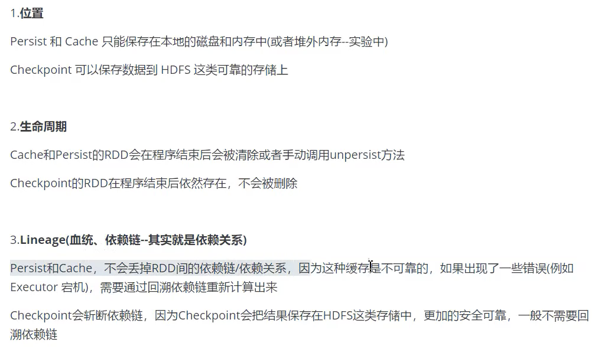
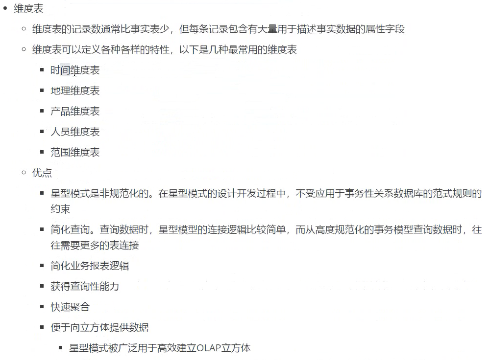
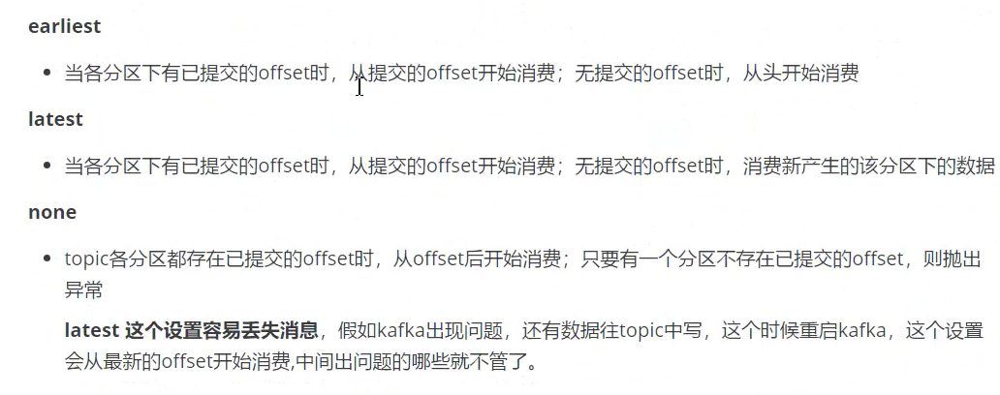

[TOC]

# 1. 实时计算网站访问ip

题目描述：可以得到网站的访问记录，每条记录有userIP,设计一个程序，要随时计算出过去5分钟内访问次数最多的1000个ip


# 2.自定义UDF/UDTF

步骤，例子

## 2.1 自定义UDF

1. 继承GenericUDF类
2. 实现initialize方法
3. 实现evaluate方法

## 2.2 自定义UDTF

1. 继承GenericUDTF
2. 实现initialize方法
3. 实现process方法


# 3. 如何确定计算数据的准确性

1. 参考历史数据

2. 样本数据检测

   每隔一段时间往线上的真实数据中注入测试数据，统计计算结果中的样本数据，然后和实际构造的测试数据进行数量以及各式的比对

# 4. 建立数仓的目的

为企业提供一个决策分析的工具，帮助决策人员更好的制定企业策略。


# 5. 自定义拦截器步骤

1. 实现Interceptor接口
2. 实现intercept方法
3. 实现Interceptor.Builder静态内部类


# 6. 框架版本

1. Hadoop

   2.7.2

2. Flume

   1.7.0

3. Kafka

   0.11.0.2

4. Kafka Manager

   1.3.3.22

5. Hive

   1.2.1

6. Sqoop

   1.4.6

7. MySQL

   5.6.24

8. Azkaban

   2.5.0

9. Java

   1.8

10. Zookeeper

    3.4.10

11. Presto

    0.189


# 7. spark的版本

3.0.0


# 8. Spark Streaming 对接kafka数据源

DirectAPI：是由计算的 Executor 来主动消费 Kafka 的数据，速度由自身控制。

使用DirectAPI

**Kafka 0-10 Direct** **模式**

1. 导入依赖

   ```xml
   <dependency>
   <groupId>org.apache.spark</groupId>
   <artifactId>spark-streaming-kafka-0-10_2.12</artifactId>
   <version>3.0.0</version>
   </dependency>
   <dependency>
   <groupId>com.fasterxml.jackson.core</groupId>
   <artifactId>jackson-core</artifactId>
   <version>2.10.1</version>
   </dependency>
   ```

   

2. 编写代码

   ```scala
   import org.apache.kafka.clients.consumer.{ConsumerConfig, ConsumerRecord}
   import org.apache.spark.SparkConf
   import org.apache.spark.streaming.dstream.{DStream, InputDStream}
   import org.apache.spark.streaming.kafka010.{ConsumerStrategies, KafkaUtils, 
   LocationStrategies}
   import org.apache.spark.streaming.{Seconds, StreamingContext}
   object DirectAPI {
   def main(args: Array[String]): Unit = {
   //1.创建 SparkConf
   val sparkConf: SparkConf = new 
   SparkConf().setAppName("ReceiverWordCount").setMaster("local[*]")
   //2.创建 StreamingContext
   val ssc = new StreamingContext(sparkConf, Seconds(3))
   //3.定义 Kafka 参数
   val kafkaPara: Map[String, Object] = Map[String, Object](
   ConsumerConfig.BOOTSTRAP_SERVERS_CONFIG -> 
   "linux1:9092,linux2:9092,linux3:9092",
   ConsumerConfig.GROUP_ID_CONFIG -> "atguigu",
   "key.deserializer" -> 
   "org.apache.kafka.common.serialization.StringDeserializer",
   "value.deserializer" -> 
   "org.apache.kafka.common.serialization.StringDeserializer"
   )
   //4.读取 Kafka 数据创建 DStream
   val kafkaDStream: InputDStream[ConsumerRecord[String, String]] = 
   KafkaUtils.createDirectStream[String, String](ssc,
   LocationStrategies.PreferConsistent,
   ConsumerStrategies.Subscribe[String, String](Set("atguigu"), kafkaPara))
   //5.将每条消息的 KV 取出
   val valueDStream: DStream[String] = kafkaDStream.map(record => record.value())
   //6.计算 WordCount
   valueDStream.flatMap(_.split(" "))
   .map((_, 1))
   .reduceByKey(_ + _)
   .print()
   //7.开启任务
   ssc.start()
   ssc.awaitTermination()
   } }
   ```


# 9. kafka消费过的消息如何再消费

重置redis的消费位移


# 10. redis版本

4.0.9


# 11. 数据倾斜解决方案

spark方面的数据倾斜解决方案：

1. 聚合原数据
2. 过滤导致倾斜的key
3. 提高shuffle操作中reduce并行度
4. 使用随机key实现双重聚合
5. 将reduce join转换为map join
6. sample采样对倾斜key单独进行join
7. 使用随机数以及扩容进行join

# 12. MR和Spark的shuffle的区别

|                            | MapReduce                                             | **Spark**                                                    |
| -------------------------- | ----------------------------------------------------- | ------------------------------------------------------------ |
| collect                    | 在内存中构造了一块数据结构用于map输出**的**缓冲       | 没有在内存中构造一块数据结构用于map输出**的**缓冲，而是直接把输出写到磁盘文件 |
| sort                       | map输出**的**数据有排序                               | map输出**的**数据没有排序                                    |
| merge                      | 对磁盘上**的**多个spill文件最后进行合并成一个输出文件 | 在map端没有merge过程，在输出时直接是对应一个reduce**的**数据写到一个文件中，这些文件同时存在并发写，最后不需要合并成一个 |
| copy框架                   | jetty                                                 | netty或者直接socket流                                        |
| 对于本节点上**的**文件     | 仍然是通过网络框架拖取数据                            | 不通过网络框架，对于在本节点上**的**map输出文件，采用本地读取**的**方式 |
| copy过来**的**数据存放位置 | 先放在内存，内存放不下时写到磁盘                      | 一种方式全部放在内存；另一种方式先放在内存                   |
| merge sort                 | 最后会对磁盘文件**和**内存中**的**数据进行合并排序    | 对于采用另一种方式时也会有合并排序**的**过程                 |


# 13. MapReduce环形缓冲区

环形缓冲区怎么设置，最大能设置多少？

mapreduce.task.io.sort.mb:排序文件时需要使用的缓冲内存总量，默认100

mapreduce.map.sort.spill.percent：阈值，当内存达到80%的io.sort.mb，则写入到文件。


# 14. redis分布式锁怎么实现

## Redlock算法

在Redis的分布式环境中，我们假设有N个Redis master。这些节点完全互相独立，不存在主从复制或者其他集群协调机制。之前我们已经描述了在Redis单实例下怎么安全地获取和释放锁。我们确保将在每（N)个实例上使用此方法获取和释放锁。在这个样例中，我们假设有5个Redis master节点，这是一个比较合理的设置，所以我们需要在5台机器上面或者5台虚拟机上面运行这些实例，这样保证他们不会同时都宕掉。

为了取到锁，客户端应该执行以下操作:

1. 获取当前Unix时间，以毫秒为单位。
2. 依次尝试从N个实例，使用相同的key和随机值获取锁。在步骤2，当向Redis设置锁时,客户端应该设置一个网络连接和响应超时时间，这个超时时间应该小于锁的失效时间。例如你的锁自动失效时间为10秒，则超时时间应该在5-50毫秒之间。这样可以避免服务器端Redis已经挂掉的情况下，客户端还在死死地等待响应结果。如果服务器端没有在规定时间内响应，客户端应该尽快尝试另外一个Redis实例。
3. 客户端使用当前时间减去开始获取锁时间（步骤1记录的时间）就得到获取锁使用的时间。当且仅当从大多数（这里是3个节点）的Redis节点都取到锁，并且使用的时间小于锁失效时间时，锁才算获取成功。
4. 如果取到了锁，key的真正有效时间等于有效时间减去获取锁所使用的时间（步骤3计算的结果）。
5. 如果因为某些原因，获取锁失败（*没有*在至少N/2+1个Redis实例取到锁或者取锁时间已经超过了有效时间），客户端应该在所有的Redis实例上进行解锁（即便某些Redis实例根本就没有加锁成功）。


# 15. RDD、DataFrame、DataSet比较

##### Spark版本

- RDD – 自Spark 1.0起
- DataFrame – 自Spark 1.3起
- DataSet – 自Spark 1.6起

##### 数据表示形式

- RDD
  RDD是分布在集群中许多机器上的数据元素的分布式集合。 RDD是一组表示数据的Java或Scala对象。
- DataFrame
  DataFrame是命名列构成的分布式数据集合。 它在概念上类似于关系数据库中的表。
- Dataset
  它是DataFrame API的扩展，提供RDD API的类型安全，面向对象的编程接口以及Catalyst查询优化器的性能优势和DataFrame API的堆外存储机制的功能。

##### 数据格式

- RDD
  它可以轻松有效地处理结构化和非结构化的数据。 和Dataframe和DataSet一样，RDD不会推断出所获取的数据的结构类型，需要用户来指定它。
- DataFrame
  仅适用于结构化和半结构化数据。 它的数据以命名列的形式组织起来。
- DataSet
  它也可以有效地处理结构化和非结构化数据。 它表示行(row)的JVM对象或行对象集合形式的数据。 它通过编码器以表格形式(tabular forms)表示。

##### 编译时类型安全

- RDD
  RDD提供了一种熟悉的面向对象编程风格，具有编译时类型安全性。
- DataFrame
  如果您尝试访问表中不存在的列，则持编译错误。 它仅在运行时检测属性错误。
- DataSet
  DataSet可以在编译时检查类型, 它提供编译时类型安全性。
  [TO-DO 什么是编译时的类型安全]

##### 序列化

- RDD
  每当Spark需要在集群内分发数据或将数据写入磁盘时，它就会使用Java序列化。序列化单个Java和Scala对象的开销很昂贵，并且需要在节点之间发送数据和结构。
- DataFrame
  Spark DataFrame可以将数据序列化为二进制格式的堆外存储（在内存中），然后直接在此堆内存上执行许多转换。无需使用java序列化来编码数据。它提供了一个Tungsten物理执行后端，来管理内存并动态生成字节码以进行表达式评估。
- DataSet
  在序列化数据时，Spark中的数据集API具有编码器的概念，该编码器处理JVM对象与表格表示之间的转换。它使用spark内部Tungsten二进制格式存储表格表示。数据集允许对序列化数据执行操作并改善内存使用。它允许按需访问单个属性，而不会消灭整个对象。

##### 垃圾回收

- RDD
  创建和销毁单个对象会导致垃圾回收。
- DataFrame
  避免在为数据集中的每一行构造单个对象时引起的垃圾回收。
- DataSet
  因为序列化是通过Tungsten进行的，它使用了off heap数据序列化，不需要垃圾回收器来摧毁对象

##### 效率/内存使用

- RDD
  在java和scala对象上单独执行序列化时，效率会降低，这需要花费大量时间。
- DataFrame
  使用off heap内存进行序列化可以减少开销。 它动态生成字节代码，以便可以对该序列化数据执行许多操作。 无需对小型操作进行反序列化。
- DataSet
  它允许对序列化数据执行操作并改善内存使用。 因此，它可以允许按需访问单个属性，而无需反序列化整个对象。

##### 编程语言支持

- RDD
  RDD提供Java，Scala，Python和R语言的API。 因此，此功能为开发人员提供了灵活性。
- DataFrame
  DataFrame同样也提供Java，Scala，Python和R语言的API
- DataSet
  Dataset 的一些API目前仅支持Scala和Java，对Python和R语言的API在陆续开发中

##### 聚合操作(Aggregation)

- RDD
  RDD API执行简单的分组和聚合操作的速度较慢。
- DataFrame
  DataFrame API非常易于使用。 探索性分析更快，在大型数据集上创建汇总统计数据。
- DataSet
  在Dataset中，对大量数据集执行聚合操作的速度更快。


# 16. Yarn的组件以及功能

ResourceManager/NodeManager/ApplicationMaster/Container


# 17. spark中一个executor给多大内存

8G


# 18. spark几种部署模式以及区别

local模式

standalone模式

Yarn模式

K8S & Mesos模式


# 19. Yarn-client和Yarn-cluster

Yarn-client一般用于测试，Yarn-cluster一般用于生产环境

两者的区别主要在于Driver的运行位置，yarn-client的driver运行在客户端本地，yarn-cluster的Driver运行的Yarn集群中


# 20. 对Hive的理解

Hive是基于Hadoop的一个数据仓库工具，可以将结构化的数据文件映射为一张表，并提供类SQL查询功能，本质是将HQL转化成MapReduce程序


# 21. hive和数据库的区别

1. 数据存储位置
2. 数据更新
3. 索引
4. 执行
5. 扩展性


# 22. hive的优化

## 22.1 大表join大表

空key过滤、空key转换

## 22.2 慎用count(distinct)

改成用先group by 再count

## 22.3 列裁剪

只查询需要的列

## 22.4 分区裁剪

查询过程中减少不必要的分区

## 22.5 避免数据类型不同进行关联产生数据倾斜问题

## 22.6 压缩


## 22.7 JVM重用

Hadoop是通过使用派生JVM来执行map和reduce任务的，这时JVM的启动过程可能会造成相当大的开销，尤其是执行的job包含成百上千个task的情况。JVM重用可以使得JVM实例在一个job中使用。


## 22.8 推测执行

Hadoop推测执行可以触发执行一些重复的任务


# 23. 小文件的解决方案

从小文件产生的途径就可以从源头上控制小文件数量，方法如下：

- 使用Sequencefile作为表存储格式，不要用textfile，在一定程度上可以减少小文件；
- 减少reduce的数量（可以使用参数进行控制）；
- 少用动态分区，用时记得按distribute by分区；

对于已有的小文件，我们可以通过以下几种方案解决：

- 使用hadoop archive命令把小文件进行归档；

- 重建表，建表时减少reduce数量；

- 通过参数进行调节，设置map/reduce端的相关参数

  


# 24. 手写spark wordcount

## 24.1 spark版本(scala)

```scala
object WordCount {
  def main(args: Array[String]): Unit = {
    val sparkConf = new SparkConf().setMaster("spark://Hadoop02:7077").setAppName("WordCount")
    val sc = new SparkContext(sparkConf)
    val rdd = sc.makeRDD(List("Hello Scala", "Hello Spark"))
    val words = rdd.flatMap(_.split(" "))
    val wordOne = words.map((_, 1))
    val wordCnt = wordOne.reduceByKey(_ + _)
    println(wordCnt)
    sc.stop()
  }
```


## 24.2 Mapreduce版本


```java
package com.atguigu.mapreduce;
import java.io.IOException;
import org.apache.hadoop.io.IntWritable;
import org.apache.hadoop.io.LongWritable;
import org.apache.hadoop.io.Text;
import org.apache.hadoop.mapreduce.Mapper;

public class WordcountMapper extends Mapper<LongWritable, Text, Text, IntWritable>{
	
	Text k = new Text();
	IntWritable v = new IntWritable(1);
	
	@Override
	protected void map(LongWritable key, Text value, Context context)	throws IOException, InterruptedException {
		
		// 1 获取一行
		String line = value.toString();
		
		// 2 切割
		String[] words = line.split(" ");
		
		// 3 输出
		for (String word : words) {
			
			k.set(word);
			context.write(k, v);
		}
	}
}
```


```java
package com.atguigu.mapreduce.wordcount;
import java.io.IOException;
import org.apache.hadoop.io.IntWritable;
import org.apache.hadoop.io.Text;
import org.apache.hadoop.mapreduce.Reducer;

public class WordcountReducer extends Reducer<Text, IntWritable, Text, IntWritable>{
  int sum;
IntWritable v = new IntWritable();

	@Override
	protected void reduce(Text key, Iterable<IntWritable> values,Context context) throws IOException, InterruptedException {
		
		// 1 累加求和
		sum = 0;
		for (IntWritable count : values) {
			sum += count.get();
		}
		
		// 2 输出
       v.set(sum);
		context.write(key,v);
	}
}
```


```java
package com.atguigu.mapreduce.wordcount;
import java.io.IOException;
import org.apache.hadoop.conf.Configuration;
import org.apache.hadoop.fs.Path;
import org.apache.hadoop.io.IntWritable;
import org.apache.hadoop.io.Text;
import org.apache.hadoop.mapreduce.Job;
import org.apache.hadoop.mapreduce.lib.input.FileInputFormat;
import org.apache.hadoop.mapreduce.lib.output.FileOutputFormat;

public class WordcountDriver {

	public static void main(String[] args) throws IOException, ClassNotFoundException, InterruptedException {

		// 1 获取配置信息以及封装任务
		Configuration configuration = new Configuration();
		Job job = Job.getInstance(configuration);

		// 2 设置jar加载路径
		job.setJarByClass(WordcountDriver.class);

		// 3 设置map和reduce类
		job.setMapperClass(WordcountMapper.class);
		job.setReducerClass(WordcountReducer.class);

		// 4 设置map输出
		job.setMapOutputKeyClass(Text.class);
		job.setMapOutputValueClass(IntWritable.class);

		// 5 设置最终输出kv类型
		job.setOutputKeyClass(Text.class);
		job.setOutputValueClass(IntWritable.class);
    // 6 设置输入和输出路径
		FileInputFormat.setInputPaths(job, new Path(args[0]));
		FileOutputFormat.setOutputPath(job, new Path(args[1]));

		// 7 提交
		boolean result = job.waitForCompletion(true);

		System.exit(result ? 0 : 1);
	}
}
```


# 25. 整个业务数据流向

## 25.1 离线


## 25.2 实时


# 26. 大表 join 大表 发生OOM的解决方案

现有两张大表所有字段都得保留不能再过滤了 join 操作就发生 oom 怎么解决


如果是reduce阶段发生OOM,解决办法有以下三种：

## 26.1 增加reduce个数

例如	set mapred.reduce.tasks=300


## 26.2 使用map join代替common join

例如 set hive.auto.convert.join = true


## 26.3 参数设置

set hive.optimize.skewjoin = true


# 27. Hadoop安全模式作用


为了检查各个DataNode上数据块的有效性


# 28. 机架感知原理 配置

副本存放策略：

1. 第一个副本放在client所在的节点上，如果client在集群外，随机选一个
2. 第二个副本和第一个副本位于相同机架，随机节点
3. 第三个副本位于不同机架，随机节点

默认情况下机架感知是没有被启用的，所以，在通常情况下，hadoop集群的HDFS在选机器的时候，是随机选择的

要将hadoop机架感知的功能启用，在namenode所在机器的core-site.xml配置文件中配置一个选项：

```xml
<property>
  <name>net.topology.script.file.name</name>
  <value>/path/to/RackAware.py</value>
</property
```

这个配置选项的value指定为一个可执行程序，通常为一个脚本，该脚本接受一个参数，输出一个值。接受的参数通常为某台datanode机器的ip地址，而输出的值通常为该ip地址对应的datanode所在的rack，例如”/rack1”。Namenode启动时，会判断该配置选项是否为空，如果非空，则表示已经用机架感知的配置，此时namenode会根据配置寻找该脚本，并在接收到每一个datanode的heartbeat时，将该datanode的ip地址作为参数传给该脚本运行，并将得到的输出作为该datanode所属的机架，保存到内存的一个map中


# 29. MapReduce执行过程中常见问题

## 29.1 权限问题

在本地将作业写入远程hdfs文件系统的时候是使用的本地用户身份去操作HDFS,由于此用户对hadoop目录没有的操作权限，会报`Permission denied`

两种解决方案：

1. 修改对应目录的权限为777
2. 直接在hdfs的配置文件中，将dfs.permission修改为false

## 29.2 实现自定义的分组器

如果extends WritableComparator 实现自定义的分组器,在无参构造中一定要添加super

```java
public NaturalKeyGroupingComparator() {
    /**
     * 一定要写 super(CompositeKey.class, true); 否则报下面的错 Error:
     * java.lang.NullPointerException at
     * org.apache.hadoop.io.WritableComparator.compare(WritableComparator.java:157)
     * 
     */
    super(CompositeKey.class, true);
}
```

## 29.3 自定义OutputFormat

自定义OutputFormat时，注意在recordWriter方法必须关闭流资源，否则输出的文件内容中数据为空

## 29.4 Mapper

Mapper中第一个输入的参数必须是LongWritable或者NullWritable,不可以是IntWritable 否则会报类型转换异常

还有如果map输出的key没有排序也会报类型转换异常

## 29.5 序列化反序列化顺序要一致

如果顺序不一致会报`java.lang.RuntimeException: java.io.EOFException`

## 29.6 jdk版本不一致导致的问题

报错：`Exception in thread "main" java.lang.UnsupportedClassVersionError`

原因是在Windows下使用jdk1.7编译的jar包，上传到服务器上，服务器上的jdk版本是1.8

## 29.7 Illegal partition

报错`java.lang.Exception: java.io.IOException: Illegal partition for 13926435656 (4)`

说明partition和reducetask个数没有对应上，需要调整reducetask的个数

## 29.8 是否执行分区过程

如果分区数不是1，但是reducetask是1，是不执行分区过程的。因为在maptask的源码中，执行分区的前提是先判断reduceNum个数是否大于1，不大于1肯定不执行


## 29.9 输出路径已经存在

MapReduce的目标输出路径已经存在，必须先删掉目标路径才可以


# 30. 介绍一下Hadoop

## 30.1 广义

广义上来讲Hadoop是指Hadoop生态圈

## 30.2 狭义

狭义上Hadoop是一个由Apache基金会所开发的分布式系统基础架构，主要用来解决海量数据的存储和分析计算问题

4个优势：

高可靠性:底层维护多个副本，即使某个计算节点或者存储出现故障也不会导致数据丢失

高扩展性：在集群间分配任务数据，可方便地扩展数以千计的节点

高效性：在MapReduce的思想下，Hadoop是并行工作的，以加快任务处理速度

高容错性：能够自动将失败的任务重新分配


Hadoop 2.0 主要由Mapreduce、Yarn、HDFS等组成

HDFS由NameNode、DataNode、Secondary NameNode组成

Yarn主要由ResourceManager、NodeManager、ApplicationMaster、Container组成

Hadoop的运行模式主要有本地运行模式、伪分布式模式、完全分布式模式

核心配置文件主要有hadoop-env.sh、core-site.xml、hdfs-site.xml、mapred-sit.xml、yarn-site.xml


# 31. Hadoop扩容

有两种扩容方式：横向扩容、纵向扩容

## 31.1 横向扩容(增加DataNode节点数)

①、克隆之前配置好的从属机，修改静态ip地址，在namenode机上配置hosts文件，将新的从属机IP地址映射加入进去

②、因为**hadoop**支持热部署，可以在已经启动的情况下在slaves文件中加入**hadoop**03，然后在从属机上手动启动datanode进程，namenode会自动监听slaves中每个从属机的进程状态，启动之后会自动加入到livenodes中去。也可以在服务启动之前就加入到slaves中去，启动服务时会自动启动所有从属机的datanode进程

## 31.2 纵向扩容(增加DataNode的存储容量)

给datanode虚拟机增加一块硬盘，重启虚拟机以加载硬盘


# 32. 动态缩容


停止退役的节点上的进程

进行负载均衡


# 33. MapReduce优化

参数优化


# 34. MapReduce程序在Yarn上的执行流程


1. 用户向 YARN 中提交应用程序，其中包括 MRAppMaster 程序，启动 MRAppMaster 的命令， 用户程序等。

2. ResourceManager 为该程序分配第一个 Container，并与对应的 NodeManager 通讯，要求它在这个 Container 中启动应用程序 MRAppMaster。

3. MRAppMaster 首先向 ResourceManager 注册，这样用户可以直接通过 ResourceManager 查看应用程序的运行状态，然后将为各个任务申请资源，并监控它的运行状态，直到运行结束，重复 4 到 7 的步骤。

4. MRAppMaster 采用轮询的方式通过 RPC 协议向 ResourceManager 申请和领取资源。

5. 一旦 MRAppMaster 申请到资源后，便与对应的 NodeManager 通讯，要求它启动任务。

6. NodeManager 为任务设置好运行环境（包括环境变量、JAR 包、二进制程序等）后，将任务启动命令写到一个脚本中，并通过运行该脚本启动任务。

7. 各个任务通过某个 RPC 协议向 MRAppMaster 汇报自己的状态和进度，以让 MRAppMaster 随时掌握各个任务的运行状态，从而可以在任务失败的时候重新启动任务。

8. 应用程序运行完成后，MRAppMaster 向 ResourceManager 注销并关闭自己。


# 35. 介绍一下Spark

Spark是一种基于内存的快速、通用、可扩展的大数据分析计算引擎

Spark的核心模块主要有Spark Core、Spark SQL、Spark Streaming、Spark MLlib、 Spark GraphX


# 36. Spark与Hadoop的区别

## 36.1 数据通信

Spark和Hadoop的根本差异是多个作业之间的数据通信问题：Spark多个作业之间数据通信是基于内存，而Hadoop是基于磁盘

## 36.2 任务启动时间

Spark Task的启动时间快。Spark采用fork线程的方式，Hadoop采用创建新的进程的方式

## 36.3 磁盘IO

Spark 只有在shuffle的时候将数据写入磁盘，Hadoop中多个MR作业之间的数据交互都要依赖于磁盘交互

## 36.4 缓存机制

Spark的缓存机制比HDFS的缓存机制高效

## 36.5 模型丰富程度

Spark的核心技术是RDD,提供了比MapReduce更丰富的模型，可以快速在内存中对数据集进行多次迭代。


# 37. java初始化顺序

静态属性初始化
静态方法块初始化
普通属性初始化
普通方法块初始化
构造函数初始化


# 38. 持久化和Checkpoint的区别




# 39. spark任务提交后执行流程


# 40. spark的shuffle

spark 1.2之前是hash shuffle 

spark 1.2 及以后是sort shuffle


HashShuffleManager有一个非常严重的弊端就是会产生大量的中间磁盘文件，进而由大量的磁盘IO影响了性能

SortShuffleManager对HashShuffleManger的改进主要是每个task在进行shuffle操作时，虽然也会产生较多的磁盘文件，但是最后会将所有的临时文件merge成一个磁盘文件，因为每个task就只有一个磁盘文件，在下一个stage的shuffle read task拉取自己的数据时，只要根据索引读取每个磁盘文件中的部分数据即可。	


SortShuffle的bypass机制需要掌握


# 41. zookeeper的选主机制


# 42. spark常见问题


# 43. 数据仓库分层


# 44. 数据仓库为什么要分层


# 45. 维度模型的特点


# 46. 维度建模过程


# 47. 星型模型





# 48. 雪花模型


# 49. ETL

## 49.1 介绍


## 49.2 工作内容


## 49.3 工具


# 50. redis

## 50.1 redis介绍


## 50.2 数据类型

### 50.2.1 string字符串


## 50.3 持久化


### 50.3.1 rdb


### 50.3.2 aof


## 50.4 缓存穿透

### 50.4.1 什么是缓存穿透

用户请求了一条缓存中没有并且数据库中也没有的数据


### 50.4.2 如何解决缓存穿透


## 50.5 缓存雪崩


### 50.5.1 场景


### 50.3.2 如何解决缓存雪崩


## 50.6 redis的key到期之后是立马进行删除吗

不会立即删除，因为删除key时肯定是主服务来删除(因为redis是单线程的)，所以当他在执行删除指令的时候，他就无法进行其他的操作，立即删除会影响性能；所以呢，他不会立即进行删除；

删除机制：
(1)定期删除：redis每隔一段时间就会去查看reids，设置了过期时间的key，会在100ms的间隔内默认查看3个key。
(2)惰性删除：如果当你去查询一个已经过了生存时间的key时，redis会先查看当前key的生存时间，如果你查询的key已经过了生存时间，redis会立即删除，并且返回给用户一个null值；也就是当你去查询的时候，redis去进行删除；

注意：当然无论redis删没删掉这个key外界都是查不到的；只是没删的话还占着内存而已


# 51. kafka

## 51.1 介绍


## 51.2 相比于其他消息队列的优势


## 51.3 一个消费者组里的消费者数大于分区数的情况

如果一个消费者组里的消费者数大于分区数，比如说消费者组里的消费者数量为4，分区数为3，那么会有一个消费者空闲。


## 51.4 术语名词


## 51.5 kafka架构


## 51.6 kafka能做到消费的有序性吗？

一个主题(topic)下面有一个分区(partition)即可

为什么topic下多个分区不能保证有序

生产者生产数据到broker的多个分区，每个分区的数据是相对有序的，但整体的数据就无序了。因为消费者在消费的时候是一个分区一个分区进行消费的，所以不能保证全局有序


## 51.7 分区与消费者组之间的关系

- 消费组：由一个或多个消费者组成，同一个组中的消费者对于同一条消息只消费一次
- 某一个主题下的分区数，对于消费组来说，应该小于等于该主题下的分区数


## 51.8 生产者分区策略


## 51.9 数据丢失


## 51.10 数据重复


## 51.11 kafka中数据查找过程


## 51.12 kafka.auto.offset.reset值详解



latest是默认


# 52. ES

## 52.1 介绍


# 53. 介绍一下Kylin

Kylin是一个开源的分布式分析引擎，提供Hadoop/Spark之上的SQL查询接口以及多维分析(OLAP)能力以支持超大规模数据，它能在亚秒内查询巨大的hive表

主要由REST  Server、查询引擎、路由器、元数据管理工具、任务引擎

主要特点：

1. 标准的SQL接口
2. 支持超大数据集
3. 亚秒级响应
4. 可伸缩性和高吞吐率


# 54. zookeeper选举机制

有3种选举机制：

- LeaderElection
- AuthFastLeaderElection
- FastLeaderElection(最新默认)

选举流程如下：

目前有5台服务器，每台服务器均没有数据，它们的编号分别是1,2,3,4,5,按编号依次启动，它们的选择举过程如下：

- 服务器1启动，给自己投票，然后发投票信息，由于其它机器还没有启动所以它收不到反馈信息，服务器1的状态一直属于Looking(选举状态)。
- 服务器2启动，给自己投票，同时与之前启动的服务器1交换结果，由于服务器2的编号大所以服务器2胜出，但此时投票数没有大于半数，所以两个服务器的状态依然是LOOKING。
- 服务器3启动，给自己投票，同时与之前启动的服务器1,2交换信息，由于服务器3的编号最大所以服务器3胜出，此时投票数正好大于半数，所以服务器3成为领导者，服务器1,2成为小弟。
- 服务器4启动，给自己投票，同时与之前启动的服务器1,2,3交换信息，尽管服务器4的编号大，但之前服务器3已经胜出，所以服务器4只能成为小弟。
- 服务器5启动，后面的逻辑同服务器4成为小弟。


Server状态：选举状态

- LOOKING，竞选状态。
- FOLLOWING，随从状态，同步leader状态，参与投票。
- OBSERVING，观察状态,同步leader状态，不参与投票。
- LEADING，领导者状态。


# 55. 数仓建模过程


DWD层需构建维度模型，一般采用星型模型，呈现的状态一般为星座模型。

维度建模一般按照以下四个步骤：

选择业务过程→声明粒度→确认维度→确认事实

（1）选择业务过程

在业务系统中，挑选我们感兴趣的业务线，比如下单业务，支付业务，退款业务，物流业务，一条业务线对应一张事实表。

如果是中小公司，尽量把所有业务过程都选择。

如果是大公司（1000多张表），选择和需求相关的业务线。

（2）声明粒度

数据粒度指数据仓库的数据中保存数据的细化程度或综合程度的级别。

声明粒度意味着精确定义事实表中的一行数据表示什么，应该尽可能选择***\*最小粒度\****，以此来应各种各样的需求。

典型的粒度声明如下：

订单事实表中一行数据表示的是一个订单中的一个商品项。

支付事实表中一行数据表示的是一个支付记录。

（3）确定维度

维度的主要作用是描述业务事实，主要表示的是“谁，何处，何时”等信息。

确定维度的原则是：后续需求中是否要分析相关维度的指标。例如，需要统计，什么时间下的订单多，哪个地区下的订单多，哪个用户下的订单多。需要确定的维度就包括：时间维度、地区维度、用户维度。

（4）确定事实

此处的“事实”一词，指的是业务中的度量值（次数、个数、件数、金额，可以进行累加），例如订单金额、下单次数等。

在DWD层，以***\*业务过程\****为建模驱动，基于每个具体业务过程的特点，构建***\*最细粒度\****的明细层事实表。事实表可做适当的宽表化处理。

事实表和维度表的关联比较灵活，但是为了应对更复杂的业务需求，可以将能关联上的表尽量关联上。如何判断是否能够关联上呢？在业务表关系图中，只要两张表能通过中间表能够关联上，就说明能关联上。


