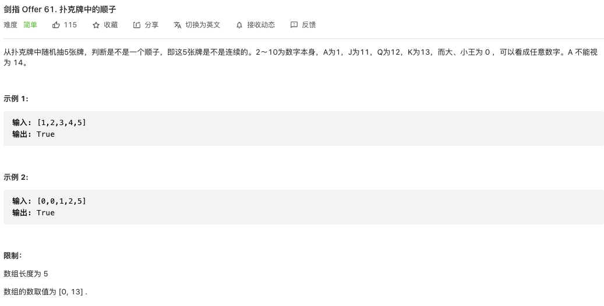
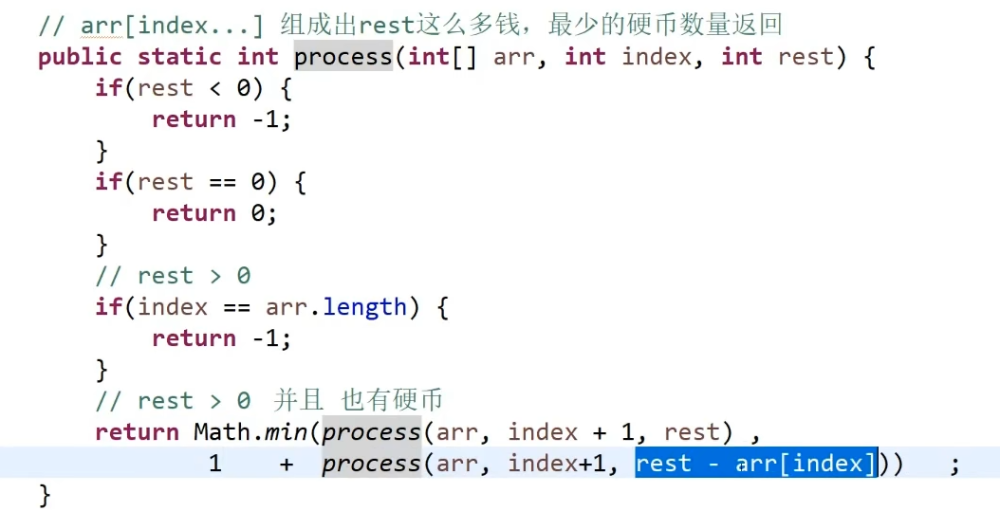
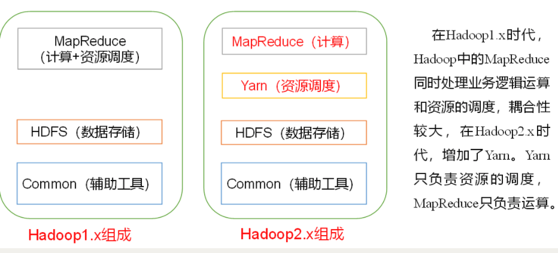

[TOC]

# 1. Flink

## 1.1 Flink的Exactly Once语义怎么保证

注意这个问题的本意是要问Flink内部的Exactly Once语义是怎么保证的，这个时候只需要回答检查点即可。


如果问的是到端的一致性是如何保证的，则回答下面的：

分为3方面

1. 内部保证

   Checkpoint(检查点)

2. source端保证

   可重设数据的读取位置

3. sink端保证

   从故障恢复时，数据不会重复写入外部系统

## 1.2 Flink的checkpoint流程都是同步checkpoint吗？

不是

首先回答checkpoint的流程如下:

Checkpoint由JM的Checkpoint Coordinator发起

**第一步**，Checkpoint Coordinator 向所有 source 节点 trigger Checkpoint；

**第二步**，source 节点向下游广播 barrier，下游的 task 只有收到所有 input 的 barrier 才会执行相应的 Checkpoint

**第三步**，当 task 完成 state 备份后，会将备份数据的地址（state handle）通知给 Checkpoint coordinator

这里分为同步和异步（如果开启的话）两个阶段:

1.同步阶段：task执行状态快照，并写入外部存储系统（根据状态后端的选择不同有所区别）
执行快照的过程：
a.对state做深拷贝。
b.将写操作封装在异步的FutureTask中
FutureTask的作用包括：1）打开输入流2）写入状态的元数据信息3）写入状态4）关闭输入流
2.异步阶段：
1）执行同步阶段创建的FutureTask
2）向Checkpoint Coordinator发送ACK响应

**第四步**，下游的 sink 节点收集齐上游两个 input 的 barrier 之后，会执行本地快照

**同样的**，sink 节点在完成自己的 Checkpoint 之后，会将 state handle 返回通知 Coordinator

**最后**，当 Checkpoint coordinator 收集齐所有 task 的 state handle，就认为这一次的 Checkpoint 全局完成了，向持久化存储中再备份一个 Checkpoint meta 文件


## 1.3 Flink任务故障重启流程

重启流程没有查到，只查到了重启策略有以下3种:

+ #### 固定延迟重启策略（Fixed Delay Restart Strategy）

+ #### 故障率重启策略（Failure Rate Restart Strategy）

+ #### 无重启战略（No Restart Strategy）

子问题：

**full restart和region restart的区别**

full restart 是重启所有的任务，region start是重启单个分区内的任务


## 1.4 Flink中的Window

 window 是一种切割无限数据为有限块进行处理的手段

Window 可以分成两类

+ CountWindow：按照指定的数据条数生成一个 Window，与时间无关
+ TimeWindow：按照时间生成 Window

对于 TimeWindow，可以根据窗口实现原理的不同分成三类：滚动窗口（Tumbling Window）、滑动窗口（Sliding Window）和会话窗口（Session Window）


# 2.算法(代码 )

## 2.1 实现一个Immutable stack

https://blog.csdn.net/shoulinjun/article/details/31760103

这个再查下

## 2.2 根据二叉树的先序和中序遍历数组求后序遍历数组

```java
package net.codeshow;

/**
 * @Description 二叉树，根据中序与先序数组，求后序遍历的数组 不建树的情况下
 * @Author eric
 * @Version V1.0.0
 * @Date 2021/4/5
 */
public class T2_Arr_HouXu {
    public int[] findOrder(int[] pre, int[] in) {
        int n = pre.length;
        int[] post = new int[n];

        findOrderSub(pre, 0, n - 1, in, 0, n - 1, post, 0, n - 1);
        return post;

    }

    private void findOrderSub(int[] pre, int preLo, int preHi, int[] in, int inLo, int inHi, int[] post, int postLo, int postHi) {
        if (preLo > preHi) return;
        int root = pre[preLo];
        int k = inLo;
        while (k <= inHi) {
            if (in[k] == root) {
                break;
            }
            k++;
        }
        int numLeft = k - inLo;
        post[postHi] = root;

        findOrderSub(pre, preLo + 1, preLo + numLeft, in, inLo, k - 1, post, postLo, postLo + numLeft - 1);
        findOrderSub(pre, preLo + numLeft + 1, preHi, in, k + 1, postHi, post, postLo + numLeft, postHi - 1);
    }
}
```


## 2.3 扑克牌中的顺子

https://leetcode-cn.com/problems/bu-ke-pai-zhong-de-shun-zi-lcof/




解法1：

```java
class Solution {
    public boolean isStraight(int[] nums) {
        Set<Integer> repeat = new HashSet<>();
        int max = 0, min = 14;
        for(int num : nums) {
            if(num == 0) continue; // 跳过大小王
            max = Math.max(max, num); // 最大牌
            min = Math.min(min, num); // 最小牌
            if(repeat.contains(num)) return false; // 若有重复，提前返回 false
            repeat.add(num); // 添加此牌至 Set
        }
        return max - min < 5; // 最大牌 - 最小牌 < 5 则可构成顺子
    }
}
```

解法2：

```java
class Solution {
    public boolean isStraight(int[] nums) {
        int joker = 0;
        Arrays.sort(nums); // 数组排序
        for(int i = 0; i < 4; i++) {
            if(nums[i] == 0) joker++; // 统计大小王数量
            else if(nums[i] == nums[i + 1]) return false; // 若有重复，提前返回 false
        }
        return nums[4] - nums[joker] < 5; // 最大牌 - 最小牌 < 5 则可构成顺子
    }
}
```


## 2.4 海量数据处理问题

https://blog.csdn.net/v_july_v/article/details/7382693

已看。


## 2.5 快排go实现

```go
func quickSort(arr []int, start, end int) {
    if start < end {
        i, j := start, end
        key := arr[(start+end)/2]
        for i <= j {
            for arr[i] < key {
                i++
            }
            for arr[j] > key {
                j--
            }
            if i <= j {
                arr[i], arr[j] = arr[j], arr[i]
                i++
                j--
            }
        }

        if start < j {
            quickSort(arr, start, j)
        }
        if end > i {
            quickSort(arr, i, end)
        }
    }
}
```


## 2.6 硬币问题

给定几个面值的硬币，要求使用最少的硬币数量组成目标金额




## 2.7 无序数组中位数

```java
package net.codeshow;

import java.util.*;

/**
 * @Description
 * @Author eric
 * @Version V1.0.0
 * @Date 2021/4/6
 */
public class T3_Zhongweishu {
    public static double findMedian(Integer[] arr) {
        int size = arr.length;
        int tmp = 0, len = 0;
        if ((size & 1) == 0) {
            len = size / 2;
        } else {
            len = size / 2 + 1;
        }
        PriorityQueue<Integer> queue = new PriorityQueue<>(len);
        for (Integer i : arr) {
            if (queue.isEmpty() || queue.size() < len) {
                queue.offer(i);
                continue;
            }
            if (i > queue.peek()) {
                tmp = queue.poll();
                queue.offer(i);
            }
        }

        if ((size & 1) != 0) {
            return queue.peek();
        }

        return (queue.peek() + tmp) / 2.0;
    }

    public static void main(String[] args) {
        Integer[] arr = new Integer[]{1, 4, 3, 9, 5, 2};
        double median = findMedian(arr);
        System.out.println(median);
    }
}
```


## 2.8 硬币问题(最少硬币个数)

给定不同面额的硬币 coins 和一个总金额 amount。编写一个函数来计算可以凑成总金额所需的最少的硬币个数。如果没有任何一种硬币组合能组成总金额，返回 -1。

你可以认为每种硬币的数量是无限的。

```java
public class Solution {
    public int coinChange(int[] coins, int amount) {
        int max = amount + 1;
        int[] dp = new int[amount + 1];
        Arrays.fill(dp, max);
        dp[0] = 0;
        for (int i = 1; i <= amount; i++) {
            for (int j = 0; j < coins.length; j++) {
                if (coins[j] <= i) {
                    dp[i] = Math.min(dp[i], dp[i - coins[j]] + 1);
                }
            }
        }
        return dp[amount] > amount ? -1 : dp[amount];
    }
}
```


## 2.9 硬币问题(硬币组合数)

给定不同面额的硬币和一个总金额。写出函数来计算可以凑成总金额的硬币组合数。假设每一种面额的硬币有无限个。 

```java
class Solution {
  public int change(int amount, int[] coins) {
    int[] dp = new int[amount + 1];
    dp[0] = 1;

    for (int coin : coins) {
      for (int x = coin; x < amount + 1; ++x) {
        dp[x] += dp[x - coin];
      }
    }
    return dp[amount];
  }
}
```


# 3.SQL

## 3.1 简历中的项目

项目中的表以及表之间的关系和关联

## 3.2 销售额Top10


常见的大数据sql面试题

https://blog.csdn.net/qq_41106844/article/details/107230501

https://blog.csdn.net/mhaiy24/article/details/102707850


### 3.3 **统计视频观看数** **Top50** **所关联视频的所属类别排序**

```sql
SELECT
t6.category_name,
t6.video_sum,
rank() over(ORDER BY t6.video_sum DESC ) rk
FROM
(
  SELECT
  t5.category_name,
  COUNT(t5.relatedid_id) video_sum
  FROM
  (
      SELECT
      t4.relatedid_id,
      category_name
      FROM
      (
            SELECT 
            t2.relatedid_id ,
            t3.category 
            FROM 
            (
                    SELECT 
                    relatedid_id
                    FROM 
                    (
                        SELECT 
                        videoId, 
                        views,
                        relatedid 
                        FROM 
                        gulivideo_orc
                          ORDER BY
                        views 
                        DESC 
                        LIMIT 50
            )t1
      lateral VIEW explode(t1.relatedid) t1_tmp AS relatedid_id
      )t2 
  JOIN 
  gulivideo_orc t3 
  ON 
  t2.relatedid_id = t3.videoId 
  ) t4 
lateral VIEW explode(t4.category) t4_tmp AS category_name
) t5
GROUP BY
t5.category_name
ORDER BY 
video_sum
DESC 
) t6
```


# 4.数据结构

## 4.1 HashMap的底层结构

https://blog.csdn.net/P_Doraemon/article/details/80353579


# 5. HBase

## 5.1 Hbase查询速度快的原理

https://blog.csdn.net/yue_2018/article/details/90417267


# 6. Zookeeper

## 6.1 Zookeeper的作用

https://blog.csdn.net/nangeali/article/details/81428419

+ 统一命名服务
+ 配置管理
+ 集群管理
+ 共享锁


# 7. Hadoop

## 7.1 HA的实现

https://blog.csdn.net/u010738184/article/details/78270416


## 7.2 HDFS

https://www.cnblogs.com/caiyisen/p/7395843.html


## 7.3 MapReduce

看一下Hadoop笔记 中 MapReduce的笔记


## 7.4 数据倾斜问题的解决

https://www.jianshu.com/p/3635cd26b26a


## 7.5 组件



# 8. 数据仓库

## 8.1 概念

数据仓库，英文名称为Data Warehouse，可简写为[DW](https://baike.baidu.com/item/DW/1264123)或DWH。数据仓库，是为[企业](https://baike.baidu.com/item/企业/707680)所有级别的决策制定过程，提供所有类型数据支持的战略[集合](https://baike.baidu.com/item/集合)。它是单个数据存储，出于分析性报告和决策支持目的而创建。 为需要业务智能的企业，提供指导业务流程改进、监视时间、成本、质量以及控制


# 9. Spark

## 9.1 DAG的生成过程

https://blog.csdn.net/weixin_44036154/article/details/105387304


# 10.


