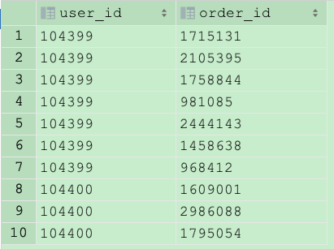
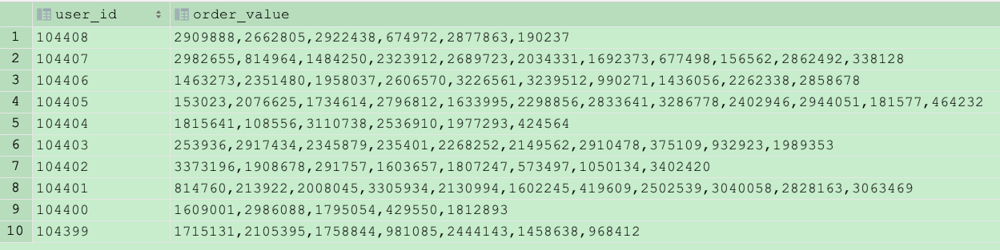

[TOC]

# 1. 行转列，列转行


行转列



```sql
select user_id,
       concat_ws(',', collect_list(order_id)) as order_value

from col_lie
group by user_id
;
```


列转行



```sql
select user_id, order_value, order_id
from lie_col2
         lateral view explode(split(order_value, ',')) tmp as order_id;
```


# 2. flink相关知识

