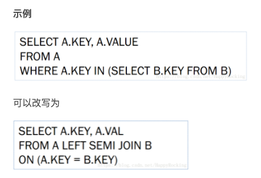

[TOC]

# 1. Order by/sort by/distribute by/cluster by的区别

order by是全局排序

sort by 是每个reduce内部排序

distribute by 可以控制某个特定行到哪个reducer，通常是为了进行后续的聚集操作，distribute by 类似MR中partition,结合sort by 使用。distribute by的分区规则是根据分区字段的hash码与reduce的个数进行模除后，余数相同的分到一个区。hive要求distribute by语句要写在sort by语句之前。

当distribute by和sort by字段相同时，可以使用cluster by方式，cluster by除了具有distribute by的功能外还兼具有sort by的功能。但是排序只能是升序排序，不能指定排序规则为ASC或者DESC 


# 2. 口径不一致

所谓口径就是取数逻辑，口径是统计学中的一种叫法

举个口径不一致的例子：

需求1：统计视频类别热度top10 

需求2：统计各类别视频热度top10


# 3. 有哪些复杂的需求实现


# 4. HQL题目

给定

user_id login_time login_ip要求统计出

user_id first_login_time first_login_ip last_login_time last_login_ip


```sql
select user_name,first_value(login_date)over(partition by user_name order by login_date) as first_login_time,first_value(ip)over(partition by user_name order by login_date) as first_login_ip, last_value(login_date) over(partition by user_name order by login_date) as last_login_time,last_value(ip)over(partition by user_name order by login_date) from login;
```


接着上面

统计距离上次登录时间的时间间隔

user_id login_time login_ip date_sub

```sql
select user_name,
       datediff(to_date(from_unixtime(
               UNIX_TIMESTAMP(lag(login_date, 0) over (partition by user_name order by login_date), 'yyyyMMdd'))),
                to_date(from_unixtime(
                        UNIX_TIMESTAMP(lag(login_date, 1,'19700101') over (partition by user_name order by login_date),
                                       'yyyyMMdd')))) as data_sub
from login;
```


面试官提示 lag lead


总结：

把一个类似`20210101`的字符串转成date格式的步骤：

先通过`UNIX_TIMESTAMP()`函数获取时间戳，然后通过`from_unixtime()`函数以及`to_date()`函数转换成date类型

注意在UNIX_TIMESTAMP()函数中需要指定日期格式


# 5. Hive中reduce的个数怎么设置

```bash
set mapreduce.job.reduces=3;
```

# 6. left semi join

`left semi join`(左半连接)是in/exists子查询的一种更高效的实现




# 7. 数据倾斜的解决方案

## 7.1 Hive ETL对数据进行预处理

经过预处理之后的数据到spark之后就不会出现数据倾斜了，这种方法只是将数据倾斜提前了。

## 7.2 过滤少数导致倾斜的key

## 7.3 提高shuffle操作的并行度

在对RDD执行shuffle算子时，给shuffle算子传入一个参数，比如reduceByKey(1000)，该参数就设置了这个shuffle算子执行时shuffle read task的数量。对于Spark SQL中的shuffle类语句，比如group by、join等，需要设置一个参数，即spark.sql.shuffle.partitions，该参数代表了shuffle read task的并行度，该值默认是200，对于很多场景来说都有点过小

## 7.4 两阶段聚合

先进行局部聚合，然后再进行全局聚合


## 7.5 将reduce join转为map join

当join操作中的两张表中其中一张表或者RDD的数据量比较小的时候适用这种方案


## 7.6 采样倾斜key并分拆join操作

对包含少数几个数据量过大的key的那个RDD，通过sample算子采样出一份样本来，然后统计一下每个key的数量，计算出来数据量最大的是哪几个key。  然后将这几个key对应的数据从原来的RDD中拆分出来，形成一个单独的RDD，并给每个key都打上n以内的随机数作为前缀，而不会导致倾斜的大部分key形成另外一个RDD。 接着将需要join的另一个RDD，也过滤出来那几个倾斜key对应的数据并形成一个单独的RDD，将每条数据膨胀成n条数据，这n条数据都按顺序附加一个0~n的前缀，不会导致倾斜的大部分key也形成另外一个RDD。 再将附加了随机前缀的独立RDD与另一个膨胀n倍的独立RDD进行join，此时就可以将原先相同的key打散成n份，分散到多个task中去进行join了。 而另外两个普通的RDD就照常join即可。 最后将两次join的结果使用union算子合并起来即可，就是最终的join结果


## 7.7 采用随机前缀和扩容RDD进行join


# 8. 外部表和内部表的区别

## 8.1 存储

外部表数据由HDFS管理，内部表由hive自身管理

## 8.2 存储位置

外部表数据存储位置由自己指定，内部表数据存储在`hive.metastore.warehouse.dir`(默认在/usr/hive/warehouse)

## 8.3 创建

创建时外部表被external修饰，内部表没有

## 8.4 删除

删除外部表只删除元数据，删除内部表会删除元数据和存储数据


