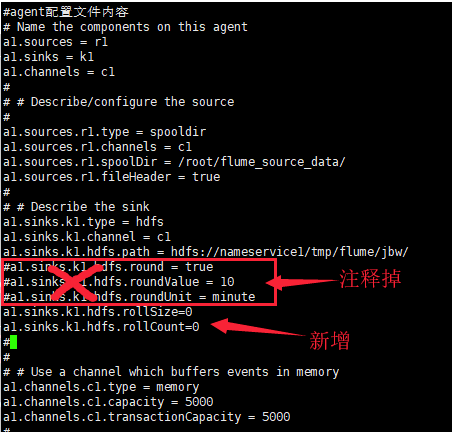

[TOC]

# 1. flume相关

## 1.1 小文件如何处理



将下面三行注释掉：

```bash
a1.sinks.k1.hdfs.round=true
a1.sinks.k1.hdfs.roundValue=10
a1.sinks.k1.hdfs.roundUnit=minute
```

参数含义：

round
默认值：false，是否启用时间上的”舍弃”，类似于”四舍五入”，如果启用，则会影响除了%t的其他所有时间表达式；

roundValue
默认值：1，时间上进行“舍弃”的值；

roundUnit

默认值：seconds，时间上进行”舍弃”的单位，包含：second,minute,hour


新增下面的内容：

```bash
a1.sinks.k1.hdfs.rollSize=0
a1.sinks.k1.hdfs.rollCount=0
```

参数含义：

rollSize
默认值：1024，当临时文件达到该大小（单位：bytes）时，滚动成目标文件。如果设置成0，则表示不根据临时文件大小来滚动文件。

rollCount
默认值：10，当events数据达到该数量时候，将临时文件滚动成目标文件，如果设置成0，则表示不根据events数据来滚动文件。


还有一个可能的原因是文件因为所在块的复制而滚动，可以设置如下参数：

```bash
a1.sinks.k1.hdfs.minBlockReplicas=1
```

参数含义：

 Specify minimum number of replicas per HDFS block. If not specified, it comes from the default Hadoop config in the classpath.

没有默认值


## 1.2 sink到HDFS的时候如何按照日期生成对应的目录

配置如下:

```bash
a1.sinks.k1.hdfs.path = hdfs://nameservice1/tmp/flume/jbw/%y-%m-%d
```

# 2.sqoop相关

## 2.1 导入mysql大表到HDFS

有一个存有上亿条数据的mysql表，怎么优化导入到HDFS速度

方案：通过写脚本分批导入HDFS

脚本如下：

```bash
#!/bin/bash
source /etc/profile

host=127.0.0.1

for((i=1; i<=100; i++))
do   
    start=$(((${i} - 1) * 100000 + 1))
    end=$((${i} * 100000))

    sql="select person_id,capture_time,write_time,capture_resource_id,major_capture_image_url,minor_capture_image_url,sex,age,orientation,glasses,knapsack, bag,messenger_bag,shoulder_bag,umbrella,hair,hat,mask,upper_color,upper_type,upper_texture,bottom_color,bottom_type,trolley_case,barrow,baby,feature_type,feature_code from big_data.pedestrian_sm where person_id>=${start} and person_id<=${end} and \$CONDITIONS";  

    sqoop import --connect jdbc:mysql://${host}:3306/big_data \
    --username root \
    --password 123456 \
    --query "${sql}" \
    --fields-terminated-by '\001' \
    --delete-target-dir \
    --target-dir hdfs://hsmaster:9000/tmp/big_data/pedestrian_sm/${start}-${end}/ \
    --split-by person_id \
    -m 8

    echo Sqoop import from: ${start} to: ${end} success....................................


    hive -e "
        use big_data;
        load data inpath 'hdfs://master:9000/tmp/big_data/pedestrian_sm/${start}-${end}' into table big_data.pedestrian_sm;
    "

    echo Hive load from: ${start}-${end} success....................................

done
```


https://blog.csdn.net/whdxjbw/article/details/81079746?utm_medium=distribute.pc_relevant_t0.none-task-blog-2%7Edefault%7EBlogCommendFromMachineLearnPai2%7Edefault-1.control&dist_request_id=1331978.945.16185780524860411&depth_1-utm_source=distribute.pc_relevant_t0.none-task-blog-2%7Edefault%7EBlogCommendFromMachineLearnPai2%7Edefault-1.control


# 3. spark相关


## 3.1 shuffle是如何避免的


## 3.2 mapPartitions算子能做但是map算子不能做的事情


# 4. azkaban


## 4.1 如何减少任务调度执行的时间


