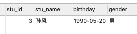
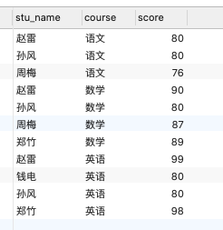
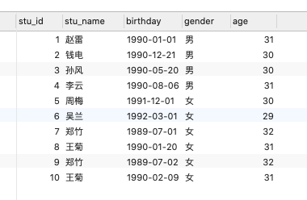

[TOC]

# 1. flume相关

## 1.1 小文件如何处理


将下面三行注释掉：

```bash
a1.sinks.k1.hdfs.round=true
a1.sinks.k1.hdfs.roundValue=10
a1.sinks.k1.hdfs.roundUnit=minute
```

参数含义：

round
默认值：false，是否启用时间上的”舍弃”，类似于”四舍五入”，如果启用，则会影响除了%t的其他所有时间表达式；

roundValue
默认值：1，时间上进行“舍弃”的值；

roundUnit

默认值：seconds，时间上进行”舍弃”的单位，包含：second,minute,hour


新增下面的内容：

```bash
a1.sinks.k1.hdfs.rollSize=0
a1.sinks.k1.hdfs.rollCount=0
```

参数含义：

rollSize
默认值：1024，当临时文件达到该大小（单位：bytes）时，滚动成目标文件。如果设置成0，则表示不根据临时文件大小来滚动文件。

rollCount
默认值：10，当events数据达到该数量时候，将临时文件滚动成目标文件，如果设置成0，则表示不根据events数据来滚动文件。


还有一个可能的原因是文件因为所在块的复制而滚动，可以设置如下参数：

```bash
a1.sinks.k1.hdfs.minBlockReplicas=1
```

参数含义：

 Specify minimum number of replicas per HDFS block. If not specified, it comes from the default Hadoop config in the classpath.

没有默认值


## 1.2 sink到HDFS的时候如何按照日期生成对应的目录

配置如下:

```bash
a1.sinks.k1.hdfs.path = hdfs://nameservice1/tmp/flume/jbw/%y-%m-%d
```

# 2.sqoop相关

## 2.1 导入mysql大表到HDFS

有一个存有上亿条数据的mysql表，怎么优化导入到HDFS速度

方案：

方案1：通过写脚本分批导入HDFS

方案2：启用并发导入

脚本如下：

```bash
#!/bin/bash
source /etc/profile

host=127.0.0.1

for((i=1; i<=100; i++))
do   
    start=$(((${i} - 1) * 100000 + 1))
    end=$((${i} * 100000))

    sql="select person_id,capture_time,write_time,capture_resource_id,major_capture_image_url,minor_capture_image_url,sex,age,orientation,glasses,knapsack, bag,messenger_bag,shoulder_bag,umbrella,hair,hat,mask,upper_color,upper_type,upper_texture,bottom_color,bottom_type,trolley_case,barrow,baby,feature_type,feature_code from big_data.pedestrian_sm where person_id>=${start} and person_id<=${end} and \$CONDITIONS";  

    sqoop import --connect jdbc:mysql://${host}:3306/big_data \
    --username root \
    --password 123456 \
    --query "${sql}" \
    --fields-terminated-by '\001' \
    --delete-target-dir \
    --target-dir hdfs://hsmaster:9000/tmp/big_data/pedestrian_sm/${start}-${end}/ \
    --split-by person_id \
    -m 8

    echo Sqoop import from: ${start} to: ${end} success....................................


    hive -e "
        use big_data;
        load data inpath 'hdfs://master:9000/tmp/big_data/pedestrian_sm/${start}-${end}' into table big_data.pedestrian_sm;
    "

    echo Hive load from: ${start}-${end} success....................................

done
```


Sqoop支持全量数据导入和增量数据导入，同时可以指定数据是否以并发形式导入

### 2.1.1 全量数据导入

```bash
# 全量数据导入
sqoop import \
 --connect jdbc:mysql://192.168.xxx.xxx:3316/testdb \
 --username root \
 --password 123456 \
 --query “select * from test_table where \$CONDITIONS” \
 --target-dir /user/root/person_all \ 
 --fields-terminated-by “,” \
 --hive-drop-import-delims \
 --null-string “\\N” \
 --null-non-string “\\N” \
 --split-by id \
 -m 6 \
```

重要参数说明：


### 2.1.2 增量数据导入

增量数据导入分为两种，一是基于递增列的增量数据导入(Append方式)，二是基于时间列的增量数据导入(LastModified方式)

1. Append方式

   举个栗子，有一个订单表，里面每个订单有一个唯一标识自增列ID，在关系型数据库中以主键形式存在。之前已经将id在0~5201314之间的编号的订单导入到Hadoop中了（这里为HDFS），现在一段时间后我们需要将近期产生的新的订单数据导入Hadoop中（这里为HDFS），以供后续数仓进行分析。此时我们只需要指定–incremental 参数为append，–last-value参数为5201314即可。表示只从id大于5201314后开始导入。

   

   ```sql
   # Append方式的全量数据导入
    sqoop import \
      --connect jdbc:mysql://192.168.xxx.xxx:3316/testdb \
      --username root \
      --password 123456 \
      --query “select order_id, name from order_table where \$CONDITIONS” \
      --target-dir /user/root/orders_all \ 
      --split-by order_id \
      -m 6  \
      --incremental append \
      --check-column order_id \
      --last-value 5201314
   ```

   参数说明：

   

   

   

2. LastModified方式

   此方式要求原有表中有time字段，它能指定一个时间戳，让Sqoop把该时间戳之后的数据导入至Hadoop（这里为HDFS）。因为后续订单可能状态会变化，变化后time字段时间戳也会变化，此时Sqoop依然会将相同状态更改后的订单导入HDFS，当然我们可以指定merge-key参数为orser_id，表示将后续新的记录与原有记录合并


   ```bash
   # 将时间列大于等于阈值的数据增量导入HDFS
    sqoop import \
      --connect jdbc:mysql://192.168.xxx.xxx:3316/testdb \
      --username root \
      --password transwarp \
      --query “select order_id, name from order_table where \$CONDITIONS” \
      --target-dir /user/root/order_all \ 
      --split-by id \
      -m 4  \
      --incremental lastmodified \
      --merge-key order_id \
      --check-column time \
      # remember this date !!!
      --last-value “2014-11-09 21:00:00”  
   ```

   

### 2.1.3 并发导入参数设置

我们知道通过 -m 参数能够设置导入数据的 map 任务数量，即指定了 -m 即表示导入方式为并发导入，这时我们必须同时指定 - -split-by 参数指定根据哪一列来实现哈希分片，从而将不同分片的数据分发到不同 map 任务上去跑，避免数据倾斜。

注意点：

- 生产环境中，为了防止主库被Sqoop抽崩，我们一般从备库中抽取数据。
- 一般RDBMS的导出速度控制在60~80MB/s，每个 map 任务的处理速度5~10MB/s 估算，即 -m 参数一般设置4~8，表示启动 4~8 个map 任务并发抽取。


# 3. spark相关


## 3.1 shuffle是如何避免的


### 3.1.1 DataFrame/DataSet的join避免shuffle

针对Spark DataFrame/DataSet的join，可以通过broadcast join和bucket join来避免shuffle操作

1. Broadcast Join

   Broadcast join很好理解，小表被分发到所有executors，所以不需要做shuffle就可以完成join. Spark SQL控制自动broadcast join的参数是：spark.sql.autoBroadcastJoinThreshold ， 默认为10MB. 就是说当join中的一张表的size小于10MB时，spark会自动将其封装为broadcast发送到所有结点，然后进行broadcast join. 当然也可以手动将join中的某张表转化成broadcast : 

       sparkSession.sparkContext.broadcast(df)

2. Bucket Join

   Bucket join其实就是将要join的两张表按照join columns（或join columns的子集）根据相同的partitioner预先做好分区，并将这些分区信息存储到catalog中（比如HiveExternalCatalog）；然后在读取这两张表并做join时，spark根据bucket信息将两张表的相同partition进行join即可，从而避免了shuffle的过程。注意，这里是避免了shuffle过程，并没有完全避免网络传输，由于两张表的相同partition不一定在同一台机器上，所以这里仍需要对其中一张表的partition进行网络传输

### 3.1.2 RDD的join避免shuffle

RDD的join可以避免shuffle的条件是：参与join的所有RDD的partitioner都和结果RDD的partitioner相同

在RDD对象中有一个隐式转换可以将RDD转换成PairRDDFunctions对象，这样就可以直接在RDD对象上调用join方法，然后在join方法中指定partitioner

## 3.2 mapPartitions算子能做但是map算子不能做的事情


两者的区别：

- map是对RDD中的每一个元素进行操作
- mapPartitions则是对RDD中的每个分区的迭代器进行操作

**MapPartitions的优点：**

如果是普通的map，比如一个partition中有1万条数据。ok，那么你的function要执行和计算1万次。

使用MapPartitions操作之后，一个task仅仅会执行一次function，function一次接收所有
的partition数据。只要执行一次就可以了，性能比较高。如果在map过程中需要频繁创建额外的对象(例如将rdd中的数据通过jdbc写入数据库,map需要为每个元素创建一个链接而mapPartition为每个partition创建一个链接),则mapPartitions效率比map高的多。

SparkSql或DataFrame默认会对程序进行mapPartition的优化。


**MapPartitions的缺点：**

如果是普通的map操作，一次function的执行就处理一条数据；那么如果内存不够用的情况下， 比如处理了1千条数据了，那么这个时候内存不够了，那么就可以将已经处理完的1千条数据从内存里面垃圾回收掉，或者用其他方法，腾出空间来吧。
所以说普通的map操作通常不会导致内存的OOM异常。 

但是MapPartitions操作，对于大量数据来说，比如甚至一个partition，100万数据，
一次传入一个function以后，那么可能一下子内存不够，但是又没有办法去腾出内存空间来，可能就OOM，内存溢出。


## 3.3 内存划分


Spark 1.6之前采用的是静态内存管理，之后采用的是统一内存管理，统一内存管理和静态内存管理的区别在于统一内存管理的存储内存和执行内存共享同一块空间，可以动态占用对方的空闲区域。

spark的内存整体上可以划分为堆内内存和堆外内存两部分

**堆内内存：(3部分)**

堆内内存的大小，由spark应用程序启动时的-executor-memory或者spark.executor.memory参数配置，Executor内运行的并发任务共享JVM堆内内存。

1. 缓存RDD数据和广播(Broadcast)数据时占用的内存被规划为**存储(Storage)内存**
2. 执行Shuffle时占用的内存被规划为**执行(Executioni)内存**
3. 剩余的部分不做特殊规划，叫做other空间，Spark内部的对象实例、用户定义的Spark应用程序中的对象实例，均占用该部分空间

**堆外内存**

除了没有other空间，堆外内存与堆内内存的划分方式相同。

默认情况下，堆外内存并不启用，可通过配置spark.memory.offHeap.enabled参数启用，并由spark.memory.offHeap.size参数设定堆外空间的大小。


执行内存的空间被对方占用后，可让对方将占用的部分转存到硬盘，然后"归还"借用的空间

存储内存的空间被对方占用后，无法让对方"归还"，因为需要考虑 Shuffle 过程中的很多因素，实现起来较为复杂


# 4. azkaban


## 4.1 如何减少任务调度执行的时间

通过提高并行job数

修改Executor Server配置

```bash
flow.num.job.threads=20#默认值是10
```


# 5. HQL练习

查询"01"课程比"02"课程成绩高的学生的信息及课程分数:

```sql
SELECT
	stu.*,
	sc.score,
	a.score 
FROM
	t_stu_info stu
	JOIN t_score sc ON sc.course_id = 1 
	AND sc.stu_id = stu.stu_id
	LEFT JOIN t_score a ON a.course_id = 2 
	AND a.stu_id = stu.stu_id 
WHERE
	sc.score > a.score 
	OR a.score IS NULL 
GROUP BY
	stu.stu_id,
	stu.stu_name,
	stu.birthday,
	stu.gender,
	sc.score,
	a.score;

2	钱电		1990-12-21	男	70	60
4	李云		1990-08-06	男	50	30
6	吴兰		1992-03-01	女	31	NULL

```

查询平均成绩大于等于60分的同学的学生编号和学生姓名和平均成绩:


```sql
SELECT
	stu.stu_id,
	stu.stu_name,
	round( avg( sc.score ), 2 ) AS avgscore 
FROM
	t_stu_info stu
	JOIN t_score sc ON sc.stu_id = stu.stu_id 
GROUP BY
	stu.stu_id,
	stu.stu_name 
HAVING
	avgscore >= 60;

运行结果:

1	赵雷		89.67
2	钱电		70.0
3	孙风		80.0
5	周梅		81.5
7	郑竹		93.5
```


查询平均成绩小于60分的同学的学生编号和学生姓名和平均成绩:
(包括有成绩的和无成绩的)

```sql
SELECT
	stu.stu_id,
	stu.stu_name,
	ROUND( AVG( sc.score ), 2 ) AS avgscore 
FROM
	t_stu_info stu
	JOIN t_score sc ON sc.stu_id = stu.stu_id 
GROUP BY
	stu.stu_id,
	stu.stu_name 
HAVING
	avgscore <= 60 UNION ALL
SELECT
	stu.stu_id,
	stu.stu_name,
	0 AS avgscore 
FROM
	t_stu_info stu
	LEFT JOIN t_score sc ON sc.stu_id = stu.stu_id 
WHERE
	sc.score IS NULL;
	
	运行结果:

8	王菊	0.0
4	李云	33.33
6	吴兰	32.5
```

查询所有同学的学生编号、学生姓名、选课总数、所有课程的总成绩

```sql
SELECT
	a.stu_id,
	a.stu_name,
	count( a.stu_id ),
	sum( b.score ) 
FROM
	t_stu_info a
	LEFT JOIN t_score b ON a.stu_id = b.stu_id 
GROUP BY
	a.stu_id,
	a.stu_name;
	
	运行结果:

1	赵雷		3	269
2	钱电		3	210
3	孙风		3	240
4	李云		3	100
5	周梅		2	163
6	吴兰		2	65
7	郑竹		2	187
8	王菊		1	NULL
```


查询学过"张三"老师授课的同学的信息

```sql
SELECT
	a.stu_id,
	a.stu_name,
	a.birthday,
	a.gender,
	d.teach_name 
FROM
	t_stu_info a
	JOIN t_teach d ON d.teach_name = '张三'
	JOIN t_course c ON c.teach_id = d.teach_id
	JOIN t_score b ON a.stu_id = b.stu_id 
	AND b.course_id = c.course_id;
	
	
运行结果：
1	赵雷	1990-01-01	男
2	钱电	1990-12-21	男
3	孙风	1990-05-20	男
4	李云	1990-08-06	男
5	周梅	1991-12-01	女
7	郑竹	1989-07-01	女
```


查询没学过"张三"老师授课的同学的信息

```sql
SELECT
	stu.*,
	cs.course_id,
	sc.score 
FROM
	t_stu_info stu
	JOIN t_teach ter ON ter.teach_name = '张三'
	JOIN t_course cs ON ter.teach_id = cs.teach_id
	LEFT JOIN t_score sc ON sc.stu_id = stu.stu_id 
	AND sc.course_id = cs.course_id 
WHERE
	sc.score IS NULL;
```

查询学过编号为"01"并且也学过编号为"02"的课程的同学的信息

```sql
SELECT
	a.stu_id,
	a.stu_name,
	a.birthday,
	a.gender,
	count( a.stu_id ) 
FROM
	t_stu_info a
	LEFT JOIN t_score b ON a.stu_id = b.stu_id 
WHERE
	b.course_id IN ( 1, 2 ) 
GROUP BY
	a.stu_id,
	a.stu_id,
	a.stu_name,
	a.birthday,
	a.gender 
HAVING
	count( a.stu_id )> 1;
```

另一种解法

```sql
SELECT
	stu.stu_id,
	stu.stu_name 
FROM
	t_stu_info stu
	JOIN t_score sc ON sc.course_id = '01' 
	AND sc.stu_id = stu.stu_id
	JOIN t_score sc1 ON sc1.course_id = '02' 
	AND sc1.stu_id = sc.stu_id;
```

查询学过编号为"01"但是没有学过编号为"02"的课程的同学的信息

```sql
SELECT
	stu.stu_id,
	stu.stu_name 
FROM
	t_stu_info stu
	JOIN t_score sc ON sc.course_id = 1
	AND sc.stu_id = stu.stu_id
	LEFT JOIN t_score sc1 ON sc1.course_id = 2
	AND sc1.stu_id = sc.stu_id 
WHERE
	sc1.score IS NULL;
```


查询没有学全所有课程的同学的信息:
–先查询出课程的总数量–再查询所需结果

```sql
SELECT DISTINCT
	stu.stu_id,
	stu.stu_name 
FROM
	t_stu_info stu
	JOIN t_course cs
	LEFT JOIN t_score sc ON sc.stu_id = stu.stu_id 
	AND cs.course_id = sc.course_id 
WHERE
	sc.score IS NULL;
```

查询至少有一门课与学号为"1"的同学所学相同的同学的信息

下面是自己想到的一种解法：

```sql
SELECT
	* 
FROM
	t_stu_info st 
WHERE
	st.stu_id IN (
	SELECT DISTINCT
		sc.stu_id 
	FROM
		t_score sc 
	WHERE
		sc.course_id IN ( SELECT sc.course_id FROM t_score sc WHERE sc.stu_id = 1 AND sc.score IS NOT NULL ) 
	AND sc.stu_id != 1 
	);
```


别人的解法

```sql
SELECT DISTINCT
	stu.stu_id,
	stu.stu_name 
FROM
	t_stu_info stu
	JOIN t_score sc ON sc.stu_id = 1
	LEFT JOIN t_score sc1 ON sc1.stu_id = stu.stu_id 
	AND sc1.course_id = sc.course_id 
WHERE
	stu.stu_id != 1
	AND sc1.score IS NOT NULL;
```

查询和"01"号的同学学习的课程完全相同的其他同学的信息

```sql
SELECT
	* 
FROM
	(
	SELECT
		a.stu_id,
		concat_ws(
			",",
			collect_set (cast( a.course_id AS string ))) AS course1 
	FROM
		t_score a 
	WHERE
		a.stu_id = 1
	GROUP BY
		a.stu_id 
	) b
	JOIN ( SELECT c.stu_id, concat_ws( ",", collect_set ( cast( c.course_id AS string ))) AS course2 FROM t_score c GROUP BY c.stu_id ) d ON b.course1 = d.course2 
	AND d.stu_id != 1;
```

查询没学过"张三"老师讲授的任一门课程的学生姓名

自己想出来的解法

```sql
SELECT
	stu.stu_id,
	stu.stu_name,
	
FROM
	t_stu_info stu
	JOIN t_teach te ON te.teach_name = '张三'
	JOIN t_course cs ON cs.teach_id = te.teach_id
	LEFT JOIN t_score sc ON sc.course_id = cs.course_id 
	AND sc.stu_id = stu.stu_id 
WHERE
	sc.score IS NULL;
```

别人的解法：

```sql
SELECT
	stu.*
FROM
	t_stu_info stu
	LEFT JOIN t_score sc ON sc.stu_id = stu.stu_id
	LEFT JOIN t_course cs ON cs.course_id = sc.course_id
	LEFT JOIN t_teach te ON te.teach_id=cs.teach_id AND te.teach_name = '张三' 
GROUP BY
	stu.stu_id,
	stu.stu_name,
	stu.birthday,
	stu.gender 
HAVING
	SUM( CASE WHEN te.teach_name IS NULL THEN 0 ELSE 1 END)=0;
```


查询两门及其以上不及格课程的同学的学号，姓名及其平均成绩

```sql
SELECT
	a.stu_id,
	a.stu_name,
	round( avg( b.score ), 2 ) 
FROM
	t_stu_info a
	LEFT JOIN t_score b ON a.stu_id = b.stu_id 
WHERE
	b.score < 60 
GROUP BY
	a.stu_id,
	a.stu_name 
HAVING
	count( a.stu_id )> 1;
```


检索"1"课程分数小于60，按分数降序排列的学生信息

自己想出来的方案：

```sql
SELECT
	stu.*,
	sc.score 
FROM
	t_stu_info stu
	JOIN t_score sc ON sc.stu_id = stu.stu_id  AND sc.course_id=1
WHERE
	sc.score < 60 
ORDER BY
	sc.score DESC;
```

按平均成绩从高到低显示所有学生的所有课程的成绩以及平均成绩

```sql
SELECT
	a.*,
	b.course_id,
	b.score,
	round( avg( b.score ) over ( PARTITION BY a.stu_id ORDER BY b.score DESC rows BETWEEN unbounded preceding AND unbounded following ), 2 ) AS avg 
FROM
	t_stu_info a
	LEFT JOIN t_score b ON a.stu_id = b.stu_id 
ORDER BY
	avg DESC;
```

查询各科成绩最高分、最低分和平均分：以如下形式显示：课程ID，课程name，最高分，最低分，平均分，及格率，中等率，优良率，优秀率

```sql
SELECT
	sc.course_id,
	cs.course,
	MAX( sc.score ) AS max_score,
	MIN( sc.score ) AS min_score,
	ROUND( AVG( sc.score ), 2 ) AS avg_score,
	ROUND( SUM( CASE WHEN sc.score > 60 AND sc.score <= 70 THEN 1 ELSE 0 END )/ SUM( 1 ), 2 ) AS pass,
	ROUND( SUM( CASE WHEN sc.score > 70 AND sc.score <= 80 THEN 1 ELSE 0 END )/ SUM( 1 ), 2 ) AS middle,
	ROUND( SUM( CASE WHEN sc.score > 80 AND sc.score <= 90 THEN 1 ELSE 0 END )/ SUM( 1 ), 2 ) AS good,
	ROUND( SUM( CASE WHEN sc.score > 90 AND sc.score <= 100 THEN 1 ELSE 0 END )/ SUM( 1 ), 2 ) AS excellent 
FROM
	t_score sc
	JOIN t_course cs ON sc.course_id = cs.course_id 
GROUP BY
	sc.course_id,
	cs.course;
```


按各科成绩进行排序，并显示排名:– row_number() over()分组排序功能

```sql
SELECT
	course_id,
	score,
	row_number() over ( PARTITION BY course_id ORDER BY score ) 
FROM
	t_score;
```

查询学生的总成绩并进行排名

```sql
SELECT
	a.stu_name,
	sum( b.score ) AS total 
FROM
	t_stu_info a
	LEFT JOIN t_score b ON a.stu_id = b.stu_id 
GROUP BY
	a.stu_name 
ORDER BY
	total DESC;
```


查询不同老师所教不同课程平均分从高到低显示

自己想出的解决方案

```sql
SELECT
	te.teach_name,
	cs.course,
	ROUND( AVG( sc.score ), 2 ) AS avgscore 
FROM
	t_teach te
	LEFT JOIN t_course cs ON te.teach_id = cs.teach_id
	LEFT JOIN t_score sc ON sc.course_id = cs.course_id 
GROUP BY
	te.teach_name,
	cs.course 
ORDER BY
	avgscore DESC;
```

查询所有课程的成绩第2名到第3名的学生信息及该课程成绩:

```sql
SELECT
	a.stu_id,
	a.course_id,
	b.stu_name,
	b.birthday,
	b.gender,
	a.score,
	a.rank 
FROM
	( SELECT stu_id, course_id, score, row_number() over ( PARTITION BY course_id ORDER BY score ) AS rank FROM t_score ) a
	JOIN t_stu_info b ON a.stu_id = b.stu_id 
WHERE
	a.rank IN ( '2', '3' );
```


统计各科成绩各分数段人数：课程编号,课程名称,[100-85],[85-70],[70-60],[0-60]及所占百分比

```sql
SELECT
	sc.course_id,
	cs.course,
	ROUND( SUM( CASE WHEN sc.score >= 85 AND sc.score < 100 THEN 1 ELSE 0 END )/ SUM( 1 )* 100, 2 ) AS 85_100,
	ROUND( SUM( CASE WHEN sc.score >= 70 AND sc.score < 85 THEN 1 ELSE 0 END )/ SUM( 1 )* 100, 2 ) AS 70_85,
	ROUND( SUM( CASE WHEN sc.score >= 60 AND sc.score < 70 THEN 1 ELSE 0 END )/ SUM( 1 )* 100, 2 ) AS 60_70,
	ROUND( SUM( CASE WHEN sc.score >= 0 AND sc.score < 60 THEN 1 ELSE 0 END )/ SUM( 1 )* 100, 2 ) AS 0_60 
FROM
	t_score sc
	LEFT JOIN t_course cs ON cs.course_id = sc.course_id 
GROUP BY
	sc.course_id,
	cs.course;
```


查询学生平均成绩及其名次

```sql
SELECT
	a.stu_id,
	a.avg,
	row_number() over ( ORDER BY avg DESC ) 
FROM
	( SELECT stu_id, round( avg( score ), 2 ) AS avg FROM t_score GROUP BY stu_id ) a;
```


查询各科成绩前三名的记录三个语句

```sql
SELECT
	sc.course_id,
	row_number() over ( PARTITION BY sc.course_id ORDER BY sc.score DESC ) AS rn 
FROM
	t_score sc 
WHERE
	rn <= 3;
```


查询每门课程被选修的学生数

```sql
SELECT
	sc.course_id,
	COUNT( sc.stu_id ) AS num 
FROM
	t_score sc 
GROUP BY
	sc.course_id;
```


查询出只有两门课程的全部学生的学号和姓名

```sql
SELECT
	stu.stu_id,
	stu.stu_name 
FROM
	t_stu_info stu
	LEFT JOIN t_score sc ON sc.stu_id = stu.stu_id 
	AND sc.score IS NOT NULL 
GROUP BY
	stu.stu_id,
	stu.stu_name 
HAVING
	COUNT( sc.course_id ) = 2;
```


查询男生、女生人数

```sql
SELECT
	gender,
	COUNT(*) 
FROM
	t_stu_info stu 
GROUP BY
	gender;
```


查询名字中含有"风"字的学生信息

```sql
SELECT
	stu.* 
FROM
	t_stu_info stu 
WHERE
	stu.stu_name LIKE '%风%';
```



查询同名同性学生名单，并统计同名人数

```sql
SELECT
	stu.stu_name,
	stu.gender,
	COUNT( stu.stu_name ) AS num 
FROM
	t_stu_info stu 
GROUP BY
	stu.stu_name,
	stu.gender 
HAVING
	num >= 2;
```


查询1990年出生的学生名单

```sql
SELECT
	t_stu_info.* 
FROM
	t_stu_info 
WHERE
	substring( birthday, 1, 4 )= '1990';
```


查询每门课程的平均成绩，结果按平均成绩降序排列，平均成绩相同时，按课程编号升序排列

```sql
SELECT
	sc.course_id,
	ROUND( AVG( sc.score ), 2 ) AS avgscore 
FROM
	t_score sc 
GROUP BY
	sc.course_id 
ORDER BY
	avgscore DESC,
	sc.course_id;
```


查询平均成绩大于等于85的所有学生的学号、姓名和平均成绩

```sql
SELECT
	stu.stu_id,
	stu.stu_name,
	ROUND( AVG( sc.score ), 2 ) AS avgscore 
FROM
	t_score sc
	LEFT JOIN t_stu_info stu ON stu.stu_id = sc.stu_id 
GROUP BY
	stu.stu_id,
	stu.stu_name 
HAVING
	avgscore >= 85;
```


查询课程名称为"数学"，且分数低于60的学生姓名和分数

```sql
SELECT
	a.*,
	b.score,
	c.course 
FROM
	t_stu_info a
	LEFT JOIN t_score b ON a.stu_id = b.stu_id
	LEFT JOIN t_course c ON b.course_id = c.course_id 
WHERE
	( c.course = '数学' AND b.score < 60 ) 
	OR c.course IS NULL;
```


查询所有学生的课程及分数情况

```sql
SELECT
	stu.stu_id,
	stu.stu_name,
	cs.course_id,
	cs.course,
	sc.score 
FROM
	t_stu_info stu
	LEFT JOIN t_score sc ON sc.stu_id = stu.stu_id
	LEFT JOIN t_course cs ON cs.course_id = sc.course_id;
```


查询任何一门课程成绩在70分以上的学生姓名、课程名称和分数

```sql
SELECT
	stu.stu_name,
	cs.course,
	sc.score 
FROM
	t_stu_info stu
	LEFT JOIN t_score sc ON sc.stu_id = stu.stu_id
	LEFT JOIN t_course cs ON cs.course_id = sc.course_id 
WHERE
	sc.score > 70;
```




查询课程不及格的学生

```sql
SELECT DISTINCT
	stu.* 
FROM
	t_stu_info stu
	LEFT JOIN t_score sc ON sc.stu_id = stu.stu_id 
WHERE
	sc.score < 60;
```


查询课程编号为1且课程成绩在80分以上的学生的学号和姓名

```sql
SELECT
	a.* 
FROM
	t_stu_info a
	JOIN t_score b ON a.stu_id = b.stu_id 
	AND b.course_id = 1 
	AND b.score >= 80;
```


求每门课程的学生人数

```sql
SELECT
	sc.course_id,
	COUNT( sc.stu_id ) AS nu 
FROM
	t_score sc 
GROUP BY
	sc.course_id;	
```


查询选修"张三"老师所授课程的学生中，成绩最高的学生信息及其成绩

```sql
SELECT
	stu.*,
	sc.score 
FROM
	t_stu_info stu
	JOIN t_score sc ON sc.stu_id = stu.stu_id
	JOIN t_course cs ON cs.course_id = sc.course_id
	JOIN t_teach te ON te.teach_id = cs.teach_id 
WHERE
	te.teach_name = '张三' 
ORDER BY
	sc.score DESC 
	LIMIT 1;
```


查询不同课程成绩相同的学生的学生编号、课程编号、学生成绩

```sql
SELECT DISTINCT
	a.stu_id,
	b.stu_id,
	a.course_id,
	b.course_id,
	b.score 
FROM
	t_score a
	JOIN t_score b ON a.score = b.score 
WHERE
	a.course_id <> b.course_id;
```


查询每门课程成绩最好的前三名

```sql
SELECT
	* 
FROM
	( SELECT course_id, score, row_number() over ( PARTITION BY course_id ORDER BY score DESC ) AS rn FROM t_score ) a 
WHERE
	a.rn < 4;
```


统计每门课程的学生选修人数（超过5人的课程才统计）

```sql
SELECT
	sc.course_id,
	COUNT( sc.stu_id ) AS num 
FROM
	t_score sc 
GROUP BY
	sc.course_id 
HAVING
	num > 5;
```


检索至少选修两门课程的学生学号

```sql
SELECT
	stu.stu_id,
	COUNT( sc.course_id ) AS num 
FROM
	t_stu_info stu
	JOIN t_score sc ON sc.stu_id = stu.stu_id 
GROUP BY
	stu.stu_id 
HAVING
	num >= 2;
```


查询选修了全部课程的学生信息

自己想出的解决方案

```sql
SELECT
	* 
FROM
	t_stu_info 
WHERE
	stu_id IN (
	SELECT
		stu_id 
	FROM
		(
		SELECT
			stu.stu_id,
			COUNT( sc.course_id ) AS num 
		FROM
			t_stu_info stu
			JOIN t_score sc ON sc.stu_id = stu.stu_id 
		GROUP BY
			stu.stu_id 
		HAVING
			num = 3 
		) t 
	) ;
```


别人的解法：

```sql
SELECT
	stu.stu_id,
	stu.stu_name 
FROM
	t_stu_info stu
	JOIN t_course cs
	LEFT JOIN t_score sc ON sc.stu_id = stu.stu_id 
	AND cs.course_id = sc.course_id 
GROUP BY
	stu.stu_id,
	stu.stu_name 
HAVING
	sum( CASE WHEN sc.score IS NULL THEN 1 ELSE 0 END )= 0;
```


查询各学生的年龄(周岁)

```sql
SELECT
	a.*,
	(
	CASE
			
			WHEN MONTH ( a.birthday )>= MONTH ( CURRENT_DATE ) 
			AND dayofmonth( a.birthday )> dayofmonth( CURRENT_DATE ) THEN
				YEAR ( CURRENT_DATE )- YEAR ( a.birthday )- 1 ELSE YEAR ( CURRENT_DATE )- YEAR ( a.birthday ) 
			END 
			) AS age 
	FROM
	t_stu_info a;
```



查询本周过生日的学生

```sql
SELECT
	a.*,
	weekofyear( a.birthday ),
	weekofyear( CURRENT_DATE ) 
FROM
	t_stu_info a 
WHERE
	(
	weekofyear( a.birthday )= weekofyear( CURRENT_DATE ));
```

查询下周过生日的学生

```sql
SELECT
	a.*,
	weekofyear( a.birthday ),
	weekofyear( CURRENT_DATE ) 
FROM
	t_stu_info a 
WHERE
	( CASE WHEN weekofyear( CURRENT_DATE )= 52 THEN 1 ELSE weekofyear( CURRENT_DATE )+ 1 END )= weekofyear( a.birthday );
```


查询本月过生日的学生

```sql
SELECT
	stu.*,
	MONTH ( CURRENT_DATE ) AS c,
	MONTH ( stu.birthday ) AS b 
FROM
	t_stu_info stu 
WHERE
	MONTH ( CURRENT_DATE )= MONTH ( stu.birthday );
```


查询12月份过生日的学生

```sql
SELECT
	stu.*,
	MONTH ( stu.birthday ) AS b 
FROM
	t_stu_info stu 
WHERE
	MONTH ( stu.birthday )= 12;
```


https://blog.csdn.net/qq_35954433/article/details/85275478

https://www.e-learn.cn/content/qita/1862551


