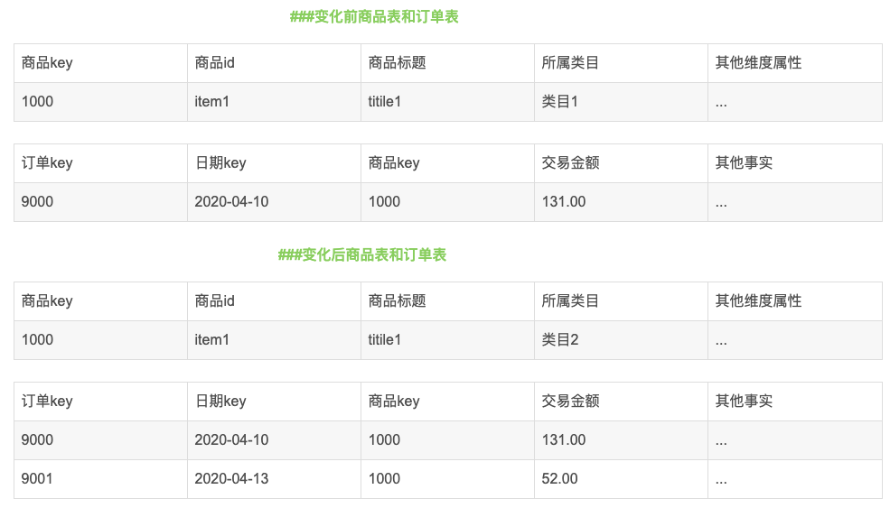
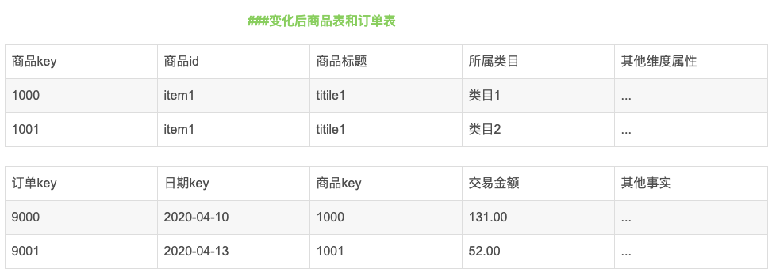

[TOC]

# 1. 数据仓库的特点

- 数据仓库的数据是面向主题的
- 数据仓库的数据是集成的
- 数据仓库的数据是不可更新的
- 数据仓库的数据是随时间不断变化的


# 2. 介绍一下数据仓库

另外一种问法：说一下你对数据仓库的理解

数据仓库是面向主题的、集成的、相对稳定的、反映历史变化的数据集合，目的在于支持决策，构建面向分析集成化数据环境，为企业提供支持


# 3. 数据仓库与数据库的区别

1. 数据粒度不同

   数据库存储的是操作型数据，是细节性的数据，是当前的数据，反映的是最后修改的结果。数据仓库是分析型的集成或汇总的数据，面向主题，并且保存数据的所有历史状态

2. 数据的生命周期不同

   数据库存的数据的生命周期比较短，不会保存很久的数据，数据仓库则需要历史数据来反映趋势的变化和分析

3. 建模方法不同

   数据库采用范式建模，不能有冗余，数据仓库的建模方法有DW范式建模和DM维度建模，可以存在冗余

4. 时间敏感度不同

   数据库的数据要求及时性非常高，数据仓库可以容忍数据的一定延迟

5. 目标不同

   数据库主要面向业务处理，数据仓库面向分析用户


# 4. 范式建模和维度建模的区别

关系模型严格遵循第三范式，物理表数量多，数据冗余程度低，主要应用于OLTP系统中，维度模型主要应用于OLAP系统中，通常以某一个事实表为中心进行表的组织，主要面向业务，特征是可能存在数据的冗余，但是能方便地得到数据


# 5. 维度建模过程中遇到的坑


# 6. SQL中代替join的方法


相互关注sql题

使用join的写法

```sql
SELECT
	a.uid1,
	a.uid2,
IF
	( b.uid1 IS NOT NULL, 1, 0 ) AS is_friend 
FROM
	follow a
	LEFT JOIN follow b ON a.uid1 = b.uid2 
	AND a.uid2 = b.uid1;
```


不使用join的写法：

```sql
SELECT
	a.uid1,
	a.uid2,
IF
	( sum( 1 ) over ( PARTITION BY feature ) > 1, 1, 0 ) AS is_friend 
FROM
	(
	SELECT
		a.uid1,
		a.uid2,
	IF
		(
			uid1 > uid2,
			concat( uid2, uid1 ),
		concat( uid1, uid2 )) AS feature 
	FROM
	follow 
	) a;
```


# 7. 项目中有哪些主题

设备主题

会员主题

商品主题

活动主题

地区主题


# 8. 项目中有哪些模型

- 业务模型
- 领域模型
- 逻辑模型
- 物理模型


# 9. SQL/HQL是怎么转换成MR任务的？

**总的来说，Hive是通过给用户提供的一系列交互接口，接收到用户的指令(SQL)，使用自己的Driver，结合元数据(MetaStore)，将这些指令翻译成MapReduce，提交到Hadoop中执行，最后，将执行返回的结果输出到用户交互接口**


# 10. Hive SQL优化

1. join优化

   ```bash
   hive.optimize.skewjoin=true;如果是join过程中出现倾斜 应该设置为true
   set hive.skewjoin.key=100000; 这个是join的键对应的记录条数，超过这个值则会进行优化
   ```

   

2. mapjoin

   ```bash
   set hive.auto.convert.join=true;
   hive.mapjoin.smalltable.filesize默认值是25mb
   select /*+mapjoin(A)*/f.a, f.b from A t join B f on (f.a=t.a)
   ```

   

3. mapjoin的使用场景

   - 关联操作中有一张表非常小
   - 不等值的连接操作

4. bucket join

   - 两个表以相同方式划分桶
   - 两个表的桶个数是倍数关系

5. where放在join前

   优化前：

   ```sql
   select m.cid, u.id
   from order m
   join customer u
   on m.cid = u.id
   where m.dt='2018-06-08'
   ```

   优化后：

   ```sql
   select m.cid, u.id
   from
   (select cid from order
   where dt = '2018-06-08')m
   join customer u
   on m.cid = u.id;
   ```

   

6. group by 优化

   ```bash
   hive.group.skewindata=true; 如果是group by过程出现倾斜，应该设置为true
   set hive.groupby.mapaggr.checkinterval=100000; 这个是group的键对应的记录条数超过这个值则会进行优化
   ```

   

7. count distinct 优化

   优化前：

   ```sql
   select count(distinct id) from tablename;
   ```

   优化后：

   ```sql
   select count(1) from (select distinct id from tablename) tmp;
   select count(1) from (select id from tablename group by id) tmp;
   ```


# 11. 编写HQL过程中遇到的坑

1. distinct

   语句：select distinct uid,gender …
   错误理解：distinct只会将紧跟在distinct后的第一个字段去重。
   正确理解：distinct会按照后面的所有字段，去重。

2. insert

   语句：insert overwrite table a select uid,telephone,gender…
   往hdfs中插入数据时，select 后的字段的顺序，必须与目标表a的字段顺序相同。否则，会插入数据，但是字段对应错误

3. **Sqoop** **导入导出** **Null** **存储一致性问题**

   Hive 中的 Null 在底层是以“\N”来存储，而 MySQL 中的 Null 在底层就是 Null，为了

   保证数据两端的一致性。在导出数据时采用--input-null-string 和--input-null-non-string 两个参

   数。导入数据时采用--null-string 和--null-non-string。 

4. join后的on语句中的null值

   on语句中等式两边的字段，若有null时会出错，因为在SQL中"null = null"结果为unknown。所以须提前处理，再join连接。比如提前为null值赋值。
   例如下面的例子，两个表中uid都为null，在连接后就找不到第二个表中的数据了，这时须将两个表中的null都改为字符串’默认’。（实际工作中的需求时，null为默认，须统计默认分组中telephone的数量）

   
   
5. Full join多表连接中的on语句   

​             各on语句后的字段，必须为相邻表中的字段

6. left join中的右表

   left join时一定要确认右表中数据是否完整，若有完整的表不用，会致使最终结果缺失数据。
   确实，右表的大小不会影响left join语法的正确使用,左表中数据不会丢失，但最终数据缺失了，对一个报表来说，统计出错，一样是错误。
   总结：lef join时要确认，是否需要右表是全的，确认右表是否是全的

   full join多表连接中的on语句

# 12. 如何优化来减少shuffle


# 13. hive和mysql的区别

1. 数据存储位置

   hive中的数据存储在HDFS上，数据库将数据保存到块设备或者本地文件系统中

2. 数据格式

   hive没有定义专门的数据格式，数据格式可以由用户指定，而mysql定义了自己的数据格式，所有数据都按照一定的组织存储

3. 数据更新

   由于hive是针对数据仓库应用设计的并且数据仓库的内容读多写少，因此hive中不支持对数据的改写和添加，所有的数据都是在加载的时候确定好的，而数据库中的数据是经常需要修改的。

4. 索引

   hive没有对数据中的某些key建立索引，hive要访问数据中满足条件的特定值时，需要暴力扫描整个数据，因此访问延迟比较高，数据库中通常会针对一个或几个列建立索引

5. 执行

   hive可以对接MR、tez、spark等引擎，数据库也都有各自的执行引擎

6. 执行延迟

   hive在查询数据时，由于没有索引需要扫描整个表，因此延迟较高，另一个导致hive执行延迟高的因素是MapReduce框架，由于MapReduce本身具有较高的延迟，因此在利用MapReduce执行hive查询时，也会有较高的延迟，相对的数据库的延迟较低

7. 可扩展性

   由于hive是建立在hadoop之上，因此hive的可扩展性是和hadoop的可扩展性是一致的，而数据库由于ACID的严格限制，扩展性非常有限


# 14. 关系型数据库和非关系型数据库的区别

1. 存储方式

   关系型数据库是表格式的，因此存储在表的行和列中，NoSQL数据库则与其相反，通常存储在数据集中，比如文档、键值对或者图结构

2. 存储结构

   关系型数据库对应的是结构化数据，数据表都预先定义了结构，NoSQL数据库基于动态结构，可以很容易适应数据类型和结构的变化

3. 存储规范

   关系型数据库的数据存储为了更高的规范性，把数据分割为最小的关系表以避免重复，而NoSQL数据存储在平面集中，数据经常可能重复

4. 存储扩展

   关系型数据库是纵向扩展，也就是说想要提高处理能力，要使用速度更快的计算机，而NoSQL数据库是横向扩展的，它的存储天然就是分布式的，可以通过给资源池添加更多的普通数据库服务器来分担负载

5. 查询方式

   关系型数据库通过结构化查询语言来操作数据库，而NoSQL查询以块为单元操作数据，使用的是非结构化的语言

6. 事务

   关系型数据库遵循ACID原则，而NoSQL数据库循序BASE**（基本可用（Basically Availble）、软/柔性事务（Soft-state ）、最终一致性（Eventual Consistency））**原则

7. 性能

   关系型数据库为了维护数据的一致性付出了巨大的代价，读写性能比较差，NoSQL存储的格式都是key-value类型的，并且存储在内存中，非常容易存储，NoSQL无需sql的解析，提高了读写性能。


各自的适用场景是什么？

非关系型数据库：日志、埋点、论坛、博客

关系型数据库：所有有逻辑关系的数据存储


# 15. 缓慢变化维的数据是怎么处理的？

1. 重写维度值

   采用此种方式，不保留历史数据，始终取最新的数据

   

   

2. 插入新的维度行

   采用此种方式，保留历史数据

   维度值变化前的事实和过去的维度值关联，纬度值变化后的事实和当前的维度值关联

   

   

3. 添加维度列

   采用第2种处理方式不能将变化前后记录的事实归一为变化前的维度或者归一为变化后的维度。比如根据业务需求，需要将4月份的交易额全部统计到类目2上，采用第2种方式无法实现。针对此问题，采用第3种方式，保留历史数据，可以使用任何一个属性列


# 16. 数据仓库为什么要分层

1. 复杂问题简单化
2. 减少重复开发
3. 隔离原始数据


# 17. 数据治理

你做过什么关于保证数据质量的工作？


