[TOC]

# 1. Ambari简介

## 1.1 什么是Ambari

Apache Ambari 项目旨在通过开发用于配置、管理和监控Apache Hadoop集群的软件来简化Hadoop管理。Ambari提供了一个直观、易用的Hadoop管理Web UI


## 1.2 Ambari的功能

- 提供了跨任意数量的主机安装Hadoop服务的分步向导
- 处理集群的Hadoop服务配置
- 提供集中管理，用于在整个集群中启动、停止和重新配置Hadoop服务
- 提供了一个仪表盘，用于监控Hadoop集群的运行状况和状态
- 利用Ambari指标系统进行指标收集
- 利用Ambari Alert Framework进行系统报警，并在需要注意时进行通知(例如节点出现故障、剩余磁盘空间不足)

# 2. 环境准备

**注意:以下操作三台机器都需要进行**

## 2.1 虚拟机准备

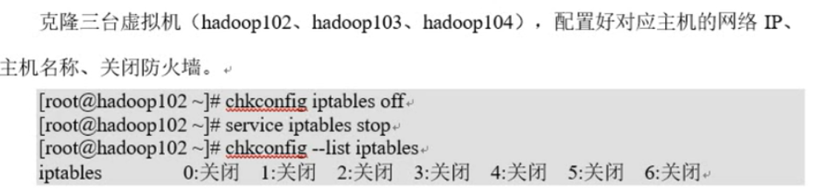

## 2.2 关闭SeLinux


## 2.3 安装JDK


## 2.4 配置SSH免密登录


## 2.5 修改yum源为阿里云镜像

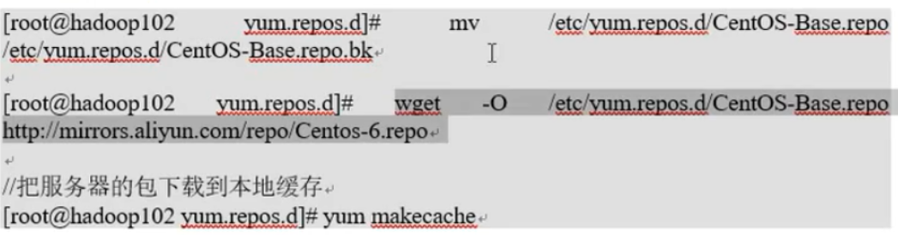

## 2.6 安装ntp


## 2.7 关闭Linux的THP服务

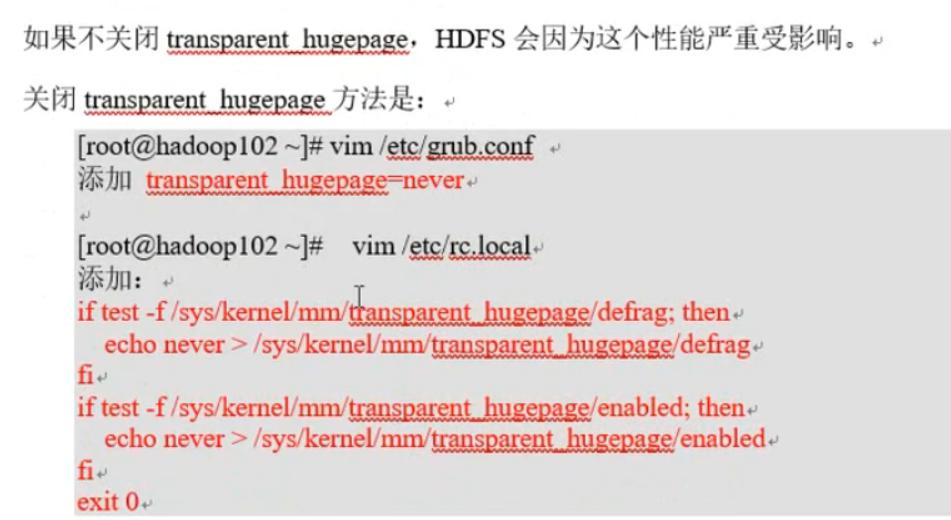

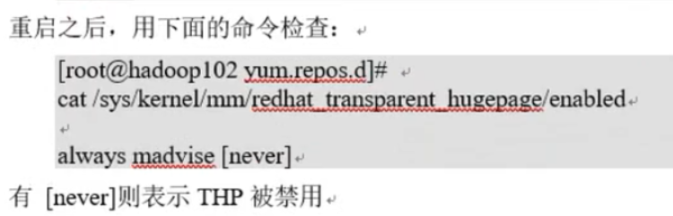

## 2.8 配置UMASK

设定用户所创建目录的初始权限

```bash
umask 0022
```

## 2.9 禁止离线更新


# 3. 安装Ambari集群

注意：以下操作在主节点操作即可

## 3.1 制作本地源

制作本地源是因为在线安装Ambari太慢。制作本地源只需在主节点上进行

### 3.1.1 配置HTTPD服务


### 3.1.2 安装工具


### 3.1.3 将下载的3个tar包解压

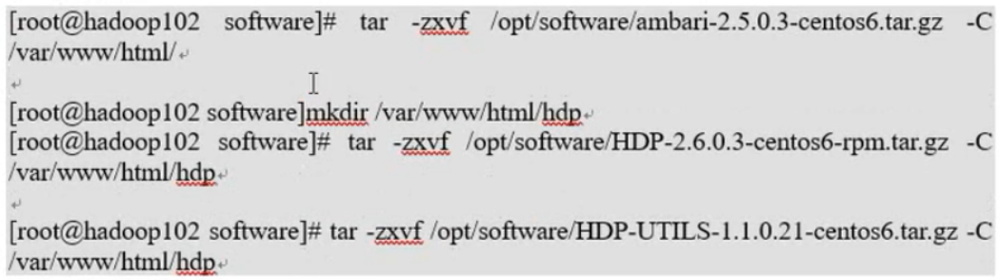

### 3.1.4 创建本地源


### 3.1.5 将Ambari存储库文件下载到安装主机上的目录中


### 3.1.6 修改配置文件，配置为本地源

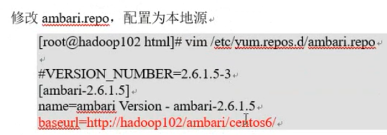

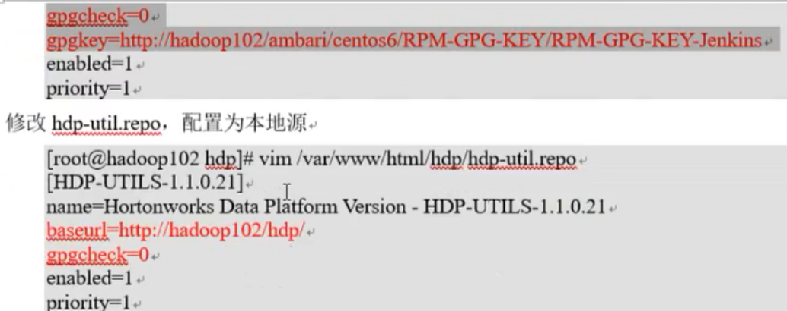

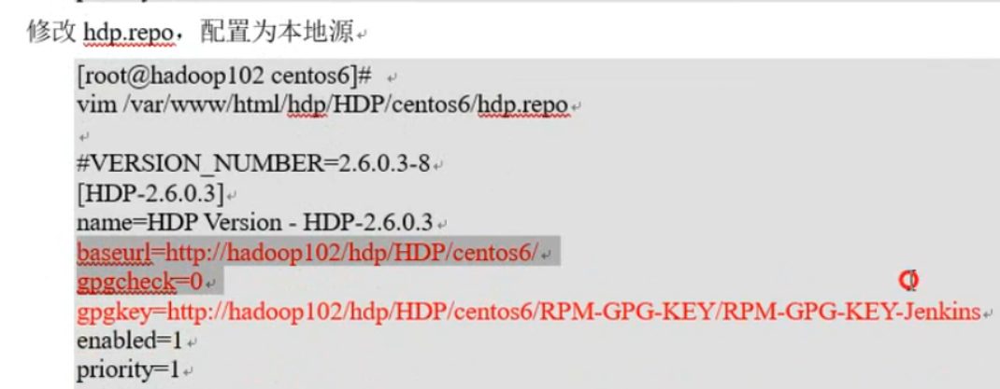

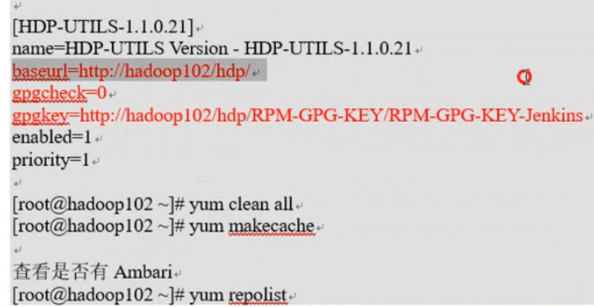


## 3.2 安装MySQL

Ambari使用的默认数据库是PostgreSQL，用于存储安装元数据，可以使用自己安装的MySQL数据库作为Ambari的元数据库

注意：一定要用root用户操作如下步骤；先卸载MySQL再安装

1. 安装包准备

   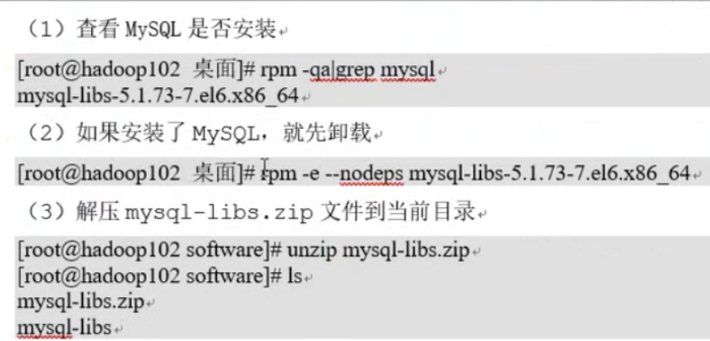

   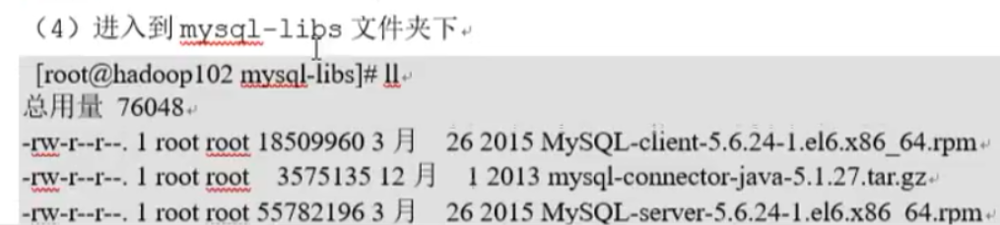

2. 安装MySQL服务器

   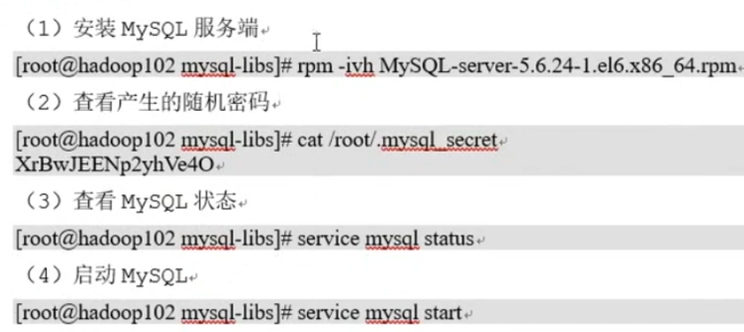

3. 安装MySQL客户端

   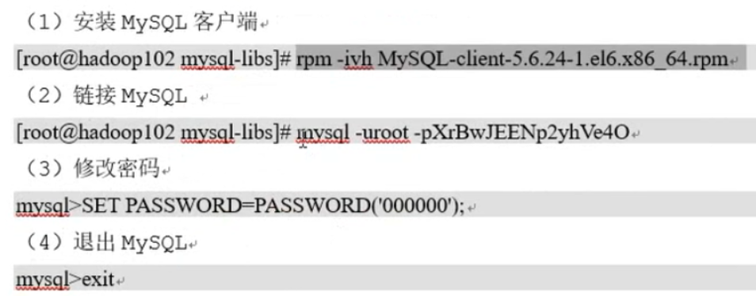

4. MySQL中user表中主机配置

   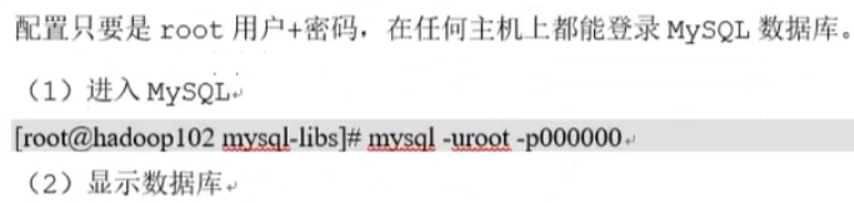

   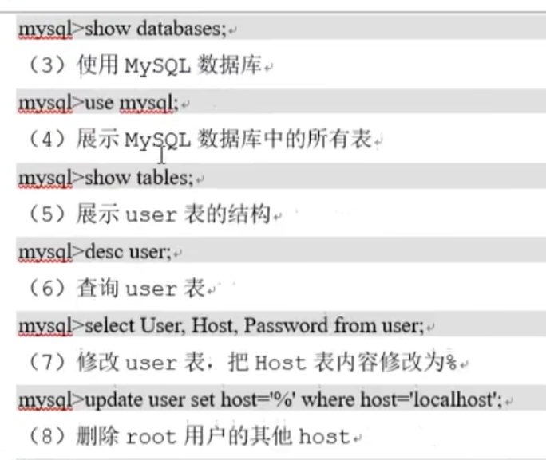

   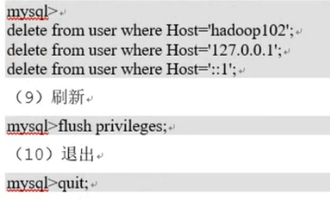

   

## 3.3 安装Ambari

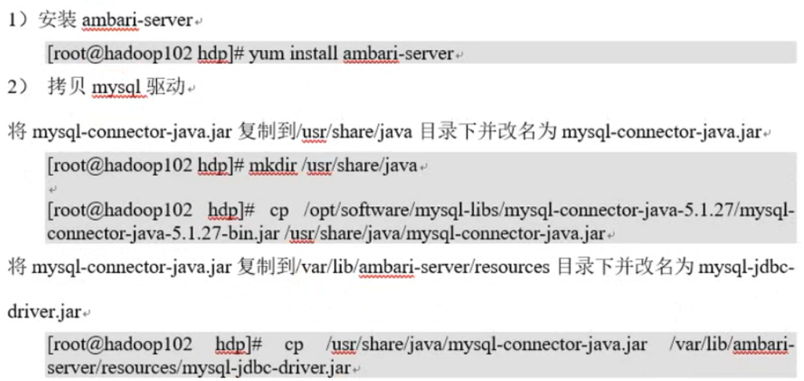


## 3.4 在MySQL中创建数据库

1. 创建ambari库

   

2. 使用Ambari自带脚本创建表

   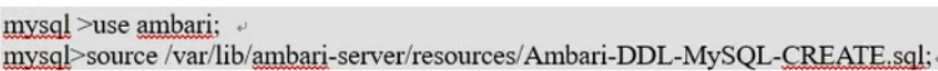

3. 赋予用户root权限

   

4. 刷新

   


## 3.5 配置Ambari

## 3.6 启动Ambari


# 4. HDP集群部署

## 4.1 集群搭建

### 4.1.1 进入登录页面


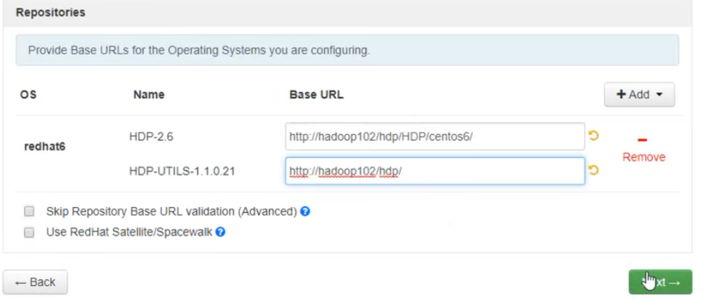

# 5. Ranger

## 5.1 定义

Apache Ranger提供一个集中式安全管理框架，它可以对Hadoop生态的组件Hive,Hbase进行细粒度的数据访问控制。通过操作Ranger控制台，管理员可以轻松的通过配置策略来控制用户访问HDFS文件夹、HDFS文件、数据库、表、字段权限。这些策略可以为不同的用户和组来设置，同时权限可与hadoop无缝对接。

## 5.2 基础架构

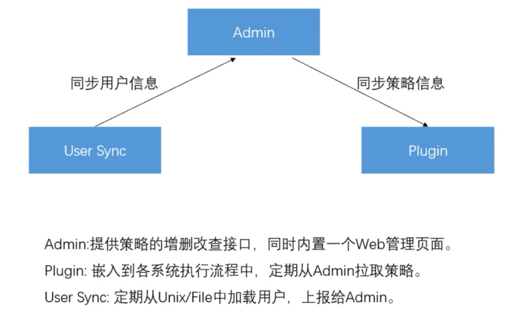

## 5.3 添加服务Ambari Infra(用来保存ranger的Audit数据)

### 5.3.1 添加服务


