[TOC]

# 1. **概述**

## 1.1  **什么是** **Azkaban**

Azkaban 是由 Linkedin 公司推出的一个批量工作流任务调度器，主要用于在一个工作流内以一个特定的顺序运行一组工作和流程，它的配置是通过简单的 key:value 对的方式，通过配置中的 Dependencies 来设置依赖关系。Azkaban 使用 job 配置文件建立任务之间的依赖关系，并提供一个易于使用的 web 用户界面维护和跟踪你的工作流。

## 1.2 **为什么需要工作流调度系统**

1. 一个完整的数据分析系统通常都是由大量任务单元组成

   Shell 脚本程序，Java 程序，MapReduce 程序、Hive 脚本等

2. 各任务单元之间存在时间先后及前后依赖关系

3. 为了很好地组织起这样的复杂执行计划，需要一个工作流调度系统来调度执行

   例如，我们可能有这样一个需求，某个业务系统每天产生 20G 原始数据，我们每天都要对其进行处理，处理步骤如下所示：

   1) 通过 Hadoop 先将原始数据上传到 HDFS 上（HDFS 的操作）

   2) 使用 MapReduce 对原始数据进行清洗（MapReduce 的操作）

   3) 将清洗后的数据导入到 hive 表中（hive 的导入操作）

   4) 对 Hive 中多个表的数据进行 JOIN 处理，得到一张 hive 的明细表（创建中间表）

   5) 通过对明细表的统计和分析，得到结果报表信息（hive 的查询操作）

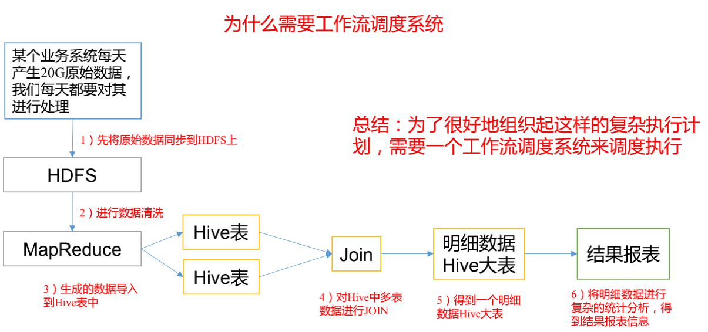

## 1.3 **Azkaban** **特点**

+ 兼容任何版本的 hadoop
+ 易于使用的 Web 用户界面
+ 简单的工作流的上传
+ 方便设置任务之间的关系
+ 调度工作流
+ 模块化和可插拔的插件机制
+ 认证/授权(权限的工作)
+ 能够杀死并重新启动工作流
+ 有关失败和成功的电子邮件提醒

## 1.4 **常见工作流调度系统**

1）简单的任务调度：直接使用 crontab 实现；

2）复杂的任务调度：开发调度平台或使用现成的开源调度系统，比如 ooize、azkaban 等

## 1.5 **Azkaban** **的架构**

Azkaban 由三个关键组件构成：

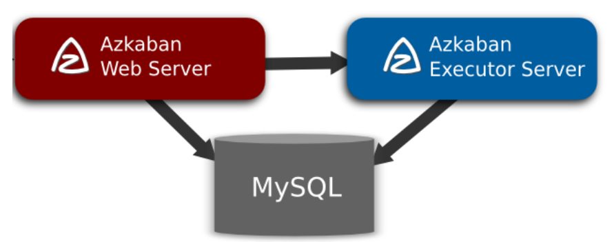

1. AzkabanWebServer：AzkabanWebServer 是整个 Azkaban 工作流系统的主要管理者，它用户登录认证、负责 project 管理、定时执行工作流、跟踪工作流执行进度等一系列任务。
2. AzkabanExecutorServer：负责具体的工作流的提交、执行，它们通过 mysql 数据库来协调任务的执行。
3. 关系型数据库（MySQL）：存储大部分执行流状态，AzkabanWebServer 和AzkabanExecutorServer 都需要访问数据库。

## 1.6 **Azkaban** **下载地址**

下载地址:http://azkaban.github.io/downloads.html

# 2. **Azkaban** **安装部署**

## 2.1 **安装前准备**

1. 将 Azkaban Web 服务器、Azkaban 执行服务器、Azkaban 的 sql 执行脚本及 MySQL 安装包拷贝到 hadoop102 虚拟机/opt/software 目录下
   + azkaban-web-server-2.5.0.tar.gz
   + azkaban-executor-server-2.5.0.tar.gz
   + azkaban-sql-script-2.5.0.tar.gz
   + mysql-libs.zip
2. 选择 **Mysql** 作为 Azkaban 数据库，因为 Azkaban 建立了一些 Mysql 连接增强功能，以方便 Azkaban 设置。并增强服务可靠性

## 2.2 **安装** **Azkaban**

1. 在/opt/module/目录下创建 azkaban 目录

   ```bash
   [atguigu@hadoop102 module]$ mkdir azkaban
   ```

2. 解压 azkaban-web-server-2.5.0.tar.gz、azkaban-executor-server-2.5.0.tar.gz、azkaban-sql-script-2.5.0.tar.gz 到/opt/module/azkaban 目录下

   ```bash
   tar -zxvf azkaban-web-server-2.5.0.tar.gz -C /opt/module/azkaban/
   tar -zxvf azkaban-executor-server-2.5.0.tar.gz -C /opt/module/azkaban/
   tar -zxvf azkaban-sql-script-2.5.0.tar.gz -C /opt/module/azkaban/
   ```

3. 对解压后的文件重新命名

   ```bash
   [atguigu@hadoop102 azkaban]$ mv azkaban-web-2.5.0/ server
   [atguigu@hadoop102 azkaban]$ mv azkaban-executor-2.5.0/ executor
   ```

4. azkaban 脚本导入

   进入 mysql，创建 azkaban 数据库，并将解压的脚本导入到 azkaban 数据库

   ```bash
   mysql -uroot -p000000
   mysql> create database azkaban;
   mysql> use azkaban;
   mysql> source /opt/module/azkaban/azkaban-2.5.0/create-all-sql-2.5.0.sql
   ```

   注：source 后跟.sql 文件，用于批量处理.sql 文件中的 sql 语句。

## 2.3  **生成密钥对和证书**

Keytool 是 java 数据证书的管理工具，使用户能够管理自己的公/私钥对及相关证书。 

-keystore 指定密钥库的名称及位置(产生的各类信息将存在.keystore 文件中) 

-genkey(或者-genkeypair) 生成密钥对

-alias 为生成的密钥对指定别名，如果没有默认是 mykey

-keyalg 指定密钥的算法 RSA/DSA 默认是 DSA

1. 生成 keystore 的密码及相应信息的密钥库

   ```bash
   [atguigu@hadoop102 azkaban]$ keytool -keystore keystore -alias jetty -
   genkey -keyalg RSA
   输入密钥库口令: 
   再次输入新口令: 
   您的名字与姓氏是什么?
   [Unknown]: 
   您的组织单位名称是什么?
   [Unknown]: 
   您的组织名称是什么?
   [Unknown]: 
   您所在的城市或区域名称是什么?
   [Unknown]: 
   您所在的省/市/自治区名称是什么?
   [Unknown]: 
   该单位的双字母国家/地区代码是什么?
   [Unknown]: 
   CN=Unknown, OU=Unknown, O=Unknown, L=Unknown, ST=Unknown, C=Unknown 是否
   正确? [否]: y
   输入 <jetty> 的密钥口令
   (如果和密钥库口令相同, 按回车):
   再次输入新口令:
   ```

   注意：

   密钥库的密码至少必须 6 个字符，可以是纯数字或者字母或者数字和字母的组合等等

   密钥库的密码最好和<jetty> 的密钥相同，方便记忆

2. 将 keystore 拷贝到 azkaban web 服务器根目录中

   ```bash
   [atguigu@hadoop102 azkaban]$ mv keystore /opt/module/azkaban/server/
   ```

## 2.4 **时间同步配置**

先配置好服务器节点上的时区

1. 如果在/usr/share/zoneinfo/这个目录下不存在时区配置文件 Asia/Shanghai，就要用tzselect 生成

   ```bash
   [atguigu@hadoop102 azkaban]$ tzselect
   Please identify a location so that time zone rules can be set correctly.
   Please select a continent or ocean.
   1) Africa
   2) Americas
   3) Antarctica
   4) Arctic Ocean
   5) Asia
   6) Atlantic Ocean
   7) Australia
   8) Europe
   9) Indian Ocean
   10) Pacific Ocean
   11) none - I want to specify the time zone using the Posix TZ format.
   #? 5
   Please select a country.
   1) Afghanistan 18) Israel 35) Palestine
   2) Armenia 19) Japan 36) Philippines
   3) Azerbaijan 20) Jordan 37) Qatar
   4) Bahrain 21) Kazakhstan 38) Russia
   5) Bangladesh 22) Korea (North) 39) Saudi Arabia
   6) Bhutan 23) Korea (South) 40) Singapore
   7) Brunei 24) Kuwait 41) Sri Lanka
   8) Cambodia 25) Kyrgyzstan 42) Syria
   9) China 26) Laos 43) Taiwan
   10) Cyprus 27) Lebanon 44) Tajikistan
   11) East Timor 28) Macau 45) Thailand
   12) Georgia 29) Malaysia 46) Turkmenistan
   13) Hong Kong 30) Mongolia 47) United Arab Emirates
   14) India 31) Myanmar (Burma) 48) Uzbekistan
   15) Indonesia 32) Nepal 49) Vietnam
   16) Iran 33) Oman 50) Yemen
   17) Iraq 34) Pakistan
   #? 9
   Please select one of the following time zone regions.
   1) Beijing Time
   2) Xinjiang Time
   #? 1
   The following information has been given:
   China
   Beijing Time
   Therefore TZ='Asia/Shanghai' will be used.
   Local time is now: Thu Oct 18 16:24:23 CST 2018.
   Universal Time is now: Thu Oct 18 08:24:23 UTC 2018.
   Is the above information OK?
   1) Yes
   2) No
   #? 1
   You can make this change permanent for yourself by appending the line
   TZ='Asia/Shanghai'; export TZ
   to the file '.profile' in your home directory; then log out and log in 
   again.
   Here is that TZ value again, this time on standard output so that you
   can use the /usr/bin/tzselect command in shell scripts:
   Asia/Shanghai
   ```

2. 拷贝该时区文件，覆盖系统本地时区配置

   ```bash
   [atguigu@hadoop102 azkaban]$ cp /usr/share/zoneinfo/Asia/Shanghai /etc/localtime
   ```

3. 集群时间同步（同时发给三个窗口）

   ```bash
   [atguigu@hadoop102 azkaban]$ sudo date -s '2018-10-18 16:39:30'
   ```

## 2.5 **配置文件**

### 2.5.1 **Web** **服务器配置**

1. 进入 azkaban web 服务器安装目录 conf 目录，打开 azkaban.properties 文件

   ```properties
   [atguigu@hadoop102 conf]$ pwd
   /opt/module/azkaban/server/conf
   [atguigu@hadoop102 conf]$ vim azkaban.properties
   ```

2. 按照如下配置修改 azkaban.properties 文件

   ```properties
   #Azkaban Personalization Settings
   #服务器 UI 名称,用于服务器上方显示的名字
   azkaban.name=Test
   #描述
   azkaban.label=My Local Azkaban
   #UI 颜色
   azkaban.color=#FF3601
   azkaban.default.servlet.path=/index
   #默认 web server 存放 web 文件的目录
   web.resource.dir=/opt/module/azkaban/server/web/
   #默认时区,已改为亚洲/上海 默认为美国
   default.timezone.id=Asia/Shanghai
   #Azkaban UserManager class
   user.manager.class=azkaban.user.XmlUserManager
   #用户权限管理默认类（绝对路径）
   user.manager.xml.file=/opt/module/azkaban/server/conf/azkaban-users.xml
   #Loader for projects
   #global 配置文件所在位置（绝对路径）
   executor.global.properties=/opt/module/azkaban/executor/conf/global.pro
   perties
   azkaban.project.dir=projects
   #数据库类型
   database.type=mysql
   #端口号
   mysql.port=3306
   #数据库连接 IP
   mysql.host=hadoop102
   #数据库实例名
   mysql.database=azkaban
   #数据库用户名
   mysql.user=root
   #数据库密码
   mysql.password=000000
   #最大连接数
   mysql.numconnections=100
   # Velocity dev mode
   velocity.dev.mode=false
   # Azkaban Jetty server properties.
   # Jetty 服务器属性. #最大线程数
   jetty.maxThreads=25
   #Jetty SSL 端口
   jetty.ssl.port=8443
   #Jetty 端口
   jetty.port=8081
   #SSL 文件名（绝对路径）
   jetty.keystore=/opt/module/azkaban/server/keystore
   #SSL 文件密码
   jetty.password=000000
   #Jetty 主密码与 keystore 文件相同
   jetty.keypassword=000000
   #SSL 文件名（绝对路径）
   jetty.truststore=/opt/module/azkaban/server/keystore
   #SSL 文件密码
   jetty.trustpassword=000000
   # Azkaban Executor settings
   executor.port=12321
   # mail settings
   mail.sender=
   mail.host=
   job.failure.email=
   job.success.email=
   lockdown.create.projects=false
   cache.directory=cache
   ```

3. web 服务器用户配置

   在 azkaban web 服务器安装目录 conf 目录，按照如下配置修改 azkaban-users.xml 文件，增加管理员用户

   ```xml
   [atguigu@hadoop102 conf]$ vim azkaban-users.xml
   <azkaban-users>
   <user username="azkaban" password="azkaban" roles="admin" 
   groups="azkaban" />
   <user username="metrics" password="metrics" roles="metrics"/>
   <user username="admin" password="admin" roles="admin,metrics"/>
   <role name="admin" permissions="ADMIN" />
     <role name="metrics" permissions="METRICS"/>
   </azkaban-users>
   ```

### 2.5.2 **执行服务器配置**

1. 进入执行服务器安装目录 conf，打开 azkaban.properties

   ```bash
   [atguigu@hadoop102 conf]$ pwd
   /opt/module/azkaban/executor/conf
   [atguigu@hadoop102 conf]$ vim azkaban.properties
   ```

2. 按照如下配置修改 azkaban.properties 文件

   ```properties
   #Azkaban
   #时区
   default.timezone.id=Asia/Shanghai
   # Azkaban JobTypes Plugins
   #jobtype 插件所在位置
   azkaban.jobtype.plugin.dir=plugins/jobtypes
   #Loader for projects
   executor.global.properties=/opt/module/azkaban/executor/conf/global.pro
   perties
   azkaban.project.dir=projects
   database.type=mysql
   mysql.port=3306
   mysql.host=hadoop102
   mysql.database=azkaban
   mysql.user=root
   mysql.password=000000
   mysql.numconnections=100
   # Azkaban Executor settings
   #最大线程数
   executor.maxThreads=50
   #端口号(如修改,请与 web 服务中一致)
   executor.port=12321
   #线程数
   executor.flow.threads=30
   ```

## 2.6 **启动** **Executor** **服务器**

在 executor 服务器目录下执行启动命令

```bash
[atguigu@hadoop102 executor]$ pwd
/opt/module/azkaban/executor
[atguigu@hadoop102 executor]$ bin/azkaban-executor-start.sh
```

## 2.7 **启动** **Web** **服务器**

在 azkaban web 服务器目录下执行启动命令

```bash
[atguigu@hadoop102 server]$ pwd
/opt/module/azkaban/server
[atguigu@hadoop102 server]$ bin/azkaban-web-start.sh
```

注意：

先执行 executor，再执行 web，避免 Web Server 会因为找不到执行器启动失败。

jps 查看进程

```bash
[atguigu@hadoop102 server]$ jps
3601 AzkabanExecutorServer
5880 Jps
3661 AzkabanWebServer
```

启动完成后，在浏览器(建议使用谷歌浏览器)中输入 https://服务器IP地址:8443，即可访问azkaban 服务了。

在登录中输入刚才在 azkaban-users.xml 文件中新添加的户用名及密码，点击 login。

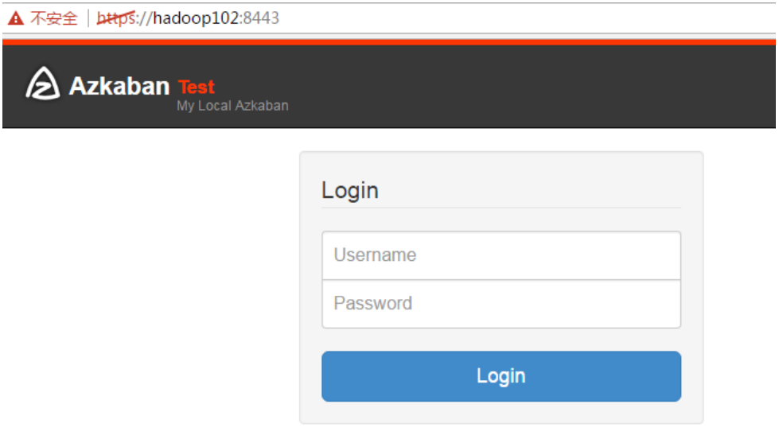

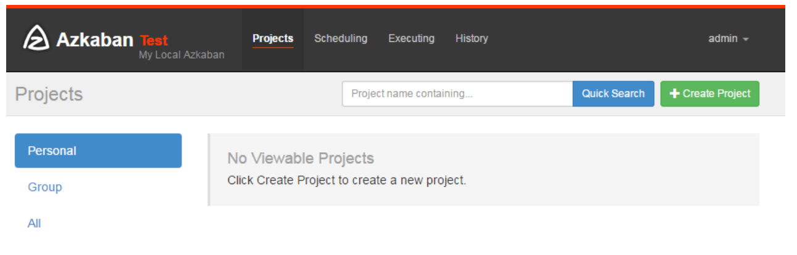

# 3. **Azkaban** **实战**

Azkaban 内置的任务类型支持 command、java

## 3.1 **单一** **job** **案例**

1. 创建 job 描述文件

   ```bash
   [atguigu@hadoop102 jobs]$ vim first.job
   #first.job
   type=command
   command=echo 'this is my first job'
   ```

2. 将 job 资源文件打包成 zip 文件

   ```bash
   [atguigu@hadoop102 jobs]$ zip first.zip first.job
   adding: first.job (deflated 15%)
   [atguigu@hadoop102 jobs]$ ll
   总用量 8
   -rw-rw-r--. 1 atguigu atguigu 60 10 月 18 17:42 first.job 
   -rw-rw-r--. 1 atguigu atguigu 219 10 月 18 17:43 first.zip
   ```

     注意：

   目前，Azkaban 上传的工作流文件只支持 xxx.zip 文件。zip 应包含 xxx.job 运行作业所需的文件和任何文件（文件名后缀必须以.job 结尾，否则无法识别）。作业名称在项目中必须是唯一的。

3. 通过 azkaban 的 web 管理平台创建 project 并上传 job 的 zip 包

   首先创建 project

   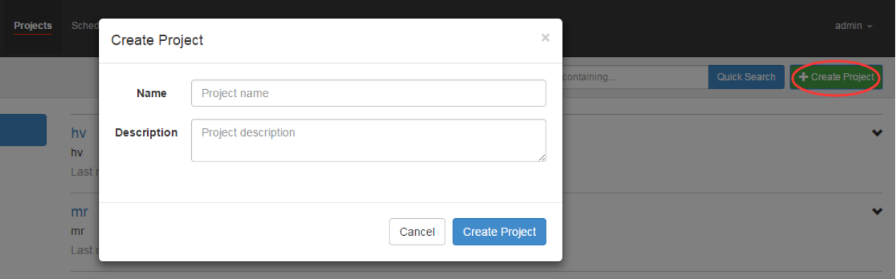

   上传 zip 包

   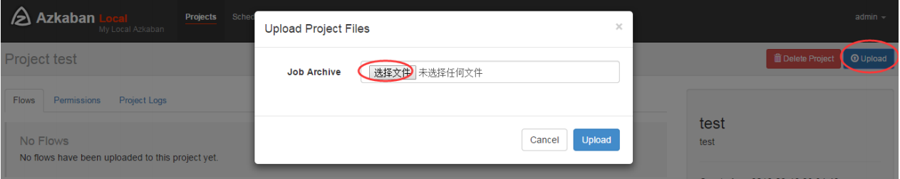

4. 启动执行该 job

   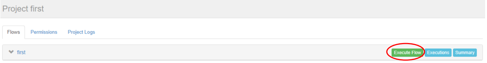

   点击执行工作流

   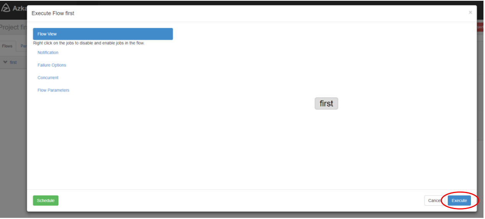

   点击继续

   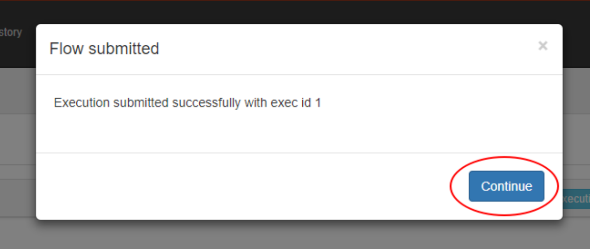

5. Job 执行成功

   

6. 点击查看 job 日志

   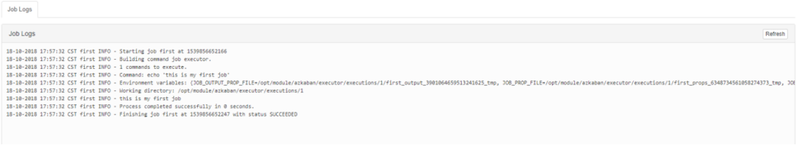


## 3.2 **邮件通知配置案例**

1. 修改配置文件

   修改 server 的 conf 下的 azkaban.properties 文件

   

2. 在网页上进行配置

   

   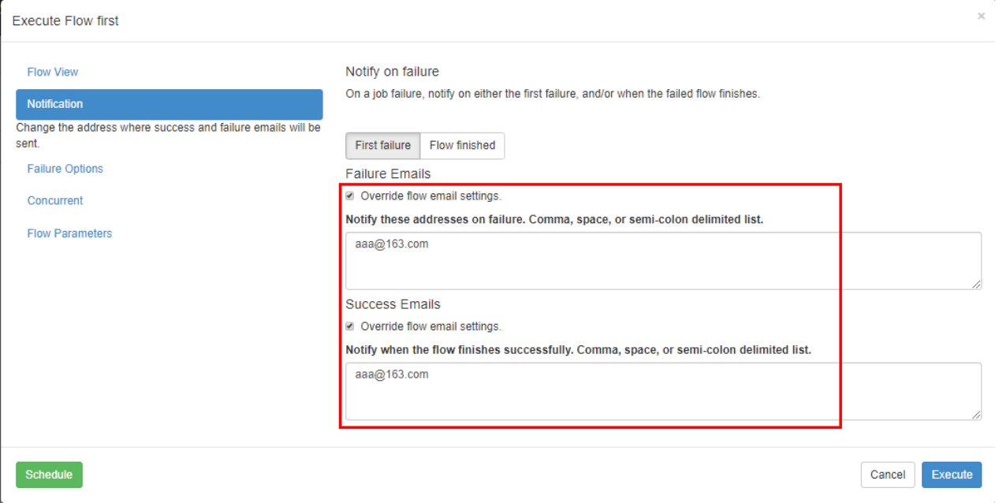

## 3.3 **多** **job** **工作流案例**

1. 创建有依赖关系的多个 job 描述

   第一个 job：start.job

   ```bash
   [atguigu@hadoop102 jobs]$ vim start.job
   ```

   ```bash
   #start.job
   type=command
   command=touch /opt/module/kangkang.txt
   ```

   第二个 job：step1.job 依赖 start.job

   ```bash
   [atguigu@hadoop102 jobs]$ vim step1.job
   #step1.job
   type=command
   dependencies=start
   command=echo "this is step1 job"
   ```

   第三个 job：step2.job 依赖 start.job

   ```bash
   [atguigu@hadoop102 jobs]$ vim step2.job
   #step2.job
   type=command
   dependencies=start
   command=echo "this is step2 job"
   ```

   第四个 job：finish.job 依赖 step1.job 和 step2.job

   ```bash
   [atguigu@hadoop102 jobs]$ vim finish.job
   #finish.job
   type=command
   dependencies=step1,step2
   command=echo "this is finish job"
   ```

2. 将所有 job 资源文件打到一个 zip 包中

   ```bash
   [atguigu@hadoop102 jobs]$ zip jobs.zip start.job step1.job step2.job 
   finish.job
   updating: start.job (deflated 16%)
   adding: step1.job (deflated 12%)
   adding: step2.job (deflated 12%)
   adding: finish.job (deflated 14%)
   ```

3. 在 azkaban 的 web 管理界面创建工程并上传 zip 包

   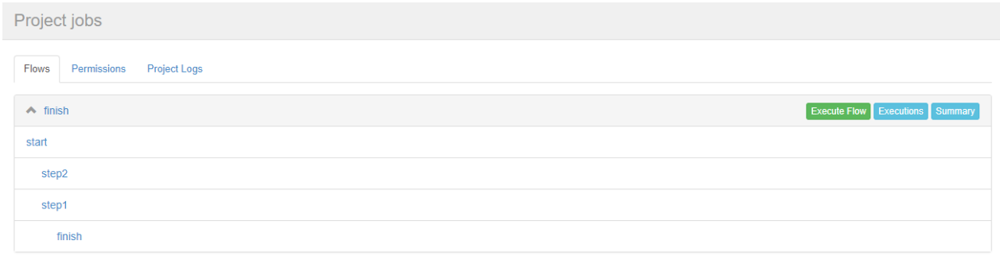

4. 启动工作流 flow

   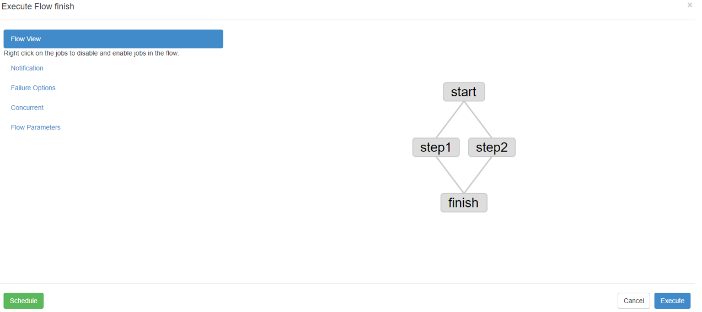

5. 查看结果

   

   思考：

   将 student.txt 文件上传到 hdfs，根据所传文件创建外部表，再将表中查询到的结果写入到本地文件

   

## 3.4 **Java** **操作任务**

使用 Azkaban 调度 java 程序

1. 编写 java 程序

   ```java
   import java.io.IOException;
   public class AzkabanTest {
   public void run() throws IOException {
   // 根据需求编写具体代码
   FileOutputStream fos = new 
   FileOutputStream("/opt/module/azkaban/output.txt");
   fos.write("this is a java progress".getBytes());
   fos.close();
   }
   public static void main(String[] args) throws IOException {
   AzkabanTest azkabanTest = new AzkabanTest();
   azkabanTest.run();
   } }
   ```

2. 将 java 程序打成 jar 包，创建 lib 目录，将 jar 放入 lib 内

   ```bash
   [atguigu@hadoop102 azkaban]$ mkdir lib
   [atguigu@hadoop102 azkaban]$ cd lib/
   [atguigu@hadoop102 lib]$ ll
   总用量 4 -rw-rw-r--. 1 atguigu atguigu 3355 10 月 18 20:55 azkaban-0.0.1-
   SNAPSHOT.jar
   ```

3. 编写 job 文件

   ```bash
   [atguigu@hadoop102 jobs]$ vim azkabanJava.job
   #azkabanJava.job
   type=javaprocess
   java.class=com.atguigu.azkaban.AzkabanTest
   classpath=/opt/module/azkaban/lib/*
   ```

4. 将 job 文件打成 zip 包

   ```bash
   [atguigu@hadoop102 jobs]$ zip azkabanJava.zip azkabanJava.job 
   adding: azkabanJava.job (deflated 19%)
   ```

5. 通过 azkaban 的 web 管理平台创建 project 并上传 job 压缩包，启动执行该 job

   

   ```bash
   [atguigu@hadoop102 azkaban]$ pwd
   /opt/module/azkaban
   [atguigu@hadoop102 azkaban]$ ll
   总用量 24
   drwxrwxr-x. 2 atguigu atguigu 4096 10 月 17 17:14 azkaban-2.5.0
   drwxrwxr-x. 10 atguigu atguigu 4096 10 月 18 17:17 executor
   drwxrwxr-x. 2 atguigu atguigu 4096 10 月 18 20:35 jobs
   drwxrwxr-x. 2 atguigu atguigu 4096 10 月 18 20:54 lib
   -rw-rw-r--. 1 atguigu atguigu 23 10 月 18 20:55 output
   drwxrwxr-x. 9 atguigu atguigu 4096 10 月 18 17:17 server
   [atguigu@hadoop102 azkaban]$ cat output 
   this is a java progress
   ```


## 3.5 **HDFS** **操作任务**

1. 创建 job 描述文件

   ```bash
   [atguigu@hadoop102 jobs]$ vim fs.job
   #hdfs job
   type=command
   command=/opt/module/hadoop-2.7.2/bin/hadoop fs -mkdir /azkaban
   ```

2. 将 job 资源文件打包成 zip 文件

   ```bash
   [atguigu@hadoop102 jobs]$ zip fs.zip fs.job 
   adding: fs.job (deflated 12%)
   ```

3. 通过 azkaban 的 web 管理平台创建 project 并上传 job 压缩包

4. 启动执行该 job

5. 查看结果

   

   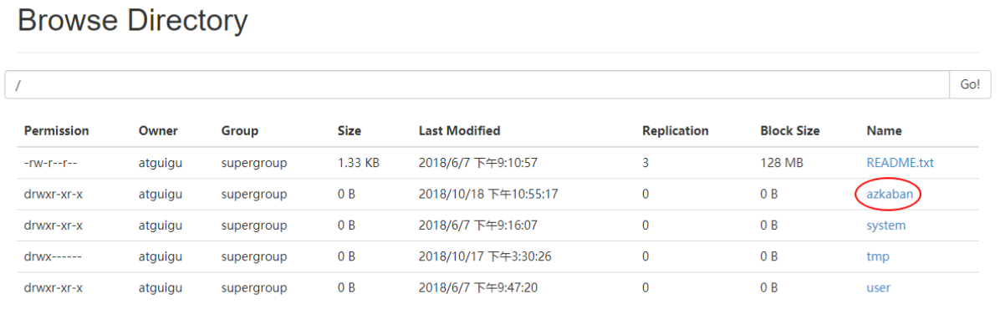


## 3.6  **MapReduce** **任务**

MapReduce 任务依然可以使用 Azkaban 进行调度

1. 创建 job 描述文件，及 mr 程序 jar 包

   ```bash
   [atguigu@hadoop102 jobs]$ vim mapreduce.job
   #mapreduce job
   type=command
   command=/opt/module/hadoop-2.7.2/bin/hadoop jar /opt/module/hadoop-
   2.7.2/share/hadoop/mapreduce/hadoop-mapreduce-examples-2.7.2.jar 
   wordcount /wordcount/input /wordcount/output
   ```

2. 将所有 job 资源文件打到一个 zip 包中

   ```bash
   [atguigu@hadoop102 jobs]$ zip mapreduce.zip mapreduce.job 
   adding: mapreduce.job (deflated 43%)
   ```

   

3. 在 azkaban 的 web 管理界面创建工程并上传 zip 包

4. 启动 job

5. 查看结果

   

   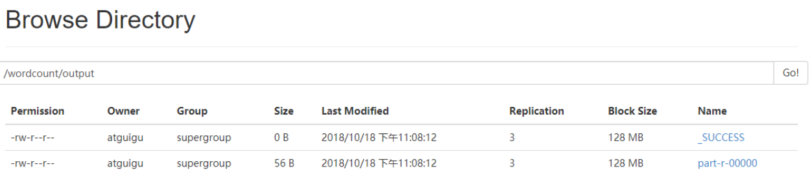

## 3.7 **Hive** **脚本任务**

1. 创建 job 描述文件和 hive 脚本

   （1）Hive 脚本：student.sql

   ```bash
   use default;
   drop table student;
   create table student(id int, name string)
   row format delimited fields terminated by '\t';
   load data local inpath '/opt/module/datas/student.txt' into table student;
   insert overwrite local directory '/opt/module/datas/student'
   row format delimited fields terminated by '\t'
   select * from student;
   ```

   （2）Job 描述文件：hive.job

   ```bash
   [atguigu@hadoop102 jobs]$ vim hive.job
   #hive job
   type=command
   command=/opt/module/hive/bin/hive -f 
   /opt/module/azkaban/jobs/student.sql
   ```

2. 将所有 job 资源文件打到一个 zip 包中

   ```bash
   [atguigu@hadoop102 jobs]$ zip hive.zip hive.job 
   adding: hive.job (deflated 21%)
   ```

3. 在 azkaban 的 web 管理界面创建工程并上传 zip 包

4. 启动 job

5. 查看结果

   ```bash
   [atguigu@hadoop102 student]$ cat /opt/module/datas/student/000000_0 
   1001 yangyang
   1002 huihui
   1003 banzhang
   1004 pengpeng
   ```

   

   


   


   

   


