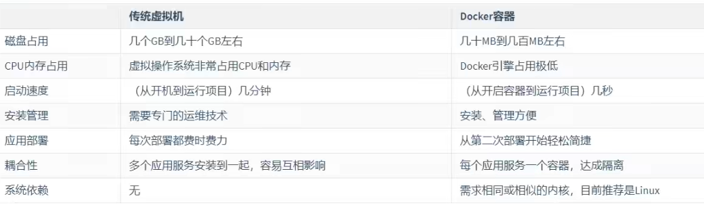
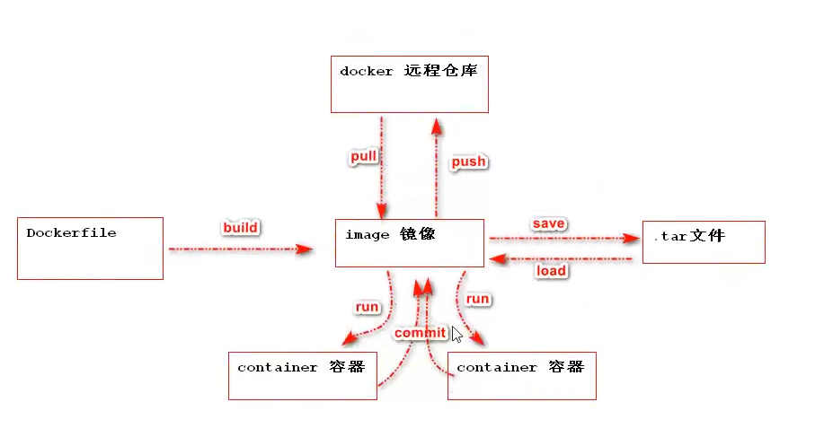
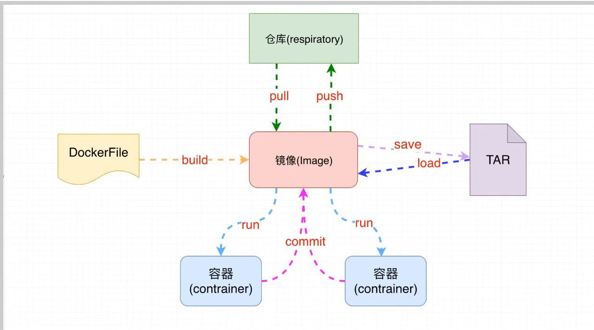
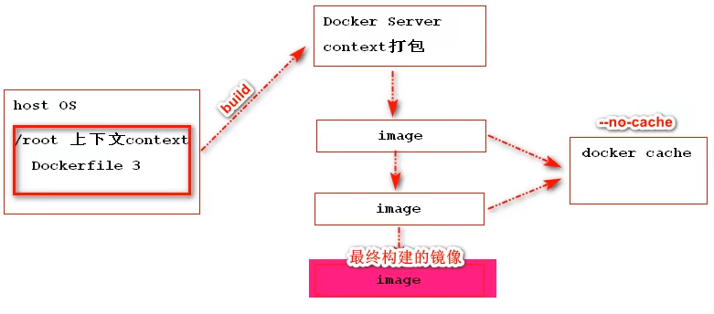
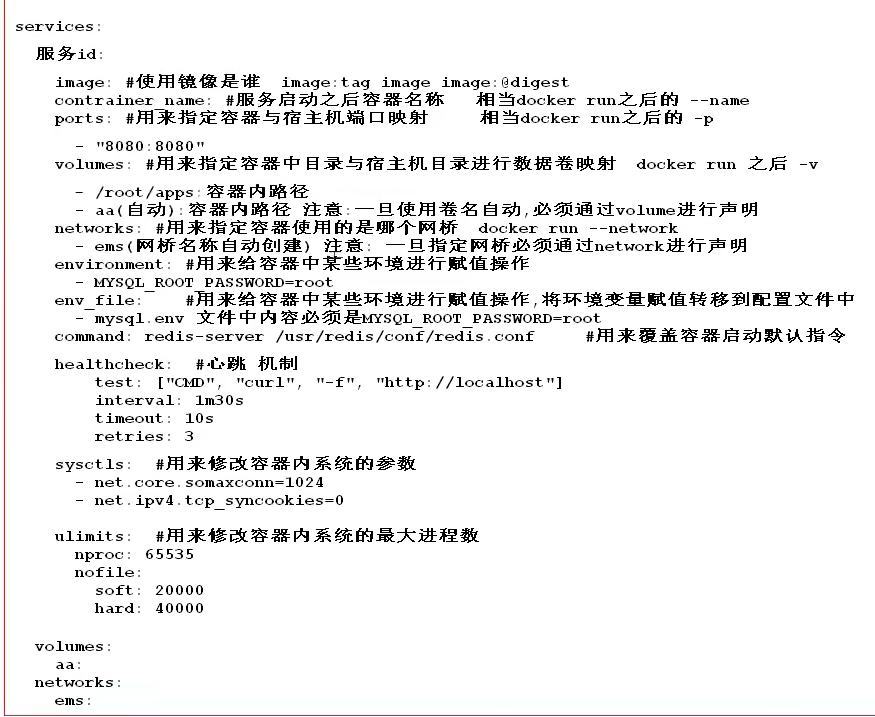

[TOC]

# 1. 简介

## 1.1 什么是docker?

docker就是容器技术

## 1.2 为什么是docker?

- 优势1:一致的运行环境，更轻松的迁移

  在开发的时候，在本地测试环境可以跑，生产环境跑不起来

- 优势2:对进程进行封装隔离，容器与容器之间互不影响，更高效地利用系统资源

  服务器自己的程序挂了，结果发现是别人程序出了问题把内存吃完了，自己的程序因为内存不够就挂了

- 优势3:通过镜像复制N多个环境一致容器

  公司要弄一个活动，可能会有大量的流量进来，公司需要再多部署几十台服务器

## 1.3 docker与虚拟机的对比

### 1.3.1 虚拟机缺点

- 虚拟机运行软件环境之前必须自身携带操作系统，本身很小的应用程序却因为携带了操作系统而变得非常大，很笨重
- 通过虚拟机在资源调度上经过很多步骤:在调用宿主机的CPU、磁盘等这些资源的时候，拿内存举例，虚拟机是利用Hypervisor去虚拟化内存，整个调用过程是虚拟内存->虚拟物理内存->真正物理内存


### 1.3.2 docker优点

- docker是不携带操作系统的，所以docker的应用就非常轻巧
- docker引擎分配资源直接是 虚拟内存-> 真正物理内存过程
- 

### 1.3.3 两者详细对比




# 2. docker的使用

## 2.1 安装

docker引擎支持主流操作系统 window macOS linux unix

### 2.2.1 bash安装(通用所有平台)

```bash
curl -fsSL get.docker.com -o get-docker.sh

```

## 2.2 启停

### 2.2.1 启动docker服务

```bash
systemctl start docker
```

### 2.2.2 关闭docker服务

```bash
systemctl stop docker
```

### 2.2.3 查看docker的状态

```bash
systemctl status docker
```

### 2.2.4 重启docker服务

```bash
systemctl restart docker
```

### 2.2.5 检查docker是否启动成功

```bash
docker info # 查看docker引擎的版本
```

### 2.2.6 配置开机启动

```bash
systemctl enable docker
```

### 2.2.7 创建docker所属的组

```bash
```


# 3. 核心概念与架构

## 3.1 镜像(image)

### 3.1.1 定义

一个镜像代表着一个软件，如:mysql镜像、redis镜像、 nginx镜像...

### 3.1.2 特点

只读

## 3.2 容器(container)

### 3.2.1 定义

基于某个镜像启动的一个实例称为镜像也可以称之为一个服务

### 3.2.2  特点

可读可写

## 3.3 仓库(repository)

### 3.3.1 定义

用来存储docker中的所有镜像的具体位置

### 3.3.2 远程仓库

docker在世界范围维护一个唯一远程仓库

### 3.3.3 本地仓库

当前自己机器中下载镜像的存储位置


## 3.4 镜像下载加速

```bash
sudo mkdir -p /etc/docker
sudo tee /etc/docker/daemon.json <<-'EOF'
{
  "registry-mirrors": ["https://u9vfcrhl.mirror.aliyuncs.com"]
}
EOF
sudo systemctl daemon-reload
sudo systemctl restart docker
```


## 3.5 容器的运行

```bash
docker run 镜像名 # 根据run后面镜像运行一个容器
```

在运行之前先在自己本地仓库中查找对应的镜像，找到的话直接使用，找不到自动去远程仓库下载


## 3.6 docker引擎的相关操作

- `docker info`

  展示docker信息

- `docker version`

  查看docker版本信息

- `docker --help`或者`docker`

  查看docker所有帮助命令

- 执行命令的格式

  `docker [OPTIONS] COMMAND`

  

## 3.7 操作镜像相关的命令

### 3.7.1 查看本机中所有镜像

`docker  images`

- `-a`

  列出所有镜像(包含中间映像层)

- `-q`

  只显示镜像id

### 3.7.2 搜索镜像

`docker search [options] 镜像名`

- `-s 指定值`

  列出收藏数不少于指定值的镜像

- `--no-trunc`

  显示完整的镜像信息

### 3.7.3 从仓库下载镜像

`docker pull 镜像名[:TAG|@DIGEST]`


### 3.7.4 删除镜像

`docker rm 镜像名`

- `-f`

  强制删除

简化写法：`docker rmi 镜像名`


## 3.8 容器相关操作命令

### 3.8.1 查看当前运行的容器

`docker ps`

每一列的含义如下:

- `CONTAINER ID`

  容器id

- `IMAGE`

  基于哪个镜像创建的容器

- `COMMAND`

  容器内执行的命令

- `CREATED`

  容器创建时间

- `STATUS`

  容器当前状态(up/down)

- `PORTS`

  容器内当前服务监听的端口

- `NAMES`

  容器名称

添加`-a`参数可以查看所有运行过的容器

`-q`参数 返回正在运行的容器id

`-qa`参数 返回所有容器的id


### 3.8.2 宿主机端口与容器中端口进行映射

`docker run -p 系统上外部端口号 : 容器内服务监听的端口 镜像名`

注意`-p`可以书写多个，例如:

`docker run -p 系统上外部端口号 : 容器内服务监听的端口 -p 系统上外部端口号 : 容器内服务监听的端口 镜像名`

### 3.8.3 后台启动容器

添加`-d`参数

### 3.8.4 指定容器名称

`docker run --name 容器名称  镜像名称`

### 3.8.5 启停容器

- 开启容器

  `docker start 容器名字或者容器id`

- 重启容器

  `docker restart 容器名或者人容器id`

- 正常停止容器运行

  `docker stop 容器名或者容器id`

- 立即停止容器运行

  `docker kill 容器名或者容器id`

### 3.8.6 删除容器

- 删除容器

  `docker rm -f 容器id或容器名`

- 删除所有容器

  `docker rm -f $(docker ps -aq)`

### 3.8.7 查看容器内进程

`docker top 容器id或者容器名`


### 3.8.8 查看容器内部细节

`docker inspect 容器id`


### 3.8.9 查看容器的运行日志

`docker logs [options] 容器id或者容器名`

- `-t`

  加入时间戳

- `-f`

  跟随最新的日志打印

- `--tail 数字`

  显示最后多少条

### 3.8.10 进入容器内部

`docker exec [options] 容器id 容器内命令`

- `-i`

  以交互模型运行容器，通常与`-t`一起使用

- `-t`

  分配一个伪终端 shell窗口 bash

### 3.8.11 容器和宿主机之间复制文件

- 将宿主机复制到容器内部

  `docker cp 文件或目录 容器id:容器路径`

- 将容器内资源拷贝到主机上

  `docker cp 容器id:容器内资源路径 宿主机目录路径`

### 3.8.12 数据卷(volum)实现与宿主机共享目录

`docker run -v 宿主机的路径|任意别名:/容器内的路径 镜像名`

注意:

1. 如果是宿主机路径必须是绝对路径，宿主机目录会覆盖容器内目录内容
2. 如果是别名则会在docker运行容器时自动在宿主机中创建一个目录，并将容器目录文件复制到宿主机中

### 3.8.13 打包镜像

`docker save 镜像名 -o 名称.tar`


### 3.8.14 载入镜像

`docker load -i 名称.tar`

### 3.8.15 容器打包成新的镜像

`docker commit -m "描述信息" -a "作者信息" (容器id或者名称) 打包的镜像名称:标签`


## 3.9 docker镜像分层原理

### 3.9.1 镜像为什么这么大？

一个软件镜像不仅仅是原来的软件包，镜像包含软件所需要的操作系统依赖、软件自身依赖以及自身软件包

### 3.9.2 为什么docker镜像采用分层镜像原理

docker在设计镜像时每一个镜像都是由n个镜像共同组成

底层原理是UnionFS:

Union文件系统是一种分层，轻量级并且高性能的文件系统，它支持对文件系统的修改作为一次提交来一层层地叠加，同时可以将不同目录挂载到同一个虚拟文件系统下。Union文件系统是Docker镜像的基础。这种文件系统特性:就是一次同时加载多个文件系统，但从外面看起来，只能看到一个文件系统，联合加载会把各层文件系统叠加起来，这样最终的文件系统会包含所有底层的文件和目录

### 3.9.3 为什么采用UnionFS

最大的一个好处就是资源共享，采用分层机制实现基础层共享，从而减小docker仓库整体体积

## 3.10 docker容器之间的网络配置

一般在使用docker网桥(bridge)实现容器与容器通信时，都是站在一个应用角度进行容器通信

### 3.10.1 查看docker网桥配置

`docker network ls`

### 3.10.2 创建自定义网桥

`docker create 网桥名称`

注意:一旦在启动容器时指定了网桥之后，日后可以在任何这个网桥关联的容器中使用容器名字进行与其他容器通信

### 3.10.3 删除网桥

`docker network rm 网桥名称`


## 3.11 数据卷

### 3.11.1  特点

- 数据卷可以在容器之间共享和重用
- 对数据卷的修改会立马生效
- 对数据卷的更新不会影响镜像
- 数据卷默认会一直存在，即使容器被删除

### 3.11.2 自定义数据卷目录

`docker run -v 绝对路径:容器内路径`

### 3.11.3 自动创建数据卷

`docker run -v 卷名:容器内路径`

### 3.11.4 docker操作数据卷的指令

- 查看数据卷

  `docker volume ls`

- 查看某个数据卷的细节

  `docker volume inspect 卷名`

- 创建数据卷

  `docker volume crete 卷名`

- 删除所有没有使用的数据卷

  `docker volume prune`

  

## 3.12 核心架构




# 4. 常用服务的安装

## 4.1 安装MySQL

### 4.1.1 拉取MySQL镜像到本地

```bash
docker pull mysql:tag(tag不加默认最新版本)
```

### 4.1.2 运行MySQL服务

- 没有暴露外部端口外部不能连接

  ```bash
  docker run --name mysql -e MYSQL_ROOT_PASSWORD=root -d mysql:tag
  ```

  

- 暴露外部端口

  ```bash
  docker run --name mysql -e MYSQL_ROOT_PASSWORD=root -p 3306:3306 -d mysql:tag
  ```

`-e MYSQL_ROOT_PASSWORD=root`表示给root用户指定密码


### 4.1.3 进入MySQL容器

```bash
docker exec -it 容器名称|容器id bash
```

### 4.1.4 外部查看MySQL日志

```bash
docker logs 容器名称|容器id
```

### 4.1.5 使用自定义配置参数

```bash
docker run --name mysql -v /root/mysql/conf.d:/etc/mysql/conf.d -e MYSQL_ROOT_PASSWORD=root -d mysql:tag
```

### 4.1.6 将容器数据位置与宿主机位置挂载保证数据安全

```bash
docker run --name mysql -v /root/mysql/data:/var/lib/mysql -v /root/mysql/conf.d:/etc/mysql/conf.d:/etc/mysql/conf.d -e MYSQL_ROOT_PASSWORD=root -p 3306:3306 -d mysql:tag
```


### 4.1.7 通过其他客户端访问 


### 4.1.8 将MySQL数据库备份为sql文件

### 4.1.9 执行sql文件到mysql中

```bash
docker exec -i mysql sh -c ' exec mysql -uroot -p"$MYSQL_ROOT_PASSWORD"' < /root/xxx.sql
```


## 4.2 安装tomcat

### 4.2.1 下载tomcat

```bash
docker pull tomcat:tag
```

### 4.2.2 启动tomcat

- 基本启动

  ```bash
  docker run -d -p 8081:8080 --name tomcat tomcat:tag
  ```

- 将部署应用目录通过数据卷挂载到宿主机系统

  注意：部署web应用在容器中目录为`/usr/local/tomcat/webapps`

               配置文件在`/usr/local/tomcat/conf`


## 4.3 安装redis

### 4.3.1 下载镜像

```bash
docker pull redis:tag
```

### 4.3.2 启动redis

- 基本启动

  ```bash
  docker run -d -p 6379:6379 --name redis redis:tag
  ```

### 4.3.3 开启redis持久化

```bash
docker run --name some-redis -d redis:tag redis-server	--appendonly yes
```

注意:一旦开启持久化之后，持久化生成aof文件会被放入容器/data目录中

### 4.3.4 修改redis配置文件，以配置文件方式启动

```bash
docker run -p 6380:6379 -v /root/redisconf:/usr/local/etc/redis --name myredis -d redis:tag redis-server /usr/local/etc/redis/redis.conf
```

注意:在当前`/root/redisconf`目录中存在redis.conf配置文件

## 4.4 安装ES

### 4.4.1 下载镜像

```bash
docker pull elasticsearch:tag
```

### 4.4.2 运行镜像

```bash
docker run -d --name elasticsearch -p 9200:9200 -p 9300:9300 elasticsearch:tag
```

### 4.4.3 持久化方案

注意:ES中所有数据都在容器中`/usr/share/elasticsearch/data`

```bash
docker run -d --name elasticsearch -p 9200:9200 -p 9300:9300 -v esdata:/usr/share/elasticsearch/data -v esconf:/usr/share/elasticsearch/config elasticsearch:tag
```

### 4.4.4 插件安装

```bash
docker run -d --name elasticsearch -p 9200:9200 -p 9300:9300 \
-v esdata:/usr/share/elasticsearch/data \
-v esconf:/usr/share/elasticsearch/config \
-v esplugins:/usr/share/elasticsearch/plugins \
elasticsearch:tag

```

## 4.5 安装Kibana

### 4.5.1 下载Kibana

```bash
docker pull kibana:tag
```

### 4.5.2 运行Kibana

- 简单运行

  ```bash
  docker run -d --name kibana -p 5601:5601 kibana:tag
  ```

- 启动kibana并连接es

  ```bash
  docker run -d --name kibana -p 5601:5601 -e ELASTICSEARCH_URL=http://Hadoop02:9200 kibana:tag
  ```

### 4.5.3 kibana加载配置文件启动

```bash
docker run -d --name kibana -p 5601:5601 -v kibanaconf:/usr/share/kibana/config kibana:tag
```

注意：日后可以在kibanaconf数据卷所在目录中加入kibana.yml文件修改配置信息


# 5. Dockerfile

## 5.1 什么是Dockerfile

Dockerfile可以认为是Docker镜像的描述文件，是由一系列命令和参数构成的脚本。主要作用是用来构建docker镜像的构建文件



通过上面的架构图可以看出Dockerfile可以直接构建镜像

定义：

用来帮助我们自己构建一个自定义镜像 Dockerfile称为镜像构建文件 描述文件


## 5.2 为什么存在Dockerfile

问题：在dockerhub中官方提供的很多镜像已经能满足我们的所有服务了，为什么还需要自定义镜像？

核心作用:用户可以将自己的应用打包成镜像，这样就可以让我们的应用在容器中运行


## 5.3 Dockerfile构建镜像原理




## 5.4 Dockerfile的使用


## 5.5 Dockerfile的保留命令



| 保留字     |                             作用                             |
| ---------- | :----------------------------------------------------------: |
| FROM       |        当前镜像是基于的哪个镜像 第一个指令必须是FROM         |
| MAINTAINER |                  镜像维护者的姓名和邮箱地址                  |
| RUN        |                   构建镜像时需要运行的指令                   |
| EXPOSE     |                  当前容器对外暴露出的端口号                  |
| WORKDIR    |   指定在创建容器后，终端默认登录进来的工作目录，一个落脚点   |
| ENV        |               用来在构建镜像过程中设置环境变量               |
| ADD        | 将宿主机目录下的文件拷贝进镜像且ADD命令会自动处理URL和解压tar包 |
| COPY       | 类似于ADD,拷贝文件和目录到镜像中，将从构建上下文目录中<原路径>的文件/目录复制到新的一层镜像内的<目标路径>位置 |
| VOLUME     |             容器数据卷，用于数据保存和持久化工作             |
| CMD        | 指定一个容器启动时要运行的命令，Dockerfile中可以有多个CMD指令，但只有最后一个生效，CMD会被docker run 之后的参数替换 |
| ENTRYPOINT | 指定一个容器启动时要运行的命令，ENTRYPOINIT的目的和CMD一样，都是在指定容器启动程序及其参数 |

### 5.5.1 FROM 命令

- 基于哪个镜像构建新的镜像，在构建时会自动从docker hub拉取base镜像 必须作为Dockerfile的第一个指令出现

- 语法

  ```bash
  FROM <image>
  FROM <image>[:<tag>] 使用版本不写为latest
  FROM <image>[@<digest>] 使用摘要
  ```

### 5.5.2 MAINTAINER命令

- 镜像维护者的姓名和邮箱地址[废弃]

- 语法

  ```bash
  MAINTAINER <name>
  ```

### 5.5. 3 RUN 命令

- RUN指令将在当前映像之上的新层中执行任何命令并提交结果。生成的提交映像将用于Dockerfile中的下一步

- 语法

  ```bash
  RUN <command> (shell form,the command is run in a shell,which by default is /bin/sh -c on Linux or cmd /S /C on windows)
  RUN echo hello
  
  RUN ["executable","param1","param2"](exec form)
  RUN ["/bin/bash","-c","echo hello"]
  ```

### 5.5.4 EXPOSE 命令

- 用来指定构建的镜像在运行为容器时对外暴露的端口

- 语法

  ```bash
  EXPOSE 80/tcp 如果没有显式指定则默认暴露都是tcp
  EXPOSE 80/udp
  ```

### 5.5.5 CMD命令

- 用来为启动的容器指定执行的命令，在Dockerfile中只能有一条CMD指令。如果列出多个命令，则只有最后一个命令才会生效

- 语法

  ```bash
  CMD ["executable","param1","param2"] (exec form,this is the preferred form)
  CMD ["param1","param2"] (as default parameters to ENTRYPOINT)
  CMD command param1 param2 (shell form)
  ```

### 5.5.6 WORKDIR命令

- 用来为Dockerfile中的任何RUN、CMD、ENTRYPOINT、COPY和ADD指令设置工作目录。如果WORKDIR不存在，即使它没有在任何后续Dockerfile指令中使用，它也将被	创建

- 语法

  ```bash
  WORKDIR /path/to/workdir
  
  WORKDIR /a
  WORKDIR b
  WORKDIR c
  ```

  注意:WORKDIR指令可以在Dockerfile中多次使用。如果提供了相对路径，则该路径将与先前WORKDIR指令的路径相对

### 5.5.7 COPY命令

- 用来将context目录中指定文件复制到镜像的指定目录中

- 语法

  ```bash
  COPY src dest
  COPY ["<src>",..."<dest>"]
  ```

### 5.5.8 ADD命令

- 用来从context上下文复制新文件、目录或远程url，并将它们添加到位于指定路径的映像文件系统中

- 语法

  ```bash
  ADD hom* /mydir/ 通配符添加多个文件
  ADD hom?.txt /mydir/ 通配符添加
  ADD test.txt relativeDir/ 可以指定相对路径
  ADD test.txt /absoluteDir/ 也可以指定绝对路径
  ADD url
  ```

### 5.5.9 VOLUME命令

- 用来定义容器运行时可以挂载在宿主机的目录

- 语法:

  ```bash
  VOLUME ["/data"]
  ```

### 5.5.10 ENTRYPOINT命令

- 用来指定容器启动时执行命令 和CMD类似

- 语法:

  ```bash
  CMD ["executable","param1","param2"]
  ENTRYPOINT command param1 param2
  ```

  ENTRYPOINT 指令往往用于设置容器启动后的第一个命令，这对一个容器来说往往是固定的

  CMD指令，往往用于设置容器启动的第一个命令的默认参数，这对一个容器来说可以是变化的

### 5.5.11 ENV命令

- 用来为构建镜像设置环境变量。这个值将出现在构建阶段中所有后续指令的环境中

- 语法:

  ```bash
  ENV <key> <value>
  ENV <key>=<value>...
  ```

  


# 6. IDEA插件安装


# 7. Docker Compose

## 7.1 简介

Compose项目是Docker官方的开源项目，负责实现对Docker容器集群的快速编排。从功能上看，跟OpenStack中的Heat十分类似，其代码目前在https://github.com/docker/compose上开源

Compose定位是 定义和运行多个Docker容器的应用，其前身是开源项目Fig

我们知道使用一个Dockerfile模板文件可以让用户很方便地定义一个单独的应用容器。然而，在日常工作中，经常会碰到需要多个容器相互配合来完成某项任务的情况。例如要实现一个Web项目，除了Web服务容器本身，往往还需要再加上后端的数据库服务容器，甚至还包括负载均衡容器等。

Compose恰好满足了这样的需求。它允许用户通过一个单独的docker-compose.yml模板文件(YAML格式)来定义一组相关的应用容器为一个项目(project)

Compose中有两个重要的概念:

- 服务(service):一个应用的容器，实际上可以包括若干运行相同镜像的容器实例
- 项目(project):由一组关联的应用容器组成的一个完整业务单元，在docker-compose.yml文件中定义

Compose的默认管理对象是项目，通过子命令对项目中的一组容器进行便捷地声明周期管理

Compose项目由Python编写，实现上调用了Docker服务提供的API来对容器进行管理。因此只要所操作的平台支持Docker API,就可以在其上利用Compose来进行编排管理。


## 7.2 Compose的使用

### 7.2.1 下载安装docker-compose

```bash
yum -y install epel-release
yum -y install python-pip
pip3 install --upgrade pip
pip3 install docker-compose 
# 验证是否下载安装成功
docker-compose version
```

### 7.2.2 创建docker-compose程序

1. 创建一个docker-compose.yml文件
2. 在配置文件中定义一个项目存在哪些服务 


## 7.3 模板命令总结



## 7.4 docker compose中的指令

### 7.4.1 compose模板指令和指令区别

模板指令：用来书写在docker-compose.yml文件中的指令称之为模板指令，用来为服务进行服务的
指令:用来对整个docker-compose.yml对应的这个项目进行操作，书写在docker-compose命令之后，例如

`docker-compose up (指令)`


### 7.4.2 常用指令

1. up指令

   作用:用来启动所有docker-compose服务

   选项:`-d` 后台启动所有服务

2. down指令

   停止up命令所启动的容器并移出网络

3. exec指令

   进入指定的容器

   例如:`docker-compose exec docker-compose.yml中声明的服务id bash` 

4. ps指令

   格式为`docker-compose ps [options] [SERVICE...]`

   列出项目中目前的所有容器

   选项:

   - `-q` 只打印容器的ID信息

5. restart指令

   格式为`docker-compose restart [options] [SERVICE...]`

   重启项目中的服务

   选项：

   - `-t,--timeout TIMEOUT`指定重启前停止容器的超时(默认为10秒)

6. rm指令

   格式为`docker-compose rm [options] [SERVICE...]`

   删除所有(停止状态的)服务容器。推荐先执行`docker-compose stop`命令来停止容器

   选项:

   - `-f,--force`强制直接删除，包括非停止状态的容器。一般尽量不要使用该选项
   - `-v`删除容器所挂载的数据卷

7. start指令

   格式为`docker-compose start [SERVICE...]`

   启动已经存在的服务容器

8. stop指令

   格式为`docker-compose stop [options] [SERVICE...]`

   停止已经处于运行状态的容器，但不删除它，通过`docker-compose start`可以再次启动这些容器

   选项：

   `-t,--timeout TIIMEOUT`停止容器时的超时时间(默认为10秒)

9. top指令

   查看各个服务容器内运行的进程

10. unpause

    格式为`docker-compose unpause [SERVICE...]`

    恢复处于暂停状态中的服务

# 8. 可视化工具

## 8.1 基本使用

### 8.1.1 下载可视化工具

```bash
docker pull portainer/portainer
```

### 8.1.2 启动portainer

```bash
docker run -d -p 8000:8000 -p 9441:9000 --name=portainer2 --restart=always -v /var/run/docker.sock:/var/run/docker.sock -v portainer_data:/data portainer/portainer
```


   
