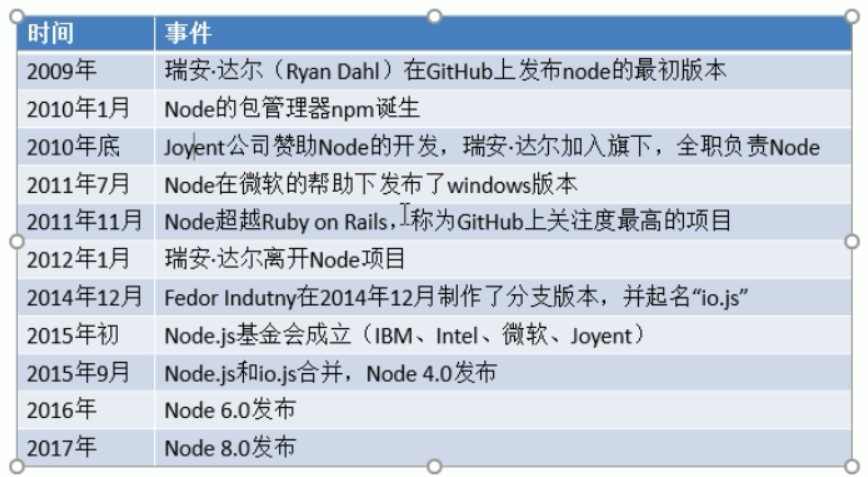

[TOC]

# 1. 概述

## 1.1 简介

- Node.js是一个能够在服务器端运行JavaScript的开放源代码、跨平台JavaScript运行环境
- Node采用Google开发的V8引擎运行JS代码，使用事件驱动、非阻塞和异步I/O模型等技术来提高性能，可优化应用程序的传输量和规模
- Node大部分基本模块都用JavaScript编写。在Node出现之前，JS通常作为客户端程序设计语言使用，以JS写出的程序常在用户的浏览器上运行
- 目前，Node已被IBM、Microsoft、Yahoo!、Walmart、Groupon、SAP、LinkedIn、Rakuten、PayPal、Voxert和GoDaddy等企业采用

## 1.2 Node的历史




## 1.3 用途

- Web服务API,比如REST
- 实时多人游戏
- 后端的Web服务，例如跨域、服务器端的请求
- 基于Web的应用
- 多客户端的通信，如即时通信


## 1.4 CommonJs规范

ECMAScript标准的缺陷：

- 没有模块系统
- 标准库较少
- 没有标准接口
- 缺乏管理系统

### 1.4.1 什么是模块

- 在node中，一个JS文件就是一个模块

模块分为两大类:

- 核心模块

  由node引擎提供的模块，核心模块的标识就是模块的名字

- 文件模块

  由用户自己创建的模块，文件模块的标识就是文件的路径(绝对路径或者相对路径)

在node中有一个全局对象 global,它的作用和网页中window类似，在全局中创建的变量都会作为global的属性保存，在全局中创建的函数都会作为global的方法保存

### 1.4.2 引入模块

在node中，通过require()函数来引入外部的模块

使用require()引入模块以后，该函数会返回一个对象，这个对象代表的是引入的模块

在node中，每一个JS文件中的JS代码都是独立运行在一个函数中，而不是全局作用域，所以一个模块中的变量和函数在其他模块中无法访问

可以通过exports来向外部暴露变量和方法，只需要将需要暴露给外部的变量或方法设置为exports的属性即可

```javascript
exports.x="我是x";
```

该看08

