[TOC]

# 1. HDFS概述

## 1.1 HDFS产生背景及定义


## 1.2 HDFS优缺点

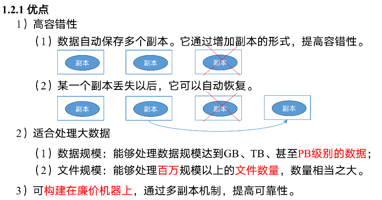

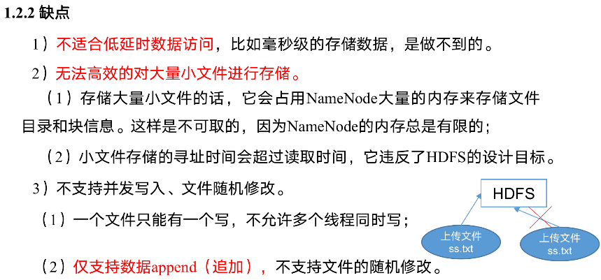

## 1.3 HDFS组成架构

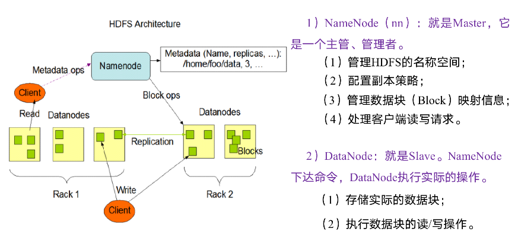


## 1.4 HDFS文件块大小（面试重点）


# 2. HDFS的Shell操作（开发重点）

## 2.1 基本语法

```bash
bin/hadoop fs 具体命令   OR  bin/hdfs dfs 具体命令
dfs是fs的实现类。
```

## 2.2 命令大全

```bash
[atguigu@hadoop102 hadoop-2.7.2]$ bin/hadoop fs

[-appendToFile <localsrc> ... <dst>]
        [-cat [-ignoreCrc] <src> ...]
        [-checksum <src> ...]
        [-chgrp [-R] GROUP PATH...]
        [-chmod [-R] <MODE[,MODE]... | OCTALMODE> PATH...]
        [-chown [-R] [OWNER][:[GROUP]] PATH...]
        [-copyFromLocal [-f] [-p] <localsrc> ... <dst>]
        [-copyToLocal [-p] [-ignoreCrc] [-crc] <src> ... <localdst>]
        [-count [-q] <path> ...]
        [-cp [-f] [-p] <src> ... <dst>]
        [-createSnapshot <snapshotDir> [<snapshotName>]]
        [-deleteSnapshot <snapshotDir> <snapshotName>]
        [-df [-h] [<path> ...]]
        [-du [-s] [-h] <path> ...]
        [-expunge]
        [-get [-p] [-ignoreCrc] [-crc] <src> ... <localdst>]
        [-getfacl [-R] <path>]
        [-getmerge [-nl] <src> <localdst>]
        [-help [cmd ...]]
        [-ls [-d] [-h] [-R] [<path> ...]]
        [-mkdir [-p] <path> ...]
        [-moveFromLocal <localsrc> ... <dst>]
        [-moveToLocal <src> <localdst>]
        [-mv <src> ... <dst>]
         [-put [-f] [-p] <localsrc> ... <dst>]
        [-renameSnapshot <snapshotDir> <oldName> <newName>]
        [-rm [-f] [-r|-R] [-skipTrash] <src> ...]
        [-rmdir [--ignore-fail-on-non-empty] <dir> ...]
        [-setfacl [-R] [{-b|-k} {-m|-x <acl_spec>} <path>]|[--set <acl_spec> <path>]]
        [-setrep [-R] [-w] <rep> <path> ...]
        [-stat [format] <path> ...]
        [-tail [-f] <file>]
        [-test -[defsz] <path>]
        [-text [-ignoreCrc] <src> ...]
        [-touchz <path> ...]
        [-usage [cmd ...]]
```

## 2.3 常用命令实操

1. 启动Hadoop集群（方便后续的测试）

   ```bash
   sbin/start-dfs.sh
   sbin/start-yarn.sh
   ```

2. -help：输出这个命令参数

   ```bash
   hadoop fs -help rm
   ```

3. -ls: 显示目录信息

   ```bash
   hadoop fs -ls /
   ```

4. -mkdir：在HDFS上创建目录

   ```bash
   hadoop fs -mkdir -p /sanguo/shuguo
   ```

5. -moveFromLocal：从本地剪切粘贴到HDFS

   ```bash
   touch kongming.txt
   hadoop fs  -moveFromLocal  ./kongming.txt  /sanguo/shuguo
   ```

6. -appendToFile：追加一个文件到已经存在的文件末尾

   ```bash
   touch liubei.txt
   vi liubei.txt
   ```

   ```bash
   输入
   san gu mao lu
   ```

   ```bash
   hadoop fs -appendToFile liubei.txt /sanguo/shuguo/kongming.txt
   ```

7. -cat：显示文件内容

   ```bash
   hadoop fs -cat /sanguo/shuguo/kongming.txt
   ```

8. -chgrp 、-chmod、-chown：Linux文件系统中的用法一样，修改文件所属权限

   ```bash
   hadoop fs  -chmod  666  /sanguo/shuguo/kongming.txt
   hadoop fs  -chown  atguigu:atguigu   /sanguo/shuguo/kongming.txt
   ```

9. -copyFromLocal：从本地文件系统中拷贝文件到HDFS路径去

   ```bash
   hadoop fs -copyFromLocal README.txt /
   ```

10. -copyToLocal：从HDFS拷贝到本地

    ```bash
    hadoop fs -copyToLocal /sanguo/shuguo/kongming.txt ./
    ```

11. -cp ：从HDFS的一个路径拷贝到HDFS的另一个路径

    ```bash
    hadoop fs -cp /sanguo/shuguo/kongming.txt /zhuge.txt
    ```

12. -mv：在HDFS目录中移动文件

    ```bash
    hadoop fs -mv /zhuge.txt /sanguo/shuguo/
    ```

13. -get：等同于copyToLocal，就是从HDFS下载文件到本地

    ```bash
    hadoop fs -get /sanguo/shuguo/kongming.txt ./
    ```

14. -getmerge：合并下载多个文件，比如HDFS的目录 /user/atguigu/test下有多个文件:log.1, log.2,log.3,...

    ```bash
    hadoop fs -getmerge /user/atguigu/test/* ./zaiyiqi.txt
    ```

15. -put：等同于copyFromLocal

    ```bash
    hadoop fs -put ./zaiyiqi.txt /user/atguigu/test/
    ```

16. -tail：显示一个文件的末尾

    ```bash
    hadoop fs -tail /sanguo/shuguo/kongming.txt
    ```

17. -rm：删除文件或文件夹

    ```bash
    hadoop fs -rm /user/atguigu/test/jinlian2.txt
    ```

18. -rmdir：删除空目录

    ```bash
    hadoop fs -mkdir /test
    hadoop fs -rmdir /test
    ```

19. -du统计文件夹的大小信息

    ```bash
    hadoop fs -du -s -h /user/atguigu/test
    
    2.7 K  /user/atguigu/test
    
    hadoop fs -du  -h /user/atguigu/test
    
    1.3 K  /user/atguigu/test/README.txt
    15     /user/atguigu/test/jinlian.txt
    1.4 K  /user/atguigu/test/zaiyiqi.txt
    ```

20. -setrep：设置HDFS中文件的副本数量

    ```bash
    hadoop fs -setrep 10 /sanguo/shuguo/kongming.txt
    ```

    

    这里设置的副本数只是记录在NameNode的元数据中，是否真的会有这么多副本，还得看DataNode的数量。因为目前只有3台设备，最多也就3个副本，只有节点数的增加到10台时，副本数才能达到10

# 3. HDFS客户端操作（开发重点）

## 3.1 HDFS客户端环境准备

1. 根据自己电脑的操作系统拷贝对应的编译后的hadoop jar包到非中文路径（例如：D:\Develop\hadoop-2.7.2）
   

2. 配置HADOOP_HOME环境变量
   

3. 配置Path环境变量
   

4. 创建一个Maven工程HdfsClientDemo

5. 导入相应的依赖坐标+日志添加

   ```xml
   <dependencies>
   		<dependency>
   			<groupId>junit</groupId>
   			<artifactId>junit</artifactId>
   			<version>RELEASE</version>
   		</dependency>
   		<dependency>
   			<groupId>org.apache.logging.log4j</groupId>
   			<artifactId>log4j-core</artifactId>
   			<version>2.8.2</version>
   		</dependency>
   		<dependency>
   			<groupId>org.apache.hadoop</groupId>
   			<artifactId>hadoop-common</artifactId>
   			<version>2.7.2</version>
   		</dependency>
   		<dependency>
   			<groupId>org.apache.hadoop</groupId>
   			<artifactId>hadoop-client</artifactId>
   			<version>2.7.2</version>
   		</dependency>
   		<dependency>
   			<groupId>org.apache.hadoop</groupId>
   			<artifactId>hadoop-hdfs</artifactId>
   			<version>2.7.2</version>
   		</dependency>
   		<dependency>
   			<groupId>jdk.tools</groupId>
   			<artifactId>jdk.tools</artifactId>
   			<version>1.8</version>
   			<scope>system</scope>
   			<systemPath>${JAVA_HOME}/lib/tools.jar</systemPath>
   		</dependency>
   </dependencies>
   ```

   注意：如果Eclipse/Idea打印不出日志，在控制台上只显示如下内容

   ```bash
   1.log4j:WARN No appenders could be found for logger (org.apache.hadoop.util.Shell).  
   2.log4j:WARN Please initialize the log4j system properly.  
   3.log4j:WARN See http://logging.apache.org/log4j/1.2/faq.html#noconfig for more info.
   ```

   需要在项目的src/main/resources目录下，新建一个文件，命名为“log4j.properties”，在文件中填入

   ```properties
   log4j.rootLogger=INFO, stdout
   log4j.appender.stdout=org.apache.log4j.ConsoleAppender
   log4j.appender.stdout.layout=org.apache.log4j.PatternLayout
   log4j.appender.stdout.layout.ConversionPattern=%d %p [%c] - %m%n
   log4j.appender.logfile=org.apache.log4j.FileAppender
   log4j.appender.logfile.File=target/spring.log
   log4j.appender.logfile.layout=org.apache.log4j.PatternLayout
   log4j.appender.logfile.layout.ConversionPattern=%d %p [%c] - %m%n
   ```

   

6. 创建包名：com.atguigu.hdfs

7. 创建HdfsClient类

   ```java
   public class HdfsClient{	
   @Test
   public void testMkdirs() throws IOException, InterruptedException, URISyntaxException{
   		
   		// 1 获取文件系统
   		Configuration configuration = new Configuration();
   		// 配置在集群上运行
   		// configuration.set("fs.defaultFS", "hdfs://hadoop102:9000");
   		// FileSystem fs = FileSystem.get(configuration);
   
   		FileSystem fs = FileSystem.get(new URI("hdfs://hadoop102:9000"), configuration, "atguigu");
   		
   		// 2 创建目录
   		fs.mkdirs(new Path("/1108/daxian/banzhang"));
   		
   		// 3 关闭资源
   		fs.close();
   	}
   }
   ```

8. 执行程序
   运行时需要配置用户名称

   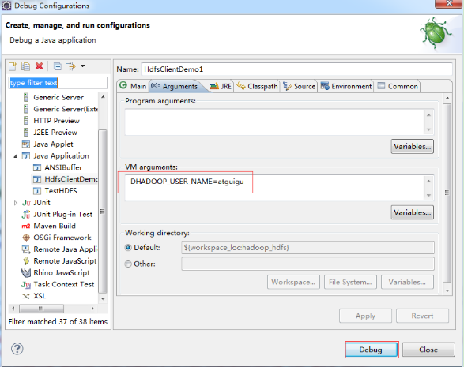

   客户端去操作HDFS时，是有一个用户身份的。默认情况下，HDFS客户端API会从JVM中获取一个参数来作为自己的用户身份：-DHADOOP_USER_NAME=atguigu，atguigu为用户名称

## 3.2 HDFS的API操作

### 3.2.1 HDFS文件上传（测试参数优先级）

1. 编写源代码

   ```java
   @Test
   public void testCopyFromLocalFile() throws IOException, InterruptedException, URISyntaxException {
   
   		// 1 获取文件系统
   		Configuration configuration = new Configuration();
   		configuration.set("dfs.replication", "2");
   		FileSystem fs = FileSystem.get(new URI("hdfs://hadoop102:9000"), configuration, "atguigu");
   
   		// 2 上传文件
   		fs.copyFromLocalFile(new Path("e:/banzhang.txt"), new Path("/banzhang.txt"));
   
   		// 3 关闭资源
   		fs.close();
   
   		System.out.println("over");
   }
   ```

2. 将hdfs-site.xml拷贝到项目的根目录下

   ```xml
   <?xml version="1.0" encoding="UTF-8"?>
   <?xml-stylesheet type="text/xsl" href="configuration.xsl"?>
   
   <configuration>
   	<property>
   		<name>dfs.replication</name>
           <value>1</value>
   	</property>
   </configuration>
   ```

3. 参数优先级

   参数优先级排序：（1）客户端代码中设置的值 >（2）ClassPath下的用户自定义配置文件 >（3）然后是服务器的默认配置

### 3.2.2 HDFS文件下载

```java
@Test
public void testCopyToLocalFile() throws IOException, InterruptedException, URISyntaxException{

		// 1 获取文件系统
		Configuration configuration = new Configuration();
		FileSystem fs = FileSystem.get(new URI("hdfs://hadoop102:9000"), configuration, "atguigu");
		
		// 2 执行下载操作
		// boolean delSrc 指是否将原文件删除
		// Path src 指要下载的文件路径
		// Path dst 指将文件下载到的路径
		// boolean useRawLocalFileSystem 是否开启文件校验
		fs.copyToLocalFile(false, new Path("/banzhang.txt"), new Path("e:/banhua.txt"), true);
		
		// 3 关闭资源
		fs.close();
}
```

### 3.2.3 HDFS文件夹删除

```java
@Test
public void testDelete() throws IOException, InterruptedException, URISyntaxException{

	// 1 获取文件系统
	Configuration configuration = new Configuration();
	FileSystem fs = FileSystem.get(new URI("hdfs://hadoop102:9000"), configuration, "atguigu");
		
	// 2 执行删除
	fs.delete(new Path("/0508/"), true);
		
	// 3 关闭资源
	fs.close();
}
```

### 3.2.4 HDFS文件名更改

```java
@Test
public void testRename() throws IOException, InterruptedException, URISyntaxException{

	// 1 获取文件系统
	Configuration configuration = new Configuration();
	FileSystem fs = FileSystem.get(new URI("hdfs://hadoop102:9000"), configuration, "atguigu"); 
		
	// 2 修改文件名称
	fs.rename(new Path("/banzhang.txt"), new Path("/banhua.txt"));
		
	// 3 关闭资源
	fs.close();
}
```

### 3.2.5 HDFS文件详情查看

查看文件名称、权限、长度、块信息

```java
@Test
public void testListFiles() throws IOException, InterruptedException, URISyntaxException{

	// 1获取文件系统
	Configuration configuration = new Configuration();
	FileSystem fs = FileSystem.get(new URI("hdfs://hadoop102:9000"), configuration, "atguigu"); 
		
	// 2 获取文件详情
	RemoteIterator<LocatedFileStatus> listFiles = fs.listFiles(new Path("/"), true);
		
	while(listFiles.hasNext()){
		LocatedFileStatus status = listFiles.next();
			
		// 输出详情
		// 文件名称
		System.out.println(status.getPath().getName());
		// 长度
		System.out.println(status.getLen());
		// 权限
		System.out.println(status.getPermission());
		// 分组
		System.out.println(status.getGroup());
			
		// 获取存储的块信息
		BlockLocation[] blockLocations = status.getBlockLocations();
			
		for (BlockLocation blockLocation : blockLocations) {
				
			// 获取块存储的主机节点
			String[] hosts = blockLocation.getHosts();
				
			for (String host : hosts) {
				System.out.println(host);
			}
		}
			
		System.out.println("-----------班长的分割线----------");
	}

// 3 关闭资源
fs.close();
}
```

### 3.2.6 HDFS文件和文件夹判断

```java
@Test
public void testListStatus() throws IOException, InterruptedException, URISyntaxException{
		
	// 1 获取文件配置信息
	Configuration configuration = new Configuration();
	FileSystem fs = FileSystem.get(new URI("hdfs://hadoop102:9000"), configuration, "atguigu");
		
	// 2 判断是文件还是文件夹
	FileStatus[] listStatus = fs.listStatus(new Path("/"));
		
	for (FileStatus fileStatus : listStatus) {
		
		// 如果是文件
		if (fileStatus.isFile()) {
				System.out.println("f:"+fileStatus.getPath().getName());
			}else {
				System.out.println("d:"+fileStatus.getPath().getName());
			}
		}
		
	// 3 关闭资源
	fs.close();
}
```

## 3.3 HDFS的I/O流操作

上面我们学的API操作HDFS系统都是框架封装好的。那么如果我们想自己实现上述API的操作该怎么实现呢？

我们可以采用IO流的方式实现数据的上传和下载。

### 3.3.1 HDFS文件上传

1. 需求：把本地e盘上的banhua.txt文件上传到HDFS根目录

2. 编写代码

   ```java
   @Test
   public void putFileToHDFS() throws IOException, InterruptedException, URISyntaxException {
   
   	// 1 获取文件系统
   	Configuration configuration = new Configuration();
   	FileSystem fs = FileSystem.get(new URI("hdfs://hadoop102:9000"), configuration, "atguigu");
   
   	// 2 创建输入流
   	FileInputStream fis = new FileInputStream(new File("e:/banhua.txt"));
   
   	// 3 获取输出流
   	FSDataOutputStream fos = fs.create(new Path("/banhua.txt"));
   
   	// 4 流对拷
   	IOUtils.copyBytes(fis, fos, configuration);
   
   	// 5 关闭资源
   	IOUtils.closeStream(fos);
   	IOUtils.closeStream(fis);
       fs.close();
   }
   ```

### 3.3.2 HDFS文件下载

1. 需求：从HDFS上下载banhua.txt文件到本地e盘上

2. 编写代码

   ```java
   // 文件下载
   @Test
   public void getFileFromHDFS() throws IOException, InterruptedException, URISyntaxException{
   
   	// 1 获取文件系统
   	Configuration configuration = new Configuration();
   	FileSystem fs = FileSystem.get(new URI("hdfs://hadoop102:9000"), configuration, "atguigu");
   		
   	// 2 获取输入流
   	FSDataInputStream fis = fs.open(new Path("/banhua.txt"));
   		
   	// 3 获取输出流
   	FileOutputStream fos = new FileOutputStream(new File("e:/banhua.txt"));
   		
   	// 4 流的对拷
   	IOUtils.copyBytes(fis, fos, configuration);
   		
   	// 5 关闭资源
   	IOUtils.closeStream(fos);
   	IOUtils.closeStream(fis);
   	fs.close();
   }
   ```

### 3.3.3 定位文件读取

1. 需求：分块读取HDFS上的大文件，比如根目录下的/hadoop-2.7.2.tar.gz

2. 编写代码
   （1）下载第一块

   ```java
   @Test
   public void readFileSeek1() throws IOException, InterruptedException, URISyntaxException{
   
   	// 1 获取文件系统
   	Configuration configuration = new Configuration();
   	FileSystem fs = FileSystem.get(new URI("hdfs://hadoop102:9000"), configuration, "atguigu");
   		
   	// 2 获取输入流
   	FSDataInputStream fis = fs.open(new Path("/hadoop-2.7.2.tar.gz"));
   		
   	// 3 创建输出流
   	FileOutputStream fos = new FileOutputStream(new File("e:/hadoop-2.7.2.tar.gz.part1"));
   		
   	// 4 流的拷贝
   	byte[] buf = new byte[1024];
   		
   	for(int i =0 ; i < 1024 * 128; i++){
   		fis.read(buf);
   		fos.write(buf);
   	}
   		
   	// 5关闭资源
   	IOUtils.closeStream(fis);
   	IOUtils.closeStream(fos);
   fs.close();
   }
   ```

   （2）下载第二块

   ```java
   @Test
   public void readFileSeek2() throws IOException, InterruptedException, URISyntaxException{
   
   	// 1 获取文件系统
   	Configuration configuration = new Configuration();
   	FileSystem fs = FileSystem.get(new URI("hdfs://hadoop102:9000"), configuration, "atguigu");
   		
   	// 2 打开输入流
   	FSDataInputStream fis = fs.open(new Path("/hadoop-2.7.2.tar.gz"));
   		
   	// 3 定位输入数据位置
   	fis.seek(1024*1024*128);
     // 4 创建输出流
   	FileOutputStream fos = new FileOutputStream(new File("e:/hadoop-2.7.2.tar.gz.part2"));
   		
   	// 5 流的对拷
   	IOUtils.copyBytes(fis, fos, configuration);
   		
   	// 6 关闭资源
   	IOUtils.closeStream(fis);
   	IOUtils.closeStream(fos);
   }
   ```

   （3）合并文件

   在Window命令窗口中进入到目录E:\，然后执行如下命令，对数据进行合并

   type hadoop-2.7.2.tar.gz.part2 >> hadoop-2.7.2.tar.gz.part1

   合并完成后，将hadoop-2.7.2.tar.gz.part1重新命名为hadoop-2.7.2.tar.gz。解压发现该tar包非常完整


# 4. HDFS的数据流（面试重点）

## 4.1 HDFS写数据流程

### 4.1.1 剖析文件写入

HDFS写数据流程如下图所示

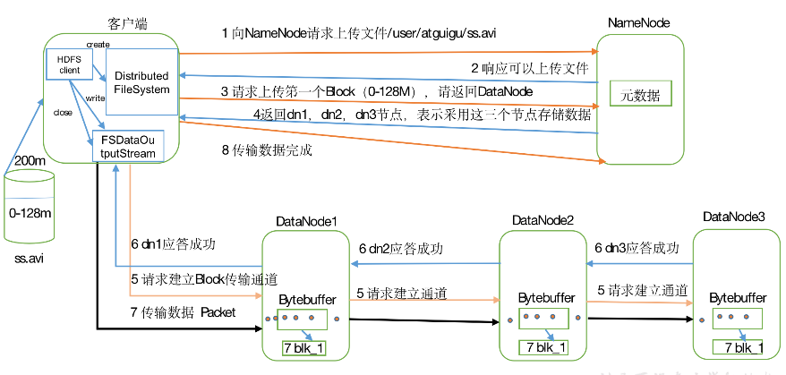

1）客户端通过Distributed FileSystem模块向NameNode请求上传文件，NameNode检查目标文件是否已存在，父目录是否存在

2）NameNode返回是否可以上传

3）客户端请求第一个 Block上传到哪几个DataNode服务器上

4）NameNode返回3个DataNode节点，分别为dn1、dn2、dn3

5）客户端通过FSDataOutputStream模块请求dn1上传数据，dn1收到请求会继续调用dn2，然后dn2调用dn3，将这个通信管道建立完成

6）dn1、dn2、dn3逐级应答客户端

7）客户端开始往dn1上传第一个Block（先从磁盘读取数据放到一个本地内存缓存），以Packet为单位，dn1收到一个Packet就会传给dn2，dn2传给dn3；dn1每传一个packet会放入一个应答队列等待应答

8）当一个Block传输完成之后，客户端再次请求NameNode上传第二个Block的服务器。（重复执行3-7步）

### 4.1.2 网络拓扑-节点距离计算

在HDFS写数据的过程中，NameNode会选择距离待上传数据最近距离的DataNode接收数据。那么这个最近距离怎么计算呢？

节点距离：两个节点到达最近的共同祖先的距离总和


例如，假设有数据中心d1机架r1中的节点n1。该节点可以表示为/d1/r1/n1。利用这种标记，这里给出四种距离描述,如上图所示

### 4.1.3 机架感知（副本存储节点选择）

1. 官方ip地址
   机架感知说明
   http://hadoop.apache.org/docs/r2.7.2/hadoop-project-dist/hadoop-hdfs/HdfsDesign.html#Data_Replication

   ```bash
   For the common case, when the replication factor is three, HDFS’s placement policy is to put one replica on one node in the local rack, another on a different node in the local rack, and the last on a different node in a different rack.
   ```

2. Hadoop2.7.2副本节点选择

   

## 4.2 HDFS读数据流程


1）客户端通过Distributed FileSystem向NameNode请求下载文件，NameNode通过查询元数据，找到文件块所在的DataNode地址

2）挑选一台DataNode（就近原则，然后随机）服务器，请求读取数据。

3）DataNode开始传输数据给客户端（从磁盘里面读取数据输入流，以Packet为单位来做校验）。

4）客户端以Packet为单位接收，先在本地缓存，然后写入目标文件。

# 5. NameNode和SecondaryNameNode（面试开发重点）

## 5.1 NN和2NN工作机制

思考：NameNode中的元数据是存储在哪里的？

​		首先，我们做个假设，如果存储在NameNode节点的磁盘中，因为经常需要进行随机访问，还有响应客户请求，必然是效率过低。因此，元数据需要存放在内存中。但如果只存在内存中，一旦断电，元数据丢失，整个集群就无法工作了。因此产生在磁盘中备份元数据的FsImage。

​		这样又会带来新的问题，当在内存中的元数据更新时，如果同时更新FsImage，就会导致效率过低，但如果不更新，就会发生一致性问题，一旦NameNode节点断电，就会产生数据丢失。因此，引入Edits文件(只进行追加操作，效率很高)。每当元数据有更新或者添加元数据时，修改内存中的元数据并追加到Edits中。这样，一旦NameNode节点断电，可以通过FsImage和Edits的合并，合成元数据。

​		但是，如果长时间添加数据到Edits中，会导致该文件数据过大，效率降低，而且一旦断电，恢复元数据需要的时间过长。因此，需要定期进行FsImage和Edits的合并，如果这个操作由NameNode节点完成，又会效率过低。因此，引入一个新的节点SecondaryNamenode，专门用于FsImage和Edits的合并。

​		NN和2NN工作机制如下图所示

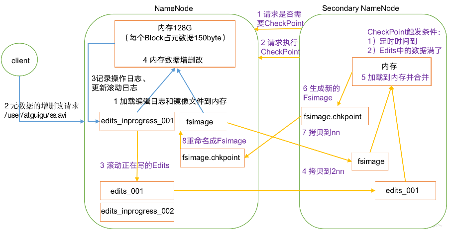

1. 第一阶段：NameNode启动

   （1）第一次启动NameNode格式化后，创建Fsimage和Edits文件。如果不是第一次启动，直接加载编辑日志和镜像文件到内存。

   （2）客户端对元数据进行增删改的请求。

   （3）NameNode记录操作日志，更新滚动日志。

   （4）NameNode在内存中对数据进行增删改。

2. 第二阶段：Secondary NameNode工作

   （1）Secondary NameNode询问NameNode是否需要CheckPoint。直接带回NameNode是否检查结果

   （2）Secondary NameNode请求执行CheckPoint。

   （3）NameNode滚动正在写的Edits日志。

   （4）将滚动前的编辑日志和镜像文件拷贝到Secondary NameNode。

   （5）Secondary NameNode加载编辑日志和镜像文件到内存，并合并。

   （6）生成新的镜像文件fsimage.chkpoint。

   （7）拷贝fsimage.chkpoint到NameNode。

   （8）NameNode将fsimage.chkpoint重新命名成fsimage。

   NN和2NN工作机制详解：

   Fsimage：NameNode内存中元数据序列化后形成的文件。

   Edits：记录客户端更新元数据信息的每一步操作（可通过Edits运算出元数据）。

   NameNode启动时，先滚动Edits并生成一个空的edits.inprogress，然后加载Edits和Fsimage到内存中，此时NameNode内存就持有最新的元数据信息。Client开始对NameNode发送元数据的增删改的请求，这些请求的操作首先会被记录到edits.inprogress中（查询元数据的操作不会被记录在Edits中，因为查询操作不会更改元数据信息），如果此时NameNode挂掉，重启后会从Edits中读取元数据的信息。然后，NameNode会在内存中执行元数据的增删改的操作。

   由于Edits中记录的操作会越来越多，Edits文件会越来越大，导致NameNode在启动加载Edits时会很慢，所以需要对Edits和Fsimage进行合并（所谓合并，就是将Edits和Fsimage加载到内存中，照着Edits中的操作一步步执行，最终形成新的Fsimage）。SecondaryNameNode的作用就是帮助NameNode进行Edits和Fsimage的合并工作。

   SecondaryNameNode首先会询问NameNode是否需要CheckPoint（触发CheckPoint需要满足两个条件中的任意一个，定时时间到和Edits中数据写满了）。直接带回NameNode是否检查结果。SecondaryNameNode执行CheckPoint操作，首先会让NameNode滚动Edits并生成一个空的edits.inprogress，滚动Edits的目的是给Edits打个标记，以后所有新的操作都写入edits.inprogress，其他未合并的Edits和Fsimage会拷贝到SecondaryNameNode的本地，然后将拷贝的Edits和Fsimage加载到内存中进行合并，生成fsimage.chkpoint，然后将fsimage.chkpoint拷贝给NameNode，重命名为Fsimage后替换掉原来的Fsimage。NameNode在启动时就只需要加载之前未合并的Edits和Fsimage即可，因为合并过的Edits中的元数据信息已经被记录在Fsimage中。

## 5.2 Fsimage和Edits解析

1. 概念
   

2. oiv查看Fsimage文件

   （1）查看oiv和oev命令

   ```bash
   [atguigu@hadoop102 current]$ hdfs
   oiv            apply the offline fsimage viewer to an fsimage
   oev            apply the offline edits viewer to an edits file
   ```

   （2）基本语法

   ```bash
   hdfs oiv -p 文件类型 -i镜像文件 -o 转换后文件输出路径
   ```

   （3）案例实操

   ```bash
   [atguigu@hadoop102 current]$ pwd
   /opt/module/hadoop-2.7.2/data/tmp/dfs/name/current
   
   [atguigu@hadoop102 current]$ hdfs oiv -p XML -i fsimage_0000000000000000025 -o /opt/module/hadoop-2.7.2/fsimage.xml
   
   [atguigu@hadoop102 current]$ cat /opt/module/hadoop-2.7.2/fsimage.xml
   ```

   将显示的xml文件内容拷贝到Eclipse中创建的xml文件中，并格式化。部分显示结果如下。

   ```xml
   <inode>
   	<id>16386</id>
   	<type>DIRECTORY</type>
   	<name>user</name>
   	<mtime>1512722284477</mtime>
   	<permission>atguigu:supergroup:rwxr-xr-x</permission>
   	<nsquota>-1</nsquota>
   	<dsquota>-1</dsquota>
   </inode>
   <inode>
   	<id>16387</id>
   	<type>DIRECTORY</type>
   	<name>atguigu</name>
   	<mtime>1512790549080</mtime>
   	<permission>atguigu:supergroup:rwxr-xr-x</permission>
   	<nsquota>-1</nsquota>
   	<dsquota>-1</dsquota>
   </inode>
   <inode>
   	<id>16389</id>
   	<type>FILE</type>
   	<name>wc.input</name>
   	<replication>3</replication>
   	<mtime>1512722322219</mtime>
   	<atime>1512722321610</atime>
   	<perferredBlockSize>134217728</perferredBlockSize>
   	<permission>atguigu:supergroup:rw-r--r--</permission>
   	<blocks>
   		<block>
   			<id>1073741825</id>
   			<genstamp>1001</genstamp>
   			<numBytes>59</numBytes>
   		</block>
   	</blocks>
   </inode >
   ```

   思考：可以看出，Fsimage中没有记录块所对应DataNode，为什么？

   在集群启动后，要求DataNode上报数据块信息，并间隔一段时间后再次上报。

3. oev查看Edits文件

   （1）基本语法

   ```bash
   hdfs oev -p 文件类型 -i编辑日志 -o 转换后文件输出路径
   ```

   （2）案例实操

   ```bash
   [atguigu@hadoop102 current]$ hdfs oev -p XML -i edits_0000000000000000012-0000000000000000013 -o /opt/module/hadoop-2.7.2/edits.xml
   
   [atguigu@hadoop102 current]$ cat /opt/module/hadoop-2.7.2/edits.xml
   ```

   将显示的xml文件内容拷贝到Eclipse中创建的xml文件中，并格式化。显示结果如下

   ```xml
   <?xml version="1.0" encoding="UTF-8"?>
   <EDITS>
   	<EDITS_VERSION>-63</EDITS_VERSION>
   	<RECORD>
   		<OPCODE>OP_START_LOG_SEGMENT</OPCODE>
   		<DATA>
   			<TXID>129</TXID>
   		</DATA>
   	</RECORD>
     <RECORD>
   		<OPCODE>OP_ADD</OPCODE>
   		<DATA>
   			<TXID>130</TXID>
   			<LENGTH>0</LENGTH>
   			<INODEID>16407</INODEID>
   			<PATH>/hello7.txt</PATH>
   			<REPLICATION>2</REPLICATION>
   			<MTIME>1512943607866</MTIME>
   			<ATIME>1512943607866</ATIME>
   			<BLOCKSIZE>134217728</BLOCKSIZE>
   			<CLIENT_NAME>DFSClient_NONMAPREDUCE_-1544295051_1</CLIENT_NAME>
   			<CLIENT_MACHINE>192.168.1.5</CLIENT_MACHINE>
   			<OVERWRITE>true</OVERWRITE>
   			<PERMISSION_STATUS>
   				<USERNAME>atguigu</USERNAME>
   				<GROUPNAME>supergroup</GROUPNAME>
   				<MODE>420</MODE>
   			</PERMISSION_STATUS>
   			<RPC_CLIENTID>908eafd4-9aec-4288-96f1-e8011d181561</RPC_CLIENTID>
   			<RPC_CALLID>0</RPC_CALLID>
   		</DATA>
   	</RECORD>
   	<RECORD>
   		<OPCODE>OP_ALLOCATE_BLOCK_ID</OPCODE>
   		<DATA>
   			<TXID>131</TXID>
   			<BLOCK_ID>1073741839</BLOCK_ID>
   		</DATA>
   	</RECORD>
   	<RECORD>
   		<OPCODE>OP_SET_GENSTAMP_V2</OPCODE>
   		<DATA>
   			<TXID>132</TXID>
   			<GENSTAMPV2>1016</GENSTAMPV2>
   		</DATA>
   	</RECORD>
   	<RECORD>
   		<OPCODE>OP_ADD_BLOCK</OPCODE>
   		<DATA>
   			<TXID>133</TXID>
   			<PATH>/hello7.txt</PATH>
   			<BLOCK>
   				<BLOCK_ID>1073741839</BLOCK_ID>
   				<NUM_BYTES>0</NUM_BYTES>
   				<GENSTAMP>1016</GENSTAMP>
   			</BLOCK>
   			<RPC_CLIENTID></RPC_CLIENTID>
   			<RPC_CALLID>-2</RPC_CALLID>
   		</DATA>
   	</RECORD>
   	<RECORD>
   		<OPCODE>OP_CLOSE</OPCODE>
   		<DATA>
         <TXID>134</TXID>
   			<LENGTH>0</LENGTH>
   			<INODEID>0</INODEID>
   			<PATH>/hello7.txt</PATH>
   			<REPLICATION>2</REPLICATION>
   			<MTIME>1512943608761</MTIME>
   			<ATIME>1512943607866</ATIME>
   			<BLOCKSIZE>134217728</BLOCKSIZE>
   			<CLIENT_NAME></CLIENT_NAME>
   			<CLIENT_MACHINE></CLIENT_MACHINE>
   			<OVERWRITE>false</OVERWRITE>
   			<BLOCK>
   				<BLOCK_ID>1073741839</BLOCK_ID>
   				<NUM_BYTES>25</NUM_BYTES>
   				<GENSTAMP>1016</GENSTAMP>
   			</BLOCK>
   			<PERMISSION_STATUS>
   				<USERNAME>atguigu</USERNAME>
   				<GROUPNAME>supergroup</GROUPNAME>
   				<MODE>420</MODE>
   			</PERMISSION_STATUS>
   		</DATA>
   	</RECORD>
   </EDITS >
   ```

   思考：NameNode如何确定下次开机启动的时候合并哪些Edits？

## 5.3 CheckPoint时间设置

   （1）通常情况下，SecondaryNameNode每隔一小时执行一次

   [hdfs-default.xml]

   ```xml
   <property>
     <name>dfs.namenode.checkpoint.period</name>
     <value>3600</value>
   </property>
   ```

   （2）一分钟检查一次操作次数，当操作次数达到1百万时，SecondaryNameNode执行一次。

   ```xml
   <property>
     <name>dfs.namenode.checkpoint.txns</name>
     <value>1000000</value>
   <description>操作动作次数</description>
   </property>
   
   <property>
     <name>dfs.namenode.checkpoint.check.period</name>
     <value>60</value>
   <description> 1分钟检查一次操作次数</description>
   </property >
   ```

## 5.4 NameNode故障处理

   NameNode故障后，可以采用如下两种方法恢复数据

   方法一：将SecondaryNameNode中数据拷贝到NameNode存储数据的目录

1. kill -9 NameNode进程

2. 删除NameNode存储的数据（/opt/module/hadoop-2.7.2/data/tmp/dfs/name）

   ```bash
   rm -rf /opt/module/hadoop-2.7.2/data/tmp/dfs/name/*
   ```

3. 拷贝SecondaryNameNode中数据到原NameNode存储数据目录

   ```bash
   scp -r atguigu@hadoop104:/opt/module/hadoop-2.7.2/data/tmp/dfs/namesecondary/* ./name/
   ```

4. 重新启动NameNode

   ```bash
   sbin/hadoop-daemon.sh start namenode
   ```

方法二：使用-importCheckpoint选项启动NameNode守护进程，从而将SecondaryNameNode中数据拷贝到NameNode目录中

1.  修改hdfs-site.xml

   ```xml
   <property>
     <name>dfs.namenode.checkpoint.period</name>
     <value>120</value>
   </property>
   
   <property>
     <name>dfs.namenode.name.dir</name>
     <value>/opt/module/hadoop-2.7.2/data/tmp/dfs/name</value>
   </property>
   ```

   

2. kill -9 NameNode进程

3. 删除NameNode存储的数据（/opt/module/hadoop-2.7.2/data/tmp/dfs/name）

   ```bash
   rm -rf /opt/module/hadoop-2.7.2/data/tmp/dfs/name/*
   ```

4. 如果SecondaryNameNode不和NameNode在一个主机节点上，需要将SecondaryNameNode存储数据的目录拷贝到NameNode存储数据的平级目录，并删除in_use.lock文件

   ```bash
   [atguigu@hadoop102 dfs]$ scp -r atguigu@hadoop104:/opt/module/hadoop-2.7.2/data/tmp/dfs/namesecondary ./
   
   [atguigu@hadoop102 namesecondary]$ rm -rf in_use.lock
   
   [atguigu@hadoop102 dfs]$ pwd
   /opt/module/hadoop-2.7.2/data/tmp/dfs
   
   [atguigu@hadoop102 dfs]$ ls
   data  name  namesecondary
   ```

5. 导入检查点数据（等待一会ctrl+c结束掉）

   ```bash
   bin/hdfs namenode -importCheckpoint
   ```

6. 启动NameNode

   ```bash
   sbin/hadoop-daemon.sh start namenode
   ```

   ## 5.5 集群安全模式

1. 概述

   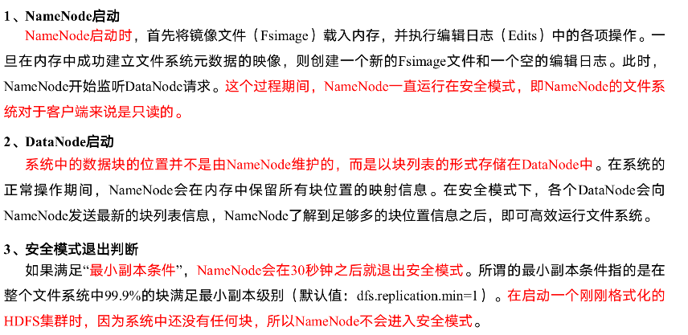

2. 基本语法
   集群处于安全模式，不能执行重要操作（写操作）。集群启动完成后，自动退出安全模式。

   （1）bin/hdfs dfsadmin -safemode get		（功能描述：查看安全模式状态）

   （2）bin/hdfs dfsadmin -safemode enter  （功能描述：进入安全模式状态）

   （3）bin/hdfs dfsadmin -safemode leave	（功能描述：离开安全模式状态）

   （4）bin/hdfs dfsadmin -safemode wait	（功能描述：等待安全模式状态）

3. 案例

   模拟等待安全模式

   （1）查看当前模式

   ```bash
   hdfs dfsadmin -safemode get
   Safe mode is OFF
   ```

   （2）先进入安全模式

   ```bash
   bin/hdfs dfsadmin -safemode enter
   ```

   （3）创建并执行下面的脚本

   在/opt/module/hadoop-2.7.2路径上，编辑一个脚本safemode.sh

   ```bash
   touch safemode.sh
   vim safemode.sh
   
   #!/bin/bash
   hdfs dfsadmin -safemode wait
   hdfs dfs -put /opt/module/hadoop-2.7.2/README.txt /
   
   chmod 777 safemode.sh
   
   ./safemode.sh
   ```

   （4）再打开一个窗口，执行

   ```bash
   bin/hdfs dfsadmin -safemode leave
   ```

   （5）观察

   ​	（a）再观察上一个窗口

   ​    	   Safe mode is OFF

   ​	（b）HDFS集群上已经有上传的数据了。

## 5.6 NameNode多目录配置

1. NameNode的本地目录可以配置成多个，且每个目录存放内容相同，增加了可靠性

2. 具体配置如下

   （1）在hdfs-site.xml文件中增加如下内容

   ```xml
   <property>
       <name>dfs.namenode.name.dir</name>
   <value>file:///${hadoop.tmp.dir}/dfs/name1,file:///${hadoop.tmp.dir}/dfs/name2</value>
   </property>
   ```

   （2）停止集群，删除data和logs中所有数据

   ```bash
   [atguigu@hadoop102 hadoop-2.7.2]$ rm -rf data/ logs/
   [atguigu@hadoop103 hadoop-2.7.2]$ rm -rf data/ logs/
   [atguigu@hadoop104 hadoop-2.7.2]$ rm -rf data/ logs/
   ```

   （3）格式化集群并启动。

   ```bash
   [atguigu@hadoop102 hadoop-2.7.2]$ bin/hdfs namenode –format
   [atguigu@hadoop102 hadoop-2.7.2]$ sbin/start-dfs.sh
   ```

   （4）查看结果

   ```bash
   [atguigu@hadoop102 dfs]$ ll
   总用量 12
   drwx------. 3 atguigu atguigu 4096 12月 11 08:03 data
   drwxrwxr-x. 3 atguigu atguigu 4096 12月 11 08:03 name1
   drwxrwxr-x. 3 atguigu atguigu 4096 12月 11 08:03 name2
   ```

# 6. DataNode（面试开发重点）

## 6.1 DataNode工作机制

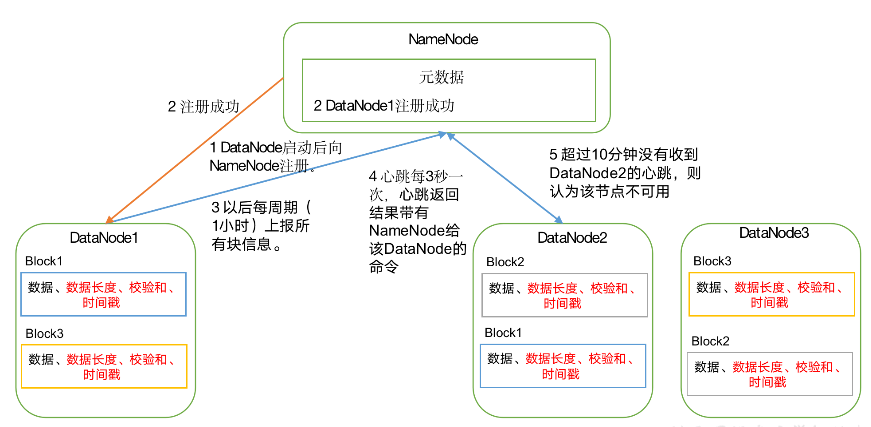

1）一个数据块在DataNode上以文件形式存储在磁盘上，包括两个文件，一个是数据本身，一个是元数据包括数据块的长度，块数据的校验和，以及时间戳。

2）DataNode启动后向NameNode注册，通过后，周期性（1小时）的向NameNode上报所有的块信息。

3）心跳是每3秒一次，心跳返回结果带有NameNode给该DataNode的命令如复制块数据到另一台机器，或删除某个数据块。如果超过10分钟没有收到某个DataNode的心跳，则认为该节点不可用。

4）集群运行中可以安全加入和退出一些机器。

## 6.2 数据完整性

​		思考：如果电脑磁盘里面存储的数据是控制高铁信号灯的红灯信号（1）和绿灯信号（0），但是存储该数据的磁盘坏了，一直显示是绿灯，是否很危险？同理DataNode节点上的数据损坏了，却没有发现，是否也很危险，那么如何解决呢？

如下是DataNode节点保证数据完整性的方法

1）当DataNode读取Block的时候，它会计算CheckSum。

2）如果计算后的CheckSum，与Block创建时值不一样，说明Block已经损坏。

3）Client读取其他DataNode上的Block。

4）DataNode在其文件创建后周期验证CheckSum,如下图所示

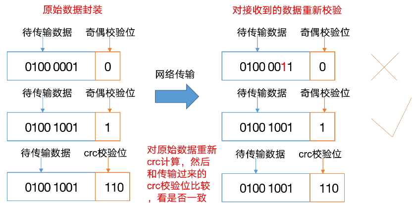

## 6.3 掉线时限参数设置

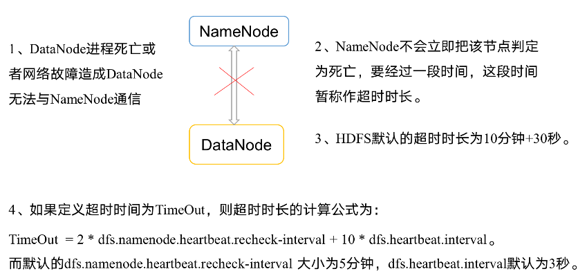

需要注意的是hdfs-site.xml 配置文件中的heartbeat.recheck.interval的单位为毫秒，dfs.heartbeat.interval的单位为秒

```xml
<property>
    <name>dfs.namenode.heartbeat.recheck-interval</name>
    <value>300000</value>
</property>
<property>
    <name>dfs.heartbeat.interval</name>
    <value>3</value>
</property>
```

## 6.4 服役新数据节点

1. 需求

   随着公司业务的增长，数据量越来越大，原有的数据节点的容量已经不能满足存储数据的需求，需要在原有集群基础上动态添加新的数据节点

2. 环境准备

   （1）在hadoop104主机上再克隆一台hadoop105主机

   ​	（2）修改IP地址和主机名称

   ​	（3）删除原来HDFS文件系统留存的文件（/opt/module/hadoop-2.7.2/data和log

   ​	（4）source一下配置文件

   ```bash
   source /etc/profile
   ```

3. 服役新节点具体步骤

   （1）直接启动DataNode，即可关联到集群

   ```bash
   [atguigu@hadoop105 hadoop-2.7.2]$ sbin/hadoop-daemon.sh start datanode
   [atguigu@hadoop105 hadoop-2.7.2]$ sbin/yarn-daemon.sh start nodemanager
   ```

   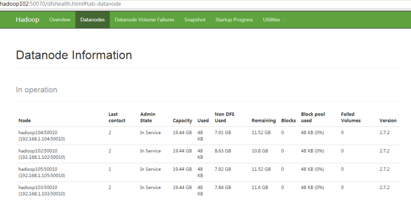

   （2）在hadoop105上上传文件

   ```bash
   [atguigu@hadoop105 hadoop-2.7.2]$ hadoop fs -put /opt/module/hadoop-2.7.2/LICENSE.txt /
   ```

   （3）如果数据不均衡，可以用命令实现集群的再平衡

   ```bash
   [atguigu@hadoop102 sbin]$ ./start-balancer.sh
   starting balancer, logging to /opt/module/hadoop-2.7.2/logs/hadoop-atguigu-balancer-hadoop102.out
   Time Stamp               Iteration#  Bytes Already Moved  Bytes Left To Move  Bytes Being Moved
   ```

   ## 6.5 退役旧数据节点

   ### 6.5.1 添加白名单

   添加到白名单的主机节点，都允许访问NameNode，不在白名单的主机节点，都会被退出。

   配置白名单的具体步骤如下：

   （1）在NameNode的/opt/module/hadoop-2.7.2/etc/hadoop目录下创建dfs.hosts文件

   ```bash
   [atguigu@hadoop102 hadoop]$ pwd
   /opt/module/hadoop-2.7.2/etc/hadoop
   [atguigu@hadoop102 hadoop]$ touch dfs.hosts
   [atguigu@hadoop102 hadoop]$ vi dfs.hosts
   ```

   ​		添加如下主机名称（不添加hadoop105）

   ```bash
   hadoop102
   hadoop103
   hadoop104
   ```

   （2）在NameNode的hdfs-site.xml配置文件中增加dfs.hosts属性

   ```xml
   <property>
   <name>dfs.hosts</name>
   <value>/opt/module/hadoop-2.7.2/etc/hadoop/dfs.hosts</value>
   </property>
   ```

   （3）配置文件分发

   ```bash
   xsync hdfs-site.xml
   ```

   （4）刷新NameNode

   ```bash
   hdfs dfsadmin -refreshNodes
   ```

   （5）更新ResourceManager节点

   ```bash
   yarn rmadmin -refreshNodes
   17/06/24 14:17:11 INFO client.RMProxy: Connecting to ResourceManager at hadoop103/192.168.1.103:8033
   ```

   （6）在web浏览器上查看

   

   （7）如果数据不均衡，可以用命令实现集群的再平衡

   ```bash
   [atguigu@hadoop102 sbin]$ ./start-balancer.sh
   starting balancer, logging to /opt/module/hadoop-2.7.2/logs/hadoop-atguigu-balancer-hadoop102.out
   Time Stamp               Iteration#  Bytes Already Moved  Bytes Left To Move  Bytes Being Moved
   ```

### 6.5.2 黑名单退役

在黑名单上面的主机都会被强制退出

1. 在NameNode的/opt/module/hadoop-2.7.2/etc/hadoop目录下创建dfs.hosts.exclude文件

   ```bash
   [atguigu@hadoop102 hadoop]$ pwd
   /opt/module/hadoop-2.7.2/etc/hadoop
   [atguigu@hadoop102 hadoop]$ touch dfs.hosts.exclude
   [atguigu@hadoop102 hadoop]$ vi dfs.hosts.exclude
   ```

   添加如下主机名称（要退役的节点）

   ```bash
   hadoop105
   ```

   

2. 在NameNode的hdfs-site.xml配置文件中增加dfs.hosts.exclude属性

   ```xml
   <property>
   <name>dfs.hosts.exclude</name>
         <value>/opt/module/hadoop-2.7.2/etc/hadoop/dfs.hosts.exclude</value>
   </property>
   ```

   

3. 刷新NameNode、刷新ResourceManager

   ```bash
   [atguigu@hadoop102 hadoop-2.7.2]$ hdfs dfsadmin -refreshNodes
   Refresh nodes successful
   
   [atguigu@hadoop102 hadoop-2.7.2]$ yarn rmadmin -refreshNodes
   17/06/24 14:55:56 INFO client.RMProxy: Connecting to ResourceManager at hadoop103/192.168.1.103:8033
   ```

   

4. 检查Web浏览器，退役节点的状态为decommission in progress（退役中），说明数据节点正在复制块到其他节点

   

5. 等待退役节点状态为decommissioned（所有块已经复制完成），停止该节点及节点资源管理器。注意：如果副本数是3，服役的节点小于等于3，是不能退役成功的，需要修改副本数后才能退役

   

   ```bash
   [atguigu@hadoop105 hadoop-2.7.2]$ sbin/hadoop-daemon.sh stop datanode
   ```

   stopping datanode

   ```bash
   [atguigu@hadoop105 hadoop-2.7.2]$ sbin/yarn-daemon.sh stop nodemanager
   ```

   

6. 如果数据不均衡，可以用命令实现集群的再平衡

   ```bash
   [atguigu@hadoop102 hadoop-2.7.2]$ sbin/start-balancer.sh 
   starting balancer, logging to /opt/module/hadoop-2.7.2/logs/hadoop-atguigu-balancer-hadoop102.out
   Time Stamp               Iteration#  Bytes Already Moved  Bytes Left To Move  Bytes Being Moved
   ```

​          注意：不允许白名单和黑名单中同时出现同一个主机名称。

## 6.6 Datanode多目录配置

1. DataNode也可以配置成多个目录，每个目录存储的数据不一样。即：数据不是副本

2. 具体配置如下

   hdfs-site.xml

   ```xml
   <property>
           <name>dfs.datanode.data.dir</name>
   <value>file:///${hadoop.tmp.dir}/dfs/data1,file:///${hadoop.tmp.dir}/dfs/data2</value>
   </property>
   ```

# 7. HDFS 2.X新特性

## 7.1 集群间数据拷贝

1. scp实现两个远程主机之间的文件复制

   ​    scp -r hello.txt [root@hadoop103:/user/atguigu/hello.txt](mailto:root@hadoop103:/user/atguigu/hello.txt)		// 推 push

   ​	scp -r [root@hadoop103:/user/atguigu/hello.txt  hello.txt](mailto:root@hadoop103:/user/atguigu/hello.txt  hello.txt)		// 拉 pull

   ​	scp -r [root@hadoop103:/user/atguigu/hello.txt](mailto:root@hadoop103:/user/atguigu/hello.txt) root@hadoop104:/user/atguigu  //是通过本地主机中转实现两个远程主机的文件复制；如果在两个远程主机之间ssh没有配置的情况下可以使用该方式。

2. 采用distcp命令实现两个Hadoop集群之间的递归数据复制

   ```bash
   [atguigu@hadoop102 hadoop-2.7.2]$  bin/hadoop distcp
   hdfs://haoop102:9000/user/atguigu/hello.txt hdfs://hadoop103:9000/user/atguigu/hello.txt
   ```

## 7.2 小文件存档

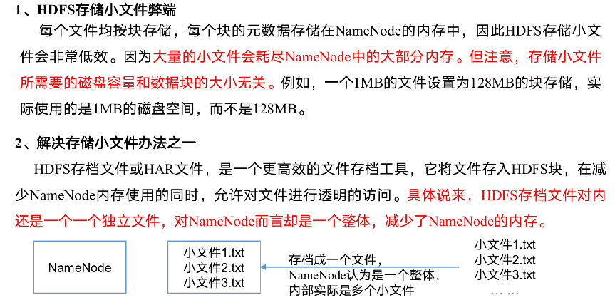

   

案例实操

（1）需要启动YARN进程

```bash
start-yarn.sh
```

（2）归档文件

​		把/user/atguigu/input目录里面的所有文件归档成一个叫input.har的归档文件，并把归档后文件存储到/user/atguigu/output路径下。

```bash
[atguigu@hadoop102 hadoop-2.7.2]$ bin/hadoop archive -archiveName input.har –p  /user/atguigu/input   /user/atguigu/output
```

（3）查看归档

```bash
[atguigu@hadoop102 hadoop-2.7.2]$ hadoop fs -lsr /user/atguigu/output/input.har
[atguigu@hadoop102 hadoop-2.7.2]$ hadoop fs -lsr har:///user/atguigu/output/input.har
```

（4）解归档文件

```bash
[atguigu@hadoop102 hadoop-2.7.2]$ hadoop fs -cp har:/// user/atguigu/output/input.har/*    /user/atguigu
```

## 7.3 回收站

开启回收站功能，可以将删除的文件在不超时的情况下，恢复原数据，起到防止误删除、备份等作用。

1. 回收站参数设置及工作机制

   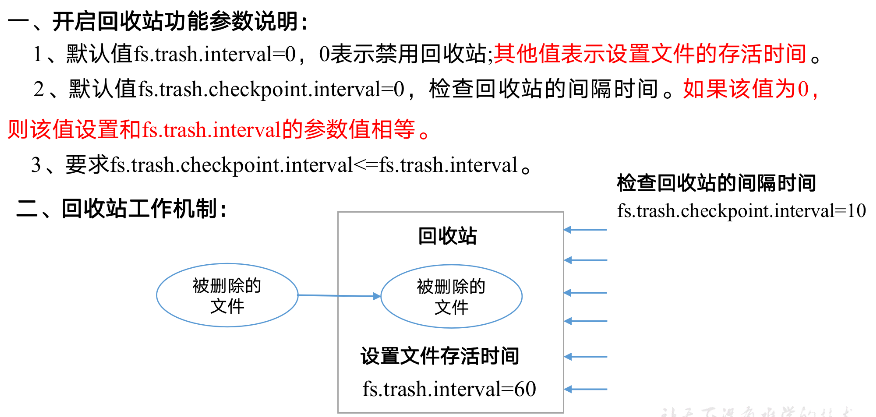

2. 启用回收站

   修改core-site.xml，配置垃圾回收时间为1分钟。

   ```xml
   <property>
      <name>fs.trash.interval</name>
   <value>1</value>
   </property>
   ```

3. 查看回收站

   回收站在集群中的路径：/user/atguigu/.Trash/….

4. 修改访问垃圾回收站用户名称

   进入垃圾回收站用户名称，默认是dr.who，修改为atguigu用户

   [core-site.xml]

   ```xml
   <property>
     <name>hadoop.http.staticuser.user</name>
     <value>atguigu</value>
   </property>
   ```

5. 通过程序删除的文件不会经过回收站，需要调用moveToTrash()才进入回收站

   Trash trash = New Trash(conf);

   trash.moveToTrash(path);

6. 恢复回收站数据

   ```bash
   [atguigu@hadoop102 hadoop-2.7.2]$ hadoop fs -mv
   /user/atguigu/.Trash/Current/user/atguigu/input    /user/atguigu/input
   ```

7. 清空回收站

   ```bash
   [atguigu@hadoop102 hadoop-2.7.2]$ hadoop fs -expunge
   ```

## 7.4 快照管理


案例实操

（1）开启/禁用指定目录的快照功能

```bash
[atguigu@hadoop102 hadoop-2.7.2]$ hdfs dfsadmin -allowSnapshot /user/atguigu/input

[atguigu@hadoop102 hadoop-2.7.2]$ hdfs dfsadmin -disallowSnapshot /user/atguigu/input
```

（2）对目录创建快照

```bash
[atguigu@hadoop102 hadoop-2.7.2]$ hdfs dfs -createSnapshot /user/atguigu/input
```

​    通过web访问hdfs://hadoop102:50070/user/atguigu/input/.snapshot/s…..// 快照和源文件使用相同数据

``` bash
[atguigu@hadoop102 hadoop-2.7.2]$ hdfs dfs -lsr /user/atguigu/input/.snapshot/
```

（3）指定名称创建快照

```bash
[atguigu@hadoop102 hadoop-2.7.2]$ hdfs dfs -createSnapshot /user/atguigu/input  miao170508
```

（4）重命名快照

```bash
[atguigu@hadoop102 hadoop-2.7.2]$ hdfs dfs -renameSnapshot /user/atguigu/input/  miao170508 atguigu170508
```

（5）列出当前用户所有可快照目录

```bash
[atguigu@hadoop102 hadoop-2.7.2]$ hdfs lsSnapshottableDir
```

（6）比较两个快照目录的不同之处

```bash
[atguigu@hadoop102 hadoop-2.7.2]$ hdfs snapshotDiff
 /user/atguigu/input/  .  .snapshot/atguigu170508
```

（7）恢复快照

```bash
[atguigu@hadoop102 hadoop-2.7.2]$ hdfs dfs -cp
/user/atguigu/input/.snapshot/s20170708-134303.027 /user
```

# 8. HDFS HA高可用

## 8.1 HA概述

1）所谓HA（High Available），即高可用（7*24小时不中断服务）

2）实现高可用最关键的策略是消除单点故障。HA严格来说应该分成各个组件的HA机制：HDFS的HA和YARN的HA。

3）Hadoop2.0之前，在HDFS集群中NameNode存在单点故障（SPOF）。

4）NameNode主要在以下两个方面影响HDFS集群

​	NameNode机器发生意外，如宕机，集群将无法使用，直到管理员重启

​	NameNode机器需要升级，包括软件、硬件升级，此时集群也将无法使用

HDFS HA功能通过配置Active/Standby两个NameNodes实现在集群中对NameNode的热备来解决上述问题。如果出现故障，如机器崩溃或机器需要升级维护，这时可通过此种方式将NameNode很快的切换到另外一台机器。

## 8.2 HDFS-HA工作机制

通过双NameNode消除单点故障

### 8.2.1 HDFS-HA工作要点

1. 元数据管理方式需要改变

   内存中各自保存一份元数据；

   Edits日志只有Active状态的NameNode节点可以做写操作；

   两个NameNode都可以读取Edits；

   共享的Edits放在一个共享存储中管理（qjournal和NFS两个主流实现）

2. 需要一个状态管理功能模块

   实现了一个zkfailover，常驻在每一个namenode所在的节点，每一个zkfailover负责监控自己所在NameNode节点，利用zk进行状态标识，当需要进行状态切换时，由zkfailover来负责切换，切换时需要防止brain split现象的发生

3. 必须保证两个NameNode之间能够ssh无密码登录

4. 隔离（Fence），即同一时刻仅仅有一个NameNode对外提供服务

### 8.2.2 HDFS-HA自动故障转移工作机制

前面学习了使用命令hdfs haadmin -failover手动进行故障转移，在该模式下，即使现役NameNode已经失效，系统也不会自动从现役NameNode转移到待机NameNode，下面学习如何配置部署HA自动进行故障转移。自动故障转移为HDFS部署增加了两个新组件：ZooKeeper和ZKFailoverController（ZKFC）进程，如图3-20所示。ZooKeeper是维护少量协调数据，通知客户端这些数据的改变和监视客户端故障的高可用服务。HA的自动故障转移依赖于ZooKeeper的以下功能

1）故障检测：集群中的每个NameNode在ZooKeeper中维护了一个持久会话，如果机器崩溃，ZooKeeper中的会话将终止，ZooKeeper通知另一个NameNode需要触发故障转移。

2）现役NameNode选择：ZooKeeper提供了一个简单的机制用于唯一的选择一个节点为active状态。如果目前现役NameNode崩溃，另一个节点可能从ZooKeeper获得特殊的排外锁以表明它应该成为现役NameNode。

ZKFC是自动故障转移中的另一个新组件，是ZooKeeper的客户端，也监视和管理NameNode的状态。每个运行NameNode的主机也运行了一个ZKFC进程，ZKFC负责:

1）健康监测：ZKFC使用一个健康检查命令定期地ping与之在相同主机的NameNode，只要该NameNode及时地回复健康状态，ZKFC认为该节点是健康的。如果该节点崩溃，冻结或进入不健康状态，健康监测器标识该节点为非健康的。

2）ZooKeeper会话管理：当本地NameNode是健康的，ZKFC保持一个在ZooKeeper中打开的会话。如果本地NameNode处于active状态，ZKFC也保持一个特殊的znode锁，该锁使用了ZooKeeper对短暂节点的支持，如果会话终止，锁节点将自动删除。

3）基于ZooKeeper的选择：如果本地NameNode是健康的，且ZKFC发现没有其它的节点当前持有znode锁，它将为自己获取该锁。如果成功，则它已经赢得了选择，并负责运行故障转移进程以使它的本地NameNode为Active。故障转移进程与前面描述的手动故障转移相似，首先如果必要保护之前的现役NameNode，然后本地NameNode转换为Active状态

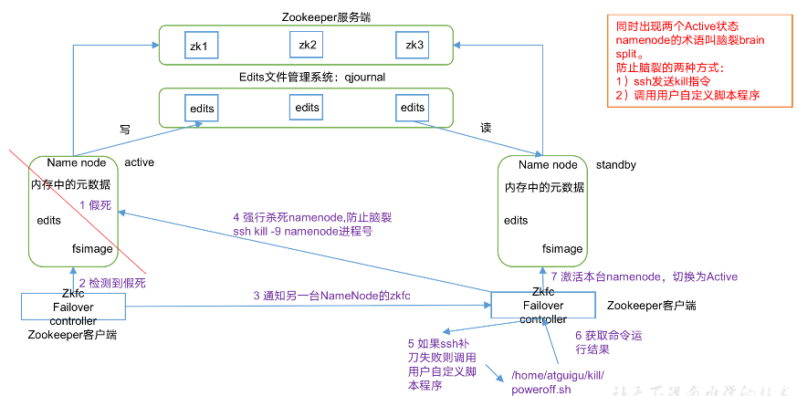

## 8.3 HDFS-HA集群配置

### 8.3.1 环境准备

+ 修改IP

+ 修改主机名及主机名和IP地址的映射

+ 关闭防火墙

+ ssh免密登录
+ 安装JDK，配置环境变量等

### 8.3.2 规划集群


### 8.3.3 配置Zookeeper集群

1. 集群规划

   在hadoop102、hadoop103和hadoop104三个节点上部署Zookeeper

2. 解压安装

   （1）解压Zookeeper安装包到/opt/module/目录下

   ```bash
   [atguigu@hadoop102 software]$ tar -zxvf zookeeper-3.4.10.tar.gz -C /opt/module/
   ```

   （2）在/opt/module/zookeeper-3.4.10/这个目录下创建zkData

   ```bash
   mkdir -p zkData
   ```

   （3）重命名/opt/module/zookeeper-3.4.10/conf这个目录下的zoo_sample.cfg为zoo.cfg

   ```bash
   mv zoo_sample.cfg zoo.cfg
   ```

   

3. 配置zoo.cfg文件

   （1）具体配置

   ```bash
   dataDir=/opt/module/zookeeper-3.4.10/zkData
   ```

   增加如下配置

   ```bash
   #######################cluster##########################
   server.2=hadoop102:2888:3888
   server.3=hadoop103:2888:3888
   server.4=hadoop104:2888:3888
   ```

   （2）配置参数解读

   Server.A=B:C:D。

   A是一个数字，表示这个是第几号服务器；

   B是这个服务器的IP地址；

   C是这个服务器与集群中的Leader服务器交换信息的端口；

   D是万一集群中的Leader服务器挂了，需要一个端口来重新进行选举，选出一个新的Leader，而这个端口就是用来执行选举时服务器相互通信的端口。

   集群模式下配置一个文件myid，这个文件在dataDir目录下，这个文件里面有一个数据就是A的值，Zookeeper启动时读取此文件，拿到里面的数据与zoo.cfg里面的配置信息比较从而判断到底是哪个server

4. 集群操作

   （1）在/opt/module/zookeeper-3.4.10/zkData目录下创建一个myid的文件

   ```bash
   touch myid
   ```

   添加myid文件，注意一定要在linux里面创建，在notepad++里面很可能乱码

   （2）编辑myid文件

   ```bash
   vi myid
   ```

   在文件中添加与server对应的编号：如2

   （3）拷贝配置好的zookeeper到其他机器上

   ```bash
   scp -r zookeeper-3.4.10/ root@hadoop103.atguigu.com:/opt/app/
   scp -r zookeeper-3.4.10/ root@hadoop104.atguigu.com:/opt/app/
   ```

   并分别修改myid文件中内容为3、4

   （4）分别启动zookeeper

   ```bash
   [root@hadoop102 zookeeper-3.4.10]# bin/zkServer.sh start
   [root@hadoop103 zookeeper-3.4.10]# bin/zkServer.sh start
   [root@hadoop104 zookeeper-3.4.10]# bin/zkServer.sh start
   ```

   （5）查看状态

   ```bash
   [root@hadoop102 zookeeper-3.4.10]# bin/zkServer.sh status
   JMX enabled by default
   Using config: /opt/module/zookeeper-3.4.10/bin/../conf/zoo.cfg
   Mode: follower
   [root@hadoop103 zookeeper-3.4.10]# bin/zkServer.sh status
   JMX enabled by default
   Using config: /opt/module/zookeeper-3.4.10/bin/../conf/zoo.cfg
   Mode: leader
   [root@hadoop104 zookeeper-3.4.5]# bin/zkServer.sh status
   JMX enabled by default
   Using config: /opt/module/zookeeper-3.4.10/bin/../conf/zoo.cfg
   Mode: follower
   ```

### 8.3.4 配置HDFS-HA集群

1.  官方地址：http://hadoop.apache.org/

2. 在opt目录下创建一个ha文件夹

   ```bash
   mkdir ha
   ```

3. 将/opt/app/下的 hadoop-2.7.2拷贝到/opt/ha目录下

   ```bash
   cp -r hadoop-2.7.2/ /opt/ha/
   ```

4. 配置hadoop-env.sh

   ```bash
   export JAVA_HOME=/opt/module/jdk1.8.0_144
   ```

5. 配置core-site.xml

   ```xml
   <configuration>
   <!-- 把两个NameNode）的地址组装成一个集群mycluster -->
   		<property>
   			<name>fs.defaultFS</name>
           	<value>hdfs://mycluster</value>
   		</property>
   
   		<!-- 指定hadoop运行时产生文件的存储目录 -->
   		<property>
   			<name>hadoop.tmp.dir</name>
   			<value>/opt/ha/hadoop-2.7.2/data/tmp</value>
   		</property>
   </configuration>
   ```

6. 配置hdfs-site.xml

   ```xml
   <configuration>
   	<!-- 完全分布式集群名称 -->
   	<property>
   		<name>dfs.nameservices</name>
   		<value>mycluster</value>
   	</property>
     <!-- 集群中NameNode节点都有哪些 -->
   	<property>
   		<name>dfs.ha.namenodes.mycluster</name>
   		<value>nn1,nn2</value>
   	</property>
   
   	<!-- nn1的RPC通信地址 -->
   	<property>
   		<name>dfs.namenode.rpc-address.mycluster.nn1</name>
   		<value>hadoop102:9000</value>
   	</property>
   
   	<!-- nn2的RPC通信地址 -->
   	<property>
   		<name>dfs.namenode.rpc-address.mycluster.nn2</name>
   		<value>hadoop103:9000</value>
   	</property>
   
   	<!-- nn1的http通信地址 -->
   	<property>
   		<name>dfs.namenode.http-address.mycluster.nn1</name>
   		<value>hadoop102:50070</value>
   	</property>
   
   	<!-- nn2的http通信地址 -->
   	<property>
   		<name>dfs.namenode.http-address.mycluster.nn2</name>
   		<value>hadoop103:50070</value>
   	</property>
   
   	<!-- 指定NameNode元数据在JournalNode上的存放位置 -->
   	<property>
   		<name>dfs.namenode.shared.edits.dir</name>
   	<value>qjournal://hadoop102:8485;hadoop103:8485;hadoop104:8485/mycluster</value>
   	</property>
   
   	<!-- 配置隔离机制，即同一时刻只能有一台服务器对外响应 -->
   	<property>
   		<name>dfs.ha.fencing.methods</name>
   		<value>sshfence</value>
   	</property>
   
   	<!-- 使用隔离机制时需要ssh无秘钥登录-->
   	<property>
   		<name>dfs.ha.fencing.ssh.private-key-files</name>
   		<value>/home/atguigu/.ssh/id_rsa</value>
   	</property>
   
   	<!-- 声明journalnode服务器存储目录-->
   	<property>
   		<name>dfs.journalnode.edits.dir</name>
   		<value>/opt/ha/hadoop-2.7.2/data/jn</value>
   	</property>
     <!-- 关闭权限检查-->
   	<property>
   		<name>dfs.permissions.enable</name>
   		<value>false</value>
   	</property>
   
   	<!-- 访问代理类：client，mycluster，active配置失败自动切换实现方式-->
   	<property>
     		<name>dfs.client.failover.proxy.provider.mycluster</name>
   	<value>org.apache.hadoop.hdfs.server.namenode.ha.ConfiguredFailoverProxyProvider</value>
   	</property>
   </configuration>
   ```

7. 拷贝配置好的hadoop环境到其他节点

### 8.3.5 启动HDFS-HA集群

1. 在各个JournalNode节点上，输入以下命令启动journalnode服务

   ```bash
   	sbin/hadoop-daemon.sh start journalnode
   ```

2. 在[nn1]上，对其进行格式化，并启动

   ```bash
   	bin/hdfs namenode -format
   	sbin/hadoop-daemon.sh start namenode
   ```

3. 在[nn2]上，同步nn1的元数据信息

   ```bash
   bin/hdfs namenode -bootstrapStandby
   ```

4. 启动[nn2]

   ```bash
   sbin/hadoop-daemon.sh start namenode
   ```

   

5. 查看web页面显示

   

   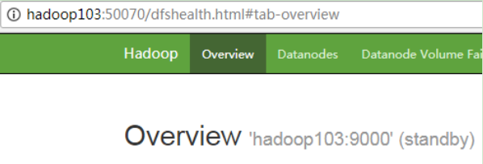

6. 在[nn1]上，启动所有datanode

   ```bash
   sbin/hadoop-daemons.sh start datanode
   ```

7. 将[nn1]切换为Active

   ```bash
   bin/hdfs haadmin -transitionToActive nn1
   ```

8. 查看是否Active

   ```bash
   	bin/hdfs haadmin -getServiceState nn1
   ```

### 8.3.6 配置HDFS-HA自动故障转移

1. 具体配置

   （1）在hdfs-site.xml中增加

   ```xml
   <property>
   	<name>dfs.ha.automatic-failover.enabled</name>
   	<value>true</value>
   </property>
   ```

   （2）在core-site.xml文件中增加

   ```xml
   <property>
   	<name>ha.zookeeper.quorum</name>
   	<value>hadoop102:2181,hadoop103:2181,hadoop104:2181</value>
   </property>
   ```

2. 启动

   （1）关闭所有HDFS服务

   ```bash
   sbin/stop-dfs.sh
   ```

   （2）启动Zookeeper集群

   ```bash
   bin/zkServer.sh start
   ```

   （3）初始化HA在Zookeeper中状态

   ```bash
   bin/hdfs zkfc -formatZK
   ```

   （4）启动HDFS服务

   ```bash
   sbin/start-dfs.sh
   ```

   （5）在各个NameNode节点上启动DFSZK Failover Controller，先在哪台机器启动，哪个机器的NameNode就是Active NameNode

   ```bash
   sbin/hadoop-daemin.sh start zkfc
   ```

   

3. 验证

   （1）将Active NameNode进程kill

   ```bash
   kill -9 namenode的进程id
   ```

​               （2）将Active NameNode机器断开网络

   ```bash
    service network stop
   ```


## 8.4 YARN-HA配置

### 8.4.1 YARN-HA工作机制

1. 官方文档
   http://hadoop.apache.org/docs/r2.7.2/hadoop-yarn/hadoop-yarn-site/ResourceManagerHA.html

2. YARN-HA工作机制

   

### 8.4.2 配置YARN-HA集群

1. 环境准备

   （1）修改IP

   （2）修改主机名及主机名和IP地址的映射

   （3）关闭防火墙

   （4）ssh免密登录

   （5）安装JDK，配置环境变量等

   （6）配置Zookeeper集群

2. 规划集群

   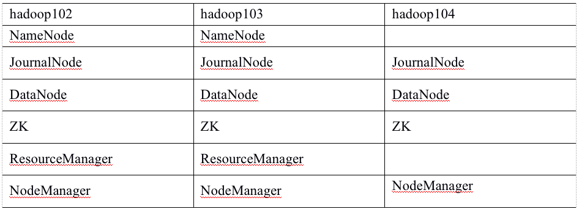

3. 具体配置

   （1）yarn-site.xml

   ```xml
   <configuration>
   
       <property>
           <name>yarn.nodemanager.aux-services</name>
           <value>mapreduce_shuffle</value>
       </property>
   
       <!--启用resourcemanager ha-->
       <property>
           <name>yarn.resourcemanager.ha.enabled</name>
           <value>true</value>
       </property>
    
       <!--声明两台resourcemanager的地址-->
       <property>
           <name>yarn.resourcemanager.cluster-id</name>
           <value>cluster-yarn1</value>
       </property>
   
       <property>
           <name>yarn.resourcemanager.ha.rm-ids</name>
           <value>rm1,rm2</value>
       </property>
   
       <property>
           <name>yarn.resourcemanager.hostname.rm1</name>
           <value>hadoop102</value>
       </property>
   
       <property>
           <name>yarn.resourcemanager.hostname.rm2</name>
           <value>hadoop103</value>
       </property>
    
       <!--指定zookeeper集群的地址--> 
       <property>
           <name>yarn.resourcemanager.zk-address</name>
           <value>hadoop102:2181,hadoop103:2181,hadoop104:2181</value>
       </property>
   
       <!--启用自动恢复--> 
       <property>
           <name>yarn.resourcemanager.recovery.enabled</name>
           <value>true</value>
       </property>
    
       <!--指定resourcemanager的状态信息存储在zookeeper集群--> 
       <property>
           <name>yarn.resourcemanager.store.class</name>     <value>org.apache.hadoop.yarn.server.resourcemanager.recovery.ZKRMStateStore</value>
   </property>
   
   </configuration>
   ```

   

4. 启动hdfs

   （1）在各个JournalNode节点上，输入以下命令启动journalnode服务

   ```bash
   sbin/hadoop-daemon.sh start journalnode
   ```

   （2）在[nn1]上，对其进行格式化，并启动

   ```bash
   bin/hdfs namenode -format
   sbin/hadoop-daemon.sh start namenode
   ```

   （3）在[nn2]上，同步nn1的元数据信息

   ```bash
   bin/hdfs namenode -bootstrapStandby
   ```

   （4）启动[nn2]

   ```bash
   sbin/hadoop-daemon.sh start namenode
   ```

   （5）启动所有DataNode

   ```bash
   sbin/hadoop-daemons.sh start datanode
   ```

   （6）将[nn1]切换为Active

   ```bash
   bin/hdfs haadmin -transitionToActive nn1
   ```

5. 启动YARN

   （1）在hadoop102中执行

   ```bash
   sbin/start-yarn.sh
   ```

   （2）在hadoop103中执行

   ```bash
   sbin/yarn-daemon.sh start resourcemanager
   ```

   （3）查看服务状态

   ```bash
   bin/yarn rmadmin -getServiceState rm1
   ```

   


## 8.5 HDFS Federation架构设计

1. NameNode架构的局限性

   （1）Namespace（命名空间）的限制

   由于NameNode在内存中存储所有的元数据（metadata），因此单个NameNode所能存储的对象（文件+块）数目受到NameNode所在JVM的heap size的限制。50G的heap能够存储20亿（200million）个对象，这20亿个对象支持4000个DataNode，12PB的存储（假设文件平均大小为40MB）。随着数据的飞速增长，存储的需求也随之增长。单个DataNode从4T增长到36T，集群的尺寸增长到8000个DataNode。存储的需求从12PB增长到大于100PB。

   （2）隔离问题

   由于HDFS仅有一个NameNode，无法隔离各个程序，因此HDFS上的一个实验程序就很有可能影响整个HDFS上运行的程序

   （3）性能的瓶颈

   由于是单个NameNode的HDFS架构，因此整个HDFS文件系统的吞吐量受限于单个NameNode的吞吐量

2. HDFS Federation架构设计

   能不能有多个NameNode

   

   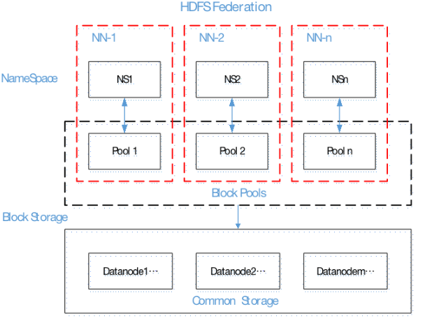

   

3. HDFS Federation应用思考

   不同应用可以使用不同NameNode进行数据管理

   ​		图片业务、爬虫业务、日志审计业务

   Hadoop生态系统中，不同的框架使用不同的NameNode进行管理NameSpace。（隔离性）

